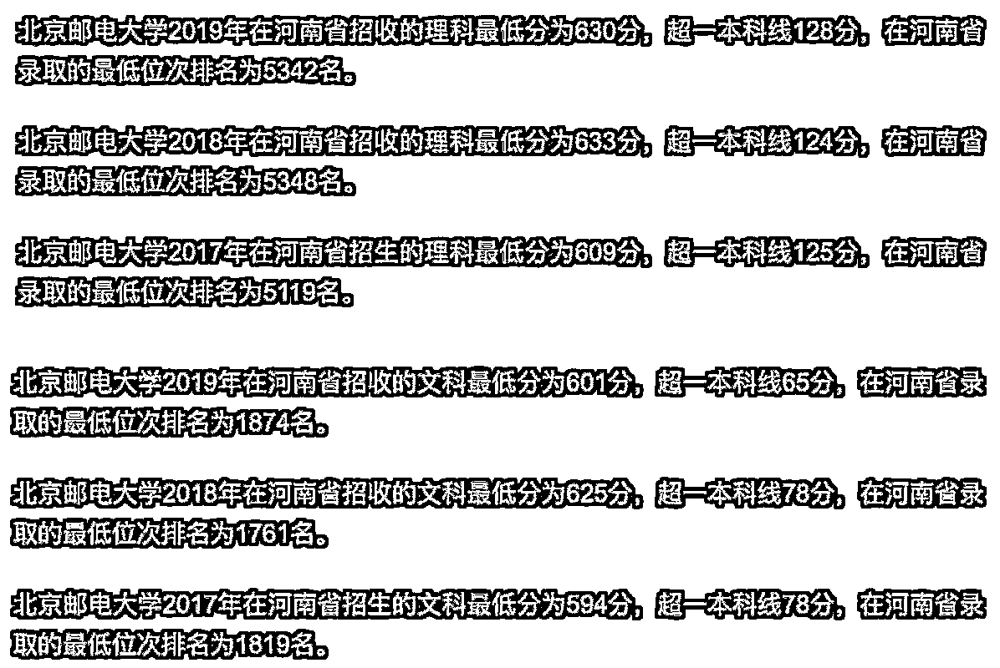
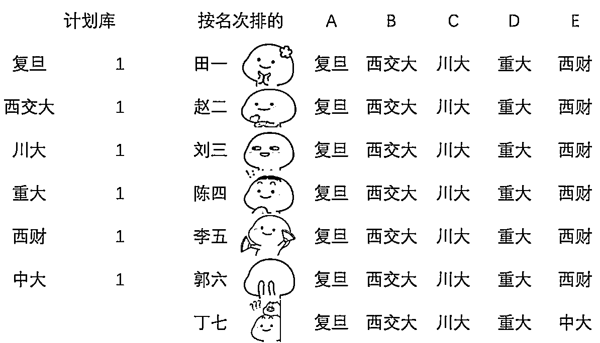
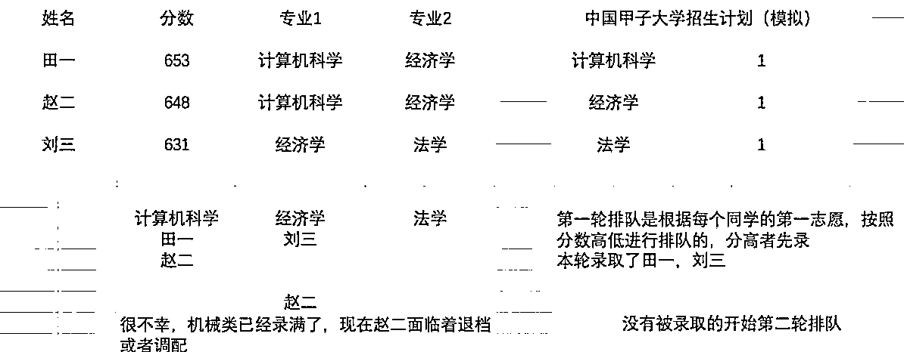
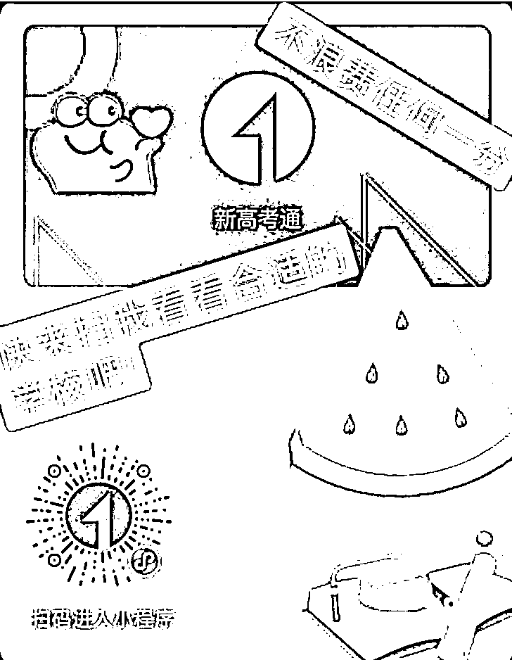

# (23赞)高考志愿填报这门生意分析

作者：  沐沐春风

日期：2021-06-23

每年会有大量的高考同学需要填报志愿，翻看每个学校录取手册大大的厚本，实在是费力不讨好。

市面上有很多教同学们填报志愿的，不管是抖音店还是别的渠道，但志愿填报是重要的事情，一般情况下消费者买过卡以后也希望可以联系到相关报考老师来进行咨询。

于是乎有了本篇，今年我做了了高考志愿填报的腾讯高考通，利用高中老师的人脉同时也开拓了自己闲鱼，微博，还有别的平台来卖货。为了介绍自己的产品，自己专门研究了如何填写资源才不会浪费每一分。

（本篇帖子未完待续，这是一张查看自己的省内排名的二维码，需要同学们用手机号注册查看，每个同学一次机会）

同时也欢迎大家把本篇转给需要的人，大学四年的决定真的很重要！

**6**千字吐血整理**---**高考志愿填报！！！

又是一年高考季，不管同学们考了多少分，现在需要注意的是：如何填报志愿才不会浪费自己辛辛苦苦考出来的分数？

每个学子要回答的三个问题：

**1. ** Who---我是谁？我的基本情况怎么样？家庭背景如何？

**2. ** Where---我想读什么专业？我想去哪里念书？

**3. ** How---我怎么填报才能去我喜欢的城市念我喜欢的学校专业？

分数可以大致帮咱选出一个大概的学校范围，那么我们如何根据自己的家庭背景，兴趣爱好和家族发展来选出具体的学校和专业来帮助自己以后的职业发展呢？

不着急，我们现在认真回答一下这些问题：

**1. ** 我的分数如何？（大致在什么名次？

**2. ** 我的身体状况如何？（有没有不宜就读，不建议录取的专业？

**3. ** 我在哪个省份？是少数民族地区吗？我是少数民族吗？（有没有相关的加分政策和优先录取的学校专业？

**4. ** 家里的经济条件怎么样？  （有些学校适合出国，或者所在地区生活水准高，自己家里的条件能不能接受？

**5. ** 父母的职业发展怎么样？  （有没有对自己以后就业有帮助的就业攻略？

**6. ** 家里的亲戚朋友怎么样？都在哪些地方发展？可以为我提供什么帮助？（比如想在南方发展的同学想一想自己家里有没有在当地落户的亲戚，都是做什么的？

然后我们一个问题一个问题来进行拆解：

一

我的分数如何？（大致在什么名次？

这里我们需要用两个概念来确定自己的层次：

排位，线差

从高往低讲，超高分数段是能够上C9联盟高校或者同位次高校的分数：

这些学校有：清华，北大，复旦，上海交通大学，南京大学，浙江大学，中国科学技术大学，哈尔滨工业大学，西安交通大学

然后是高分段（本科一批）：超高分数下可以上双一流重点学科建设高校或同位次高校的分数

接着是中分段（本科二批）：可以上非双一流非211的普通本科学校的分数

最后是低分段（专科录取）：顾名思义，可以上专科的分数

以下的填报，我用自己可以找到的数据来作为指导：

调档分：是高校将你的档案提走的最低分数线  （这个是每个分数段都应该注意的！忽视有落榜风险

调档分位次：也就是一所学校录取的最后一名的名次（这点考虑哦，一分可以错开好几百名呢

调档本一线差：该所学校录取的最低分数高于本一多少分

调档本二线差：该所学校录取的最低分数高于本二多少分

好了，现在我们点开每个学校的近年的招生数据，在这里我们用北京邮电大学举例：

普通二本类似

调档的分数，线差，名次可以帮助我们交叉验证自己能不能上这所学校，这里收住，我们下面慢慢解释。

二** **

高考体检的健康情况怎么样？

军队，武警，司法警官院校这些学校对于同学的身体素质要求高，具体的体检结果以高考指定医院的体检结果为准；有任何标注的地方都要仔仔细细查看，如果不明白，一定要查看指导文件---

《普通高等学校招生体检工作指导意见》

这个同学们可以用省名**+**《普通高等学校招生体检工作指导意见》来进行查找，比如河南省《普通高等学校招生体检工作指导意见》

三

少数民族地区考生**/**少数民族地区

每个地方的高考政策不一样，比如少数民族地区或者少数民族地区的汉族考生，可能会享受到加分政策（同时可能会有优先录取哦）

少数民族还可以选择少数民族预科班，这个比较常见于民族类院校，需要查看各高校招生计划

四

家里经济条件怎么样

不得不承认的是，如果家里有矿，选择范围会宽很多，比如好学校的中外合作办学，虽然每年万元以上的学费很高（部分高达十几万），但学校的地理位置好，师资强，同学也不错，而且这所学校的历届毕业生就业/考研/留学情况都非常不错，在家庭可以承受的情况下选择中外办学对同学发展是很有好处的，以后的选择范围宽，大概率可以选择

好学校的优势专业（真的是除了贵没毛病

不过这里也要考虑到家里没矿，甚至上学困难的同学！这种情况下我们要万分留意各种优惠政策，因为在现行的国家招生体系下，国家政策不会让任何一个同学因为没钱而念不下去书，不仅仅大学里设置有贷款，助学金，校内工作，学费减免的机会，而且同学可以先录取后，选择当兵两年自己来赚学费和生活费（没错，这条路是可选的）五

父母的基本情况

其实很多父母是可以给孩子提供帮助的，只不过大部分孩子和家长并没有意识到，尤其是中产家庭出身的孩子，在这种情况下，我们可以考虑什么呢？

① 爸妈的职业发展路径是什么？

② 如何站在爸妈的肩膀上得到更好发展？

中产阶级的孩子，不少是爸爸妈妈在自己业内都是很厉害的角色，有的是律师，有的是医生教师等等，每个行业有每个行业的难处，所以很多爸妈不希望孩子吃自己一路跋涉过来的苦，在孩子选择专业的时候，不建议孩子选择爸妈的专业，其实这样考虑是欠妥的，因为爸妈一路经历过来的经验，让他们明白在业内出类拔萃的重要节点在哪里，以及哪个地方可能会遇到困难，这就直接让他们的孩子有一个别人无可比拟的优势----专业就业攻略/职场指导，以后孩子遇到什么困难的时候，爸妈知道怎么帮助孩子，而不是让孩子一人在职场上摸爬滚打碰一鼻子灰。

下面呢，我们可以用几个具体的例子来做说明：

小冰：小冰是今年高考的应届生，本书刚刚过本二30分，爸妈都是普通的公务员，妈妈在食品药品监督管理局工作，爸爸在司法机关从事行政工作，从事三十余年的工作，积累不少人脉，家里小有积蓄，在二线城市是个中产。

现在面临在二本里面选专业的问题，小冰同学各个科目平平，没有严重偏科现象，结合爸妈的情况，建议小冰选择三不限的专业，这些专业考公的选择范围广，没有专业的限制，同时建议小冰选择距离家较近的学校，一方面省内录取分数比省外同等优惠，另一方面上学方便，平时有事可以回家。

小芳：小芳是今年高考的一本理科生，她的分数刚过一本线30分，因为自己平时对于专业的了解不多，现在报考的时候会先看看热门专业比如金融，财会这类“应就业”的专业，但她的分数没有很高，对于一些好院校中的强势经管专业，并不能保证稳妥的录取。  在填写专业的时候，小芳忘记了一件非常重要的事情---她的妈妈是三甲医院的针灸推拿科的主任，自己从业的时候积累了不少关键的人脉，可以对孩子的以后的就业有巨大的帮助！而这一点小芳和小芳妈妈都没有意识到！从职业发展规划上，最后建议孩子报考中医药大学的针灸推拿专业，而小芳入学以后，也对自己的专业非常满意。

小波：小波是理科考生，学习成绩还不错，今年的高考分数可以上985，但是在专业选择上因为没有自己明确的喜好所以迟迟不能定下来填写什么专业，据了解，小波的爸爸是酒厂的老板，家里从事葡萄酒酿造的生意已经很多年了，酒厂里有经验非常丰富的老师傅，在这种情况下，小波选择985院校中的酿酒相关的专业就是非常不错的选择---比如中国农业大学的酿酒专业，西北农林科技大学的葡萄与葡萄酒工程，这些专业和小波的家庭背景高度吻合，而且小波爸爸可以提供酒类的专业技术知道还有销售帮助，后来小波也选择了这个专业平时在学校跟着老师学习基础，放假回家跟着厂里老师傅学，小波对自己的专业非常满意。

我们的选择是这三个的总和：

爱好，价值观，能力这三者的交集地方，但现实生活中，很少有人可以同时满足这三个要求，更多时候是这三个中挑选对自己最重要的来选

出了分以后，可以以终为始来选择学校---

**1. ** 首先根据自己的分数确定下来可以上的学校范围

**2. ** 看一看这些学校的专业都有哪些？（这里注意一下，一定要特别注意自己不能接受的专业

**3. ** 一个一个去了解这些专业  （这些专业培养了什么人才？  他们以后的职业发展规划是？

**4. ** 问一问自己的身边的亲戚朋友，当年学了什么专业？自己毕业后又有什么机会？

**5. ** 去微博，知乎，贴吧等等地方问一问自己的师哥师姐的就读体验，他们还是很热心的

首先自己的专业要遵循自己的爱好和特长  （比如考古专业

选择学校尽量靠近自己以后想要就业的地方（比如有些同学想在学校所在地落户想出门读书的同学首选京津冀，包邮区这些发达的地方

想在家附近念书的尽量选择中心城市及其附近的高校

选择专业跟随国家大力发展专业（参考十四五规划中的：新能源，新材料，人工智能等高分考试和低分考生选择专业的时候应该有不一样的就业思路

想考研的同学要把学校的学风（考研率作为重点选校的指标，比如在山东的曲阜师范大学，25%左右的考研率妥妥拉开一众二本院校，河南的河南师范大学考研率23%也是不错的选择

大写加粗注意事项：

这些文件你一定要看！而且要在自己当地的政府官网里面可以查到！

**1. ** 各考试院出台的当年的《招生工作实施规定》

**2. ** 各高校的《招生章程》

办学类型，专业录取规则，专业志愿要求，单科成绩要求，加分降分规定，口试面试说明，外语语种限制说明，身体和特殊要求（比如视力要求），奖学金助学金贷款的说明等；

服从调配的说明（是不是达到最低录取分数线服从调剂就不用退档了，这个要重点关注）

**1. ** 招生计划

**2. ** 《普通高等学校招生体检工作指导意见》

**3. ** 《军队和武警部队院校招收普通高中毕业生面试体检工作考生手册》

**4. ** 《公安普通高等院校公安类专业招生面试，体检，体能测评和政治考察工作方法》平行志愿投档是什么？

平行志愿投档原则是“位次优先，遵循志愿，一轮投档”，也就是说同一颗雷某批线上按考生投档分从高分到低分排序，确认位次，然后按照位次逐个检索考生所填的志愿院校。经检索到符合投档条件的院校，即投档到该院校，平行的后续志愿将终止检索，一轮投档就结束了。

以下我们用一张表格来做志愿投档的模拟：

如上，现在有7位同学填报了一样的录取学校，每个学校的招生计划都是1人，好学校根据名次优先录取，现在假设这7位同学都是服从调剂的，开始录取----

每个同学的志愿检索都是从A开始，依次是BCDE

田一  被复旦录取，志愿检索到了A （复旦录取满了，不再检索下一个同学的档案赵二  被西交大录取  ，志愿检索到了B （西交大录取满了，不再检索下一个同学的档案刘三  被川大录取  ，志愿检索到了C （川大录取满了，不再检索下一个同学的档案陈四  被重大录取，志愿检索到了D （重大录取满了，不再检索下一个同学的档案李五  被西财录取 ,志愿检索到了E （西财录取满了，不再检索下一个同学的档案这时候郭六和丁七还没有被录取，郭六的投档线过了西财的投档线，学校保证投进来不退档，这时候郭六可以等待征集志愿或者下一批次的录取，丁七因为自己的最后的志愿填了中大，中大确实还有一个剩余的名额，程序把丁七的档案投到了中大。

从上面的例子中我们可以真实看到是怎么样的录取过程，以及有志愿有梯度的重要性---丁七如果没有填报中大，就只能等待下一批次的录取。

所以我们需要注意这两个事项：

**1. ** 正常的落榜风险依然存在，合理填报/服从调配可以大大减少这个风险**2. ** 平行志愿中一定要注意梯度差，冲刺学校---稳投学校---保底学校  一定要合理利用好每个志愿填报的机会

看完了上面的投档，现在我们来看一看高校的录取规则：

**1. ** 专业优先

**2. ** 分数优先

**3. ** 专业极差

每个学校的招生章程里都会有这个----对进档考生专业的安排方法：

（具体可以查看具体的学校文件，下面用最常见的来举例

对本科普通批次进档考生，按照“专业志愿清”方式来进行录取，每个专业之间没有分数级差---满足了思想政治品德考核，身体健康状况合格的考生按照“专业志愿优先”来安排专业，同一志愿从高到低分数录取，如果不服从调剂，做退档处理

下面我们模拟一个学校的录取：

（补充一个概念：专业级差  上面的第二轮排队的时候，赵二同学的分数需要减两分左右和别的同学一起排队）

上面两张表示每个同学的基本情况+学校的招生计划，下面是程序模拟录取

现在我们对比完第一志愿第二志愿的录取，开始分数优先的录取模拟，由上图所示，分数从高到低依次是：田一，赵二，刘三，那么志愿的录取顺序就是这个顺序，录取结果如下：

田一------计算机科学  （分高者先录

赵二------经济学  （计算机科学已满，经济学有空缺

刘三------法学  （经济学已满，法学有空缺

如何利用分差，线差来为自己选取三个档次的学校呢？

我们依次来解决一下问题：

利用线差，位次来研究自己的录取的可能性有多大？

拉开志愿梯度的“冲稳保”原则？

高校录取的大小年怎么把握？

志愿填报里的勾选，怎样对待？

现在我们有了数据库，不需要一页一页来翻书查找数据指导自己的填报，我们也模拟一位同学来进行志愿填报：

华晶晶同学，今年的河南地区理科考生，实际分数580分，高出一本线80分，全省排名15900名，非少数民族或者少数民族地区考生，体检报告有近视----不予录取4，5，不建议就读4，专业方面结合家庭背景侧重于化工专业，理工科没有强烈不想就读的专业，因为从小到大都在家念书，上大学想要去外面看一看，首选京津冀和包邮区的学校，家庭条件一般，不考虑中外合作办学，公办院校优先。

因为视力问题不宜就读/不予录取的专业有下：

　一、有下列视力问题考生，不宜就读的专业

1、屈光不正（近视眼或远视眼）任何一眼矫正到4.8，镜片度数大于400度。

不宜就读：海洋技术、海洋科学、测控技术与仪器、核工程与核技术、生物医学工程、服装设计与工程、飞行器制造工程。

2、任何一眼矫正到4.8，镜片度数大于800度。

不宜就读：地矿类、水利类、土建类、动物生产类、水产类、化工与制药类、武器类、医学类、心理学类船舶与海洋工程、生物工程、动物医学等专业。

　3、一眼失明另一眼矫正到4.8，镜片度数大于400度。

不宜就读：医学、法学各专业及应用物理学、应用化学、生物技术、地质学、生态学、海洋科学、生物科学、应用心理学等专业。

二、有下列视力问题者，学校有关专业可不予录取

1、轻度色觉异常（俗称色弱）不能录取的专业

药学类、生物科学类、公安技术类、地质学类各专业，医学类等专业。

2、色觉异常Ⅱ度（俗称色盲）不能录取的专业

除同轻度色觉异常外，还包括美术学、绘画、艺术设计、摄影、动画、博物馆学、应用物理学、天文学、地理科学、应用气象学等专业。

3、不能准确识别红、黄、绿、蓝、紫各种颜色中任何一种颜色的导线、按键、信号灯、几何图形者，不能录取的专业

不能准确在显示器上识别红、黄、绿、兰、紫各颜色中任何一种颜色的数码、字母者不能录取到计算机科学与技术等专业。

4、  裸眼视力任何一眼低于5.0者，不能录取的专业

飞行技术、航海技术、消防工程、刑事科学技术、侦察。专科专业：海洋船舶驾驶及与以上专业相同相近专业（如民航空中交通管制）。

然后我们开始自己的志愿填报，先是冲刺档：

冲刺的学校需要是那种自己踮起脚尖可以够得到，而且服从调剂的专业没有自己坚决不能接受专业的那种学校（举个反例：一所学校的最低录取分数高于你3分，或者学校可以够得到，但是冷门专业里的病理学是你坚决不想上的专业  这两个情况出现任何一个，都要果断放弃）

然后我们点开腾讯高考通：

选择好自己的分数和地区以后，出现这个---

我们直接看  理科最低分和最低位次  来确定自己的填报，在冲刺的学校里面，我们需要确保自己的分数满足冲刺校的最低要求，如果可以接受冷门专业的话，高分段同学多加2分来看学校也是可行的，也就是我们考了580，可以当做582来对待，在冲刺的学校里面呢，这里有以下小小建议：

**1. ** 问一问这个学校的第二专业都可以选什么专业

**2. ** 重点看一下学校的位置，是不是自己想要就业的城市

有了冲刺的院校，我们现在可以点开较稳妥的来进行填报，在这里我们需要看院校的优势专业，来进行选择，可供参考的指标如下：

近5年调档本一线差----确保自己大于这个差

近5年平均本一线差----每年大概比一本线高多少分

近5年调档分位差----不满足这个要求就换一个学校

近5年平均分位次----看看自己是不是在这个范围

遇到院校大小年怎么办？

大小年的意思就是某年扩招，某年少招，这个时候分数虽然看，但名次更重要，如果我们在65000名左右，需要确定的是我们要填写的学校今年录取多少人？大概都在什么名次？

两个问题有了确定答案，才不会浪费志愿填写。

最后一个是保底院校，就是比我们分低的录取院校，这个时候我们有学校上，重点确定喜欢的专业就可以了。

比如我们的华晶晶同学，她的爸爸在政府机关工作，妈妈在企业里做财务工作，她本身比较倾向考公，所以她的专业大于学校的选择，学校的位置距离家远近没问题，出门念书的话，希望在南方的发达城市，于是，华晶晶的最终选择是这三所：

（冲刺）天津商业大学---经管类专业，服从调剂（直辖市，考虑大二辅修经济学或者法学

（稳妥）齐鲁工业大学---法学  （考公好专业，学校在济南，学习氛围好

（保底）河南科技学院---计算机科学与技术（离家近，学校学习氛围好

以上，就是本文的全部啦！

6481字，看完的你也很厉害哦！

附上腾讯高考通体验二维码，选择自己喜欢的学校，地区和专业，快来看看自己的录取概率吧！

（没有开通VIP只能查看部分院校，为了让大家有更好的填报志愿体验，购买后我提供填报咨询服务）

评论区：

依依na : 您好，想请问下如果想兼职高考志愿规划或填报工作，有相关课程培训么[愉快]

沐沐春风 : 你好，这个是付费的VIP，如果咱们报考需要数据库可以自行购买，我这边没有课程，可以提供相应咨询服务[呲牙]

依依na : 谢谢大佬回答，可以加您微信请教么

沐沐春风 : 没问题 CQXchen
