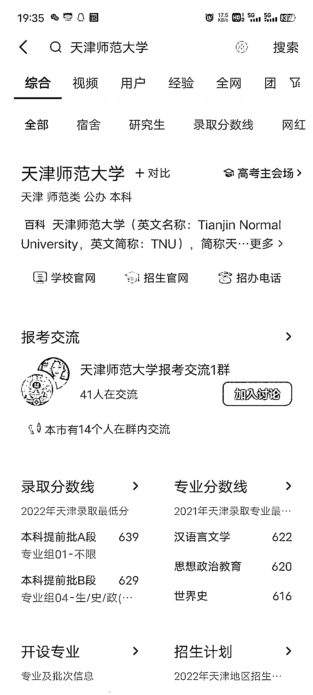
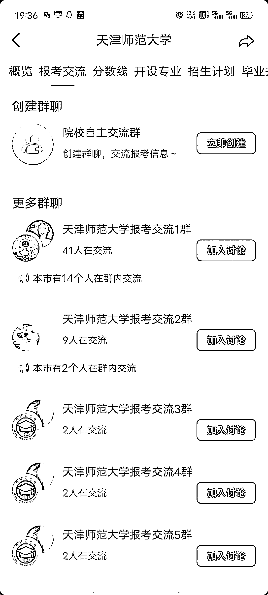

# (精华帖)(88赞)高考生查询和了解意向报考学校将会用各种公域平台

作者：  安慕希姓安（大学生资*

日期：2023-05-31

高考即将来临

然而紧接着就是全国各大高校的招生阶段了

高考生查询和了解意向报考学校将会用各种公域平台

做过高校社群的都知道，以前的社群全部集中在qq群，得新生群流量者就相当于得到了能产生十几种变现得种子客户

今年抖音开始出现了报考交流群，这也就说明今年得新生公域流量很大一部分将会从抖音中引导而出，然而这个新生群是每个人都可以自己建得，排名肯定是根据活跃和算法进行排名，大一新生的变现价值我就不一个一个细讲了，有想法做高校新生流量得可以开始布局了

评论区：

小沐鱼 : 小白想请教一下，大一新生的变现方式都有哪些呢？变现价值为什么大？求指点！[抱拳][嘿哈]

小野 : 驾照，床上四件套，知识付费

小沐鱼 : 好嘞，请问驾照是怎么个操作法啊？

小野 : 和当地驾校合作，你负责引流赚佣金，他负责收学员

小沐鱼 : okok，懂了！感谢！

马虎驴 : 都是我们团队抢注册的  哈哈哈哈哈

马虎驴 : 这个排名是根据创建时间来的  目前来看和人数及活跃没有关系  不知道后面会不会变动

亦仁 : 中标，术值+1。

在上方专栏点击 #中标，可查看所有中标风向标。
