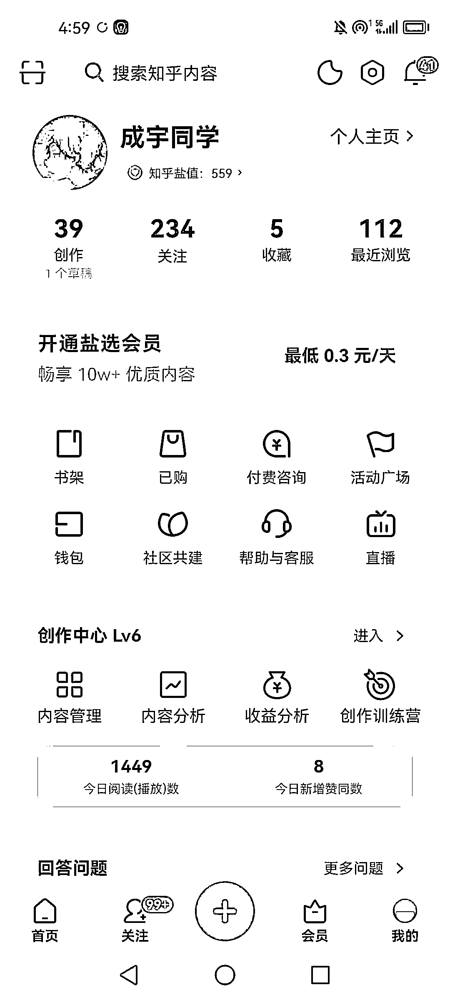

# (151 赞)知乎目前流量很强，可以从高三即将步入大学的学生这边找突破口

作者：  郭成宇

日期：2023-05-25

知乎目前流量很强，特别是想要做大学生领域的圈友。可以从高三即将步入大学的学生这边找突破口。

在知乎上撰写你的大学成长经历经验、高中生步入大学应该怎样做？有什么注意事项？

等等

给对大学认知尚浅的高三同学建立基础认知，可引流一批非常精准的准大学生流量。

现在就可以开始布局，六月高考结束需求将达到顶峰，能引流一大批准大学生流量。

图下是我的知乎账号（成宇同学），可参考我的文章逻辑。

评论区：

果冻 : 内容写的真不错[强]

郭成宇 : 哈哈哈这是两年前写的，当时还是大一[可怜]

亦仁 : 中标，术值+1。

在上方专栏点击 #中标，可查看所有中标风向标。

挽歌 : 感谢哥的分享！对我很有价值！

挽歌 : 已赞赏，请哥喝杯奶茶~

郭成宇 : 谢谢挽歌大佬，一起进步[玫瑰]

BeCa 公主 : 请教大佬，请问说的流量，意思是知乎年轻的这个群体的流量更多的意思还是，这是其中的一个流量群呢？

BeCa 公主 : 对于我是重要的信息，感谢分享
