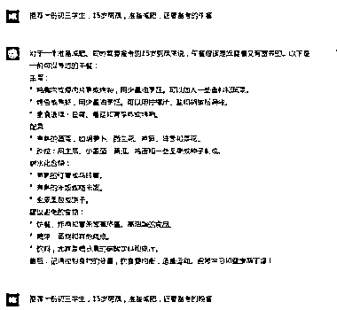
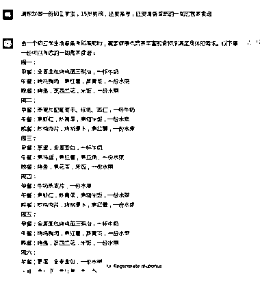
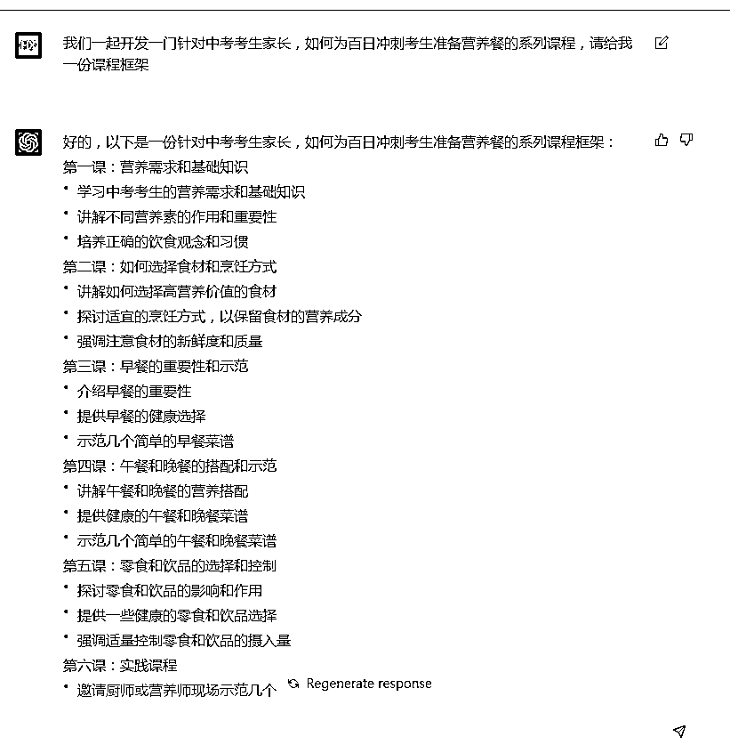

# (50 赞)针对要中考、高考学生定制营养食谱课程

作者：  石头

日期：2023-03-08

（少儿探索科学实验室共创  风向标）

缘起：家中老大要备考中考，又要减肥，很矛盾（需求）

万事不决问 ChatGPT:给出图 1、图 2 的答案，一看感觉还挺靠谱，可以媲美相当一部分所谓的营养师了；

联想需求：马上中考季，多数家庭应该都会面临这个问题，哪怕不减肥，但是如何让孩子吃的健康，有营养？

客户群体:不管是中考学生、还是高考学生，都是家中眼中的宝贝疙瘩，都是极大的痛点，急需，刚需，市场巨大，只选贵的，不选对的；

产品：

1.定制食谱；（ps：这块也可以发散一下和一些健身俱乐部结合，给他们提供营养食谱，省下一个营养师的工资）

2.针对要中考、高考学生的营养食谱课程，直接在线陪跑，付费社群；见图 3 3.针对高净值人群，甚至可以 1v1 来指导；

变现渠道：

1.抖音、快手、视频号直播引流，打赏一杯奶茶的钱，可以定制一份食谱；主要针对家长人群；

2.小红书引流，提供营养食谱  主要针对有营养餐需求的年轻群体；

3.前期通过社群引流的家长社群，人群比较精准，可以根据相关筛选，来做二次客户开发，比如  高考志愿填报  高一辅导班，教辅材料售卖，以及大学生相关产品。

 

评论区：

亦仁 : 中标，术值+1。

在上方 #星球栏目  专栏中，点击 #中标，可查看所有中标风向标。

希声 : 很有意思的切入点
