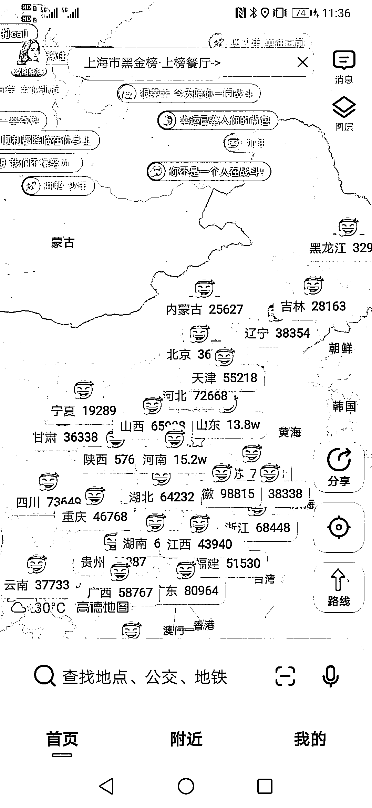
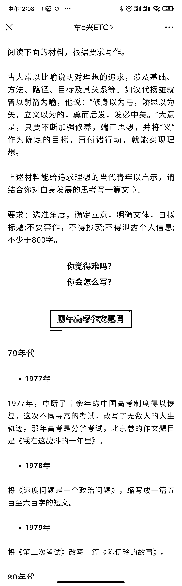

# (6赞)高考的流量，在各个应用、自媒体所有行业均可以试用

作者：  懒

日期：2021-06-07

高考  ，这个流量，各个应用  自媒体所有行业均可以试用，例如高德地图  加油💪，短视频的详细解说，公众号的历年回顾，延伸可以做抽奖，评论有礼，可以引流到微信，后续，高考完，学生的假期，业务延伸驾照，旅游，毕业照，聚餐饭店行业，也可以做高考志愿指引，对接互联网资源。

评论区：

懒 :

格律塔林·大梦 : [强]

亦仁 : 中标。

点击帖中中标标签，可查看所有中标风向标。

或在置顶帖中，点击#中标  标签可直达

懒 : 感谢
