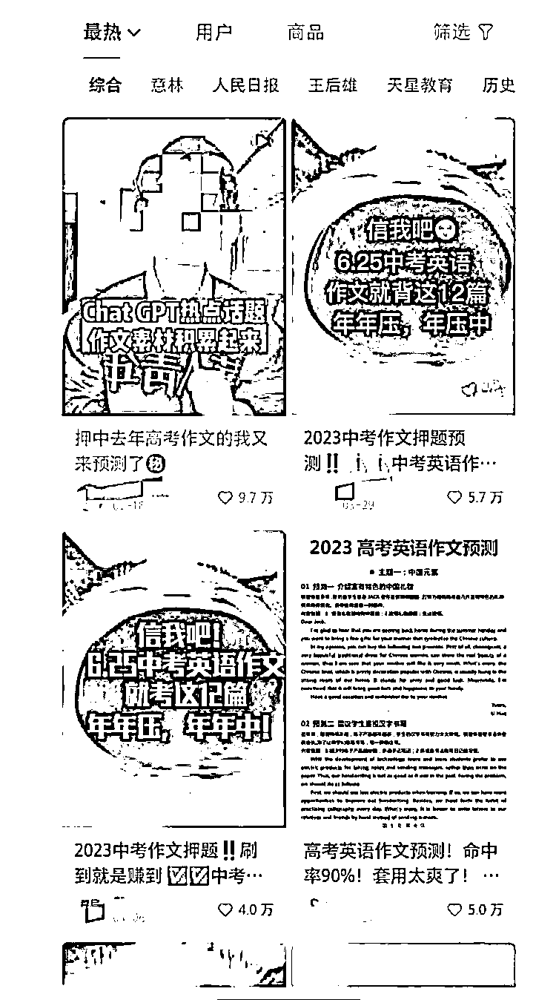

# (10 赞)高考、中考临近，小红书上押题题材引流效果不错

作者：  阿迪

日期：2023-06-05

临近高考、中考，押题题材也热起来，引流效果不错，小红书上热门贴不少。

评论区：

夏林 : 需要相关资质，不然笔记会被禁

MR.王 : 就是啊，每次发出来小眼睛一冲就被违规。无解的感觉

夏林 : 办一个教育咨询相关的营业执照就可以了

MR.王 : 谢谢，就是要 600 米么

阿迪 : 感谢提醒[强]
