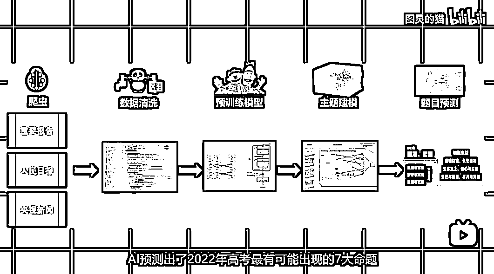

# (9赞)B站UP主利用AI预测2022年高考作文题，可广告合作与教育机构合作，具体玩法揭秘

作者： melisa

日期：2023-06-05

B站UP主“图灵的猫”发布了一则关于 AI预测2022年高考作文题，利用chatgpt API接口实现，这玩法可以通过作文题预测+范文引流，可以广告合作，与教育机构合作，可以开发应用，给考生或家长使用。

具体玩法在：https://www.sohu.com/a/553114819_121124286

 

评论区：

暂无评论
