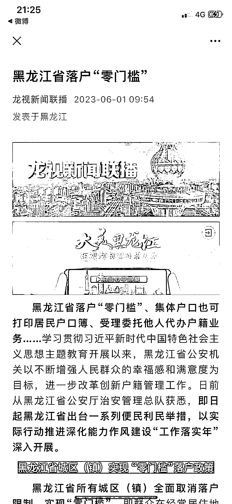
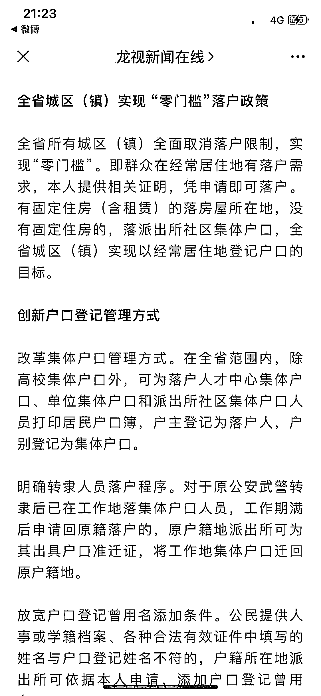
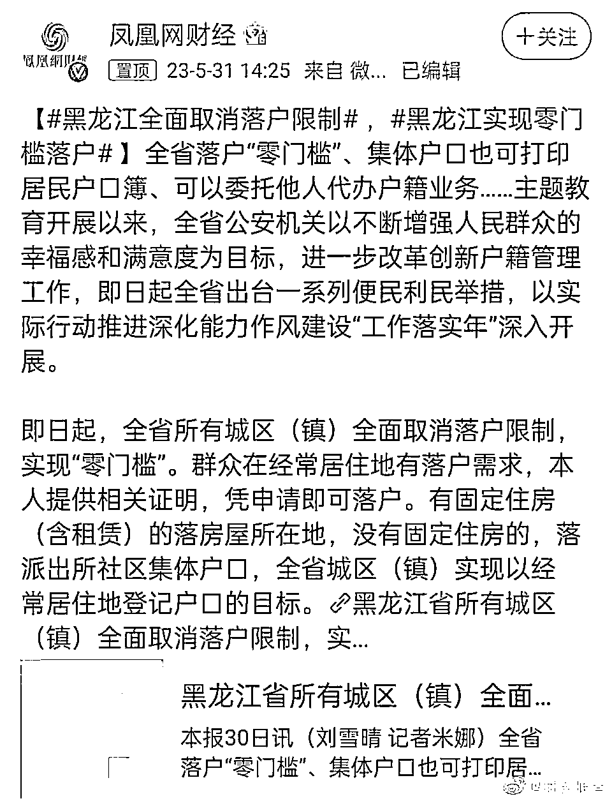
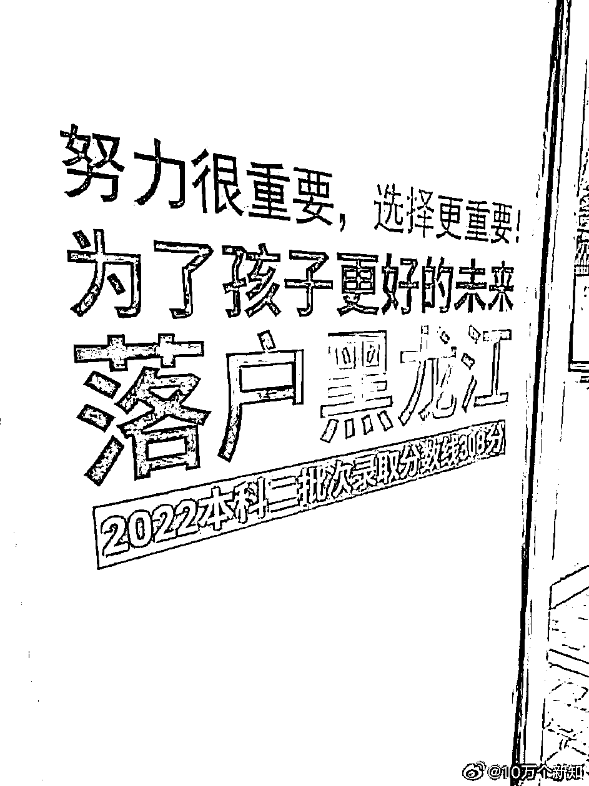

# (13 赞)对于黑龙江省外，尤其高考大省，也许是提前选择布局的一个机会

作者：  粉条 Annie

日期：2023-06-01

距离高考不到一个周的时间，也就是这两天，黑龙江省出了落户新政，全省所有城区（镇）取消落户限制，在黑龙江省内有经常居住的需求即可落户。

对于黑龙江省内非哈尔滨户口，落户哈尔滨更容易了。对于黑龙江省外，尤其高考大省，也许是提前选择布局的一个机会，而且这个机会比以往更容易实现，要知道去年黑龙江二本分数线 308 分，同样四五百分，有些省份上大专甚至上不了大专，在黑龙江甚至是一本线。

评论区：

粉条 Annie : 这条不中标也没关系，主要是最快半年内，可能会操作这个事情
