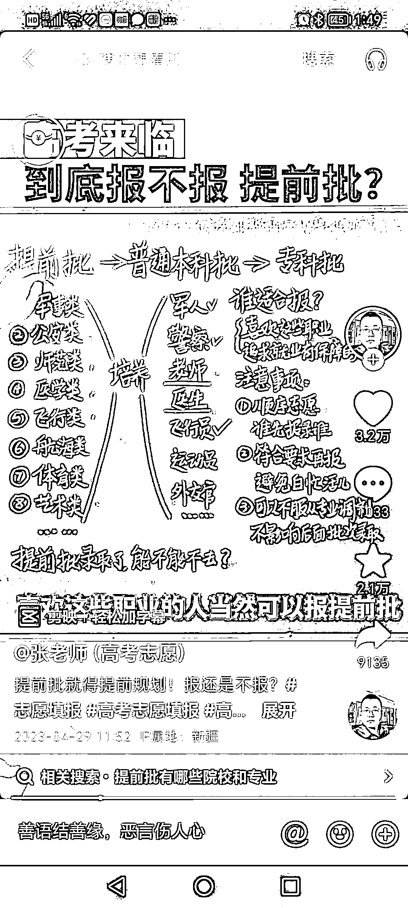
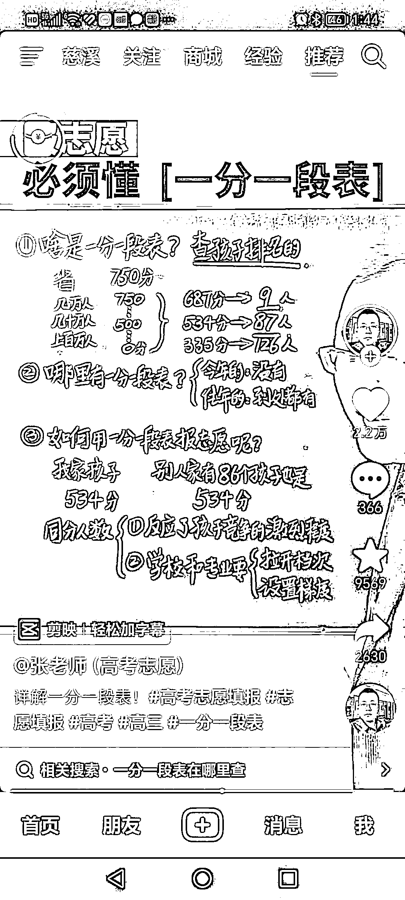
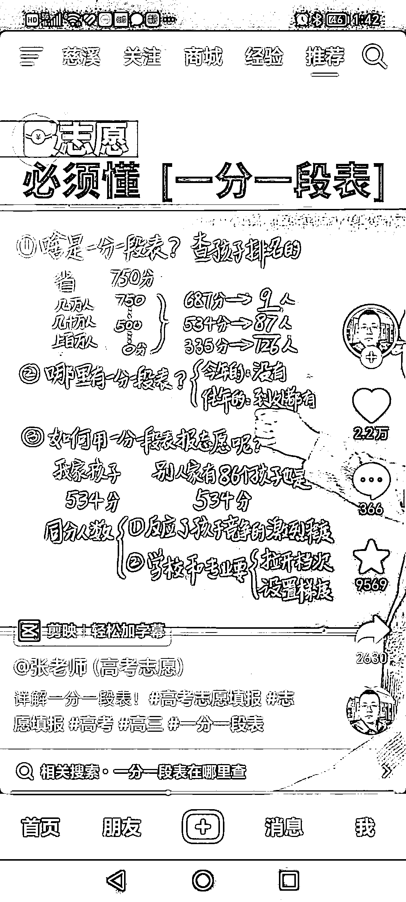

# (11赞)教高考报志愿直播间，用最原始的小黑板粉笔进行讲解，点赞评论量都相当高

作者：  远方

日期：2023-05-10

各平台开直播知识付费是热门，为了竞争，直播间为方便直播各种高科技也是五花八门。今天刷到一个教高考报志愿直播间，反其道而行之，用最原始的小黑板粉笔进行讲解，点赞评论量都相当高。翻了他以往的视频，以前播主也用过电子活动板，但都没小黑板点赞量高。感觉这是一种很好的方式，原因有3

1.还原真实教学场景，观众一看到黑板，自然把自己代入到学习状态，认真听讲，增加观看时长。

2.想学报志愿的都是70 80后，看见黑板这种原始的方式是不是更有亲切感。

3.用黑板来呈现教学内容，比起其它高报播主单纯坐在镜头前口播，是不是更易于内容呈现，知识点一目了然。

这种直播方式是不是可以借鉴到其它知识付费或卖资料的播主身上，将当天要讲的知识点呈现在黑板上，是不是更容易引起观众要想认真学习的心理暗示。如果面对的是40岁以后的观众估计效果更佳。

评论区：

暂无评论
