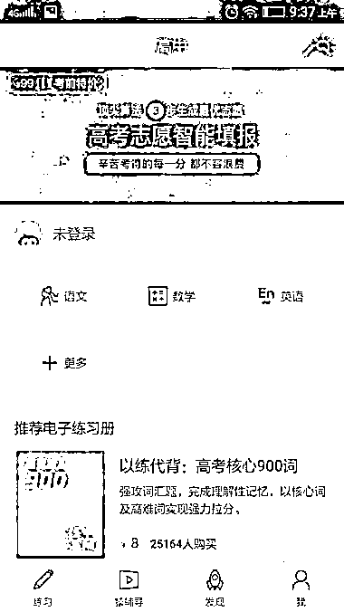
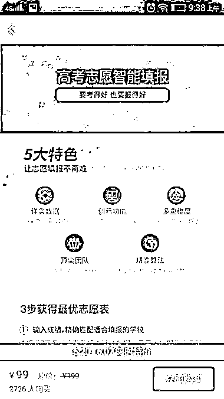
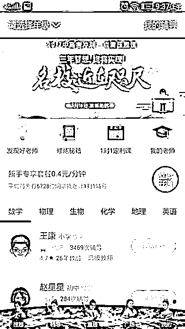

# (精华帖)(16赞)各类app如何蹭高考热点

作者： niege

日期：2017-06-05

看到张五哥提到了高考报志愿的工具，这几天还真看到了有。

前几天因为自己小密圈的一个伙伴提到了「猿题库」，才发现有一类像驾校宝典的app，只是这个是服务于中学生高学生的，看下载量和使用量，流量非常大，功能也非常全，完全打破了我以前对中学不容许学生用手机的认识，感觉自己快out了😂

图片1是「猿题库」的，有主要功能有练习册和猿辅导，都是收费的，据小密圈的那个小伙伴说，猿题库出题给学生练习，然后从海量数据里将易错的总结起来出练习册卖给学生，各种类型练习册的交易量都是几万几万。猿辅导则是老师在线视频讲解，简直暴击那些线下辅导班。

图片2就是张五哥提到的高考报志愿工具，猿题库这种蹭一下再合理不过，这种事，对于好不容易高考完了的说，只要有一点参考价值，学生和家长们都不会在乎这个钱，所以图里99这个价有几千的付费量也很正常。

类似的app还有不少，如图片3的「阿凡题」，还有学而思网校、芥末堆、作业帮、学霸君、新东方在线等等，不蹭一下高考热点都说不过去。

这个热点不敏感吧😜求加精

评论区：

Jimi : 这个热点对于这几个来说确实不应该错过

亦仁 : 加精华了，猿题库这个转化思路很赞，确实是个需求

niege : 多谢亦仁打赏加精😄

York : 进小密圈最大的收获之一是如何蹭流量的各种体位的学习和热点敏锐性练习  Steven : 猿题库是现在的猿辅导吧
