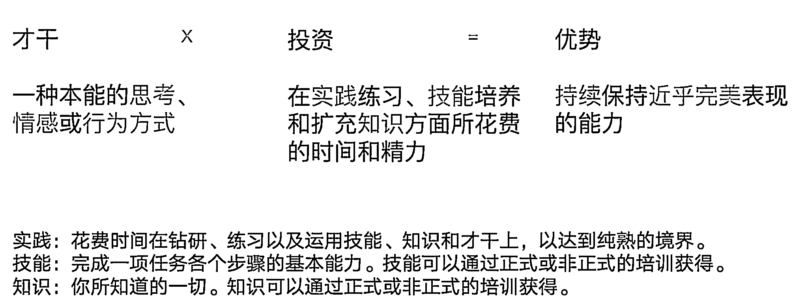

# 1.1 什么是个人优势？

所谓优势，就是你天生做什么事比别人做的更好更轻松，一个人的优势由天赋才干、技能和知识组成，但核心还是天赋才干。

天赋才干可以理解为，老天爷给你的与生俱来的特质，早期一旦形成后期很难改变。盖洛普呈现的就是一个人擅长的天赋才干，你的优势也从这些天赋才干中发展而来。

天赋才干就像人的特质，而优势则在将这种特质发挥到极致状态下的结果。

用盖洛普官方的定义理解才干和优势的关系：才干 X 投资 = 优势，想要了解自己有什么优势，首先要能识别出自己有什么天赋才干。

