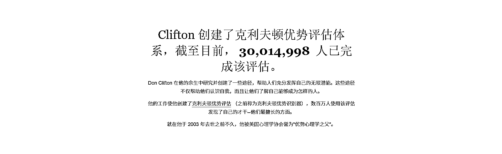
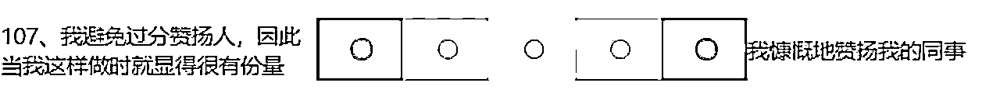

# 2.2 盖洛普测评的准确性？

判断一个优势测评准确与否，我们可以从信度、效度，以及测谎机制等维度去看。

1）信度

所谓信度，是指测验结果的一致性、稳定性及可靠性，即采取同样的方法对同一对象重复进行测量时，所得结果相一致的程度。信度越高，代表这个测试结果越准确、越稳定。

人是复杂的，存在社会化自我，会在测评时会不自觉戴上“面具”，美化自己，因此目前市面上还没有能做到 100%精准的优势测评。而盖洛普测评的重测信度能达到 73%（两次测评前后的一致性），已经比绝大多数测评准了，具备一定参考性。

2）效度

所谓效度，即有效性，它是指所测量到的结果反映所想要考察内容的程度，也就是我们常规意义上的，“测评准不准”。效度越高，测评结果和个人优势就越接近，测试结果就越准确。

盖洛普测评是由美国优势心理学之父、盖洛普前董事长唐纳德·克里夫顿主导设计的，他们团队花了至少 30 年，对 200 多万名不同国家、行业的杰出人士进行采访，了解他们是如何成为行业的佼佼者。

基于海量访谈的大数据，盖洛普团队找到这些成功人士身上所具备的思维方式，最终提炼出 34 项天赋才干主题（talent theme）来给这些思维方式命名。

目前官网已经有 3000 多万样本数据，来证明盖洛普的有效性。

关于盖洛普测评更多详细历史，请点击链接阅读：

[`www.gallup.com/cliftonstrengths/zh/253745/`](https://www.gallup.com/cliftonstrengths/zh/253745/%E5%85%8B%E5%88%A9%E5%A4%AB%E9%A1%BF%E4%BC%98%E5%8A%BF%E5%8E%86%E5%8F%B2.aspx)[克利夫顿优势历史。aspx](https://www.gallup.com/cliftonstrengths/zh/253745/%E5%85%8B%E5%88%A9%E5%A4%AB%E9%A1%BF%E4%BC%98%E5%8A%BF%E5%8E%86%E5%8F%B2.aspx)

3）测谎机制

最后，我们来聊聊盖洛普的测谎机制。

人是复杂的生物，哪怕面对自己，也会不够坦诚。一旦经过深思熟虑，或者“政治正确”引导，测评就非常容易作假。

市面上有很多测评会让你给自己打分，或者有明显政治正确的“标准答案”，比如“你认为自己是一个责任心很强的人吗？”

像这样的测评，非常容易作假。因此，不少专业的付费测评都会增加测谎机制。

但盖洛普不同，它研究的是你下意识的行为模式，是不经过你理性思考的行为。当你理解了盖洛普的测评题目设计，可能就不会有上述的担心了。

为了避免人为主观的误差，盖洛普在题目设计上做了精心的设计。

盖洛普的测评题目一共 177 道题，题目之间会相互交叉验证，每个才干主题都会被拆分到不同的题目中去，并且避免让你看出来是在测同一个特质，比如「积极」这个才干，它可以是你的生活充满欢乐，可以是你经常赞美别人，可以是你经常看到事物好的一面，可以是你很爱笑……

这些描述是你比较能确认符不符合自己的，越符合，这个特质越突出，一般符合，就会在中间位置，越不符合，就会排在倒数的位置。

（当你对盖洛普体系比较了解之后，就不建议反复测了，因为你已经知道它每道题在测什么，准确率就会下降）

