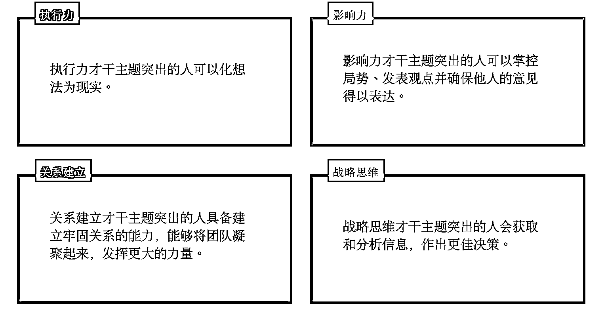
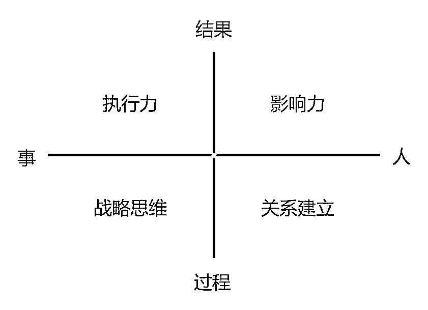
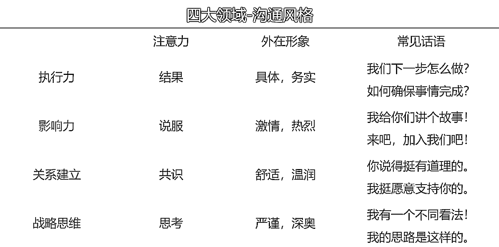

# 3.1 第一步：查看你的优势维度

盖洛普体系把人的优势分为四个大类：执行力、影响力、关系建立和战略思维。四大类下面囊括 34 个才干，每个人的才干排序和组合不同，呈现的优势会有区别。

这一节，主要分享四大维度的优势区别。

打开盖洛普 34 项才干报告的 21 页，会看到四大维度的排序、长短都不同，越是靠前、长度越长的越有可能是更为突出的优势维度，越是排名靠前的才干越有可能是擅长用的天赋才干。

不过因为翻译问题，在才干的理解上可能会有差异，即我们认为某个才干的意思是 A，但实际上可能是 B。（关于 34 项概念的分析，我们将在「3.4 了解 34 项基础才干」中提及。)

请注意，不要让这四大维度束缚了你的思维。如果你在特定领域中并无任何才干主题，请不要担心。这不意味着你无法进行做好事情、做战略性思考、影响他人、建立关系。每个人都能完成任务、影响他人、建立关系和处理信息。 在不同领域中运用自己比较突出的才干主题，也可以得到同样的成果。

•执行力：更擅长做事，善于将想法落地你可能更关注“如何做成一件事”，在完成任务、实现目标、组织、计划、执行和追踪进度等方面有天赋。具体的执行力方面的天赋是什么？和你执行力维度排名前十的才干有关。

•影响力：更擅长引领人，以自己为主你可能更关注“如何推动他人做事”，在与他人沟通、协商、说服、引导、激励、掌控局势等方面有天赋。具体的影响力方面的天赋是什么？和你影响力维度排名前十的才干有关。

•关系建立：更擅长支持人，以他人为主你可能更关注“如何建立信任关系”，在与他人建立深度信任关系、维护并打造支持性团队等方面有天赋。具体的关系建立方面的天赋是什么？和你关系建立维度排名前十的才干有关。

•战略思维：更擅长想事，善于做出决策你可能更关注“如何做决策”，在获取、分析、处理信息、制定相应策略、判断趋势等方面有天赋。具体的战略思维方面的天赋是什么？和你战略思维维度排名前十的才干有关。

💡大家可以查看自己 21 页的报告，尝试开始列举大方向上，自己更擅长什么？并回忆过去有成就感或令自己满意时，是否在自己较为擅长的领域？

以 @醒醒为例，四个维度中关系建立>战略思维>执行力>影响力。我更喜欢先找对的人，组建好团队，然后再开始干，对我来说人对了，事才能做对。

我排名 Top 10 甚至 Top 15 的才干，在四个维度中都有较为突出的，这又能进一步看出个人潜在的优势。

例如：

•我更擅长通过支持他人发展来建立深度关系（体谅+个别+伯乐），而非到处交朋友和与他人竞争（取悦 26+竞争 17）；

•我更擅长做需要创意、想法和策略的职位（思维+理念+搜集+战略+前瞻），而非数据、逻辑、学术研究相关的工作（分析 33+回顾 31+学习 23），

•我更擅长解决问题，将任务流程化（排难+成就），而非做计划（纪律 34）和目标管理（专注 15）。

如果让我每天带兵打仗、做科研、不与人接触，我会很痛苦，关系建立几乎用不到实处上，我理解不了那些数字意味着什么，那些规则都在限制我的想象力和创造力，命令别人做事也会让我觉得在伤害关系，让我本能的讨厌“权威式”的领导模式。

在我过去的职业生涯中，做社群运营、群发售、咨询、教练、写作都能获得不错的结果，这些工作都与人打交道，都需要支持他人的发展，不断输出新想法，给别人带来启发，进而获得价值感，也帮我结交了不少贵人。

但凡是需要定时打卡，推导逻辑，处理数据，必须按照规定步骤做事的业务场景，我时常会觉得备受束缚，不够灵活，不断怀疑：“规矩是死的，人是活的，为什么要这样啊？”

越是找到我们优势能发挥的地方，越容易出结果。这都是可以从报告中看出来的。不过，这四个维度的优势在使用时，也可能出现盲区：

•执行力：如果你擅长做事，但闷着声干也不让别人知道你的价值，可能不会受重用。

•影响力：如果你擅长推动别人做事，但不能让人信服，别人只会觉得你强势不好相处，只会用嘴说，是个空架子。

•关系建立：如果你擅长换位思考，但忽略了自己的立场和感受，过度迁就，别人只会觉得你好欺负，玻璃心。

•战略思维：如果你擅长决策，但讲不清楚决策逻辑或觉得别人笨不愿意沟通，别人会觉得你高冷高傲，也根本搞不懂为什么要听你的。

在了解并应用自己的优势维度时，多关注在什么领域更能展现出自己的优势。对盲点也需要有意识的觉察和调整。

例如：一个执行力+战略思维非常靠前，关系建立+影响力靠后的人选工作，如果要做销售，去研究营销工具来提升转化率，会比直接和人面对面打交道更符合他的天性。

