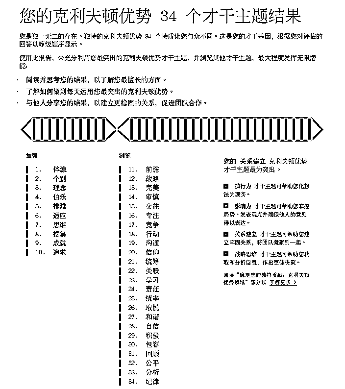
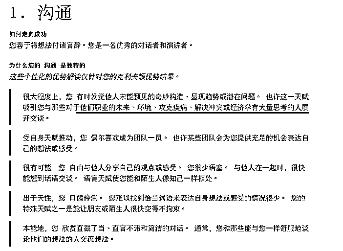
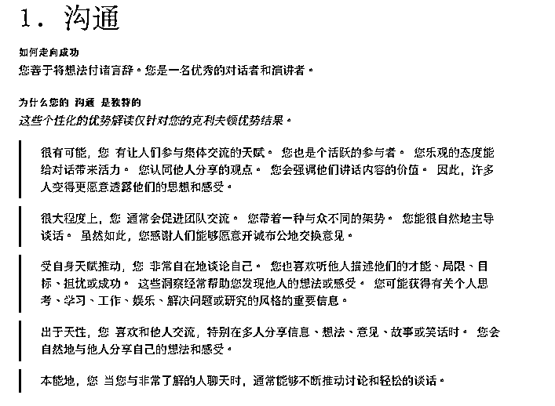

# 3.2 第二步：查看你的才干排序

在了解自身优势维度后，你已经对自己的优势有了一个大概的认知。接下来，我们需要查看自己的才干排序，这是非常关键的一步。

盖洛普把人的行为、思维、情绪模式分成 34 种才干，这些才干是我们与生俱来的天赋能力，在一定的知识、技能的训练下，它们就会发展成我们的优势。

接下来，请翻到盖洛普报告的第 1 页，查看你的才干排序。报告的第 2-11 页，是你的前 10 才干具体分析，其中前 5 才干有个性化分析解读，需要重点查看。

由于每个人才干排序不同，大家形成的价值观、性格、优势不同。

一般来说，我们更需要关注排名靠前的才干，这是我们可能会发挥优势的天赋区。而越是靠在后面的才干，越代表了是我们不经常使用的天赋，也可以理解为不那么擅长的。

以醒醒为例，我经常用的 Top 3 的才干分别是“体谅”、“个别”、“理念”，不怎么用的倒数 3 个才干分别是“公平”、“分析”、“纪律”。（关于才干的具体解读，我们将在「3.4 了解 34 项基础才干」中详细说明。)

我总是能敏锐的感受到他人的情感需求（体谅）、发现每个人的独特之处（个别）、非常多新奇的点子（理念）。但对于规则（公平）、数据、逻辑（分析）、计划（纪律）之类的事非常不擅长，也不怎么关注。

那么，我可能存在的优势是“共情力”，“组优势团队+人才发展”，“创新力”；不擅长制定规则、推理和做计划。

在盖洛普报告中，每种才干都有其对应的价值，越是靠前的才干越是我们无意识中不费力就会使用的，这可能是我们的天赋所在。举个例子：

有人从小到大语文很好，但物理数学很差，对文字的理解天然强于对数字和逻辑的理解，他可能有文字方面的天赋；有人从小到大就喜欢和朋友一起玩不喜欢呆在家里，他可能在社交上有天赋；有人从小到大总是喜欢观察人，研究人，他可能有识人辨人的天赋等等。

这些从小就有的特质，在盖洛普里大概率会被测出来排的很靠前。通常来说：

•Top1-10 的才干：突出才干，越靠前的越可能是最擅长的天赋才干，天然就能在某些方面做的不错。

•Top11-20 的才干：辅助才干，偶尔也会用上，也能辅助你把事情做好，但使用频率不一定比前 10 才干高。

•Top21-34 的才干：底部才干，越往后越有可能不常用，甚至不怎么出现。

初学盖洛普，更需要关注的是排名靠前的才干是怎样一种天赋，在什么情况下能用的很好，什么情况下用的不好，找到能用好它的环境，生活和事业都会感到更有价值感和意义感。靠后的才干虽然不擅长，也许会影响我们，但不一定是我们的弱点。

由于翻译问题，有些原版的才干解释，在中文的语义下，可能在理解上有偏差，具体的最好看官方的报告。或者前往「3.4 了解 34 项基础才干」，自行查阅。

值得注意的是，即便我们和别人的测评结果里有相同的才干，但擅长做的事却是不同的。也就是说盖洛普会根据每个人的才干组合特质的不同，给出符合个人的天赋说明，它让我们看到了自己的独特性。

（沟通 1-这位是医生）

（沟通 1-这位是 Leader）

大家读的时候，应该能感觉到这两个拥有「沟通」才干的人的描述是不一样的。因为才干描述和报告的整体排序有关。

