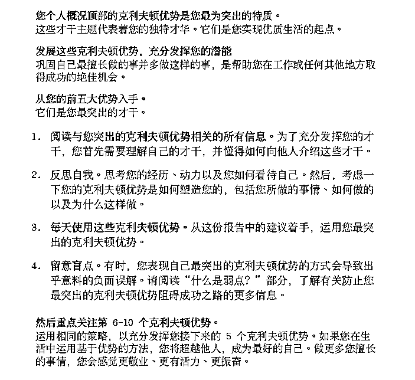
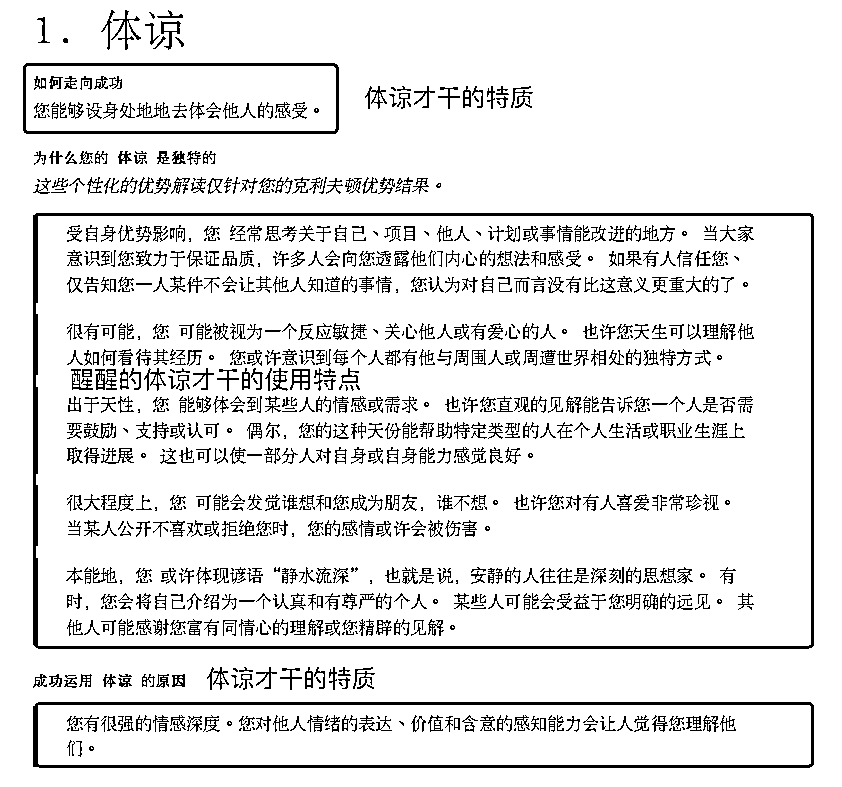
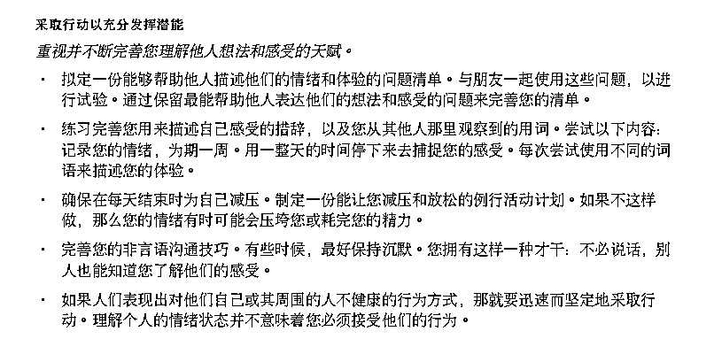
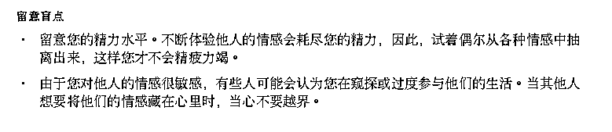

# 3.2.1 阅读 Top 5 才干，标出有共鸣的地方

想了解自己有什么天赋，这个天赋是什么？首先，最好从自己最擅长的 Top 5 的才干入手，在盖洛普报告第 2 页中，给出了“了解自己的天赋的方法”：

以“醒醒”排在第一的体谅才干为例，要着重看以下几点：

•才干的特质描述：了解了才干特质，才能充分看到自己可能有的天赋。

•才干是如何使用的：查看具体的描述，找出有共鸣的部分，不断回想自己曾经做到的事中，是如何使用这个才干的，带来了什么效果。

•提醒：重点看前 5 才干的阴影部分，这是个性化的报告，也是报告含金量很高的部分。不同的人，体谅第一，报告的内容不尽相同，因为其他才干不一样。

•行动建议：如何持续用好天赋才干的建议，日常生活可以对照行动建议来练习，加深理解和使用。

•才干盲点：才干就像硬币，有正反两面，有时候用的好有时候用的不好，看到盲点，更好的管理盲点，能帮我们更好的发挥优势。

•拓展：靠前的才干发挥了盲点，带来了负面反馈怎么办？

你可以尝试：•找到天赋才干适合发挥的场景•不断练习使用你的天赋才干，尽量发挥优势避免盲点出现
举个例子：一个人行动才干突出，想到什么总是能立刻开始做，行动力强是他的优势。同时，他也可能是个急性子，没有想清楚就开始行动，要花不少时间试错。
如果将他放在需要持续开拓新项目敢于尝试的环境里，他有干劲这个特质，能开疆拓土，可能经常会收到“敢于进取”的评价。但如果放在需要谋划很久再行动，一旦做错要付出巨大代价的环境里，他可能经常会收到“莽撞”的评价。 通过上面的案例能看出，任何才干都是中性的，并无好坏。当我们在无意识状态下使用才干，不管是擅长与否，都可能因为使用不当而暴露出弱点。目标合理的情况下，当我们能根据目标，有意识地使用擅长的才干时，弱点出现概率会大大减少。
这里解释一下，什么是“有意识管理”和“无意识发挥”。
•无意识发挥：说的是你的才干就像汽车的自动驾驶系统一样，只要上了跑道，自己就跑起来了也不管会跑去哪。例如：竞争才干突出，胜负欲强想拿第一，无意识状态下总和别人比较，想赢过别人一头，容易出现“到处是假想敌”的情况，把人放在对立面弄的关系不好得罪人。
•有意识管理：你知道自己会这样做，也知道是哪个才干影响的，了解并接受每个才干都有其优势和盲点，使用时会尽量根据目标使用才干，尽可能发挥优势那一面，避开盲点那一面。例如：如果和别人争，对自己更有利值得一争，如果大事小事都要争，因此反而到处树敌就没必要了。

总之，标注出有共鸣的地方后，在不断的回想高光时刻中，自然而然的能够看见擅长的才干应用的影子。对靠前的才干有了感知后，在生活中不断的观察自己和他人的区别，关注自己的感受、下意识的反应、自然而然就能有意识的用它，看见它的优势了。

