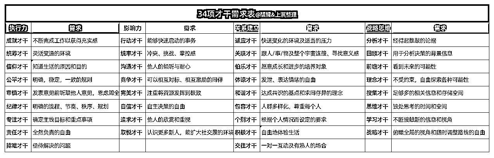

# 3.2.3 拓展：34 项才干的需求清单 @叶叶在觉

一个人工作没动力，往往可以从他的盖洛普报告中分析出原因。因为缺乏动力是内心某种需求没被满足的表现。

34 个才干每个才干背后都对应一种需求，例如：

「追求」才干需要得到别人崇拜和认可，才会激发他达到最佳状态；

「竞争」才干需要一个相互比较、相互激励的同伴，才能激发他不断努力、赢过对方；

「适应」才干需要一个富有变化的环境，才会持续激发他灵活应变的潜能，让他遇强则强。

当你满足了才干背后的需求，你每天就会像打了鸡血一样，对工作充满热情，在职场上勇往直前。

比如当你知道了自己的「交往」（熟人社交的能力和深度关系的维护能力）很突出，那么你就需要经常跟几个固定的好朋友保持联系，经常见面、保持深度沟通，跟他们在一起你就会感到放松。

同时你更擅长去做一对一或小圈子的服务，做深度的一对一关系，而不是靠走量的模式，那么相应地你更适合做高单价产品，通过提高转介绍率来获得流量。

大家可以按照下方这张表格，了解自己的动力来源。

34 项才干的需求清单@上淇&醒醒：

