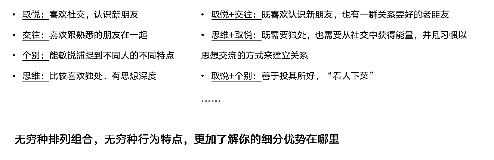

# 3.3 了解组合才干的应用

盖洛普测评的颗粒度很细，大多数测评工具像一个模糊的大镜子，照出人大概的类型，而盖洛普是 8k 超高清相机，能照出一个人的高矮胖瘦和五官，帮你更清晰的看到自己的“天赋才干”。

以人际关系为例，表现形式可以是 N 种，举个例子：

假如 A、B 两个人的前五才干中，都有取悦才干，意味着他们都喜欢社交，认识新朋友，不断与新人朋友建立联系获得青睐，他们会感到很满足。

其中 A 排第一的才干是沟通，B 排第一的才干成就。

•A：沟通+取悦：喜欢通过交流和表达，不断和别人交换信息建立关系。

•B：成就+取悦：喜欢做能不断认识新朋友的工作，一边做事一边交朋友。

如果在“两两组合之上，再加一个才干进行组合”，例如：

•沟通+取悦+交往：八面玲珑，全世界都是朋友。总能找到话题不断和新、老朋友交流，维护好关系。

•成就+取悦+完美：在工作中，本能想结交特别优秀的新朋友，本能的向上社交。在做事的过程中结交朋友。

每增加一个才干，才干组合的复杂度和难度更高，但也变得更精准了。也就说，才干的 N 种表现形式，体现在测评报告中 34 个才干的排列组合的数量、排序不同，这意味着：

第一、测试结果就像基因一样，几乎具有唯一性，展现的是测试者本人的与生俱来的独特性。

第二、34 种才干有无穷的排列组合，尽管人和人之间有相似的优势，但才干组合不一样，反映的是差异化优势。

对于初学者来说，不需要一上来就死磕组合才干，很容易绕晕。如果想要更精确地了解自己的天赋才干组合，依然要从单个的才干入手，了解清楚后再进行两两才干组合的练习，慢慢的就更熟练了。

以下一些才干组合，可能比较容易同时出现在前五，作为了解即可（常见组合数据来自盖洛普官方）。

成就+学习：当我在完成某个任务时，渴望能够顺利完成，如果接触的是新事物，会忍不住想弄明白，开启学习模式。

专注+成就：以目标为导向，并按照重要性排序将任务排出来，不达目标不罢休。

统筹+责任：当我在配合别人工作时，只要和我有关的事，无论是过程还是结果，都希望能对其负责。

信仰+责任：坚守自己觉得重要的原则和目标，对需要我帮忙的人，做出承诺尽心尽力。

审慎+责任：尽责且谨言慎行，恪守自己许下的承诺。

排难+责任：为了帮受伤/受损的人、事、物，愿意牺牲自己，服务他人。

纪律+责任：喜欢用日历、日程表等工具，管理并确保自己完成了计划，履行了对别人的承诺。

公平+和谐：为了推动事情能顺利进行，尽可能管理情绪发生的过程，减少情绪冲突和争议，保持冷静。

行动+战略：我会找出最优的方案，并督促大家尽快开始行动。

追求+成就：既有强大的自驱力，也渴望站上更大的舞台，如果有人欣赏我，我会更卖力工作。

完美+战略：在考虑未来的可行性方案时，优先排除不够好的方案，再从特别好的方案里选出最好的。

自信+战略：对自己的能力和判断胸有成竹，知道最好的方案是什么也了解自己的目标和如何实现目标，不轻易被改变。

统率+战略：喜欢提前考虑所有可行的方案并选出最优的，这样就能在统领大局时避免做无用功

竞争+成就：不但能努力完成工作，还会在和他人的比较中变得更有动力去超越自己和他人。

沟通+取悦：在社交中，总是能依赖清晰的表达获得他人的关注，建立广泛的社交关系。

适应+体谅：生活在当下，对当下发生的情况和情绪比较敏感，并做出相应变化。

伯乐+体谅：人的情感和潜力虽然是不可见的，但我能帮别人表达出他们的感受并发挥出他们的潜力。

包容+积极：我喜欢邀请大家欢聚在一起，希望邀请的人能全部到场，如果有人缺席，我会感觉不够开心。

个别+交往：很容易看透他人的本质，也希望有人能了解真正的我。

和谐+责任：能建立有助于合作和促进实际生产力的环境，总能用这个获得信赖。

交往+责任：为客户、亲人、同事、朋友提供帮助的时间越久，越懂得欣赏他们，同时获得他们的认可。

关联+体谅：非常关心他人，对他人独特的情绪敏感，也对人类的共性有认同感。

积极+取悦：对情绪和如何获得新朋友的青睐非常敏锐，能很轻松的结识新朋友、鼓励沮丧的人，并享受这个过程。

分析+学习：我喜欢学习，学习的主要目的是学会客观的评价事物。

回顾+搜集：不断的搜集资源和翻看历史记录时，总能给别人提供他们想要的东西。

理念+战略：在达成目标的过程中，会考虑所有的可能性，如果都无法令人满意，就创造新方法。

前瞻+战略：总能判断出未来的走向，并找到实现未来的最佳方案。

搜集+思维：喜欢思考并搜集深刻的洞见、哲理，也觉得这些是有意义的。

