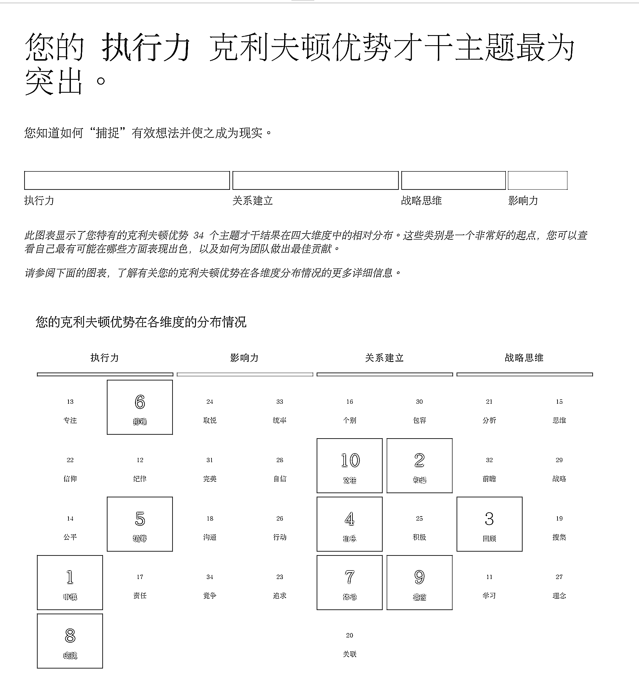

# 4.1.2 【实际案例解读】深度了解自己，提升自信 @醒醒同学

案例背景：从小不自信，习惯自我否定的人，如何提升自信力？

四大维度：执行力>关系建立>战略思维>影响力

前十才干：审慎、和谐、回顾、伯乐、统筹、排难、体谅、成就、适应、交往

🔥盖洛普分析（部分才干）：

审慎、和谐、排难、体谅、适应才干同时出现在前十的人，且积极、自信、统率才干靠后的人，大概率在生活中经常内耗，分分秒秒都在内耗。这个组合可能是最容易没有自信的。

•从四个维度上来看，关系+执行很靠前（结合才干），日常生活中能非常敏锐的感受到别人的需求，愿意配合别人把事情做好，相处起来也让人非常舒服，随性，没有攻击性，默默付出，也不惹事不闹事。如果能当她的朋友，一定会感觉到被捧在手心上。

•体谅+伯乐+交往：她对熟悉认可的朋友，一定是充分的支持、爱护、信任的。不管是工作还是生活，只要她认定的朋友，会非常在意对的感受，看到对方的闪光点，鼓励对方做想做的事。

•审慎+交往+体谅：可能是很多人的树洞，而且她不会轻易透露秘密给别人。

•适应+成就：几乎你需要的时候，哪怕打断她的进程，她也愿意先帮你，再做自己的事。灵活性和完成度都很高。

•审慎+排难+和谐+体谅：生活中别人无意的一句话，比如说：“你怎么不这样做呢？”，她内心可能都波涛汹涌（体谅），觉得是不是自己哪里做得不好，但她不一定会讲出来，也不觉得有什么必要争论一番，反而会憋在心里，想自己哪里有问题（排难），不喜欢冲突（和谐），也怕说错话引发更大的矛盾（审慎），会选择默默努力，用成绩和付出来证明自己的价值，如果还是不能，就会觉得自己还不够努力。

•排难：如果别人夸她 9 句，说她 1 句做得不好的地方，她会关注这 1 句不好的，觉得自己还不够好，就会内耗。但愿意面对不足，韧性极强。

总结：这是一个无论做到什么成绩，都很难相信自己很不错的才干组合，非常需要正反馈。但在关系里，和人际不复杂，需要稳定性的团队里，她应该会得到不少认可，尤其是做用户运营相关的，服务好评度不错，跟一个护犊子但对外强势的领导。不要选择太过狼性的工作氛围。

除了留意环境对自己的影响，想提高自信，首先意识并接受自己总是会否定自己，其次多和「积极+沟通+伯乐才干」靠前的人相处，能感受到非常多“正反馈”，最后是否定自己时也要看看自己好的一面。

