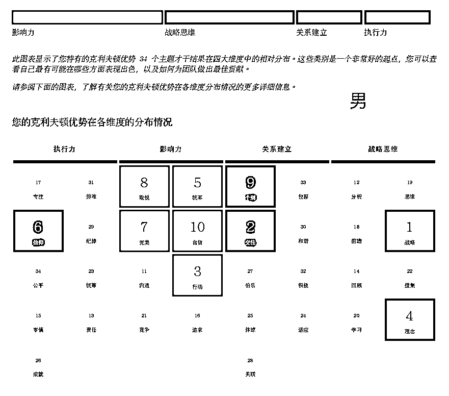
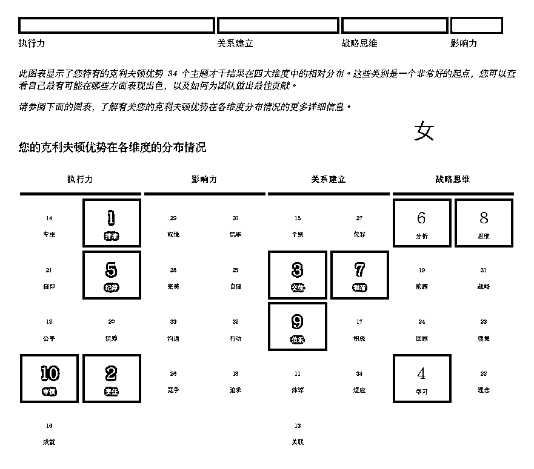
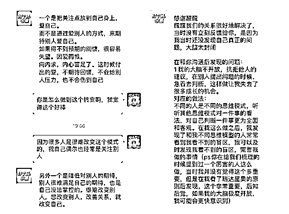

# 4.2.2 【实际案例解读一】判断伴侣双方是否适合同行 @醒醒同学

案例背景：这对情侣找我时正在感情低谷期，既是事业合伙人也是伴侣，因为一些矛盾一方提出了分手，他们希望能把话说开，为这段感情再努力一次。距离解读结束 9 个月后，他们在这个 5 月结婚了，彼此更能理解彼此，也找到了适合这段感情的相处方式。

男生四大维度：影响力>战略思维>执行力>关系建立

女士四大维度：执行力>关系建立>战略思维>影响力

男生前十才干：战略、交往、行动、理念、统率、信仰、完美、取悦、个别、自信

女士前十才干：排难、责任、交往、学习、纪律、分析、和谐、思维、伯乐、审慎

🔥盖洛普分析（部分才干）：

从互补的角度看：相对来说，男生在关系里更站“主导”角色（影响力+战略思维），果断、聪明、有想法、对未来有规划，在决策和对外的社交、资源合作上，做的很好；女生偏“配合”角色（执行力+关系建立），温柔不作，善解人意又有点理性，有韧性，在选品、将业务落地上做的很好。女生能看到男生的潜力（伯乐，相信他），男生能看到女生对他的欣赏，让他感觉很舒服（体谅+和谐+适应）。

从相似的角度看：双方的交往才干都非常突出，非常在意至亲好友的感受，愿意为了在乎的人付出，外加责任才干靠前，对家庭的看重程度比较高，竞争才干都靠后，在经济和成长上，配合>要强/争强弱。

从差异的角度看：事业上，男生的决策有时很快，想法会发生变化且希望能快速开始（战略+理念，行动靠前）是个急性子。女生则更关注如何落地，且不太发散，如果有不懂的地方就动不起来（排难+审慎，行动靠后），习惯性按刹车，男生本能会觉得对方慢，是不是不相信自己，怎么老是反问他为什么这样做（分析）。女生本能会觉得思维发散听不懂，无法落地，跟不上会难受（责任）。

男生是能比较快的开始融入一段关系（取悦+沟通+交往+个别：天然擅长和人打交道），而女生比较慢热（交往+审慎：要相处一段时间，确认相处起来人靠谱，同频才能认可）。当他们想要融入彼此家庭时，男生可能很快能把自己当成家中一分子，也比较会来事。女生可能会比较有边界感，没到结婚觉得自己还是外人，就算有什么话也不会讲出来。双方容易在琐碎的事情上，消耗感情。

有这么多差异，有哪些点是在这段关系里值得关注的？

•交往才干：双方交往都很靠前，不会轻易破坏一段好不容易建立的感情，也愿意为彼此付出，愿意把对方放到人生重要的位置上。也是他们为什么会来找我的原因之一，放不下彼此。男生也说：有问题我得先认错，老婆和平全家和平，就算是主导的人也不例外。后面他们把事业和关系时间分开，每隔一段时间单独约会，交流心得，增进了解，提高了默契度。

•责任才干：基于之前出现的两个家庭之间的矛盾，他们想清楚要以小家为主，重新调整了事业、双方家庭、朋友关系的优先级。

•维度互补：首先是双方尊重且相爱，其次事业和关系里的相处模式上可以琴瑟和鸣，不是都要强，也不会彼此推卸责任。

•后期复盘：在解读过程中，双方了解了彼此的差异，在不强烈要求改变彼此的基础上，女生提升对男生的信任度，男生给女生一些融入时间。并定期花时间来了解彼此，把事业和家庭区分开来看，还做了一个如何增加感情的复盘，放到这里给大家参考。👉[《我从一对情侣用户上学到的相爱之法》](https://mp.weixin.qq.com/s/D1AMfwosOTctzNuZiIzIUQ)

