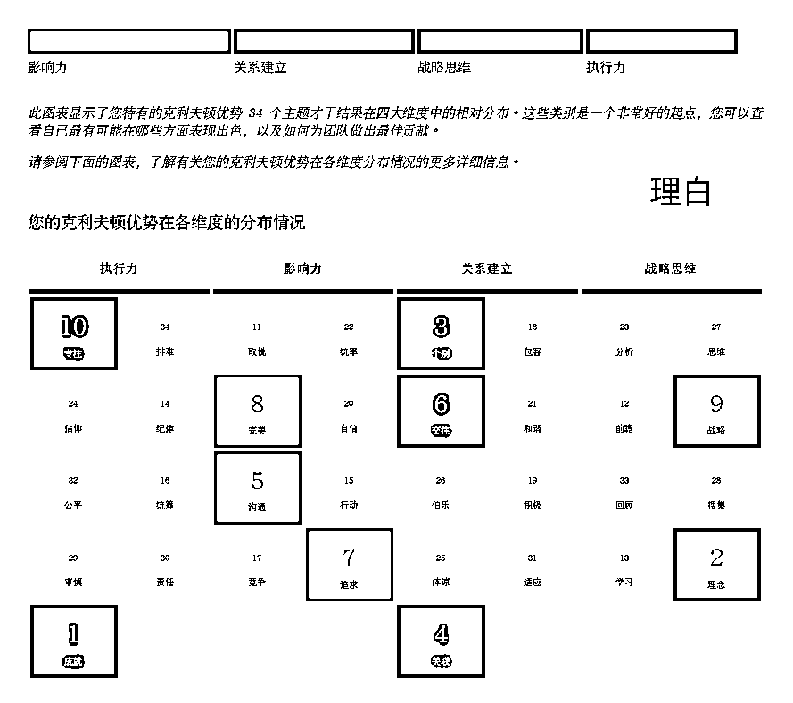
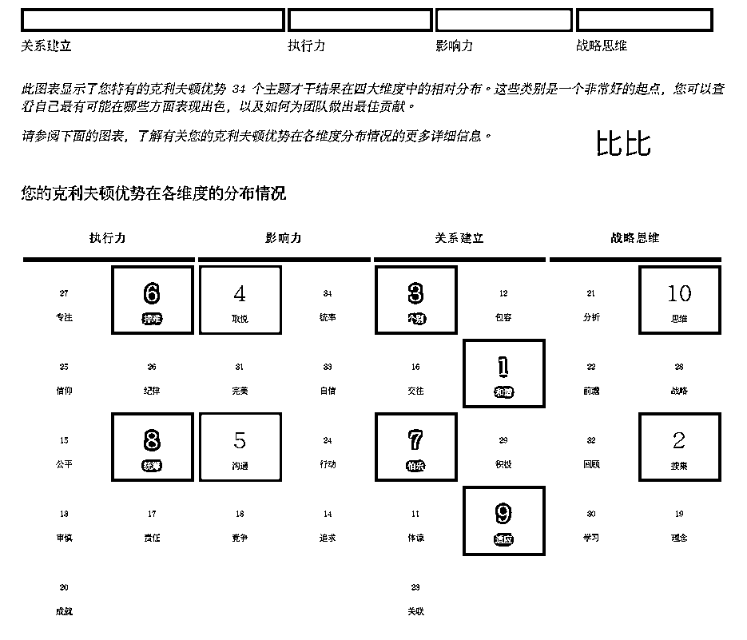

# 4.2.3 【实际案例解读二】帮助情侣更好理解彼此，找到合适的相处方式 @醒醒同学

案例背景：这对情侣是热恋期解读的，没有太大卡点，但肯定有些还未对彼此说出的话，甚至可能他们俩都不知道对方是这样想的，借由才干报告提前了解，减少摩擦出现，找到好的互动模式。

理白四大维度：影响力>关系建立>战略思维>执行力

比比四大维度：关系建立>执行力>影响力>战略思维

理白前十才干：成就、理念、个别、关联、沟通、交往、追求、完美、战略、专注

比比前十才干：和谐、搜集、个别、取悦、沟通、排难、 伯乐、统筹、适应、思维

🔥盖洛普分析（部分才干）：

从互补的角度看：确定恋爱关系前+热恋早期，理白影响力突出，关系次之；比比关系突出，执行次之。相对来说理白是更为主动的一方（结合才干来看）。理白会觉得比比如沐春风、善解人意（个别+和谐+取悦+沟通）。比比会被理白的“想法和事业心吸引”（战略+理念+成就+专注）。比比越是赞美理白，理白越觉得这段关系里有被充分的看到（追求）。事业型+生活型的配对，都很接地气。

从相似的角度看：关系建立都靠前，比较重视关系。（个别才干）都靠前，天然能看到对方的不同之处，很容易产生“我很懂你”的感觉。（沟通+取悦）都靠前，沟通频率高+嘴甜，增加甜蜜度，误会不会过好几夜。

从差异的角度看：理白（成就 1+专注 10+完美 8），比比（成就 20+专注 27+完美 31），理白在事业上会投入不少精力，且要求高，比比不一定觉得工作是人生最重要的事，步调是否能保持一致或相互尊重不干涉很重要。

比比（排难+和谐+审慎+适应）略靠前，（自信+积极+交往）靠后，他更被动。理白（交往+专注+成就+追求）靠前，一旦理白认定比比是值得的人，会积极主动推进关系，但比比可能会本能思考“理白对他好的动机，可能会怀疑为什么会得到别人的关注和爱（排难思考问题）”。

理白（追求+成就+交往）靠前，越是亲近越愿意付出，但也本能渴望被认可（追求），对完成一件事非常在意，完成不了就会难受（成就），没得到及时回应会受到挫败，会怀疑对方是否同样在乎自己。一个还没想好要不要开始，另一个已经感觉受伤，容易产生误会。

相对来说，理白可能更高调一点，也享受这种向全世界宣告的感觉，比比可能会觉得不好意思或有点不适应，也是需要留意的。

有这么多差异，有哪些点是在这段关系里值得关注的？

•沟通+个别：他们愿意交流非常好，解读完后，他们尝试用了解自己的方式来了解对方，有意识的去了解对方的想法，并给对方想要的东西。比如：比比更多表白理白，理白也尊重比比的节奏，双方的争吵少了，理解更多了。

•维度互补：理白对未来的规划、对关系的重视和实现这个规划的渴望非常高，能让比比充分感受到被重视，被支持。比比耐心、随性、总能接住理白的各种想法，能让理白充分感受到自己很好。只要节奏不是相差太大，不用自己的标准要求对方改变，有意识到彼此的不同，愿意互相理解，都能在这段关系里看到更好的自己，以及对世界还未了解的那部分。

•后期复盘：我曾问过他们为什么会相互喜欢，帮他们翻译了不少心里的想法，话匣子打开后，双方知道了更多对方的想法。也更理解了彼此的不同，看见了，也更愿意尊重对方。设定了定期的关系复盘会，现在越来越默契了。最怕的从来不是彼此有很大差异，而是带着误解以为对方不在意这段关系，做了很多努力还是无法走在一起。了解彼此，相互看见，共赴未来，是一切高质量关系的起点。

