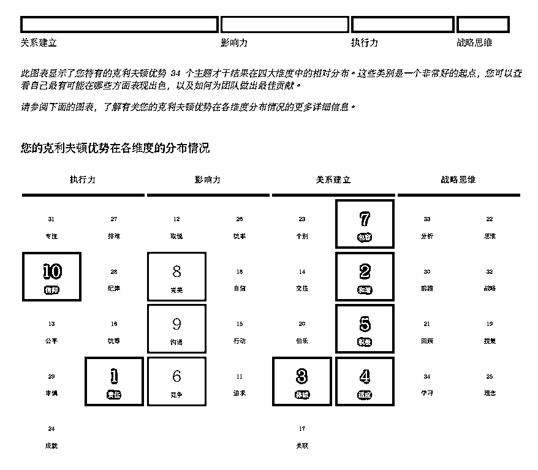

# 4.3.2 【实际案例解读】调整职业环境，选择更开心地赚钱方式 @醒醒同学

案例背景：保险销冠叶子，从不主动销售，总是有很多陌生人找她买保险。因为觉得自己卖的产品性价比不够高，一整年都不愿意出单，即使客户找上门了，也主动拒绝；后来，她去到了一家保险经纪公司，可以给客户挑选到性价比最高的产品，一下子动力满满，直接杀回销冠。

四大维度：关系建立>影响力>执行力>战略思维

前十才干：责任、和谐、体谅、适应、积极、竞争、包容、完美、沟通、信仰

🔥盖洛普分析（部分才干）：

•关系建立+影响力靠前，天生适合在人堆里发光发彩的才干组合。执行力+战略靠后，如果要她按部就班的生活或是做科研类的工作会非常痛苦。

•从才干组合看她的需求（部分举例）：•责任才干希望能让别人觉得靠谱，如果做一件事能赚钱但过不了良心那一关，她会非常难受。•竞争才干希望能有对标人物，超过他们拿第一，更有动力。•完美才干希望看到更好的东西，让自己成为更好的人，做出更好的结果。•积极才干希望人生过的开心，这一点很重要。

•从才干组合看她的优势：•责任：为客户着想并负责，尽可能提供适合客户的方案，容易获得长期信任感。•积极+沟通+取悦：擅长和陌生人建立联系，在社群发言有亲和力，愿意赞美别人，传递正能量。不强推保险•完美：挑客户，更愿意服务有购买力的客户，参与的社群往往也是高价社群，打开了高净值客户市场获得了流量。•竞争：看到别人更厉害，会激发胜负欲，比别人做得更好直到拿到第一，自然赚到了钱。•体谅靠前，专注靠后：不会强推保险，在意用户体验。

•她遇到的挑战，可以如何解决？•想将自己的经验变成方法论教给团队成员，但总是提取失败：她天然擅长和人打交道，回答别人的销售问题可以，但不擅长“信息、知识类”相关的工作。可以找擅长提炼方法论的人来提问，她回答，梳理出方法论。•做自媒体总是不知道写什么？她更擅长通过和大量人接触、交流来获客（关系建立+影响力靠前）而非通过内容创作（战略思维靠后），多拓展社群人脉会更适合她。如果非要做自媒体，请人帮忙做选题，她来回答，找人做成内容更适合她。

总结：虽然每个人一定程度上都希望赚钱，但爱钱的方式不一样。有的人可能更在乎能否开心的赚钱，有人在乎能否赚良心钱，有人理想主义>赚钱。

当我们在看才干图时，越是排在前面的越代表了我们内心某种需求和价值观，例如：叶子就无法违背她心里对客户负责的想法，让她为了赚钱做一件自己觉得不靠谱的事，肯定是非常痛苦的。但如果能找到让她非常认可的产品，她的销售优势立刻就发挥出来了。

