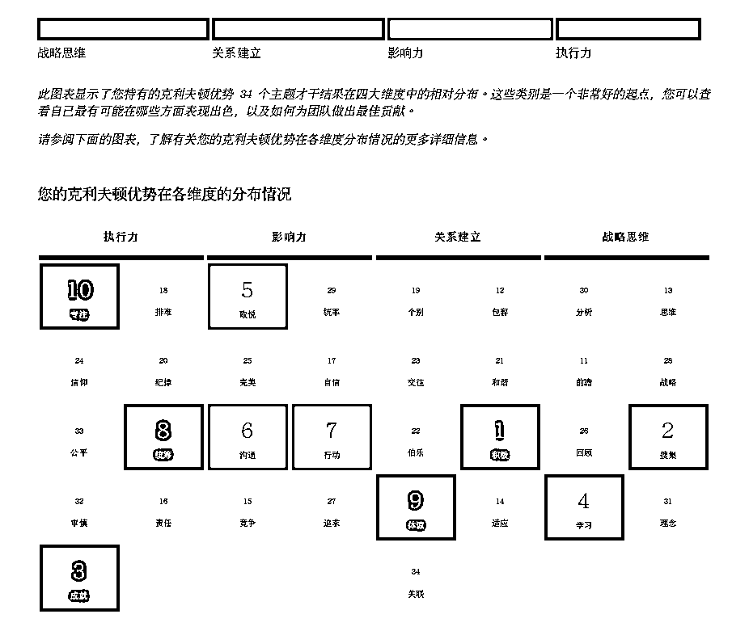

# 4.4.3 【实际案例解读】定位管理风格，找到适合自己的管理方式 @醒醒同学

案例背景：

程序员出身的管理者，做程序员时总是不知不觉做了“管理者”角色，牵头带着同事做没试过的项目，超预期完成，总能做到全公司的人几乎都认识她，赋能型管理者，鼓励并给下属机会尝试，团队氛围很好。

四大维度：战略思维>关系建立>影响力>执行力（四个维度差不多长）

既能搞定人也能搞定事，没有明显短板。相对来说是一个对事很在意对人比较温和的领导。

前十才干：积极、搜集、成就、学习、取悦、沟通、行动、统筹、体谅、专注

🔥盖洛普分析（部分才干）：

•积极+沟通：主动性强，喜欢快乐的工作氛围，总能看到团队成员的闪光点并表达出来激励他们，团队氛围轻松，这样的领导带的下属一定很开心，有凝聚力。

•取悦+沟通：在公司内能认识各个部门的人，搞好关系，为部门争取资源。

•成就+专注：非常在意一件事能不能完成，本人也非常勤奋（成就）以身作则，这样的人带出的团队绩效应该不错，不会把活扔给下面的人就不管了。

•统筹+取悦+行动+沟通+积极：擅长处理对外关系，平时就会留意有哪些部门之外的人可用，要用人尤其是任务多的时候，能快速调动公司里的人来完成任务，而且别人还很愿意帮他。

•成就+行动+专注：对于下属能否按时完成任务非常在意，受不了拖延的同事，判断下属行不行的标准主要是“能不能把事情做好并及时完成”，不能的话她会很难受，能的话会被重视。

•统率 29+完美 25+排难 18+追求 27：不属于强势型领导，有一定容错率，也能把功劳和舞台分给下属。

总结：不同性格的人，拥有不同的领导风格。像这位领导的风格就是：性格温和、结果导向、善于激励下属给下属反馈、注重团队氛围、有容错率、对外低调。

与之截然相反的领导风格则是：对下属要求高，只想招优秀的人，容错率低，有野心，能持续带团队拿到结果。比起团队关系的融洽度，更在意解决问题和结果，说话可能比较直接。跟着这样的领导，不能太玻璃心。

