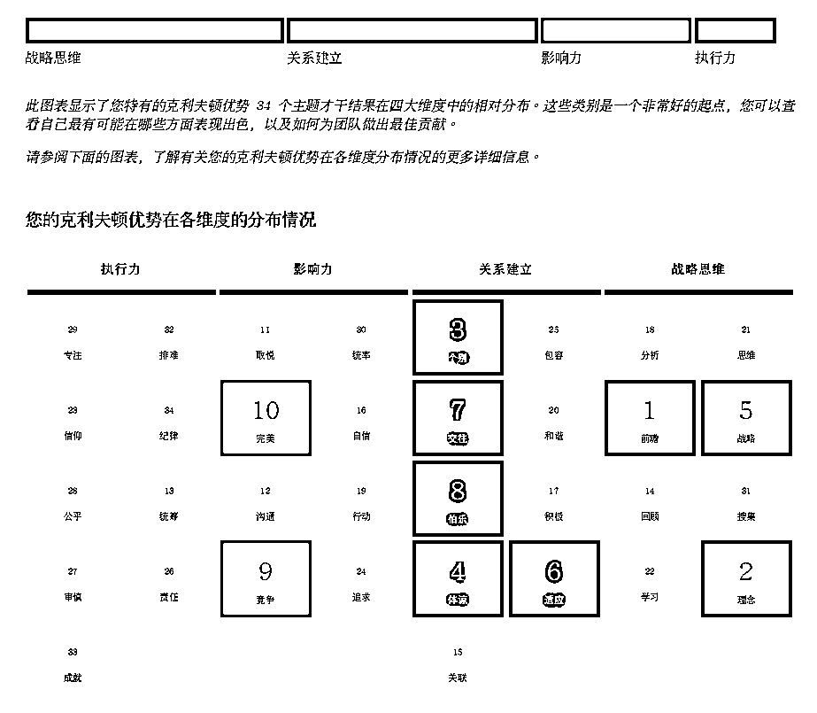

# 4.5.2 【实际案例解读】想要做副业社群但不确定合不合适 @醒醒同学

案例背景：年龄 25+，动画设计相关行业，换了好几份工作，总能跑通副业项目 0-1，想做一个副业社群，但不知道行不行。目标营收一年 50 万。

四大维度：战略思维>关系建立>影响力>执行力

前十才干：前瞻、理念、个别、体谅、战略、适应、交往、伯乐、竞争、完美

🔥盖洛普分析（部分才干）：

•战略思维+关系建立突出：在寻找项目拆解项目上有优势，能跑通 0-1，知道怎么做以后，会失去兴趣，带不来新的认知了。不喜欢做重复、琐碎的细活。如果是自己做社群，要带人跑通 0-1，回答细节问题时会没耐心，影响交付质量。

•找项目上，对需求和风口非常敏锐：总能找到别人跑通的项目里，能赚到 0-1 的项目，如果做的项目还需要大量的创意，就更舒服了，有视频类的底子，短剧 CPS、小说推文都可以尝试，很有可能经常会换项目，要留意“擅长赚短期的快钱”这件事，大概率会经常切换项目。

•在流量上，擅长通过拆解项目吸引他人：充分发挥了战略思维才干，情商不错（个别+体谅+战略），也擅长认识新朋友（取悦+沟通）。比起带人做项目（执行力维度靠后，非优势），做商业拆解引流获客，赚其他知识付费产品的 CPS 或许更合适。

•可能要留意的事：对商机敏锐，看到好的会忍不住想换（前瞻+战略+适应，专注+成就靠后），要留意习惯于赚短期的钱这件事，加上换项目，如果做社群可能会让用户跟不上。做流量赚 cps 可行，找善于交付、责任心强的人配合他一起做交付产品也可以，他主做团队招人+流量增长也可行。

总结：在和他盘点过去的经验后，却如梳理中而言都对上了。目前更倾向于不做副业社群，做内容做流量，和有知识产品的人合作分销。充分发挥他的战略+关系建立的天赋才干。

内容来源：[《盖洛普是什么？一个生财有术全团队都在用的工具》](https://wx.zsxq.com/dweb2/index/topic_detail/412584124411518)

