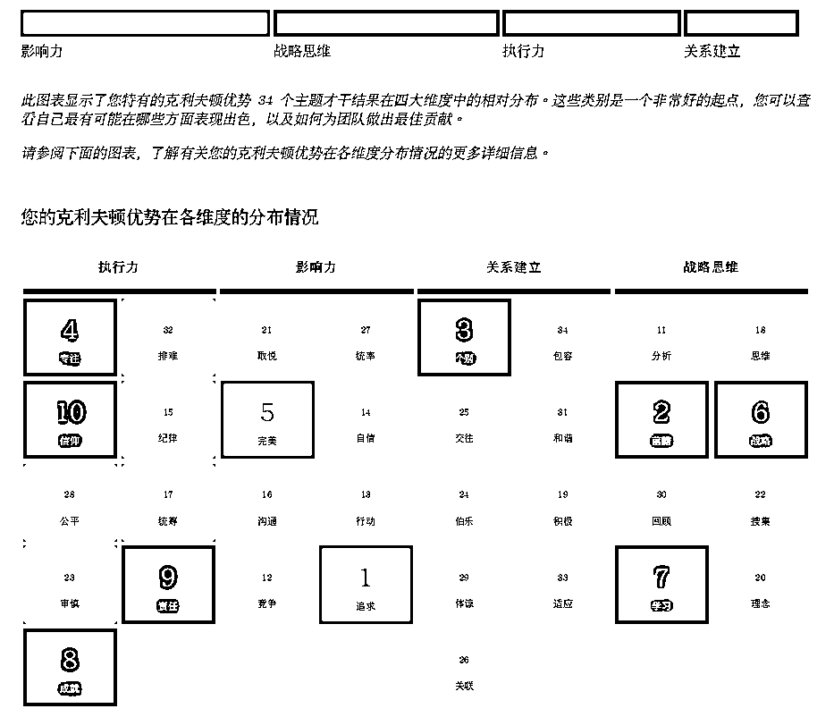
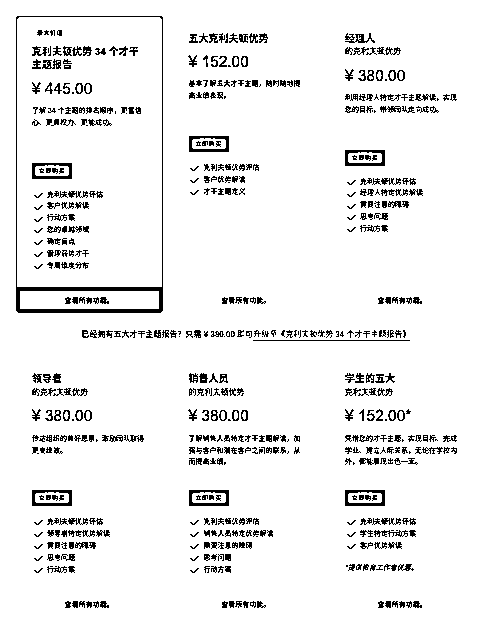
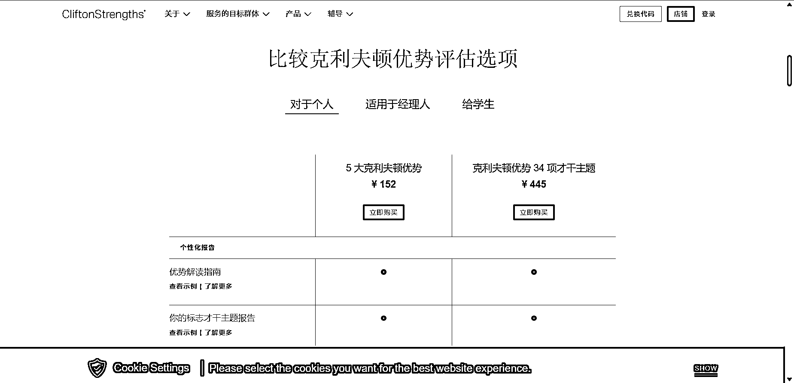

# 章节概要

盖洛普发展至今，已经衍生出 7 类测评，其中「34 项才干测评」，是盖洛普中的必测项目，这个测评能帮你发现自己可能存在的天赋。其他测评项目的区别，可以移步官网查阅 [👉「查找最适合你的克利夫顿优势评估」](https://www.gallup.com/cliftonstrengths/zh/253865/%E5%A4%87%E5%8F%97%E6%AC%A2%E8%BF%8E%E7%9A%84%E5%85%8B%E5%88%A9%E5%A4%AB%E9%A1%BF%E4%BC%98%E5%8A%BF%E8%AF%84%E4%BC%B0%E4%BA%A7%E5%93%81.aspx)。
如果你已经确定要进行一场盖洛普测试，请按照以下步骤操作：✅第一步：获取测评码✅第二步：注册新账户✅第三步：参加克利夫顿优势评估✅第四步：开始测评✅第五步：下载报告
目前，盖洛普测评码共有两种购买渠道：•优惠渠道：找教练代购•原价购买：官网购买
⚠️盖洛普测评发展到现在，已有成熟的流程来鉴定优势教练，本次航海的教练均已通过盖洛普官方的认证考核。为了便于教练们开展工作，官方也会给教练一些测评码优惠。只有盖洛普官方认证教练有折扣码，限额 350 个/年。
当然，大家也可以自己选择其他渠道购买，只要能获得正确的测评报告，即可了解自己的盖洛普测评结果。不建议大家直接在各浏览器搜索「盖洛普测评」，大概率会跳入非官方的广告。
在测评开始之前，请务必浏览一遍注意事项，并严格按照注意事项进行测评。否则，可能会出现不必要的错误与麻烦。👉「② 盖洛普测评注意事项」

盖洛普优势测评，也叫克利夫顿优势测评（正版官方网址：[`login.gallup.com/`](https://login.gallup.com/)），网上搜盖洛普测评会出现非常多推荐，但大多不是正版，测评结果偏差也很大。

截止到 2023 年 4 月，官方有 7 类测评，其中「克利夫顿优势 34 个才干主题测评」为必测项目，以下简称“34 项才干测评”，这个测评能帮你发现自己可能存在的天赋。

（官方参考报告）

下图中“经理人”、“领导者”、“销售人员”方面的优势无需测评，测完“34 项才干测评”后，付费即可解锁对应的优势报告。

如果对其他测评也感兴趣，可联系航海中的教练购买，同样有一定优惠。

（图片来自盖洛普官网）

本期航海主要使用「克利夫顿优势 34 个才干主题测评（CliftonStrengths 34）」

作用：展现个人的优势和弱点，帮助个人更好地理解自己的强项、弱点并发挥出色的表现，实现自我提升和职业发展。

价格：445 元（教练价 410 元）

报告内容：包含 34 个才干主题的排名和详细解释，以及针对个人的优势和弱点的定制建议。

其他测评项目的区别，可以移步官网查阅 [👉「查找最适合你的克利夫顿优势评估」](https://www.gallup.com/cliftonstrengths/zh/253865/%E5%A4%87%E5%8F%97%E6%AC%A2%E8%BF%8E%E7%9A%84%E5%85%8B%E5%88%A9%E5%A4%AB%E9%A1%BF%E4%BC%98%E5%8A%BF%E8%AF%84%E4%BC%B0%E4%BA%A7%E5%93%81.aspx)。

