# 公众号爆文写作 202308

> 来源：[`remhu1p2pr.feishu.cn/docx/SAgFdxXGpolERxxUPHMc9Te5n1f`](https://remhu1p2pr.feishu.cn/docx/SAgFdxXGpolERxxUPHMc9Te5n1f)

# 公众号爆文写作

出品时间：2023 年 8 月 18 日

建议：如果需要快速定位到精确内容，可以使用快捷键 Ctrl + F/command + F 的形式，搜索「关键字/词」，查找你想要的内容

写在前面

💡Hi,欢迎大家来到 公众号爆文写作 | 实战手册，相信在接下来的日子里，我们将在这里见面很多次。

首先需要跟大家说明的是，本次手册是在 5 月航海｜公众号爆文写作｜实战手册的基础上制作而成，新增内容主要为上一期航海的高手分

享内容，目前爆文热门领域以及如何快速入池的内容。主要集中在第五、七、九章节。所以大家在阅读的时候，会发现很多内容和之前的手册有所重叠，这是正常情况。

接着要告知大家的是，本次手册里涉及了 5 类公众号爆文目前比较好

做的领域，分别是：情感、热点、剧评、法律、历史，并按照公众号爆文写作的基本逻辑，分别介绍了各个类别下的创作方法和创作技巧。

除此之外，由于写作本身是一门可以迁移的底层技能，不管在什么平

台下的创作技巧，很多时候都是通用的，所以本文里也摘录了一些微头条的写作经验，希望可以帮助大家补齐写作技能。

随着 ChatGPT 的大火，本次手册也新增了 ChatGPT 的使用方法，希望可以帮助大家用这件趁手的工具，来进一步解决原创度和效率问

题，创作出更多 10W+爆文。可跳转链接至「六、ChatGPT 写作流程」。

同时，我们细化了公众号变现思路，呈现更多元的变现方式。可跳转链接至「七、公众号爆文的变现方式」。

❗️每一期航海手册我们都会持续迭代，如果你是本项目上次航海的老船员，那么以下有新增/有修改的内容可能更值得关注：

五、目前爆文热门领域

七、如何用 ChatGPT 自动写文章

九、如何快速进入池

为了能够给大家展示出这个项目中更多的可能性，希望大家通过阅读不同圈友们的经验后，能够从更多维度、更多人的视角中了解这个项目，从而更清晰地看到一个项目在从零到一过程中的各种路径及玩法。

我们搜集了不同类型的爆文写作经验，结合公众号爆文的写作流程，最终形成了本次的航海手册。所以在阅读的过程中，可能会有一定的拼凑感，但不影响内容完整度，也请大家理解。

手册怎么用？

前文有提到本次航海手册里会提供 5 种类别的爆文写作方法，如果：

你平时对热点比较关注，喜欢刷热榜，那么建议你先从热点类爆文写作开始；

你平时喜欢关注一些情感类的小故事，共情能力比较强，那么建议你先从情感类爆文写作开始；

你平时下班喜欢刷剧，对剧情有自己的理解，那么建议你先从剧评

类爆文写作开始；

你平时对今日说法类的内容感兴趣，关注社会时事，那么建议你先从法律类爆文写作开始；

你平时更喜欢诸如三国、水浒等历史类的文章，喜欢读历史等，那么建议你先从历史类爆文写作开始。

兴趣是坚持写作的一个很大动力，公众号爆文变现本身也是靠着不断的积累写作手感和时长，来提高爆文概率，最终提升收益的一件事。

所以如果能在自己感兴趣的领域里，进行创作，那么将大大提升坚持下去的动力。这也是我们建议大家从自己的兴趣出发的原因。

当然，学有余力的圈友，可以尝试多个领域，赚取更多的收益。

除了上述内容之外，还有个核心就是多提问，多交流。在这里如果没办法满足你的需求，多在航海群里向其他船员问问，我们会一起找到关于难题更多的解法。

希望大家可以在这次航行里收获成果外，结识一群战友。

以下内容由生财有术联合圈友制作而成，仅供航海船员以及生财有术星球圈友学习使用。

同时也欢迎圈友们在实践过程中持续反馈，和我们共同完善，可以联系鱼丸（yuwan387）提供修改建议～

话不多说，我们启航吧。

## 懒人思维导图（点击展开）

# 一、公众号爆文写作的前景

圈友 @渭水徐公 认为 2023 年微信公众号还有前途，就像它 2016 年和 2013 年一样有前途。

以下是他的观点：

回顾我们之前的成绩，单篇最高收入 7 万多，月入过万的 120 位同学，200 多位同学收益在 3000 以上，300 多位同学收益在 500 以上。

很多学员都是小白第一次写，从零开始到有收益，特别快，第一期有同学 3 天就开始有收益，而且是 300 多块。从结果上来说，我们的成绩是不错的。

大家都知道在最近头条，百家等平台，流量收益跌了很多，有些同学单价跌了快十几倍。

但是公众号就不一样，它花费的时间短，一般公众号一篇文章 1500 字左右，用嘴炮大法也就半个小时，打字也就一个小时。

从字数上来说，字数少，流量单价特别高，长尾流量特别长。

所以不管是从收益来讲，写作难度上来讲，还写作时间上来讲，公众号写作是近段时间自媒体最容易上手和赚钱的。

这里附上一些变现截图，供大家参考。

注：以上均为坚持日更的作者收益

目前，公众号变现方式主要有两种，广告变现和打赏变现。其中广告变现为主要方式，分别为自主接广告、商家找我们接广告、文内带货、文末贴片广告。而打赏变现，通常出现在 IP 属性较强的公众号里。具体方式详见「六、公众号爆文的变现方式」。

# 二、公众号爆文的五个撰写方向

目前已知的，在公众号上取得不错成绩的写作方向有 5 大类：

情感类

热点类

历史类

剧评类

法律类

本次航海也会教大家如何在这 5 类里面，写出爆款公众号文章。

由于这五类文章都是由：素材+选题+正文+标题等构成，所以本次航海手册内容，会在同一章节下，穿插不同类型的文章写作技巧。

比如「如何找到合适的素材」这一章节，就会分别告诉大家情感类、热点类文章等该怎么找素材。

# 三、前期准备

💡

章节概要

在准备好开始公众号写作之前，我们需要先做好一些前期准备。

比如注册公众号，完成账号包装，开通流量主等。对于我们来说，这些准备工作尽量以最快的速度完成。

因为这些并不是我们这次航海的重点，如何创作出爆款文章，获取流量主收益才是重心。

当然了，如果你对公众号 SEO 感兴趣，想通过一些设置来获得一些搜索流量，也是可以通过圈友 @郭耀天 的这篇文章：《最新公众号 SEO 核心玩法，自动引流躺着赚钱》，来进行设置。

SEO 核心玩法，自动引流躺着赚钱》，来进行设置。

## 3.1 注册公众号

进入微信公众平台 https://mp.weixin.qq.com/-->点击右上角的“立即注册”选项，会跳转进入注册网页，选择“订阅号“并点击它，进入后，按提示填好相关资料即可。

首先，我们要用一个身份证及其配套的银行卡，来注册公众号。这套物料可以

用自己的，也可以用别人的，如果家里的身份证实在不够用了，注册公司主体的公众号也是可以的。

请注意：个人可以注册一个，个体工商户、企业、其他组织可注册 2 个账号，政府和媒体可以注册五十个 。

关于公众号的名称以及简介设置，涉及到公众号 SEO，由于本次航海主要是告诉大家如何写出爆款文章，所以并不会展开说。

对于大家来说，选取一个好记并且和自己做的账号领域相关的名称和介绍即

可。

有余力的圈友，可以看下圈友 @郭耀天 的这篇公众号 SEO：《最新公众号 SEO 核心玩法，自动引流躺着赚钱》

## 3.2 开通流量主

注册完了公众号之后，需要 500 粉丝开流量主，买粉直接开的效率是最高的，且不会耽误后期的流量。买粉的渠道，某宝上一抓一大把，此处不再赘述。

开了流量主之后，记得先挂着原创群发三篇文章，之后就可以获得打赏权限。账号名字头像和打赏的名字头像，要尽量让它一致，这样看起来人设更真实。

然后简单装修一下账号，给账号贴个头像，起个名字，随便写写简介。前期的准备基本就完成了。这些地方完全无需纠结，把内容做好才是重中之重，此外全都是细枝末节，大家千万不要舍本逐末。

# 四、爆文写作逻辑

💡

章节概要

爆款优质文章的基本条件：

有好的标题，原创，有信息增量，不重复新闻，不传播负能量，满足了这 5 点，才有可能大爆。

而一篇文章的制作流程通常包含：

素材收集

确认选题

制作正文

完成标题

完成这四大步骤后，基本上一篇文章就已经完成的大部分，剩下的就

只是小动作，诸如题图配置、一段话介绍等，由于这些对我们的文章影响相较于核心四大步骤，影响不大，所以这里不会讲。

接下来将教会大家如何在不同的文章类型里，构建和完成文章的四大步骤，成功写出一篇爆款文章。

## 4.1 如何搭建素材库

做自媒体的都知道，想日更最大的一个问题是：天天写，哪里来的那么多素材

写呢？

对于没有素材库的伙伴来说，写一篇故事已经绞尽脑汁了，连续更新一个月，怕是连十几年前的 QQ 空间素材，都要翻出来写了。

这节课我们就来学习，我们写爆款故事的素材，到底从哪来？

### 4.1.1 情感类：素材来源

素材来源有很多途径：比如生活中自己身边发生的：亲朋好友、邻居身上发生

的，还有网络上的：知乎、抖音、百度、头条等平台。

当你在生活中遇到或听到一些，能触动自己的事情或话语；

在网上到处浪时，看到一些有意思的事情，把它随手记下来。

到累积了一定的读者后，可设置自动留言，留下微信号，让读者来倾诉，从读者身上获取素材。

还有平日看书读报时，遇到的好词好句，新奇的故事，以及影视剧、小说里的情节等。总之，哪里都有宝藏，难的是怎么发现。

下面主要展开讲解如何从亲朋好友以及短视频平台获取素材来源@Ray1）亲朋好友讲述

1）亲朋好友讲述

都说故事来源于生活，前段时间和亲戚吃饭，我发现我二姨很八卦，对村子里面的事情了解的很清楚。尤其是她说村子里面一位已婚妇女有两个孩子，为了生活去大城市打工，结果和别人好上了，还给人家生了个孩子，逢年过节都不

回家。最后和原配离婚，两个孩子扔在家里让老人带着，孩子的爸妈都不管，很可怜。

如果不是亲戚说的，我听到这种故事基本不会信。一直以为这种狗血的情节电视剧或者小说里面才会有，或者出现在新闻，没想到离自己这么近。

于是我突然想到每次看抖音的时候，一些情感纠纷的新闻下面，就会有网友评论，讲的是他们自己亲身经历或者身边的故事，我就想着说能不能将这些故事拿来用呢？这就是我们的第二个来源。

2）短视频平台的情感故事和评论区故事

这种方法的核心在于，通过关键词检索各平台的情感故事的同时，可以进一步关注故事的后续发展、评论区的引申故事等，从而丰富自己素材库。

讲一下大概的步骤：

首先根据想要的关键词进行搜索，例如婆婆；

然后对搜到的视频内容进行筛选，尽量找新闻媒体发布的视频，因为媒体号自带流量；

如果新闻里面的纠纷没有结局，那么可以搜索一下“XXX 后续”；

情感纠纷的视频下面会有很多人分享自己的经历，这部分故事也能作为参考；

不只是情感新闻，一些专门做情感节目的也可以，比如说《爱情保卫战》，后面会提到的《老娘舅》，如果还是不知道有哪些节目，可以直接搜索“情感纠纷节目”。

下面说一下我具体是怎么做的。

我在抖音里面搜索关键词，我感觉情感故事中婆媳关系的最多，那么搜索“婆婆”然后再加上一个情绪词或者动词，就会有很多相关视频。

搜索之后还不能直接拿来使用，需要经过筛选。

个人用户发的视频，很多都是照着剧本演的，这种视频有个优点就是受众明显，而且已经验证过了，但是素材可能老旧，或者是其他平台的爆文然后改编

的，如果直接用这种素材，阅读量不会很高。

另一种就是媒体发的新闻视频，现在媒体号经常会转发别人的视频，然后加个标题，和营销号的性质差不多，但是媒体号自带流量，评论区十分精彩。

看这个大象新闻的视频，18 万的赞评论区有 32395 条内容，说明视频引起了共鸣，有些网友会把自己的亲身经历讲出来。

比如我图片里面圈出来的这个，虽然内容比较简单，但是我觉得这已经可以拿

在搜索下拉框中，有一个 XXXX 事件后续，说明这个事情大家都很关心，都想知道最后怎么了。我也好奇搜了一下，但是没有后续。那么还是老规矩，打开评论区，还会有相关的评论。

这是一个情感调节的视频，内容主要讲了恶婆婆打断儿媳手臂，和两个女儿一

这个评论还是我搜索的时候前 20 分钟刚发的，不过依然是需要自己改编。

我在 B 站搜索关于曹心柔相关内容的时候，也看到了这个调解视频的来源，有很多故事素材，把这些新闻放到抖音里面搜索，然后看看这些视频下面是否

有网友评论

素材找到之后，就可以进行故事创作。

内容来源：5 月 25 日《抖音平台挖掘情感素材，网友评论也能出爆文》@Ray

### 4.1.2 热点类：素材来源

热点类的素材无外乎就来源于那几个热榜，什么微博热榜，今日头条热榜，知乎热榜等等。这些地方，往往有很多可供选择的热点选题。

但是另一方面，这些地方的热榜往往是经过粉饰的，所以我们也要留一个心眼，好好考虑一下大众到底关心什么。有很多知乎的爆款的回答，明明它有流量，但却和热榜没什么缘分。这些内容，往往比热榜上的内容更值得关注，写出来也更容易爆。

因为这些内容，都是大伙一个赞一个赞票选出来的。就算是没被热榜加持，都有这么多人关注，证明那就是大家想看到的内容。我们要的素材，要选的就是这样刀刀见血的好内容。

### 4.1.3 剧评类：素材来源

剧评的优点在于，完全不用担心素材的来源！你只需要做三个准备就可以：1）看剧时，把感兴趣的地方或者是打动你的话语在手机截图，添加到素材库！

1）看剧时，把感兴趣的地方或者是打动你的话语在手机截图，添加到素材库！

2）分析电视剧的高光时刻。

3）将电视剧与原著进行对比，很多时候电视剧与原著不同，将两者之间的差距，以及狗血的地方写出来。

我们就用《知否》或《甄嬛传》来做例子。

这两部剧都是口碑以及热度不错的剧，无论是盛祖母对明兰的敦敦教导还是明兰对生活的有感而发，都可以给我们带来很多的写点。

就拿《知否》中淑兰和离的高光时刻，可以写的文章就能达到三篇以及三篇以上！

我先给没看过剧的朋友们介绍一下背景：淑兰是出生于经商的盛家大房，带着丰厚的嫁妆嫁给了穷秀才孙志高，婚后婆婆一家花着她的嫁妆，还各种磋磨她，最终在孙秀才要带风尘女子回家做妾时，盛家大房大怒，这才有了和离的一幕！

那么，这三个方向能从哪里展开呢？各位请继续往下看：

①淑兰能顺利和离的真相----毕竟在古代男权社会，孙秀才没有什么太过的行为，淑兰和离完全不占优势，我们可以身边深挖一下淑兰和离的关键。

可以是淑兰的娘家对她的维护，不在乎名声的受损，只要淑兰能够脱离苦海，也可以从淑兰引申为女人自己立不起来的后果，毕竟淑兰有丰厚的嫁妆，养着孙家一家，还被磋磨成老妪般，只能说她自己太过于懦弱。

②孙秀才为什么敢与盛家叫板，最根本的原因是什么？

可以从经商的盛家不如读书人孙家的地位高，另外孙家什么都没有，真要闹翻了，孙家光脚的可不怕盛家穿鞋的，还有就是两家闹翻不仅仅是两个家庭，而是两个家族的交恶，毕竟家族为上的社会，盛家就算与孙家和离，也要顾及一

下孙家家族。

③明兰帮助淑兰和离后，祖母的一番话暗示她与小公爷的结局。

这个可以写的点就更多了，齐衡与盛明兰私下相爱，只是他们注定无法在一

起。

首先家世的差距，齐家是国公爷，齐衡又是独子，他承载着母亲平宁郡主的希望，而盛家只是一个小小的五品，盛明兰又只是一个小小的庶女。其次齐衡虽然喜欢盛明兰，但是他没有魄力为这段感情努力去争取，他不敢忤逆母亲平宁

郡主。最后便是平宁郡主看不上盛明兰，她想要对付盛明兰，手段有的是。

你看电视剧的一个高光时刻就能写出三篇甚至更多的文章，这对于爱看电视剧的同胞们来说，素材是不是信手拈来！

### 4.1.4 法律类：素材来源

1、新闻素材的来源，包括北青网、1818 黄金眼之类的官媒，这些信息来

源，一般来说都是可靠的，也都是适合我们写作的。

2、新闻素材的来源之二，头条新闻热榜及地方热榜。

点开头条热榜的详细内容，就会出现官方媒体的报道，比如这个热点艾滋病女子卖淫无防护被判刑，就是澎湃新闻报道的，大家可以关注澎湃新闻，如果有其他热点也可以点击进去，关注下相关的媒体。

这样就会慢慢积累很多的相关媒体，方便以后查找资料。热榜下面就是很多法律人关于此事件的文章，大家可以参考。

还有很多律师账号都写着抄袭必究，比如大兵叔叔，可以参考下他的写法，不能照抄照搬，否则头条会被判定为相似作品仅推荐给粉丝，还可能会受到作者

的投诉，得不偿失。

素材来源之三，裁判文书网。

里面有很多已经宣判的案件，大家可以拿来当做资料来写。注意一定要把详细的涉案人姓名模糊处理，不能直接写其真名。一方面是保护当事人，另一方面是防止当事人投诉。

### 4.1.5 历史类：素材来源

历史的素材来源也很容易，大家从小就学习这门课程，肯定能够找到很多新奇有趣的故事。从帝王将相到平民百姓，从将军出征到女子出嫁，可以写的地方

实在是太多了。况且，人们喜欢听故事，用一个惊险/紧张/圆满/愤怒/搞笑的故事来吸引大家看，这是很好的方向。

素材的来源也是多方面，比如我们看过的电影电视剧，听历史节目的百家讲坛，一些历史大 V 的人物讲解。甚至我们看到一些历史上的人物素材，我们

可以深挖他以后的命运，这也是一种方向（人们只看到了他在历史中的一瞬间，我们需要的就是把他的整个人生经历呈现出来）。

包括各位在刷头条/百家等平台时，也可以看到很多历史小故事，这些都是我们的素材库。

包括 B 站有几位讲历史非常不错的老师，我也分享一下：文大郎（三国历史无出其右者），正直讲史（清朝历史的一把好手），直男文史课（漫画讲历

史，搞笑又有趣），御史房（综合分享历史，思想分析很周到）

在这里隆重推荐喜马拉雅，因为这个平台对于百家讲坛的内容几乎是全部收纳，写故事最重要的也是要理解故事，在无聊时，上班途中，点开一集节目。老师会用通俗易懂的方式向我们讲解一段故事，这就是我们一段故事的很好来

源。加上他们思想深度，史料来源靠谱，所以这个故事写起来肯定是非常顺滑的。

我常听百家讲坛，分享几个我经常听得节目吧。

### 4.1.7 如何搭建素材库

当你有了很多的素材来源后，就有了源源不断的素材，这个时候就可以将这些素材分门别类的整理成一份素材库，后期在写作的时候，只需要在素材库里挑选合适的素材进行整合写作即可。

下面以情感类的素材库举例：

先给大家几个对标号：写故事的刘小念、陈若鱼、猪小浅，她们都是写故事的，写法略有不同，大家也可以像她们那样写，我们还可以从她们的号中，获取很多故事素材、爆款标题。

在「4.3.1 情感类：爆文模板」 里，我们会讲情感类的正文模版：一个故事=标题+主人公+故事的主干+结局。

展开来说就是：一个故事=标题+主人公+故事的主干（包含梦想或目标，挫

折、阻碍或意外，和惊喜或反转）+结局

拆开来说就是：一个故事=谁～想做什么事～为什么做或怎么做～做的过程遇到了什么～结果怎么样。

接下来，我们先想好，写一个什么主题的故事，再把标题写好，然后围绕着主题，把故事顺着写下去。

主人公：我是谁，多少岁，来自哪里，做什么的……就是简单介绍一下主人公的的基本情况；

再介绍一下，与主人公相关的其他人或物，和主人公是什么关系，怎么认识的，做什么的……也是简介单绍一下他、他们或它的基本情况。

故事主干：想做什么，发生了什么事情，遇到了什么问题。其中包括目标或梦

想、挫折或阻碍或意外。

结局：这件事对主人公的影响，主人公是怎么做的、或应该怎么做，结果是什么。

这样，一个故事就完成了。

那我们就按这个公式，来整理并建立素材库。

我们在生活中，文学作品中，小说中，影视剧中，热点新闻中，各网站平台中

找到的素材，如何让它们反复发挥作用呢？

首先，我们分别建 6 个素材库，把这 6 个素材库建好后，以后可以交叉使用，就能快速创作出一个故事。

1、标题库：平时看到什么好标题，就是那种你看了，就想点进去一探究竟的标题，然后随手把它存在标题库里。

例如：

1）我 66 岁，退休金 8000，儿孙满堂，但我却不想活了；

2）听完我妈死前说的那番话，我这辈子都不能结婚了；3）我和堂哥的地下恋，坚持了 20 年，结局让人意想不到；

3）我和堂哥的地下恋，坚持了 20 年，结局让人意想不到；

4）我 68 岁，生过大病才知道，有些东西必须握紧，比亲生孩子还可靠

……等等，有异常，能吸引你想点进去看的标题。

2、主人公库：这个素材的来源，就是你平时看到的新闻，各种报道，听到的

八卦，小说中的，影视中的，或者身边真实发生的事件，将这些事件中的主人公放到你的主人公库里备用。

例如：

1）18 岁未婚就当妈的小佳；2）患有不孕症的小爱；

2）患有不孕症的小爱；

2）40 岁不结婚，还有很多女人倒贴的老光棍；

3）55 岁大妈生三胎；

4）50 多岁大妈再婚，还要 100 万彩礼；

……等等有异常、有争议的人物。

故事主干库：包含了梦想或目标库，挫折、阻碍或意外库，惊喜或反转库，3 个库。

这 3 个素材库的来源，和上面的一样，我们将这些事件中，人物的梦想或目

标，挫折、阻碍或意外，以及惊喜记下来。

3、梦想或目标库：

例如：

1）不孕的夫妻想生娃 2）结婚想买婚房

2）结婚想买婚房

3）老大爷想找老伴

4）重男轻女的家庭二胎想生男孩

5）想开一家美容院

……等等。

4、挫折、阻碍或意外库：

例如：

1）结婚多年的恩爱夫妻，却始终没有怀孕，医院也查不出毛病；

2）房租突然涨价了；3）谈了几年的男/女友，因为彩礼/房子……等原因，遭到父母反对

3）谈了几年的男/女友，因为彩礼/房子……等原因，遭到父母反对

4）好好的在跳舞，突然中风了；

5）和男/女友感情很好，一方突然卷钱失踪了；

6）和老公/老婆相亲相爱多年，老公/老婆突然要离婚；

……等等。

5、惊喜或反转库：

比如：

1）老家拆迁，得了很多钱和房子；

2）本来女友父母要 50 万彩礼，突然只要 8 万；3）失散多年的儿子，突然开着宝马回来了；

3）失散多年的儿子，突然开着宝马回来了；

4）结婚多年，看过很多医生都没有怀孕的女人，3 年后突然怀孕了；

5）房东突然减免房租；

……等等。

6、结局库：这个素材库的来源，和上面的一样，我们将这些事件中的人物，最后的结局，记下来，结局可以是好的，也可以是坏的。

比如：

1）复婚了 2）离婚了

2）离婚了

3）一家人幸福快乐的生活在一起

4）儿子把她接到家里养老

5）找到合适的老伴，一起安享晚年

6）去了养老院 7）夫妻更恩爱了

7）夫妻更恩爱了

这 6 个素材库建好了之后，我们几分钟以就能讲出一个故事来。

例如：我们用上面除了开头外，其余素材库的 1、5、2、4、5、3 来写一个故

事，如下 ：

小佳才 18 岁，还没有结婚，就当了妈妈（主人公库 1），她想要开一家美容院（梦想或目标库 5），但是她只有 8 万块钱，她看中了一间月租金 7 万的店面，想租下来，房东突然说要 9 万（挫折或意外库 2），正当她想放弃时，突然传来消息，房东中风了（挫折或意外库 4），而且房东的儿女不舍

得出钱，给他治病，就想把店面尽快租出去，愿意降价到 6 万租给她（惊喜或反转库 5），8 年后，她的美容院开成了连锁店，她孩子的父亲，也回来找到了她，从此，他们一家人，幸福快乐的生活在一起（结局库 3）。

这样子，一篇一波三折的初稿就有了。而且很具真实性，让人看了会有共鸣。

（不想写故事，想要写观点鸡汤文的朋友，就用这样的小故事，再加上一些观点、名言、金句就可以了，一般观点鸡汤文，就是 3 个小故事，每个故事后面加点观点、名言、金句。那就在这 6 个素材库的基础上，再建一个观点、名言、金句库，就 OK 啦）

回到正题，有了这样一个故事后，我们再往里面添加一些细节、对话、动作、心理活动等，就成了一篇有血有肉的故事文了。

一个故事要引人入胜，情节要足够曲折，不能太平淡，还要有非常好的起承转

合。

有了这个素材库，一天写 10 个故事都不在话下。

一个素材库，写出 N 个故事的方法：把素材库中的主人公、梦想或目标、挫

折或意外、惊喜和结局这些要素，打乱，然后进行不同的组合，组成新的故事。

比如刚刚上面例子：小佳那个，用的是素材库 152453，也可以用 12345 来编一个，或用 22335 也行，以此类推，只需作一点点调整即可。

我再举个简单的例子：

主人公：2 小爱 26 岁，财务；其他人物是小王 29 岁，业务员，他们是夫妻

故事主干：他们想生个孩子（梦想或目标 1），可是结婚 3 年也没怀上（挫折或意外 1）他们看了许多医生，吃了很多药，也没用，他们认命了，不再治

了，却在 1 年后，怀上了孩子（惊喜或反转 4）

结局：7 夫妻更恩爱了。

以上结合起来就是一个小故事雏形，如下：

我叫小爱，今年 26 岁，做财务工作；我老公叫小王，29 岁，是个业务员。

我们结婚 3 年多了，一直想要个孩子，可是没有避孕，也一直没怀上。

我们去看了许多医生，吃了很多药，也没用。

我们认命了，不再治了，却在 1 年后，意外怀上了孩子。

这样，一个小故事的雏形就出来了，但这样字数太少，也不够吸引人，需要往

里面填充一些细节、情节，填充的越曲折越好。

把故事填充写完之后，就是加观点，和信息量的时候，也就是结尾了。

故事写完后， @自己一下，然后加上一些，自己的总结观点或感悟。

最后，再抛给读者一个问题，这个问题可以是问读者：认不认同你的观点，也可以是问读者：对这个故事里发生的事、有什么看法或观点，反正自己想问什么就问什么。这样，一篇完整的故事文就完成了。

比如：上面小爱那个例子，我们可以给出这样的观点：怀不上孩子的夫妻，不要放弃，只要肯积极就医，放松心情，还是会出现奇迹的。

可以抛出一个这样的问题给读者讨论：你身边有不孕不育的夫妻吗？他们后来生孩子了吗？

其实，这个总结的观点、感悟和问题，可以随便按你的意思来，但不能不写。

这个观点或感悟，如果可以引用一些心灵鸡汤，或名人名言，电影、电视、什么书的金句，那就更好了。

大家以后看电影、看新闻、看书、刷剧、刷视频时，记得把有意思的标题或开头，主人公，梦想或目标，挫折或阻碍或意外，惊喜和结局，这 6 个要素提取出来，分类放在自己建立的素材库里，要用时就拿出来用，就不怕没素材写了。

说白了，收集素材，就好比我们到超市买菜，喜欢什么菜、被什么菜吸引，就把它放进购物车。

整理素材并建立素材库存，就好比我们把菜买回来后，要分门别类地放进冰

箱，要煮来吃时，就可以随手拿出来煮。

而写故事，就好比我们炒菜或煲汤，可以胡萝卜+玉米+马蹄+骨头一起煮或煲汤，也可以放别的菜一起炒或煲汤。

至于人们喜欢吃什么菜？喝什么汤？正所谓众口难调，得多次试验后，才知道。

注意：故事的主干内容、情节要详细得当，与主题无关的，略写；能体现人物性格、对故事起推动作用的，要详写。

结尾尽量反其道而行，让读者产生意料之外、情理之中的情感体验。故事的主干，尽可能多用动词来描写，用大白话来写。

少用形容词，多用动词，用连贯的动作来描写，让人有身临其境的感觉，让读

者有代入感，有画面感，引起他们感同身受的感觉，从而引起他们的共鸣。

总之，整个故事，要少用或不要描述，语言要简练（比如：月工资 100 元、一个月挣 100 块钱），带入场景，多用动词+名词，让语言更加生动，多用转折词、连接词。

还有就是，不要抄袭、不要抄袭、不要抄袭，重要的事说三遍，包括标题，一定要自己动动脑瓜子改一改，可以模仿，但不能抄袭。

尽量写贴近生活的，温情一些的，正能量的，不要太狗血，太暴力，特别是有

违公序良俗、乱伦、色情的，千万别碰。

建立素材库我用的 Excel，然后导入印象笔记里，因为我觉得表格比较直观，大家习惯用什么，自己选择哈。

上面这个图，就是我的素材库，这里面的素材，互相交叉、搭配，可以写出很多不同的故事，60 个素材，一年都写不完，当然收集得越多越好。

## 4.2 如何找到合适的选题

素材来源这么多，如何浪里淘沙，找出可以写，值得写的内容呢？

比如：能引起共鸣、感人至深、有争议的、事出异常的素材。其中包括：

1）有曲折性；

2）有情绪；

3）有信息增量；

4）有关民生问题；5）明星名人；

5）明星名人；

6）性；

7）暴力；

8）金钱。

一个故事里，要包含上面 8 个要素中，至少 3 个以上。

### 4.2.2 热点类：如何选题

热点类的选题，当然是优先从各类热榜上选题。我常用的是微博热榜和知乎热榜，但在具体的热点亚种中，选题的方向也是略有差别的。

“指点江山类”，就是专门抨击当下社会不公事件的内容，主要的阅读者是中老

年男性粉丝。

在给这类内容做选题时，知乎热榜明显优于微博热榜。因为知乎对社会的负面新闻曝光的力度会更大一些，微博热榜则粉饰痕迹较强，力度也会远远逊于前者。

我们必须关注到一个问题，有很多的知乎爆款的回答，明明它有流量，但却和热榜没什么缘分。这些内容，往往比热榜上的内容更尖锐，写出来也更容易爆。因为这些内容，都是大伙一个赞一个赞票选出来的，证明它已经成功撩拨起了读者的情绪。我们选题，要选的就是这样刀刀见血的好内容。

“娱乐热点类”，就是专门追当下的娱乐热点，主要的阅读者是中青年女性。

这类的选题不用多说，对大多数的作者来说，微博热榜的作用是高于一切的。我们需要一天多刷几次微博，看到微博的热榜字样。有“热”字的可供挑选，有

“养生热点类”，就是专门做科普知识类的内容，主要的阅读者是不分性别的中老年人。

特别提示，这个“养生”和我们认知里的“养生”不太一样。它一般都来源于一些

古话，什么“立春三不吃两不喝”之类的。老年人的死亡焦虑和疾病焦虑很重，他们看到这类的内容，会为我们贡献很多阅读量。

我们需要做的，就是结合农历的节气，以及在热榜中，挑选出和“健康”相关的内容写文，但写的时候只能往古代习俗上靠，不要给任何医学建议，否则会严

其余的热点类亚种，我接触得比较少，就留待未来探索了。

### 4.2.3 剧评类：如何选题

剧评类的选题思路，一共有两个。

第一个是“热点+剧评”向。比如最近，电影《满江红》就非常火，人们对它也是褒贬不一。如果在这个阶段，写出五六七八篇角度新奇的影评，就能够吃到

第二个是“经典老剧”向。比如《知否》《甄嬛传》《大明王朝 1566》等等。这些老剧本身的流量就非常大，而且信息量也很大，随便一个细节就能挖出很

多内容来，写来写去都不会太缺选题。不夸张的说，给一部剧写出几百篇都问题不大。

两个方向，都可以作为你的选题方向。

### 4.2.4 法律类：如何选题

建议大家在写新闻的时候尽量选择官媒报道过的，这样就很少会出现被投诉的

4.2.4 法律类：如何选题建议大家在写新闻的时候尽量选择官媒报道过的，这样就很少会出现被投诉的

4.2.4 法律类：如何选题建议大家在写新闻的时候尽量选择官媒报道过的，这样就很少会出现被投诉的

所以，我这次没有建议大家去微博知乎找，原因就在于此。除了这些地方，各地的新闻节目也可充当素材。你看到哪条新闻时感觉血压上来了，就选哪条新闻，看着没感觉的就不选。

如果理智一点的话，就对照着开幕雷击七要素选，占 2 条要素以上的新闻要优先录用，只占 1 条的不建议使用，1 条不占的绝对不能用。

后面的法律条文，直接百度检索就可以，检索的关键词，就是新闻故事的本质。比如说，一个人把另一个人的头打破了，你就可以检索“把人打成轻伤怎

### 4.2.5 历史类：如何选题

历史类选题其实也可以追热点，也可以中规中矩，按自己想法写。

1、所谓的追热点，就是要时刻关注热点动向。

例如”胡歌生女，众人震惊“，我们也可以寻找一些重要人物的出生或者他生了孩子，也引起巨大反响。当然，这个热点，需要非常大的契合度，在经验不足时不建议写作。

类似的还可以找到“县长贪污”的新闻，可以借助这个事件写古代官员如果贪

注意：追热点历史，需要找到契合度非常高的，而且从今观古，需要作者相对

比较高的写作功底，各位可以在以后的写作中慢慢为自己加分。

2、中规中矩写作，就是按照我们自己的想法，写出自己喜欢的历史人物和事件。

写作最重要的就是要写的高兴，可以选择敬佩的人物，讨厌的人物，觉得惋惜

的人物，让人落泪的人物，都可以。

找到人物之后，确定好写作的基调，包括他的人物事迹，就可以大致给这个人物一个基本概括了。是敬佩，是同情，是值得肯定还是毁誉参半，全文按照一个基本的思想去写作，就没有什么太大的问题了。

对于一些记载很少，但是非常喜欢的人物，可以从他的前人后人，身边人等等角度来写作，也可以适当编撰一些，但是不要太过虚假，始终保证假故事也要为真性格服务即可。

再推荐一个圈友@一来 试过的近代史领域的选题，如果你在写历史类的领

域，近代史也可以涉及一下

近代史这个领域起号相对比较难，常常需要一个月，甚至还有不确定的地方，但是如果账号进入了流量池，这个领域的阅读量还是比较稳定的。

大家可以参考一个账号叫“飞扬说史”，基本上每天都有大小爆款。不好的地

方，文中经常也会没有广告。

内容来源：6 月 8 日《公众号流量主的经验分享》@一来

### 4.2.6 选题技巧 @亦小亮

1）大胆细分

即使是情感文，依然可以继续细分，细分在婆媳、相亲、女权等等，越细分，你的目标人群看文章时间越长，完读率越高。

即使是热点，也是可以细分的，比如军事（台湾选举、俄乌战争）、历史、网红背后故事，比如前段时间的豪哥哥，你可以用拆解的角度去写，人物故事、

拍摄手法、拍摄内容、商业逻辑、爆火背后。

2） 用户需要

通过搜一搜、看一看、微信指数查看相关关键词，指数高、文章数量少、质量

拍摄手法、拍摄内容、商业逻辑、爆火背后。2） 用户需要通过搜一搜、看一看、微信指数查看相关关键词，指数高、文章数量少、质量 3） 长期价值「有长尾效应」

3） 长期价值「有长尾效应」

这个是我选题的时候特别重视的，一旦不符合我一鱼多吃思维的产品，坚决不要，比如我有一个旅游号，文章内容写好后，也会分发到携程、大众点评网

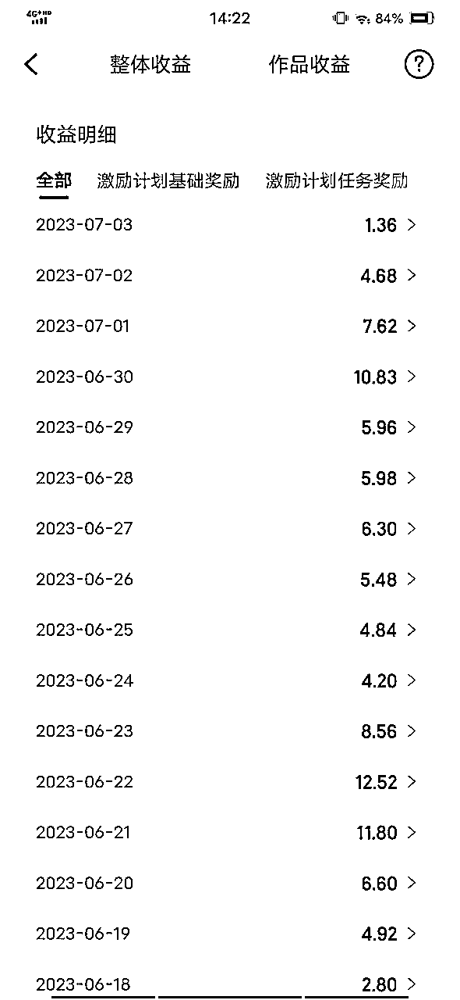

携程已经保证我一天平均拿到 10 快钱（当然你要深耕也不会这么少），目前总收入也快有 3000 块钱了。

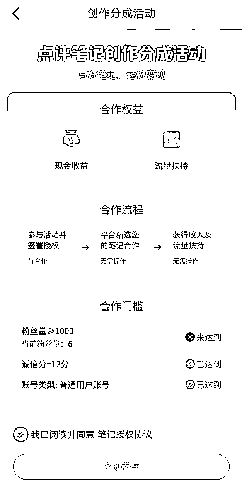

其实，旅游号也可以追热点的，比如前段时间，贵州榕江的村超，我就把榕江的旅游写了三篇文章，分别从攻略、人土风情、当地特产，狠狠赚了一波流量生意。

目前疫情恢复以后，旅游将会是一直热门领域，是个非常不错可以长期深耕的领域。

其实，体育赛道也是一个非常适合长期来做的赛道，细分下去，比如篮球-中国女篮。

内容来源：7 月 4 日《如何迅速把一篇文章的阅读量提高到 1 万+》@亦小亮

### 4.2.7 选题避坑 @半糖梦呓

公众号同样都是公域流量，措辞上一定要非常注意，有时候题材踩了坑，写得再好也很难爆。甚至有时候用了某个违禁词，也会被平台打压。

那么具体有哪些坑需要避免呢？主要包含以下三种：1、政治红线不能踩

1、政治红线不能踩

内容平台每个月都要封禁几千上万个账号。这些账号当中绝大部分都是些很黄很暴力的号，还有相当一部分是因为踩了政治红线而被封禁。

什么是政治红线呢？

我们只需要记住两个词：党史、军史。（准备写文史类内容的作者尤其要注意）

我们的党和军队都是正面的形象，我们在写作的时候，也只能选择正面的内容

来写。除此之外，其他的都不要写了。如果想要确保足够的安全，1840 年以后和中国有关的任何事情，最好都别写了。

而民国的人物和历史，半糖的建议是慎写，新手最好不要触碰。

文史领域本身就比较敏感。我们作为自媒体人，更要牢记使命，不忘初心。不该说的话，一个字也别多说；敏感的历史事件、人物一根头发丝都不要提。

那么有的小伙伴说，我就喜欢历史怎么办呢？

建议新手可以从古代史入手，而且是最好是中国古代史。一来比较安全，二来受众广话题多，容易出爆款。

2、追热点不吃人血馒头

追热点是自媒体人的天职，但是有一类热点在公域平台写作，绝对不建议碰

的，那就是吃人血馒头。

什么叫吃人血馒头？

第一个例子叫做二更食堂。

这个号曾经是一个百万粉丝的大号，现如今已经被封号了。原因是滴滴空姐被害事件后，二更食堂利用大众对这件事的关注度，编造了许多无中生有的情节，用词情色、猥琐，对死者是一种侮辱。

这种行为就叫吃人血馒头。

吃人血馒头的后果就是百万粉丝大号说封就封，一点余地没有。

第二个例子叫做今夜 90 后。

一个孩子和母亲吵架后跳桥了。今夜 90 后虚构了许多不存在的细节，事后证明这些细节压根就是杜撰的，只是这个博主为了博人眼球罢了。

这个账号同样被封禁了。

利用逝者大做文章，甚至编造出一些不存在的细节，用夸张的、性暗示的语言来描述该事件，这种吃相实在是难看。网络不是法外之地，更不是道德禁区。

中国人向来认为死者为大，如果谁想拿逝者来做文章，是会激起众怒的。

有的小伙伴就问了：碰到这样的热点，我不吃人血馒头，也不脑补造谣，我就是站在小老百姓的角度，评判一下社会不行吗？

不行。

因为这样一不小心就会挑起社会对立、煽动仇恨情绪。那么多正面事件你看不见，专盯着社会负面写，不封你封谁？

内容来源：《今日头条七大变现方式，我只用一种，半年赚 80000》

## 4.3 如何写好文章正文💡

💡

小节概要

通常来说，文章正文都是有套路可循，或者说有现成的模版可以模仿，我们要做的就只是按照模版，来搜集素材并进行一定的润色填充

即可。

对于本次航海的五大类型来说，他们的爆款模版分别是：

情感类：标题+主人公+故事的主干+结尾

热点类：标题+基本故事+态度/观点+结尾

剧评类：标题+剧情+观点/剧情解析+结尾

法律类：说地名+列冲突+讲新闻+网友看+说法律+怎么做+引互动

历史类：提出问题+解答问题

下面就将教会大家对于不同类型的爆文，都有哪些模版是可以用的。

### 4.3.1 情感类：爆文模版

写情感类故事文的公式：标题+主人公+故事的主干+结尾=一个故事。

展开说就是：一个故事=标题+主人公+故事的主干（包含梦想或目标，挫折、阻碍或意外，和惊喜或反转）+结局。

拆开来说就是：一个故事=谁～想做什么事～为什么做或怎么做～做的过程遇

到了什么～结果怎么样。

接下来，我们先想好，写一个什么主题的故事，再把标题写好，然后围绕着主题，把故事顺着写下去。

主人公：我是谁，多少岁，来自哪里，做什么的……就是简单介绍一下主人公的的基本情况；

再介绍一下，与主人公相关的其他人或物，和主人公是什么关系，怎么认识的，做什么的……也是简介单绍一下他、他们或它的基本情况。

故事主干：想做什么，发生了什么事情，遇到了什么问题。其中包括目标或梦想、挫折或阻碍或意外。

结局：这件事对主人公的影响，主人公是怎么做的、或应该怎么做，结果是什

么。

这样，一个故事就完成了。

注意：爆款优质故事的基本条件：

有好的标题，原创，有信息增量，不重复新闻，不传播负能量，满足了这 5 点，才有可能大爆。

一般写故事，都用第一人称来写，方便读者理解。当然，这不是一定的，根据个人喜好来就好。

故事的主干内容、情节要详细得当，与主题无关的，略写；能体现人物性格、对故事起推动作用的，要详写。

结尾尽量反其道而行，让读者产生意料之外、情理之中的情感体验。

比如：某女结婚，要彩礼太多，婆家要退婚（读者想到的结果是分手），但我们把结果写成结婚了。

至于为什么还结婚了，这个就要靠我们自己来写，这其中反转的故事情节了。

故事可以是虚构的，也可以是自己、或朋友身边发生的真实事情，但一定要正向引导，不能违背伦常纲化、伦理道德，负能量。

例文：

《除夕夜公公给我们 100 万，本是高兴的事，可被老公闹得家里鸡飞狗跳》《我 69 岁，发现 40 岁保姆偷我钱，我要求她“肉偿”，她的反应吓傻我》

《我 69 岁，发现 40 岁保姆偷我钱，我要求她“肉偿”，她的反应吓傻我》

《我 33 岁 阳了，老公连夜带着孩子逃了，半夜有人压在我身上，睁开眼我吓傻了》

《老公不在家，公公半夜让我满足要求，掏出 3 万块，结局意外》

《公公病危，儿媳献身，公公舒服，婆婆支持，老公发飙，结局意外》《我 51 岁，二婚老婆夜班，继女爬上我的床，说难受让我帮帮她，我让她愉悦，老婆夸我真棒》

《我 51 岁，二婚老婆夜班，继女爬上我的床，说难受让我帮帮她，我让她愉悦，老婆夸我真棒》

### 4.3.2 热点类：爆文模版

#### 4.3.2.1 案例一：龙骨龙鳞公式

一篇完整的文章是一条龙。文章的梗概，也就是事情本身，是龙骨，其余散落

的金句观点细节态度，是龙鳞。

龙骨要求你把事情讲明白就行，要求就这么简单。如果事件太过复杂，需要很长的篇幅讲清楚，那么只花笔墨，把一个侧面讲清楚就好，千万别太过追求全面描述了。如果事情说复杂了，整个文章的篇幅就会被拖长，这样也会严重影

响文章的完读率。

而龙鳞，则要点清楚你的态度和观点。之前我们在写故事的时候，所有的龙鳞都用来表达故事的细节，就是为了让故事更加真实可信。但写热点文的时候，素材都是真实发生的热点事件，所以无需再通过细节来证明它的真实性了。如

果加了，反而可能会引发一些不好的效果（比如二更食堂的那次负面事件）。

龙鳞在热点文的作用，只用来站队，表达态度，写清观点就好。其余的作用一概不要有。

以上便是热点文的写法，其实就是这么简单。在陈述事件的时候，一旦你的情绪上来了，就用词句把它写出来，用它来争取和你共鸣的读者。记住这么一句话就足够了。

#### 4.3.2.2 案例二：不同难度的爆文公式@妞妞💋

一篇简单的热点文=标题+开头+事件陈述+结论（对标：泡哥看世界）

一篇有深度的热点文=标题+开头+事件陈述+对比论证（可省略）+结论（对标：桌子的生活观）

（对标：桌子的生活观）

拆解公式

1）标题（记得要有开幕雷击 50 字以内）

比如：突发！“中石油牵手门”男女主再曝大料，这背后可不简单 2）文章开头（100 字左右）

2）文章开头（100 字左右）

可以是自己对这件事的领悟，或者直接开始写这件事。

比如：① 生活经常给我们惊喜。

① 生活经常给我们惊喜。

就像成都一个摄影师小哥玩个街拍，居然拍出了一个国企大领导“牵手门”丑闻。

② xx 月 xx 日，一个话题冲上了热搜。“宝妈因孩子吃了同学生日蛋糕发飙”，

这个事件，很快就引发了网友的热议。是怎么回事呢？

③ 万万没想到，珠穆朗玛峰也会发生这样的事。近日，#珠峰攀登者放弃登顶救起濒死女子#，话题冲上了热搜第一。

④ 大家还记得十天前，武汉教师碾压学生致死事件吗？没想到，学生竟然在学校被自己的老师碾死。

然而事情刚刚过去几天，悲痛的消息再次传来：被撞孩子的母亲，在孩子去世十天后，也从 24 楼一跃而下。

等等……按自己习惯和擅长的来就好。

3）事件陈述（500 字左右）用 GPT 辅助

即把整件事发生的时间、人物、地点、发生了什么事等，讲一遍（500 字左

右，配上事件相关的图片），这里可以用 GPT 来帮我们梳理讲述。

① 如果你用的 GPT3.5，就把你要写的热点事件整个复制过来，喂给 GPT，让 GPT 帮你梳理、提炼出提纲和主题，事件的核心内容等（文章过长的，要分段喂，一段不要超过 600 字，多了它会罢工）。

提示词：

“XXXXXXXXXX” 你是热点事件点评师，请帮我梳理、提炼出上面热点事件的提纲和主题，还有事件的核心内容。

注意：这里的“XXXXXXXXXX”是你所选的热点事件原文。

再让 GPT 将它刚提炼出来这些内容写成一篇文章，提示词：

请将你上面梳理和提炼出的提纲、主题，还有事件的核心内容，写成一个完整的事件，事件的主题意思不变，字数 500 字。

② 如果你用的是 GPT4，那就更好办，直接把链接给 GPT，让它自己读取并梳理、提炼热点事件的提纲和主题，还有事件的核心内容。

提示词：“XXXXXXXXXX” 你是热点事件点评师，请帮我梳理、提炼链接里这个热点事件的提纲和主题，还有事件的核心内容。

“XXXXXXXXXX” 你是热点事件点评师，请帮我梳理、提炼链接里这个热点事件的提纲和主题，还有事件的核心内容。

注意：这里的“XXXXXXXXXX”是你所选的热点事件原文的链接，这个链接如果是百度、头条或其他网站，不是 GPT 能读的，得先把文章复制粘贴到飞

书，然后把飞书的链接复制给 GPT，如果是公众号的，可以直接给 GPT。

还有要注意的是，这个功能要用到 GPT4 Model: Plugins•Enabled plugins 模式（为了让 GPT4 读取链接内容的一个插件），如下图：

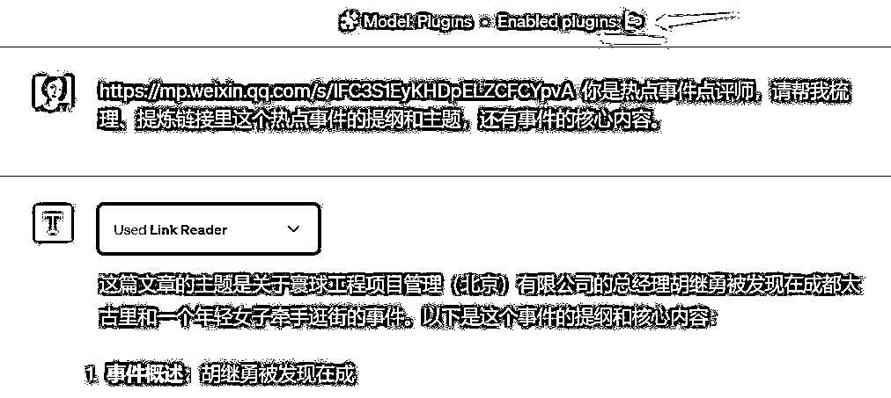

再让 GPT 将它刚提炼出来这些内容写成一篇文章。

提示词：

请将你上面梳理和提炼出的提纲、主题，还有事件的核心内容，写成一个完整

的事件，事件的主题意思不变，字数 500 字。

这样做的目的，是避免和热点事件重复，过不了原创，还有就是能把事件简述化了，既能让人一看就知道整个事件的来龙去脉，又不会很长或过于拖沓，还

有利于提高完读率。

4）对比认证（300 字左右）

这步可有可无，如果热点事件正火爆，而且热度很高，就可以省略这步，反

之，则加上比较好。

做法是，去网上搜索一两个相似类型的事件，和这个事件作比对，并加几句点评。

5）给出论点并激发读者的情绪（300 字左右）

这里也可以让 GPT 帮忙，让它写出对这个事件的看法和论点，然后自己再稍为人工修改一下，因为 GPT 是机器，它没有情绪，我们要改得有情绪一点，愤青一点。

提示词：

请点评你上面刚写的这个热点事件，见解独到一点、犀利一点，以引发读者的情绪，字数 300 字。

例文：

大家可以看先看看以下 2 篇例文：

例文 1：胡继勇带女员工在太古里牵手逛街！女方的素颜照很一般，但胜在腿长肤白无对比论证简单粗暴法

例文 2：“我儿子被投毒了！”家长群聊天记录流出后，我看得好窒息……有对比论证有深度的写法

我们对照前面说的「拆解公式」，来看看例文的具体内容构成：这里选用的例文 2：① 标题（要有开幕雷击 50 字以内）

① 标题（要有开幕雷击 50 字以内）

我儿子被投毒了！”家长群聊天记录流出后，我看得好窒息……

② 文章开头（100 字左右）

6 月 6 日，一个话题冲上了热搜。

“宝妈因孩子吃了同学生日蛋糕发飙”，这个事件，很快就引发了网友的热议。是怎么回事呢？

③ 事件陈述（600 字左右）

从"有网友发帖分享了一段家长群中的对话，从聊天截图我们得知：

六一儿童节，有位家长带了蛋糕，给孩子们集体分享。到”再毒的奶油蛋糕，其危害性也比心灵的终极污染小得多。"

具体的大家去看原文：“我儿子被投毒了！”家长群聊天记录流出后，我看得好窒息……

④ 对比论证（300 字左右）

论证 1、知乎作者“一只小仙女”说过自己的经历。

论证 2、有个网友说：妈妈的一个同事，因为孩子吃了辣条，逼孩子吃了成人两倍剂量的泻药。

论证 3、主持人倪萍分享的一个故事，让我十分感触

具体的大家去看原文：“我儿子被投毒了！”家长群聊天记录流出后，我看得好窒息……

⑤ 给出论点并激发读者的情绪（300 字左右）

”只有自己的内心得到过满足，才不会匮乏“。到”没有人一生都在吃标准的食物，也没有人一生都在走正确的道路。对孩子和家长来说，适当保持一点松弛感和容错率，或许我们都能活得更轻松“。

内容来源：7 月 13 日《用 GPT 写热点文&公众号快速入池的方法》@妞妞💋

### 4.3.3 剧评类：爆文模版

写剧评的公式：标题+剧情+观点/剧情解析+结尾=剧评

1）观点文样式的剧评，无论剧情还是细节都要有一个落脚点，这个落脚点就

是你的观点。

比如：明兰不知，原来顾廷烨与贺弘文求娶她目的相同（读者会好奇到底是哪个目的）

剧情为：顾廷烨算计求娶明兰，他明知明兰与贺弘文即将订婚，故意将贺弘文

那青梅竹马的曹表妹送到京城，果不其然曹表妹请求给贺弘文做妾，贺弘文心动了，他故意等着明兰妥协，在双方僵持的时候，顾廷烨求娶明兰。

观点：适合！对于贺弘文来说，无论明兰的手段还是家世都比较适合他，对于顾廷烨来说，依旧是合适，不过不是家世，而是品行以及手段，毕竟顾廷烨心

中谨记父亲的话：“娶妻娶贤。”明兰各方面都合适，有主意有手段，还能与继婆婆抗衡。

结尾：婚姻的本质不是爱情，而是适合，毕竟互相扶持的婚姻比单纯的爱情要强得多。

就像明兰所言：“婚姻里未必一定需要爱情，作为女人也不应该把眼光放在儿女情长上，要实现经济和精神的独立，去看看更广阔的世界。”

这篇文章阅读量 3.8W，收益 200+。

盛家四个女儿，墨兰才是嫁的最好的（读者会好奇，为什么墨兰做了如此苟且的事情还是嫁的最好的呢？)

剧情：墨兰身为盛家的女儿，为嫁入高门，不顾盛家名声，与永昌伯爵府的公子苟且，逼着盛家上下成全她，帮她嫁入梁家。

为什么说她家的最好，虽然她以不光彩的手段嫁入梁家，但是丈夫宠爱，婆婆和善，这一切都符合她高嫁的期待！

观点：嫁得好，不代表过得好。

细节说明，她明明是正房，却把全部的心思放在与妾室争宠上，还给丈夫主动纳妾，以至于家中每天都是鸡飞狗跳。

结尾：墨兰原本在四姐妹中嫁的最好，可她却把日子过得一地鸡毛，反观其他

三个姐妹，无论是用手段还是计谋都把不如意的婚姻过成了想要的生活。

这篇文章的阅读量 4W+，收益 280 多。

这两篇文章都是标题+细节+观点+总结=完整的剧评 2）还可以是单纯的解析剧情，剧情引申出来暗线以及人物主角的命运等。

2）还可以是单纯的解析剧情，剧情引申出来暗线以及人物主角的命运等。

比如：《知否》：曹锦绣胸口半敞求欢，才懂贺家为什么不要明兰

这部分的剧情是曹锦绣如愿成了表哥贺弘文的妾室，可生活没有想象中的快

乐，只能说吃喝不愁，其他的什么都没有，而且贺家祖母还总是拿捏她，贺弘文对她更是没有多少怜惜，她借口生病诓骗表哥，有了主动求欢的场景！

解析：曹锦绣不懂她成为贺家的妾室，才更容易被贺家拿捏，一来妾室地位低，说白了比丫鬟地位高不了多少；二来，当家主母打罚妾室名正言顺，不用

顾忌任何情面。

结尾：曹锦绣的得寸进尺，让贺弘文心中那点情谊愧疚早就磨灭了！

果然人在选择的时候会去衡量，但是付出感情被欺骗时，就会心灰意冷！

这篇文章采用剧情的描述+解析+结尾。

这篇文章的阅读量 10W+，收益 800+。

但是有一点需要注意：不要为了博人眼球，自己编剧情。很伤账号！

### 4.3.4 法律类：爆文模版

新闻爆款模板，口诀为“说地名+列冲突+讲新闻+网友看+说法律+怎么做+引互动”。全文字数在 1200-2000 字左右（不得超过 2000 字）。

然后，我们正式进入这个七部模板里。

说地名一定要列出省市，以及具体到地级市，这是第一个断句需要做到的事，字数简明扼要讲明地名即可。一般这个位置写出来都是“近日 X 省 X 市”。

列冲突等同于开幕雷击，位置也在开幕雷击位，也就是第一自然段的前 50-

100 字，位置紧随“说地名”之后。你这个新闻的核心冲突是什么，如果换位思考，你如何用短短的几十个字，让你的读者和你一样血压上升？这就是“列冲突”阶段所要完成的任务。

下面给大家分享一个展现千万的爆款例子：“近日山东菏泽，一女子去加油加满后一看傻了眼，油表显示 59 升，而女子的油箱最多加 41 升，并且原来还有 7-10 升，面对质疑，加油站的人竟说没有问题，女子一气之下去 4S 店做了疯狂的举动。”

“近日山东菏泽，一女子去加油加满后一看傻了眼，油表显示 59 升，而女子的油箱最多加 41 升，并且原来还有 7-10 升，面对质疑，加油站的人竟说没有问题，女子一气之下去 4S 店做了疯狂的举动。”

开头除了常规的“近日 X 省 X 市”发生了什么事情外，还可以直接以情绪化的词语吸引读者的观看兴趣。比如：“令人发指！太残忍了！严惩不贷！太坑人了！太猖狂了！”

这样的开头会如果使用“残忍”等类的词语可能会有一定的风险性。

下面就是“讲新闻”，要用 400-800 字的篇幅，把新闻的来龙去脉讲清楚，这里可以放慢一些节奏。语言要朴实生动，就像日常和熟人侃大山一样，千万别用官方书面语。

另外注意，这里不允许用插叙、倒叙等手法，否则读者看不懂，到时候直接就跳出了。后面的篇幅就全都浪费了。

新闻叙述的过程中尽量增加一些波折吸引眼球的词语，可以让读者愿意跟着你的节奏往下走。

比如文章中的“酝酿着一个疯狂的想法、目不转睛等”，以及女子联系记者、联

系相关计量部门、还有咨询汽车专家等各个角度来分析这件事情，让读者跟着你的思路走。

下面是网友看，篇幅为 200-300 字。这里可以从网上新闻账号的评论区里，寻找高赞的网友评论，然后放几条进去即可。这个很简单，没什么可说的。

关于网友的看法，一方面大家可以去寻找爆款中评论多的观点摘来引用。

另一方面如果你写的数量足够多，其实心中已经有了很多种观点，也可以自己编写，反正都是网友说的，对错都无从查证，只是代表了网友的个人观点。可

以从正面、反面、或者中立面的角度去分析。

最后可以再加上自己的观点简述一小段，这样网友看法这一步骤就比较全面了，既有别人的观点也有自己简短的看法。

然后就是“说法律”。这里我特别强调一句，就算你没有法律的资质，只要你援引的法律条文没出现问题，就照样是可以出爆款的。

这个需要我们平时了解一些法律知识，多刷刷知乎上的热点问题（他们会代替你列出法律条文，就省的自己找了），以及自己存一些电子版的法律资料（到

时候根据关键词检索，找对应的律条）。这一步看似很难，但是在信息时代，你掌握了最基础的关键词检索技巧，就一点问题都没有。这段篇幅也是 400-800 字。

我们简述完了法律条文，后面要再跟上具体到本案本事件的分析看法，以及根据相关的法律条文如何处罚。

然后是怎么做，也就是告诉读者遇到近似的窘境时应该做些什么。这个位置放在倒数第二自然段即可，有几句话就行。

如果觉的前面叙述的不够，或者字数不够，这里还可以增加自己的亲身经历，给大家分享下自己遇到类似事情时是怎样处理的，如果没有发生，可以自行编撰，目的就是引发读者的共鸣。

最后是引互动，留几个问题诱发评论区互动。这个位置放在倒数第一自然段即可，有两三个问题就行。

### 4.3.5 历史类：爆文模版

历史公众号文章的写作方式和头条的微头条/问答/文章一样，也是要提出问题，解答问题。

唯一一点不同的可能就是题目。头条的文章题目要求有深度，高度概括，给人以启发。公众号的题目要求吸睛，猎奇，用非常夸张，欲罢不能的题目来给读者以新鲜感，使他不得不点开，看你的文章。

1）历史文，可以以人物的结局令人遗憾或者想象不到来写。

这样的写作，按照人物的经历和生活脉络梳理，从他出生，到青年，中年，晚年结局等等顺序来写。每个时间段穿插一两段事迹，尤其是晚年经历，一定要写作的相对尖锐 ，因为这一部分属于点题。

2）历史文，可以以人物的性格，事迹令人震惊来写。

这样的写作，主体风格不变，还是讲述人物生平，可以以一两件故事来讲，重点讲述他的性格反面。例如善人的恶行，好皇帝的糊涂事。主体可以讲人们认知里的故事，用一小半的篇幅讲述这个人为人所不知的一面。

3）历史文，可以以总结事件原委，让人敬服角度来写。

这个也大致类似追热点，从种种角度来诠释清代保密措施。其他内容可以写各

个朝代的传位/皇帝没有继承人，每个朝代怎么选/立长还是立贤，孩子多到底是好事还是坏事，种种方向来讲解一个问题。

4）历史文，可以用盘点人物的类型来写作。

这种方式也很简单，就是来盘点人们固有认知，但是需要打破认知的人物。也可以是盘点有功劳的皇帝，战神级别的武将，幸福的女人，悲惨的女人等等。盘点类文章没有什么太深邃的讲义，基本一个人物，一个小故事，言之有理即可。

## 4.4 如何写好文章标题

💡

小节概要：

对于写作来说，标题决定了文章的打开率，也就是你的文章阅读量。

而阅读量的多少决定了我们收益的大小，标题的重要性不言而喻。

而幸运的是，标题的写作是有套路可循的，那就是「开幕雷击」。

通过让用户第一眼看到的内容，就有令他感到震惊的言论或画面，仿佛遭受到了雷击，来使得用户有着点开文章，继续阅读下去的欲望。

下面，我们将通过大量的案例，来教会大家如何使用这个技巧。

### 4.4.1 开幕雷击

每一篇文章，如果想要阅读量高，收益高，都需要一个高打开率的标题，来抓住用户的眼球，引发读者的注意力，让他有点开文章来看的欲望。

抓住读者注意力的核心秘诀：就是把读者在意的内容，写在标题里，引发读者的欲望与好奇心。

一个标题的好坏，决定了读者会不会点开文章来看，如果他完全没有“点开文

章的冲动”，没有兴趣点开文章一探究竟。

那你文章里的内容，就算是再精彩，也不会有人看到、知道；那你的文章，就等于白写了。因为没人点开来看，就没有收益。

而写好文章标题的核心就是利用好「开幕雷击」。

开幕雷击的写作技巧，最早由圈友 @半塘梦呓 在星球分享，当时他以微头条的写作方式作为切入点分享了如何写出开篇即能吸引人点击的文章。

如果感兴趣的话，可以查看原文。《半塘梦呓：如何用好开幕雷击》

开幕雷击：顾名思义，就是你第一眼看到的内容，有令你感到震惊的言论或画面，仿佛遭受了雷击。

经过我的反复测试后，我把爆款标题“开幕雷击”的要素，归纳为以下 7 个：

1）金钱、数字；

2）性暗示；

3）暴力；

4）死亡；5）捷径；

5）捷径；

6）异常、悬念；

7）民族主义。

这 7 个要素中，异常是屡试不爽的套路。

这 7 个要素，不仅能用在公号里，在各平台短视频，百家，头条的图文、问答、微头条，等等自媒体里，都能用得上。

在不违反平台规则的前提下，要把这 7 要素尽可能多地糅合在标题里。

大部分同学，文章写得都不错，就是开幕布雷击没有把握好，还有的同学，把雷击误解成了狗血、暴力、血腥，其实不是的哈。

这样只会引起读者的不适，而这样的内容，会被限流，还有可能会被读者投

诉、举报，被平台干掉，直接被删除或封号。

实际上的雷击，只是要有出现令人震惊的言论或画面、能引起人们的好奇心的就行，就是让人感觉很异常，和正常的思维相反的意思。

这个令人震惊的言论或画面，不是说直接就写“很震惊”、“惊呆了”之类的，更不是直接就写“某某一刀砍下去，血溅满身”“倒在血泊中”之类的，而是用一些委婉的字眼，让读者自己联想出来。

比如：某某的家人病逝了，本应该很伤心才对，他却很高兴开心。这就叫异

常，会令人忍不住想点进去一探究竟，他为什么会反而开心？

再比如：某小店的矿泉水 3 元 1 瓶，10 元 3 瓶，大家说店家是傻子，都分开一瓶一瓶的买，3 瓶只要 9 元，没想到，店家却乐了。

这个标题，结合了金钱和异常。金钱很直观，异常就是，店家为什么乐了？如果是你，你是不是会点进去看看，店家明明是亏的，为什么反而乐了？

谨记：不要直接去写暴力、血腥、涉黄的场面，或者写小黄文。要隔着一层纱，最起码字面意思不要带出来，要让读者自己联想出来。不要为了流量，去

挑战平台规则，这样只会得不偿失。

标题里只要含有，开幕雷击 7 个要素中的 2 个要素，基本你的文章打开率就有了保证，当然是包含的要素越多越好。

### 4.4.2 实战案例

1、金钱、悬念、异常组合的标题：1）《我 65 岁，再婚老伴每月退休金 9000，直到外孙生日，才发现老伴骗了我》

1）《我 65 岁，再婚老伴每月退休金 9000，直到外孙生日，才发现老伴骗了我》

对应金钱、悬念，爆了 40 万+阅读，收益 3000 多块。分发到头条上，也爆了 35 万。

2）《我 63 岁，后老伴每月给我 5000 块零花，3 个月后，我一天都不想和他过了》

对应金钱、异常，公号爆了 20 多万阅读，收益 2000 多块，分发到头条也爆了 80 万。

3）《从负债 3000 万到百亿富豪，他用同一个套路，骗了我们 5 次》

对应金钱、捷径，137 万次阅读。

4）《表妹是做电商的，又借助了直播的风口，亲戚们都说她年入 1000000，今天我去找她想学学怎么做电商，表妹却对我连连叫苦》

对应金钱、异常。

5）《年薪 80 万，坐标北京，金融气质女，29 岁，主动表白。竟然被年薪 30 万的二本男给拒绝了》

对应金钱、异常。

2、异常、悬念+悬念标题：

1）《知否：梁晗娶墨兰为妻，不是盛祖母面子大，而是因把柄太大》

对应悬念，文章阅读量 3.6W，收益 180+2）《知否：明兰不知，顾廷烨与贺弘文求娶她目的相同》

2）《知否：明兰不知，顾廷烨与贺弘文求娶她目的相同》

对应悬念，阅读量为 3.8W，收益 200+

3）《知否：嫁到齐家做当家主母的盛小六，她才是真正的狠角色》

对应异常+悬念，阅读量 3.7W+ 收益 190+3、性暗示+悬念：

3、性暗示+悬念：

1）《知否：看到曹锦绣胸口半敞求欢，才懂贺家为什么不要明兰》

对应性暗示+悬念，阅读量 17W+，收益 800+2）《我 33 岁 阳了，老公连夜带着孩子逃了，半夜有人压在我身上，睁开眼我吓傻了》

2）《我 33 岁 阳了，老公连夜带着孩子逃了，半夜有人压在我身上，睁开眼我吓傻了》

阅读量 150W+ ，收益 11000+

3）《52 岁保姆伺候 32 岁小伙三个月后，突然怀孕，小伙说不是他的，我大

骂：不要脸，结果出乎意料》

阅读量 1000W+ ，收益 63000+

4）《24 岁保姆伺候 59 岁老头半年，老头每天摸她脸，得知真相后，保姆说甘愿照顾他一辈子 》

阅读量 800W+ ，收益 32000+

5）《老公不在家，公公半夜让我满足要求，掏出 3 万块，结局意外》

阅读量 45W+ ，收益 6400+

好的标题能吸引更多的读者阅读，因此抓住标题，就相当于抓住流量，转而获得更高的收益。

## 4.5 爆文写作自检方向

1）文章尽量要快短平，也就是进入主题要快，句子要短，最好平叙。

2）读者看文章时，一般是想在休闲中学习点东西，不想动脑筋，所以，他们

比较喜欢看浅显的文字，太过于文绉绉的，反而不喜欢。我们一般用大白话来写就好。

3）确保单个断句尽量不要超过 15 个字，单个段落里尽量不要有太多的话，两三句即可。

4）检查是否有病句，句子是否主谓宾齐全，段落的末尾是否和下一段的开头存在内容承接。做到这一点，阅读体验就能很顺滑了。

5）要有避坑的概念，知道什么能写，什么不能写，否则写了违禁的内容，时

间也花了，收益也没有，还有可能被封号，忙活半天，是竹篮打水一场空。

一是有关政治的不能写：我们需要记住两个词：党史、军史。

二是黄赌毒的不能写。

6）最后检查开幕雷击，是否有足够大的冲击力？画面感够不够强？如果不够，就要适当优化。优化到 OK 为止。

只要你打开了公号爆款之路的大门，你就会收获源源不断的粉丝和收益，如果你能够举一反三，触类旁通，相信在其他平台里，也会有令人惊喜的意外收

获，实现一鱼多吃。

# 五、目前爆文热门领域 @一来@林戏生 @妞妞💋

💡

小节概要：

经过 5 月航海的实战，船员们验证出一些目前比较热门的领域。这些领域大多都是在这几个月中，数据表现还不错的。

分别是：

情感领域

三农民生

军事领域

明星穿搭

近代史

名人金句解读

这些领域的素材来源、选题、爆文模版等，和上文五大领域的底层逻

辑是相通的，所以并没有很详细地写出这个领域从找素材到爆文模板的内容。希望下面列出的热门领域，可以给到大家一些启发。

## 5.1 情感领域@一来@Adrian

其特点是起号比较快，对于很多女性来说，是比较喜欢也很擅长的，通过 AI 写作的原创度也比较高。

但是由于写的人太多，竞争压力比较大，导致必须从标题上大幅度吸睛，才能够获得相应的阅读量，如果把握不好一定的尺度，容易出现封号情况。

关于情感领域的爆文写作逻辑，我们手册里也有详细说到如何找素材、如何选题、爆文模版是怎么样的。大家可以点击链接直接跳转「4.1.1 情感类：素材来源」

「4.1.1 情感类：素材来源」

「4.2.1 情感类：如何选题」「4.3.1 情感类：爆文模版」

「4.3.1 情感类：爆文模版」

另外，情感领域现在普遍单价不是特别高，所以即使有了高阅读量，也因为单价的问题，导致总收益不高。

内容来源：6 月 8 日《公众号流量主的经验分享》@一来

## 5.2 三农民生领域 @一来 @林戏生

这个领域在五月份非常的火爆，很多账号频繁的出爆款，而且内容相对而言也比较好写。

为公众号的受众年龄比较大，对于一些三农民生领域也很关心，因此这个领域

的增流量相对而言是很大的，单价也是一般化，一般万字在 40 到 120 之间。

三农民生领域范围比较广，文章多半是总分总的形式，也比较好写。

比如说社会现象，甚至是天气预报等方面：

素材来源和选题这一块，推荐使用微信看一看搜索选题，输入三农领域关键词，然后弹出来一系列文章，找到其中 10 万＋的文章，点进去关注作者。这样你会得到 10 几个账号，拆解其中阅读量高的内容。

其它自媒体平台也可以使用这样的方式，找阅读量/播放量/点赞量高的内容进行拆解对标。

我们以这篇文章为例子：“返乡潮”又开始了？大量农民工陆续返乡，究竟是怎

把原文这一段复制到百度进行搜索：

找到了一篇时间相近的文章，接着，我们打开对比一下：

我们可以看到，几乎结构上，和内容的方式上，是一模一样的，唯一不一样的

是，表达方式不一样，而且多了一些自己的思考，其他几乎可以说是一样的。

点开文章的作者，可以看到是百度百家号，1585 篇更新：

通过搜索我们可以看到他写了不止一篇，以农民返乡为主题的文章，而且阅读量都还可以，说明这个选题就非常不错，不然他也不会重复写。

内容来源：7 月 6 日《公众号流量主核心逻辑分享》@林戏生、6 月 8 日《公

众号流量主的经验分享》@一来

## 5.3 军事领域 @一来

军事领域存在的风险点，先和大家说一下。军事方面的选题，不要选择过于敏感的，比如说去诋毁一个国家，或者讽刺一个国家，这样的题目不要去写。

目前该领域是六七月比较火爆的领域，爆款频出。军事领域容易出现大爆款，点赞和在看比较多，但是不好的点容易两极分化，有的文章能够跑到上万阅

读，有的文章在个位数阅读，所以容易让人担惊受怕，觉得账号是不是不在流量池了？这时候我们不要焦虑数据，这是正常情况，继续坚持更就好。

军事领域的素材来源有三个方面，分别是微信对标账号、今日头条和百家号

其中对标微信账号是指：打开微信，下面的四个菜单当中有个“发现”，点击后找到“看一看”，“热点”，然后刷文章，看到军事类的文章，点击进去，如果阅读量超过一万，那么我们就看下这个账号，这个账号流量一直不错，或者最近出了不少爆款，我们就关注，并且星标这个账号，未来作为我们素材的来源。

今日头条和百家号找素材的方式是一样的

我们可以将军事的一些爆款文章题目，复制到今日头条里，看看哪些账号在些这方面的内容，我们看下这个账号，如果一直在输出军事的题材内容，那么我们关注该账号，未来也是我们素材的来源之一。在写文没有灵感的时候，可以

看看账号，也能够找出衍生的一系列对标账号。

当我们在公众号，头条，百家号平台，关注 10 个左右的账号时，素材的问题也就解决了。

解决了素材问题后，我们应该如何找选题呢？

首先，我们要明白一个点，在自己并不是很熟练或者是老手的情况下，我们尽可能地直接复制别人的爆款选题。

写之前，可以打开自己关注的对标的公众号，找出近半个月以内的阅读量超过 5 万的爆款文章，将对方的题目直接复制过来，标题一个字不改，作为我们的选题。

如果是从头条或者百家号选题，那么要找评论和点赞特别多的文章（其中一个

指标达到 500 以上，比如说点赞或者评论超过 500 的题目），作为我们的选题。

通常从公众号对标账号找选题，要更快速和简单些。不好的点在于写的人也多，所以公众号和头条百家号选题交叉着来。

选题主要集中在俄乌战争、普京、泽连斯基一些关键性的人物身上。

我们以这篇文章为例子：基辛格：美国宁可投降，也不敢制裁的国家，只有这 3 个

这篇文章，是仿写的。收益在 4000 多元，是爆款当中的一篇。

这个文章的思路很简单，就是我看到了对标账号写了这样的题目，有 10w+的

阅读，于是我就将其标题原封不动的地复制过来。

随后，看了下对方的组织结构，开头 +3 个国家罗列+结尾分析。我的结构和

对方一样，于是采取这种方式，里面的内容的话，我看了几遍对方的内容后，知道了大致的意思，边开始用自己的话，叙述出来。

实际上，说的简单点，就是高级地过原创的改写。当然了，并不是每一篇文章都能够成为爆款，需要自己感受，尝试，多写。

总结一下：使用对方的爆款标题，内容看个 3 遍后，知道了什么意思，罗列出框架，用自己的话表述出来，1000 字左右，找 3 张相关的图片，配图，发布就可以了。

这是一种公众号写爆款文章的方法，就是模仿。当然了，如果能够根据爆款标题，自己写作能力不错的，那么自己构思自己来输出独立观点是最好的。写作比较差的话，那么就可以进行仿写。

军事领域的单价一般在万次 100 元，但很多时候容易出现文章当中没有广

告，尤其是关于台湾问题的，文中没有广告的频率是最高的。

所以在起号阶段，可以写关于台湾的文章，起号成功以后，就尽量不写台湾方面的，否则即使有了阅读量，也没有高收益。

目前，军事题目最多的问题就是文中广告的问题，所以多看看。

另外，我们创作内容的本质是不要给社会添乱，所以一篇文章负面信息太多，那么就不要去写，这也是账号能够长期发展的重要性。

## 5.4 明星穿搭@一来

这个领域适合长期发展，小众化。

在三月份的时候非常火爆，有人单个账号，一个月 20 万流量主收益，当时做了很多。

因为主要是些明星的一些穿搭，很多明星自带流量，所以账号无论是起号还是

内容更新，相对而言都比较简单一些。

整体的素材来源其实也是集中在 3 个方面：公众号的对标账号；今日头条的一些明星穿搭账号；以及网易上的一些明星穿搭账号。

其实在这个平台找素材，找对标账号的方法很简单：当你发现了一篇爆款文章的时候，就将这篇爆款文章在百度上，头条上，网易上，公众号上都复制下，就能够发现很多人都在写同样的文章。

然后找出那些是这个垂直领域，一直在更新的，阅读量还不错的账号，关注记

住它们，没有素材的时候，翻翻就可以了。

爆过的题目大概率还会爆一遍。所以选题其实就两个标准：

是否是爆款的标题；

这个标题你一眼看到会不会兴奋，会不会觉得不错，如果有这种感觉的话，那么就可以选用。

选题是关键，如果没有好的选题，或者凭借着自己的理解，来自己创造选题，大概率的情况都会翻车，所以多花时间研究爆款标题是有需要的。一个爆款不爆，隔几天写几次，或者换个账号。

有些账号对于某一类题目或者类型的文章很喜欢，所以多试，一定会有自己的

感受。

明星穿搭类的行文结构：开头+穿搭图片+图片分析+总结。

例文：张天爱“下车照”被疯传，生图下真实腿围太夸张，360 度无死角！

一般开头写这个明星的代表作，被大家所熟识的。接着就可以开始放置穿搭图片，并分析图片穿搭上的“重点”了。

当然了，明星穿搭类的文章，一定要记住不要写明星的负面新闻，容易被投

诉。这也是这个领域麻烦的地方。

穿搭文章的要点在于：找知名的女星，标题诱人一些，里面的配图要精致，根据配图写穿搭特点（难一点）。但是穿搭文的单价一直不错。

## 5.5 近代史领域@一来

这个领域曾经尝试过，起号相对比较难，常常需要一个月，甚至还有不确定的

地方。

但是如果账号进入了流量池，这个领域的阅读量还是比较稳定的。

近代史比较敏感，其他平台的素材都很少，很多是审核不通过。所以近代史的

素材来源主要是找对标账号，要找出批量的账号，作为关注点。

目前我观察到的账号：“飞扬说史”，这个账号出了很多的爆款，以及比较持久，一直都在流量池里面。

那么要想找到更多的历史账号，就将他文章里的爆款题目在公众号里复制一下，搜索看看还有哪些账号也在写，点击进去关注星标。

找选题的方法，也是一样的，要找到爆款文章，使用同样的题目，进行二次创作，或者新写。爆文模板可以参考上面历史类的写法：「4.3.5 历史类：爆文

模版」

## 5.6 名人金句解读 @妞妞💋

这个领域容易写又易爆，风险低，收益高。七八月份到现在都很火，我自己实践后，在 7 月份拿到了两万多的收益，也有人在 8 月份截止 8 月 4 日，收益就上万了。

名人金句解读的素材来源和情感故事文一样。除了对标正在做这个领域的公众号，在公众号里搜索一下 “ 某某说 ” 就会出来：比如莫言说、杨绛说之类的。多看几篇，后续系统也会给你推荐这类文章，你对这个领域的认知更深，素材积累得越多。

也可以在各平台搜索一些名家名言、警句、心灵鸡汤，又或者看一些为人处世的书，然后挑选那些文笔优美、能给人带来思考、洞察、启示，鼓励人们正面看待生活，富有哲理，能够引起人们的共鸣，带来心灵的慰藉和鼓励的段落来写。

一般来说，一篇名人金句解读=标题（有开幕雷击最好，也可以直接某某说......）+名言+解读（理解）+体会（收获）+建议。

例文：杨绛：真正强大的女人，需要失去这四样东西

标题有开幕雷击，吸引大家点进去的兴趣。或者标题使用某某说的形式，如下图：

大家可以按照这个公式去套写几篇，现在正是热门的时候，推荐大家都去试试。不过要避开明星类的，最好不写或者少写。

# 六、ChatGPT 写作流程 @木白 @袁永兵 @妞妞💋 @小浩哥

💡

章节概要 ChatGPT 的出现，很大程度上解决了内容行业原创度低、效率不高的问题。使用 ChatGPT 后，一篇文章从构思到发布，可能只需要半个小时。我们可以结合前文的具体写作方法，利用这一优质工具，来协助我们创作出更多爆文。

ChatGPT 的出现，很大程度上解决了内容行业原创度低、效率不高的问题。使用 ChatGPT 后，一篇文章从构思到发布，可能只需要半个小时。我们可以结合前文的具体写作方法，利用这一优质工具，来协助我们创作出更多爆文。

这里我们根据不同的侧重点，给出两种不同的生产方式。

✅方式一：利用 ChatGPT 精细化生产

使用该方法后，一篇文章人工占 40%，ChatGPT 占 60%。人工包

括：选题、设定情节、调整润色 ChatGPT 生成的文章，写标题，上传发布。具体到文字部分，ChatGPT 可以完成 80% 以上，人工主要是删除多余的内容和润色。

✅方式二：利用 ChatGPT 批量化生产

利用 ChatGPT 批量生成的整体逻辑为，投喂 ChatGPT 爆款文章，使其产出指令与正文内容。创建多种故事模板，方便批量生产，提高效率。但 ChatGPT 并非万能，人工润色的工作必不可少。

其中，涉及 ChatGPT 使用的地方，我们都给出了 prompt，可以作为

参考。需要注意的是，本章节仅提供方法论，例子不作推荐，具体爆文写作风格，请参照「四、爆文写作逻辑」。

另外，只有 ChatGPT 4.0 可以直接读取链接，ChatGPT 3.5 只能读取文本内容，在使用时，需要进行区分。

如果对出稿速度有要求，或者对稿件数量需求大，可以参考「5.3 如何快速用 ChatGPT 出稿」。

关于 ChatGPT 的账号问题，需要自行解决，本文只提供使用方法。想

学习更细节的 ChatGPT 使用方法，可以阅读对应手册「5 月航海 | ChatGPT | 实战手册」。

## 6.1 写正文

### 6.1.1 方式一：利用 ChatGPT 精细化生产

#### 6.1.1.1 调教写作风格

从手册中找出 「4.3 如何写好文章正文」 中的爆文模板，以及「4.4.2 实战案例」 提供的爆文案例，一股脑地给 ChatGPT 喂进去。

还可以在公众号上找几篇文章作为范文喂进去，让 ChatGPT 学习。

prompt:

请学习这篇文章的写作风格，总结这种写作风格，命名为“风格 A”

text: """这里放文章内容"""

建议使用「text: """ """」包裹住文章内容，这是 OpenAI 官方推荐的方法。作

用是区分开给 ChatGPT 的命令，和需要 ChatGPT 处理的数据。

需要注意的是，文章内容不宜过长，否则 ChatGPT 可能会报错。一般公众号爆文字数在 1200 字左右，基本不会有问题。

提炼出写作风格后，请 ChatGPT 学习该风格，完成调教。

prompt:

继续学习以上内容，将它与“风格 A”结合，用于后续的写作，现在不用写

#### 6.1.1.2 找选题

找一篇爆过的文章，提取情节喂给 ChatGPT。以此作为选题案例，让 ChatGPT 生成多个选项。觉得不满意就提出具体修改要求，然后继续生成，直到出现相对满意的选题。再经人工对选题进行修改，最终确定选题。

用了这个方法，以后基本不用自己编故事了，题材取之不尽。

1）选题案例

选题的选择，可以参考前文 ⌈4.2 如何找到合适的选题⌋ 提供的爆文库、榜单，

和 ⌈4.3 如何写好文章正文⌋ 的例文。在这里不过多赘述。

2）情节提取

提取的情节，则可以参考以下方法：① 直接从原文中找

① 直接从原文中找

有些文章会在开头用几句话描述文章的主要情节，有些则是标题就直接描述了文章的主要情节，直接拿来用就可以了。

② 用 ChatGPT 提取

如果没有直给的主要情节，我们依旧可以使用 ChatGPT 提取。

prompt:

请扮演一位情感文作家，用不超过 50 字缩写下面这篇文章，重点突出文章中的冲突、悬念和转折，结尾用一句话带过即可。

text: """文章内容"""

3）确定选题

根据上一步提取的主要情节，我们可以用 ChatGPT 生成多个选项，以此确定最终的选题。

prompt:

“主要情节”

模仿一下上面这段话，写出 5 段，让人觉得就是真实发生的事情，要让人非

常感兴趣的，有强烈读下去欲望的句，情节要曲折，要达到“开屏雷击”效果，要贴近生活，都是和普通人生活相关的事情，家长里短、婆媳之间、家庭伦理的，这些最好

#### 6.1.1.3 写大纲

让 ChatGPT 根据选题写大纲。同样，不满意就让它改，改到满意为止。

prompt:

"选题内容"

根据上面的内容，写一个 1500 字的短篇故事，要求如：

2.带有一定的现实主义倾向，语言平实、生动，易于引起读者的共鸣。

3.让人觉得就是真实发生的事情，要让人非常感兴趣的，有强烈读下去欲望，情节要曲折，要达到”开屏雷击”效果，要贴近生活，都是和普通人生活相关的事情，家长里短、婆媳之间、家庭伦理的，这些最好。

先给出故事大纲

这里有一个小技巧，可以通过 ChatGPT 提高效概率。

建议大家通过不同指令，建立多种大纲，即模型，这样能够方便你想要创作某类文章时直接找到对应模型。

比如我的创作模型主要有以下这些：

最开始，大家可以使用不同的模型写，之后看哪个模型写的内容更好，大家就可以选择这个模型持续去创作。在创作中，大家还可以在指令模板的基础上，加入自己想要的剧情或内容。

比如指令一：

作为一位敏感且熟练的作家，你的新任务是"在根据提供的内容创作一篇富有情感深度和人性探索的故事。故事以第一人称写，故事开头要介绍主角的家庭背景和个人简介，要给角色取名，故事需要使读者感同身受，引发他们对

自己生活中类似问题的思考。字数控制在 1300 字以内，以保持故事的紧凑性和引人入胜的节奏"

引入：开始创作一个故事，主角是一个 28 岁的男子，名叫杰克，他的父亲是出租车司机，母亲是医务工作者。杰克在一家小公司做市场专员。另一个主角是他的房东，49 岁的女性，名叫艾米，她离异多年，儿子在外地工

作，她在一个公司当会计。

发展：描述杰克和艾米如何从房东和房客的关系发展到互生情愫，以及杰克向艾米表白的过程。描绘他们的日常互动，以及杰克如何逐渐发现他对艾米的感情。

冲突：描绘艾米对杰克表白的拒绝，以及两人之间因此产生的尴尬和矛盾。

描述他们的心理变化，以及他们如何处理这个尴尬的情况。

解决：在一次电视机故障的事件中，两人感受到了彼此的关心和陪伴，艾米在酒意的驱使下接受了杰克的爱情。描述这个事件的过程，以及它如何改变了他们的关系。

结局：最后，艾米提出要嫁给杰克，尽管双方家人都反对，但他们还是决定

领证结婚。描述他们如何面对家人的反对，以及他们如何坚持自己的决定。

请在创作过程中展现爱情的力量和年龄在爱情面前的无关紧要。

再比如指令二：

作为一位才华横溢的作家，你的新创作任务是根据主题 "爱情迷阵：丈夫异

地工作，我却无法抵挡公司领导的温柔陷阱"，写出一篇充满情感纠葛、道德冲突的故事。

首先，你需要描绘出女主角的个人和职业背景，她与丈夫的关系，以及丈夫为何会被调到异地工作。此外，你也需要对她与公司领导之间的关系进行初步的勾勒。

接下来，你应描述她在丈夫离开后的生活变化，特别是她与公司领导之间逐渐发展出的不正当关系。你需要准确地描绘出她心理的挣扎和困惑，同时展现她对于这种情况的内疚和恐惧。

然后，你需要设计一场危机，比如她的丈夫突然回家，或者公司的同事发现了她与领导的秘密。这个危机应该足以让她开始反思自己的行为，并寻找解

决问题的方法。

最后，你应该创建一个反转，可能是她最终选择忏悔并坦白，也可能是她选择接受自己的行为并面对其后果。这个反转应该让读者对她的人性有深度的理解，并对她的未来充满期待。

总的来说，你的故事需要真实地描绘女主角的内心世界，展示她在爱情与道

德之间的挣扎，以及她如何面对自己的行为和决定。

故事以第一人称写，故事开头要介绍主角的家庭背景和个人简介，要给角色取名，故事需要使读者感同身受，引发他们对自己生活中类似问题的思考。字数控制在 1300 字以内，以保持故事的紧凑性和引人入胜的节奏"

#### 6.1.1.4 正文撰写

大家都知道，ChatGPT 出来的文章都有相当程度的范式，不是【 1，2，3】，就是【首先，其次，然后】，很机械化，也很程序化的。不要想文章全部由 ChatGPT 自动写，或批量生成，那样质量不会太高。

3】，就是【首先，其次，然后】，很机械化，也很程序化的。不要想文章全部由 ChatGPT 自动写，或批量生成，那样质量不会太高。

因此，与其产出一整篇，不如详写各个部分，提出需要重点描写的内容、字数限制和其它要求。完成后，将内容合并起来，此时内容原创度大概能有 60%。

60%。

prompt:

事件开端（30%篇幅）：

“主要情节”

写出这部分故事，限 400 字以内，要求：

1.在风格 A 的基础上，采用第一人称口述的风格，语言平实。

2.语言平实、生动，易于引起读者的共鸣。

3.内容要多描写行为、动作、语言，不要有过多描写内心想法。

4.不要扩展其它内容。

#### 6.1.1.5 人工润色

ChatGPT 出来的都是标准答案，冷冰冰的。这样的文章，经过测试数据很一般，缺少了人情味，缺少了情绪价值。

因此，人工修改润色必不可少，经过调整、优化，加引文、段与段之间的起承转合、文章结尾的升华等方面的情绪价值。一篇千字原创文章，就出来了，这时候再测原创度，已经高达 70%以上，主流平台都能轻松过关。

1）修改各部分的衔接处 ChatGPT 按照大纲生成的各个部分文章，但在各部分的衔接处经常会出现重复、多余的内容，需要人工删除、或略作修改。

ChatGPT 按照大纲生成的各个部分文章，但在各部分的衔接处经常会出现重复、多余的内容，需要人工删除、或略作修改。

比如下面这 2 个部分，是 ChatGPT 在同一篇文章中的不同部分生成的，但是

内容基本上是重复的，我们选择其一即可。

2）精简结尾 ChatGPT 生成的文章结尾通常会比较啰唆，并且基本上都是一些空话，比如下图中的结尾部分：

ChatGPT 生成的文章结尾通常会比较啰唆，并且基本上都是一些空话，比如下图中的结尾部分：

因此需要人工修改。过程也简单，一般只要选取其中的 2、3 段即可。如果段落间承接比较生硬，再稍微改一下，几分钟就可以完成。

上面的内容精简后如下，虽然结尾没有标题和开头那么重要，但也不要太啰唆。

经过这次风波，我和老板更加珍惜彼此的友谊。在我和老板的共同努力下，那些不实的传言终于被澄清了。这让我们都松了一口气，但我们也意识到，真正的友谊需要经得起考验。

如今，每当我们回顾那个令人难忘的晚上，都会感慨万分。正是那次误会，让我们找到了彼此，也让我们明白了珍惜现在的重要。那些曲折的经历，成为了我们生命中最宝贵的财富。

不要担心字数不够，即使删除了多余的内容，一般也不会少于 1200 字。

### 6.1.2 方式二：利用 ChatGPT 批量化生产

#### 6.1.2.1 投喂爆款文章，让 ChatGPT 产出指令与正文内容

第一步，直接找篇 10w+爆款文章链接让 GPT 分析内容结构然后仿写：

注意，只有 ChatGPT 4.0 才可以直接分析文章链接，如果你使用的是 ChatGPT 3.5，则需要将文字内容复制进去。

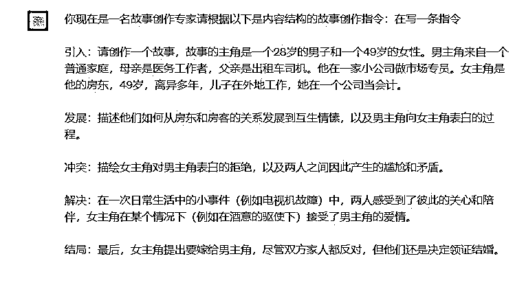

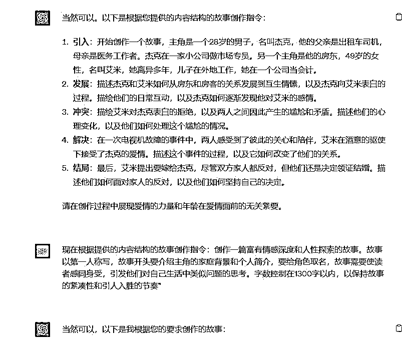

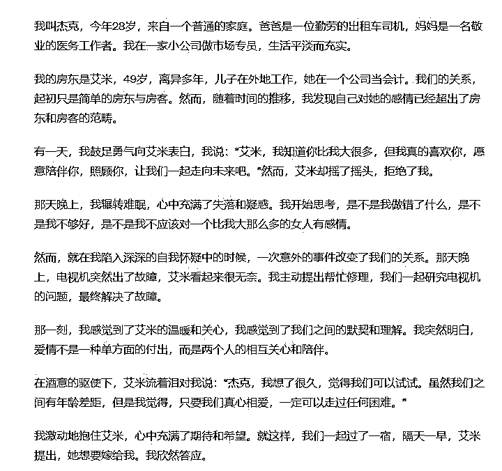

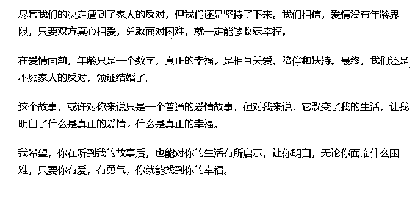

因为 GPT 字数限制，这里可能会没有完，可以让他继续写：

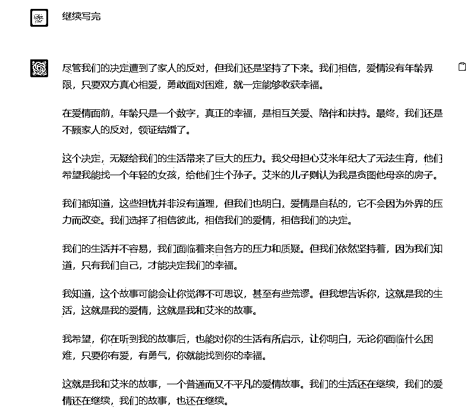

这之后我们可以检查一下全文，删除重复内容或不适合的内容。

#### 6.1.2.2 直接给出指令，让 ChatGPT 产出正文内容

第 2 种方法是自己优化指令，直接让 ChatGPT 写。比如你有自己构想好的剧情或剧本，但不想自己一点点写，就可以把想法喂给 ChatGPT，让他来产出正文内容。

给大家一个参考指令：

作为一个富有洞察力的作家，你现在的任务是以”xxxxx”为主题，创作一篇引人入胜的故事。

在开头，你应该详细地描述 xxxxx，为故事增添趣味性和复杂性。接下来，

你需要描绘 xxxxx，这会增加故事的

戏剧性。你可以详细地描绘 xxxx，并从中揭示 xxxx。在故事的中部，你需要深入挖掘 xxxx。你可以描绘 xxxx，揭示 xxxx，引起读者的共鸣。

在故事的高潮部分，你可以设计一个出人意料的转折，例如 xxxx，这会使读者产生“原来如此”的惊喜感。

在故事的结尾，你需要对主角的感情变化进行总结，让读者明白 xxxx。

这篇故事的总字数应在 1200 字以内，既保持故事的紧凑度，也充分展现故事的细腻情感和真实感。

以下是运用这个指令产出的文稿，大家可以看看：

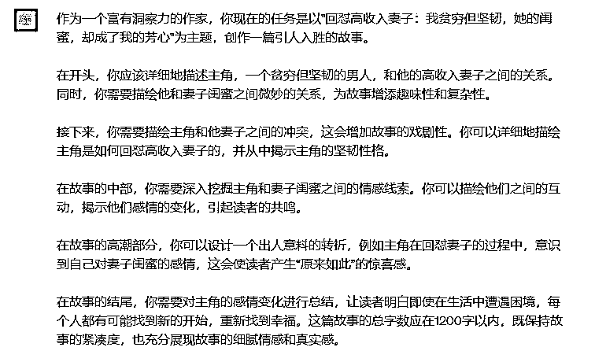

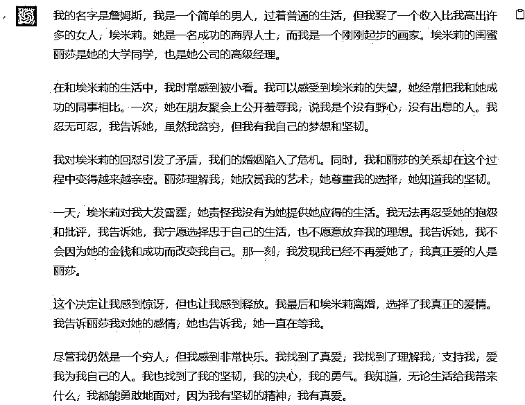

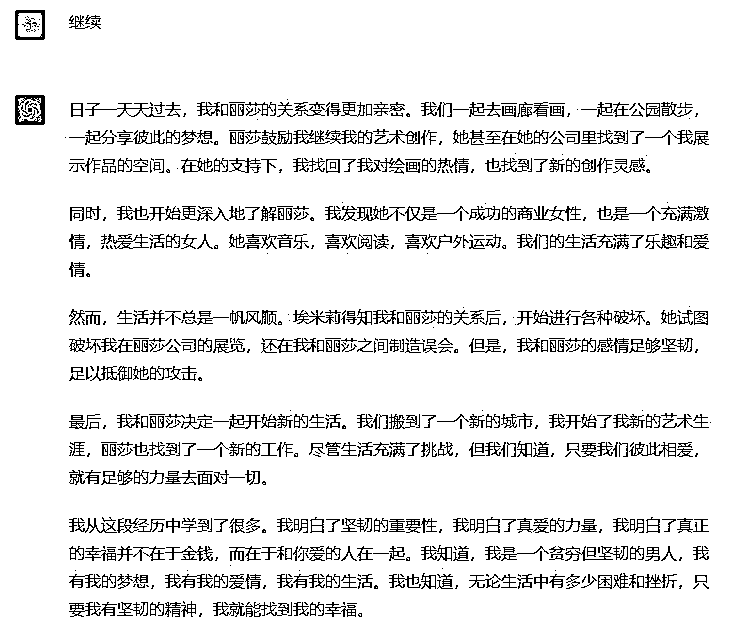

以上就是利用 ChatGPT 写出的一篇完整的文章内容。

#### 6.1.2.3 技巧：如何提升 ChatGPT 写作效率

我们可以如何通过 ChatGPT 提高效概率呢？

建议大家通过不同指令，建立多种模型，这样能够方便你想要创作某类文章时直接找到对应模型。

比如我的创作模型主要有以下这些：

最开始，大家可以使用不同的模型写，之后看哪个模型写的内容更好，大家就可以选择这个模型持续去创作。在创作中，大家还可以在指令模板的基础上，加入自己想要的剧情或内容。

比如指令一：

作为一位敏感且熟练的作家，你的新任务是"在根据提供的内容创作一篇富有情感深度和人性探索的故事。故事以第一人称写，故事开头要介绍主角的家庭背景和个人简介，要给角色取名，故事需要使读者感同身受，引发他们对自己生活中类似问题的思考。字数控制在 1300 字以内，以保持故事的紧凑

性和引人入胜的节奏"

引入：开始创作一个故事，主角是一个 28 岁的男子，名叫杰克，他的父亲是出租车司机，母亲是医务工作者。杰克在一家小公司做市场专员。另一个主角是他的房东，49 岁的女性，名叫艾米，她离异多年，儿子在外地工

作，她在一个公司当会计。

发展：描述杰克和艾米如何从房东和房客的关系发展到互生情愫，以及杰克向艾米表白的过程。描绘他们的日常互动，以及杰克如何逐渐发现他对艾米的感情。

冲突：描绘艾米对杰克表白的拒绝，以及两人之间因此产生的尴尬和矛盾。描述他们的心理变化，以及他们如何处理这个尴尬的情况。

解决：在一次电视机故障的事件中，两人感受到了彼此的关心和陪伴，艾米

在酒意的驱使下接受了杰克的爱情。描述这个事件的过程，以及它如何改变了他们的关系。

结局：最后，艾米提出要嫁给杰克，尽管双方家人都反对，但他们还是决定领证结婚。描述他们如何面对家人的反对，以及他们如何坚持自己的决定。

请在创作过程中展现爱情的力量和年龄在爱情面前的无关紧要。

再比如指令二：

作为一位才华横溢的作家，你的新创作任务是根据主题 "爱情迷阵：丈夫异

地工作，我却无法抵挡公司领导的温柔陷阱"，写出一篇充满情感纠葛、道德冲突的故事。

首先，你需要描绘出女主角的个人和职业背景，她与丈夫的关系，以及丈夫为何会被调到异地工作。此外，你也需要对她与公司领导之间的关系进行初

步的勾勒。

接下来，你应描述她在丈夫离开后的生活变化，特别是她与公司领导之间逐渐发展出的不正当关系。你需要准确地描绘出她心理的挣扎和困惑，同时展现她对于这种情况的内疚和恐惧。

然后，你需要设计一场危机，比如她的丈夫突然回家，或者公司的同事发现了她与领导的秘密。这个危机应该足以让她开始反思自己的行为，并寻找解决问题的方法。

最后，你应该创建一个反转，可能是她最终选择忏悔并坦白，也可能是她选择接受自己的行为并面对其后果。这个反转应该让读者对她的人性有深度的理解，并对她的未来充满期待。

总的来说，你的故事需要真实地描绘女主角的内心世界，展示她在爱情与道

德之间的挣扎，以及她如何面对自己的行为和决定。

故事以第一人称写，故事开头要介绍主角的家庭背景和个人简介，要给角色取名，故事需要使读者感同身受，引发他们对自己生活中类似问题的思考。字数控制在 1300 字以内，以保持故事的紧凑性和引人入胜的节奏"

### 6.1.3 方式三：利用 bing 精细化生产

#### 6.1.3.1 找到爆款素材

最开始，我是刷到了一篇 10w+爆文，然后发现这篇 10w+的爆文有出处：

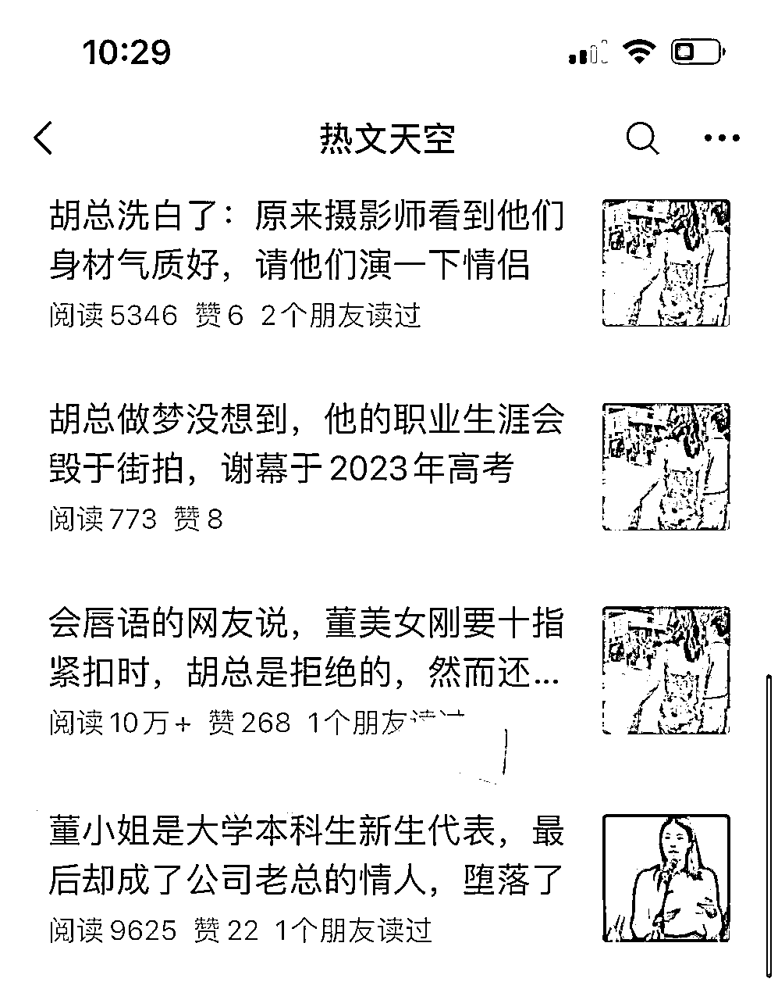

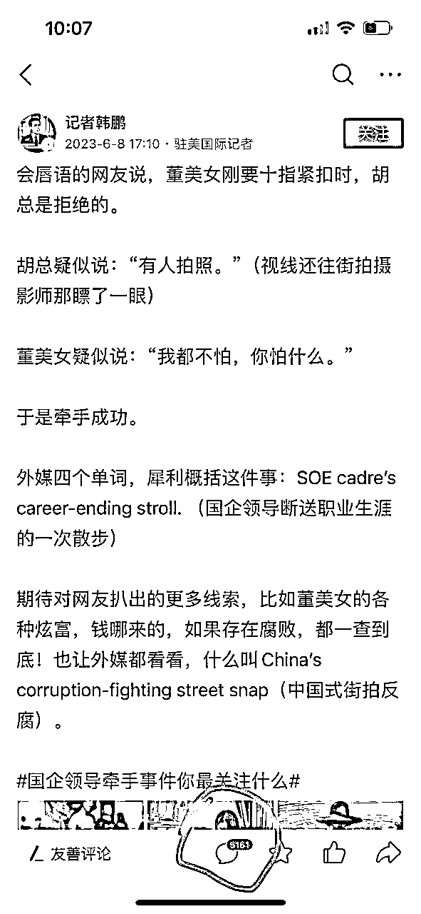

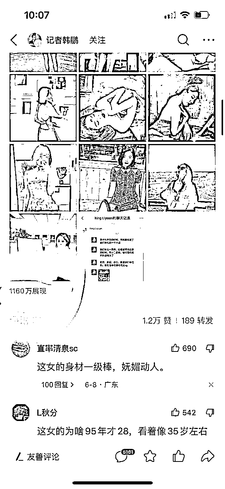

如上图所示，这篇公众号文章是 6 月 9 号发的，但是在 6 月 8 号的时候，头

条上已经出现以这个标题、这个角度的微头条。

这个发现帮助我引出一个写热点爆文的方法：平时多刷头条热点新闻。

具体来说，就是找曝光量大的、评论多的微头条，提取微头条内容。通常微头

条的开始部分可以作为我们爆文的标题，比如像上面那个例子：会唇语的网友说，董美女刚要十指紧扣，胡总是拒绝的

#### 6.1.3.2 结合热点事件和提取的文章内容写文章

找到热点事件和对应文章素材后，我们就可以用 bing 来写文章了，以下是操作步骤。

1）打开 bing 网站

官网地址：https://www.bing.com/ 需要魔法才能使用，进入后点击聊天

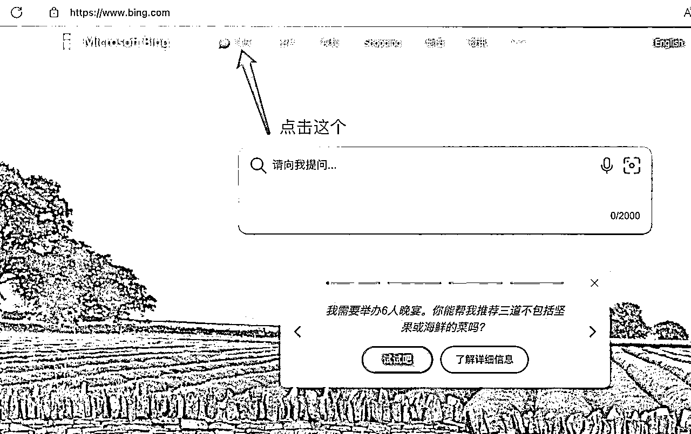

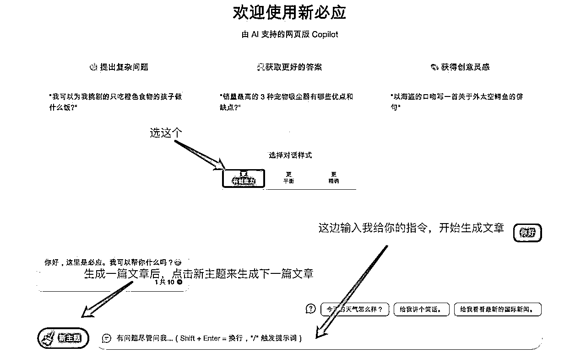

2） 指令生成文章

例如使用以下指令来生成文章，第一个 text 是热点事件、第二个 text 是微头

条上提取的内容。

text:"""

国企领导出差带“小三”逛街。

"""

请先了解以上新闻事件，并结合这个内容，

text"""

会唇语的网友说，董美女刚要十指紧扣时，胡总是拒绝的。

胡总疑似说：“有人拍照。”（视线还往街拍摄影师那瞟了一眼）

董美女疑似说：“我都不怕，你怕什么。”

于是牵手成功。

外媒四个单词，犀利概括这件事：SOE cadre’s career-ending stroll。 （国企领导断送职业生涯的一次散步）

期待对网友扒出的更多线索，比如董美女的各种炫富，钱哪来的，如果存在

腐败，都一查到底！也让外媒都看看，什么叫 China’s corruption-fighting street snap（中国式街拍反腐）。"""

从吃瓜群众的角度出发，以“会唇语的网友说，董美女刚要十指紧扣时，胡总是拒绝的”为题写一篇 1200 字的文章，要求：1、不要用排比句，尽量用大白话，口语化，让小孩子都看得懂，避免太过于文绉绉的表达。

1、不要用排比句，尽量用大白话，口语化，让小孩子都看得懂，避免太过于文绉绉的表达。

2、每个段落要简洁、口语化，必须在 50 字以内，让人能快速看完一段：每个段落只需要讲清楚一个事情：情节内容要环环相扣、紧密推进。

3、语言要口语化，模仿真人的语气写作，吸引人阅读，参考内容：{ 但到了之后余骏发现，流水线上的工作特别累，每天要不间断工作 12 小时，而且经常加班。并且拿到的工资也是远远低于市场平均水平的。}

{ 但到了之后余骏发现，流水线上的工作特别累，每天要不间断工作 12 小时，而且经常加班。并且拿到的工资也是远远低于市场平均水平的。}

4、开头根据故事场景，概括说明这一种社会现象，再引出故事，定要有噱头、有悬念，吸引读者看下去。

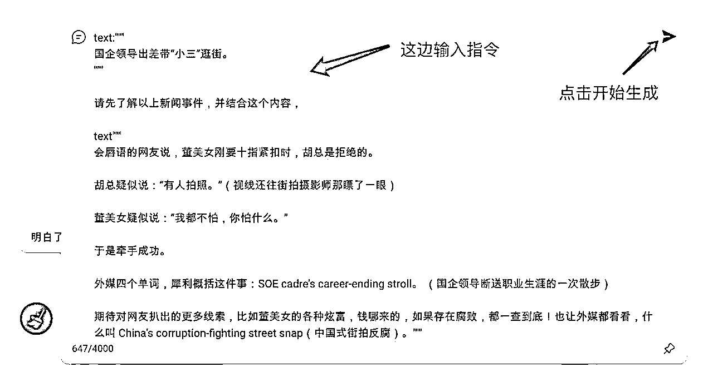

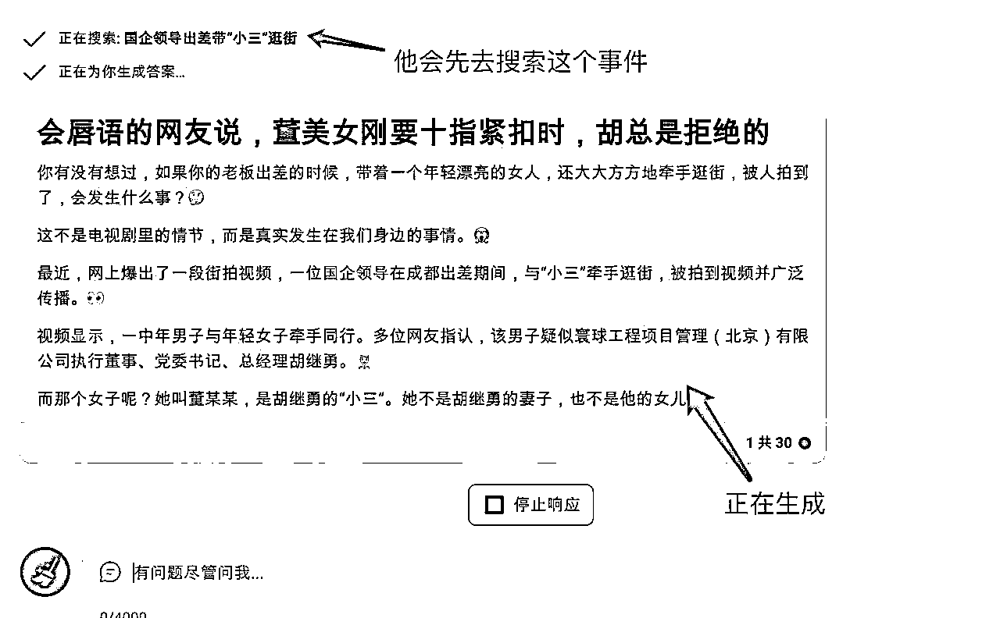

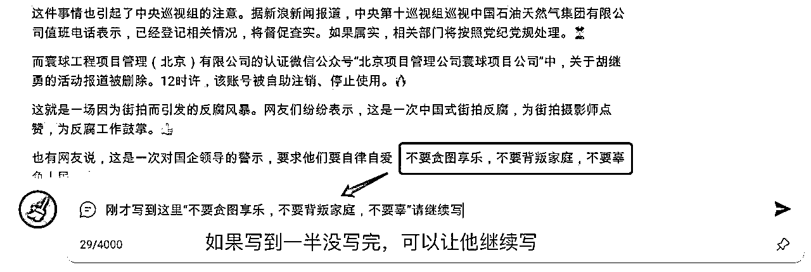

特别重要：

热点文有个注意点是要避免造谣。在使用 AI 生成文章的过程中，不可避免的一个问题是 AI 会虚构，我们自身必须对事件本身有详细的了解。捕风捉影的、未经证实的内容千万要避免。

特别要避开那种与警察、政府部门冲突的事件，如果你写的内容有损他们的形

象，又没有实际证据的情况下，很容易被叫去喝茶。

3）复制生成的文章

将鼠标移动到生成的文章的右上角，会出现几个按钮，点击第三个复制按钮就

可以把文章复制下来。

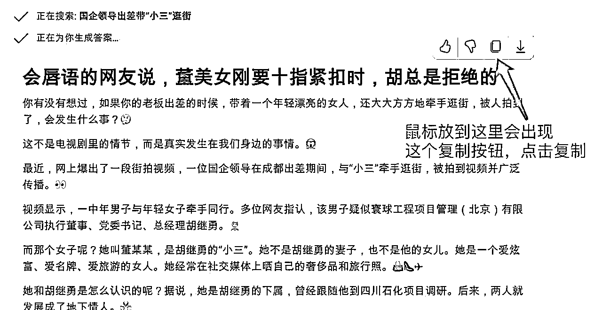

内容来源：

## 6.2 写标题

取标题需要人工操作，一个好的标题，直接决定了文章能否被打开。用 ChatGPT 生成的标题，目前无法直接使用，可以让 ChatGPT 起几个提供灵感。

ChatGPT 生成的标题，目前无法直接使用，可以让 ChatGPT 起几个提供灵感。

### 6.2.1 如何使用 ChatGPT 产出爆款标题

下面是一个让 ChatGPT 写标题的例子。先让 ChatGPT 学习几个爆文的标题，然后再为我们自己的文章生成一些标题。

prompt:

爆文标题 1

爆文标题 2

爆文标题 3

爆文标题 4

爆文标题 5

参考上面的 5 个标题，为我提供的内容生成 5 个吸引人的标题。text: """文章内容"""

如果觉得都不好，可以添加一些要求，让 ChatGPT 再给出一些。

prompt:

不够戏剧性，再给出 5 个更加吸引人的标题，可以标题党，更加狗血一些

不够吸引人，可以再优化一下吗？加入异常、反转、数字、冲突等元素

### 6.2.2 简易指令模板与使用方法

为方便大家更快完成「批量取标题」的动作，这里提供一个只需你给主题就可

以套用的标题写作指令：

作为一个有深度理解和探究社会生活微妙情况的作家，我们希望你能根据特定的主题创建一系列精彩的标题。你的创作需要在我们的公众号上引发广泛关注和深度讨论。

我们期待您在创作中考虑如下几点要素：

1、标题简洁、直接且引人入胜：我们需要的标题要能够直击要点，同时能引起读者的强烈兴趣。试着让标题留有悬念，以激发读者的好奇心，驱使他们点击查看更多内容。

2、使用具有强烈感性和视觉效果的词汇：诸如“崩溃”、“反击”和“震惊”等词汇能引发读者的情绪反应，从而吸引他们点击阅读。请尽可能在标题中使用这类词汇。

3、包含人物角色、情感冲突、生活挑战和设计悬念的元素：请设定具有特色的人物角色，并设定他们之间的情感冲突和生活挑战。同时，在标题中设计一些悬念，让读者想要了解更多。

我们期待你能利用这些指导，创作出精彩的标题，让我们的公众号读者为之

振奋。

第一种用法，直接给关键词，如工作、恋爱、婚姻、人际关系老板、男友、男同事、老公等角色的主题：

不满意的话可以让他继续写：

第二种用法，直接给他爆款标题让他写同类型的：

生成完后，我们可以从这类标题选一个自己比较满意的，稍作一些优化就可以直接用。

## 6.3 如何快速用 ChatGPT 出稿

如果对出稿速度有要求，或者对稿件数量需求大，可以参考 @妞妞💋 老师的

方法。

在有了选题「5.1.1.2 找选题」和大纲「5.1.1.3 写大纲」的情况下，结合我们平时积累的素材库「4.1 如何搭建素材库」，就可以将选题、大纲和自己的要求，直接甩给 ChatGPT 了。

prompt:

描写细节：

气氛：

叙事人称：

背景：

角色：

情节：

结局：

你是个讲故事的大师，请根据以上内容，写一篇 1200 字的故事。

ChatGPT 一次回答字数有限，如果没写完，可以请它续写。

prompt:

“前文结尾内容”

刚刚这里没写完，请继续。

这篇的标题，是在 ChatGPT 的基础上，结合前文说的「4.4 如何写好文章标题」，自己手工润色改写了一个：《56 岁大妈嫁 63 岁老头，儿子拒认继父，18 年后，儿子抱住继父哭喊爸爸》。

正文润色可以参照「4.5 爆文写作自检方向」，调整一下段落，修改不够口语的句子，几乎不需要有太大的改动，就可以发表了。

就这样，一个故事就完成了。最终成文，如下图所示：

一篇文章很快完成，前提是自己素材库要有情节大纲，一小时产出十几篇不是问题。

当然，可能每个人的情况会不一样，不能一概而论。因为大家调教它的时间各

不相同，对文章的要求也不同。

如果大家平时有时间，还是得多跟 ChatGPT 玩耍，调教它。

## 6.4 写作心得

心得一：一篇文章从构思到发布，耗时约 1～2 小时。主要是因为 GPT-4 速度太慢，所以最好不要晚上写，速度比白天慢很多，还经常出现网络问题。

心得二：按照这个方法调教好 ChatGPT，大约生成 5 篇文章之后，建议再重新调教一遍。

因为根据 GPT-4 API 的输入限制，猜测 GPT-4 的对话可以记住 25000 个 token 的上下文。每个 token 等于多少字没有明确的说法，通常认为 1000 个 token 约等于 750 个英文单词，或者 400～500 个汉字。5 篇文章，加上调教的内容，一般会在 10000 字左右。再继续写，可能 ChatGPT 就会忘记了最初调教的内容。

因此建议一定要用 GPT-4，GPT-3.5 可以记住的上下文是 4096 个 token，差不多写一篇文章就要调教一次。

心得三：用 GPT3.5 的话，一定要多调教，因为它不太能记住上下文，也没有

逻辑性，很容易出现上文不接下文，有时会胡说八道乱说一通。所以有条件的话，一定要用 GPT-4，相比 3.5，它能记住上下文，也更有逻辑性和人情味，相当于又帮我们多走了一步。

内容来源：《ChatGPT + 公众号爆文写作，从 0 开始，7 天达成阅读 10W+，方法全分享，毫无保留》

《ChatGPT + 公众号爆文写作，从 0 开始，7 天达成阅读 10W+，方法全分享，毫无保留》

《大杀器 ChatGPT 问世 135 天，一篇公众号爆文 10 分钟搞定，千元收益唾手可得！》

6 月 1 日《公众号 AI 写作分享》@小浩

# 七、如何用 ChatGPT 自动写文章@春柏

## 7.1 涉及到的技术和工具

使用 ChatGPT 自动写文章涉及到的技术和工具有：ChatGPT、影刀 RPA、Python

ChatGPT 的教程可以直接看手册第五章节

影刀 RPA 的教程可以关注影刀 B 站官方账号，视频讲解很详细：https://space.bilibili.com/393215006?spm_id_from=333.337.0.0

Python 教程，B 站上有很多视频，对编程感兴趣的圈友也可以学习一下，

可以让很多重复性劳动实现自动化。

以自动化生成一篇情感文为例。先人工调教好 ChatGPT，然后准备好故事大纲。

然后打开 RPA，设置流程：

1.

选择 ChatGPT 输入框，输入 prompt。

2.

点击“发送”按钮，发送 prompt 给 GPT。

3.

等待返回。

4.

获取返回的文字，存入文件。

循环以上流程直到文章写完。

prompt 示例

根据下面由“”“包含的故事大纲，使用“风格 A”，以第一人称写一篇故事。要求：

1.

故事必须分成 9 个段落；

2.

每个段落不少于 130 字。

先写出 1、2、3 段。

text: """

故事大纲...

"""

如果一次让 ChatGPT 输出太长的文字，ChatGPT 会出现幻觉，导致内容质

量下降。因此一篇 1200 左右的文章，我会分 3 次让 ChatGPT 来写，每次大约输出 400 字左右。ChatGPT 不擅长统计字数，所以我每次让他输出 3 段，这样对于字数的控制效果也会好一些。

写故事建议用 GPT-4，效果比 3.5 要好很多。

prompt 中的「风格 A」是事前调教好的 ChatGPT 写作风格，调教和写大纲的具体方法详见《ChatGPT + 公众号爆文写作，从 0 开始，7 天达成阅读 10W+》。

下图是用 RPA 控制 ChatGPT 自动写故事的过程。

## 7.2 自动发布文章到公众号

上一步用 ChatGPT 生成的文章会保存在文件中。再使用 RPA 操作公众号完成文章自动化发布，流程如下：

1.

登录公众号后台。使用 RPA 打开网址，通过账号密码实现自动登录。

2.

新建图文，粘贴文章内容。可以把文章放在指定的目录，通过 RPA 读取文章，然后自动粘贴到新建的图文消息中。

3.

设置格式。提前设置好一套固定的格式，比如字体大小 17px，行间距 1.75 等。因为按钮都是在固定的位置，所以用 RPA 很容易实现。

4.

扫码发布。最后一步需要用管理员手机扫码，所以只能人工操作。好像可以在公众号「安全中心」中关闭扫码，这样就可以实现全自动发布了。

图例（实际流程会根据大家的电脑设置产生变化，这里仅作为举例展示）：

这样只要把生成的文章放在指定的目录下，设置好固定的格式，就可以基本实现文章自动发布。

下图是 RPA 操作公众号自动发布的过程。

## 7.3 批量自动化操作

将上面两个步骤串联起来，就实现了自动写文章和自动发布到公众号的流程。其中人工仅需要操作最后的扫码发布。

### 7.3.1 批量操作的方法

使用 RPA 循环执行以上两个流程，先批量生成文章，再批量发布，这样就实

现了批量操作。

举个例子：

1.

把故事大纲分成 4 个部分，每个故事大纲单独保存在一个文件。

2.

再把这些文件统一放在一个目录下。

3.

在 RPA 中设置一个循环，读取文件中的大纲内容，交给 ChatGPT 来写故

事。

按照上面的步骤，就可以批量生成文章了。

生成的文章统一放在一个目录下，再用 RPA 循环读取文件，发布到公众号，就可以实现批量发布。

### 7.3.2 存在的问题

但是，这个批量操作的过程中存在 2 个重要的问题：

1.

故事大纲哪里来。假如操作 100 个公众号，每个号每天发一篇，就需要 100 个故事大纲，如果人工写大纲，1 个人几乎不太可能。

2.

文章质量差。ChatGPT 直接生成的文章质量还不太行，会有一些重复啰唆的内容，需要人工修改。

以上两个问题有没有解决办法？有。

## 7.4 批量生成故事大纲

故事大纲还是用 ChatGPT 来批量生成，但不是让 ChatGPT 自己写，因为这样写出来的质量不行。我的方法是让 ChatGPT 模仿已有的爆文写大纲。步骤如下：

1.

批量提取对标公众号的文章。

2.

把提取的公众号文章交给 ChatGPT，总结出故事大纲。

3.

参考总结后的故事大纲，生成类似的大纲。

### 7.4.1 批量提取公众号文章

我用 Python 实现了批量提取公众号文章。后来想了一下，使用 RPA 应该也可以实现，不过在提取文章内容时可能要麻烦一些。

要批量提取公众号文章，先要自己有一个公众号，具体流程如下：

1.

登录公众号后台，点击创建「图文消息」。

2.

点击最上面一排按钮中的「超链接」。

3.

在弹出页面中点击「选择其他公众号」。

4.

输入要提取文章的公众号名称。

5.

点击搜索，列出公众号下的所有文章。

6.

这样就可以获取到这个公众号下所有文章的链接，有了链接也就可以提取公众号的全部文章了。

以上提取公众号文章的流程用 Python Selenium 可以做到完全自动。

### 7.4.2 ChatGPT 批量提取文章大纲

从公众号提取文章后，保存到本地的一个文件夹。然后再使用 RPA + ChatGPT 总结出文章大纲。

总结大纲用 GPT-3.5 即可，虽然用 GPT-4 效果更好，但对于这个步骤提升没有那么大，并且 如果不用 GPT-4 的 API 还会有 3 小时 25 次的限制。用 3.5 就可以达到不错的效果，速度更快，还可以节省成本。

prompt 示例

故事大纲格式：

1.

引子：人物背景与人物关系；

2.

冲突：故事开端和冲突；

3.

转折：发生什么样的转折；

4.

解决：最后如何解决冲突。

根据下面"""内包含的内容写一个故事的大纲，要求：

5.

修改故事中的人物名称、年龄；

6.

适当修改故事情节，使故事更加吸引人。

7.

以第一人称书写。

8.

大纲文字简洁明了，不超过 200 字。

9.

按照上面故事大纲格式输出。

text: """

故事内容"""

"""

使用这个方法，就可以批量生成故事大纲了，而且质量还不错。还可以让 ChatGPT 根据已经生成的故事大纲进一步改写，生成更多大纲。这样故事大纲的问题就解决了。

内容来源：6 月 27 日《ChatGPT 自动化生产公众号文章》@春柏

# 八、公众号爆文的变现方式

💡

章节概要

公众号的收益按照阅读量计算，本质上是一门流量生意。并且公众号的流量长尾很长，哪怕很久以后，也能收获源源不断的流量。建议文章写到 1200 字以上，可以插入两条广告，增加收益。

值得注意的是，公众号不用自己提现，它每个月的收益会自动打到你

开通流量主时，所绑定的银行卡里，次月的 1 号和 15 号分别入账。就算收益只有一分钱，也会准时到账。

目前，公众号爆文主要有两种变现方式：广告变现，以及打赏变现。前者是主要变现方式，后者更多的是偶尔加鸡腿的效果。本章将会详

细阐述以上两种变现方式，供大家参考。

## 8.1 公众号的赚钱原理

公众号的收益是按阅读量来算的，也就是平时大家说的流量，流量越高，收入越高，而且公众号的流量长尾是很长的。

但是，流量的单价，是由很多因素决定的，比如：文中和文末的广告的展示

量，以及点击量，还有完读率，等因素。

需要注意的是文章最好写 1200 字以上，这样文中可以插入两条广告，有助于增加收益，因为 800 字左右，只能插入一条广告。

## 8.2 关于公众号的提现

公众号不用自己提现，它每个月的收益会自动打到你开通流量主时，所绑定的

银行卡里，每个月打两次，分别是 1 号和 15 号，这个月打上个月的。

就算收益只有一分钱，也会准时到账。每个月的 1 号和 15 号，可进手机银行查看，有时会有延迟，但不会不到账，到账的金额是税后金额，扣了 20%的个税。

## 8.3 变现方式

### 8.3.1 广告变现（主要）

广告变现，指的就是在文章中插入广告，例如小程序、游戏、电商等卡片，点击本身或者点击后产生消费，都会收到一笔收益，或者文章本身就是一篇广告文。

目前有四种方式。

1）方式一：自主接广告

要先关注公众号“新榜有赚“，里面有很多种赚钱方式，有分销，有文案类，比如《刘小念》号里每天发那种，按阅读计费，一个阅读 4 毛钱左右，时间要求不同，有的 24 小时可以删除，有的可以放长期，新榜里面有教程，大家可以自己去研究一下。

按系统的步骤，如上面一系列的图所示，一步步的来就行，抢到单之后，在商家限定的时间内将广告的文案，发到自己公众号里，就可以坐等收益了。

收益到账后，可以马上提现到微信，到账很快，可以说是秒到。

我只发过两篇，都是 24 小时可删的那种，每篇收入 800 多块，后面我看有点伤粉，就没发了，等以后粉丝再多点后，再发试试。

“新榜有赚“里面有很多种赚钱方式，大家有时间可以好好研究一下，我试过

的，就这种发文案按阅读赚收益的，其它的，我没试过，有待大家自己去研究哈。

2）方式二：商家找我们发广告

商家会在后台留言“商务合作”，然后加微信谈价钱，一般要我们自己出价，对方出文案，我们复制粘贴就行，费用分头条，二条，和三条，头条价格最高，一般 2000 以上一篇。

这种广告要慎接，要看他们提供的文案，是有关哪方面内容，如果涉黄、涉赌、封建迷信类的，不要接，有可能会造成封号。

价格一般如下表：

具体要求，实际价格之类的，以自己跟商家谈的为准。

3）方式三：自己在文章中带货 @徐胖子

公众号带货在十年前是非常火爆的项目，但是这几年视频带货的兴起，导致文字带货的效率越来愈低，同时我们也要看到，公众号带货依旧还有前景。

为什么说公众号带货仍然可以做呢？主要有以下四点优势。

第一，公众号流量大。圈友@渭水徐公 的公众号训练营开到第七期，十万加以上爆款累计 1000 篇以上，更不用说阅读量过万的小爆款有多少了。一个账

号每天发布 8 篇文章。每篇文章最多可以植入 10 款产品，8 篇文章的话，就可以植入 80 款产品。只要你的推文中有一款产品爆，你的收益都会很可观。

第二，公众号创作灵活，图文和货物相关性要求低。比如你是写情感领域，学习类、励志类、文学类、情感类书籍都可以带。而且像吃的用的，都可以通过

公众号来带货。

第三，公众号佣金高。我们带的商品都可以自己找商家，谈佣金。书籍佣金可以高达 50%，水果和蜂蜜佣金也不低于 20%。

第四，结算安全。官方结算链路，流量主收入有保障，佣金结算效率高，这个可以完全不用担心。用户下单，用户确认收货，结算带货佣金，创作者后台查看佣金，官方打款，这些我们都可以在后台看的到。

具体操作流程如下：

先申请公众号，进驻平台。接下来满足粉丝数 500 以上，确认财务结算资料，申请开通流量主。申请流量主开通审核时间为 3-5 个工作日内完成，正常提交资料后当天都会通过。

开通流量主后，接下来就是开通返佣商品广告，进入推广商品，在文章内植入返佣商品广告发布文章，分享文章赚取收益。

公众号带货功能和头条带货一样，文章有商品的关键词，就在文章里插入相关的商品就行。

单篇推文可支持最多插入 10 款商品，用户在阅读推文时点击商品卡片直达小程序一键下单购买，带来实际成交后，流量主可获得因商品成交带来的销售分成。

此外，我们不管什么时候带货，不管是带书，还是带日用品，带水果，都可以用到以下这个模板：

第一部分用故事切入，第二部分故事到话题转换，第三部分就是商品内容的介

绍，第四部分就是引导下单。具体带货文案如何写作，可以查看这篇高手分享 3 月 6 日《如何在公众号带货》@徐胖子。

4）方式四：文末贴片广告带货

识别这个二维码，注册成为有赞的分销商，然后选择自己想要卖的产品，做成超链接，再把超链接贴在文末即可。

不会做超链接的，可以找客服帮你做，但需要你告诉他，你有赞账户的密码。我是让客服做的超链接。

客服微信：可扫码添加

注意：

公众号账号没起来前，发表文章时，要尽可能地简约点，别弄得太花俏。账号起来后，粉丝多了，再看粉丝的年龄段，如果年龄偏小的，可以装修得炫

一点，年龄大的，保持简约就好。也就是文章头部一张图，甚至不用图，文中加点分隔符就好。

文中的分隔符，不要放得太多，大约 200 到 300 字放一个就好，不要少于 200 字，也不要多于 300 字。

### 8.3.2 打赏变现（次要）

开了流量主之后，记得先挂着原创群发三篇文章，之后就可以获得打赏权限。账号名字头像和打赏的名字头像，要尽量让它一致，这样看起来人设更真实。

打赏变现往往集中在一些 IP 属性比较强，人设非常过硬的账号里会，这种文章下面可能出现高额打赏，所以对于我们来说，只是一个变现渠道，并不是主流变现方式，不过开通后，偶尔也是可以加个鸡腿的。

# 九、如何快速进入池

💡

首先，进入流量池的时间并不是确认的。有的账号一天就能够进入流

量池，有的账号半年都进入不了。

所以这也是公众号的玄学所在。

但是大部分情况下，7 到 21 天，坚持书写，基本上也都能够进入流量

池。

换句话来说，只要你坚持更新，标题戏精，内容垂直，其实都能够进入流量池的，只不过时间早晚的问题。

如果你的账号是一个老号，注册时间在一年以上，那么这种账号相对而言有一定的权重，进入流量池的时间会更快一些，我们也做过了很多的测试，老号的确有一定的优势。

所以如果自己没有老号，可以发条朋友圈，问问身边的人有没有这样

注册比较久的公众号，拿过来实操，能够更快一些。

如果是一个新账号，才注册没多久，那么，首先选择一个领域，确定好了以后，找到对标账号，根据对标账号的爆款选题和内容，进行二次创作，每天更新 2 至 3 篇，不断更，也是能够很快进入流量池。

只要进入了流量池，也就意味着赚钱的开始。

如果自己的账号一直没有进入流量池，那么就要思考一下，自己在这件事情上到底花了多少时间，投入了多少精力，有没有做一些标题方

面的研究。

一般来说，付出和回报都是对等的。一天只写一篇和一天更新两篇的，只做一个账号和做两个账号的，测试的效果自然也是不一样的。

## 9.1 如何判断自己的账号进入到流量池@一来

微信公众号也是在变化的，之前只要是单篇文章进入了流量池，比如说阅读从个位数变成了三位数，四位数，有了看一看的流量，那么基本上意味着账号也就进入了流量池，第二天再发的时候，文章往往阅读量就上来了。

但是这一段时间，似乎做了相应的调整。比如说单篇文章进入了看一看流量池，但是第二天再发的时候，流量依然很少，甚至有些文章只有个位数阅读，那么就继续更新，直到账号进入流量池。

进入流量池，一个最直接的变化，就是文章的阅读量突破了 1000 甚至上万。

但是如果文章的阅读量从个位数变成两位数，或者是三位数，那么是不一定的，因为有些流量来源可能是搜一搜。

所以，观察和持续更新是非常重要的。

内容来源：6 月 8 日《公众号流量主的经验分享》@一来

## 9.2 用文章内容提炼视频文案@亦小亮

选完题，文章内容也写好了，也在公众号发出去了，这样就能拿到结果吗？当然不是啦！

接下来的操作，大家一定要去试试，看看如何快速让你的文章达到 1 万阅读量。

我们要用写好的文章内容延伸出两到 3 篇视频文案，甚至 5 篇。

对了，就是视频号文案。至于视频号文案，可以从文章的开头截取一部分作为视频文案，也可以用文章的小标题累积出来。可以用倒叙的方式来做文章内容，就是先写视频文案，或者大纲，最后补充具体内容，这样操作就比较丝滑。

视频的展示形式可以以图片为主、图片视频结合、纯视频为主。

如果剪辑基础薄弱或者小白直接上手纯图片或者纯视频，不用混搭，节约时间，当然过原创后的推荐肯定没有混搭效果好，不过可以慢慢来。

用纯图片多用渲染和展示效果，娱乐领域的话，就是明星的图片，做出来一个视频，用剪映的图文成片功能，就能搞定。

纯视频素材可以用一些治愈系视频或者解压类视频作为视频素材，比如下面这

段洗车解压视频，就可以配一些生活情感类的文案。

c136b7f2b804ed57fd8ed7ca6967958d.mp4【在线播放】

注意：发表后 7 天里满 10000 阅读的公众号文章，才能被放链接。

我粗略算过，每阅读视频 1000 次，点击文章打开率在 10%以上，而且具备长尾效应。比如我上次写了王宝强的八角笼中，目前一天也会有几百的阅读量。

当然，你会说热点结束了，也就没有流量了别急，下面重点就来了。

最近微信上线了问一问，大家可以用视频回答问题，如果没有你想要的问题，可以一个号提问，一个号回答。

当然有一点必须知道，回答问题只能以视频号的身份回答，所以，你可以把视频号的名字改成公众号的名字，这样完全可以说是一鱼三吃。

这样就回归到选题了，因为选题选得好，公众号、视频号、问一问，可以把这

三个穿起来，相互倒流，使三者都可以变现，不仅仅停留在流量主收益上。

比如还是说到副业这个领域，可以说是完美结合，当然旅游领域也是相得益彰。

做创业和副业类方向，都吃到了「微信问一问」的红利，这还只是刚开始，「微信问一问」还有很多领域都是空白，大家都可以深耕起来。

内容来源：7 月 4 日《如何迅速把一篇文章的阅读量提高到 1 万+》@亦小亮

## 9.3 利用已经入池的公众号，给未入池的公众号引流@妞妞💋

① 在已经入池公众号文章头部或文末插入未入池的公众号名片，如图：

② 在已经入池公众号文章头部或文末，插入未入池的公众号的文章超链接，如图：

上面 ① 和 ② 可任选一种，也可以两种一起来，如图：

这两种方法都在公众号后台编辑文章的时候操作。

（2）插入文章超链接的方法步骤

再加一个引导语就 OK 了：

就是这么简单。

可能有同学会问，我没有已经入池的号怎么办？可以找朋友或同学合作，合作方式自己商洽。

比如你让朋友帮你放文章链接，可以把这篇文章的收益分给朋友，诸如此类的，怎么适合怎么来，互助互利、大家开心就好。

内容来源：7 月 13 日《用 GPT 写热点文&公众号快速入池的方法》@妞妞💋

💋

### 9.3.1 找朋友关注 1、找 5-10 个不同地区的朋友，在微信搜索关注你的公众号。

1、找 5-10 个不同地区的朋友，在微信搜索关注你的公众号。

2、让这 5-10 个朋友就在订阅号的推送内看你的文章（自己别分享给你的朋友），看文章的时候按照正常阅读节奏来，别快速滑动。可以的话，点个在看或者赞。如果当天朋友没有刷到订阅号的推送就不用刻意找，等推送了再看就

行。

下面是我自己后台的数据，我大概是每天找 10 多个朋友进行阅读，大概进行了一周，我就发现账号入池了。

这是第一篇入池的数据，其实文章有没有入池还是挺明显的，阅读量基本会有几十倍的增加。

### 9.3.2 自我阅读+内容对标

初期没有入池的账号，我会点进去我的文章，先自己阅读一遍，记录我自己的

阅读体验，比如排版不舒服，字体有点小，前面介绍太罗嗦，后期情节没什么意思。

把我自己阅读后发现的问题记录下来，接着我会把我的文章分为 3 段去和 10 万＋的爆文作比较，进行 1 比 1 分析。

1 比 1 分析哪几个方面：

什么时候主人公介绍

什么时候第一个挫折

什么时候第二个挫折

标题上的悬念在第几段揭秘

……

我会 1 比 1 地摘抄核对，找出自己欠缺的部分，优化内容。

举例：

首先这篇 10 万＋的文章，开头有悬念，逻辑清晰，转折并不生硬，很自然的

让你带入去猜测老婆怎么拆散的？八卦的心顿时燃起来了

再看我写的文章，红色线转折很生硬，逻辑混乱，并且一下子能猜测出“老婆拆散了我和初恋”，后期完全没有阅读下去的欲望！

所以接下来我的优化方向，故事要流畅，逻辑清晰，开头 5 句话交代清楚人物，职业，关系，和引出悬念，紧接着讲述故事细节。

如果用 gpt 去优化故事，我的指令如下：

“需要扩写的内容”请扩充这部分内容，要有故事发生的具体细节，有对话，

有动作和神态描写，有情绪，写一下（你的具体需求可以给它）

### 9.3.3 提升“数量”如何取胜？

经常看到有小伙伴问，为什么账号更新了 1 个月还没入池？更新了 2 个月还

没入池？

结论：我认为最好的办法就是多个账号，多发高质量文章，我认为矩阵就是对抗不确定性的最好办法。

为什么需要多个账号？

账号具有随机性：

举个例子家里三个孩子，同父同母同吃同住，为什么只有一个小孩经常生病？很多人会想这个孩子可能是体质不太好，身为父母能够决定孩子的先天体质

吗？其实不太可能。

账号也一样，同样的作者，同样的写作手法，有的账号 2 天入池，有的账号 15 天入池，有的账号一直不入池，所以我认为能够对抗这个问题，就是多个账号。

2 个账号起步，如果你有 3 个账号都不入池，那就是文章质量问题了，再回归到质量上做提升就可以了！

为什么多发文章？

这里的多是多练习，熟能生巧，写得越多提升越快，可以快速熟悉了解一个领域，就是多写多看，多踩坑成长快！

内容来源：5 月 30 日《情感类公号如何从 0-1 起号，拿到第一个 100 元》@Adrian、6 月 29 日《公众号文章如何快速入池》@Beverly、6 月 8 日《公众号流量主的经验分享》@一来

@Adrian、6 月 29 日《公众号文章如何快速入池》@Beverly、6 月 8 日《公众号流量主的经验分享》@一来

# 十、写作避坑指南 @半塘梦呓

以下内容摘自微头条的老师，@半塘梦呓。

虽然内容是针对今日头条的，但是逻辑上都属于内容平台创作需要避免的坑。

这里摘录一些常见的踩坑点，更多内容，大家可以去原贴查看：《微头条踩坑经验》

## 10.1 措辞踩坑

很多小伙伴在创作的时候，发布前就已经养成查违禁词的习惯，已经查过没有违禁词了，但是还是有一些地方需要注意的。

### 10.1.1 改违禁词导致行文质量低

前面讲过，很多违禁词是我们始料未及的，查出来之后，你心里会感觉莫名其妙哦：这也是违禁词！?

但是没有办法，平台有平台的规则，大平台为了保证安全，限制是非常严格的。有的同学为了规避违禁词，用空格把违禁词隔开，或者用拼音/错别字代

替，少量使用是没有问题的，但是建议这种做法不要在开头使用，而且全文不要使用很多次。

### 10.1.2 带竞品平台的关键字

不要带竞品平台的关键字。

小伙伴在写作的时候，不自觉的写，还花呗，看微博等等，如果措辞一不小心很营销，也会被限流。

### 10.1.3 带企业名称

大家可能一不注意就在故事中写了去中国移动上班，去电信营业厅办事，去中石化加油，这些企业都不要带，如果一定要带，请用某通讯公司，某银行等隐去企业名称。

引用名言的时候也不要说某企业的 CEO 说。

还有编主角名字的时候要注意，有一个同学死活找不到限流原因，我一看，他的主角名字叫大华，不好意思，大华也是知名企业，而且上了美国的制裁名

单。

当然你的主角名字也不要叫小米啥的，都很危险。

甚至不要写门铃叮咚一声响了，因为，叮咚买菜～

### 10.1.4 主人公的名字不要瞎起

上面说到主人公的名字跟企业名字冲突，那我注意一下不就行喽～找一个像人名的不就好了～

那就叫 王强 吧，总像个人名了吧～不好意思，王强在句易网里面算是敏感词，这种很大众很普遍的名字，一不留神就踩中了国家官员或者是穷凶极恶的罪犯。

所以大家在起名字的时候，不要这么指名道姓，可以叫小王，小强，阿强，强强都行，太指名道姓也容易踩雷。

但是主角叫小王就安全了吗？来看，小王刚刚吃好饭。有没有问题？不好意思，王刚也是敏感词。小李刚刚洗好澡。李刚也是敏感词。

所以，这方面大家一定要多多注意，发文前过句易网一定要根植于心啊～

### 10.1.5 标点符号的运用

标点符号的运用，全部都是逗号，一逗到底，也不要全篇动不动就用感叹号！这样会被认定是马景涛体！文章会看起来很低质！读者不喜欢！审核也不喜欢！（感受到了吗）

### 10.1.6 专业领域词汇

不要用专业领域的词，比如如果你没有医学资质认证，你的文中，描写主人公急的乳腺增生，不好意思，增生，结节这类词属于医学用语，没有医生资质你写这些词可能会被认定误导读者。

### 10.1.7 其他查不出的词汇

其他可能句易网查不出来的违禁词。

一些暴力血腥的词汇，比如割腕，脑浆

一些有封建特色的词汇，比如占卜，卜卦，风水，当铺

一些带有性暗示的词汇，比如，小姨子（句易网中姐夫是敏感词）黑丝（蕾丝是敏感词）情趣，袭胸这些词汇，在句易网中都是查不出来的，所以要自己平时积累踩坑。

建议收藏的一些句易网查不出的隐形雷区：1、 渣男，渣女，高富帅，白富美，富二代，官二代，男神，情侣套房，打情骂俏，试管婴儿，代孕

1、 渣男，渣女，高富帅，白富美，富二代，官二代，男神，情侣套房，打情骂俏，试管婴儿，代孕

2、首付，房住不炒，宣扬房价上涨的都会被打压

3、支付宝、信用卡、保险、银行卡

4、投资，炒房，炒股，赌博，5、人格侮辱，干了见不得人的事，好吃懒做，三观不合

5、人格侮辱，干了见不得人的事，好吃懒做，三观不合

6、辞职 离职 资料 空降 投资

7、奥运，抗洪，三胎的话题都受限

8、热点别瞎蹭，很多可能是坑。无论写得多正能量，舆论不可测，就会被限。所以咱们没有金 v 护身，就写些稳妥的，这样才能长久。

9、叮咚买菜，是品牌名，“叮咚”最好不要用了。

10、只要是涉及其他软件的，商品品牌名称的，基本都不要提最保险。

这个没什么规律，就靠大家的敏感度和日常积累了。

## 10.2 图片踩坑

查违禁词大家可能已经很 6 了，但是一些限流的原因往往是我们容易忽略的

图片问题，我们来说一下图片的问题，在微头条配图方面，我们也要相对谨慎一些，常犯的几个错误如下：

### 10.2.1 图片暴露个人信息

如果是生活场景中的图片，尽量不要有人露脸，如果露脸了要打上马赛克，尤其是小孩。

手机号车牌号等一些信息也需要打码。

明星图慎用，尤其是有负面新闻的明星。

### 10.2.2 图片上有营销信息

可能大家在选图的时候，稍微一不注意，就出现了一个品牌 logo，或者公司

名字，这方面都比较敏感，大家要注意。

还有有品牌名称和标识，大家容易忽略的是品牌标识和品牌文化，如苹果电脑标识，美团外卖虽然把袋鼠马赛克，但是黄色头盔和工作服，一看就知道是哪家的。

比如，育儿领域无意中拍到了奶粉罐，但是奶粉罐上的 logo 就会出问题

图片中的支付宝微信的二维码也要打码。

### 10.2.3 图片比较负面或敏感的

比如，抽烟酗酒娱乐场所的配图属于比较负面的；

还有大面积裸露肉体属于比较敏感的，比如光膀子袒胸露乳的大爷，给宝宝洗

澡的图，小孩子裸露大面积肉体，都属于敏感类型的。

### 10.2.4 图片会引起他人不适的

比如一些恐怖的图片，车祸现场，某人被打的鼻青脸肿之类的。

甚至之前一位学员写了一篇关于蛇的文章，放上蛇的真实图片都不行，最后换成了卡通的蛇的图片。

这几条规则也是我们接下来找图的时候要注意的地方。

### 10.2.5 图片与内容不符的

文中说的是中国人，配图外国人

文中说的是婆婆，配图婆婆去超市和做饭，却是两个人

文中说的是车头相撞，配图车尾被撞的照片

文中说的是别人的事，用明星的照片（除非写某个电视剧、某个电影，可以剧

照；或是追娱乐热点，用明星照片）

## 10.3 运营踩坑 @Nicole·纯

### 10.3.1 排版不要花里胡哨

发表一般都是用秀米，很简单的排版，因为我写的情感文，受众主要是中老年人，所以排版不要花里胡哨的，越简单越好。内容才是主要的。

### 10.3.2 尽量不要重复发表

这里要提醒一下大家，尽量不要重复发表，重复发表只能发表一两个月以前的文章，并且不能经常用。

目前出现过三种情况：

1、有人因为经常发以前的文章被限流，比刚开始做的还惨，每天收入个位数。

2、有人因为发了以前文章被摘掉原创 1-3 天。

3、也有人每天都能发旧文。具体情况为，一天发了七八篇，有一篇是前期的，总数上来说没什么问题。

每个账号情况都不一样，上面的案例仅供参考。

### 10.3.3 记得开原创，转载一定不要开

文章原创一定要开，不然会影响单价和推荐。开通赞赏需要发表 3 篇原创文

章。快捷转载切记不能开，开了别人就可以随便转载你的文章，流量就被分走了。

所以发表之前检查以上的部分，再看看有没有显示广告的插入，如果出现下面

的字样就没问题了。

文章发表之后可以用自己微信看一遍，检查下有没有错别字，（公众号文章修改只能修改 20 个字符，且只能修改一次，标题不能修改。）可以给自己点赞

和在看。但是不要点广告，更不要转发朋友圈和群，也别让别人给自己点广告。如果一直都是相同的用户给你点赞、点广告，那账号很容易死的，就是根本进不了流量池。

内容来源：3 月 13 日《避开这些坑，你也能写出爆款文章》@Nicole·纯

