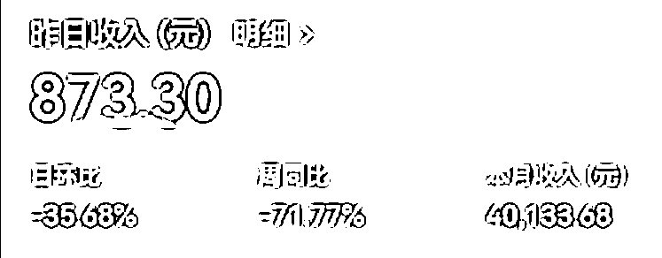
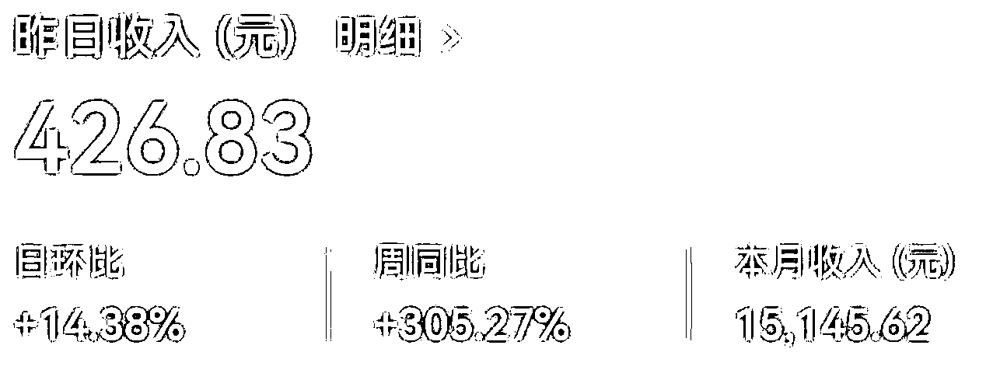
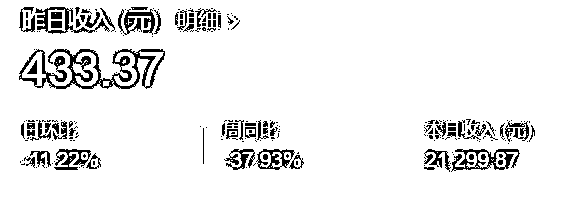
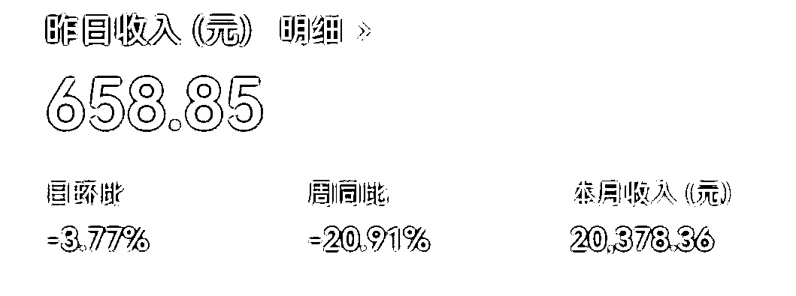
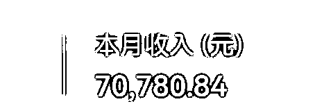
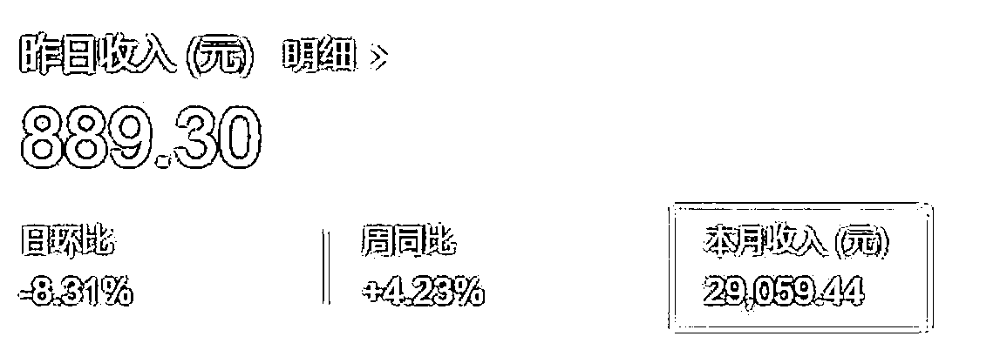
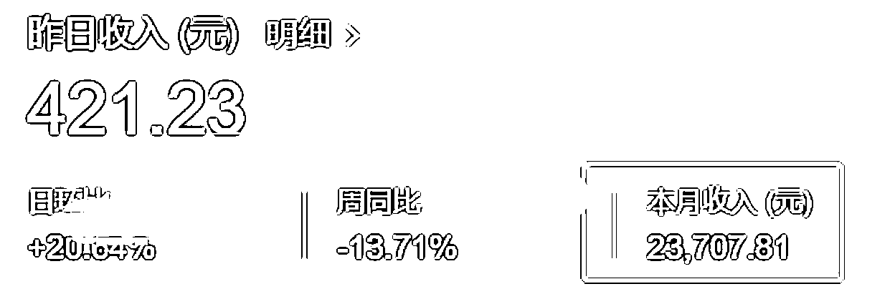

# 一、公众号爆文写作的前景

圈友 @渭水徐工 认为 2023 年微信公众号还有前途，就像它 2016 年和 2013 年一样有前途。

以下是他的观点：

回顾我们之前的成绩，单篇最高收入 7 万多，月入过万的 120 位同学，200 多位同学收益在 3000 以上，300 多位同学收益在 500 以上。
很多学员都是小白第一次写，从零开始到有收益，特别快，第一期有同学 3 天就开始有收益，而且是 300 多块。从结果上来说，我们的成绩是不错的。
大家都知道在最近头条，百家等平台，流量收益跌了很多，有些同学单价跌了快十几倍。
但是公众号就不一样，它花费的时间短，一般公众号一篇文章 1500 字左右，用嘴炮大法也就半个小时，打字也就一个小时。
从字数上来说，字数少，流量单价特别高，长尾流量特别长。
所以不管是从收益来讲，写作难度上来讲，还写作时间上来讲，公众号写作是近段时间自媒体最容易上手和赚钱的。

这里附上一些变现截图，供大家参考。

注：以上均为坚持日更的作者收益

目前，公众号变现方式主要有两种，广告变现和打赏变现。其中广告变现为主要方式，分别为自主接广告、商家找我们接广告、文内带货、文末贴片广告。而打赏变现，通常出现在 IP 属性较强的公众号里。具体方式详见「六、公众号爆文的变现方式」。

