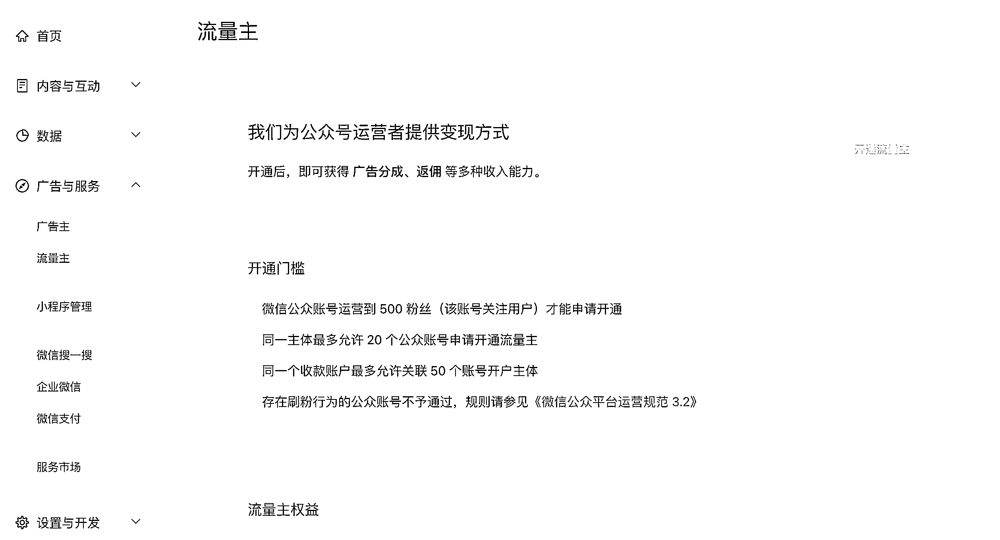

# 3.2 开通流量主

注册完了公众号之后，需要 500 粉丝开流量主，买粉直接开的效率是最高的，且不会耽误后期的流量。买粉的渠道，某宝上一抓一大把，此处不再赘述。

开了流量主之后，记得先挂着原创群发三篇文章，之后就可以获得打赏权限。账号名字头像和打赏的名字头像，要尽量让它一致，这样看起来人设更真实。

然后简单装修一下账号，给账号贴个头像，起个名字，随便写写简介。前期的准备基本就完成了。这些地方完全无需纠结，把内容做好才是重中之重，此外全都是细枝末节，大家千万不要舍本逐末。

