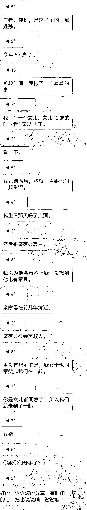

# 4.1.1 情感类：素材来源

素材来源有很多途径：比如生活中自己身边发生的：亲朋好友、邻居身上发生的，还有网络上的：知乎、抖音、百度、头条等平台。

当你在生活中遇到或听到一些，能触动自己的事情或话语；

在网上到处浪时，看到一些有意思的事情，把它随手记下来。

到累积了一定的读者后，可设置自动留言，留下微信号，让读者来倾诉，从读者身上获取素材。

还有平日看书读报时，遇到的好词好句，新奇的故事，以及影视剧、小说里的情节等。总之，哪里都有宝藏，难的是怎么发现。

