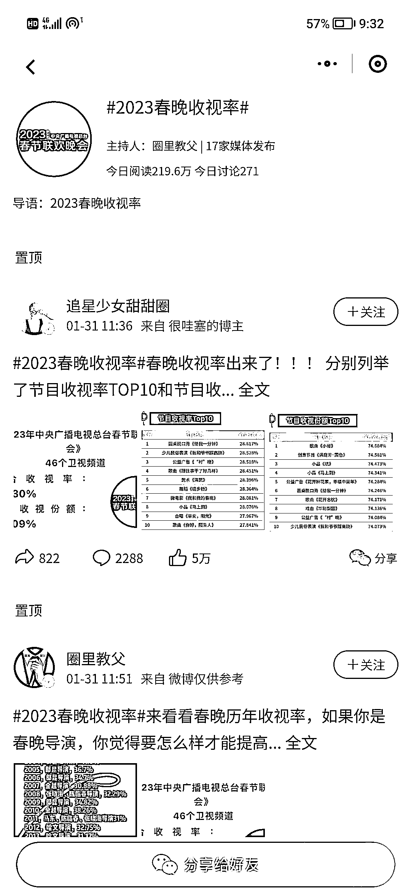
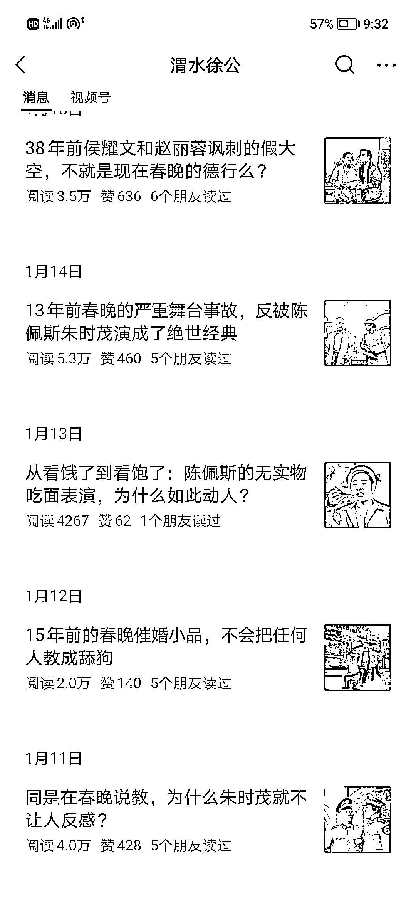

# 4.1.2 热点类：素材来源

热点类的素材无外乎就来源于那几个热榜，什么微博热榜，今日头条热榜，知乎热榜等等。这些地方，往往有很多可供选择的热点选题。

但是另一方面，这些地方的热榜往往是经过粉饰的，所以我们也要留一个心眼，好好考虑一下大众到底关心什么。有很多知乎的爆款的回答，明明它有流量，但却和热榜没什么缘分。这些内容，往往比热榜上的内容更值得关注，写出来也更容易爆。

因为这些内容，都是大伙一个赞一个赞票选出来的。就算是没被热榜加持，都有这么多人关注，证明那就是大家想看到的内容。我们要的素材，要选的就是这样刀刀见血的好内容。

