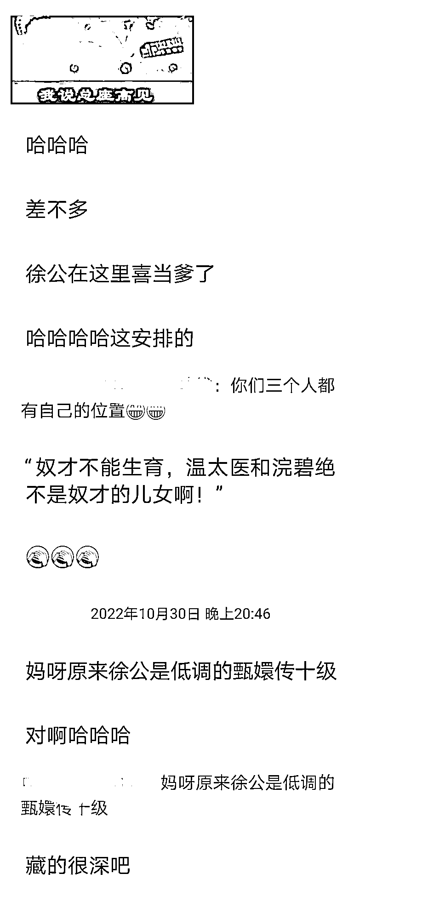

# 4.1.3 剧评类：素材来源

剧评的优点在于，完全不用担心素材的来源！你只需要做三个准备就可以：

1）看剧时，把感兴趣的地方或者是打动你的话语在手机截图，添加到素材库！

2）分析电视剧的高光时刻。

3）将电视剧与原著进行对比，很多时候电视剧与原著不同，将两者之间的差距，以及狗血的地方写出来。

我们就用《知否》或《甄嬛传》来做例子。

这两部剧都是口碑以及热度不错的剧，无论是盛祖母对明兰的敦敦教导还是明兰对生活的有感而发，都可以给我们带来很多的写点。

就拿《知否》中淑兰和离的高光时刻，可以写的文章就能达到三篇以及三篇以上！

我先给没看过剧的朋友们介绍一下背景：淑兰是出生于经商的盛家大房，带着丰厚的嫁妆嫁给了穷秀才孙志高，婚后婆婆一家花着她的嫁妆，还各种磋磨她，最终在孙秀才要带风尘女子回家做妾时，盛家大房大怒，这才有了和离的一幕！

那么，这三个方向能从哪里展开呢？各位请继续往下看：

①淑兰能顺利和离的真相----毕竟在古代男权社会，孙秀才没有什么太过的行为，淑兰和离完全不占优势，我们可以身边深挖一下淑兰和离的关键。

可以是淑兰的娘家对她的维护，不在乎名声的受损，只要淑兰能够脱离苦海，也可以从淑兰引申为女人自己立不起来的后果，毕竟淑兰有丰厚的嫁妆，养着孙家一家，还被磋磨成老妪般，只能说她自己太过于懦弱。

②孙秀才为什么敢与盛家叫板，最根本的原因是什么？

可以从经商的盛家不如读书人孙家的地位高，另外孙家什么都没有，真要闹翻了，孙家光脚的可不怕盛家穿鞋的，还有就是两家闹翻不仅仅是两个家庭，而是两个家族的交恶，毕竟家族为上的社会，盛家就算与孙家和离，也要顾及一下孙家家族。

③明兰帮助淑兰和离后，祖母的一番话暗示她与小公爷的结局。

这个可以写的点就更多了，齐衡与盛明兰私下相爱，只是他们注定无法在一起。

首先家世的差距，齐家是国公爷，齐衡又是独子，他承载着母亲平宁郡主的希望，而盛家只是一个小小的五品，盛明兰又只是一个小小的庶女。其次齐衡虽然喜欢盛明兰，但是他没有魄力为这段感情努力去争取，他不敢忤逆母亲平宁郡主。最后便是平宁郡主看不上盛明兰，她想要对付盛明兰，手段有的是。

你看电视剧的一个高光时刻就能写出三篇甚至更多的文章，这对于爱看电视剧的同胞们来说，素材是不是信手拈来！

