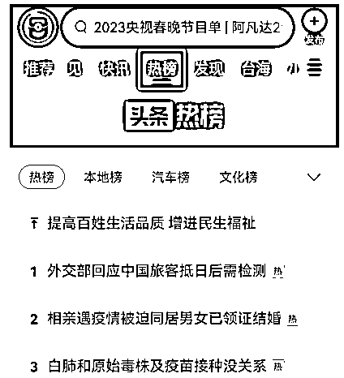
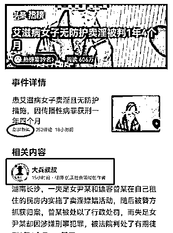
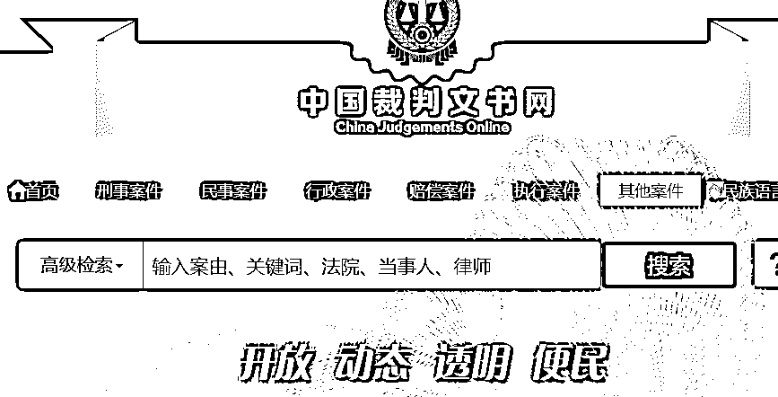

# 4.1.4 法律类：素材来源

1、新闻素材的来源，包括北青网、1818 黄金眼之类的官媒，这些信息来源，一般来说都是可靠的，也都是适合我们写作的。

2、新闻素材的来源之二，头条新闻热榜及地方热榜。

点开头条热榜的详细内容，就会出现官方媒体的报道，比如这个热点艾滋病女子卖淫无防护被判刑，就是澎湃新闻报道的，大家可以关注澎湃新闻，如果有其他热点也可以点击进去，关注下相关的媒体。

这样就会慢慢积累很多的相关媒体，方便以后查找资料。热榜下面就是很多法律人关于此事件的文章，大家可以参考。

还有很多律师账号都写着抄袭必究，比如大兵叔叔，可以参考下他的写法，不能照抄照搬，否则头条会被判定为相似作品仅推荐给粉丝，还可能会受到作者的投诉，得不偿失。

素材来源之三，裁判文书网。

里面有很多已经宣判的案件，大家可以拿来当做资料来写。注意一定要把详细的涉案人姓名模糊处理，不能直接写其真名。一方面是保护当事人，另一方面是防止当事人投诉。

