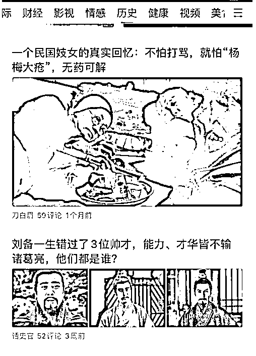
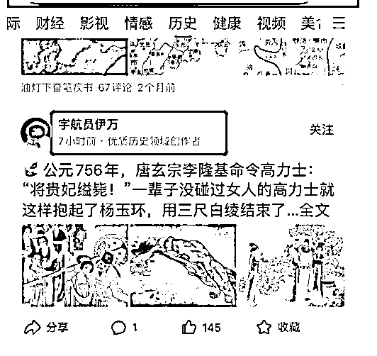
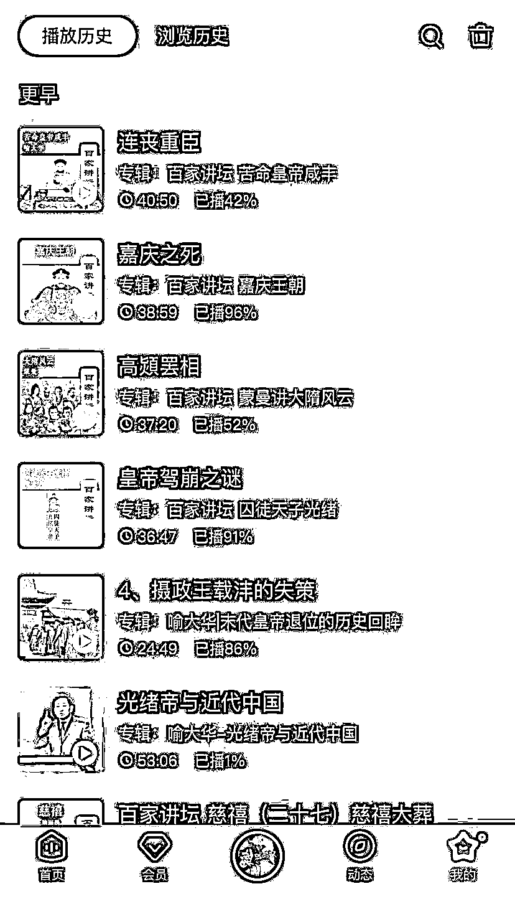

# 4.1.5 历史类：素材来源

历史的素材来源也很容易，大家从小就学习这门课程，肯定能够找到很多新奇有趣的故事。从帝王将相到平民百姓，从将军出征到女子出嫁，可以写的地方实在是太多了。况且，人们喜欢听故事，用一个惊险/紧张/圆满/愤怒/搞笑的故事来吸引大家看，这是很好的方向。

素材的来源也是多方面，比如我们看过的电影电视剧，听历史节目的百家讲坛，一些历史大 V 的人物讲解。甚至我们看到一些历史上的人物素材，我们可以深挖他以后的命运，这也是一种方向（人们只看到了他在历史中的一瞬间，我们需要的就是把他的整个人生经历呈现出来）。

包括各位在刷头条/百家等平台时，也可以看到很多历史小故事，这些都是我们的素材库。

包括 B 站有几位讲历史非常不错的老师，我也分享一下：文大郎（三国历史无出其右者），正直讲史（清朝历史的一把好手），直男文史课（漫画讲历史，搞笑又有趣），御史房（综合分享历史，思想分析很周到）

在这里隆重推荐喜马拉雅，因为这个平台对于百家讲坛的内容几乎是全部收纳，写故事最重要的也是要理解故事，在无聊时，上班途中，点开一集节目。老师会用通俗易懂的方式向我们讲解一段故事，这就是我们一段故事的很好来源。加上他们思想深度，史料来源靠谱，所以这个故事写起来肯定是非常顺滑的。

我常听百家讲坛，分享几个我经常听得节目吧。

