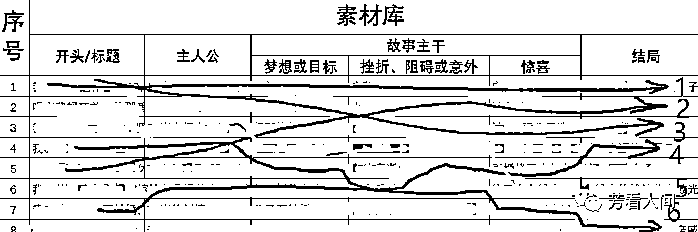

# 4.1.6 如何搭建素材库

当你有了很多的素材来源后，就有了源源不断的素材，这个时候就可以将这些素材分门别类的整理成一份素材库，后期在写作的时候，只需要在素材库里挑选合适的素材进行整合写作即可。

下面以情感类的素材库举例：

先给大家几个对标号：写故事的刘小念、陈若鱼、猪小浅，她们都是写故事的，写法略有不同，大家也可以像她们那样写，我们还可以从她们的号中，获取很多故事素材、爆款标题。

在「4.3.1 情感类：爆文模板」 里，我们会讲情感类的正文模版：一个故事=标题+主人公+故事的主干+结局。

展开来说就是：一个故事=标题+主人公+故事的主干（包含梦想或目标，挫折、阻碍或意外，和惊喜或反转）+结局

拆开来说就是：一个故事=谁～想做什么事～为什么做或怎么做～做的过程遇到了什么～结果怎么样。

接下来，我们先想好，写一个什么主题的故事，再把标题写好，然后围绕着主题，把故事顺着写下去。

主人公：我是谁，多少岁，来自哪里，做什么的……就是简单介绍一下主人公的的基本情况；

再介绍一下，与主人公相关的其他人或物，和主人公是什么关系，怎么认识的，做什么的……也是简介单绍一下他、他们或它的基本情况。

故事主干：想做什么，发生了什么事情，遇到了什么问题。其中包括目标或梦想、挫折或阻碍或意外。

结局：这件事对主人公的影响，主人公是怎么做的、或应该怎么做，结果是什么。

这样，一个故事就完成了。

那我们就按这个公式，来整理并建立素材库。

我们在生活中，文学作品中，小说中，影视剧中，热点新闻中，各网站平台中找到的素材，如何让它们反复发挥作用呢？

首先，我们分别建 6 个素材库，把这 6 个素材库建好后，以后可以交叉使用，就能快速创作出一个故事。

1、标题库：平时看到什么好标题，就是那种你看了，就想点进去一探究竟的标题，然后随手把它存在标题库里。

例如：

1）我 66 岁，退休金 8000，儿孙满堂，但我却不想活了；

2）听完我妈死前说的那番话，我这辈子都不能结婚了；

3）我和堂哥的地下恋，坚持了 20 年，结局让人意想不到；

4）我 68 岁，生过大病才知道，有些东西必须握紧，比亲生孩子还可靠

……等等，有异常，能吸引你想点进去看的标题。

2、主人公库：这个素材的来源，就是你平时看到的新闻，各种报道，听到的八卦，小说中的，影视中的，或者身边真实发生的事件，将这些事件中的主人公放到你的主人公库里备用。

例如：

1）18 岁未婚就当妈的小佳；

2）患有不孕症的小爱；

2）40 岁不结婚，还有很多女人倒贴的老光棍；

3）55 岁大妈生三胎；

4）50 多岁大妈再婚，还要 100 万彩礼；

……等等有异常、有争议的人物。

故事主干库：包含了梦想或目标库，挫折、阻碍或意外库，惊喜或反转库，3 个库。

这 3 个素材库的来源，和上面的一样，我们将这些事件中，人物的梦想或目标，挫折、阻碍或意外，以及惊喜记下来。

3、梦想或目标库：

例如：

1）不孕的夫妻想生娃

2）结婚想买婚房

3）老大爷想找老伴

4）重男轻女的家庭二胎想生男孩

5）想开一家美容院

……等等。

4、挫折、阻碍或意外库：

例如：

1）结婚多年的恩爱夫妻，却始终没有怀孕，医院也查不出毛病；

2）房租突然涨价了；

3） 谈了几年的男/女友，因为彩礼/房子……等原因，遭到父母反对

4）好好的在跳舞，突然中风了；

5）和男/女友感情很好，一方突然卷钱失踪了；

6）和老公/老婆相亲相爱多年，老公/老婆突然要离婚；

……等等。

5、惊喜或反转库：

比如：

1）老家拆迁，得了很多钱和房子；

2）本来女友父母要 50 万彩礼，突然只要 8 万；

3）失散多年的儿子，突然开着宝马回来了；

4）结婚多年，看过很多医生都没有怀孕的女人，3 年后突然怀孕了；

5）房东突然减免房租；

……等等。

6、结局库：这个素材库的来源，和上面的一样，我们将这些事件中的人物，最后的结局，记下来，结局可以是好的，也可以是坏的。

比如：

1）复婚了

2）离婚了

3）一家人幸福快乐的生活在一起

4）儿子把她接到家里养老

5）找到合适的老伴，一起安享晚年

6）去了养老院

7）夫妻更恩爱了

这 6 个素材库建好了之后，我们几分钟以就能讲出一个故事来。

例如：我们用上面除了开头外，其余素材库的 1、5、2、4、5、3 来写一个故事，如下 ：

小佳才 18 岁，还没有结婚，就当了妈妈（主人公库 1），她想要开一家美容院（梦想或目标库 5），但是她只有 8 万块钱，她看中了一间月租金 7 万的店面，想租下来，房东突然说要 9 万（挫折或意外库 2），正当她想放弃时，突然传来消息，房东中风了（挫折或意外库 4），而且房东的儿女不舍得出钱，给他治病，就想把店面尽快租出去，愿意降价到 6 万租给她（惊喜或反转库 5），8 年后，她的美容院开成了连锁店，她孩子的父亲，也回来找到了她，从此，他们一家人，幸福快乐的生活在一起（结局库 3）。

这样子，一篇一波三折的初稿就有了。而且很具真实性，让人看了会有共鸣。

（不想写故事，想要写观点鸡汤文的朋友，就用这样的小故事，再加上一些观点、名言、金句就可以了，一般观点鸡汤文，就是 3 个小故事，每个故事后面加点观点、名言、金句。那就在这 6 个素材库的基础上，再建一个观点、名言、金句库，就 OK 啦）

回到正题，有了这样一个故事后，我们再往里面添加一些细节、对话、动作、心理活动等，就成了一篇有血有肉的故事文了。

一个故事要引人入胜，情节要足够曲折，不能太平淡，还要有非常好的起承转合。

有了这个素材库，一天写 10 个故事都不在话下。

一个素材库，写出 N 个故事的方法：把素材库中的主人公、梦想或目标、挫折或意外、惊喜和结局这些要素，打乱，然后进行不同的组合，组成新的故事。

比如刚刚上面例子：小佳那个，用的是素材库 152453，也可以用 12345 来编一个，或用 22335 也行，以此类推，只需作一点点调整即可。

我再举个简单的例子：

主人公：2 小爱 26 岁，财务；其他人物是小王 29 岁，业务员，他们是夫妻

故事主干：他们想生个孩子（梦想或目标 1），可是结婚 3 年也没怀上（挫折或意外 1）他们看了许多医生，吃了很多药，也没用，他们认命了，不再治了，却在 1 年后，怀上了孩子（惊喜或反转 4）

结局：7 夫妻更恩爱了。

以上结合起来就是一个小故事雏形，如下：

我叫小爱，今年 26 岁，做财务工作；我老公叫小王，29 岁，是个业务员。我们结婚 3 年多了，一直想要个孩子，可是没有避孕，也一直没怀上。我们去看了许多医生，吃了很多药，也没用。我们认命了，不再治了，却在 1 年后，意外怀上了孩子。

这样，一个小故事的雏形就出来了，但这样字数太少，也不够吸引人，需要往里面填充一些细节、情节，填充的越曲折越好。

把故事填充写完之后，就是加观点，和信息量的时候，也就是结尾了。

故事写完后， @自己一下，然后加上一些，自己的总结观点或感悟。

最后，再抛给读者一个问题，这个问题可以是问读者：认不认同你的观点，也可以是问读者：对这个故事里发生的事、有什么看法或观点，反正自己想问什么就问什么。这样，一篇完整的故事文就完成了。

比如：上面小爱那个例子，我们可以给出这样的观点：怀不上孩子的夫妻，不要放弃，只要肯积极就医，放松心情，还是会出现奇迹的。

可以抛出一个这样的问题给读者讨论：你身边有不孕不育的夫妻吗？他们后来生孩子了吗？

其实，这个总结的观点、感悟和问题，可以随便按你的意思来，但不能不写。

这个观点或感悟，如果可以引用一些心灵鸡汤，或名人名言，电影、电视、什么书的金句，那就更好了。

大家以后看电影、看新闻、看书、刷剧、刷视频时，记得把有意思的标题或开头，主人公，梦想或目标，挫折或阻碍或意外，惊喜和结局，这 6 个要素提取出来，分类放在自己建立的素材库里，要用时就拿出来用，就不怕没素材写了。

说白了，收集素材，就好比我们到超市买菜，喜欢什么菜、被什么菜吸引，就把它放进购物车。

整理素材并建立素材库存，就好比我们把菜买回来后，要分门别类地放进冰箱，要煮来吃时，就可以随手拿出来煮。

而写故事，就好比我们炒菜或煲汤，可以胡萝卜+玉米+马蹄+骨头一起煮或煲汤，也可以放别的菜一起炒或煲汤。

至于人们喜欢吃什么菜？喝什么汤？正所谓众口难调，得多次试验后，才知道。

注意：故事的主干内容、情节要详细得当，与主题无关的，略写；能体现人物性格、对故事起推动作用的，要详写。

结尾尽量反其道而行，让读者产生意料之外、情理之中的情感体验。故事的主干，尽可能多用动词来描写，用大白话来写。

少用形容词，多用动词，用连贯的动作来描写，让人有身临其境的感觉，让读者有代入感，有画面感，引起他们感同身受的感觉，从而引起他们的共鸣。

总之，整个故事，要少用或不要描述，语言要简练（比如：月工资 100 元、一个月挣 100 块钱），带入场景，多用动词+名词，让语言更加生动，多用转折词、连接词。

还有就是，不要抄袭、不要抄袭、不要抄袭，重要的事说三遍，包括标题，一定要自己动动脑瓜子改一改，可以模仿，但不能抄袭。

尽量写贴近生活的，温情一些的，正能量的，不要太狗血，太暴力，特别是有违公序良俗、乱伦、色情的，千万别碰。

建立素材库我用的 Excel，然后导入印象笔记里，因为我觉得表格比较直观，大家习惯用什么，自己选择哈。

上面这个图，就是我的素材库，这里面的素材，互相交叉、搭配，可以写出很多不同的故事，60 个素材，一年都写不完，当然收集得越多越好。

