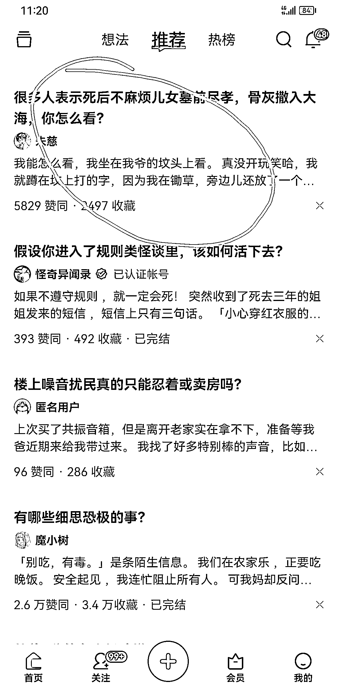
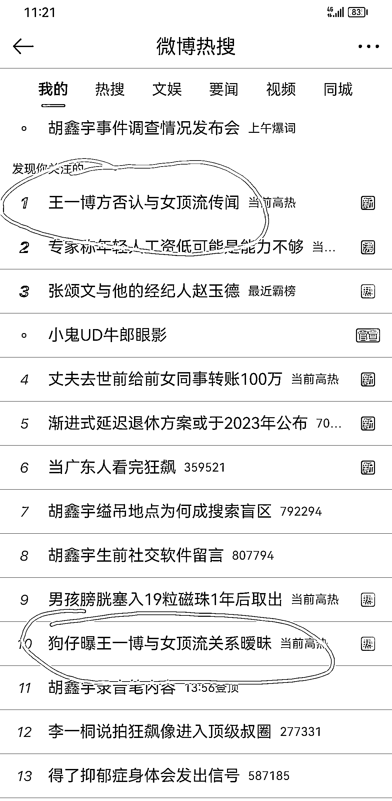
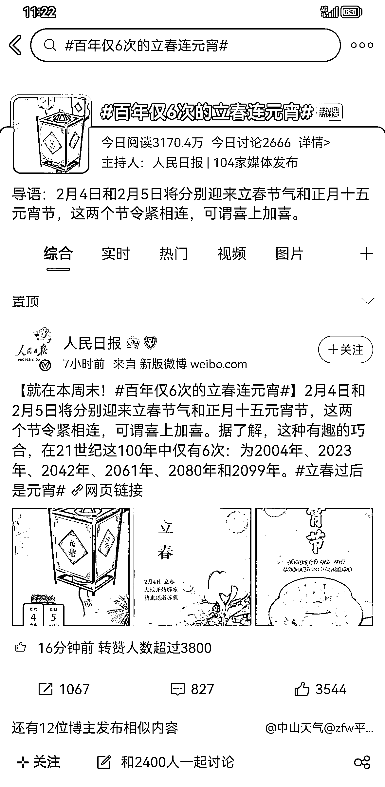

# 4.2.2 热点类：如何选题

热点类的选题，当然是优先从各类热榜上选题。我常用的是微博热榜和知乎热榜，但在具体的热点亚种中，选题的方向也是略有差别的。

“指点江山类”，就是专门抨击当下社会不公事件的内容，主要的阅读者是中老年男性粉丝。

在给这类内容做选题时，知乎热榜明显优于微博热榜。因为知乎对社会的负面新闻曝光的力度会更大一些，微博热榜则粉饰痕迹较强，力度也会远远逊于前者。

我们必须关注到一个问题，有很多的知乎爆款的回答，明明它有流量，但却和热榜没什么缘分。这些内容，往往比热榜上的内容更尖锐，写出来也更容易爆。因为这些内容，都是大伙一个赞一个赞票选出来的，证明它已经成功撩拨起了读者的情绪。我们选题，要选的就是这样刀刀见血的好内容。

所以“指点江山类”的选题思路那就是：知乎自然爆款 > 知乎热榜 > 微博热榜。

“娱乐热点类”，就是专门追当下的娱乐热点，主要的阅读者是中青年女性。

这类的选题不用多说，对大多数的作者来说，微博热榜的作用是高于一切的。我们需要一天多刷几次微博，看到微博的热榜字样。有“热”字的可供挑选，有“沸”字的要优先选，有“爆”字的不仅要优先选，甚至要当天尽快出文章。否则流量就会减弱很多。

所以“娱乐热点类”的选题思路，就是：饭圈小道消息 > 微博热榜 > 知乎热榜

“养生热点类”，就是专门做科普知识类的内容，主要的阅读者是不分性别的中老年人。

特别提示，这个“养生”和我们认知里的“养生”不太一样。它一般都来源于一些古话，什么“立春三不吃两不喝”之类的。老年人的死亡焦虑和疾病焦虑很重，他们看到这类的内容，会为我们贡献很多阅读量。

我们需要做的，就是结合农历的节气，以及在热榜中，挑选出和“健康”相关的内容写文，但写的时候只能往古代习俗上靠，不要给任何医学建议，否则会严重违规。

所以“养生热点类”的选题思路，就是：节气≥微博等平台的健康类选题

其余的热点类亚种，我接触得比较少，就留待未来探索了。

