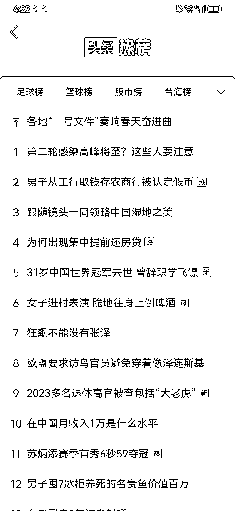
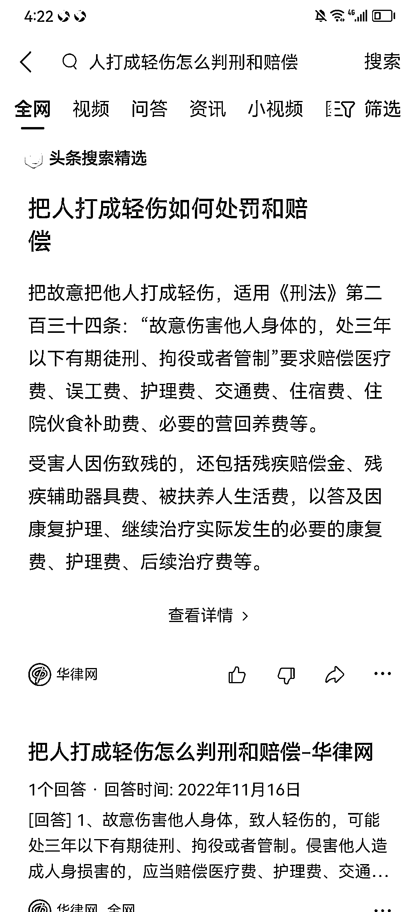

# 4.2.4 法律类：如何选题

建议大家在写新闻的时候尽量选择官媒报道过的，这样就很少会出现被投诉的情况。

我们一定要记住，新闻不要涉政涉军，最好全都是蹬鞋踩袜子，家常里短之类的民生新闻，一定要与老百姓的生活密切相关。那些能爆的新闻类内容，几乎全都是此类的内容。

所以，我这次没有建议大家去微博知乎找，原因就在于此。除了这些地方，各地的新闻节目也可充当素材。你看到哪条新闻时感觉血压上来了，就选哪条新闻，看着没感觉的就不选。

如果理智一点的话，就对照着开幕雷击七要素选，占 2 条要素以上的新闻要优先录用，只占 1 条的不建议使用，1 条不占的绝对不能用。

后面的法律条文，直接百度检索就可以，检索的关键词，就是新闻故事的本质。比如说，一个人把另一个人的头打破了，你就可以检索“把人打成轻伤怎么判刑和赔偿”，然后能得到大量的资料，然后汇编到这个模块就可以了。

