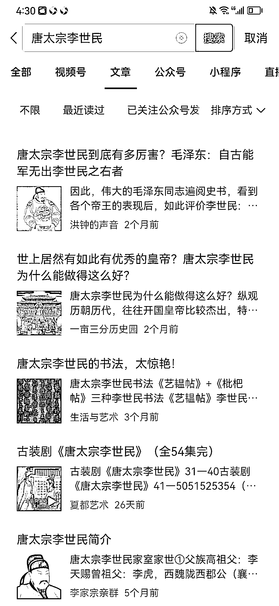

# 4.2.5 历史类：如何选题

历史类选题其实也可以追热点，也可以中规中矩，按自己想法写。

1、所谓的追热点，就是要时刻关注热点动向。

例如”胡歌生女，众人震惊“，我们也可以寻找一些重要人物的出生或者他生了孩子，也引起巨大反响。当然，这个热点，需要非常大的契合度，在经验不足时不建议写作。

类似的还可以找到“县长贪污”的新闻，可以借助这个事件写古代官员如果贪污，会被如何处罚？“明星和粉丝”，写一下古代的追星族的狂热 ，比如《大宅门》里白玉婷嫁给尚筱菊照片的事就是有历史原型的。

注意：追热点历史，需要找到契合度非常高的，而且从今观古，需要作者相对比较高的写作功底，各位可以在以后的写作中慢慢为自己加分。

2、中规中矩写作，就是按照我们自己的想法，写出自己喜欢的历史人物和事件。

写作最重要的就是要写的高兴，可以选择敬佩的人物，讨厌的人物，觉得惋惜的人物，让人落泪的人物，都可以。

找到人物之后，确定好写作的基调，包括他的人物事迹，就可以大致给这个人物一个基本概括了。是敬佩，是同情，是值得肯定还是毁誉参半，全文按照一个基本的思想去写作，就没有什么太大的问题了。

比如写隋炀帝，基本上绕不开劳民伤财，暴政，急躁等缺点，写唐太宗，就可以用虚心纳谏，宽厚爱民等等角度来为他打光。

对于一些记载很少，但是非常喜欢的人物，可以从他的前人后人，身边人等等角度来写作，也可以适当编撰一些，但是不要太过虚假，始终保证假故事也要为真性格服务即可。

