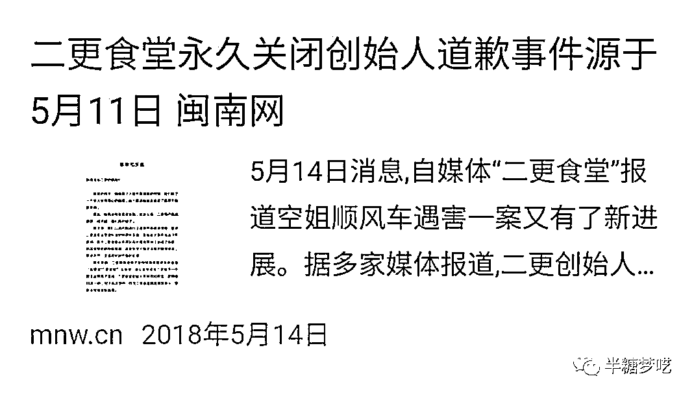
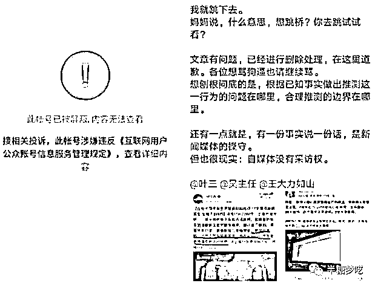

# 4.2.6 选题避坑 @半糖梦呓

公众号同样都是公域流量，措辞上一定要非常注意，有时候题材踩了坑，写得再好也很难爆。甚至有时候用了某个违禁词，也会被平台打压。

那么具体有哪些坑需要避免呢？主要包含以下三种：

1、政治红线不能踩

内容平台每个月都要封禁几千上万个账号。这些账号当中绝大部分都是些很黄很暴力的号，还有相当一部分是因为踩了政治红线而被封禁。

什么是政治红线呢？

我们只需要记住两个词：党史、军史。（准备写文史类内容的作者尤其要注意）

我们的党和军队都是正面的形象，我们在写作的时候，也只能选择正面的内容来写。除此之外，其他的都不要写了。如果想要确保足够的安全，1840 年以后和中国有关的任何事情，最好都别写了。

而民国的人物和历史，半糖的建议是慎写，新手最好不要触碰。

文史领域本身就比较敏感。我们作为自媒体人，更要牢记使命，不忘初心。不该说的话，一个字也别多说；敏感的历史事件、人物一根头发丝都不要提。

那么有的小伙伴说，我就喜欢历史怎么办呢？

建议新手可以从古代史入手，而且是最好是中国古代史。一来比较安全，二来受众广话题多，容易出爆款。

2、追热点不吃人血馒头

追热点是自媒体人的天职，但是有一类热点在公域平台写作，绝对不建议碰的，那就是吃人血馒头。

什么叫吃人血馒头？

第一个例子叫做二更食堂。

这个号曾经是一个百万粉丝的大号，现如今已经被封号了。原因是滴滴空姐被害事件后，二更食堂利用大众对这件事的关注度，编造了许多无中生有的情节，用词情色、猥琐，对死者是一种侮辱。

这种行为就叫吃人血馒头。

吃人血馒头的后果就是百万粉丝大号说封就封，一点余地没有。

第二个例子叫做今夜 90 后。

一个孩子和母亲吵架后跳桥了。今夜 90 后虚构了许多不存在的细节，事后证明这些细节压根就是杜撰的，只是这个博主为了博人眼球罢了。

这个账号同样被封禁了。

利用逝者大做文章，甚至编造出一些不存在的细节，用夸张的、性暗示的语言来描述该事件，这种吃相实在是难看。网络不是法外之地，更不是道德禁区。中国人向来认为死者为大，如果谁想拿逝者来做文章，是会激起众怒的。

有的小伙伴就问了：碰到这样的热点，我不吃人血馒头，也不脑补造谣，我就是站在小老百姓的角度，评判一下社会不行吗？

不行。

因为这样一不小心就会挑起社会对立、煽动仇恨情绪。那么多正面事件你看不见，专盯着社会负面写，不封你封谁？

内容来源：《今日头条七大变现方式，我只用一种，半年赚 80000》

