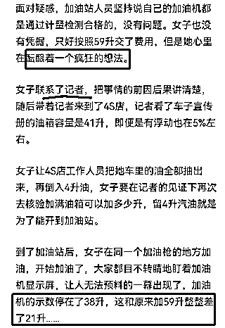
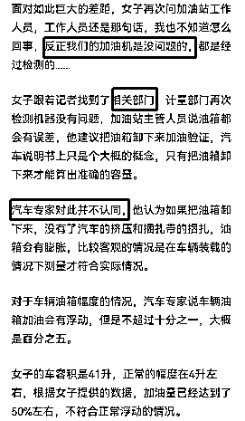

# 4.3.4 法律类：爆文模版

新闻爆款模板，口诀为“说地名+列冲突+讲新闻+网友看+说法律+怎么做+引互动”。全文字数在 1200-2000 字左右（不得超过 2000 字）。

然后，我们正式进入这个七部模板里。

说地名一定要列出省市，以及具体到地级市，这是第一个断句需要做到的事，字数简明扼要讲明地名即可。一般这个位置写出来都是“近日 X 省 X 市”。

列冲突等同于开幕雷击，位置也在开幕雷击位，也就是第一自然段的前 50-100 字，位置紧随“说地名”之后。你这个新闻的核心冲突是什么，如果换位思考，你如何用短短的几十个字，让你的读者和你一样血压上升？这就是“列冲突”阶段所要完成的任务。

下面给大家分享一个展现千万的爆款例子：

“近日山东菏泽，一女子去加油加满后一看傻了眼，油表显示 59 升，而女子的油箱最多加 41 升，并且原来还有 7-10 升，面对质疑，加油站的人竟说没有问题，女子一气之下去 4S 店做了疯狂的举动。”

开头除了常规的“近日 X 省 X 市”发生了什么事情外，还可以直接以情绪化的词语吸引读者的观看兴趣。比如：“令人发指！太残忍了！严惩不贷！太坑人了！太猖狂了！”

这样的开头会如果使用“残忍”等类的词语可能会有一定的风险性。

下面就是“讲新闻”，要用 400-800 字的篇幅，把新闻的来龙去脉讲清楚，这里可以放慢一些节奏。语言要朴实生动，就像日常和熟人侃大山一样，千万别用官方书面语。

另外注意，这里不允许用插叙、倒叙等手法，否则读者看不懂，到时候直接就跳出了。后面的篇幅就全都浪费了。

新闻叙述的过程中尽量增加一些波折吸引眼球的词语，可以让读者愿意跟着你的节奏往下走。

比如文章中的“酝酿着一个疯狂的想法、目不转睛等”，以及女子联系记者、联系相关计量部门、还有咨询汽车专家等各个角度来分析这件事情，让读者跟着你的思路走。

下面是网友看，篇幅为 200-300 字。这里可以从网上新闻账号的评论区里，寻找高赞的网友评论，然后放几条进去即可。这个很简单，没什么可说的。

关于网友的看法，一方面大家可以去寻找爆款中评论多的观点摘来引用。

另一方面如果你写的数量足够多，其实心中已经有了很多种观点，也可以自己编写，反正都是网友说的，对错都无从查证，只是代表了网友的个人观点。可以从正面、反面、或者中立面的角度去分析。

最后可以再加上自己的观点简述一小段，这样网友看法这一步骤就比较全面了，既有别人的观点也有自己简短的看法。

然后就是“说法律”。这里我特别强调一句，就算你没有法律的资质，只要你援引的法律条文没出现问题，就照样是可以出爆款的。

这个需要我们平时了解一些法律知识，多刷刷知乎上的热点问题（他们会代替你列出法律条文，就省的自己找了），以及自己存一些电子版的法律资料（到时候根据关键词检索，找对应的律条）。这一步看似很难，但是在信息时代，你掌握了最基础的关键词检索技巧，就一点问题都没有。这段篇幅也是 400-800 字。

我们简述完了法律条文，后面要再跟上具体到本案本事件的分析看法，以及根据相关的法律条文如何处罚。

然后是怎么做，也就是告诉读者遇到近似的窘境时应该做些什么。这个位置放在倒数第二自然段即可，有几句话就行。

如果觉的前面叙述的不够，或者字数不够，这里还可以增加自己的亲身经历，给大家分享下自己遇到类似事情时是怎样处理的，如果没有发生，可以自行编撰，目的就是引发读者的共鸣。

最后是引互动，留几个问题诱发评论区互动。这个位置放在倒数第一自然段即可，有两三个问题就行。

