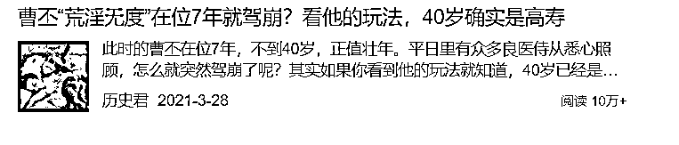
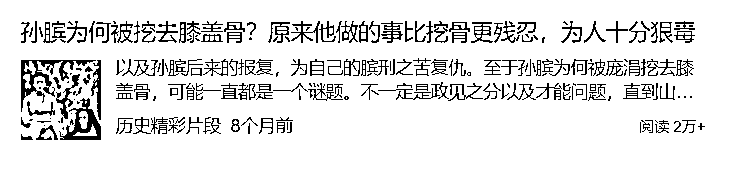
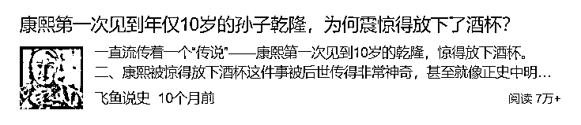
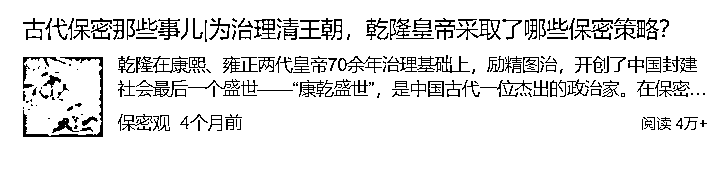
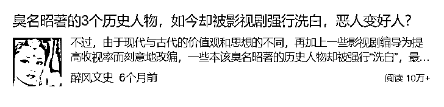

# 4.3.5 历史类：爆文模版

历史公众号文章的写作方式和头条的微头条/问答/文章一样，也是要提出问题，解答问题。

唯一一点不同的可能就是题目。头条的文章题目要求有深度，高度概括，给人以启发。公众号的题目要求吸睛，猎奇，用非常夸张，欲罢不能的题目来给读者以新鲜感，使他不得不点开，看你的文章。

1）历史文，可以以人物的结局令人遗憾或者想象不到来写。

这样的写作，按照人物的经历和生活脉络梳理，从他出生，到青年，中年，晚年结局等等顺序来写。每个时间段穿插一两段事迹，尤其是晚年经历，一定要写作的相对尖锐 ，因为这一部分属于点题。

2）历史文，可以以人物的性格，事迹令人震惊来写。

这样的写作，主体风格不变，还是讲述人物生平，可以以一两件故事来讲，重点讲述他的性格反面。例如善人的恶行，好皇帝的糊涂事。主体可以讲人们认知里的故事，用一小半的篇幅讲述这个人为人所不知的一面。

3）历史文，可以以总结事件原委，让人敬服角度来写。

这个也大致类似追热点，从种种角度来诠释清代保密措施。其他内容可以写各个朝代的传位/皇帝没有继承人，每个朝代怎么选/立长还是立贤，孩子多到底是好事还是坏事，种种方向来讲解一个问题。

4）历史文，可以用盘点人物的类型来写作。

这种方式也很简单，就是来盘点人们固有认知，但是需要打破认知的人物。也可以是盘点有功劳的皇帝，战神级别的武将，幸福的女人，悲惨的女人等等。盘点类文章没有什么太深邃的讲义，基本一个人物，一个小故事，言之有理即可。

