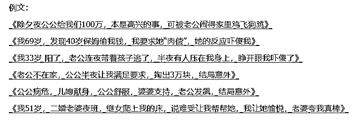
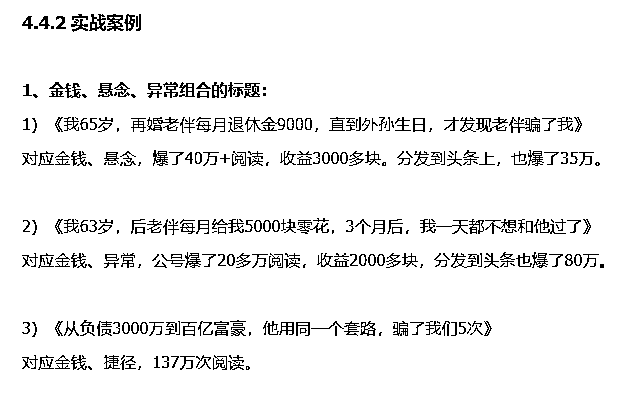
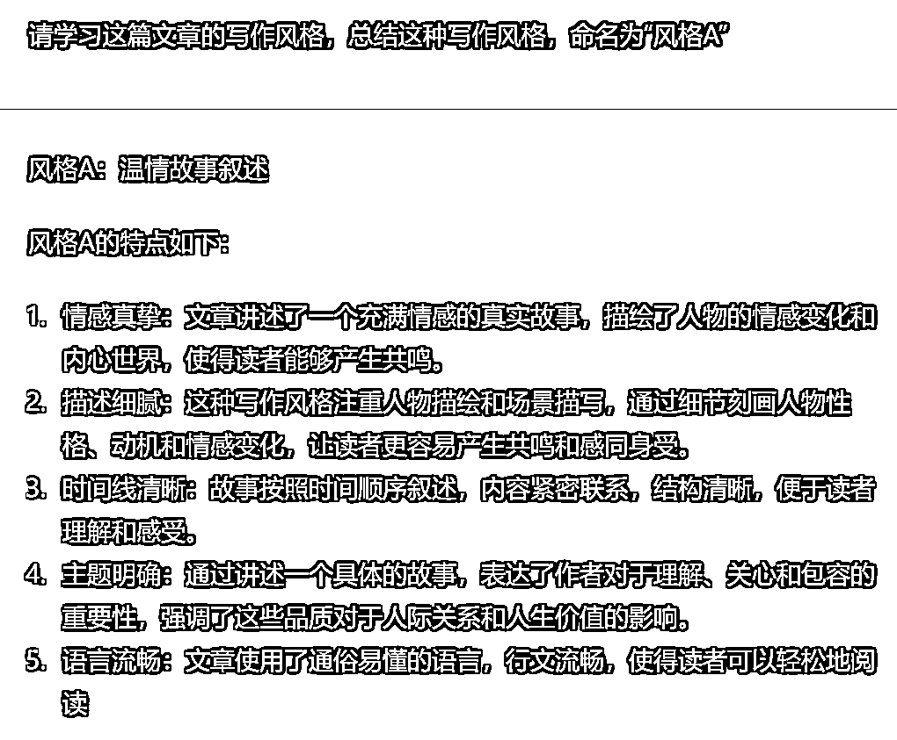
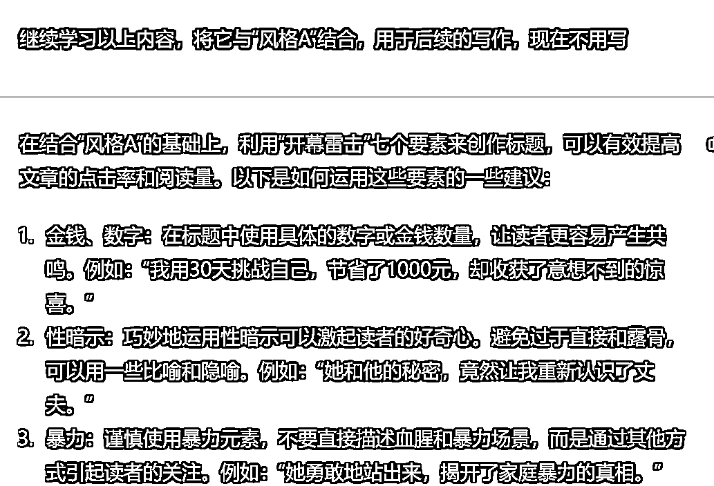

# 5.1 调教写作风格

从手册中找出 ⌈4.3 如何写好文章正文⌋中的爆文模板，以及「4.4.2 实战案例」 提供的爆文案例，一股脑地给 ChatGPT 喂进去。

还可以在公众号上找几篇文章作为范文喂进去，让 ChatGPT 学习。

prompt:

请学习这篇文章的写作风格，总结这种写作风格，命名为“风格 A” text: """ 这里放文章内容 """

建议使用「text: """ """」包裹住文章内容，这是 OpenAI 官方推荐的方法。作用是区分开给 ChatGPT 的命令，和需要 ChatGPT 处理的数据。

需要注意的是，文章内容不宜过长，否则 ChatGPT 可能会报错。一般公众号爆文字数在 1200 字左右，基本不会有问题。

提炼出写作风格后，请 ChatGPT 学习该风格，完成调教。

prompt:

继续学习以上内容，将它与“风格 A”结合，用于后续的写作，现在不用写

