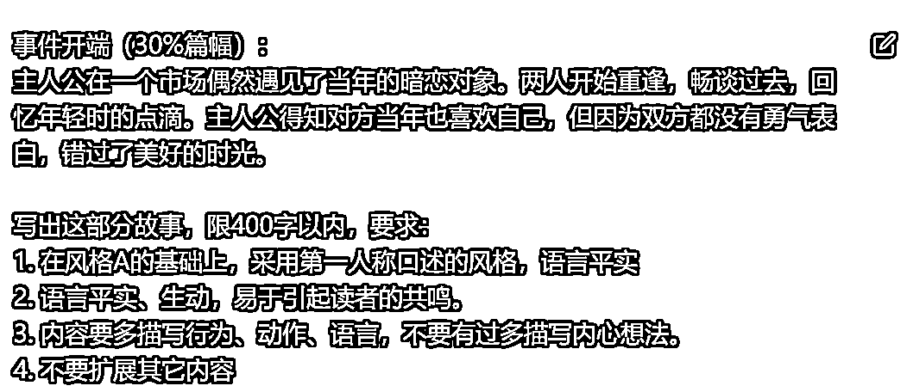

# 5.4 正文撰写

大家都知道，ChatGPT 出来的文章都有相当程度的范式，不是【 1，2，3】，就是【首先，其次，然后】，很机械化，也很程序化的。不要想文章全部由 ChatGPT 自动写，或批量生成，那样质量不会太高。

因此，与其产出一整篇，不如详写各个部分，提出需要重点描写的内容、字数限制和其它要求。完成后，将内容合并起来，此时内容原创度大概能有 60%。

prompt:

事件开端（30%篇幅）：“主要情节”
写出这部分故事，限 400 字以内，要求：1.在风格 A 的基础上，采用第一人称口述的风格，语言平实。2.语言平实、生动，易于引起读者的共鸣。3.内容要多描写行为、动作、语言，不要有过多描写内心想法。4.不要扩展其它内容。

