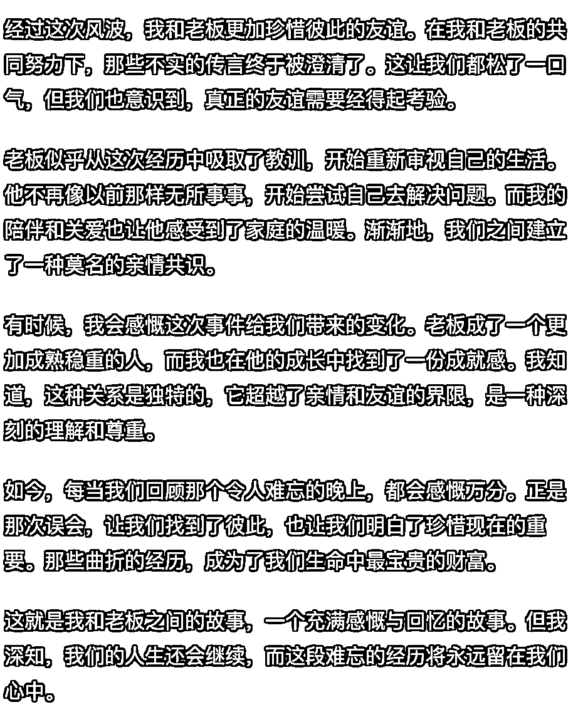

# 5.5.2 精简结尾

ChatGPT 生成的文章结尾通常会比较啰唆，并且基本上都是一些空话，比如下图中的结尾部分：

因此需要人工修改。过程也简单，一般只要选取其中的 2、3 段即可。如果段落间承接比较生硬，再稍微改一下，几分钟就可以完成。

上面的内容精简后如下，虽然结尾没有标题和开头那么重要，但也不要太啰唆。

经过这次风波，我和老板更加珍惜彼此的友谊。在我和老板的共同努力下，那些不实的传言终于被澄清了。这让我们都松了一口气，但我们也意识到，真正的友谊需要经得起考验。
如今，每当我们回顾那个令人难忘的晚上，都会感慨万分。正是那次误会，让我们找到了彼此，也让我们明白了珍惜现在的重要。那些曲折的经历，成为了我们生命中最宝贵的财富。

不要担心字数不够，即使删除了多余的内容，一般也不会少于 1200 字。

