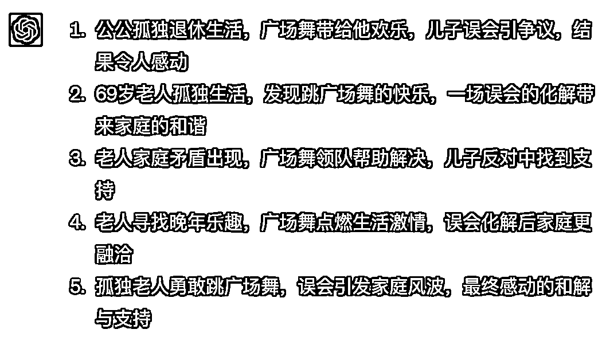
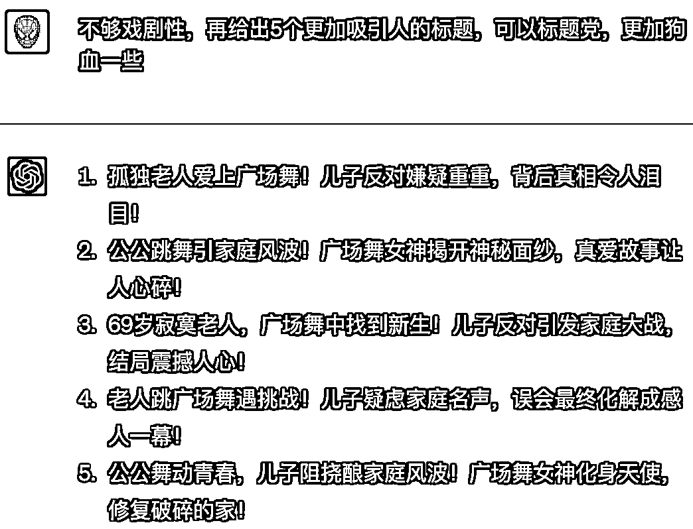

# 5.6 写标题

取标题需要人工操作，一个好的标题，直接决定了文章能否被打开。用 ChatGPT 生成的标题，目前无法直接使用，可以让 ChatGPT 起几个提供灵感。

下面是一个让 ChatGPT 写标题的例子。先让 ChatGPT 学习几个爆文的标题，然后再为我们自己的文章生成一些标题。

prompt:

爆文标题 1 爆文标题 2 爆文标题 3 爆文标题 4 爆文标题 5 参考上面的 5 个标题，为我提供的内容生成 5 个吸引人的标题。 text: """ 文章内容 """

如果觉得都不好，可以添加一些要求，让 ChatGPT 再给出一些。

prompt:

•不够戏剧性，再给出 5 个更加吸引人的标题，可以标题党，更加狗血一些•不够吸引人，可以再优化一下吗？加入异常、反转、数字、冲突等元素

