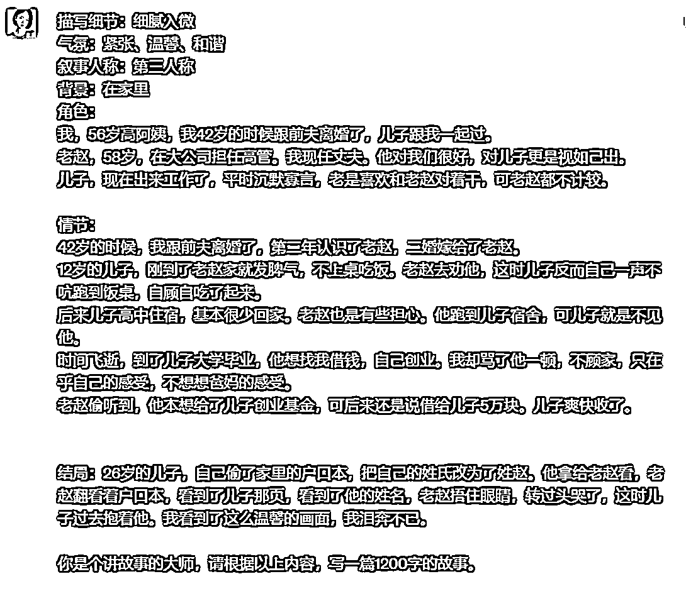
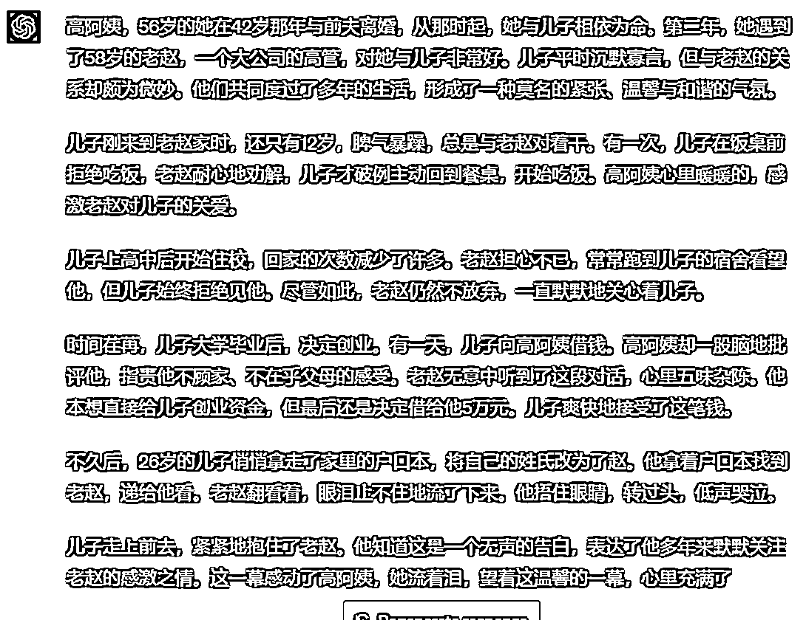
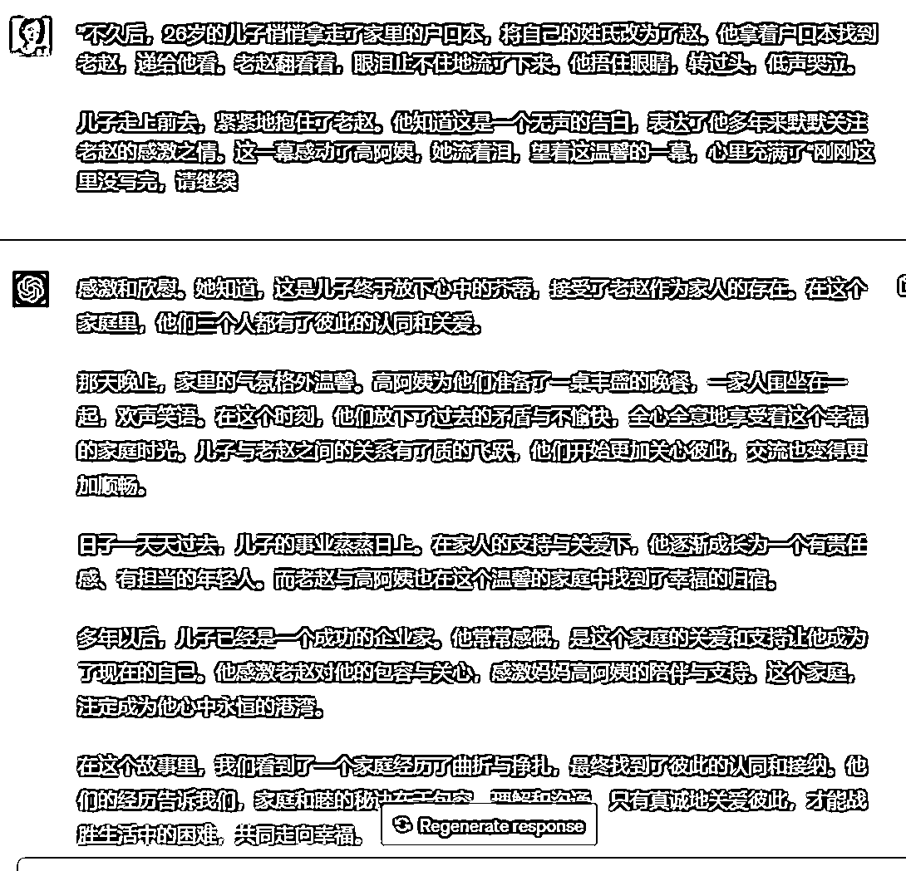
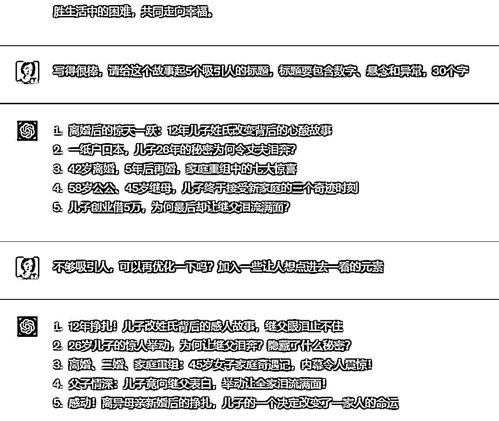
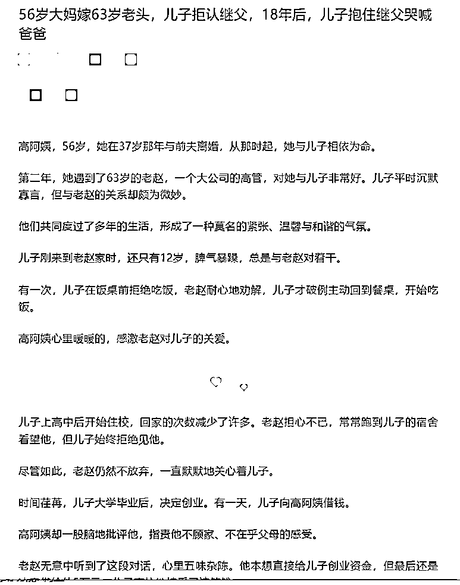

# 5.7 如何快速用 ChatGPT 出稿

如果对出稿速度有要求，或者对稿件数量需求大，可以参考 @小女子 老师的方法。

在有了选题「5.2 找选题」和大纲「5.3 写大纲」的情况下，结合我们平时积累的素材库「4.1 如何搭建素材库」，就可以将选题、大纲和自己的要求，直接甩给 ChatGPT 了。

prompt:

描写细节：气氛：叙事人称：背景：角色：情节：结局：你是个讲故事的大师，请根据以上内容，写一篇 1200 字的故事。

ChatGPT 一次回答字数有限，如果没写完，可以请它续写。

prompt:

“前文结尾内容” 刚刚这里没写完，请继续。

这篇的标题，是在 ChatGPT 的基础上，结合前文说的「4.4 如何写好文章标题」，自己手工润色改写了一个：《56 岁大妈嫁 63 岁老头，儿子拒认继父，18 年后，儿子抱住继父哭喊爸爸》。

正文润色可以参照「4.5 爆文写作自检方向」，调整一下段落，修改不够口语的句子，几乎不需要有太大的改动，就可以发表了。

就这样，一个故事就完成了。最终成文，如下图所示：

一篇文章很快完成，前提是自己素材库要有情节大纲，一小时产出十几篇不是问题。

当然，可能每个人的情况会不一样，不能一概而论。因为大家调教它的时间各不相同，对文章的要求也不同。

如果大家平时有时间，还是得多跟 ChatGPT 玩耍，调教它。

