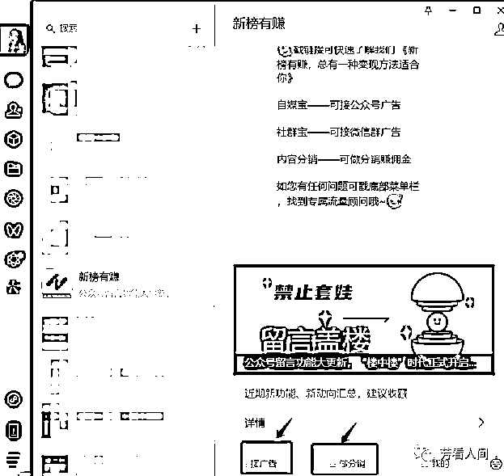
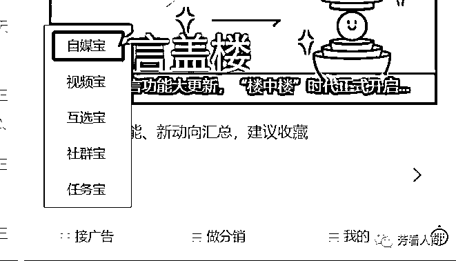
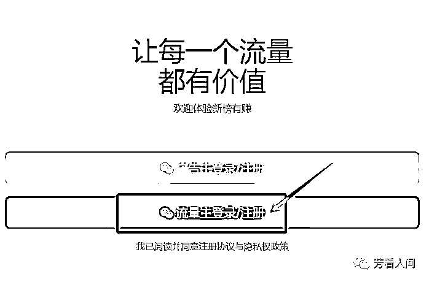
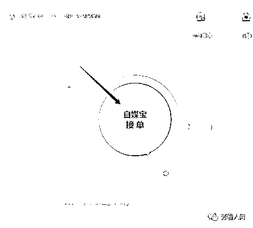
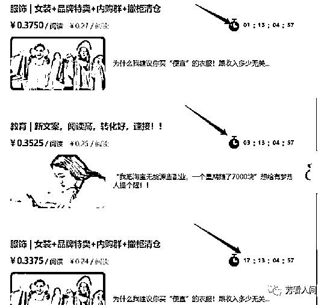
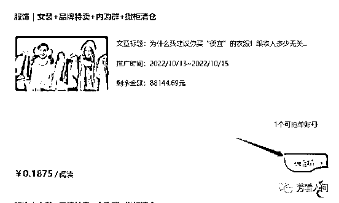
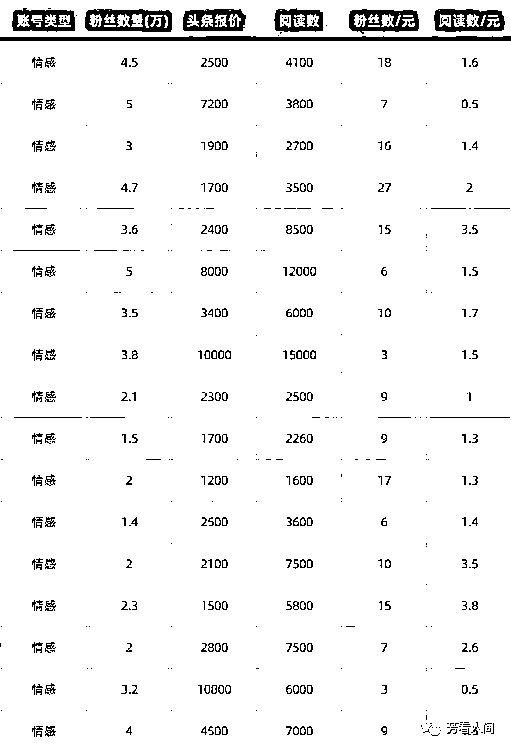
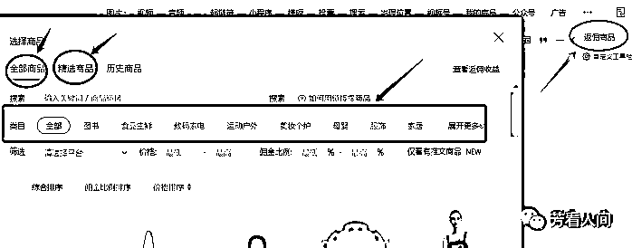
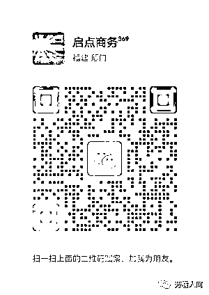

# 6.3.1 广告变现（主要）

广告变现，指的就是在文章中插入广告，例如小程序、游戏、电商等卡片，点击本身或者点击后产生消费，都会收到一笔收益，或者文章本身就是一篇广告文。

目前有四种方式。

1）方式一：自主接广告

要先关注公众号“新榜有赚“，里面有很多种赚钱方式，有分销，有文案类，比如《刘小念》号里每天发那种，按阅读计费，一个阅读 4 毛钱左右，时间要求不同，有的 24 小时可以删除，有的可以放长期，新榜里面有教程，大家可以自己去研究一下。

按系统的步骤，如上面一系列的图所示，一步步的来就行，抢到单之后，在商家限定的时间内将广告的文案，发到自己公众号里，就可以坐等收益了。

收益到账后，可以马上提现到微信，到账很快，可以说是秒到。

我只发过两篇，都是 24 小时可删的那种，每篇收入 800 多块，后面我看有点伤粉，就没发了，等以后粉丝再多点后，再发试试。

“新榜有赚“里面有很多种赚钱方式，大家有时间可以好好研究一下，我试过的，就这种发文案按阅读赚收益的，其它的，我没试过，有待大家自己去研究哈。

2）方式二：商家找我们发广告

商家会在后台留言“商务合作”，然后加微信谈价钱，一般要我们自己出价，对方出文案，我们复制粘贴就行，费用分头条，二条，和三条，头条价格最高，一般 2000 以上一篇。

这种广告要慎接，要看他们提供的文案，是有关哪方面内容，如果涉黄、涉赌、封建迷信类的，不要接，有可能会造成封号。

价格一般如下表：

具体要求，实际价格之类的，以自己跟商家谈的为准。

3）方式三：自己在文章中带货 @徐胖子

公众号带货在十年前是非常火爆的项目，但是这几年视频带货的兴起，导致文字带货的效率越来愈低，同时我们也要看到，公众号带货依旧还有前景。

为什么说公众号带货仍然可以做呢？主要有以下四点优势。

第一，公众号流量大。圈友@渭水徐公 的公众号训练营开到第七期，十万加以上爆款累计 1000 篇以上，更不用说阅读量过万的小爆款有多少了。一个账号每天发布 8 篇文章。每篇文章最多可以植入 10 款产品，8 篇文章的话，就可以植入 80 款产品。只要你的推文中有一款产品爆，你的收益都会很可观。

第二，公众号创作灵活，图文和货物相关性要求低。比如你是写情感领域，学习类、励志类、文学类、情感类书籍都可以带。而且像吃的用的，都可以通过公众号来带货。

第三，公众号佣金高。我们带的商品都可以自己找商家，谈佣金。书籍佣金可以高达 50%，水果和蜂蜜佣金也不低于 20%。

第四，结算安全。官方结算链路，流量主收入有保障，佣金结算效率高，这个可以完全不用担心。用户下单，用户确认收货，结算带货佣金，创作者后台查看佣金，官方打款，这些我们都可以在后台看的到。

具体操作流程如下：

先申请公众号，进驻平台。接下来满足粉丝数 500 以上，确认财务结算资料，申请开通流量主。申请流量主开通审核时间为 3-5 个工作日内完成，正常提交资料后当天都会通过。

开通流量主后，接下来就是开通返佣商品广告，进入推广商品，在文章内植入返佣商品广告发布文章，分享文章赚取收益。

公众号带货功能和头条带货一样，文章有商品的关键词，就在文章里插入相关的商品就行。

单篇推文可支持最多插入 10 款商品，用户在阅读推文时点击商品卡片直达小程序一键下单购买，带来实际成交后，流量主可获得因商品成交带来的销售分成。

此外，我们不管什么时候带货，不管是带书，还是带日用品，带水果，都可以用到以下这个模板：

第一部分用故事切入，第二部分故事到话题转换，第三部分就是商品内容的介绍，第四部分就是引导下单。具体带货文案如何写作，可以查看这篇高手分享 3 月 6 日《如何在公众号带货》@徐胖子。

4）方式四：文末贴片广告带货

识别这个二维码，注册成为有赞的分销商，然后选择自己想要卖的产品，做成超链接，再把超链接贴在文末即可。

不会做超链接的，可以找客服帮你做，但需要你告诉他，你有赞账户的密码。我是让客服做的超链接。

客服微信：可扫码添加

注意：

公众号账号没起来前，发表文章时，要尽可能地简约点，别弄得太花俏。账号起来后，粉丝多了，再看粉丝的年龄段，如果年龄偏小的，可以装修得炫一点，年龄大的，保持简约就好。也就是文章头部一张图，甚至不用图，文中加点分隔符就好。
文中的分隔符，不要放得太多，大约 200 到 300 字放一个就好，不要少于 200 字，也不要多于 300 字。