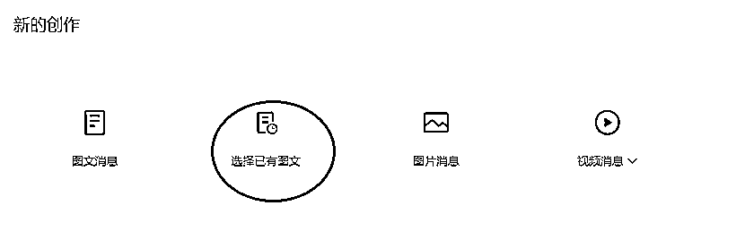

# 7.3.2 尽量不要重复发表

这里要提醒一下大家，尽量不要重复发表，重复发表只能发表一两个月以前的文章，并且不能经常用。

目前出现过三种情况：

1、有人因为经常发以前的文章被限流，比刚开始做的还惨，每天收入个位数。

2、有人因为发了以前文章被摘掉原创 1-3 天。

3、也有人每天都能发旧文。具体情况为，一天发了七八篇，有一篇是前期的，总数上来说没什么问题。

每个账号情况都不一样，上面的案例仅供参考。