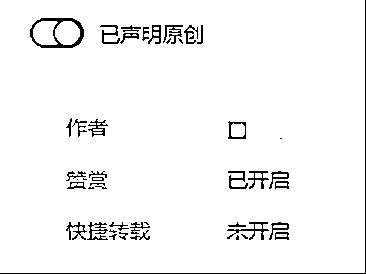

# 7.3.3 记得开原创，转载一定不要开

文章原创一定要开，不然会影响单价和推荐。开通赞赏需要发表 3 篇原创文章。快捷转载切记不能开，开了别人就可以随便转载你的文章，流量就被分走了。

所以发表之前检查以上的部分，再看看有没有显示广告的插入，如果出现下面的字样就没问题了。

文章发表之后可以用自己微信看一遍，检查下有没有错别字，（公众号文章修改只能修改 20 个字符，且只能修改一次，标题不能修改。）可以给自己点赞和在看。但是不要点广告，更不要转发朋友圈和群，也别让别人给自己点广告。如果一直都是相同的用户给你点赞、点广告，那账号很容易死的，就是根本进不了流量池。

内容来源：3 月 13 日《避开这些坑，你也能写出爆款文章》@Nicole·纯

