# 如何开一家公司 230831

创业路上可能会碰到的种种问题

整理日期：**230831**

 

 

生财风向标和周报系列另外用文档分享，地址见专属群q群消息。

往期的生财周报合集（含在线版和离线版），见专属群Q群文件和群公告。

希望大家有收获~

标题加了(精华)的表示精华贴，前面为截至今日的点赞数。

以下是目录，内容有些多。大家可以挑兴趣的内容阅读。

 

 

 
<!-- split -->
# 【创业认知】5篇
<!-- split -->
# (精华帖)(296赞)说一说我所理解的企业底层建设逻辑

 

 

作者：  茅矛

日期：2020-10-21

说一说我所理解的企业底层建设

今天亦仁大神忽然找我，让我说说在紫菜团队分享抖音带货经验与教训那篇分享后面评论里说到的“底层逻辑缺失”这个点儿。

其实，进入生财一直是诚惶诚恐的，因为我前面也提到，我在区域互联网十几年，一直是一个慢工程的思维方式和状态，因为我们这个行业虽然也会有很多挣快钱的路数和方法，但是决定一个企业走的是否长久是否稳健的并不在于一个或者两个突如其来的盈利模式。所以，一直也不知道自己能分享什么给到大家，因为这种慢思维和慢做法多少和生财的这种交流方式格格不入。

回到紫菜团队的那篇分享，我为什么说营收掩盖了很多底层的问题，这里我展开一些来说。

首先说到利润率控制，大部分企业在有单子的时候，都会有些盲目，不去分析的具体的成本，不去考虑可能的税负，不去算有多少应收应付，还不提财务运作的不正规带来的经营风险。

这里举一个电商方面的案例，某平台销售一个旅游卡产品，进货价240，售价300，看起来一单有60的利润，然而财务做了一下核算，直接跑老板那边拍桌子了，“老板，这个单子这样做下来要赔本啊！”为什么呢，因为售价300的产品，增值税达到13%，也就是说39，一下就只剩21了，还没有算平台和人力的成本，如果再核算企业所得税和个人所得税，所剩无几。老板也纳闷了，我明明一单只赚60啊，为什么要交接近40的增值税呢？

但是，如果和供应商在协议中约定“代收代付”，那么这个60元/单的进利就可以定义为营销推广所得，可以按照现代服务业的常见标准6%征收增值税，而今年甚至还可以享受小规模纳税人的1%的优惠。这就意味着税赋从39元一下可以降低到0.6元，直接多出38.4元的利润，虽然企业所得税和个人所得税少不了，但是利润空间则完全不一样了。

这还仅仅是从经营范围和税务筹划的角度去思考，我在高维学堂听原永辉超市财务总监徐薇老师说过国内某知名办公用品品牌的财务团队（对，是财务团队，而不是采购团队！）居然对所有供应链的实时价格了如指掌，原材料在她们手上完全是期货市场的玩法，而且她们还会玩账期，在应收应付款项上大做文章，这种时间差可以为他们获得几倍于自有资金的运作能力，所谓的钱生钱在这里是最好的案例。其实国内的大超市，电器卖场几乎都是同样的套路。

 

 

有些企业觉得自己已经很正规了，该开票的都开票了，然而却不知道在企业开销上面正常登记，在财务审查的时候，因为之前不够重视，很多记账凭证缺失，无法有效的证实自己真实的办公开支，为此花好多的冤枉钱。举个案例，某公司采购十来万的办公设备，因不愿支付13%的增值税，在年底盘账的时候，因为缺乏票据作为支出的凭证，最终公司付出了采购金额20%的企业所得税支出。这听起来是不是很残酷？明明花了十来万，就因为不愿意出万把块的税点，到头来反而还要交2万元左右的企业所得税。反观一些企业的老板，用公司名义购置车辆，不仅免掉了相应的购置税，而且还抵扣了同等金额的企业所得，并且平时车辆的日常开销也可以计入办公成本，作为抵扣。这些都是非常合理的税务筹划手法，和会计带帐做平收支的手法截然不同！

再结合公司主体设定，政策，地方差异各种条件，通过合理税务筹划，在1000万营收的基础上，节税甚至可以从小几万做到百十万，这年头要挣百来万有多不容易？只要筹划得当，就可以妥妥的省出百来万。

所以，财税规划，财务规范是保障企业良性发展的第一要素。今年疫情期间，我听到好多同行在说，今年能不能活下去，就看账上有没有可以发三个月工资的现金……所以利润率控制只能说是财务管理里面很小的一个点，真正把财务管理建设做透了，企业的根基会非常扎实。

第二，就不得不说到团队建设，紫菜团队在发展大好的时候就遇到了和主播的一些意见向左，最后不得已分掉扬镳，直接导致销量的雪崩。简单来看，这可以理解为前期没有制定好合理的规则导致流失，但从本质上来讲，这里就涉及到了企业人力资源的多重问题。

人从哪里来？

怎么建立画像和选人的模型？

如何建立新人入职的培训体系？

如何建立各个工种的考核机制和绩效体系？

如何建立内部的晋升通道和成长体系？

如何加速企业内部人力资源的优胜劣汰，从而保持整个企业的战斗力和上升空间？

如何不断扩大企业的边界，营造不断成长的团队梯队？

如果说资金是一个企业运转的保障，那么人才就是推动企业发展的动力，你甚至可以理解财务是油，人就是发动机，而企业就好比那台车。

当然，最大的区别在于，汽车的发动机是与生俱来（出厂就得有），而企业的人才是需要多种因素逐渐沉淀和培养起来的。

 

 

生财里很多大神既是自己企业的灵魂，也常常成为企业做大做强的绊脚石，这句话怎么理解？恰恰就是因为大多数人都是冲在业务一线，而忽略了企业本身的体系构架，其中造血能力是大多数企业的短板。由于缺乏造血能力，很多事务上到最后就直接导致创始人只能亲力亲为，向上无法考虑更远更长久的战略，向下无法打造出强有力的团队，好比陷入泥潭无法自拔。

我其实在很多咨询过的站点都提到过这点，希望创始人和站长能够放下一些具体的业务，把更多的精力聚焦在企业人力资源方面（至少在现阶段足够重视），这里必然有所取舍，生存面前，业务为先，但当业务趋向于稳定的时候，在这样的喘息阶段是不是应该给予足够的重视在团队建设上呢？

这两天在两个站点走动，都有关于新项目启动的考虑，钱、资源可能都不是问题，没有团队才是最大的瓶颈，而这又回到了我上面说到的关于人力资源的七个问题。这七个问题环环相扣，各自独立又相互关联，对任何企业来说都是一个庞大而又漫长的体系构建。

接下来再说说信息化建设。

什么是企业的信息化建设？

企业的现金流，签约额，应收款，利润率，人均产值，薪资占比……这些都是基于财务的重要信息；

平台的各种流量、指数，用户体量，外围资源是我们评价一个区域互联网站点的参考指标；

拿招聘网站作为一个具体的垂直业务来看，用户的登录数，平台上可投递的岗位数，企业数量，每天新增的简历数，投递数，新投递简历的查看率，简历的完备度，销售跟进企业的密度和细节……这些信息都可以很好的让我们去衡量平台目前的运营状况，有时能从个别指数和信息的细节中找到蛛丝马迹，去寻求改善和提高的关键点。

当管理逐渐分层，我们越来越需要各种的信息过滤来判断一个企业各个部门，各项业务的运转良性与否，并且对应不同的人提供不同等级的综合信息，这是企业信息化管理的本质，通过这样的信息流转加速各项事务的信息传递、状态判断并引出管理层对于关键决策的主动出击。

 

 

而各种信息经过整理向下释放，又是对团队的一种总结和促进。做得好，就加以总结，在未来的工作中再接再厉；做得不好，就去找改善点、提高点，引以为戒，在今后的工作中降低无谓的成本。信息公开化、透明化最大的价值就在于拉通企业上下对于整体战略和具体事务的信息归一，不会因为某种信息差而产生在目标上的差异。

是不是觉得很熟悉？OKR就是一种典型的信息串联，通过O与KR的上下传递，在组织中将公司的战略、目标拆解融会贯通，可以以任何方向传递，它能够达到所有人对公司整体的战略的理解，并在过程不断修正和自我调整、迭代，从而实现企业的自我更新和发展。

在很多大厂，OKR已经成为一种标配；OA系统打穿了公司各个部门的联络和工作协同；

CRM可以直观的将所有客户的联系和维护无死角的展示给管理者；各种系统的后台统计可以直观的反馈部门的运转效率和结果产出；各类的办公协同软件都在不同程度的尝试打通公司内部的交流盲区；财务软件则反馈出企业的运转良性程度（徐薇老师曾经提出过“财务仪表盘”一说）……这些都是企业在管理进化过程中信息化建设的各种形态。

信息化建设既可以理解为各种工具的集合，其实从本质上更应该理解为是一种管理理念和意识形态。

当今企业早就过了凭感觉发展的时代的，一切都有原则，一切都有体系，一切都有底层逻辑。本文所提到的三个方面是我去年在徐薇老师的财务课中企业战略地图中提到的三个支持层。

徐薇老师提到企业管理上有四个层级，分别是：战略层，结构层，运营层，支持层。

战略层是指业务战略，经营规划；

组织层是指组织结构，管理体系；

运营层是指产品研发，营销销售，供应链，客户服务；

支持层就是财务管理，人力资源管理，信息化管理。

我觉得大部分企业在战略层、组织层、运营层其实都很重视，而且做的不错，但是整个最底层的支持层常常被忽略，所以这也是为何我在看过紫菜团队复盘的分享之后，尤其感慨。

收了钱不代表你就有好的财务管理，看似有了一定规模的团队不代表你就具备自我造血的能力，缺了信息化管理就会导致大量的信息差从而带来协作上的不融洽，而这三个因素甚至还会相互影响。

我举个场景说明一下支持层的重要性和相互关联性。

 

 

比如你要启动一个项目或者事业部，你首先要考虑几个问题：

谁来做这件事？我需要组建一个多大的团队？

团队未来增长的步调是怎样的？

组建一个这样的团队需要多少的成本？

项目组的培育期预计是多少？

项目的关键节点和milestone评估如何设定？

如何确保项目推进过程中的监督和关键矫正？

项目的止损点如何把控？

结合支持层的三个要素，无非就是解决团队、成本核算、风险把控，这恰恰就是人力资源管理、财务管理、信息化管理各司其职的点。

有人可能会说，想这么复杂干什么，干就完了，以前没有这些东西不都干起来了吗？没错，支持层在早期并不是必需品，但野蛮生长的状态比不是适用在任何项目上的，当企业和项目发展到一定规模的时候，人力的匮乏、信息的通达度、财务预算机制的保障都会限制项目的更进一步。

所以，企业的底层逻辑建设很容易被忽略，而在高速发展的过程中，支持层的重要度被慢慢意识到的时候，体系的建设对大多数企业来说是极其痛苦而又漫长的过程，尤其是早期已经习惯了爆发式增长的创业者来说，支持层这种精细而又短期难以见效的过程真是折磨而又纠结，可能只有少数看的更远的创业者才会坚定不移把这一块儿坚持下去。

这是我对于企业底层逻辑建设的一些观点和看法，欢迎各位指正和探讨！

评论区：

荔枝小一萌 : 先赞后看。

大卫 : 讲的特别到位，学习了[抱拳]。企业从小到大必然会面临的问题，也是一个必然的过程，比如：华为向IBM学习流程削履适足，才有了现在的规模和成就！

顺=秋 : 讲的透彻

肖子浩 : 学习了，写的很全面

星辰 : 从财务税筹、企业基础搭建、关键点把控，再到信息化数字管理等，对企业底层逻辑建设阐述的通俗易懂，而又富含思考，学习了。

婷婷就是小可爱😎 : 已收藏，值得反复阅读

李小龙 : 学习

柯南 : 值得反复阅读[强][强]我想到了第一性原理

 

 
<!-- split -->
# (精华帖)(189赞)一个连续创业六年老兵的心得与感悟

作者：  鱼丸|亦仁助理

日期：2020-11-19

周三  来啦~

一家创业公司，早期在公司只有一个人的时候如何快速的做出正确的决策？如何判断一件事情能否做成？公司早期要不要找合伙人？创业六年的他会和大家分享下他对这几个问题的一些独特理解。

今天邀请到的这位  是  ，前几个月开发了一款集微信公众号SEO、百度+知乎、无吧主贴吧等模块引流的产品「极客增长」，相信不少圈友都知道这款产品。

来，欢迎  开始他的分享~

大家好，我是亦仁的小迷弟「令狐峰」，非常开心能获得亦仁团队  的分享邀请，今天我想分享的主题是：一个连续六年创业老兵的心得与感悟

简单自我介绍一下，连续六年的创业者，大学一毕业就与另外二位校友开始在高校领域创业，野心比较大，前五年公司主要想铺规模，想上市，主要以拿投资+烧钱为主，前前后后差不多烧了5000万的现金，钱主要花在人力薪资+开分公司各项开销方面，但是公司的业绩始终无法爆炸式增长，另外高校市场每年八百万的用户的流失率，让我觉得怎么努力都无法解决这个问题，在公司发展方向上分歧越来越多，加上长年的996工作，身体有点疲倦，太多的周末会议让我烦躁，因此萌生了自己单独开一家小公司的想法。

终于我在去年10月底份，放下来过去的各种头衔和荣耀，打算从零开始做一家小公司。

最初我对这家小公司要做什么没有清晰的规划，属于冲动性创业(不鼓励冲动创业)，虽然冲动但一开始我就给下了做业务的三个准测：高筑墙，广积粮，无边界。这三个词分别代表什么意思？

【何为高筑墙、广积粮、无边界？】

● 高筑墙：是指一件做的越久壁垒性越高的一件事情，别人很难轻易进入。

 

 

高筑墙在于项目要有一定的门槛，不是一个人随便培训几个月，也能和我们做一样事情，不然市场很快就会从蓝海变成红海。找到一个蓝海市场，并且不断深耕才是我们追求的事情。

● 广积粮：以赚钱为主，现金为王，目标是一个月赚个100万的现金他不香么？

主要是前一次创业，想通过资本方法，太想做大做强了，然后上市，走向人生巅峰，在被社会无情的毒打了之后，我才意识到我是处在金字塔底端的人群，只是一个普通人，先从改变自己和身边的人做起，赚到钱了之后，再去尝试改变世界。

● 无边界：先不给自己设置使命，先做一些能赚钱并且有趣的事情。

不想设边界是因为市场机会太多了，在当前环境下选择的重要性可能要大于努力，互联网发展速度之快，每年都有好几个风口，不设边界能够更好的适应市场，等遇到合适的项目，再给自己确定使命，公司的存活率会更高。先生存，再发展。

【「极客增长」的工具诞生的故事】

最终在去年的11.20号把公司正式成立了。

上次创业的时候我一直在公司担任产品总监和技术总监，但是运营部门一直不归我管，懂行的人可能都知道产品运营不分家，光只靠产品拉开与竞品之间的差距是挺难的，因为长期缺少运营上的帮助，所以我对运营有一个很深的执念，想把”流量“这件事情做好。

我自己也比较偏产品和技术，发现SEO好像是以技术型驱动的增长，于是花了二个半月的时间开发了一套SEO相关的系统。做完系统了投入市场之后，发现这件事情天花板太低，竞争也比较激烈，我开始寻找新的机会，不过SEO这件事情每个月也差不多能够给我带来2~4万之间利润，相对还算稳定。

之前有听说过生财有术，但是并没有深入了解生财有术，就在4月份看到了生财朋友圈发布的造势，于是在4.18价格最便宜的时候加入了生财有术。

没想到加入的第二天，我看到  的《讲一个千万级流量的套利机会》，当时就震碎了我的世界观，对的震碎，竟然还可以这样玩流量，并且深刻做了自我检讨，反思为啥我没想到，最后发现我没有跨界思维。之后就每天阅读生财有术的内容成为我的日常，在阅读的过程中认识了非常多的财友比如擅长公众号和视频号引流的@郭耀天，技术型引流选手@痴海，擅长知乎带货的  ，非常热心的  和  等等

 

 

在世界观被重塑了之后，我开始琢磨是不是能做一款流量相关的工具，首先流量是每一家公司都绕不开的话题，小到线下门店，大到阿里这里的巨头。初步估算了一下至少有2000万的人群对获取流量有需求，市场空间巨大，因为疫情的原因，越来越多的人开始意识到流量的重要性，因为生财的信息，一般来说会有3~6个月的信息差时间，所以目前市面上还没有类似的工具，如果我们做出来，那就是第一家。

正好这个时候，我上家公司的部门同事  问我，他准备离职，问我能不能到我这边来和我一起创业，做啥都行。因为佩奇是我面试进入前公司的，是我从十个产品经理里面挑选出来的一位，并且接触过较长的一段时间，对他比较认可，信任感也比较强，于是欣然搭伙创业，成为我的合伙人。

在前公司我一直同时兼任产品总监和技术总监，在产品和技术层面有一定的积累，产品设计和产品研发我一个人可以搞定，试错成本非常低，值得试一下这个方向。于是花了二个月左右的时间，把工具给做了出来，包含微信公众号SEO、百度+知乎、无吧主贴吧模块等模块的引流。

刚开始我和  期望没有特别高，觉得第一个月只要能卖出30份工具的会员就行了，我们把文章《我们做了款千万级的流量工具》发到「生财有术」星球里面，结果一晚上就完成了我们一个月的KPI，第二天直接卖出了100份，不得不感慨，我们对「亦仁」的力量一无所知。

因为我和佩奇都是产品经理出身，所以非常在意用户口碑，一度我们口头禅都是一定要给予会员十倍价值回报。截止上周结束，一共产生了550位购买工具的会员，650位购买星球的会员，9月份和10月份在除去各项成本之后，利润均超过了10万，目前11月份预估也会超过10万。

那么，很多人应该会很好奇，这个期间我们到底做了哪些事情？

1.给对我们有过帮助的大佬，都赠送我们工具一年的会员。比如：  和  老师2人都帮助我们推荐了10+朋友购买了我们的会员，还有圈友  也帮助我们推荐了不少伙伴，还有很多其他朋友的帮助，在这里不一一点名了。

2.不能只靠售卖工具，工具终究会被抄袭，得两条腿走路，我们在工具热度还不错的情况下推出了「增长内参」知识星球。

3.把用户当做朋友，凡是用户在群内提出的问题，我们都尽可能会回答，我们不知道的问题，会请教可能知道的朋友，让朋友在群内回答其他的问题。所以群内讨论的氛围非常热闹。

 

 

4.我们鼓励朋友在群内互相链接加好友，一般人不会愿意在一个陌生的群里聊天，但是如果很多朋友你认识，并且讨论的都是最新的引流知识，那么你也会对这个社群非常感兴趣。

5.不定期的发福利

9月份我们在中秋节的时候，花了1万块，给200位群内朋友送了月饼，让社群有了一丝温度

疯狂的群里发红包，整个10月份差不多发了接近2万块的红包。

6.前期以社群为核心，而不是以星球为核心

社群是一个集思广益的过程，你一言我一语，就会产生非常多的信息差，众人拾柴火焰高。

将社群中优质内容沉淀到星球，让平时比较忙的人也可以看到群精华。这里再次感谢  ，热心每天帮我们整理群内的精华

7.亦仁的无私帮助，好在我们在杭州，见亦仁非常方便，在见完亦仁之后，亦仁可能觉得我们挺靠谱，非常大方的帮我们进行了背书，推荐了我的工具，再次感恩。

大量研究生财有术的运营方法，作为国内Top1的社群，有非常多值得学习的点，我和佩奇都疯狂“抄”亦仁作业。

各种运营方面的术

为人处世真诚利他

超预期的交付用户

对人性的理解把控

...

接下来说一些我的开公司的心得和方法论

【如何在早期快速做出正确的决策？】

一个人的公司，拥有全部话语权，让我感觉非常爽。独裁可以让公司走的非常快，但是也非常容易出错。因此我给自己制定了一个决策机制，简单但是决策的成功率非常高。

Swot分析法(感兴趣的可以看一下百度百科的描述，不感兴趣的可以看下我的简单版本)：

 

 

百度百科：Swot分析法即基于内外部竞争环境和竞争条件下的态势分析，就是将与研究对象密切相关的各种主要内部优势、劣势和外部的机会和威胁等，通过调查列举出来，并依照矩阵形式排列，然后用系统分析的思想，把各种因素相互匹配起来加以分析，从中得出一系列相应的结论，而结论通常带有一定的决策性。

Swot分析法固然好，如果每一个觉得都严格按照上述步骤，那么会很累人。所以我一般做决策的时候都只做Swot简单版本的：利弊分析。要做一个决策，我会初步的写下做这件事情利、弊。

以我们做「极客增长」工具的时候是否要做「增长内参」知识星球为例：

利处：

1.有「亦仁」作业可以抄，降低了试错成本

2.可以沉淀我们群内的精华，可以让错过群消息的朋友查看

3.可以带动工具模块的销售，给公司带来更多收入

4.可能运营好了可以获取到知识星球的官方推荐流量

5.可以单独成为一条业务线，加速团队成员的成长

6.推出星球是一个壁垒加深事件，做的越久，星球的影响力越大

7.工具和星球可以打包卖，获得一个更加易售卖的价格。

弊端：

1.需要花费我们三个人接近一个月的时间，去看全网1700篇引流文章，并且精选出200篇，打好标签，作为星球的基础内容

2.会耽误一些我的开发时间，开发进度会变慢

3.会产生额外的开发任务，需要开发PC端和小程序的文章分类系统。

4.可能存在卖不出去的情况。

5.一年内会产生持续的运营成本以及内容产出的成本，但是这一点是坏也是好。因为这个可以倒逼团队成长，倒逼我们自己了解并生产更多内容，获得更多行业的知识。

简单来看，有7个利处，5个弊端，利大于弊，初步来看，值得去做。

截止到现在看来，我们的决策是正确的，不到一个月的时间，光星球收入超过10万，还不算上因为买了星球了解到我们，最终又去买了工具的朋友。

 

 

很多时候合伙人之间对一件事情观点发生分歧，进而发生争吵，甚至有不欢而散的，觉得对方是傻X。只是因为大家的观看事物角度不同，有的人看到了做这件事情带来的很多好处，有的人看到了弊端，二个人谁也说服不了谁，因为大家的观点都是正确的，做任何一件事情，必然有利弊的存在。我们要做的不是去试图说服对方，这件事情没有弊端，而是应该仔细研究Swot，做好报告，最终用一段分析数据来说服对方。

上面一段感悟，是我在前公司开了无数次讨论会之后，才明白的一件事情，虽然简单，但是我认为却价值千金。

很多巨头的陨落，也是因为没有好好对重要事情进行Swot分析，导致错失了良机，比如优酷面临在广告业务和会员业务之间的冲突，因为轻率的原因，轻易的放弃了会员业务，没有做出正确的决策，最终导致丢失龙头老大的地位。

【如何早期判断一件事情能否做成？】

在产品经理领域，绝大多数人最佩服的是张小龙，其实还有一位齐名的人物叫做俞军，北俞军，南小龙。俞军老师有一条著名的产品经理军规(非常重要)：

产品真实价值=（新产品价值-旧产品价值）- 用户迁移成本

这句话是我职业生涯举住轻重的一句话，一定要记住。

产品的价值不是仅仅考虑自己提供了那些价值，还是考虑现在市面上的有那些产品，最关键的还要考虑，用户从其他产品迁移到你的产品上的成本。

下面我事后诸葛亮，以俞军老师的理论来进行分析，为啥老罗的「子弹短信」一出生就注定了失败。而拼多多却能在互联网第一巨头阿里虎口夺食。

老罗想挑战微信熟人领域，核心面临的问题就是用户关系链迁移的问题，这几乎是无法完成的。我们按照俞军老师的公式来看。

产品真实价值=（新产品价值-旧产品价值）- 用户迁移成本

子弹短信的价值：在聊天过程中优化大量的细节，提高沟通效率

旧产品的价值：巨无霸微信，不仅满足沟通，更满足了线上和线下的大量需求。

用户的迁移成本：用户需要他的熟人社交关系链全部迁移过去，有时候少一人都不行。

要一个用户把他的好友关系全部迁移到另外一个APP，几乎无法完成。

 

 

我们先不看价值差异值，用户的迁移成本已经高到天际，无法想象，就算强如马云与丁磊的很久之前联手推出「来往」，马爸爸亲自站台，也无力回天，基本上截止到目前为止，我认为熟人社交领域是死海。

拼多多为什么能在互联网第一巨头阿里虎口夺食：

拼多多的价值：让普通人能非常便宜买到大量商品。

旧产品：阿里拥有最全的SKU、支付系统、完善的卖家体系

用户迁移成本：通过拼团、砍一刀、领100红包，引流到小程序和h5，购买过程中可以使用微信支付，大幅度的降低了用户迁移成本。

拼多多产品确实有价值，进行了消费分级，但是这还远远不够。早期拼多多能起来的原因在于玩透了微信生态的规则，吃透了微信的发展红利，并且同时以农村包围城市的打法，拼命下沉去抢占阿里的未触及的用户。微信在网民中普及了，那用户是通过亲戚朋友的砍一刀去用拼多多快，还是通过自己摸索了解到淘宝快。不言而喻。

拼多多在早期的时候，我一度以为微信给了拼多多的免死金牌，后来才知道拼多多挖掘了大量的微信团队的产品经理，这些产品经理对微信的生态了如指掌，微信存在哪些漏洞如数家珍，因为这些产品经理懂得怎么做才能不违反微信引流的规则。

用户从微信中使用拼多多是非常方便的，一个熟人扔过来一个链接说，是兄弟就来砍我，你一点击就用起来了。迁移成本降到了极致，有恰逢微信支付的崛起，打通了支付环节，时势造英雄也。

手握流量，兴风作浪。

【公司在早期要不要找合伙人?】

可能很多人创业一开始的第一反应就是找合伙人，我个人看法是不要着急一上来就找合伙人(根据个人情况)，我们先看一下找合伙人会有那些利弊：

利处：

1.事情可以合伙分工去解决，少操点心

2.做决策有人可以讨论

3.可以看到更多机会

弊端：

 

 

1.找到合适的合伙人可能就需要一段很长的时间

2.合伙人之间也需要磨合，磨合是一件挺花时间的一件事情。

3.早期的合伙人，股份都占比很大，利益分出去有点太随便了，可能会给后期埋下隐患。我个人认为在磨合一段时间之后，再给予股份是才是一件明智的事情。

4.做决策虽然可以有更多的，但是早期往往独裁的效率要高很多。每个人的认知程度不一样，要说服一个人改变想法可能并不容易。

5.因为开销更大了，就看不上赚点小钱的事情，一心铺着事业去了。一旦你想做一件大事情，成本会直线上升，但前期中小公司「活着」是第一要素，要从小钱赚起。

6.合伙人可能存在掉链子的情况，因为创业存在木桶理论，一旦短板，可能业务就会掉线。

找合伙人有利有弊，根据自己实际情况多思考。我建议能不找合伙人的情况，优先选择不找合伙人，后面可以把优秀的员工提升为合伙人，比如  老师找的合伙人  老师，就是从普通员工中提拔出来，做成公司合伙人的。

如果你还是无法确定是否要找合伙人，我给你一个建议：花钱容易、赚钱难。你要知道，人越多，花钱速度越快，但是赚钱速度不一定能跟上，如果赚钱速度能跟上，那么可以找合伙人，如果赚钱速度不确定，可以试着先自己干。

只要你能始终保持赚钱的速度大于花钱的速度，公司不死，坚持做复利的事情，总有柳暗花明的一天。

创业早期尽量不要一上来就做很需要3个协同以上事情，毕竟现在人力成本都很贵，先从只需要1~2人的事情做起来，自己拼一点一个人完全可以搞定。比如现在的知乎好物、Tiktok等训练营，一个人做的好，月入5万可能并没有问题。然后你在用赚来钱，再招聘员工他不香么？

这里我强烈推荐  老师的裂变式创新文章《  裂变式创新：我把小公司迅速做大的核心经验》，有时候人很重要，甚至比事情还重要。一流的战略和三流的执行；三流的战略和一流的执行，马云老师选择了后者。

最后说一些我其他的小心得：

√ 面试面的好，省心省一半

 

 

面试是一件低投入，高产出的一件事情。我给自己定了一个规则：所有入职的员工我都要亲自面试(学习张一鸣)。乔布斯曾经说出，优秀人与平庸的人，不是一倍二倍的差距，而是五十倍的差距。你只要花几个小时的时间，可能就能获得一位与你工作几年的同事。这时间不值得花么？

不过创业早期，不要太过于追求优秀的员工，毕竟人家的选择也多，别因为过于要求招聘优秀的人，导致招不到人，耽误公司业务进度，另外选择适合自己的员工也很重要。

√ 部门总监要给员工赋能

我们经常说“老人做新事，新人做老事”。这其实就是通过老人已经把事情的逻辑打磨通了，做好了SOP，本质上是降低新人的上手成本。换句话说是老人给新人赋能。

总监给员工赋能有多重要？

根据我目前的测试，一个优秀的善于赋能总监，至少能提高一个员工50%以上的工作效率。

目前公司涉及到四个岗位，涉及销售、运营、客服、技术。

每个岗位在做什么事情，我都了解，并且会花点时间思考或者询问，他目前遇到了哪些问题，正在怎么解决，然后我会尝试用我的经验和能力会帮助他提高效率。

√ 降低员工的离职率

每一位员工的离职，都意味着他在公司的经历、公司对他培养全部付之东流。

学不到东西、领导无能(心累)、工资不够、发展空间受限为员工离职的主要几个原因。

所以给员工赋能就非常重要，既能让员工学到东西、也不会遇到困难只能在那心累、公司发展好了，待遇也会提升，发展空间也会更大。

目前我司成立一年，离职率为0。在上家公司，我所在的部门离职率也是全公司最低的。

人心齐，泰山移。

√ 尽可能的降低公司成本

对于很多早期公司而言，降低成本其实是很重要的一件事情。

以我们的项目为例，如果不是早期我一个人完成了产品+前端+后端+爬虫+测试等工作，而是每个职位都招聘一个人的话，光把人全部招齐可能就需要一个月的时间，同时公司的支出成本会疯狂飙升，可能9月和10月只能勉强有一丝利润。

 

 

让一个人兼职多个岗位的事情，而不是一个人只做一个岗位，对于早期公司很重要，能够大幅减少成本。

关于公司成本的一些其他看法，可以看一下我今天刚刚在星球里面发布的，

√ 充分利用碎片化的时间

相信很多人看完可能觉得怎么可能，我一个人是做那么多事情。

核心秘诀就一点，充分利用碎片化的时间。吃饭、洗澡、上厕所等时间，我基本上都会思考一些公司情况。很多点子或者事情都是灵光一现，就出现了。另外要学会拒绝掉一些不必要的事情。

√ 认识自己的能力

不要想一上来就改变世界，认识到自己是个平庸的人很重要，不要异想天开，要脚踏实地，从改变身边的人做起。我们目前都是处于金字塔底端的人群。比我做得好的，有生财有术；比生财有术做的好的，有知识星球；比知识星球做的好的，有微信；比微信做得好的，有苹果。认识到自己处境之后，一步一个脚印，向顶尖的人学习，不断朝着目标前进即可。

√ 抱紧贵人的大腿

根统计，人的一生大概只会遇到七次贵人，绝大多数的时候我们都与贵人失之交臂，因为我们的认知与能力不够。在认知达到一定程度之后，一定要把握好每次抱紧大腿的机会。

努力固然重要，但是贵人的一句点拨，一次随手的帮助，可能就会对你产生翻天覆地的影响。而生财有术就是聚集了大量贵人的地方。提升自己的认知与能力，准备好相对应的付出，抱紧生财有术的大腿，抱紧亦仁的大腿。

√ 锻炼自己的执行力

让我踏入互联网的并且开始下决心开始学习编程是一部电影，叫做《社交网络》，这部电影我前后至少看过十遍，讲的是性格内向的扎克伯克，做出了Facebook，并且逐步风靡全球的故事。让我初步对创业这件事情有了认知，也认识到了原来只要靠几个人就可以做出服务千万人甚至亿级的用户产品，后来有幸在逛知乎的时候，看到知乎的合伙人「黄继新」说过回答过最深的感受是什么？执行力。当你还在不断思考到底该怎么做好一件事情的时候，别人已经做完上线并且开始推广了。

 

 

本文差不多结束了，我来一句鸡汤，以绝大多数人的努力程度之低都轮不到拼天赋，生财有术的精华文章你都看完了么？

最后在生财这里立个Flag：明年的11月份，争取公司月收入超过50万。欢迎大家微信搜索「极客增长」公众号，来监督我们赚钱。

 

 

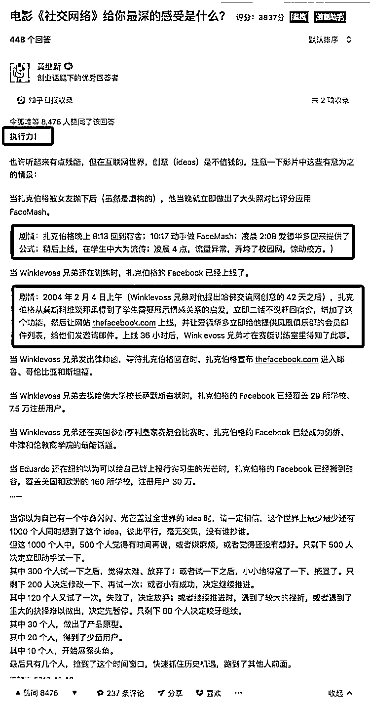

评论区：

王一的爸爸 : 优秀，向老师学习。

壹树 : 厉害！[强]

梁文斌 : [强][强]

阿润 : 就在极客增长的群+星球里，很有帮助，向老师看齐[拳头]

皇星 : 作为一个刚上车的新人，唯有拼命啃精华😂

令狐峰 : 王老师才厉害，商家岛做的很棒。

令狐峰 : [抱拳]

令狐峰 : [呲牙][呲牙]
<!-- split -->
# (精华帖)(189赞)小马宋：关于创业实践的一些真实感悟

作者：  小马宋

日期：2023-03-01

 

 

2016年2月29日（所以我们的七周年既不是今天，也不是昨天），我40岁，第三次创业。

这二十年，创业三次，虽然没什么大成，但中国最广大的创业者，不就是像我这样的普通人吗？没多少人能做成世界500强，世界上99.999%的公司都是普通公司。

另外，我还经历了几百家真实的公司咨询案例，看了很多最真实的商业实践。

所以，我讲的一些真实的感悟，你不妨听一听，我昨晚抽空随想随写的，并没有什么逻辑和顺序。

1、合伙创业，一定要先明确利益分配和权力分配，不要不好意思，在利益面前，很容易兄弟反目。坦诚的正面争吵比卑鄙的背地算计要好无数倍。

2、创业前，一定要明白你的“顾客”从哪里来。对于消费品来说就是渠道、推广和销售，对于咨询公司来说，就是获客方式。要知道只有极少数公司靠产品致胜，绝大多数公司都是成交为王的。

在不知道如何获客之前，不要盲目去创业。

3、能力是可以锻炼出来的，即使你过去认为你没有。我的演讲能力，是用两个月讲了60场大学巡讲练出来的，之前我跟陌生人说话都会脸红。

4、作为一个乙方，该比稿还是要比稿，该降价还是要降价，不要学我。我是因为写公号写出影响力了，我有广告收入，一开业就有客户，而你和我不一样。想要不比稿，你就要有更大的影响力，让客户主动来找你。

5、有时候欺骗可能会让你更快地成交，但是诚实的公司，可能走得更远更稳健。

6、作为一个小公司，不要总想着跟员工谈理想，利益是积极工作的第一驱动力。

7、我们公司至今没有前台，在雇佣一个人之前，你最好想想，这个人是不是必要的？

8、员工不会完全跟你说实话，你要努力知道真相。

9、不要沉迷于做老板的自我陶醉中，你也许只是一个运气好点的傻子，很快就会凭实力亏掉一切。而糟糕的是，你通常觉得这句话是在说别人，而你自己永远伟大、光荣、正确，英明神武。

10、别沾沾自喜以为自己做得很好了，这世界上永远有人能比你做得更好，这句话永远正确。

 

 

11、商业有很多黑暗和灰色的地带，这是正常世界的一部分，习惯就好了，注意别掉进去。但是图书管理员眼里，世界上都是爱看书的人；赌场老板眼里，世界上都是赌徒，关键是你想活在哪个世界里。

12、不要羡慕别人，别人有别人难念的经。

13、要承认自己无能，承认自己会犯错。但矛盾的是，承认自己的无知，需要相当程度的认知。

14、你不可能让公司所有人都满意，因为人人都有不公平的幻觉，人人都有高估自己的倾向。但分配上要有明确依据。

15、执行力是关键。很少有公司能把一件事做得很彻底，那些做得彻底的公司值得尊敬。你可以想想，哪件事在你们公司是被彻底执行的？

16、你不可能创造出一个完美的公司，努力改善，但接受它的不完美。

17、不断创新，这是一家公司竞争力的源泉。每年回想一下，你在这个行业里率先做到了什么？产品、工艺、文化、模式、做法，还是方法论？如果没有，那就问你自己，凭什么你能赚钱？

18、钱有快钱、慢钱、长钱、短钱，看你想赚哪一类，想明白了，没啥对错，不后悔就行。

19、心太软，管不住公司。心太硬，没有人情味。

20、公司不断需要新技术、新方法，你不会的，就要学，学不会的，找个会的人来帮你。

21、不要乱花钱，钱很容易就花没了。

22、不要舍不得钱，该花的就要花。而知道什么钱该花，什么钱该省，那是一种智慧。

23、明白什么对你来说更贵。时间更贵，就用钱来买。

24、不要意气用事。

25、商业环境变化越来越快，如果你不学会适应新环境新方法，那就只能等死。

26、不要迷恋没有利润的营业流水，到手的铜钱胜过远期的金币。

27、不要沉迷所谓赶时髦的投资机会和各种虚名。

 

 

28、学会拒绝别人，就算赢了自己。

29、该谈钱谈钱，谈钱又不丢人。

30、学会花钱买经验，花钱买技术，花钱买方案。

31、别人愿意帮你，是因为你值得帮，没人愿意帮你的时候，那问题在你。

32、按时付钱，不管是员工工资还是供应商的钱。

33、赏罚分明。

34、多从员工的角度想想，这么做，你乐意吗？

35、承认错误，承认自己的愚蠢，能都及时止损。

36、看到很多机会，往往就失去了方向。一件事都干不好，凭什么做很多件事你就能成呢？

37、把时间留给你最看重的人，而不是泛泛之交，推掉80%的饭局。

38、决策要有依据和逻辑，不要赌。也不要用基于美好的愿望代替思考逻辑。

39、但是，并没有100%正确的决策，但你总要做决策。决策成本是企业的重要成本，只要不是作死，要敢于做决策，说干就干。错了，纠正错误，继续干，用成功覆盖失败。

40、当你想要颠覆一个行业的时候，想一想，为什么那么多聪明人没能颠覆这个行业？

你比他们聪明在哪里？

41、不要用个别和偶然现象激励自己。

42、不要耍小聪明，并且以为别人看不出你的小聪明。

43、正确区分朋友、伙伴、同行和对手。朋友是可以无条件帮你的人，伙伴是可以有条件帮你的人；同行是他的生意和你类似，但你的结果与他无关，这个像在一起钓鱼；对手是和你零和博弈的人，这个像是在下棋。

44、很多大道理都很简单，就像减肥的道理一样简单，只是我们大部分人做不到。

45、至诚不息，即使是两面三刀的人，也不喜欢自己而喜欢真诚的人。

46、不要因为读过了就能做到。重要的是做，不是阅读、收藏和转发。

 

 

最后，感谢你，感谢所有小马宋七年来的客户，陪伴小马宋7年。

小马宋咨询公司七周年案例发布会在售票中，有兴趣的欢迎购票观摩。

https://mp.weixin.qq.com/s/MbVO32SDK-InRFady9EHeA评论区：

壹树 : 受教了，谢谢。

修炼中的妖妖 : 很受用，感谢分享[强]

金多多 : 第一条直戳我心呐，合伙创业，真的真的真的一定要先明确利益分配和权力分配，不好意思的结果不是帮你而是在害你自己和合伙人。

金春春 : 同感啊

亦仁 : 感谢分享，已加精华。

小红书服务商 : 作为创业人，感同身受，感谢小马宋老师肺腑之言。

张日 : 看到很多机会，往往就失去了方向。一件事都干不好，凭什么做很多件事你就能成呢？[强]

Luke王子 : 受教！
<!-- split -->
# (精华帖)(146赞)亦仁：我认为公司最重要的突破，首先是创始人思维认知的突破

作者：  亦仁

日期：2023-02-13

评论区其他圈友说的都很好了，我再补充一个视角吧。

我认为公司最重要的突破，首先是创始人思维认知的突破。

“对于同样的事情，不同的人有不同的看法，有人悲观、有人乐观，有人抱怨，有人想办法去改变和解决。思考问题的不同方式，决定了人的不同层次。”

给大家推荐一篇文章，建议多读几遍。

https://mp.weixin.qq.com/s/4QhHcNsnLnQQ1mboMenDcw 

 

评论区：

坤坤 : 悲观者正确，乐观者前行。

张老师 | 张导师 : 所谓现代科学容易把简单的事情复杂化。建议大家都学点国学，大道至简。

do小鱼 : “你之所以有时候会不知道该如何选择，除了对某些概念不清楚之外，最重要的就是你不知道自己想成为怎么样的一个人。”

代码君 : 常读常新

木白 : 第五层：把问题都推给环境。

第四层：把问题归结到不努力，拼体力结局问题。

第三层：思考问题的本质，通过学习和努力，想办法解决问题。不仅拼体力，还拼脑力。

第二层：有自己独立的信念、价值观、行为准则，面对问题参考以上3条。

第一层：知道自己像成为什么样的人，行为都是为了实现这个目标，以终为始。

最顶层：超纲了，感觉是命运安排的。

星辰 : 深有同感，现在越来越觉得，有时候人生路上真的需要几本国学书。比如《论语》、《孟子》。有时候人不是卡在某个具体的技术问题上，而是卡在到底要不要做上面。to be , or not to be？这个时候，看技术，看管理是没用的，要看历史书，要看经典的国学，看看古人如何做抉择。

胖大魔 : 多读几遍！！！

早早 : 看完醍醐灌顶，越看伟人传记，越觉得厉害的人都是精神和信仰驱动

<!-- split -->
# (精华帖)(73赞)十年创业老兵：长期收益来自于不计短期收益，尽心为用户创造价值

作者： Sin

日期：2021-04-26

创业经历  十年创业老兵的几点复盘思考

 

 

大家好，我是Sin，从事比较小众的区域互联网行业。三段经历贯穿了我的前半生（这三段经历时间段上分别有5-10年的交集）：A.自己创业十年，从两口子的业余爱好发展到目前公司有130人的团队，算是区域互联网的头部企业之一；B.在一家传统媒体公司经历了从初创（我在团队20多人时加入）到营收过亿又伴随着行业变迁而衰落的十年；C.近距离旁观了一家股东结构较复杂的互联网公司从辉煌的青壮年期（也是收入过亿），到遇到瓶颈停滞不前、核心团队黯然离场的七八年。

看到生财圈子里非常多充满创业热情的年轻人，大都在还未下场或者还是起步初期的阶段，我觉得我这个老大叔有必要把我在职场、创业这些年的几点复盘思考分享给大家，比较散乱，也可能并不适于当前的环境，仅供参考。

一、长期收益来自于不计短期收益，尽心为用户创造价值

前述的三家公司，初创阶段都具备两个特征：1.项目孵化自成熟的大公司，创始人、创始团队原先都是大公司里的中层，初期完全是出于兴趣爱好和利他的善意，发现某些用户群体的需求，不计当前收益地服务用户（因为个人收入不错、没有股东的压力、自己业余时间做的项目也没有考核KPI、初心纯粹），从而打下良好的用户基础，反而因此获取了长期稳定的收入，逐步发展壮大；2.项目孵化到需要独立运作时，已经具备良好的用户基础、平台基础和商业模式，公司从成立之初就开始盈利。

比如，B公司起步时就是几个IT发烧友做客观公正的消费级产品体验与评测，C公司创始团队在工作之余为同城宝妈处理闲置母婴用品搭建了一个免费的平台，我当年自己建了个本地女性论坛分享本地消费信息，每个周末跑到各个商场去收集新品上市、新店开业和打折优惠信息，组织各种非营利性团购，并线下聚会“分赃”，由此都聚集了大量的精准C端用户，正是这些用户，为我们后续的发展打下了坚实的基础。

二、增长才是硬道理，需要持续为保持增长而布局

这些年最大的一个感触就是企业必须保持持续增长，这是企业经营者的一条不归路。

1.增长可以给企业消化问题的时间和空间。任何企业，无论大小，总会有各种问题，想把所有问题都解决掉，这是不可能完成的任务。带着问题前进这很正常，但问题总归要解决，不然积累到一定程度，必然会导致企业积重难返。要解决问题，需要时间，也需要利润空间，而如果企业没有增长，能腾挪的时间与空间就非常有限。

2.引入外部的优秀人才需要高薪资、良好的增长预期，核心员工期望更高的收入、成长空间，逼迫创始人必须为增长殚精竭虑。

 

 

3.小企业抗风险能力弱，经济环境的剧变、行业巨头的冲击，都可以让小企业失去业务，一夜回到解放前。而要想把企业做大、抗风险能力做强，就必须不断增长。

回顾三个公司的跨越式增长阶段，都有两个相似点，一是把已有行业（产品、板块）做大做深，二是布局开发新行业新产品。我初成立公司时，只有一个婚嫁行业，前半年收入只有100多万，第二年婚嫁行业收入很快突破300万，与此同时开始扩充团队，布局亲子、家居行业的内容和运营（初期都没有营收），第三年引入外部人才，成立单独的事业部，开发已经搭建好用户基础的亲子、家居行业，再然后就是医美、地产、政务等行业的布局与拓展……前三年的利润基本上都用于运营人力和资金的布局，如此循环往复，持续在选人、找人、寻找资源、分配资源、设计分钱方案这些看起来“务虚”的工作上，这样的回报就是我一个几乎不见客户的社交恐惧症宅男，公司目前几大主力行业年收入都能达到800-2000余万元，账上资金能保证公司在零收入、支出不变的情况下生存两年。在这种情况下，我依然不敢有任何松懈，战战兢兢如履薄冰，持续学习和思考，布局和探索新的营收来源，以保持公司整体能够持续增长。这种增长的焦虑，内心不够强大的话，会非常伤害创始人的身心健康，很多老板的幸福指数其实远不如初创阶段。

三、需要与时俱进，不断学习，尝试新的商业模式

在公司发展的壮年期，团队很容易满足于当前的模式和收益，公司的考核目标也容易基于当前的业务、产品、模式做设定，这样就容易失去创新、冒险的氛围和土壤，错过很多时代的机遇。也就是说，创始人必须一直让公司的成熟盈利项目，不成为开拓新项目、新商业模式的阻碍。

四、特别需要注意的几个坑

1.公司的股权一开始就需要设计好，不然后患无穷。B公司未能持续发展，有很大一部分原因在于母公司股东过于看重利润，把利润都抽取到母公司，B公司没有布局新项目的资金投入；C公司的衰落和股权纷争、创始人与核心团队离开也有直接关联。

公司的发展方向，也就是控制权，要掌握在核心团队手中、掌握在与长期利益捆绑在一起的团队手中，也就是说，与公司共存亡的人能拍板；如果没有上市计划，给团队分配少量的股权还不如直接发奖金、分红；股权和分红激励，一定要设计动态的方案，不能是固定的激励模式，避免变成负激励；需要为未来高管、核心员工预留股权；需要约定好股东的推出机制，等等……

这方面专门的课程和图书都很多，创业者一定要提前先了解——比如成立公司之前、引入投资人之前，先去搜索一下“有限合伙企业”、“GP、LP”、“税务筹划”等概念。

 

 

2.当发现市场与客户发生变化，企业需要转型改变时，老板一定要对公司和团队的战略目标、考核、绩效做相应的改变和调整。在一个产品能够创造营收和利润时，你不能硬性要求团队减少这个产品的经营资源，去做符合未来方向但团队缺乏相应能力、不习惯、甚至导致团队自身利益受损的事情，而应该重新设计目标和规则，让团队自己根据目标而做改变，或者干脆另起团队，新团队新公司与老业务老团队物理隔离，让新模式新产品在新的公司与团队土壤里成长起来。

要做到这点其实非常难，B、C公司的衰落，与没能很好地做到这一点有很大关系，这个问题也是目前最考验我的一大难点。

3.内部选拔与空降高管的矛盾冲突。组织中大部分人才要靠自己培养，只有少数人才需要空降。

创始人一方面总想寻找一个“像我们的人”，一方面又希望这个人“做我们做不到的事情”，这本来就是个自相矛盾的事情。因此，在引入能力与气质与老团队差异较大的外部高管后，一定需要老板扶上马送一程，首先帮助外部人才了解公司的工作方法、企业文化，然后给他授权，同时经常交流，就一步步工作方法达成共识。同时也要注意平衡新老管理者的收入问题，否则很容易因空降高管公司弄得鸡飞狗跳，最糟糕的情况就是外部人才水土不服黯然离场，原有核心老员工也强烈不满滋生去意，这种情况在各个公司里都很普遍。

评论区：

竹影 : 虽然现在用不到，但对未来创业价值很大，感谢分享[抱拳][抱拳] 韩英 : 创业第三年，已经开始踩坑，当年不懂动态股权设置，股东退出机制埋下的隐患很大

shaweishui : 已收藏，谢谢

az : 非常收益，很有价值的分享[玫瑰][玫瑰]感谢

阿泽 : 大佬能推荐下哪个课程或图书讲的比较好嘛

惠一 : 大佬能讲讲区域互联网地产项目具体是做什么的嘛？

Sin : 就是面向本地用户、本地商家的互联网公司，客户主要是开发商、家居、结婚、相亲、教育、商业地产、政务等本地生活消费行业

佩奇 : 有收获，感谢分享

 

 
<!-- split -->
# 【公司注册】1篇
<!-- split -->
# (精华帖)(97赞)不出钱不出门不租办公室，如何注册公司并开户

作者：  杨永

日期：2022-03-03

去年，圈友@氟西汀  分享一篇在广州不花钱注册公司的文章，链接参考：

https://articles.zsxq.com/id_mfr9c5a6npsr.html今天我给圈友来分享一下，如何在全国任何地方一不出钱二不出门三不租办公室注册一家公司和银行开户的方法。

我去年年底是因为要做跨境电商的原因，实操注册了一家公司并且银行开了公户，没有出门也没有出钱，过程很简单，下证也非常快，关键是不用租地址（提供实体工位地址），也不用出门跑流程。但仅限有限公司，个体户无法注册，需要办理个体户营业执照的圈友，可以不用往下继续看了。

在实操过程中，我发现人不在杭州本地也可以出证，所以对于不担心异地银行操作问题的外地圈友，也可以尝试下证。比较适合做跨境电商，不需要办公地址的圈友。

https://sbu67xqbm4.feishu.cn/docs/doccnMcAbXl3I2UR5mlf3ApTGYf评论区：

 

 

毅 : 注销要去了吧

杨永 : 自己办需要去行政大厅的，也可以找代理去办

波哥 : 看到银行的对公账户办理需要法人去银行，联系最近的民生银行是要去杭州的民生银行还是任意地方离家近的民生银行呢？

杨永 : 地图上查一下离你近的民生银行，然后告诉园区的工作人员，他们帮你约时间，法人拿身份证去核实一下身份信息就可以了，剩下的他们帮你办

词宝嘟嘟 : 正对此关注，谢谢分享

词宝嘟嘟 : 行动起来

波哥 : 好的谢谢分享

麦子YNL : 太有用啦，最近正好找了几家代理咨询公司注册业务
<!-- split -->
# 【股权设计】13篇
<!-- split -->
# (精华帖)(152赞)老板必读如何让公司3个月时间，业绩翻3倍？

作者：  深圳刘宁培

日期：2023-08-10

我是刘宁培，也可以喊我宁老师，龙凤胎奶爸，常居深圳，全国飞。

主业企业咨询：股权设计、企业经营管理、商业模式板块。

副业做点小投资：开开知名品牌的加盟店，年底线下摆摊卖卖红包对联。

是生财第二期就一直续费至今的老圈友，编号1748。

 

 

我在生财有术立的生态位，一直是跟股权设计/股权激励相关的，前后写了三篇文章，都拿过精华帖，链接如下：

①企业初创期股权知识，避坑80%+：https://t.zsxq.com/fyNbAuR②股权顶层设计：https://t.zsxq.com/UBqVvjU、https://t.zsxq.com/27eqV7A③股权激励：https://t.zsxq.com/05iMB2Zfu

之所以立“股权”相关的生态位，因为“股权”背靠公司法，是公司“所有权”层面，不像“经营权”层面的薪酬绩效/管理，老板有调整的空间，

股东之间一旦发生了“股权”相关不可调解的矛盾，基本上就是打官司解决，轻则公司业务从头开始，重则公司业务就废了，所以每个公司几乎都有“股权设计”的需求。

近半年成交的生财圈友，如亦仁大哥、谢无敌老师、盖哥、刀姐、任佳伟老师、马超老师、陈亚东老师、旭教练老师、刘子荣老师、高夫人、林蔷七老师、七小等，还有几个年利润过千万的大哥、大姐、小姐姐......

虽然立的是“股权”的生态位，但“薪酬、管理”板块的内容也有做。

接下来这篇文章，给大家讲讲，我是如何通过“所有权”的股权激励+“经营权”的薪酬管理，让@谢无敌老师的闪亮猫传媒业绩，在短短3个月的时间，翻了3倍。

谢无敌老师，大家应该都认识哈，介绍如下：

**1. ** 闪亮猫传媒创始人，通过小红书矩阵号帮自家家居品牌引流变现超过**2000**万；

**2. ** 小红书实战营带练导师，已孵化美食、职场、设计、艺术、宠物等多个类目**IP**，冠军学员最高变现**600W+**

**3. ** 【谢无敌的红书宝】知识星球主理人，垂直于小红书运营，帮助**3000+**成员实现内容变现。

 

 

给谢无敌老师落地交付的板块，有以下9个板块：股权设计16坑、股权7大模型、股权顶层设计、三会一层、分子公司、组织架构、薪酬绩效、管理三步走、toCtoBto投资人。

我的交付比较特殊，客户先把所有要解决的问题准备好，100个问题也好、200个问题也好，先听我讲课，一个板块一个板块过，客户想要的答案，90%都在我这9个板块之内，如果不在，现场再百问百答咨询解决。

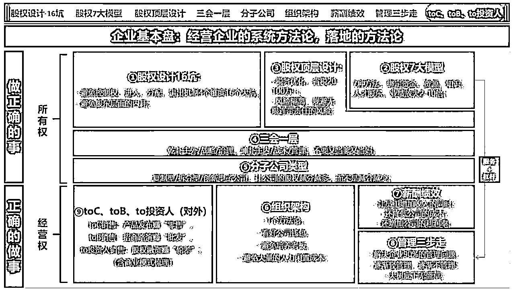

谢无敌老师目前的情况：

（1）她的工作量减少60%+；

（2）直到7月份，闪亮猫传媒主营业务业绩翻3倍；

（3）腾出时间操盘绘素坊新项目，新项目月利润7位数（我也进了这个新项目，争取在年底，一起让新项目月利润翻个3-5倍）

 

 

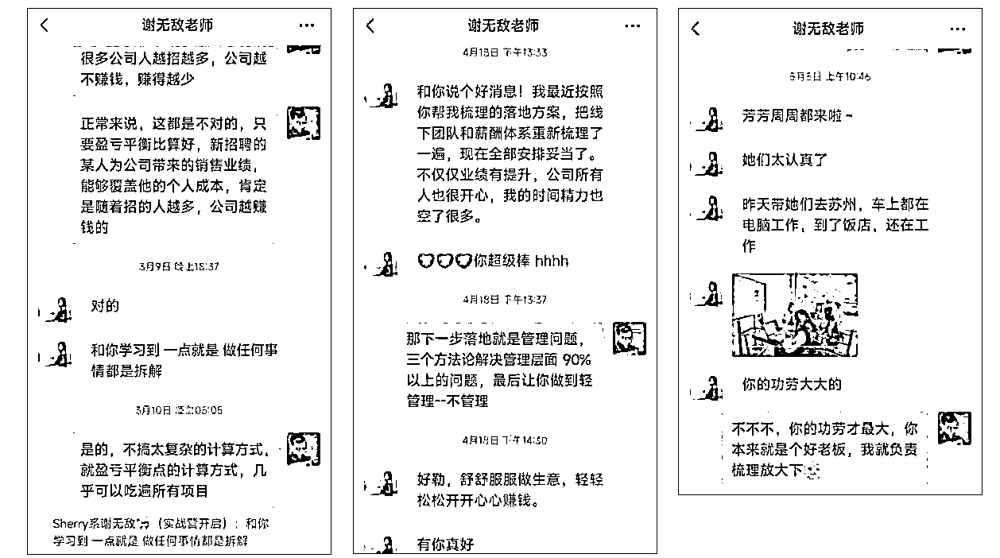 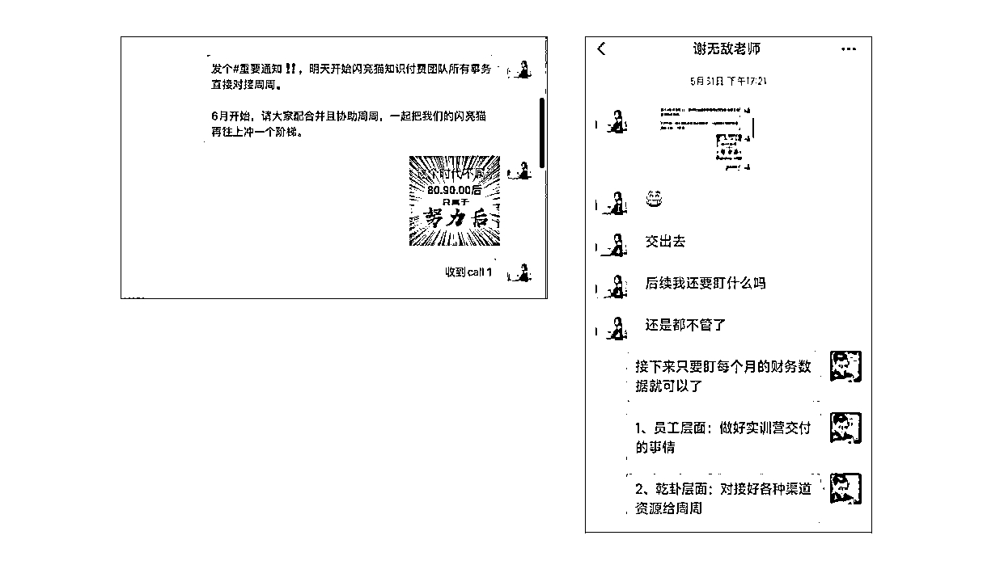

# 一、谢无敌老师想要解决的问题

 

 

今年3月份她找到我，想找我解决的问题，大概是以下3个方面：

1、团队成员很多，她却忙得很；

2、所有事情亲力亲为，团队人极其依赖她；

3、工作环节一旦她不监督，很容易出现问题，业绩增长较慢；

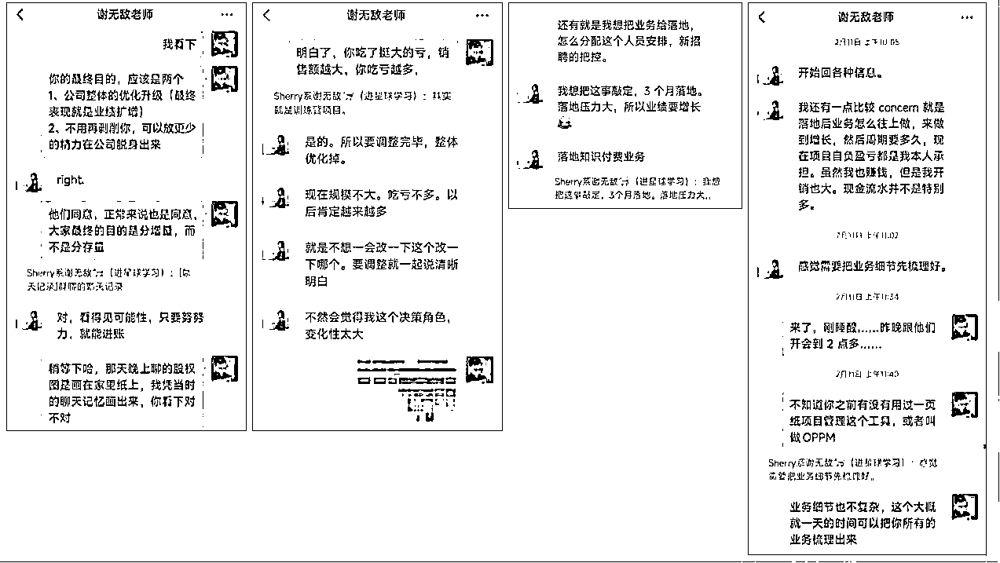

# 二、经营权层面的方法论：组织架构

我帮助谢无敌老师落地交付的时候，她当时主要有2个主营产品（目前已经扩大到4个产品）

产品①：知识星球社群；

产品②：商家实战营课程；

 

 

闪亮猫团队负责这2个板块的团队成员，工作职责有重合，并且是好几个人之间彼此有交叉重合，这种情况下，一来容易吃“大锅饭”，二来责权利不清晰，容易甩锅扯皮，做不到合情合理的论功行赏。

于是我把闪亮猫传媒的组织架构重新进行了拆解，逻辑如下：

# 2.1 看好公司钱包，部门垂直拆解

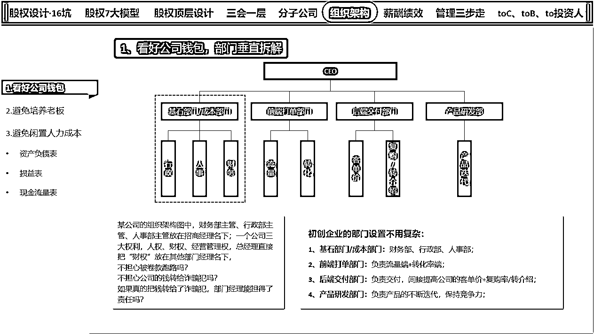

初创企业的部门设置不用复杂：

（1）基石部门/成本部门：财务部、行政部、人事部；

（2）前端部门：负责流量端+转化率端；

（3）后端交付部门：负责交付，间接提高公司的客单价+复购率/转介绍；

（4）产品研发部门：负责产品的不断迭代，保持竞争力；

 

 

闪亮猫知识付费团队被我拆成了3个部门：

部门**①**：前端部门**-**流量，负责去各平台种草获客，不管是小红书、抖音、知乎、视频号、公众号等，考核的是获客数，如每个月目标10000个公域流量导到私域；

部门**②**：前端部门**-**转化率，负责将导流过来的客户成交到知识星球、商家实战营，考核成交率，不管是微信聊天成交、电话语音成交，以收钱为主；

部门**③**：后端交付部门**-**客单价**/**复购**/**转介绍，知识星球/商家实战营的的活动运营、内容运营、培训交付。

优化后，谢无敌老师的身份变成了交付板块的一名员工（不以老板身份/股东身份自居），被安排到做直播交付+答疑+上课等事宜，听CEO的安排，考核的是退费率、投诉率、客户满意度。

被我拆后的3个部门，每个部门的职责清晰，有工作上的重新磨合、协调，但不会再有重叠的工作职责，避免“大锅饭”“扯皮甩锅”。

# 2.2 避免大量的人力闲置成本

 

 

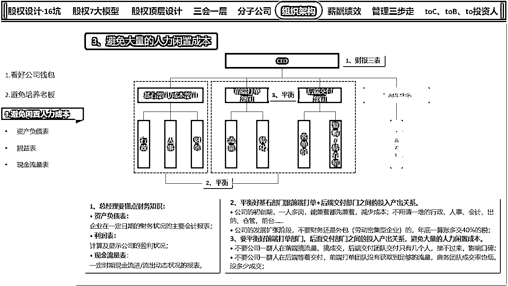

（**1**）总经理要懂点财务知识：

· 资产负债表：企业在一定日期的财务状况的主要会计报表；

· 利润表：计算及显示公司的盈利状况；

· 现金流量表：一定时期现金流进/流出动态状况的报表。

（**2**）平衡好基石部门跟前端**+**后端交付部门之间的投入产出关系。

· 公司的初创期，一人多岗，能兼着都先兼着，减少成本；不用请一堆的行政、人事、会计、出纳、仓管、前台......

· 公司的发展扩张阶段，不要财务还是外包（劳动密集型企业）的，年底一算账多交40%的税；

（**3**）要平衡好前端部门、后面交付部门之间的投入产出关系，避免大量的人力闲置成本。

· 不要公司一群人在前端搞流量、搞成交，后端交付团队交付只有几个人，接不过来，影响口碑；

 

 

· 不要公司一群人在后端等着交付，前端团队没有获取到足够的流量，商务团队成交率也低，没多少成交；

谢无敌老师是特许金融分析师（CFA），财务板块，一点就通。

当下主要平衡好前端部门、后端部门之间的平衡；

如：前端有新的方法论让流量翻倍的时候，及时跟转化部/交付部门沟通，人手是否足够，要及时招人，

如：转化率越来越高的时候，及时跟后端运营交付部门沟通，人手是否足够，要及时招人，

如果你作为**CEO**，得会看财务三大报表：

要知道前端部门跟后端交付部门的工作量是否相对平衡，可以有10-20%的不平衡，也就是大家上班的时候摸摸鱼嘛，

但是不要因不会看财务三大报表，前后端的不平衡有40%以上都不知道，导致的后果要么就是前端一堆流量后端承接不住，浪费了；要么就是前端流量短缺，后端一群人等着交付，最终导致大量的人力闲置成本。

# 三、经营权层面的方法论：薪酬/绩效

 

 

# 3.1 薪酬：

正常来说，不同的部门，会设置不同的薪酬体系，常见的有以下几种：

（1）奖金包；

（2）纯佣提成制/阶梯提成制；

（3）奖金+提成制/纯佣提成制；

公司发展不同阶段、不同部门，有不同的运用场景，常见的运用场景如下：

给闪亮猫前端流量和转化团队、后端交付团队，用的都是底薪**+**奖金包**+**纯佣提成**+**行为指标考核，

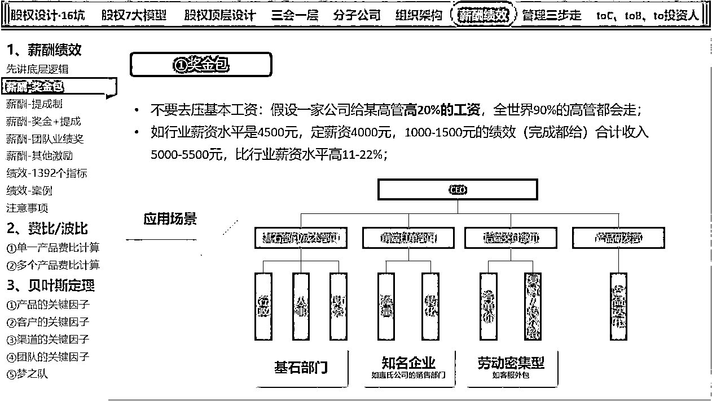

 

 

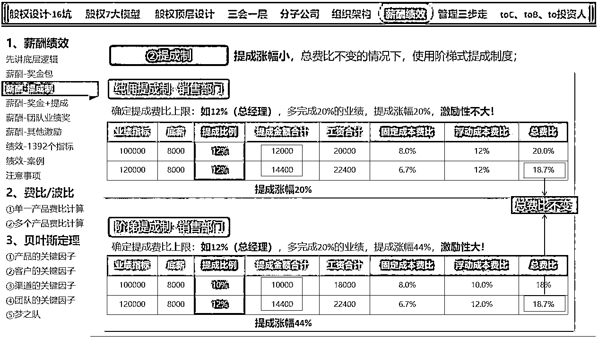 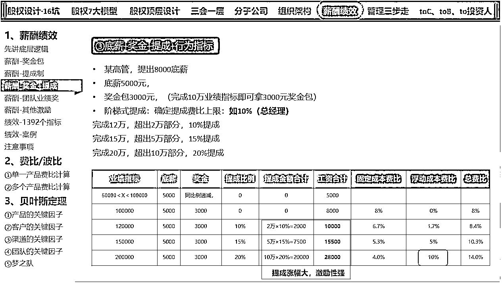

 

 

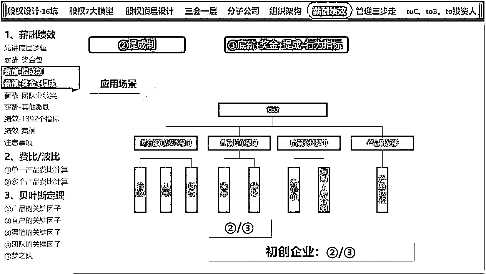

# 3.2 绩效：

至于绩效，因为我有KPI指标库，里面涵盖了各部门的行为指标1392个（有需要的圈友可以找我领取 lnp266）

 

 

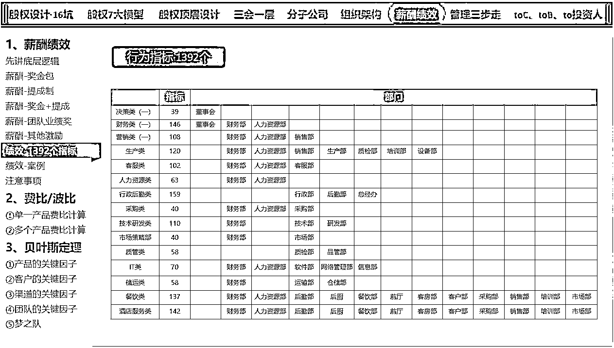

 

 

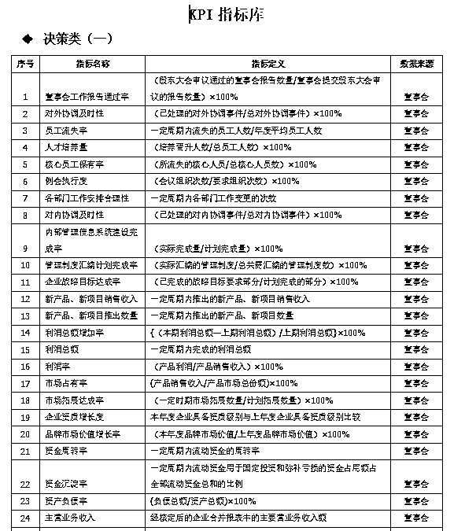 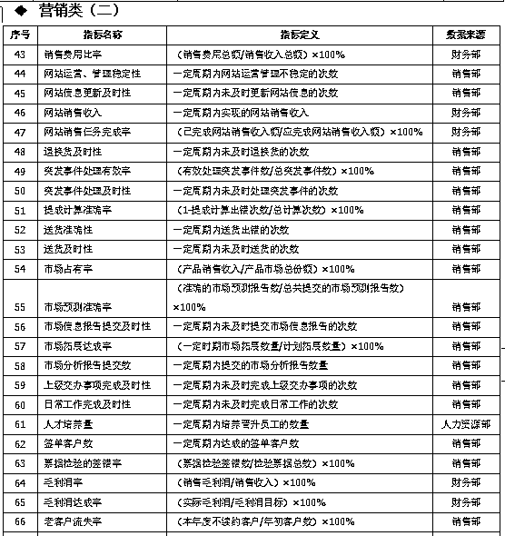

 

 

绩效的底层逻辑目标是多快好省新，主要岗位行为指标举例如下：

我给闪亮猫团队的绩效考核指标，目的就是多快好省新

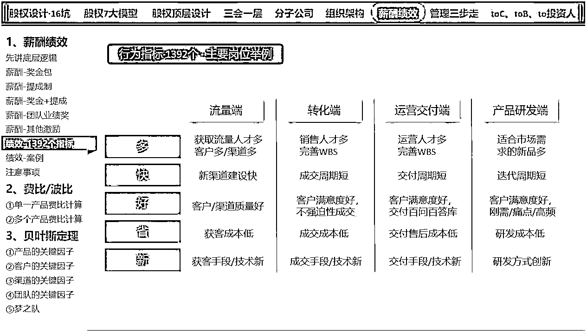

但是要注意以下几个细节：

（1）考核项不要过多，3-7条即可，曾经见过60条考核项的绩效要求；

（2）每个考核项权重，≥10%，小于10%，没太大意义；

（3）钱在哪里，心在哪里，曾见过绩效的50%，是老板的满意度评价，养了一群溜须拍马的员工；

 

 

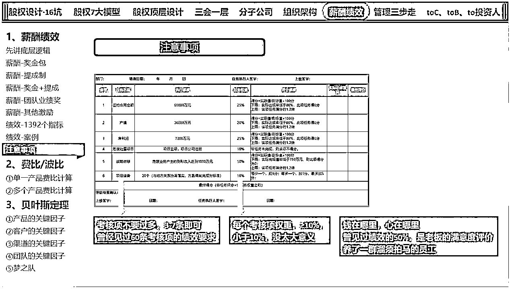

# 3.3 薪酬+绩效，一定是奔着共赢去的

有人说，员工不能拿太高的工资，容易心思多；薪酬绩效就是为克扣员工工资存在的；

公司招聘的人越来越多，公司的利润率越来越低......

在我们这，以上情况是不存在的，薪酬绩效的最终目的，一定是公司员工共赢，而不是博弈。

我们会通过详细的财务测算，测算出公司每个月的盈亏平衡是多少、测出每个部门的盈亏平衡是多少、测出每个员工的盈亏平衡是多少，设定好对应薪酬绩效，大家一起分增量市场。

所以薪酬绩效设置到位，公司招聘的人越来越多，公司的利润率一定越来越高，因为固定成本几乎不变或者为微增，销售额增加，固定成本费比下降，公司利润提增加。

 

 

谢无敌老师的闪亮猫公司，不涉及到这个盈亏平衡的测算。

起盘的新的项目，涉及到盈亏平衡的测算，要确定每个月的销售额达到多少，才能养得起另外一个项目几十人的团队，上海陆家嘴的房租，可不便宜啊。

大概逻辑如下，先测出盈亏平衡点（也叫收支平衡点、损益平衡点、保本销售

量），再测保利（利润率、利润额）销售量。

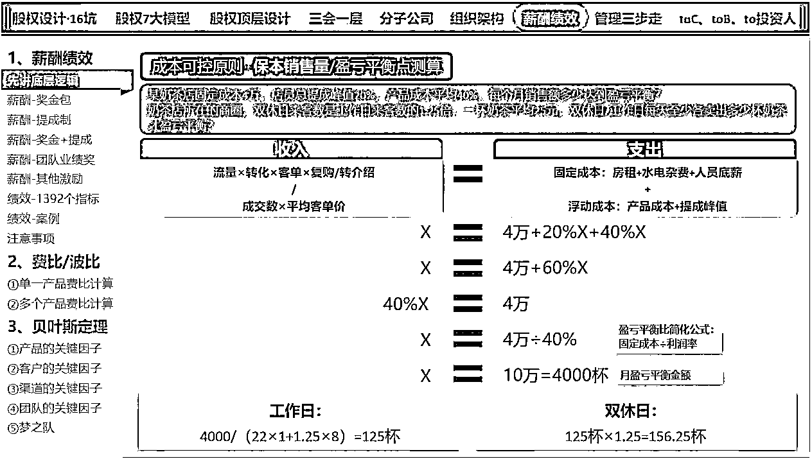

 

 

# 四、经营权层面的方法论：管理三步走

# 4.1 垂直

这个在组织架构板块中讲过了，每个部门只做自己垂直的板块。

好处：垂直人效最高/垂直避免扯皮/团队扩充招聘新人上手快。

 

 

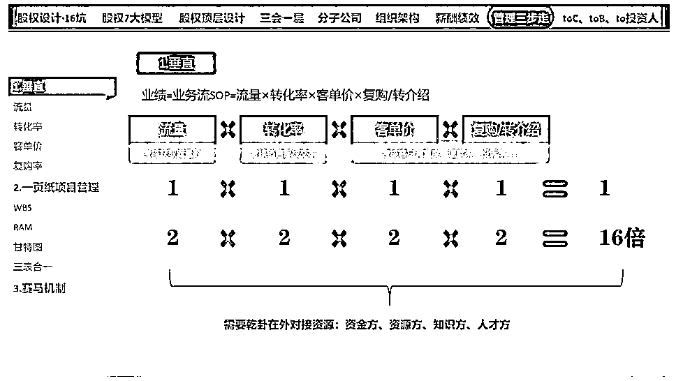

# 4.2一页纸相关管理

之前写过一篇文章，关于一页纸项目管理这个工具的，篇幅太长，就不重复了，有需要的，可以自行查看哈。

链接如下：https://t.zsxq.com/117GcZDrn

 

 

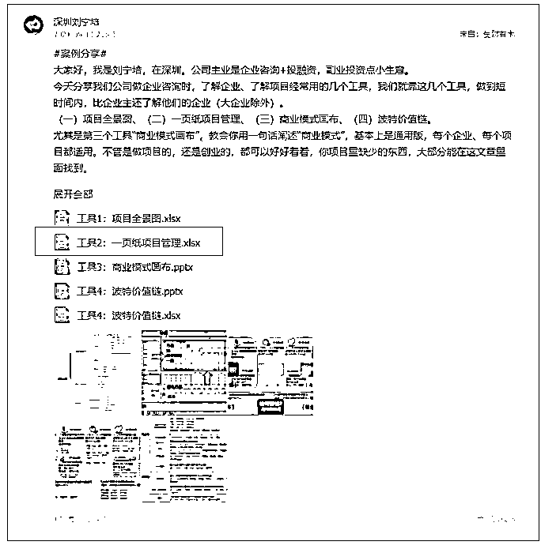

 

 

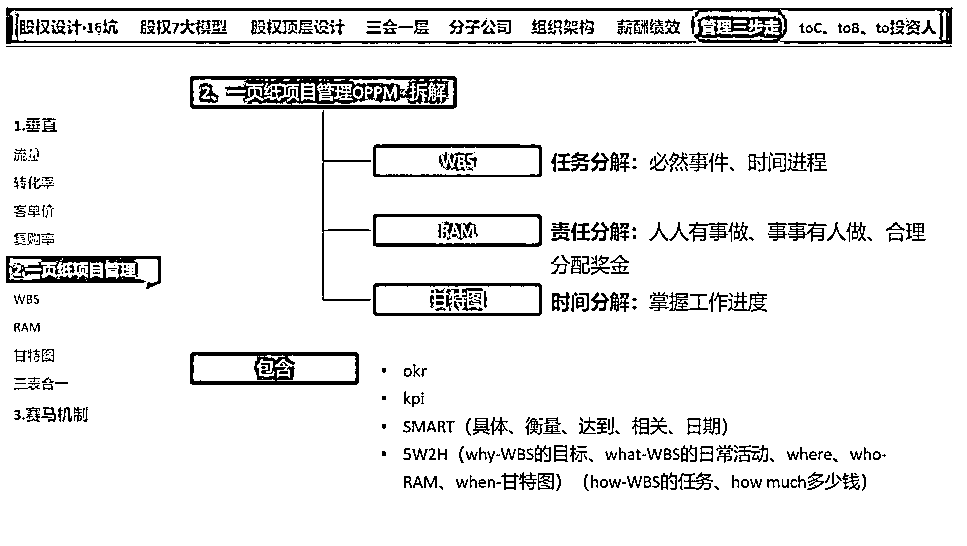

一页纸项目管理，从上到下，三表合一；

将流量部门、转化部门、交付部门要做的必然事件、时间周期、责任人都罗列好，接下来每个月各部门的动作几乎都很固定，落地的时候，将闪亮猫公司的流量部门、转化部门、交付部门会影响业务成败的事件写好，

以后各部门的周会、月会、季度会、年会，就是反复拿出这张表，来讨论这些事件。

随着运营的刷新，事件数量会有增减，但不会有太大的变动，有增减的时候，同步刷新这张表。

表格模板如下：

 

 

 

# 4.3 赛马机制

马云说的很对，大部分人离职，就两个原因，钱没到位，心受委屈了。

 

 

通过合理的薪酬绩效体系，让员工赚得足够多，收入远高于同岗位的人员，让员工“钱到位”，而不是压榨员工；

通过垂直+一页纸项目管理，明确员工的责权利，要做到什么结果，过程路径是什么，让员工“心不受委屈”，而不是让员工今天做这个，明天安排做那个，像无头苍蝇一样一直做无用功。

通过搭建薪酬绩效+管理体系，员工一来钱到位，二来心不受委屈，公司就有资格说一句话，我没亏待任何一个员工，但如果是员工经常犯错又不改错，亏待了公司，那就不好意思了，启动赛马机制，能者上。

# 五、所有权层面的方法论：股权激励

因为谢无敌老师个人的最终定位，不单单是做小红书赛道的知识付费业务。

还有和鹏老师一起经营绘素坊集团的东方风格家居设计。

所以：谢无敌在闪亮猫公司的定位，是执行董事的角色，负责对接外部资源，如资金**/**资源**/**知识**/**人才。所以闪亮猫公司的**CEO**是另一个人，而不是谢无敌老师。

3月25日是生财有术的线下千人大会，前一天，3月24日，我借了亦仁大哥的其中一个办公室，约了闪亮猫的两位股东+未来的CEO。

我跟未来的CEO讲了几件事：

 

 

（1）未来谢无敌、鹏老师等人绘素坊集团的战略规划

（2）未来谢无敌老师在闪亮猫只做执行董事，帮你在外对接你想要的资源，协助你做业绩

（3）你未来做CEO的收入，完成不同业绩，不同的分红比例，到手年薪分别是多少（4）有什么疑惑或者不清楚的，现场随时可以问我

结果，搞定，双赢。

目前闪亮猫CEO的工作态度可比谢无敌老师积极，还也带着团队迁徙到了杭州（暂驻生财有术办公室），整个团队一条心把业绩做大做强。

以上是我今天的分享，希望对你有帮助，如果你也有企业经营难点，欢迎找我聊一聊。

 

 

评论区：

菜菜—-福鼎白茶批发* : [强][强]将来再做团队，🈶  股权架构，员工激励一定找宁老师帮忙设计。逻辑清晰，架构清楚[强]

书情小跟班 : 触及到我知识盲区了，这篇文章值得多看几遍啊

七小 : 宁培哥yyds

嗡嗡嗡起JoyBoy : 宁老师方便➕个好友吗？想了解一下

Sherry💎谢无敌 : 终于可以成为学生了[害羞]在创业路上一直都是学生。

心想事陈 : 刘宁培老师，想链接下你，怎么加你

深圳刘宁培 : OK，lnp266

深圳刘宁培 : ok，lnp266
<!-- split -->
# (精华帖)(140赞)初创企业设立形式及股权架构全分享

作者：  红泥小酒杯

日期：2023-08-11

初创企业设立形式及股权架构全分享 ————架构没搭对，利润全交税

上次分享完《从18线贫困县学生逆袭成为年薪百万的清华卷王 ———— 人人都能学的卷王“大法“》之后，收到了许多生财小伙伴的正反馈，于是和闫君商量还有什么能跟大家分享的，闫君说，写你擅长的领域吧，于是就有了这篇分享。

 

 

大家好，我是刘文怡。清华大学和美国常春藤工商管理双硕士，全国税务高端人才，常年为中税协、东奥、四川/西藏/宁波/安徽等税务局、四川师范大学/西南交通大学/西南财经大学、多家世界500强授课。原税务局公务员，后任多家世界500强集团税务总监，节税上百亿，现任全国排名前四的5A级税务师事务所合伙人，有税务局征管稽查和企业税务管理双重经验。

生财的各位老板应该也会考虑设立公司，对于有创业愿望的老板们来说，公司设立可能是必然选择，但区分有限公司、合伙企业、个体户、股份公司在税务方面的差别并不容易，稍有不慎就架构没搭对，利润全交税。

我曾经在清华和北大都讲过初创企业股权架构，此次分享改编自我在人民邮电出版社出版的《一本书读懂税务税务筹划合规与风险管控（金税四期适用版）》中的内容。旨在为大家扫清创业路上的第一个障碍。无论你是财务大拿还是初入创业，都将受益于这次分享。

全文分为两部分，一是只设立一个主体时的选择，二是设立多个主体的选择。

我会用一个蛋糕店案例和多首打油诗总结每种情况的差异，力求通俗易懂，有趣不迷茫，希望对大家有用。

https://kdocs.cn/l/cvBfeemTjOfy https://wugz3cl7dd.feishu.cn/docx/V5JpdhySsoIJirxcw4DcKkOInhg

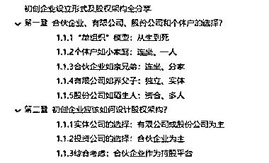

 

 

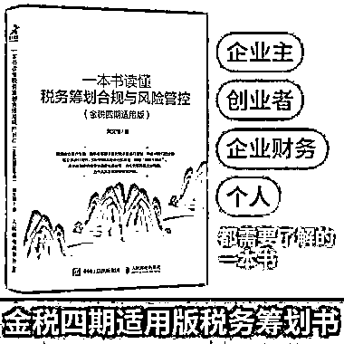

 

 

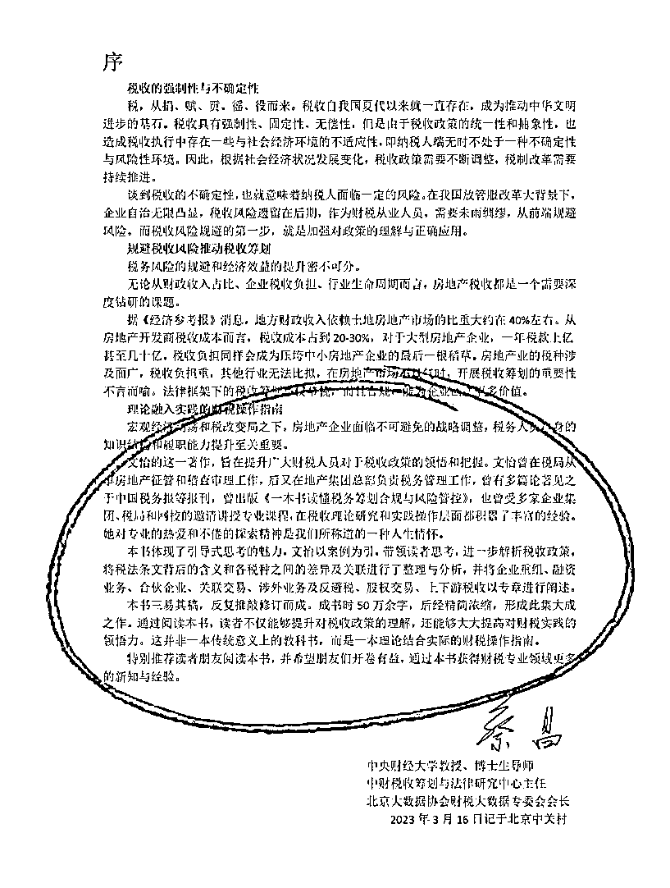

评论区：

 

 

闫君 : 越分享越幸运[胜利]非常棒的股权架构避税指南，对于想创业和正在创业的老板都非常有帮助，感谢文怡的真诚分享。

红泥小酒杯 : 谢谢！

马时珍 : 棒 

书豪 : 棒

铃铛 : 很清晰明了

Aimmon : 已购

芷蓝 : 现在1人公司越来越多了

生财小苗哥 : 合伙人，选择太难，股权不清楚，后期扯皮太多！收藏反复看！
<!-- split -->
# (精华帖)(127赞)初始公司，股权设计的「四步走」

作者：  深圳刘宁培

日期：2022-07-08

哈喽，我叫刘宁培，长期在深圳，龙凤胎奶爸，哈哈。

主业企业咨询：股权、企业经营管理、商业模式板块。

生财有术第二期付费至今的会员，最近忙着带娃，才空出时间写文章。

[西瓜]一、企业在创业期：股权设计看下文

1、先讲讲合作这件事

合作，普遍分为以下5种，以下5种合作方式，合作方需要投入的金钱、时间、精力等各项成本由浅到深。

（1）一次性合作：支付佣金、采购、租赁；

这种合作常见，尤其像北上广深这搞钱的城市，谁不是身兼多职。

支付佣金：A公司有某产品或者某服务，我给A公司介绍客户，A公司通过产品实力/服务实力成交客户，客户全款结清后，A公司支付给我事先约定好的佣金；

采购：根据需求批量采购物料，如采购办公用品、电脑、文具等；

租赁：租赁办公室付租金，租赁共享单车、租赁充电宝付租金等；

 

 

（2）非核心职能合作：外包、贴牌；

外包：公司为了节省成本，将非公司核心职能的业务，外包给别的公司合作以降低成本，一般有多个备选合作公司，如劳务外包、客服外包、美工外包等；

贴牌：公司为了节省产品生产成本（自己建厂、组建生产线、开模、招人成本太高），找相对完善的产品供应链，进行贴牌生产合作（代工生产、委托生产、委托加工）。在第二产业的制造业居多，各个工厂完成某产品其中一部分的组装件；美业中贴牌的也多，像各种面膜、医用冷敷贴的源头工厂多在广州增城、佛山等地。

（3）核心职能合作：代理、加盟；

代理：商业1.0到商业2.0阶段，多出现在传统行业的的供应链环节，也就是各地代理商、经销商角色；品牌商搞定技术、产品生产，把货出给全国各地的代理商、经销商。比较大的品牌代理会细分到县级经销商，知名度一般的，一般到市级代理经销商；因为经销代理协议是几年一签约，所以大品牌商对代理商、加盟商的筛选会很重视，尤其一二线城市的代理商、经销商，轻易不换，算比较深度的合作，品牌商给代理商经销商做品牌、给差价，代理经销给品牌做渠道、做售后，双方之间互惠互利；

加盟：大大小小的品牌全国各地放开加盟，如美业、餐饮业、房地产行业等等。品牌方向加盟商门店输出：产品、品牌、营销、运营、管理、工具等方法论，一般赚3笔钱，加盟费、品牌费（管理费）、供应链差价（门店月销售额的资金沉淀），会筛选加盟商的精力投入、落地执行力，也会有品牌商运营督导做市场维护；加盟商会筛选品牌的投入金额、盈利方式、回本周期，当然，最重要的是筛选品牌是不是在割韭菜。

（4）项目制深度合作，共同开发；

利润大、回款慢的工程项目居多；

一方负责整个工程项目的洽谈、项目的签约、资金的回款率，

一方负责资金的调派、及时到位、较长周期的资金垫付，

这种项目：时间周期较长、双方都要把公司的关键人员匹配到位。

（5）股权合作：合资公司；

志同道合、能力互补、资源互补的几人，一起成立公司，按股权比例享受公司的分红。

志同道合：大家都觉得这个赛道好、项目好，能赚到钱，一起长时间的投入，时间一般不低于3年（多少公司合作不到半年就拆伙了）。

能力互补：你擅长公司战略制定、顶层设计，他擅长销售成交，我擅长落地运营，各自能力互补，能快速让公司赚钱（尽量能力互补，若不能互补，缺乏的板块是在市场上可以招聘到的）。

 

 

资源互补：企业性质不同，需要的资源不尽相同，如资金资源、品牌资源、技术资源、渠道资源等等。

第五种合作方式，股权合作合资公司，是堪比“一起步进婚姻殿堂”级别最深的合作。

找我们咨询股权顶层架构、股权比例如何设置的客户，因为他们不是志同道合、不是能力互补、资源不互补等原因，不能起到1+1＞2的效果，大概有30%左右的客户群体，都被我们劝退了，没必要成立公司合作，也没必要花多少钱去购买某公司的多少股权，用另外4种合作方式就可以了。

（生财圈子里，被我劝退的预计有20多个，没必要投资30万、100万、300万去买某公司的股权成为股东，也没必要因为哥们义气原因，把别人拉近公司做股东。股东，是要来公司为利润做贡献的，很多股东，甚至是累赘。）

2、初创公司股权16坑。

之前在生财分享过两篇初创股权设计的文章，有兴趣看链接，不重复写了。

链接1：

链接2：、

之前广州见面会分享的文件：初创公司，股权设计的“四步走”-生财有术广州见面会分享  见面会分享时间有限，常见的股权16坑没时间分享，在这里补充：

（1）控制权角度：

①平均主义、股权均分、雨露均沾；

2个人的股权比例是50%、50%，

3个人的股权比例是33%、33%、34%、

4个人的股权比例是25%、25%、25%、25%.....

缺点：公司没有话事人。

芝麻绿豆点的小事，大家都要开会来讨论下；

负责成交的股东，说要前端销售给高提成，才对销售更有激励；负责落地的股东，说要后端落地给高提成，才能给公司带来口碑跟转介绍；公说公有理，婆说婆有理，没有人能绝对的拍板，没有拍板，就没有执行，还没开始对外扩张市场呢，内部分配方面先出问题了；

②股权过度稀释

缺点：后期容易失去控制权。

创业之初，创始人前期不要把股权稀释过大。初创期，创始人最好占比67%以上，发展期占比52%以上，扩张期占比35%以上，如果不懂股权定层规划，没有提前用有限合伙 

 

企业架构、金字塔架构、一致行动人、投票权委托等方法把控公司的控制权，再接下来第二轮、第三轮的股权稀释，剩余股权比例越来越低，最严重后果就是被踢出局。

③大股东被小股东绑架；

如股东人数是3人，任何2人的股权比例之和都大于第三人，1+2＞3

这种股权比例，也是公司没有话事人，没人做主；

最经典的案例就是49%、49%、2%，两个大股东都被2%股权的人牵着走；

④员工直接持股；

缺点：退出变更费时费力

初创企业，不建议做股权激励，没有意义，轻则被员工吐槽画饼、职场PUA，重则隔天员工离职。即使有员工认可公司未来的发展，股权激励用虚拟股形式、代持的形式、期权池预留形式、有限合伙企业做LP形式等形式，间接持有公司股权，不要到工商变更直接持有公司股权。免得员工没完成业绩退股、或者员工离职退股，要去工商办理一堆的手续。

（2）进入机制角度：

⑤前期资源占股；

没任职、没出钱、没技术专利，提出用资源来换股权，如果他敢签对赌协议约定多长时间内给公司带来多少利润，完成了，再给股权；如果不敢签对赌协议，就要占股，有多远滚多远。见不得这种便宜占不尽的人。

这种有资源的人，说得好听会资源整合，说得不好听，就是个二道贩子。

⑥兼职创业占股；

创业成功是个小概率事件，说九死一生也不为过，多少创始人呕心沥血吃睡在公司，都不一定能保证创业成功，一直存活下去；在创业公司里面兼职，还想拿公司股权，不是耍流氓吗！我们接过最夸张的案子是一个公司里面6个初创股东，只有两个人是全职的，另外四个人都是兼职的，其中一个兼职的人身上挂着七八个项目，天天东奔西走到处飞。

⑦老板想给，员工不想要；

公司渐渐赚钱了，提出做股权激励，给核心员工股权；员工说不要。

员工不知道股权有何用、意义何在。

员工不知道股权在未来每年能给到带来多少分红。

员工不知道股权在未来十年八年能带来多少溢价。

员工不知道股权什么时候行权、什么时候可以卖出套现。

 

 

⑧股权白送员工；

老板很大方，有格局，为了稳定人心，真心想给员工股权，也知道股权最后的价值，提出股权白送给员工，不需要员工出任何资金购买，但是，员工跟老板所处的维度跟思考方式不一样。员工甚至还会反问老板：公司的注册资金是实缴还是认缴？如果产生债务，是否需要承担？

（3）分配机制角度

⑨按出资额分配；

出钱占大股，资金型驱动的企业可以按照出资额分配。

资源型驱动的企业、人才驱动型的企业、技术驱动型的企业，慎重按出资额分配。

很多案例是这样的：出钱多的人占大股，对公司的利润没有多大的贡献，每年年底分走公司最多的钱，实际操盘人前期因资金压力出资少，但对公司利润贡献多，却分走少部分的分红。

案例结果是这样的：操盘人偷偷在外成立一家一样业务体系的公司，不断将公司现有业务转移，利润转移，后面出资人发现了，就是对簿公堂打官司，两败俱伤。

⑩天使投资占大股；

资金型驱动的企业可以，资源型驱动的企业、人才驱动型的企业、技术驱动型的企业慎重。

理由同上：另起炉找——业务转移——利润做空——对簿公堂——两败俱伤

⑪股权一股独大；

股权比例如下：90%：10%、95%：5%、99%：1%。

传统制造业中，大部分公司都是这种股权比例，都是家族企业为主，甚至是100%控股，无可厚非。但是已确定好几个人要合伙做这个项目了，这种股权比例，没有激励，没有激情，小股东的激情可能就是员工高管的激情。

⑫不知道怎么分；

分多了，赚了？分少了，亏了？这个话题内容比较大，放在下一个环节。

90%以上的初创企业会碰到的问题，经营权（员工）、所有权（股东）混为一谈。

（4）退出机制角度；

⑬人走股走；

公司成立时没约定好退出机制。初创股东因各种原因离开公司，但是没有退股，保留着公司的股权。

一般两个结果：

 

 

（结果一）公司赚钱分红，每年要给离开的股东分红，后期找到可以代替离开股东的人才时，没有更多的股权可以稀释了；后期资金要进入时，看到走的人还不断分红，一般会要求公司先解决这种历史遗留问题；（结果二）公司亏钱负债，离开的股东要承担承担债务风险；

⑭创始人淡出运营不退股；

公司成立时没约定好退出机制。

创始人不参与公司运营，跑去一个更好的赛道上发展，如果对公司贡献最大的创始人都慢慢退出了不干，还不退股，未来的高管股权激励、资金进入方面，只会越来越难，或者是每年保持利润不变。这种情况下，其他有激情打算继续在这个赛道做的小股东，会想办法另起炉灶。

⑮退股回购价格无约定；

每个人对股权价格都有自己的认知。不管是按照市盈率估值、市销率估值、净资产估值等，大家提前约定好退出回购价的计算方式。江湖再见，还是朋友，一来还是很多合作机会的。我们见过最奇葩的就是，大股东派人殴打小股东要求退股，刷新三观。

⑯竞争对手持有公司股份；

公司成立时没有约定好股东的优先购买权。不管是哪个股东退股，公司的现有股东是有优先购买权的，如果没约定好，股权落到竞争对手手上，竞争对手想要整垮你，方法很多。

3、90%以上的初创企业会碰到的问题，经营权（员工）、所有权（股东）混为一谈  问题如下：

三个合伙，ABC出资相同，AB都不参与经营和工作，该怎么分配股份和工资？

三人合伙开店，一人只出钱不出力，二人出钱又出力，请问怎么分股？

四人合伙开店，四人出资一样多，两人经营店铺，两人不参与店铺经营只出资，经营收入该怎么分？

跟朋友合伙开饭店，我出15万朋友出10万，他在店里管理工资定的1.1万，股权如何分配?

三人合伙，一人出全资偶尔出力，两人全职出力不出资，怎么分配股权比较合理？

请问三人合伙做音乐餐吧，我和一人出资各50万全职出力，另一人出资100万不出力。

股份三人平分是否公平？

100万元的店，2人各占一半股，A只持股份，B持一半股份还加管理技术，怎么分红? 和朋友合伙开服装店，资金各出一半，他负责店铺管理，我偶尔帮忙，请问股份如何分配合适? 四六分呢?

 

 

两个人合伙创业，一个人出资不管事，另一个人出资又出力，股权该怎么分？

三人合伙开餐饮店，都全职参与店铺经营，出资比重为57%:28%:15%，这种情况下，如何分红才公平？

......

以上这类的问题，6个字解决“先员工，后股东“。

顺便讲下企业经营管理的基本概念：

几个志同道合、能力互补、资源互补的人一起成立公司，做某个项目；做好公司一年0收入的资金储备，不要因为资金链断裂公司倒闭；画好公司基本的组织架构图，在组织架构图上定岗位职责、每个岗位定薪资待遇（含提成）；

公司年利润=公司年收入-年支出（图1所示），

切记：股东享受的分红是公司的年利润（图1标蓝部分）；

如果A即是公司的股东，又是公司的员工，切记，先是员工，后是股东。

A的第一层身份先是员工，先是按照公司的岗位职责完成公司的要求，正常领取底薪+提成，如果A不能完成公司的要求，是不能继续在岗位上任职的，等着年底分红就行；

A的第二层身份才是股东，公司年收入-年支出，剩余的利润，按照股权比例分红。

很多案例就是这样子：ABC三人，一人负责产品，一人负责销售，一人负责运营，公司赚钱之后，每个人都说自己所在的岗位对公司贡献有多大，要分多点股权。

这是两件事情。股权是公司创立之初就确定好的，项目该怎么分红就怎么分红，提成该怎么拿就怎么拿。如果是新项目还好说，可以重新成立公司或者成立事业部单独核算的方式进行分红。如果是老项目  ，因为赚钱了，都觉得自己贡献多分红少，只能说吃相都很难看。

讲1个朋友的案例。

朋友L，跟M两个人，在惠州淡水开了一家苏宁易购；

两人关系好，哥们义气，一起出钱付加盟费、买样机、租店铺付租金；一起全天在店里面上班销售；都约定不拿薪水，每个月的收入减去产品成本、房租水电，剩余利润五五分；

前面做得挺好的，到第9个月的时候，L来跟我诉苦，现在门店90%的业绩都是由他贡献的，M越来越懒，对门店的业绩贡献只有10%了，觉得很不公平，做得多，分的一样多，想拆伙了，这样子还不如自己做。

 

 

这就是明显把所有权、跟经营权混为一谈了。

如果一开始就约定好不同的电器的提成比例。谁销售的产品，第一层身份先是员工，先按照员工的身份拿走对应的提成，剩余的月利润再是股东的身份五五分。

切记：先员工，后股东；如果员工的岗位职责不能完成，就不要在公司任职当员工。很多初创企业都是把经营权（员工）跟所有权（股东）混为一谈，最后都分配不均，草率收场。

[西瓜]二、企业在发展期：要给员工做股权激励的看下文

1、为什么要做股权激励？

初创股东们，要把时间精力放在投入产出更高的地方。项目0-1跑通了，去掉所有成本，赚钱了，接下来考虑的是放大，1-10，10-100的阶段；

创业期，0-1的阶段，股东们亲力亲为将所有环节跑通，忙的时候一起熬夜打包发货都是常态，但是进入到1-10的发展期复制阶段，初创股东再去做打包发货的杂事，时间就会变得廉价，东西全部交给别人做不放心，怎么办？

培养第二梯队的股东，让这些核心高管成为“老板”，让他们为自己打工；

如：

互联网项目：知乎带货、抖音短视频带货等，跑通第一个账号，就同步启动第二个、第三个项目账号.....第100个账号.....

实体项目：开一家理发店、美容店赚钱了，接下来到另外一个客户属性相同的地方开店，把之前跑通的事情重新做一遍.....

第二梯队如下图中的管理层：（图2所示）

这是我们给一家深圳电商公司做的组织架构图，第二梯队的股东就是中间的管理层。稀释的股权比例是20%，财务部主管跟行政人事主管的股权比例各3%，运营经理的股权比例是8%，生产部的股权比例是6%；

2、为什么股权激励有用？

股权激励="钱"，所以股权激励有用。

无论是股权激励，还是积分卡、KPI绩效、OKR、阿米巴、事业部单独核算，说到底就是合理的分钱、合理的刺激；上班族做副业是为了搞钱，有资源的人创业是为了搞钱，在一家稳定发展的公司，想办法拿到公司的股权带来的分红，也是为了搞钱；

 

 

（1）看短期：分红权；

每年分红，能看到每年增加到手的收入是多少。

假如该深圳某电商公司年利润是500万，A是运营经理，有公司8%的分红，正常薪资水平是年薪24万，分红是40万，合计税前年薪是64万。

如果竞争对手开30万、40万想要挖走运营经理，不可能。即使竞争对手给出的薪资超过64万*1.2倍=76.8万，运营经理也不会冒险离开，毕竟公司明年的利润可能做到600万，到手的综合收入更高，而且去到另外一家公司也有被卸磨杀驴的可能。

（2）看长期：股权增值权；

公司走到最后，一般是4条路径。

第一条，经营不善，倒闭；

第二条，赚钱，利润可以，不会被时代淘汰，家族传承继续做，继续赚钱；

第三条，被收购，被资本看好公司的业务发展或者是财务流水，想要合并财报做上市筹划，可以按行业的市盈率收购，被收购时手里的股权可以交易套现，十倍溢价；

第四条，公司做大做强，走上市路径，几年后套现，百倍溢价；

如果A通过对公司的利润贡献，得到公司的股权，这个公司做大做强，走的是第三条、第四条路径，手中的股权很值钱，很香的；

不管是看长期还是短期，不谈使命愿景价值观的前提下，咱都是为了钱打工，马老师说的很对，辞职就两个理由，要么钱没到位，要么心受委屈了；大部分，还是钱没到位。

有客户问我们怎么更好地管理95后、00后......好家伙，我也想知道，除了不给他们更多的钱，还有什么方法可以管理这群嗨点、泪点比较高的、动不动就辞职的95后、00后。

3、股权激励12步骤；

进入机制层面：

（1）定目标：分存量利润、分增量利润；

①分存量利润；

老板有新项目要启动，只有20%的精力放在原项目上，不想操心太多，又不想公司高管被挖走导致利润下滑，拿出公司的利润分给核心高管。

项目年利润500万，明年的年利润目标还是500万，跟高管们约定，明年继续做到500万的利润目标，会拿出20%的利润进行分红，也就是100万。假如共有5个高管，则人均年收入增加20万，竞争对手想要挖人，就要在正常行业薪资水平上+20万挖人，或者配股权。

 

 

悦刻案例：

这里讲一个案例，熟悉我的圈友知道我喜欢找被动收入的项目，像纯托管的优剪，项目稳定不用被割韭菜，今年发现了另一个项目“RELX悦刻”，认识了悦刻公司的朋友，也认识了一些深圳店老板，了解后发现门店坪效是“优剪”的三倍，心痒痒的，不过现在不能开，要等到10月1日之后。

认识其中一个老板，在广东区域开了12家店，每家店每个月贡献8000-10000左右的利润。

他的分红方案如下：

门店收入：员工每天收款，员工也看得到，门店支出：房租水电杂费、产品成本、员工底薪（几乎都是2500-3000左右的底薪）

利润=门店收入-门店支出，利润跟员工五五分成，这种分红机制，每个员工都拼命做，遇到门店没货催老板订货，遇到消费者砍价尽量不给优惠送礼品，很多事情都不需要老板操心。

这种分红方式，员工拥有了门店50%的分红权，

而很多其他门店用的就是阶梯式提成的方式，固定底薪4000左右，完成3万业绩提成3%，完成5万业绩提成5%之类的。不同的分红方式，同样做5万业绩，员工到手收入差一倍。积极性差不别不言而喻。

②分增量利润；

原公司项目利润500万，跟高管约定，明年超出500万利润部分，46分、37分、28分等；另外一种是减少式分配机制，生鲜行业的损耗高达30%，永辉超市生鲜的损耗只有5%，方法论就是把减少损失的损耗部分，按照不同的职级（经理、主管、店员等）进行分配。

（2）定时间；

确定考核开始时间、考核结束时间，分红发放时间、取得股权与行权的时间。

尤其高管在意的是分红发放时间，不要拖，及时激励。

如美业行业是轻资产行业，他们的分红时间可以做到1季度1分，甚至是每个月分。

（3）定价格；

0元出资：无需员工出资，在职满多少年（忠诚度），完成了岗位职责内的所有任务，没有大错；

折扣价出资：不交钱不交心，白得不珍惜，让员工按照市场价的几折认购，小米最初的股权激励就有三种方式：全额工资+少量股份、一半工资+一般的股份、少量的工资+较 

 

多的股份；

市场价出资：按照双方约定好的价格出资，计算方法有很多种，一般都是加倍买；

（4）定权利；

实股：分权分利润，工商注册的实股，一般对象是资本（土豆协议，保护投资人，避免离婚分权）

虚拟股/干股/分红股：分利润不分权，没有管理公司的决策权，对象是高管为主；用的较多是vesting逐年成熟的方式。

分配机制层面

（5）定来源；

来源：创始人、联合创始人

（6）定稀释方法；

方法一：；同比例稀释，如创始股东的股权比例是60%：30%：10%，约定同比例稀释20%的股权给到高管，

股权比例变成60%×80%：30%×80%：10%×80%：20%，即48%：24%：8%：20%；

方法二：无中生有法：，如创始股东的股权比例是60%：30%：10%，约定在100股的基础上增加20股给到高管们，公司的原股本是100股，增加20股，也就是120股  股权比例变成60%÷120%：30%÷120%：10%÷120%：20%÷120%，即50%：25%：

8.3%：16.7%。

股权顶层设计一开始就做好布局的，用同比例稀释的方法；

公司是人力驱动型公司，不断有同领域的人才加入公司，让公司越做越大的，用无中生有法；

（7）定数量；

顶层是控制权，基层是激励权。

激励比例要确保维护企业的控制权、激励对象能够真实地感受到激励。

企业的控制权：释放给员工的股权激励额度尽量低于总股权的1/3。

感受到激励：为什么一直强调企业处于初创期，来年能不能存活下去都是个未知数的时候，不要做什么股权激励，因为没有激励性，没有作用效果。

公司年利润50万，拿出20%出来分，也就是10万，10万还要分给5个人，人均2万块=月工资增加1666元，真不如直接加底薪来得激励。

除非你有把握公司的利润未来几年有指数型的增长，并且员工也知道有这个增长。

讲下龙珠圈友的案例。（图3所示）

 

 

项目成立的时间是2020年4月份，整个团队刚尝试抖音直播带货。

零售三要素，人货场，

人：长得好看口才好的主播，对公司忠诚度高最好了；

货：物美、价廉、交付快、可账期的供应链资源；

场：线上，抖音直播，抖音直播运营玩法要熟练；

团队开始，各种摸索试错烧钱，此时跟员工说投钱来认购股权，股权以后很值钱的，员工跑得比兔子快。但当你第一个账号跑通了，整个项目已经摸索成功时，有数据说话，再跟员工谈股权，醒目的员工懂得公司未来走矩阵玩法，股权未来会出高于市场价，想办法要多点股权。

假如这时候花100万购买公司10%的股权，公司2021年同步操盘了另外四个账号，加上最初的账号  ，做到了月销售额980万。如果2022年，每月稳定在1000万左右，年销售额在1.2亿左右，去掉所有成本，净利润15%，年利润1800万，10%的税前分红就是180万。一年就回本了，股权值钱。

当看到公司年利润1800万的时候，再说花100万买10%的股权，那就是异想天开了。

所以：除非把握公司利润在未来几年有指数型的增长，且员工知道有这个增长。那在盈利初期就可以做股权激励，不管是运营牛人、美女主播、上游供应商，股权绑定，竞业协议一签，以后就在这家公司好好干。一起赚钱，一起分钱。

（8）定对象；

①内部：管理层高管、核心员工。

核心员工也参与的原因是，如果高管真的被竞争对手挖走了，核心员工可以快速顶上，不会出现业务真空期。

②外部：上下游合作伙伴、资本；（根据不同的谈判情况，定虚拟股、实股）

（9）定模式；

以下内容较为复杂，有个简单概念就行，不具体展开。

①创业期：虚拟股激励（干股/分红股（在职分红，在职期间享有)，增值权；）、业绩股激励、超额利润激励法；

②发展期：实股激励、虚拟股的超额分红+在职分红+少量实股（注册股）股权激励；

③扩张期：实股激励、（内部创业股激励）、金色降落伞股权激励（老员工）、虚拟股激励、（岗位股权，做到这个职位，就给）、知识股（合理评价，双方利益）；

 

 

股权，是个分钱的工具，也是整合资源的工具。（图4所示）

希望大家把股权工具运用好，将公司做大做强，一起有格局的分钱。而不是像某公司一样批量割韭菜，某火锅店的某明星，大家感兴趣的话，可以去查下持股51%的四川至膳，名下有谭鸭血、贤合庄、  烧江南、黄鱼先生、天然呆奶茶店、炊二哥、灶门砍、娃三.....

退出机制层面

（10）定退出时间；

约定多长时间内不能退出，避免套现。

（11）定回购价；

人走股留，对彼此都好，约定好回购价跟初创股东的优先购买权。

退出机制，是共赢，不是博弈。江湖再见，还是朋友，还有很多合作的机会。

（12）定合同；

白纸黑字，不要口头协议。

写在最后：

股权顶层设计的问题找我（没上市规划的），1小时解决。

需要上门落地股权方案的也可以找我，1个月内解决。

https://t.zsxq.com/fyNbAuR https://t.zsxq.com/UBqVvjU https://t.zsxq.com/27eqV7A

 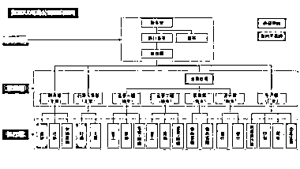

 

 

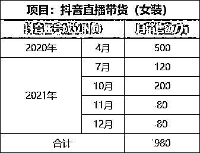 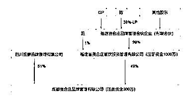

评论区：

吴一村 : 太适合初创的圈友了，点赞，受用[强][强][强]

乐天 : 想啥来啥～生财真是百宝箱～感谢圈友分享～

一时 : 这个太宝贵了，避免了很多坑

宝哥~ : 厉害了  ，  宝宝需要喝奶粉可以联系我呀  ，我这边做批发的

书仔 : 哈哈哈，每个股权的书都是一样的内容

深圳刘宁培 : 刚把四张图片跟广州见面会的文件上传，看过的圈友，可以再看一遍。[得意]

设计师小元哥 : 目前四人技术团队，每个人都是25%股份分，然后确实存在执行力不够的现象！[流泪]

深圳刘宁培 : 如果你们都意识到这个问题的话，可以解决。而且要尽早解决，赚小钱还好，越做越大的时候，公说公有理，婆说婆有理。

 

 
<!-- split -->
# (精华帖)(123赞)草根创业中的股权坑

作者：  亦仁

日期：2019-09-16

对于想创业还没创业的人，今天这篇分享很值钱，仔细看，都是钱砸出来的经验。

对于已经创业的人，也建议再看看，10分钟的时间，可能就避免了一个坑。

听过很多道理，仍然过不好这一生，这可能是给你讲道理的人离的比较远，但是如果他就是你身边的圈友，这个道理听了大概率会有用的。

本次分享主题：草根创业中的股权坑，分享者  ，请大家欢迎👏

以下是本次分享。

各位财友好，收到亦仁大大的邀请，真的诚惶诚恐。

先简单自我介绍一下。大家可以叫我Richard，或者颜过。

可能跟大多数普通人一样，是不折不扣的草根创业者。从08年开始，就一直浪迹在外贸电商（后来李总理取了个高大上的名字：跨境电商）这个行当，经历过独立站，ebay/wish,亚马逊，独立站/shopify，基本热门平台都涉猎过。最近一个亚马逊项目，小家电，10个月由0干到2000万人民币，2年半时间累积销售额超过1个亿。

前前后后5次合伙或者创业。当然这里面的坑就不少，今天主要是想跟大家分享一下我之前经历的股权（分红）合作当中的坑（还有其它的坑）。希望对大家有用。

一，A,第1次创业是11年，婚纱礼服独立站，跟大学同学X，我占51%（资金，营销，供应链等等都我来搞），X占49%（只管技术）。而且我还全职不拿工资干活，X是一直在上班（到散伙）。还好后面大家好聚好散。

B坑：散伙直接原因是因为流量成本急剧上升。就是不怎么赚钱了。其实后来才想明白，上面只是其中一个原因。

还有例如下面的原因：经营权（即我应该拿工资）和股权要分开。此时股权分配，只是凭着感觉分配而已，并没有考虑到大家各自投入的时间，财产，包括创业心态（这是合伙中最忌讳的，还没有把自己的心态摆正，打工的心态和创业的心态是完全不一样的）。

 

 

另外两个人虽然能各司其职，但没有太长的时间完全在一起办公，导致沟通上出现问题。错过了流量红利期。

二，A，第1次创业散伙后，我单干。这回，分红10%+高工资招募了我前同事H。H主要负责google广告投放，能力是不用怀疑的。但最后还是请出公司了。

B坑：这里犯的错是，对于创业公司赢亏平衡点还没有算好，盲目扩大，还不给考核目标。即公司账没有算得清。对于分红比例，可以先谈好预期，给定目标，逐步释放出来，例如10%，可以分2年或者3年来，前期4%，中期3%，后期3%，这样对于公司财务压力不能那么大，另外也能跟有能力之人同时成长，大家共担风险。

三，A，为了补充现金投入，公司引入两块资金，都是来自于亲戚（L和W），L年纪长我10岁左右，传统行业的老手，算事业有成，也知道生意有亏有赚，投100万，占股20%。W比我小2岁，但也是做了生意，手里当时说的是闲钱，投30万，占比6%。

B坑：随着婚纱礼服（先收钱，再投入）的旺季来临（4月），虽然整体的引流成本上来了。但公司还是有利润可以赚的。持续到下半年10月（小旺季），到12月收入就有点惨淡了，稍稍亏损了，另外1，2月，由于春节，国外的需求也不会太旺盛。提前跟L,W打了招呼。但这个时间W说，家里有资金需求，希望抽回资金本，并把第4季度的红给分了（我们是按季来分红，还有也会按照情况来，延期分红，而且之前也白纸黑字说了，投入的资金至少得放在公司2年）。

当时公司也做了亚马逊平台（先投入，再回收的模式），所以货物成本花了大部分资金，一下子拿不出太多的流动资金。但W认为现在公司不行了，要亏很多钱了，所以想尽快拿回本金和之前的分红，不惜去我家闹。没有办法跟L商量，让他来吃掉W的股份（我折价补贴了L部分股权）。

至此，亲戚是不能合伙（或者这么理解更好：没有生意常识、经历或者说没有做赢亏准备的人，是万万不能合伙的）。

四，A，随着时间，平台，流量成本，品类的更迭，我决定把公司进一步扩大。做大件产品，同工厂FY合作CM-AM项目（小家电亚马逊项目），由L的老朋友LXH介绍的,LXH与工厂股东C也认识10多年。

因为之前其实都是外贸采购的形式，流量低买高卖，也没有太多的客户沉淀的，这个可以看兰亭集势（lightinthebox.com）的股价就知道了。过往跨境电商都是小件，或者定制类（有点走灰，婚纱礼服其实是借老外的款式起来的）。早几年，可能走在华强北路上，你周围一圈都是干独立站，ebay,敦煌，速卖通的。这一两年变成了亚马逊， 

 

shopify。现在通过跟工厂合作，大件（资金、周转、供应链门槛），而且是背书亚马逊，努力由商标到垂直类目的小品牌（有一定的客户认知）。

B坑：原来的公司维持经营（交由我夫人打理）。主要精力还是放在CM-AM项目上。

B1：CM-AM项目背景介绍：我占初始股份19%（因为亚马逊账号的问题，不能一人开多账号，我暂时找工厂的人代持的），工厂FY（工厂股东G-中山本地人、改革创业第1代富起来的和C-差不多跟我同龄）占51%，传统外贸合伙K（一直在大型外贸工厂干业务总监，未创过业）占比30%，注册资金100万。

B2：前半年，我全职在公司干，拿基本工资（因为根据我以往的经验，这个事，产品端，供应链是没有问题，工厂各种证书认证都有），项目进行到6个月时，我的工资分为两部分：一半是正常发，一半是由G和C来私人借款（说好是从我占公司的股份的净利润里抵扣的，当时也没有多想，双方都是10多年认识的朋友，关键对于G和C来说，也不是啥大钱，一想也不会坑我。但其实正常操作应该是我向公司借款。这里也是后面一个雷）。K主要精力也是放在公司的，但没有全职过来，故没有拿工资。G和C有参与公司运营，但没有主要精力还在工厂，故也没有拿工资。

B3：项目发展预期超大家预期（特别是我这边的跨境电商板块），所以G建议把办公地点从工厂搬到镇中心的商业区。并且也没有经过我的认同，说要把公司从中山市XXX有限公司变成广东XXX有限公司，股本金直接从100万放大到1000万，股权比例不变。这个也是变更完成后，我才得知的，之前也提过一下，我以为会要我签字的。这次股份增资，其实我和K都没有补足股本金的。工厂通过新公司向工厂采购货，然后需要还款等操作，在项目进行到1年时，陆陆续续已经完成了工商局的股本金注入。（手段：增资扩股，小股东拿不出那么多钱再投入，被逼放弃股份出局；）

B4：项目开始的第1年下半年，K的传统外贸业务极剧萎缩，并连续3个月亏损，对于新公司的贡献，K还兼着亚马逊品牌的采购（但其实产品（外厂产品）质量问题也是频繁出现问题）。工厂大股东G觉得K整体不行，想清退K。手法：要么补齐300万股本金，要么拿走初始投入本金和当前分红，或者让K全盘接手工厂FY占公司的51%的股份。（手段：大股东说不干了，让小股东接手，小股东资金实力不够放弃一切出局；）

B5：期间，G还找过我，如果K不出局，希望重新跟我注册公司，清算现有公司。因为财务一直是工厂FY来把持着，所以后面K出局之后，我来运营整个公司时，财务上说是亏损了（亚马逊产品退货率增加，导致利润率下滑，但工厂说这也是正常现象，因为之前的证书，认证其实还是可以掺水份，另外小家电由于产品都是人工组装，也是难免出现问题。另外我后面去广交会找其它工厂同类产品，发现工厂FY的产品报价比同行高于了 

 

30%-50%，虽然是私模，但工厂制造也不会差别这么大），最终导致我也出局。（从财务上将公司亏损做的很大，小股东要承担亏损承担，承担不起，放弃公司股份；）B6：随着亚马逊成本上升，产品品质问题暴露（之前K留下的产品还一直在清货中），财务报表接着3个月亏损（国外库存还有很多）。G感觉又坐不住了。打着要财务合规化的路子，希望把工厂连同跨境电商公司整体打包上市，需要3年到5年的时间。所以不能亏损，另外业绩需要从上市的标准来往前推，把业绩搞大，并且不能亏损。但经过K找的外厂产品，整体小家电这个大类目，如果把所有投入放在亚马逊上，其实是有很多问题的。放得越大，风险就越大，因为毕竟是别人的平台，规则是别人来定的。所以业绩，根据现有的品类，又在亚马逊单一渠道，是没有办法完成的。而G和C又不同意去拓展其它渠道。只能接着亏损。第4个月的时候，G建议结束新公司（用了之前的对待K的套路），虽然我这个股权由19%变成了30%。（大股东给小股东制定根本就完不成的业绩，逼走小股东；）

B7：开头已经说了，这个项目，我是投入巨大的精力的。孩子也养大了。不可能平白无故就放手。因为K其实传统业务，他是可以带走客户的。而跨境电商这个项目是带不走的，货，品牌，账号。B2里提到私人借款，就成了雷。G和C见我不愿意退出，先是财报上做亏损，公司人员就地解散，向深圳法院起诉我不还他们的私人借款。

五，到此，从工厂合作里，其实从始至终，都没有占到主动权。希望通过我这些坑，对于财友们有个警醒。

另外从过往的合伙，或者合作中，其实一直是人的问题。这就像天使投资，投的是人。

当然制度上也要我自己防范的。

例如：

1，要么直接拿风投的钱，占比小，不要对赌--这几年跨境电商的对赌有点多，有赌得好的，也有赌所有的；

2，要么自己做项目（100%持股）先到赢亏平衡点，有所可估值时，慢慢释放股权）。

最后分享一个桂曙光的天使投资中的股权分配表excel，考虑到人的能力和资金成本。

公司股权有以下几个生命线：

1、占股份67%以上老板对企业有完全控制权；

2、51%老板有相对控制权；

3、34%股东有一票否决权；

 

 

4、20%股东要界定同业竞争权利，不能做同类项目；

5、占股份10%的股东可以申请散公司；

以上便是我今天的分享，也欢迎财友们加我交流jinyu51618。

评论区：

朝天阙 : 感谢分享

雨前 : 感谢分享

菇亮 : 干货  走过才知呐

阿彪 : 干货啊！正好急需这方面的知识。

陈一平 : 分享很棒

陈一平 : 合伙创业前先小人后君子，责权利清晰，切忌哥们义气，盲目投资  心愿℃ : 几点关于大股东赶走小股东的情景，我想说，即使知道也没办法，小股东只能选择接受

颜过 : 小股东选好人，站好队。实在不行，跑了[呲牙][呲牙][呲牙]

<!-- split -->
# (精华帖)(122赞)股权分配与合伙创业-案例合集，网络上应该很难找到。各位需要的请自取！

作者：  老黄牛

日期：2020-10-20

【股权分配与合伙创业】案例合集，网络上应该很难找到。各位需要的请自取！

里面每一篇都是公司创始人开始创业的故事与反省。不乏有趣、励志与辛酸！

 

 

不要错过哦！  老黄牛分享

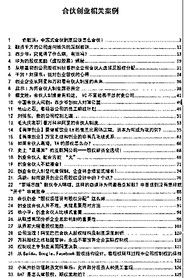

 

 

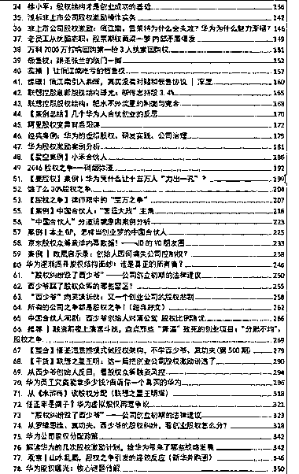

 

 

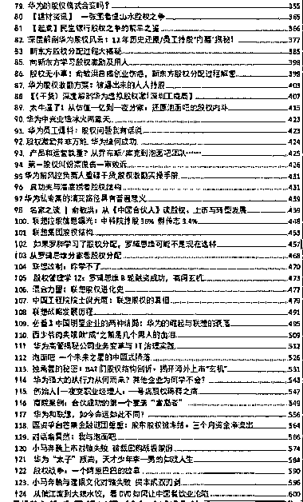

 

 

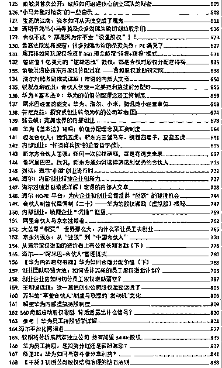

 

 

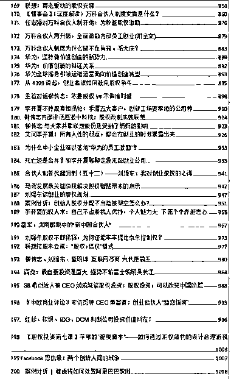

评论区：

成义 : 感谢分享

C小调 : 感谢分享😊

后山人 : 正需要这个，感谢[抱拳]

Mr.Wang : [握手]感谢分享！

路明 : 谢谢分享[咖啡]网上大多的都零零碎碎

老黄牛 : 是的，这个算是比较齐全

海子 : 刚打开大概一看就太干货了[强][强][强]

老黄牛 : 懂的自然懂[呲牙]

 

 
<!-- split -->
# (精华帖)(95赞)企业初创期股权知识：避坑 80%+

作者：  深圳刘宁培

日期：2021-06-28

案例分享  创业经历  亏钱经历

大家好，我是刘宁培，在深圳。嗯，今年刚升级龙凤胎奶爸，开心。

今天分享下企业初创期的股权知识，避坑80%+，文章最后自己踩坑、亏钱、浪费半年时间的案例......

有打算合伙创业，或者正在合伙创业路上的圈友，可以看下这篇文章，7000多字，有什么问题评论区尽管问，问题尽量详细，不管是不是企业初创期，不管是不是企业内部股权激励，还是企业外部战略融资，我会一一解答。

为了阅读体验，文章放在了石墨文档，以下是文章链接

《企业初创期股权知识：避坑80%+》

再强调一点，先确定公司主体，再确定对应的股权规则，主体没确定，就把所有的股权规则往上套，就是耍流氓。https://shimo.im/docs/vtxqHKRgHJDwCgGP/

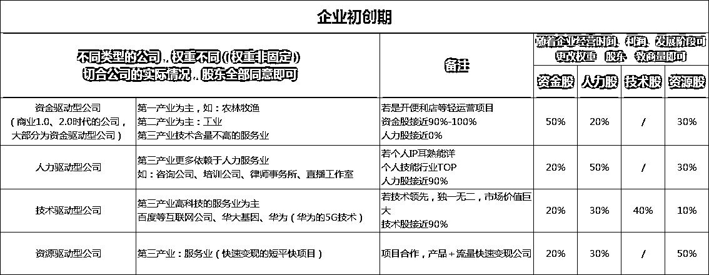

评论区：

 

 

抖音高效变现百晓生 : 我在深圳做短视频，欢迎交流

RN : 老师，最近碰到了公司股权的问题，想咨询一下你

RN : 请问可以加您微信吗

大鱼 : 今天刚写了一篇股权激励的文章，就看到您的分享了，哈哈哈

深圳刘宁培 : 真巧，发[得意]，学习学习

深圳刘宁培 : 嗯，方便

深圳刘宁培 : 嗯，欢迎，初创期吗

抖音高效变现百晓生 : 对滴
<!-- split -->
# (精华帖)(91赞)创业期如何设计股权激励

作者：  深圳刘宁培

日期：2020-07-08

轻享  主题：创业期股权激励：

（1）创业：找人、找钱

（2）股权顶层设计

（3）股权进入机制

（4）股权分配机制

（5）股权退出机制

这次思维导图内容更加详细，顺便简单讲点案例，更有代入感：

创业路上，股权顶层设计的重要性堪比情侣、夫妻之间的关系处理。

处理得好，公司内部股权激励，激情如初，快速发展，公司外部融资扩张，顺风顺水，势如破竹；处理不好，好比谈恋爱、结婚之时，双方不能相互理解、相互宽容，彼此认为自己付出的比对方多，对方却不理解自己付出了如此之多，彼此认为自己没有得到对方对等的体谅、照顾，或者实质性的“报酬”，那差不多该分手的分手，该离婚的离婚。

创业也一样。

1、公司内部股权进入机制不到位，资金型股东持大股，公司赚得越多，创始人越没劲，资金型股东持续躺赚......

2、公司内部股权分配机制不到位，没进行股权融资资源，逐渐退出市场TOP；股权融资过多，创始人失去公司的控制权，江山易主......

 

 

3、公司内部股权退出机制不到位，有多少僵尸股东躺在功劳本上吃老本，公司想引进更厉害的人，没得分了......

（1）（2）已经分享了，现在分享（3）（4）（5）

（3）进入机制：[西瓜]

讲讲股东类型，一共有6大类

1、技术型股东，能与人分离的技术成果（政府认证、商标权、专利权、著作权、商业秘密），才能作价，给予股份，否则给工资即可。

2、资金型股东，必须溢价进入；溢价多少倍就看创始人对公司估值的认知和商业模式。

之前一位广州客户，公司每年净利100万左右，创始人对公司高管进行股权激励，出资15万可买30%的股权，听完之后问：贵公司股权还卖吗？我也买点。这种投资回报率200%生意，怎么做也不吃亏。

3、资源型股东，必须量化进入；凭业绩说话，完成多少业绩，给多少股权，股权比例尽量不超过10%。

有很多这样的“资源者”，口头上天花乱坠，资源遍布全国，需要出力变现的时候，一地鸡毛，对这种资源型股东，大家练就火眼精金，让他们有多远滚多远；切记：“资料”不代表“资源”，要“资料”，去天眼查、企查查爬虫就行，一堆。

4、智慧型入股，必须以结果进入，同上，用结果说话。

5、能力型股东，必须以考核进入，同上，通过考核就给。

6、人力资本股，如：创始人、联合创始人，不能只根据出资金额（物质资本价值）来分配股份，还有人力价值，企业总股本中人力资本股远大于资金股，所以不能同股同价。

根据生产四要素和华为基本法得出的创始团队原始股权分配方法，资金的权重只有10%，另外劳动权重10%，企业家权重20%，知识权重60%（其中：基础价值权重24%，岗位价值权重36%）；那些投点小钱，不咋出力，在公司股份权重还挺高的公司，创始人长点心吧，你赚的钱越多，会觉得越吃亏。

讲讲6大股东类型进来后的2大形式：

1、实股，工商局注册，拥有决策权，转让，抵押，担保权等一切法定权利和章定权力；

①既分利润又分权：实股/限制性股票（工商登记；代持；持股平台）；

2、虚股，干股/分红股，没有企业股份的所有权，没有决策权，不涉及到公司的管理。

②只分利润再分权：股票期权、期权、限制性股票(准股票）；

③只分利润不分权：虚拟股票（权），分红回偿，技术入股；股票（权）增值权；账面价值增值权；延期支付；员工持股计划。

 

 

（4）分配机制：[西瓜]

如何利益分配，愿意分是格局，会分是智慧！！！

股权没好的公司，倒闭、易主、打官司、不能上市等，案例太多，大家有兴趣，可以上网查。

从三个角度出发给大家聊：股权高度分散而公司不倒的前提是拥有领袖级的企业家，不是每个人都是任正非，掌握好控制权，公司别易主，呕心沥血做的企业，不容易。

1、控制权：创始人保护好控制权的方法有以下常用的6个：

①设置持股平台：设置一家有限合伙公司（只需缴纳个人所得税，有限责任公司还要缴纳企业所得税）作为持股平台，员工在持股平台持股，再由持股平台在目标公司进行持股，也就是员工通过持股平台间接持有目标公司的股份；有了持股平台，持股人员、持股数量的变化都在持股平台进行变更即可；创始人和创始人名下的公司作为持股平台的普通合伙人，参与经营管理，投票权都在创始人手上；GP（管理合伙人），

投资人和股东作为作为持股平台的有限合伙人，不参与经营管理，不执行合伙事务，不对外代表公司、企业，不拥有决策权；参与投资，LP；享受分红和承担有限的责任。

②双重股权制，同股不同权，少量的股权有更多的投票权。

③投票权委托，部分股东的投票权委托给创始人，提高创始人投票权的数量。

④一致行动人协议，某一个特别事项，采取一致行动，签一个协议，意见不一致时，其他股东必须保持跟一致行动人的行为，保持一致的投票权。

⑤一票否决权，协议，重大事件，一票否决权，不会失去控制权。

⑥保护创始人章程，提前做好布局，提前做好合理的股权架构设计，股东会会议由股东按照出资比例行使表决权，但是公司章程有规定则除外（通过公司的章程约定、协议、相关的股权特殊设定情况）。

2、合伙人形式：

①股东合伙人：投资并拥有公司的股份，参与公司的经营，承担经营与投资的风险，享受公司股份分红，企业的初创期，投入有形资产/无形资产，共同创业；发展中股权激励；只有拥有共同的价值观和清晰的目标，能够一起并肩作战的才能称得上合伙人。

②事业合伙人：虚拟股份，项目持股的方式；员工出资认购公司的虚拟股份，共同经营，共享利润，公担风险，但并不涉及法人主体或者是工商注册的变更。公司拿出一项业务、产品、项目、区域（单店）等可独立核算的经营体参与该运营体，运营的员工共同投资，共享利润，共担投资风险。公司不区分业务、项目或区域，以虚拟股份对应整体经营盈利情况，全体合伙人出资认购公司整体的虚拟股份，并根据公司整体盈利状况 

 

进行分红、承担风险。

③业务合伙人  ：经营团队独立自主进行业务开扩与执行，享受团队经营所得的利润，管理咨询，律师等机构，类似承包，超出目标以外的分红激励。如：永辉超市。

④生态链合伙人：外部资源/经销商/投资人/离职员工/上下游。

3、其他注意事项

①股权融资时不要稀释过多股权，逐轮减少，10-30%之间，出让股权为获得资本、人才、对公司发展有重大意义的战略性资源；时间窗口就这么多，尽快跑马圈地，占领市场。

讲一个案例，小区居民饮用水，一共经历了1.0-4.0

1.0：自来水，煮熟了喝

2.0：桶装水，一通20元左右，送水上门

3.0：小区饮水站，可以提水同到水站

4.0：家用净水器

想跟大家说下佛山客户，已经升级到5.0，净化水入户（类比：天然气入户），创立之初，股权融资2000万，组建团队、试错、申请专利、铺进全国10个小区，2年时间，商业模式0-1已经完成，现进行第二股融资，准备从1-100，和城市合伙人一起投资做市场，形成规模效应，提高自身的商业壁垒，提高后期进入者的边际成本；老板很清楚，股权分得好，公司越做越大，尽快融到战略性资源，一起跑马圈地，免得被“大咖”吃掉；

然而，深圳某净水器客户，抱着20世纪的传统思想，公司就是我的，100%投票权是我的，股权不分......有种悲哀，“我毁灭你，与你何干”。

②股权静态分配，逐步成熟（vesting）

约定成熟机制、逐步成熟，如四年逐步成熟，平均成熟（4-5年）。

做多长时间，一部分股权就是你的。

如：约定4年10%，做了2年，给5%，把5%买回来即可。

③股权动态调整（期权池）

期权池：10-30%不等，股权架构优化，定向优化，杜绝吃大锅饭。

未来更厉害的核心人才加入公司；有人要退出，或者老股东能力跟不上或者不出力。

 

 

（5）退出机制：[西瓜]

①开除

原因：未履行出资义务，因故意或者重大过失给合伙企业造成损失，执行合伙事务时有不正当行为发生或者协议约定的事由

如何除名：在章程中规定，股东严重违反公司纪律，将被除名的条款是非常重要的，才能百分百确定开除，才能胜诉；

需经公司的股东会，就除名事项作出股东会决议，股东除名属于一般事项，1/2以上的表决权股东通过即可。

②退出

一个企业股东合伙人进出是很正常的现象，工商局通常都要求企业用他们指定的章程模板，股权的退出机制很难直接写进公司章程。

但是，股东合伙人之间可以另外签订协议：合伙人股权分期成熟、离职回购股权的退出机制，公司章程与股东协议尽量不冲突；

在股东协议约定，如果公司章程与股东协议相冲突，以股东协议为准。

最坏情况：公司法没规定，章程也没规定，合伙人之间没签署其他协议，股东退出得退股；协商不妥，只能清算，解散，推倒，重来。

限制退出时间；如：3-5年不能退出

退出因素：资源退出、法定退出、违约退出（强制退出）、直接退出

回购价格约定：（vesting）未成熟直接回收，成熟按当下估值的1-3折，CEO有优先回购权，要承认合伙人在历史上的贡献

若处于收益阶段：退还投资及固定收益/股份

若处于亏损阶段：退出者承担公司的损失，根据实际情况结算（分四期退出，每个季度退出1/4）

企业的一些其他保护条款：

股权回购：股权协议里面要有体现，CEO有优先回购权，公司回购可由创始人代持、可给新的合伙人、可放入股权池（逐步成熟的方式）

转让股权：提前约定，一致行动人协议，股权的出售或者转让，必须经过董事会同意认可才可以（全部或部分回收）

高额违约条款：离职可能不交出股权，避免司法执行的不确定性，约定离职不退股付高额违约金，提前签约好协议

合伙人离婚：土豆协议，确保离婚配偶不干涉影响到公司的经营决策管理，保障离婚配偶的经济性权利

 

 

合伙人意外离世

保密协议、竞业协议等

退出机制，这里血泪教训比较多，跟各位聊聊，北京做工程的刘师兄，创业之初，讲义气，都是哥们，股权，分；没想到公司发展越来越好，利润越来越高，想要引进一些更牛逼的COO、CTO之类的人才，人才不给股份，留不住，但是已经没有股份给了。创业之初的哥们股东，有的已经不出力，躺在功劳簿上吃大锅饭，和“哥们”先后洽谈、协商、谈判，几次都没谈妥，最后花了68万，找一个团队去北京解决。

真的是实实在在的坑啊，亲兄弟，还要名算账，测什么也不要测试人心啊！

微信：13725519468

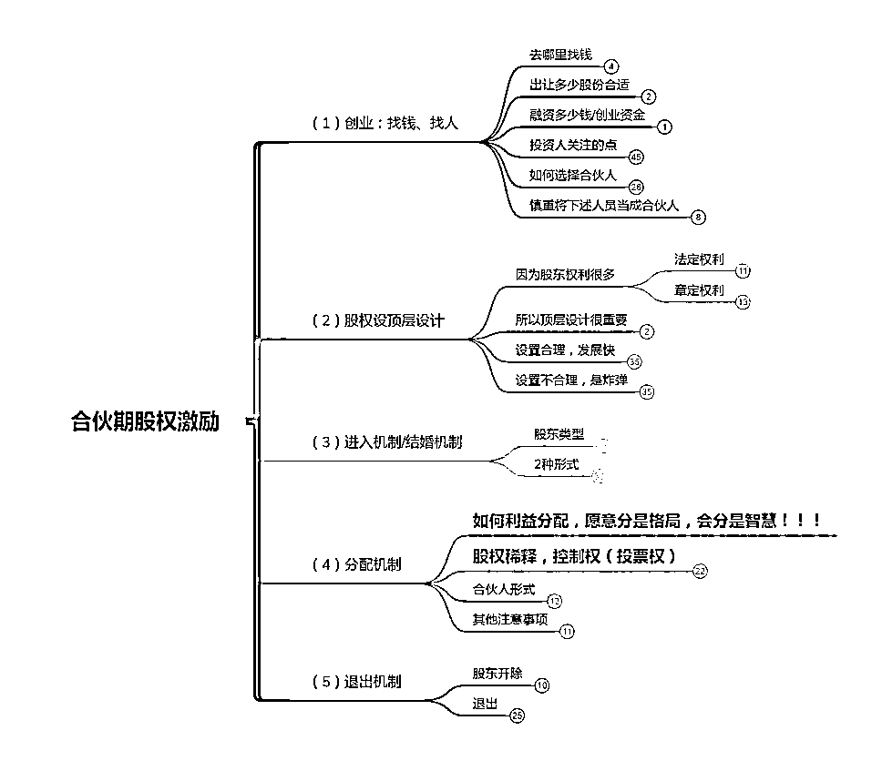

 

 

 

 

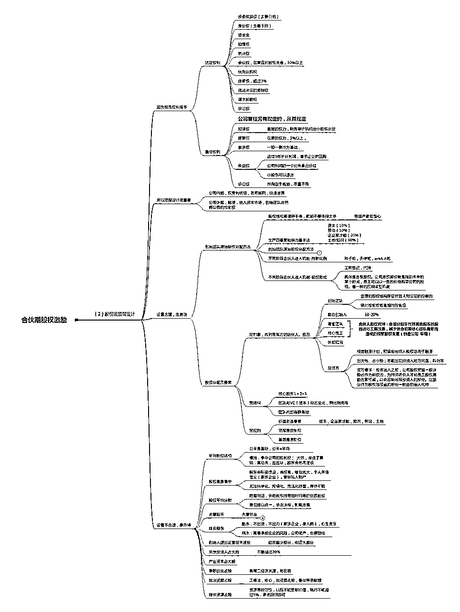

 

 

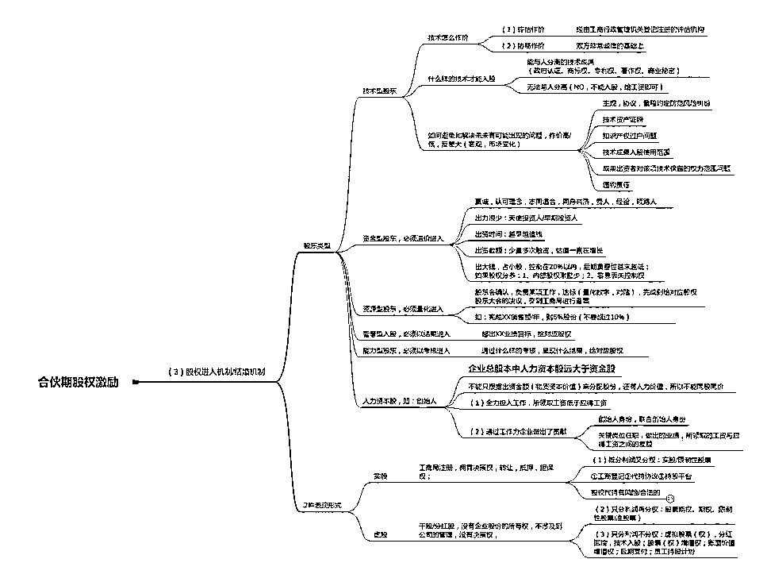 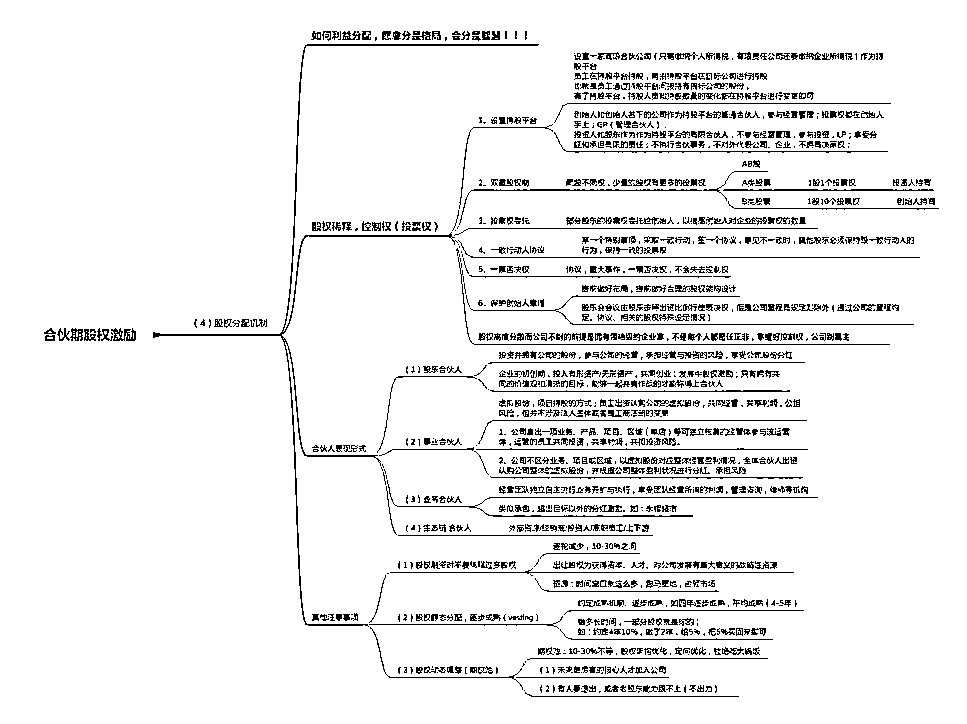

 

 

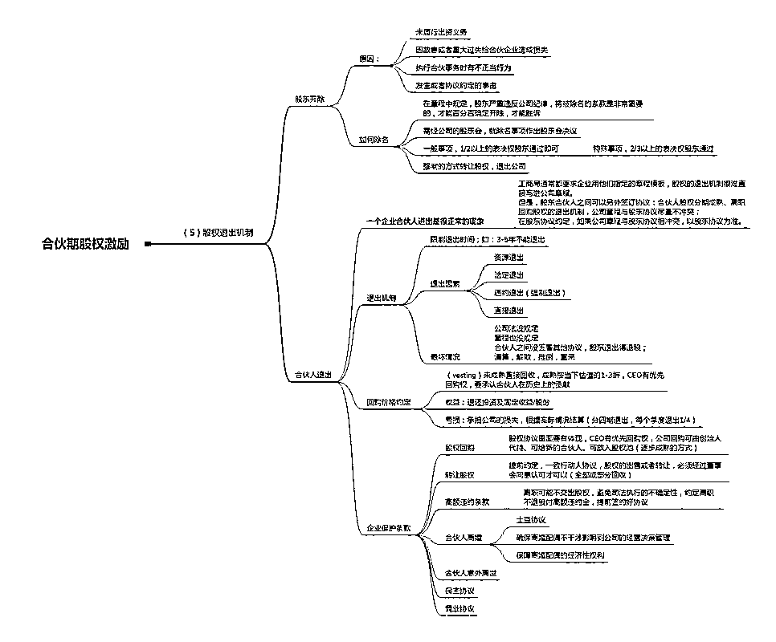

评论区：

程晨 : [强][强]

不停甜品店 : 受益匪浅[强]

深圳刘宁培 : 创业不易，少一坑算一坑。

亦仁 : 原创吗

高智豪 : 干货，点赞，评论，分享，打赏走起

深圳刘宁培 : 原创。客户案例都是我们线下的客户，这些算是比较基础的股权知识，应该可以帮到很多创业期的老板做股权激励。整个思维导图有1000多条，后续再继续分享发展期、扩张期（分子公司模式-交叉股结构）的股权激励。

深圳刘宁培 : 感谢，创业不易，少一坑算一坑，看到太多的案例了，看到精华篇圈友也有同样的案例，好辛苦。。

亦仁 : 已加精华，多分享。

 

 
<!-- split -->
# (精华帖)(86赞)初创公司股权设置的几个注意点

作者：  钱钰

日期：2019-05-13

初创公司股权设置的几个注意点，昨天正好有人咨询我，我给他写了一个，不断更新中。

1、初期股权不宜太分散 2-3人较好  优势互补，一定存在一个核心股东，333和55绝对禁止，当然334 443都不行。（这一点最重要）。

2、出钱出力讲清楚  亲兄弟明算账  责任规矩书面化，所有的投入要“货币化”折算，不能货币化和不确定的不能折算成股权（比如未来可以投入多少精力和时间，这种承诺没有任何价值）。未来有股份也干活的执行董事可以开工资，但劳力可不能算成股份。

3、请神容易送神难如政府资源，如供应链，如果对方是资源不稳定者，就不适合做合伙人，可以做顾问的形式来共享利益，可进可退。

4、千万不要用用股权拴住早期员工，宁愿多发钱。公司早期，给单个员工发5%的股权，对员工很可能都起不到激励效果，还觉得老板发不起工资才会用股权骗人。

5、  对于后引进的高管、职业经理人要先结婚  后恋爱，一定要有磨合期，设定合理的考核机制和时间点，逐步落实股权，以免发生高薪+股权请来的，半年就走了，还有股权遗留问题。

6、有进要有退，合资做个公司，有个人干了一年不想干了，要退股，退多少？投资不够了，要加钱，有人不愿意加了，怎么办？

7、上来就要控股的土老板不能要，财务大权在他手上，回头他说不做就不做了，咱的青春和付出呢？

8、战略投资要小心  很多公司买你就是为了把你搞死。

9、政府投资谨慎要，流程烦到你死，非常耗费早期创业团队原本就很紧凑的人力和精力。一个字签死你。

 

 

10、对投资人要小心，很多人不是为了投资，只是为了来套你信息，交代业务核心谨慎点。底层逻辑、核心数据、核心合作伙伴等信息一定小心。

11、公司注册时候就要明确好章程，章程其实挺重要的，投票权和分红权是可以分开的，要多分点钱给哪个人可以约定条件，总经理各种权限也要早点约定好，免得后期纷争。

评论区：

三笙 : 注重知识产权保护，能花小钱保护起来的东西，不要怕麻烦，先注册，先申请下来再说，比如：商标，域名等。

钱钰 : 感谢补充。

三笙 : 吃过亏，本来300快的事情，花3万[流泪]

颜过 : 钱大，补几点，后面的观点建立前面的观点的基础上：

1，35%生命线

2，土豪可以合作，但注册资本金尽量在50-100万，不要太大，以免一个增资就把你稀释出局

3，及时分钱，别到时候，钱多了，账一做，亏钱，哪有钱分。例如季度分红，月度分红，可以先不全分，可以拿40%，或者一个合适比例。不要影响公司运营现金流就很好了。

4，财务请单独请人（或双方一人一个，如果是两方合作），别被大股东套。最好学点财务基本知识。

5，如果存在新公司向大股东公司采购货物，参考市场价。[微笑]

亦仁 : 增值稀释出局有案例没

亦仁 : 已加精华。

阿彪 : 同求
<!-- split -->
# (精华帖)(89赞)合伙做生意，先是经营层面的员工，再是股东层面的股东

作者：  深圳刘宁培

日期：2023-02-17

 

 

我叫刘宁培，长期在深圳，龙凤胎奶爸，主业企业咨询：股权设计、企业经营管理、商业模式板块。

前两天邻居来找我，三个刚毕业工作不久的大学生，不想打工了，想自己创业做亚马逊电商。找我聊起了股权的事，三个人一起出资，分红平分，在工商注册暂时是两个人显名（60%：40%）。其中一个人知道这样不合理，也知道以后一定会分道扬镳，但是不知道从哪里下手改......住的地方相隔不远，就让她们晚上来我家聊，跟她们讲讲正常应该怎么做，帮一点算一点吧，不然她们后面一定闹掰散伙......

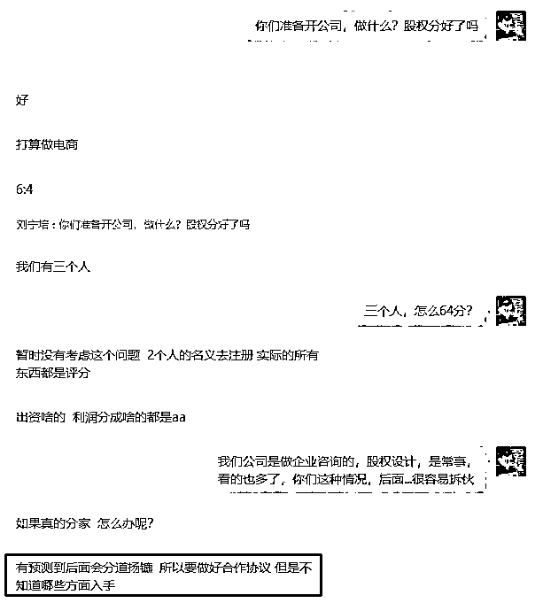

想到了以后会分道扬镳，但也很无奈，不知道怎么办

 

 

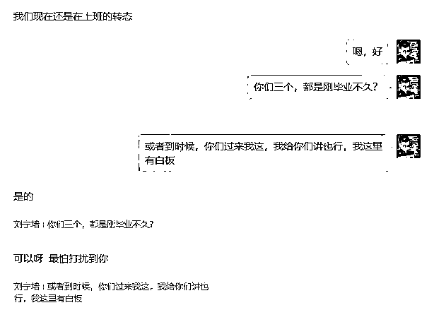 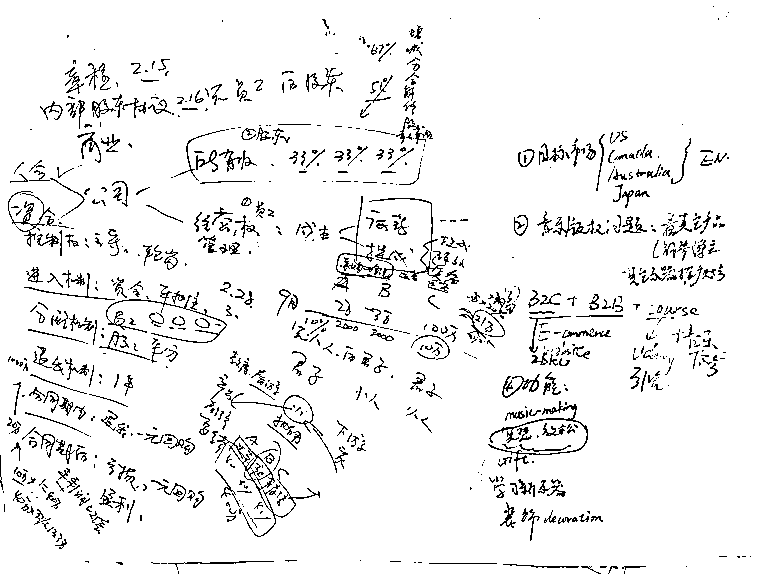

股权讲了控制权、进入机制、分配机制、退出机制的16个坑，以前的文章写过了，这里就不复述了。

但是有一点，我想展开再讲一遍，《合伙做生意，先是经营层面的员工，再是股东层面的股东》。

 

 

要不要跟亲戚、朋友、同事合伙做生意，好像都会闹掰......

三个合伙，ABC出资相同，AB都不参与经营和工作，该怎么分配股份和工资？

三人合伙开店，一人只出钱不出力，二人出钱又出力，请问怎么分股？

四人合伙开店，四人出资一样多，两人经营店铺，两人不参与店铺经营只出资，经营收入该怎么分？

跟朋友合伙开饭店，我出15万朋友出10万，他在店里管理工资定的1.1万，股权如何分配?

三人合伙，一人出全资偶尔出力，两人全职出力不出资，怎么分配股权比较合理？

请问三人合伙做音乐餐吧，我和一人出资各50万全职出力，另一人出资100万不出力。

股份三人平分是否公平？

100万元的店，2人各占一半股，A只持股份，B持一半股份还加管理技术，怎么分红?

和朋友合伙开服装店，资金各出一半，他负责店铺管理，我偶尔帮忙，请问股份如何分配合适? 四六分呢?

两个人合伙创业，一个人出资不管事，另一个人出资又出力，股权该怎么分？

三人合伙开餐饮店，都全职参与店铺经营，出资比重为57%:28%:15%，这种情况下，如何分红才公平？

我之前说过90%以上的初创企业会碰到的问题，经营权（员工）、所有权（股东）混为一谈，我发现我错了，从初十开工到现在，接到所有的微咨询案子，**100%**的初创企业都将经营权（员工）、所有权（股东）混为一谈。

接下来的文章，会解决以下问题：

#  一、 全局观：企业经营管理的基本概念

 

 

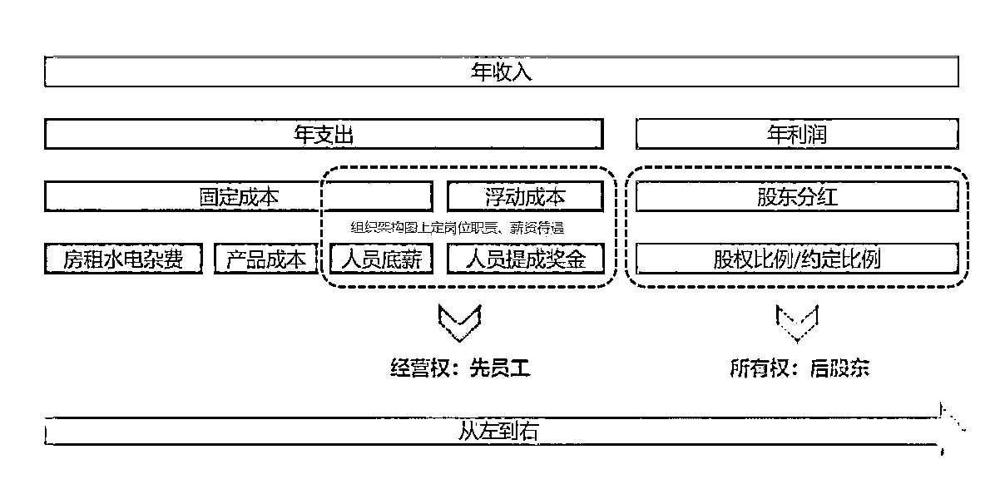

1、几个志同道合、能力互补、资源互补的合伙人一起成立公司，做某个项目；

2、做好公司一年0收入的资金储备，不要在第一年因资金链断裂而导致公司倒闭，至少拼1年吧；

3、画好公司基本的组织架构图，在组织架构图上定岗位职责、定每个岗位定薪资待遇（含提成、绩效等）；

4、公司年收入=年支出（经营权：员工报酬）+公司年利润（所有权：股东分红）主要讲这条：公司剩余的年利润，才是股东享受的分红（蓝色部分），若A是公司的股东，也是公司的员工。

**A**的第一层身份先是员工：

（**1**）员工职责：作为员工，就要按公司的岗位职责完成公司的任务要求，A是来做事的，不是带着老板瘾来指手画脚的；

如果A处于某个关键的岗位，不能够完成公司的岗位职责要求，是不能继续在岗位上任职的。

A要有觉悟，自觉离职，不要给公司造成负担，等着年底分红就行；

如果没有觉悟，不离职，其他股东就辞退A让A滚，如果处于项目关键岗位的A不滚，要么项目延迟闭环，要么黄。

 

 

（**2**）员工权利：领取底薪+提成/绩效等。根据对应的岗位职责领取对应的报酬，尤其是销售岗。

公司里面，大股东不拿销售提成，对公司伤害很大。

大股东不拿，把自己至于道德的至高点，不图回报地为公司贡献业绩，小股东好意思拿吗？

小股东因自身在行业沉淀的资源，一年可以给公司带来100万的单子，销售提成政策是10%，销售人员如果带来100万的单子，都有10万的提成，而因为大股东的不拿，小股东怎么拿？那就100万的把单子转给其他同行公司咯，把10万的提成拿到手先。

大股东就这么慢慢看着小股东一个个没激情、没动力，然后一个个退股。

**A**的第二层身份才是股东：

公司年收入-年支出（含经营层所有员工的薪酬提成）=年利润（股东们按股权比例/约定比例进行分红）

# 二、讲三个案例，加深了解。

案例**1**：

A、B两人出资30万开便利店，两人出资一样，A出力当店长，B不出力在外还有其他项目。

解决方案：

（1）经营权（员工）：

A根据当地薪资水平拿店长工资+提成。

B不出力，0收入。

（2）所有权（股东）：

年收入-年支出（含店长年薪）=年利润（五五分）

 

 

案例**2**：身边朋友的案例

L、M两人（两人关系好，哥们义气）一人出资一半开了一家苏宁易购的实体店，一起全天在店里面上班销售各大品牌电器；都约定不拿底薪、提成，每个月的收入减去产品成本、房租水电等杂费，剩余的利润五五分；

结果：前面做得挺好，第9个月的时候，L跟我诉苦，目前门店的销售业绩他贡献90%，M越来越懒，销售业绩贡献仅剩10%，做得多，分的一样多，觉得很不公平，这种情况还不如自己做。想和M拆伙了。

解决方案：

（1）经营权（员工）：

L：每天上班10小时，底薪为0，提成要拿（彼此约定好提成比例就行），有本事做业绩的90%，就有本事拿90%的提成。

M：每天上班10小时，底薪为0，提成要拿，把别人当傻子坐等分钱，就活该拿业绩的10%的提成。

（2）所有权（股东）：

年收入-年支出（含销售电器提成）=年利润（五五分）

案例**3**：某客户案例

ABC三人，一人负责产品，一人负责销售，一人负责运营，公司商业模式跑通，年利润几百万后，ABC三人都说自己所在的岗位对公司贡献有多大，要分多点股权（分红）。

（如果创立之初，没有设置好股权的动态调整机制，再想改变股权比例，很难。）股权是公司创立之初就确定好的，股东按照公司的股权比例进行分红。

岗位职责的薪酬制度也是公司创立之初就确定好的，提成该怎么拿就怎么拿，即使有调整，也是平均水平波动，不会调整得太离谱。

 

 

如果是ABC三人公司准备启动新项目还好说，可以重新成立一个公司或者成立事业部，用单独核算的方式进行约定的比例分红；如果是原有的老项目公司，因为年赚几百万了，都觉得自己贡献多分红少，只能说，ABC三人的吃相都很难看。

小结：相信大家看过或听过以上**3**类案例吧，大家不要以为彼此成合伙人了，彼此之间就亲密无间不会计较了， 别说合伙人，多少夫妻的争吵离婚的导火线是**“**我为家里做的贡献大，你为家里做的贡献小**”**。

大家都是凡人，不是圣人，天下攘攘皆为利来天下熙熙皆为利往，合伙之前，定好规则，不用要利益去挑战人性。

行业老话：先小人后君子，大家都是君子。先君子后小人，大家都是小人。

# 三、总结 ：先员工（经营权），再股东（所有权）

（**1**）经营权（员工）：

在其位谋其政，任其职尽其责。

能干就好好干，不要动不动就甩老板脸色，“老板”这角色以前可以很拽，但是现在在“00后职场人”眼里，老板不听话就离职才是常态；不能干就自觉滚蛋，公司没了“不称职的员工（也是股东）”，项目跑得更快。

（**2**）所有权（股东）：

年收入-年支出（含员工报酬）=年利润（股权比例/约定比例）

不要把经营权（员工）跟所有权（股东）混为一谈，否则必分配不均，散伙收场，如果还没散伙，是因为利润还小。

评论区：

 

 

长青一剑 : 深有体悟

深圳刘宁培 : 是不是经历过？

嘉达 : [强]，里面有讲到“动态调整机制”，这一块在创立之初怎么设置，能否展开讲讲~谢谢[呲牙]

晓崎 : 创立时预留10%作奖励池或预备金，有新股东入伙也较方便

深圳刘宁培 : 如：A股东跟B股东谈条件，

完成1000万年业绩，持股比例由30%变为40%；

完成2000万年业绩，持股比例由30%变为50%；

……以此类推

深圳刘宁培 : 资源股东跟高管可以，一般合计预留30%为上限。

资金股东都通过增资扩股的形式进入，所有人的股权同比例稀释。

亦仁 : 感谢分享，已加精华。

深圳刘宁培 : 感谢亦仁大哥鼓励
<!-- split -->
# (精华帖)(78赞)初创公司如何科学量化股权分配？股权分配五步法教你不再踩坑

作者：  郑玉斌。

日期：2023-01-11

哈喽大家好，我是玉斌，第一次在生财分享，很担心我分享的内容已经有前辈在过去几年里分享过了。所以在分享之前，我特地去生财精华帖里搜了下，讲股权的很多，但是在如何科学量化股权分配上，我还没有看到有圈友系统的分享过，所以今天我冒昧来给大家分享下如何定性定量的科学的把股权算出来。

生财圈友大多是创业者，很多圈友的企业已经做得非常大，不知道大家在刚创业并且有合伙人的情况下，是用什么方法去做的股权分配呢？比如说是按股东各自的出资比例，还是有一定的方法论？

 

 

先抛2个比较普遍的案例问题给大家。

一：假设你准备做一个全国连锁的快餐品牌，其中有一些合伙人需要负责市场运营，有些合伙人有配方，有些合伙人只出钱，如果你是 CEO 你要怎么协调，怎么去分配这个股权？按出资比例分配吗？

二：如果你的团队有四个合伙人，这四个合伙人分别是负责市场的，负责运营的，负责产品的，负责融资的，每个人的能力背景都不一样。你作为创始人，你要怎么平衡好每个合伙人的股权情况？大家激情澎湃的准备一起来搞一个事情，但是每个人负责的板块并不一样，这时候我们要怎么去分配这个股权呢？

对以上2个案例，如果你只是拍脑袋凭感觉决策，请移步飞书查看全文~

https://ozqj66fvp1.feishu.cn/docx/C0dydiFPCoBI3LxemwWcXpdxn2e?from=from_copylink

评论区：

郑玉斌。 : 是之前生财一小时分享活动就准备好了的，还特地做了几十页ppt[流泪]，活动停止了就发这边分享给大家~很干，最好在电脑前观看。

A～枫 : 打不开链接

许义 : 很有用，谢谢。

许义 : 可以联系一下吗

亦仁 : 链接无法打开？

郑玉斌。 : 奇怪，我马上调整一下。阅读人数已经显示很多人看过了。

郑玉斌。 : 评论区好像可以留联系方式，18030219049。

亦仁 : 这个链接不可直接点
<!-- split -->
# (精华帖)(73赞)创业者必备融资常识：卖股不卖身，白话帮你打通股权融资

 

 

作者：  彩虹姐姐🌈@丁邱洁法*

日期：2022-02-11

生财有术·创富早知道  创业者必备融资常识：卖股不卖身，白话帮你打通股权融资大家好，我是#云上法律团的彩虹姐姐🌈，第一次发帖，就直接上干货啦～

【腾讯文档】创业者必备融资常识：卖股不卖身，白话帮你打通股权融资

目录：

一、为何卖？

1.1、第一层需求：求生存

1.2、第二层需求：谋发展

1.3、第三层需求：创辉煌

1.4、融资附加值

二、卖给谁？

2.1、从公司发展阶段出发

2.2、从公司所处行业出发

2.3、从公司需求出发

三、卖什么

3.1、股权控制【绝对控制权、相对控制权、一票否决权】

3.2、章程控制

3.3、协议控制

3.4、股权布局

四、如何卖

4.1、敲门砖-BP怎么做

4.1.1、项目本身介绍

4.1.2、投资人权利、利益

4.2.3、闪亮登场·路演融资

4.2、如何用好敲门砖

4.2.1、列潜在投资人名单

4.2.2、有策略的接触投资人

 

 

4.3、如何避坑

4.3.1、估值

4.3.2、优先清算权

4.3.3、股份回购

4.3.4、反稀释条款

4.3.5、领售权

4.3.6、董事会席位

4.3.7、创始人股份限制

4.3.8、对赌条款

附录：

彩虹姐姐🌈的经历，优势，特长

欢迎大家点赞、评论、互动，让我们知道你的需求很硬很刚，我们继续上干货。

感谢支持#云上法律团，球球和我在这里等你哦

~https://docs.qq.com/doc/DSlRlamFic3lEWFp1评论区：

金馆长 : 收藏

zhangck7 : 666，收藏

小熊 : 提供法律顾问咨询吗？ vx多少，大佬[玫瑰]

彩虹姐姐🌈@丁邱洁法* : 谢谢支持。

彩虹姐姐🌈@丁邱洁法* : 谢谢支持。

彩虹姐姐🌈@丁邱洁法* : 可以的。私信一下。

丁邱洁律师团队 : 欢迎大家多多鼓励，支持，引导我们团队新人成长哦。

Sugar.提拉 : 收藏
<!-- split -->
# (精华帖)(35赞)创业者必备股权常识：一文搞懂非上市公司股权激励

作者：  彩虹姐姐🌈@丁邱洁法*

 

 

日期：2022-03-02

生财有术·创富早知道#创业者必备股权常识：一文搞懂非上市公司股权激励

大家好，我是彩虹姐姐，第一篇文章喜提精华帖，喜出望外、受宠若惊。为了满足广大创业者圈友的需求，我和团队快马加鞭，写了这一篇股权激励实战帖，以飨读者。

球球说，生财有术是一个真诚和利他的社群，还说适合我这种“人狠话不多”的人发帖，既然如此，我也就在此与大家畅聊如何利用股权激励这一工具，帮创业者从青铜实现王者之路——做成更值钱的企业，去星辰大海抓大鱼。

这是文章原文。

【腾讯文档】创业者必备股权常识：一文搞懂非上市公司股权激励V1.0 20220228随附目录：

目录

一、股权激励要不要做——四大因素

1.1、从目的出发

1.2、从行业属性出发

1.3、从企业发展前景出发

1.4、从时机出发

二、股权激励什么时候做——三个阶段

2.1、初创期

2.2、成长期

2.3、成熟期

三、股权激励怎么做——七定五法

3.1、方案怎么做——七定

3.2、如何落地——五法

四、股权激励风险规避

4.1、效力问题

4.2、涉税问题

4.3、股权代持

4.4、离职员工股权回购

 

 

大家记得给我们@云上法律团点赞、评论，让我们知道大家的需求很刚很硬，我们继续上干货。https://docs.qq.com/doc/DSkVURnRNaHV5dUVO

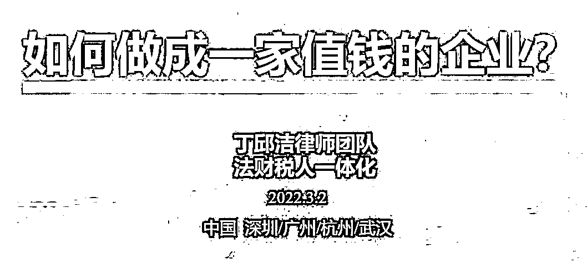

评论区：

良辰美 : 写得很棒，感谢分享，我们后续准备用到在职分红和虚拟股权。股份是大事，其实人更重要，股东挑选，稍有不慎，满盘皆输。

彩虹姐姐🌈@丁邱洁法* : 高手。是这样的。企业发展，与规模无关。再小的企业，也有自己的合伙人文化。怎么选，全是具体问题具体分析。没有完全统一的模板。

亦仁 : 感谢分享，已加精华。

彩虹姐姐🌈@丁邱洁法* : 太喜出望外了。感谢亦仁。

椰树下乘凉 : 做加法不做减法，学到了。
<!-- split -->
# 【找合伙人】2篇
<!-- split -->
# (精华帖)(105赞)初创团队成功的关键——找到合适的合伙人

 

 

作者：  宋大范儿

日期：2023-04-13

在 2023 年生财有术全国见面会期间，有个创业的男孩子来找我咨询，说目前团队的小伙伴工作产出不好、不爱沟通、隐隐摆烂的姿态，导致公司营业额很高，但是一年到头一算账，基本不赚钱，问我这是不是团队出了问题？是人选错了吗？要怎么解决目前的问题呢？

如果是员工本身的问题的话，团队里面有的小伙伴是从别的项目跟着他来的，以前都很有干劲，也有成绩，现在怎么就变了呢？

还有一些小伙伴是他亲自招聘来的，来的时候都是很有激情很有干劲的人，怎么现在眼里的光就消失了呢？

其实，如果初创团队的成员出现了问题，不一定是团队本身的问题，可能存在三种情况：

1、团队其实是没有问题的，是产品逻辑本身有缺失，商业逻辑没有闭环，导致了问题出现，以为是团队能力不足；

2、团队合伙人角色缺失，导致创始人一个人抓业务的同时又抓管理，再兼顾着技术，一个人又当爹又当妈，最后团队自然乱成一锅粥；

3、就是团队成员本身出了问题，创始团队在挑选成员的时候就选错了人，招了错误的人或者一群小白兔进来，自然而然整个团队就没有战斗力。

 

 

而这个男孩子所遇到的问题就是上面的第 2 种情况，他是自己一个人创业，没有合伙人，公司各个方面的事情都是他一个人一把抓。

在现在的创业环境里，一个人包打天下的时代已经过去了。创业是一项复杂的系统工程，不管是做产品还是做服务，能力再强的人都需要一个团队，需要几个同甘同苦的人，密切协作去实现一个共同的使命。

合伙人目前比较常见的是三人铁三角结构，最好不要超过 5 个人。

选择合伙人是一件重中之重的事情，一定要非常慎重，宁缺毋滥。我看过太多创业公司失败都是因为合伙人之间的问题，堡垒都是从内部攻破的。

很多创始人在选合伙人的时候都很草率，觉得我有好业务谁愿意来干表态一番就干了，并且特别愿意优先选择亲戚、同学、朋友、同事等认为“可靠”的人。

其实，合伙人之间是否是朋友不重要，是否以哥们儿感情为基础来挑选合伙人也不重要，选合伙人要从以下几点去考虑：

（**1**）志向是否一致

道不同不相为谋是自古流传下来的真理，志同道合，这是前提。

 

 

合伙人对公司发展的方向是要一致的，大家都向往星辰大海，才能一起去航行。

一个想做百年老店的人和一个小富即安的人是没有办法合作的。

同时彼此做事情的方法和道德底线认知要一致，彼此的价值观也需要一致。

一个想走正道经营的人和一个想捞偏门的人也是无法合作的。

（**2**）人品一定要过关

第一次创业的人，选合伙人经常容易陷入一个误区，只看这个人能力强不强。如果合伙人能力很强，那会鼓掌欢迎。

这是一件非常危险的事，选合伙人必须要考虑人品问题，如果这个人德行很差，会比没有能力但是德行很好的人更危险，这类人会把聪明才智用到怎么算计合伙人，怎么算计客户，甚至窃取你的胜利果实上，更严重的会牵连你不自知的成为某种犯罪行为同谋。

合伙人必须都是诚信的人，是认可和尊重游戏规则的人。

（**3**）优势互补且每个人都是自己领域内的人才

如果几个背包客在荒野上遇到狼群，那大家应对的方法是背靠在一起，面对不同的方向，才能做到全面防御，如果都面对一个方向那大概率会成为狼群的食物。这和合伙人面对竞争激烈的市场是一个道理。

 

 

合伙人团队必须是在不同方面的专才，大家组合在一起才能形成一个完整没有缺失的能力圈。

有擅长销售、流量的，有擅长产品设计、技术的，有擅长管理、能做政委的。

不同方面的能力强者，同心协力、互相配合，才能在最大程度上增加创业成功率，让公司走得更稳、更远。

（**4**）性格互补

经常有我的客户问我，选择合伙人是找性格一样的人还是要找性格互补的人？

我的个人答案是：性格互补的人。

如果一个合伙人是干劲十足、行动力特别强的冲锋型人物，那就需要有另一个审慎、思考细致的人；

如果一个合伙人是性格火爆、即时发泄情绪的人，那就需要有另一个性格温和、眼里住下每一个人的人；

如果一个合伙人是耳根子软，身前红人经常轮换的人，那就需要有另一个心性坚定、专注于事的人。

你能想象合伙人里都是牛脾气的人吗？那公司就会变成斗牛场了，业务还怎么做下去。

 

 

我做过顾问的一家公司，创始人是个艺术家，喜欢坐看公司各种宫斗上演，每个“宠臣”都想取代合伙人坐上公司二把交椅，但是公司还是磕磕绊绊走下来了，目前已经是 E 轮融资的公司了，这和合伙人是创始人互补性格有很大关系。

上面就是我们选择合伙人要关注的问题。前面这些问题，我们可能或多或少都知道一些。

我这里还要提一个没有人提过的点：就是金钱观要一致。

什么是金钱观要一致？我先说一个我客户的真实案例。

e 袋洗这个业务（互联网洗衣），国内最早做这个业务的团队是我一个客户，并且也是业内第一个拿到天使轮融资的团队，他们早了 e 袋洗将近 1 年的时间，并且有自己的线下洗衣厂。

这个洗衣厂是其中一个联合创始人的自有产业，一直承接酒店行业的布草清洗业务。

我的客户是那位拥有洗衣厂的联合创始人，在发现了互联网洗衣这个业务之后拉上了好朋友一起做，并把公司 CEO的位子让给了朋友去做。

这两家人是十几年的关系，好到可以穿一条裤子。是不是很多人都这样找合伙人？拉上好兄弟就一起干了，并且觉得这样最万无一失？

然而就在第一笔几百万（ 2013 年）天使轮融资到账的时候大戏上演了，创始人觉得这是一笔挺大的钱，应该分一分，而联合创始人觉得几百万不算什么钱，分了没意义，不如用于发展，以后有更大的生意。

 

 

于是两个人因为这件事闹出很大矛盾、吵得不可开交，最后甚至到了创始人放话要绑架对方孩子泄愤的地步。

团队自然就散了，业务也做不下去了，要是团队能走下来，可能就没 e 袋洗什么事了。

是两个人价值观不一致吗？不一致的话是没办法做了十几年的朋友的。

其实是金钱观不一致，两个人的眼里几百万人民币的体量不一致。

所以合伙人在考虑了所有因素之外，一定还要考虑彼此对于金钱在数量上的认知要是一致或者相差不大的。

除此之外，我还要提几个常见的选择合伙人误区：

（**1**）让短期能帮上忙的朋友成为合伙人

合伙人一定要是长期并且持续对公司有贡献起作用的人，如果需要朋友来解决短期的问题，可以考虑按业务付费。

 

 

（**2**）让在思想上支持创业的亲朋好友成为合伙人

创业期都很艰难，有一些亲朋好友看好你、支持你，创始人一激动出于感恩心态就把大家一起拉进来做合伙人，一起享受未来的荣华富贵。这种做法是大错特错的，选择合伙人一定要以前面提到的因素为考量条件。

（**3**）让单纯的财务投资人成为合伙人

很多创业者在前期因为启动资金不足，就经常找一些单纯的财务投资人做合伙人，这种做法也是很不合适的。

合伙人一定要选择能够给公司带来资源或者有经营经验的人，如果需要带资进组的人，也要找有资源或者有某一方面专才同时带资的人，或者设置其他财务回报。

（**4**）选择大公司出身的职业经理人为合伙人

每个创业中的创始人都会出现一个美好的愿望：找一个大厂出来的职业经理人，他们自带光环，能解决创业中遇到的所有难题－找方向、找人和找钱。这些也真的就是一个美好的愿望而已。

大多数职业经理人并不愿意从基层干起，尤其不愿意接受创业公司的薪酬体系，他们追求程序正确，过于讲究流程制度，过于依赖相关部门的支援，这些种种都是创业公司的大忌。

 

 

知道了选择什么样的合伙人之后，我们一般都从什么渠道要去寻找合适的合伙人呢？

（**1**）向上求：找到比自己更厉害的圈层，到这些人中去讲自己要准备创业的项目，接触这类人多了就能碰到和你一起干的人，或者他们能帮你推荐合适的人和你一起干。

这些人都有自己的远见和丰富的经历，即使不参与也能提出不同的意见，甚至帮助你打磨项目。

如果以后你做成功了再想有更大的发展这类人也能帮到你，无论从那个角度讲对创业者本人都有好处。

比如你在生财有术里接触到的大佬们，就是这样的典型代表。

（**2**）横向求：可以在自己的同学、朋友、亲戚、以往共事过的同事或者你参加的大大小小的社群、创业圈子等中，找到志同道合的合伙人。

这些人可能跟你的水平差不多，和他们多聊自己的创业计划，聊的人多了，合伙人自然也就到位了，这也是大部分创业者选择的路径。

 

 

还是拿生财有术举例子，在生财有术中遇到的很多和你同频、水平差不多、同时也很想创业的圈友，就是这样典型的代表。

（**3**）向下求：从比自己圈层更低一点的人群里面选择合伙人，你以往在职场中的下属、追随你的粉丝、你的学弟学妹等，这类人一般比较容易找，因为你的综合能力比这类人强，这就跟向上求一样，人们都喜欢向比自己强的人靠拢。

这里面要注意的一点就是：你要确保他们能满足你在创业中对于合伙人专业度的需要。

找人的核心就是：多多宣扬自己的创业计划。

讲得越多，知道的人就越多，找到合伙人的概率就越大。但是在这个过程中，要注意一个度的问题，在广撒网阶段不需要把你的全部计划细节和底牌都说出来，该保留的核心商业秘密部分还是要保护好。

找合伙人的过程可能很漫长，也可能很快，当你有了初步的创业想法的时候，就可以开始启动这项工作了。

创业想法从开始出现到真正开始做是需要时间的，这段时间在边打磨项目的过程中边寻找合伙人，这样找到的合伙人也会更贴合实际，而不是在你的脑海中“想当然”设想出来需要的人。

已经找到了几个意向加入的合伙人候选人，并且他们都表示自己完全赞同你的所有想法、自己具备挑选合伙人所要考虑的全部因素，大家就可以一拍即合一起干了吗？

 

 

不，不是的。合伙人必须要经过筛选，他说的并不管用，他以往做过的案例和表现过的行为才是判断一切的基准。

“合伙人必须经过面试和背调！”

“合伙人必须经过面试和背调！”

“合伙人必须经过面试和背调！”

重要的事情说三遍。

面试是所有判断人的手段中相对全面、相对准确的方法。

如果觉得说面试太正式的话，可以“闲聊”，通过聊天来弱化面试的感觉，把面试技术套在聊天中，隐晦的实现你面试的目的。

通过他的过往职业和项目经历来判断他的知识、技能等专业度是否满足你的创业项目需要，通过他的爱好或对一些事情的看法来判断他的价值观金钱观等是否和你一致。还可以通过“闲聊”去了解所以你想了解的信息。

面试之后还需要做背调，通过从他以往就职的公司、共同的好友、共同的圈子，不八卦的、真诚的去调查他的表述信息是否真实、个人人品是否过关等。

但是背调之前要和候选合伙人打好招呼，说你会有这么一个动作，要取得他的同意。

到这里，是不是会有很多人觉得看起来似乎很苛刻、很不近人情？

 

 

千万、一定不要觉得不好意思、“磨不开面子”，这与我的温和亲切的老好人人设不符……前期你不好意思开的口，后期都是你要背的核炸弹；前期你的 Be nice，后期真的就成了你的耐撕。

受篇幅影响，我今天就只讲一下要怎么选择合伙人，至于创业公司要选什么样的初创核心员工；具体要怎么做面试和一些常见的、被问的最多的团队问题，敬请期待后面的系列文章。

如果有其他想要问的也可以回复评论，我会解答。

评论区：

林勇-广深 : 一口气看完了，真的很受用啦。性格互补，人品过硬，这个真的太重要了。

海迪 : 太棒了，选合伙人看盖洛普图，找互补，做盖洛普可以找醒醒同学

财女小马达 : 谢谢分享

宋大范儿 : 是的，最底层的东西都是容易被忽视然而却是最重要的。

宋大范儿 : 哈哈哈，友商带广，可以的。

宋大范儿 : 希望对你有帮助。

牧羊人 : 及时雨，希望宋大大快点出核心员工篇🌹

宋大范儿 : 感谢认可，一定会尽快完成任务。
<!-- split -->
# (精华帖)(56赞)第一次创业，到底要怎么选择合伙人？

作者：  郑玉斌。

日期：2023-02-22

下午一位生财有术的圈友加我，本意是咨询2个问题，

 

 

一：如何建立合伙人之间的财务监管体系；

二：是纯拿技术股还是再多拿点资金股。

（不得不说，生财有术圈友提问题前必发红包的习惯真的很好，和金额没关系，回答起来就是乐意。）

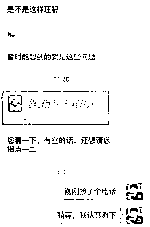

在解决了以上2个问题后，我发现他面临的问题可能更严重，就是他的合伙人到底有没有真的尊重他，真心想和他一起创业。因为涉及到太多隐私，就不详细描述了，总结就是这位合伙人存在恶意侵占，隐瞒，不真诚。

 

 

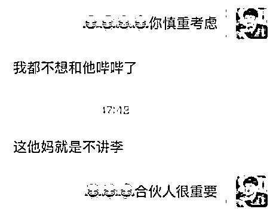

很多创业者在创业初期，真的是抱着一颗赤诚之心，以及勇往直前的勇气在创业，对股权分配，利益看的没有那么重。往往这时候，就很容易被一些别有用心之人利用，那在创业初期，到底应该怎么选择合伙人呢?

# 选择合伙人的七个小建议分享给大家。

 

 

方便阅读，请移步飞书.

https://ozqj66fvp1.feishu.cn/docx/DvIxdXPDho6vsBxNAklc5H4lnLf评论区：

静水流深 : 我觉得这是纸上谈兵，合伙人最重要标准是互相有对方需要的稀缺资源，其他都是扯淡。

东山老师 : 如果仅仅只是稀缺资源，不必要合伙呀？完全可以合作或者购买！

合伙对于长久共处还是需要考量的！

阿鸿 : 性格三观很重要，靠一纸协议长久不了

乔帮主 : 找合伙人跟找老婆一样，哈哈

文轩 : 搞了个五五凯的合伙。相当折磨。还绑定太多了，不太好断。[捂脸] 昊东.Lee : 合伙重要的是责权利的分配制衡，股权典型的比例线要了解一下，做饼前先把饼怎么分用书面形式确定好，别想着哥们义气口头约定，利益面前，人真的会变得贪婪且自私。

亦仁 : 感谢分享，已加精华。

郑玉斌。 : 谢谢亦仁鼓励~[愉快][愉快]
<!-- split -->
# 【人才招聘】3篇
<!-- split -->
# (精华帖)(182赞)（ 10 年人力总万字干货）创业团队如何招募面试到合适的小伙伴

作者：  许大范

 

 

日期：2021-05-27

在生财圈潜伏了很久，看了非常多精华帖，深觉收获颇丰。

但觉得自己在赚钱方面好像没有那么多可供参考，只有一个凭个人兴趣在运营的职场类公众号还在起步阶段，所以一直觉得没有什么太多可以分享的。

那天经亦仁大大的提醒，其实很多创业团队对于对人力工作也是有需求的，比如  如何设置团队架构、岗位

如何有效寻找、面试合适团队成员

如何进行考核、激励等等

而这些话题是我相对比较擅长的。

我从毕业就一直从事猎头招聘面试、人力资源咨询，后来加入了中国TOP5地产集团，目前是一家区域公司的人力副总。

累计面试量也有超过6000+了。

平时一方面会为公司非HR岗的面试官，进行面试技能培训。

另一方面也经常会帮一些身边创业的朋友提供面试咨询或者培训。

相信有些面试方法，还是能够帮到大家，让创业团队有效招募面试到志同道合的小伙伴！

尽可能做到有价值输出，知无不言。

全文约一万字，阅读时间约15分钟。

为了方便大家阅读，编辑在了语雀文档，点击下方链接即可阅读。

《（10年人力总万字干货）创业团队如何招募面试到合适的小伙伴》

https://www.yuque.com/docs/share/398af203-9d20-44fc-9465-91153bed595f?#评论区：

figo : 一字不差的看完了，全是干货[强]

子见 : 她来了她来了

许大范 : 啊呀你们这样我好紧张啊哈哈哈哈

子见 : 哈哈哈，万字长文可不是闹着玩的

许大范 : 一个我整晚过不去的坎

芳FANG : 哎呀，范范太厉害了～都是干货。

有800亩茶园的茶公* : 字字珠玑

许大范 : 写了好几天，有用就值了哈哈哈

 

 
<!-- split -->
# (精华帖)(135赞)没钱没名气，创业公司怎么找到合格的中层管理人才，并把他们留下来

作者：  鱼丸|亦仁助理

日期：2021-08-30

创业公司老板和主管最头痛的一件事是什么？是没人。

特别是钱少、规模小、没名气的小公司。

本期「轻享」，咱们就来聊聊这个话题：

怎样找到和公司业务匹配且靠谱的中层管理人才，并把他们留下来？

今天的分享嘉宾@忆菁  老师的观点是：

“不否认专业的事情给专业的人干，但是不要把应该是合伙人级别干的事情给到中层去干，这个才是找中层人中最容易忽视的一个 bug 。把自己不擅长的都找外部的人落地，自己反而变成了局外人。”

忆菁老师，目前是有瞰学社联合创始人。在过去的职业生涯中，她曾经经历过 3 家创业公司（  公司阶段分别经历过从天使轮到 B+ 轮，团队人数从 20 人到 300 人）  ，且是 1 家公司的创始团队成员， 2 家公司的核心管理成员。

从她的分享中，你能看到不少创业公司在寻找以及培养中层中犯的错误，也能借鉴到不少经验。

 

 

目录

一、创业公司为何难以寻觅管理人才

1\. 资金少、规模小、无名气

2\. 业务不清晰

3\. 创始人不自知自己的喜好和优势

二. 创业公司如何扭转乾坤

1\. 如何应对「不知名」短板

2\. 如何应对「业务不清晰」短板

3\. 如何提高人岗匹配精准度

三. 如何把精英留存下来

1\. 给到的目标要清晰和明确

2\. 目标最好分阶段，先取得小成功，再汇集成大成功

3\. 建立信任

---正文--

大家好，我是忆菁，结合今年个人的创业经历，我发现，在创业公司中，招到一个靠谱的、能打仗、能扛收入的业务负责人是极其艰难的一件事，而这些人就是公司内的中坚力量。中坚力量不仅需要和公司的愿景、价值观相符，团队气味相投，还要能够促进团队内人才成长的正循环，这些角色我们俗称中层管理者。

 

 

很多创业公司倾向于扁平化管理，恰恰忽略了中间领导层的发展与培养。在创业公司早期阶段，只要创始人能力强、业务模式比较简单的情况下，带着一些执行的小朋友就可以吭哧吭哧干出来。而当公司发展到一定规模，通常团队规模在 15-20 人以上，就必须要有一些可以负责拿结果的中坚力量了。否则，导致的后果就是——

员工准时上下班，而老板被诸多琐事缠身，累到不行根本没有时间分身乏术思考公司战略层面上的重要事情，公司的规模和收入上不去，发展成为瓶颈，整个公司的发展就会在后续陷入巨大危机。

今天就和各位分享一下在这个问题上的一些看法，我将分别从三个方面展开：

一、创业公司为何难以寻觅管理人才

二、创业者如何提高人岗匹配精准度

三、创业者如何才能把人才留住

一、创业公司为何难以寻觅管理人才

**1. **资金少、规模小、无名气

创业公司在招聘市场上遇到最大的困境就是「创业」两个字。

为什么许多优秀背景的人都渴望进入「大厂」而不是「创业公司」？

 

 

「创业」意味着什么？

公司处于起步阶段，缺乏有力的品牌背书，薪资竞争不过大公司，业务也不算稳定，规范性不强，管理可能相对混乱，加班情况严重……

**2. **业务不清晰

创业公司找不到合适的中层最大的一个原因往往是创始人本身对于对于业务发展方向和梳理不清晰，

1）对业务范围的定义不明确，做不到可量化、可验证；

2）业务执行的部门之间分工混乱不清晰；

3）没有完善的项目管理体系。

举个最典型的例子，公司在起步阶段拍脑袋设想的业务逻辑是 A ，所以找来了一个有 A 经验的人来做，等业务跑了一阵子发现原来的路子不行，要换一种业务逻辑 B ，突然发现原来这个 A 经验的人不能复用 B ，要重新开始探索。而比较多的情况是，期间不仅仅只有 A 和 B ，还有很多 CDEF ...等等，这样一圈下来，要么就是那个当初的人给整懵了，自己走了；要么就是你觉得他不行，让他自己走了...

**3. **创始人不自知自己的喜好和优势

创始人的喜好、气质和调性都会决定一家公司初期的调性和发展方向。创始人也不是完美的人，是人一定有自己的喜好偏恶，而这里的喜好还包括对个人价值观的判断，把自己了解的越透彻，越知道自己的价值取向是什么，才更能知道需要什么样的人。

 

 

举个例子，如果你的价值观是个很崇尚开放平等的人，在团队早期推崇简单直白的沟通方式，但招进来了一个在边界感上特别重的人，需要把职责和权利分的很清晰的才能干活的。  即使这个人的业务能力真的很强，但因为你在公司早期阶段塑造的开放平等已经体现在了团队文化和行为上了，这个人的进入就有点格格不入了。

在业务上你不得不依赖他，但是在为人处事上，你觉得有别扭。久而久之，这个别扭一定也会影响到你和他之间的沟通，以及他和团队之间的沟通。

千万不要以为只要为了公司利益，我可以牺牲我的价值观倾向，喜好偏好，除非你  100% 准备好打算这么做，并且从行为和心理上调整过来，否则还是诚实面对自己。大家都说，创始人是一家公司的天花板，但更重要的是，创始人了解自己的程度决定着这家公司可以走多远。

二**. **创业公司如何扭转乾坤

在第一章节，我简单帮助大家梳理了一些创业公司常见的招聘管理人才的劣势，那么这一章节，我会根据开头提到的三点劣势，展开谈谈相应的对策和方法。

**1. **如何应对「不知名」短板

对于创始人来说，如何充分挖掘公司的优势是一个需要认真去思考的事情。

在早期，创始人一定是公司优势的最大招牌，你的思想见识、专业、性格喜好等等都会吸引一批和你志趣相投的人进来。但也千万不要以为创始人的个人魅力这件事会很靠谱。

 

 

即便你是个 IP 或者行业知名人士，也顶多在招聘前期取得一些优势：人才的流量池会多一些，来面试的人的综合素质可能会高一些而已。但是，如果创始人本身并不清楚所在的公司和业务有什么优势的话，人就算来了，也会立即流失。

**1**）用「用户思维」招聘人才

找合适的人其实和做产品的思路很像，都需要有用户思维。

首先，我们需要重视一切和招聘有关的对外包装，包括公司介绍，岗位 JD 等，你可以将它理解为这就是公司的一张对外展示名片，具有广告效应，广告打得好，用户自然愿意来。

公司介绍是应聘人员对公司了解的第一印象，如果我们把招人也看做是「销售公司职位」的话，那么多数人在写文字描述的时候其实都存在一种「卖货思维」，什么是卖货思维呢？李叫兽曾经讲过一个比较经典的卖货思维流程，我总结下，基本如下：

a. 我要卖这个产品  （我要把这个职位销售出去）

b. 这个产品卖给我设想的目标用户  （职位的目标用户是有 3 年以上经验的新媒体运营）c. 这个产品给你带来好处  （我的这个岗位很棒的，你来吧！）

乍一看好像是没什么问题是吧？但是这个逻辑漏了一个最重要的前提，就是，假设用户天然都会注意到你的产品的。但是现实生活中，你是谁？凭什么在茫茫人海中别人会注意到你？

所以这里我们就不得不提到上文一个最重要的思维方式：用户思维。

 

 

什么是用户思维呢？简单来说，假设我们用户是不会看你产品的，用户是会忽略你的产品的。以这个前提来说，套用到招人，我们也要假设用户不会为了公司而来的。

那么我们怎么做才能让用户注意到我们？

大家在写介绍时候，可以问自己一些问题：

求职者在选择公司时，最想了解的公司的基本信息是什么？

我写的公司信息和职位描述符合我脑海里想要招到的人的特质吗**?**

求职者在同类行业**/**同类职位比较时，我的信息是不是最能让人记住的？

把自己带入应聘者的角色，问问自己：公司那么多，一个有潜力有能力的年轻人为什么要来我的公司？我能赋能 TA 哪些地方？按照这个思路，把有可能的一些优势可以罗列出来，例如：

a. 创始人（创始团队）资历深、业务背景强 —— 中层可以跟着你，学习到重要的技能，开阔眼界

b. 公司资源多、业务发展迅速、空间大 —— 中层在公司有比较大的话语权，可以独立操盘项目，在高速发展下可以拿到自己的作品和业绩

c. 公司提供符合个人能力的薪资报酬 —— 创业公司底薪也许不高，但是绩效空间比较大，只要项目有结果，年包一般都不低于XX

d. 团队氛围开放 —— 项目的成功不会只靠一个人，团队内部小伙伴执行力靠谱，带着一起干有憧憬

......

**2**）公司招聘案例对比

 

 

接下来我会挑选一些实际招聘 JD 来给各位对比进行不同维度的分析，以下为部分摘录。

公司介绍反面案例一：

这个公司的介绍看完之后，相信可能你会完全摸不着头脑（创始人背景还是某知名大公司跳槽出来创业的），既没有说具体的主营业务，也没有任何公司有效的信息。

公司介绍反面案例二：

这里虽然有提到公司情况，产品情况，但是描述平平，毫无亮点，试问这种介绍放在招聘平台，被忽视是不是也挺正常的？

公司介绍 正面案例一：

 

 

   

对比三个正反案例，我们不妨去思考一下当求职者在不了解公司的情况下，他们最想知道的信息有哪些？

正面案例中，该公司的介绍提供了一个基本的思路：

**a. **公司做什么产品或服务？如何让人觉得看上去很牛逼并且有信任感？

为企业提供数据基础设施和内容生产（我们的产品和服务是什么）

知名投资机构投资（淡马锡、红杉资本、软银等）

自由**/**国际化的工作范围（入选硅谷排名，硅谷范儿）

已经有很多公司选择我们（阿里、字节、联合利华、资生堂等全球** 500 **强或国内一线企业）

 

 

**b. **我们的团队是怎么样的？如何让人觉得想加入？

我们的团队来自于各种牛逼学校和牛逼公司，优秀的人总是会和优秀的人在一起的。

**c. **我们的优势在哪里？如何让人觉得有吸引力？

内部专业培训，大牛交流大会（求知若渴的好学者快来啊）

落户政策优先（和其他国内公司相比这点有优势）

团队氛围良好，专业向和管理向的发展都有

我们看完该公司介绍的时候，是不是在脑海里已经大概有了公司的工作氛围和场景，也大概知道了要成为公司的团队成员大概需要具备什么特质了呢？而该公司在描述介绍清楚自己的情况后，又通过一些靠谱的背书来增加求职者对公司的信任感，例如知名投资机构，例如团队成员背景等，增强说服力。

因此，各位创业者在招聘前期，千万不要小看招聘时的 JD 描述文案，如有必要，建议自己去把控这部分的描述和撰写。

除了公司描述的案例，我再给各位对比分析岗位描述 JD 。岗位描述同样是非常重要的包装环节。下面，我会以运营这个常见职位举例；

岗位描述反面案例一：

 

 

相信类似这样的运营 JD 你看过很多，但是如果我告诉你它是出自于某家以「创新」为特色的公司，是不是有点违和感? 对于拥有创新精神的人而言，看到这份内容似乎跟「创新」毫无太多瓜葛的 JD ，怎么能指望被你说服来投简历呢？

岗位描述正面案例一：

我所在的前司是一个做小众手游的创业公司，当时想找一个在游戏运营上有少许经验但又具备一些创新思维的人，特别欢迎互联网行业的童鞋来加入。当时给到我的岗位的  JD 如下：

 

 

对于游戏公司手游运营来说， JD 的基本思路还是很清楚的，能明白岗位和职责。但关键的点是在于，你想找一个具有创新思维，有热情去探索新领域的游戏运营，但在这个 JD 上没有体现出来，你能期待跨行业的童鞋会被你打动吗？

随后我自己针对这份进行修改，修改后的 JD 如下（不改基本 JD ，红色字体是我做的补充）：

 

 

当潜在应聘者看到这个职位 JD ，并因此投简历来应聘的时候，潜意识会认为该公司可能会是一个价值观和文化相对开放且员工有趣、调皮且好玩的公司。进一步来说，公司应该从各个方面考察应聘者和公司价值和文化的契合度。

此外，在面试过程中，你的行为和状态也都需要符合公司和岗位宣传的风格。比如，你宣传的公司风格是开放型的，那么当面试者你和沟通或者看到公司其他团队成员的时候，状态也应该是开放的。这个开放不意味着你和面试者沟通的问题不犀利不直接，而是在和面试者的沟通状态中用一种什么样的心态去面对应聘者，给予应聘者多大的尊重和回应等。

 

 

其实招人这件事儿和谈恋爱一样，你花了多少精力去琢磨，就有多大的把握追到你喜欢的人。

**2. **如何应对「业务不清晰」短板

前文提到创始人想不明白自己的业务逻辑，一天一个方向拍脑袋的调整，包括业务部门之间的职责混乱，业务线交叉，业务流程不清晰等等，总之无论是哪种情况，对于公司付出的时间和金钱成本都是巨大的。

创业公司中早期又避免不了业务会变动的情况，那么如何减少因为这些原因带来的人员流失呢？

**1**）创业公司的目标可以调整，但是阶段性目的要清晰

公司的业务模式是什么首先要清晰，公司靠什么挣钱，获客渠道是什么，产品是什么，这些问题作为老板都需要心里有谱。

其次，阶段性的目的一定要清晰，比如在前期我们是要扩大规模做流量，还是一开始就奔着做做利润的目的来？只有目的确定了，你在落实给员工的策略才不会变形。

在目的清晰的情况下，即使之后因为实际情况，需要调整目标——

比如，从 100W 的营收目标调整成 200W ，或者原来通过微信生态做增长，现在调整到在抖音生态上做增长。

 

 

这么做背后的目的是不变的，因为公司在这个阶段要追求的是快速增长，那么所有的目标制定和方法都是围绕目的来的。

**2**）把应该是创始团队（合伙人）干的活儿扔给中层

我一直有个观点，创始团队在公司中最大的作用在于两点。

第一，在公司遇到困难的时候是最后坚守的人。

第二，当有重要且不确定（不清晰）业务的时候，创始团队首选应该担起责任往前冲。

第一点比较好理解，我重点说说第二点。

当公司有个探索型新业务要做的时候，很多人会认为应该找个过去有类似经验的人去做。但其实，这会带来很多弊端，最大的问题是你不知道如何衡量** TA **工作的好坏。** **这个业务你没干过也不了解，你的判断最多基于大逻辑，而不了解基于公司内部实际业务和资源的情况，这样做出来的决策往往方向会有偏差。

此外，如果业务中间出现问题，双方的信任基础还没有那么坚固的时候，在短时内拿不到结果很容易会造成业务信心的缺失，导致后面很多结果的偏移。

因此，在创业公司里，如果有一个偏探索性又很重要的项目，是必须由创始人或者创始团队成员冲到一线去打仗的，拿到**0-1**的结果；如果涉及到标准化或者规模化，那么可以再请强有力的中层负责人来落地。

 

 

我不否认，作为公司的创始人首先第一要素应该是拿钱看方向，也不否认专业的事情给专业的人干这样的信条，但是这些都是有前提的 —— 不要把应该是合伙人级别干的事情给到中层去干，这个才是找中层人中最容易忽视的一个 bug 。把自己不擅长的都找外部的人落地，自己反而变成了局外人。

如果自身业务相对清晰，对团队和组织也有一定认知。那么，无法很好的识别人才的特质和岗位匹配度，也就是我们常说的人岗不匹配这个问题是一个最常见不过的问题。如何去识别对的人呢？

**3. **如何提高人岗匹配精准度

**1**）见到的「 精兵 」样本数低

创业者的识人能力存在问题的原因之一，往往在于老板们见过的「优秀的人」太少，从而导致在见到一个人时，他们很难快速判断这个人到底处于什么样的水平，以及是否真的是自己所需要的。

这跟「你要见过高手是什么样子的，才能知道自己做到好是怎么样」是一个道理。所以，在前期一定要多见人多积累经验。

**2**）招人标准不清晰

事实上，老板往往对自己要什么样的人不清晰，其根因在于找人的标准出现了问题。

 

 

因为创业公司大多在中早期的业务模式不算清晰，所以在找人方面不能按照成熟公司的标准来。其中最大的区别是，不能只看这个人的能力和经验，而应该更看重特质和态度。

特质：

这是一个人底层轻易不会变的东西，是一个人的属性和性格，开放、自信、热情、沉稳**...**这些都是一个人的特质。这些特质会一定程度上决定有些人在适合哪种公司、哪种类型的业务或岗位。

特质对应的往往就是对这份工作的底层驱动力。

一个积极向上的人，即使交给他一个新领域的业务，他会想法设法帮你搞出结果来，但如果一个人特质是比较消极、偏懒惰的，那么一定不适合在类似需要快速发展、快速试错的初创公司呆着。

态度：

这是能决定一个人干成事的最大因素。如果真的想干这件事情，态度端正，执行力更强，你会用 360 个方法来完成最后的目标。

之前我在生财平台上发过一个分享，里面简单说了下在考察一个候选人特质的时候可以考量的几个问题，详见  https://t.zsxq.com/fUfM766  。我在这里再简单总结下在面试中可以考量候选人特质的一些问题。

示例问题一：你为什么想来这个行业（岗位）

考验目的：考量候选人对职业的底层驱动力

 

 

这个问题的本质是考验候选人对行业和岗位的热情，面试者可以借此考量候选人的底层驱动力。

一般来说，驱动力比较强的候选者会很直接表达选行业或岗位的理由，有钱的部分、有成长空间的部分、有视野的部分等等。

如果说的比较具体，有明确的理由或者事例，说明候选人是有认真想过的；反之，如果说的比较模糊，那很有可能是属于找工作凑数的。

问题二：你知道这个行业（岗位）其实没有你想的那么好，它有**XXXX**（这里可以说下这个行业不那么好的方面，比如经常加班、需要经常出差、回报率有风险、好的出发点不一定有好的结果....）

考验目的：在负面信息下候选人的接受程度和抗压能力

问的时候可以观察下候选人的反应：当一件事情没有他想的那么美好的时候，他的自然反应是什么，是能接受，还是已经想到过准备好了要付出一些代价，还是明显觉得好像有点犹疑。

问题三：针对简历的项目经历，问清楚达成目标的关键节点和策略，以及背后的思考过程

考验目的：验证过去的项目是不是亲自做过或带过，而不是看着别人做的

如果一个人的项目成果是自己做的，那么他一定会对过程了解的非常具体，对结果背后的策略和思考都心中有谱。即使他是管理者，也应该对关键过程了如指掌，否则也就是个冠名管理。

 

 

如果回答的相对模糊，那么很有可能他只是看着做，而不是亲自做。如果这个时候，你要的是一个可以深入业务把事干出来的人，那很有可能就会踩坑。

曾经在前司我招过这么一个同事，公司新业务线开启不久，势头发展的很不错，急需一个迅速能把事情落地并且大规模发展的人。  当时我手上有 2 个还不错的候选人， 1 个是有过 7 年经验带过几十人团队的老兵， 1 个是刚工作 2 年但是很有冲劲的年轻人，在选择上有点犹豫不决。

在面试表现中，我发现那个工作 2 年的年轻人虽然没有非常多的经验，但是把事情做成的欲望很强烈。而且他也很直接的表明，在最近的 2 年中，就想通过拼工作来赚钱。那个 7 年的伙伴在经验上确实比较足，表达也比较有逻辑有条理，但从谈话中，我发现他目前对于做事情「成功」的渴望并没有那么强，在这个阶段也更愿意追求平衡的生活。

权衡之下，我选择了那个 2 年工作经验的年轻人。而事实上，那个年轻人来了之后超出了我对他的预期，在 3 个月的时间内，就把那条业务线的业绩扩大了 3 倍，薪资翻了倍，成为当时公司内部最年轻的业务负责人。

能力和经验可后天培养，特质和态度往往是决定一个人成功还是失败的关键因素。

最后，在选人方面，我一直有个原则：筛选比培养重要。俗话说，上梁不正下梁歪，如果地盘不对，那再怎么拔都很难有成果。

三**. **如何把精英留存下来

 

 

假设你筛选了一个好的中层苗子，怎么把它能留在公司稳定先干个 6 个月是关键，一般来说，一个人在公司能留半年，那TA基本已渡过了「危险期」，可以至少奔着年留存来看了。

能把对的人留下来的关键在于两点——

第一，帮助** TA **在短时内取得成功；

第二，考察** TA **的价值观和公司和团队的融入程度。

先来聊聊支持 TA 取得成功这件事。

**1. **给到的目标要清晰和明确

通常，公司内部定目标常见工具有 KPI 和 OKR 两种，这里分享下我常用的逻辑。

如果是营销、运营、销售向的岗位，本身就是用「数据」来衡量工作结果的，建议直接用 KPI 的逻辑，定结果指标。

如果是偏向「产品」向岗位，或者需要有时间探索的项目，「数据」无法马上衡量的，可以用 OKR 的逻辑——

O 代表的是目标（公司要什么、业务目标是什么）， KR 实际上是达成目标的策略，到底走哪条路径才能拿到公司所要的目标。

 

 

本质上，我并不觉得 KPI 和 OKR 哪个好哪个不好，根据公司阶段、公司文化、公司业务不同可以挑选不同的适合的目标管理工具。

但是，应用 OKR 工具中，我也经历过不少用死的例子。比如，一些创业小公司，为了鼓励开放而开放，不定具体的业务指标，转而用 OKR 的工具来代替，结果发现半年过去，业务什么结果都没做出来，团队内部也觉得目标混乱，没有方向。

OKR 如果要推动成功，它的底层逻辑是，团队的人才是有自驱能力的。

从原来的强管控的模式转换为相信员工的自驱力，让员工敢于用更具创新的手段挑战更高的目标，并且组织内部不断赋能员工。但如果业务本身是个简单业务，创始人和团队内部又对这件事上患得患失，不创造一个赋能的氛围，那么结果惨烈也是可预见的。

**2. **目标最好分阶段，先取得小成功，再汇集成大成功

举个例子，假设公司在某个业务线的年目标 GMV 是 1000 万，你可以按照季度或者月度的目标进行分解，比如第一季度假设是 200 万，那么就以这个小目标为先，先带领大家达成。

或者团队中有几个硬核的问题需要解，比如招聘，比如团队管理，比如业务关键指标等。先完成公司需要自己又擅长的，在前期团队中树立一可以拿到结果的榜样。

这样做的目的也很简单，给新人建立信心，也给团队建立对这个人的信心。有一句话说的好，取得胜利是可以掩盖一切公司问题最好的武器，拿不到结果的团队才会在内部心生情绪。

 

 

接着，说说价值观融入的部分。在价值观融入上，做好的观察方式就是带着团队把事情干成功过程中的行为表现。比如，是不是自己可以冲到一线，以身作则来拿结果，还是只说不练，抓细节不抓关键问题的指挥官等等

**3. **建立信任

我们常说事在人为，人是环境的动物。要建立一个信任的环境和团队是，个人和个人之间的信任也极其重要。

让我印象深刻的是，有次跟一个知名组织人力顾问吃饭，她从业 20 年，曾经是个知名猎头和人力咨询公司顾问，后来自立门户，帮助创业公司做人力资源顾问，过去 10 年里帮各大公司招聘过数千名高管。

她和我说，她发现，和这些创业公司建立最好的信任关系就是在一个创始人**&CEO**最低谷的时候，陪伴** TA **一起走过。因此，她决定花一定时间去做早期公司的咨询和陪跑，并且一开始只收很低的费用。然后，过去 7-8 年里，她就这样选择了上百家公司，其中陪着一家公司一路从天使轮走到 IPO ，也陪着两家公司从 0 开始变成了独角兽。由此，她的知名度也随着这些经历被进一步打开。

切换成创始人和中层管理者的关系其实也是类似，在企业业务最不稳定最具挑战的时候进入的人才，是企业内部非常宝贵的资产。

而作为老板，有多少人在招募人才的时候是抱着，先招进来，不行再换的心态来做这件事的呢？试问这样的心态，如何有耐心去听这个人给你的反馈、你又如何去关心这个人所发生的事情呢？

识人和培养人是一个创业者必修的心法，与大家共勉。

 

 

我是忆菁，一个职业教育赛道的创业者，希望我的个人经历分享能带给你们一些启发。

如果你对于职业教育、增长运营、创业等话题有任何疑问，也欢迎大家和我做进一步的交流。

P.S. 如果你也想在生财有术专栏分享你的经验和认知，请点击链接

http://form.shengcaiyoushu.com/f/HA1G1g  填写表单，我们会陆续邀请有赚钱相关经验和案例的嘉宾做分享。如已填写表单请忽略。

评论区：

鱼丸|亦仁助理 : 感谢  老师的分享，大家如果有什么问题。可以在评论区留言~ 有霸夫 : 小团队确实会遭遇到这些困境，创业维艰，如履薄冰。

亦仁 : 非常好的分享，有启发。

我最近也在反思，团队人增加了，产出却下降了，核心还是没有把最重要的事情想清楚，不够聚焦。

而在没有想清楚最重要的事情之前的招聘，效率并不高，甚至会变形的因人设岗，实际上完全没必要。

电饭煲 : 正好遇到招聘的问题，感谢老师分享

白一喵 : 忆菁棒棒哒～～～

忆菁 : 谢谢小白哈哈

忆菁 : 谢谢亦仁[胜利]

嘉庚学长 : 写的真好，粉了粉了

 

 
<!-- split -->
# (精华帖)(74赞)10-100 人团队招聘如何精准高效，建议先做一份外部人才地图

作者：  许大范

日期：2021-10-29

【许大范】10-100人团队招聘如何精准高效，建议先做一份外部人才地图大范今天想分享的，是团队在10人-100人的扩张过程中，如何通过外部人才地图，让招聘更加精准高效。

团队在10-100人的招聘，其实是一个在招聘工作上逐步批量化、复制化、团队化的过程。

团队在10人之前，更多的是要考虑到每一个个体的价值，和个体能够发挥的作用，甚至可以因人设岗。

当公司开始过渡到10-100人的时候，招聘要考虑的就不再是个体的问题，而是团队的问题和组织能力的问题。

招聘时要思考的，不再是个体优不优秀合不合适，而是要从团队和组织能力的角度去考虑。

跟现有团队的能力是否匹配，是否互补，是否能够形成合力？

并且这个阶段，HR的人数可能处于0-2人左右。

基本上都是以HR专员为主。

如果不做外部人才地图，就相当于把公司招聘的权责，都给到了一个HR专员来负责。

而这个HR专员的招聘方式，很有可能是大海捞针，不断试错，效率还非常低。

最后可能还会跟老板说：

我们用的招聘网站不够

我们应该启动猎头资源

我们团队太小了、薪酬太低了就是招不到人

老板你给我的薪酬太低了，我招聘没有动力

老板你应该再多招几个HR做招聘等等……

 

 

然而公司的业务是等不了人的，

更何况人才核心竞争力在招聘人进来的那一刻，可能就已经决定了他未来的潜力如何，招聘比培养更重要，

而却把所有的寄托都压在了一个HR专员身上，这显然是不靠谱的。

在这个阶段，老板就是HR负责人。

他需要去指导专员，去构建团队招聘的标准，以及分析这些人分布在哪里。

一旦这个人才地图形成之后，公司的每一个人其实都可以化身招聘专员，都可以有一双伯乐识人的眼睛。

并且要知道很多优秀的人，是不需要把简历放在招聘网站上，等待被选择的。

也正因如此，更需要团队每一个人，都知道公司的招聘标准和需求，都具备伯乐的招聘精神，主动去发现这样的人。

通过人才地图，可以快速的结合业务布局，定位人才，提高招聘效率，从而推动团队的人才战略发展。

人才地图往往包含了四个步骤，大范就从这四步依次说明。

第一步，内部人才盘点

第二步，确定挖猎竞企

第三步，确定吸引策略

第四步，输出人才地图

为了方便阅读，我整理在附件中，点击链接可以阅读全文。

《【许大范】10-100人团队招聘如何精准高效，建议先做一份外部人才地图》https://www.yuque.com/docs/share/e6e95ad5-c915-4178-a1f6-4315644cdf4b?#评论区：

张小建@助你脱单 : 大范出品，必属精品！[强][强][强] 先赞后看！[奸笑] 许大范 : 抓到一只夜猫子

施霖终生学习者-链接 : 范范[强][强][强]

Sherry💎谢无敌 : 范姐棒棒的[呲牙]

吴建荣 : 今天第一次参加线下会的尾巴，晚上讨论的小会！每个人都很亢奋！使我这老头瞬间感觉很年轻！每个人都乐于分享！这个圈子特别棒！

小文老师 : 大范出品，必属精品！[强][强][强] 先赞后看！[奸笑] 许大范 : 走心了，你应该会越来越惊喜

吴建荣 : 走新心了才能跟范姐不会越来越远

 

 
<!-- split -->
# 【人员培训】3篇
<!-- split -->
# (精华帖)(159赞)初创期到发展期的中小型公司电商人才复制法

作者：  鱼丸|亦仁助理

日期：2020-12-09

大家给力，199 赞迅速达成。

今天的  ，我们邀请  来分享他的电商人才复制法，对于正处于初创期、过渡期、发展期的中小型电商企业会有一些启发。

# 一起欢迎 开始今天的分享🎉🎉🎉

各位生财有术的同学们，我是唐有为。今年 11 月 17 日，李严李总拉着我一起加入生财有术，到今天还不到 1 个月，大家应该都是我的前辈。

我和李总都是很爱学习的人，但是他每次一进什么社群组织，直接就是大咖级别，其实我私底下也是很爱分享的人，“利他”、“共赢”，是我加入生财的初衷。

我的第一个身份，是有为谷私董会的创始人；第二个身份，是一家 30 人规模的电商公司老板。公司创建于 18 年，一直到去年都还是个创业型公司。去年我们保持着 20+人的规模，由运营部、设计部、客服部、综合部组成。今年我们人数来到了 30 人，在原来的基础上增加了直播部和外贸部两个部门。

分享的内容主要是围绕公司实际经营情况，从责任、权利、利益三个层面，来谈谈人才的培养方式，和强化人才的方法。希望给正处于初创期、过渡期、发展期的中小型电商企业带来一点启发。

一、每个人都要清楚的知道自己要做什么

 

 

(一)、优秀员工的人群画像

现在很多男团女团，不知道大家有没有关注，里面有人是“颜值担当”，有人是“身高担当”，还有“搞笑担当”，连年龄都有“夕阳红担当”……是吧，你想想为什么他们要这么搞呢？

现在流量这么多，想要在饭圈女孩心里留下深刻印象，就是要有人设，有担当，有人群画像。

公司提供的岗位需要什么样的人来担当？

大家还是从底层逻辑出发，电商的基本公式是“销售额=访客数 x 转化率 x 客单价 x 复购率”。

那么，一个优秀的店长的人群画像，就应该是：对数据敏感（行业、对手、自己、成本）；产品；统筹；抗压。

优秀设计师的画像应该是：策划、创意。

优秀客服的画像应该是：态度、耐心、谈判。

优秀会员运营人群画像是：策划、标签分层。

优秀财务经理人群画像是：数据、风险意识。

运营总监人群画像：管事、管人、成本。

总经理人群画像：人、财、物、激情、梦想、使命。

我们在创业初期，很难在人力资源市场上找到正处于牛逼状态的人，但是，我们可以找到身上有这些特质的潜力员工，一步步培养。关于如何去抓住我们需要的人群，在我们人事部门招聘的时候就要进行筛选。

有位保险行业的朋友给我推荐了一个性格测试题，叫《人格 14 心》，通过 100 道测试，就可以看出一个人的特质。当然，这些测试都不是绝对的，只能作为一个参考，我们还没有正式运用到招聘中，但有几个公司骨干测试了一下，都很符合他们的岗位人群画像。

还有一个带 90 后团队的朋友给我说，他们面试的时候连家境都要问清楚，这可能也是很多初创企业要考虑的因素。

(二）给每个岗位配置说明书

每个公司的组织架构不一定是完全一致的。比如我们公司就结合实际情况新增了直播部门，但有的电商公司可能用不到这个部门，他可以外包出去，也可以不走这个路子。

 

 

那我们要搞的这个说明书，其实是先把公司组织架构搭起来，然后把对应的每个岗位的价值梳理出来形成岗位说明书。岗位说明书的本质是形成标准化的工作流程。

你想，你都按照人群画像把人找到了，接下来的事情还相对简单一些。给他一个说明书，实现基本运作，然后在他工作的过程中给他修正，调整，就很容易达到这个岗位的工作目标。

举很多个栗子。

总经理岗位说明书:

1、中长期发展战略年度经营目标及年度经营计划的实现；

2、下达的年度经营管理计划,分解年度指标；

3、监督检查经营管理的执行情况和财务收支计划的执行结果；

4、全面管理、调配企业各类资源；

5、负责高层管理人员的聘任、培训、管理、考核工作；

6、建立和维护与政府相关部门、重要客户媒体机构等的良好关系；

7、组织制定企业的各项规章制度,并根据实际情况适时做出调整

运营总监岗位说明书:

1、产品爆款爆点及产品库存周转率；

2、年度运营规划及月度、年度指标的完成；

3、找出蓝海类目,开发蓝海系列产品；

4、方案指标的完成；

5、运营团队关键指标完成；

6、月度运营部经营指标的考核；

7、会员复购率和会员增长率

天猫店长岗位说明书:

1、产品运营:选品、差异化卖点提炼、产品规划等；

2、营销推广:直通车钻展、超级推荐、淘宝客等；

3、活动规格:日常活动品类活动、聚划算 618、双 11 等；

4、监控数据:行业对手自己数据；

5、店铺产品布局；

6、完成店铺销售额和利润指标；

7、会员加粉率、会员运营会员转化；

 

 

设计主管岗位说明书:

1、负责公司天猫京东等各个平台店铺整体的形象设计,跟进品牌风格定位、优化店铺布局及 VI 形象；

2、全面负责各个平台全套美工设计质量把控，包括：店面整体形象设计更新、商品描述美化、店铺产品图片处理、产品描述文促销活动等；

3、根据运营推广主题方案更新优化店铺图片,并配合店铺活动及促销方案优化产品页面；

4、定期制作促销图片和页面,配合店铺其他同事销售活动,包括报名活动的展示图片,以及其他工作上的需要；

5、负责美工团队的管理,建立美工墙效考核制度并对团队有计划地进行培训、跟踪指导与考核

客服主管岗位说明书:

1、电商客服团队的建立；

2、管理、监督、评估客服人员的各项日常工作以及售前、售中、售后各环节的服务质量评估,建立质量指标体系；

3、客服人员的管理及培训；

4、客服团队工作流程梳理及话术规范；

5、售前售后等疑难问题的解决；

6、有效建设客服团队,负责建立团队考核体系,明确考核指标,并每天对客服运营和上传数据进行统计和分析,反映出的问题及时和设计、运营等团队沟通跟进；

7、负责搭建客服培训体系,定期组织产品及沟通技巧培训；

8、及时处理各种投诉及突发事件,带领团队做好售后服务

主播运营岗位说明书:

1、负责选拔发掘有潜力的电商直播达人；

2、负责店铺选品、活动策划等；

3、对电商主播直播内容规划排期,维护粉丝群关系，最终达到主播收入增加；

4、协助电商主播策划发布内容,包括图文帖子视频内容等；

5、电商主播日常直播数据分析,给予选款和直播建议；

6、负责主播部门的管理,建立主播绩效考核制度并对团队有计划地进行培训、跟踪指导与考核

 

 

财务主管岗位说明书：

1、根据公司整体财控管理相关要求,全面管理电商资金业务；

2、根据电商销售预测和公司整体预算相关要求,推进电商业务实现全面预算管理；

3、根据公司电商业务发展需要,全面履行订单检查,收入确认,费用核销,款业务执行,各业务相关方结算等财务相关职能；

4、根据业务实际发展需要,全面履行对成本的控制,费用的监督职能,并根据财务数据有效逆向推进业务创新和改善；

5、根据公司电商业务规划,推进落实电商财务相关业务流程持续优化,不断适应市场快速变化需求；

6、根据公司对电商业务财务指标的要求，推进电商业务部门不断优化内部运营费用的核算规则,并履行分析和监督职能；

7、根据公司财控要求,全面介入,并客观评价电商业务部门的效考核规则和人力资源配置的效率,并在业务审批节点中提出明确的财务建议

上面说的都是电商公司常见岗位的一些说明，资料怎么来，其实很简单，你可以让做的好的员工自己整理一份说明书。同时，这也可以检验他们对自己的工作有没有正确认识，是人才是否合格的标准。

二、权利的四把钥匙

接下来的部分就是老板如何给员工放权的问题。我们总结为四把钥匙，对应了权利的四个阶段。

第 1 把——指令

1、对象：热心的新手,意愿高,能力

2、权利：我决定。明确工作标准工作范围、权限和责任。

第 2 把——教练

1、对象：憬幻灭的学习者

2、权利：我们讨论,我决定。允许员工犯错,进步表扬，鼓励员工多思考，多给方案。

第 3 把——支持

1、对象：能干谨慎者

2、权利：我们讨论,你决定。认可能力，给与一定资金权限，鼓励支持结果方案复盘。

第 4 把——授权

1、对象：独立自主完成者

2、权利：你决定。岗位一定自主权、信赖；给与人、财物一定范围支持。

 

 

三、利益

谈成长和谈钱，总要有一个

1、谈钱不伤感情

我很喜欢生财的一个地方就是它的 slogan：“一个谈钱不伤感情的圈子”。我把员工分为三类，其中有一类，就是拿钱办事的。这种类型的员工你就不要指望他往上走，因为在今天，包括很多老板，都是“北漂”、“沪漂”，像我们在成都，也是“蓉漂”，更不用说员工。来城市里打几年工就回老家的年轻人很多，每个人都有自己的想法嘛，这个可以理解的，因为要让一个家底都在四五线小城的年轻人定居大城市太难了。

不是老板不努力，也不是员工不努力，有时候真的就是天花板到了。那这种员工你和他讲成长，人家不一定需要，你就要给他讲工资。而且要算的很透明，一点都不能马虎，他才能安安心心的在公司工作。

2、内部员工转岗是最快的人才复制方式

公司从创业期过来以后，进入了发展期。这个阶段对员工要求很高，因为公司发展快，员工就必须快。

今年爆发的直播，很多中小型公司都想借势而上，但是懂直播的人真的很少（外面都是割韭菜的培训机构、代播机构）。特别是传统电商公司，很难找到这种人，只有对外招聘。而且啊，直播处在风口，来面试的主播开口就是一两万的工资，对我们这种创业期、发展期的公司来说，很难去赌这个事情。

我公司就挺巧的，有个做内容的员工之前做过兼职主播，也一直在内容这个岗位上找不到突破的机会，所以我把她叫去播我们的店铺。最开始是多平台直播，后来拼多多居然播的还可以，就专门做拼多多直播。我们的店铺播了两三个月，业绩差不多翻了一倍。

看到成效之后她也越来越有劲，我们就马上围绕她搭建了直播团队，又陆续招了几个主播，短视频运营。一个直播部的主管就在日日夜夜的直播、复盘中成长起来了。

3、成长的氛围很重要

刚说到直播主管，也很有意思的另一件事是，传统的电商公司往往是比较沉闷的，自从直播部引进了许多 95 后的新员工，公司的氛围也变得比较轻松了。于是我们又趁热打铁开始了骨干内训。

 

 

这个是从外部购买的培训资料，想要成为骨干或者已经是骨干的成员都可以参加，这样就可以筛选出公司哪些员工是想晋升的。在内训期间，我们每隔一天就要开一场分享会。以前大家更多是工作内容上的交流，所以可能员工和员工之间并不是那么了解对方。而内训更多是思想层面的交流，分享工作经验，分享方法论，分享工作态度等等。

在第一次为期两个月的内训结束时，我们公司许多员工交出了 1 万字的心得体会，他们自己都说，出了校园以后就没有这种学习氛围了。但我们都知道，在学校学习的时候，大家真的是很纯粹的。我常常怀念高中时候教室里的朗朗读书声，“朝气与希望”——正是在今天的企业里难能可贵的东西。

4、设立多元化晋升通道

最近我让人事和其他部门的主管都在梳理一个东西，就是人才的薪酬绩效和晋升体系。

初创企业容易遇到一个问题：很多人没有晋升空间。比如客服，上面就是客服主管，但是客服主管只有一个人，其他客服怎么办呢。很多老板也喜欢画饼，比如客服转运营，常规操作嘛。但是也要看匹配度，打个比方，小陈可能是一个刚毕业的大学生，她也不想搞运营啊，也看不出有管理能力，不过客服倒是矜矜业业做的挺好。那这时候，就可以设计初级客服，中级客服，高级客服这样的晋升通道给她，让她觉得专注客服也是能够提升的。等她慢慢做到高级客服了，再把她往管理方向培养。

因此我们的晋升通道要多元化，只要是优秀员工，就一定有适合他的晋升体制。

5、常见的分钱模式

①绩效+销售额提成

适用于客服、直播岗等以销售额目标为导向的岗位。

②绩效+利润提成

适用于店铺运营等以利润目标为导向的岗位。

③绩效+奖金

适用于设计部等以转化率或其他店铺数据目标为导向的岗位。

④超额分红

年底完成利润目标，设立区间累计算法，按超额部分提成分红。适用于电商运营总监等以全年利润目标为导向的岗位。

⑤在职分红

根据岗位设立股本权利，针对管理层的激励政策，员工在职时享受这一政策，离职或职位变动后自动失效。

⑥期权注册股激励法

 

 

这个三言两语讲不清楚，很多公司可能还用不到，我们公司也还没有用到，不过作为企业高管和老板都可以去了解一下。

⑦创业裂变——成立子公司

很多老板特别担心辛辛苦苦培养的员工跳槽或者单干去了，其实也有另一种方法，就是给他成立一个子公司，你做投资人就行。创业那么辛苦，你给他投钱他还高兴。这个模式需要大格局的老板和相当靠谱的员工合作，我一直希望公司的员工有这么一天，他赚钱，我跟着赚钱，岂不是美滋滋。

写到这里，责权利运用总结：

第一，权力过大，将会导致权力寻租，滋生贪腐舞弊。

第二，利益过大，将会引发公司严重内耗冲突，天天处于资源争夺战。

第三，责任独大，一定催生消极怠工。

责任、权力、利益之间的对等关系，就是在任何一个主体上要对等的发生。

各位生财有术的同学，你是如何回答责权利 3 问的，你是干什么的？你是怎么干的？干好的标准是什么？

评论区：

小馒头说 : 我是做投资的，我的方案是：能降低成本、促进效益、返利顾客，三者为要素，构建薪酬奖励指数。标准是：股东利益为导向，员工也能参与其中，也就是资产负债表能改善，员工也能受益，大家是一条船的。

小霸王👅 : 想看你输出！

唐有为 : 利他共赢：一切商业起点用户获益+合作伙伴舍满取半+公司和员工事业共同体  小馒头说 : 有时间，我多输出[呲牙]。

小馒头说 : [强]

莲子丨Jeen : 成都我见过很多老板可能都不会想这么深[发呆]

唐有为 : 常沟通，向莲子老师学习

莲子丨Jeen : 老板客气了，我是之前作为一个女性访谈项目的负责人和他们沟通的  可能也不是那么深入

刚刚还把老板的文分享给了一些企业家朋友

 

 
<!-- split -->
# (精华帖)(104赞)如何简单培养人才？就是让他简单易懂！

作者：  阿may

日期：2020-05-27

思路分享  如何简单培养人才？就是让他简单易懂！

昨天听了生鲜传奇创始人王卫老师的课程，好多个点都启发好大。我总结了3点：

1、如何选择目标人群？

中国有全世界独一无二的商圈，那就是小区，有着超级的人口密度，而且一个小区，几乎都是一样的人口的结构，几乎一样的收入水平，几乎同时去入住！

生鲜传奇的选址和人群定位就根据这个特点来的！

例如他们针对的人群是中产阶级人群，那么如何才能找到这群人呢？

王卫老师认为，多少钱的房价就代表着这个小区住着什么样的人群。所以不需要再调研消费者，只需要了解房价就可以了！想要找到一个城市的中产阶级，就去找这个城市对应房价在xxx水平以上的小区就可以了！这个观点对我很有启发呀，原来鱼塘还可以这么选！

2、线下门店如何选址？

根本不需要大数据，就是选择和小区离得最近的地方，如果能进入小区，那就更好。中国没有所谓的2公里商圈，只有500米，只要人口密度足够，就可以了！

3、如何批量复制人才？

要想找到一个即会做营销又会做管理，还要懂产品的店长，实在太难了，这样的人才估计要100万年薪，要想只花6-7万年薪请个小年轻就能搞定，必须要赋能给他们。

那么，如何赋能？如何实现批量复制人才？

首先，要让管理简单到愚蠢的地步

什么意思？如果你标准化时提供了大量的管理手册给到员工，他们会无所适从，这个标准就很难执行，所以一定要简单化。

 

 

举个例子，架卡，员工去挂的时候总是不整齐，因为原来的排架卡中间是挂钩的，就容易歪歪倒倒，后面生鲜传奇就改成了插槽式的，就会咬合得很紧了。

再例如，要让员工集中起来培训，成本是很高的，所以就用视频网站来代替，但是又发现，让大家坐下来听几个小时的课程是很难做到的。所以就把视频全部拍摄成了短视频，有什么问题就看什么视频，这样一来，员工进公司根本不需要一对一培训了，看视频就可以了。

有两个例子我印象特别深刻：

一个是如何保证地板干净？

很多生鲜店地面很脏的，又是水渍又是油污的，那么，生鲜传奇如何让员工做到打扫怎么干净的呢？王老师分享了他们有个文化，叫做“席地文化”，就是说，每天早上就必须坐在地上开会，因为衣服是公司的，但裤子是员工自己，只要员工能坐得下去开会，地板就肯定不脏了，就是通过这样的方式来保证地板干净，根本不需要什么卫生标准地址。是不是很简单？

一个是如何保证店里没臭味？

他发现，一般店里有臭味，都是垃圾桶臭，所以就让店员每天清洗四遍垃圾桶，但是这样一来，还是很难保证的，有一次，有个小伙子为了展示出自己把垃圾桶洗的很干净，就把脸贴在了垃圾桶上，拍了一张照片出来。

就是这个细节启发，所以就让大家每次洗完垃圾桶后，都把脸贴在垃圾桶上跟垃圾桶拍张照片进行打卡，这样一来，垃圾桶干净的问题就迎刃而解了！

不要搞那么多sop，有时候，就是需要这么简单的考核标准，就可以达到目的了！

其次，要人才不是培养出来的，而是筛选出来的。

要赛马但不相马，这一点跟宗毅的裂变式创业很相似呀。

这个意思就是说，不要任命人才，而是要让人才竞聘上任！

如果是自己努力争取击败众多对手选上的，肯定会很珍惜，反而，如果是自己被选上的，反而有可能选拔的岗位还不一定是他想要的，导致结果就不好了。

 

 

当然，完整的内容还有很多，这三点是我最有印象的，分享给大家，希望对大家有帮助。

评论区：

陈小龙SEO : 目标达到，管理方式简单，去掉中层管理人员。知道了，这就去开水果店[呲牙]

SAI : 赞  深感同意  让服务的对象  包括员工  可以简单容易的去操作  去学习事情  而不是指望他们通过复杂流程去做

新龙 : 生鲜传奇的分享很干，基本上听了就能立马去做，做了就有效果的。

通过标准化和信息化尽可能的压缩运营成本，从而打破生鲜不赚钱的僵局。

财运动 : 在哪里分享的

亦仁 : 有启发，加精。

家蒙 : 不要搞那么多sop，有时候，就是需要这么简单的考核标准，就可以达到目的了！

非常认同这句，

家蒙 : 主要是自己也试了几次sop，发现就写的时候看一看，后面都没人看了，可能还是自己没用好。

 

 
<!-- split -->
# (精华帖)(98赞)向知识型公司学习：如何把老板能力变成全员能力

作者：  徐升

日期：2021-12-16

大家好，我是水滴。

这篇文章，是写给各位老板的管理锦囊，以解决一个问题：如何把老板能力变成全员能力。

一般来说，知识型公司最需要解决这类问题。咨询公司、广告公司、公关公司、设计公司、律所等以内容加工呈现为核心业务的公司，都是知识型公司，都要为客户提供加工过的内容。

这类业务成果很难“标准化”。

所以，每一个成果的品质，往往都以老板的判断、老板的出品为基准。

而随着公司的发展，老板的管理半径有限，只能要求员工都要向老板学习，不断提高能力，这就必须要解决给员工赋能的问题。

本文的很多经验，就来自于我工作过的咨询公司。

那具体怎么解决呢，接下来开始为你分享内容，分成两个部分：

一、如何萃取老板能力？

 

 

二、如何复制老板能力？

** **

**01**

如何萃取老板能力

**1**、什么是萃取？

把老板的能力，变成全员的能力，要经过老板的萃取、传播，再由员工反复实践。

每一个老板都要做好萃取，以及在公司内部传播、宣导。

本文就主要分享如何萃取、如何传播宣导的问题。而员工要做的是切己体察、反复练习，直到知行合一。

萃取是第一步，也是最关键的一步。

有了萃取的内容，再引导出员工对成长的渴望，后面的事情就可以行云流水地推进了。

那么，什么是“萃取”呢？

萃取，是将隐形的、散乱的、碎片的成功经验，形成结构化的、可复用的、对他人有学习价值的内容。

 

 

萃取后的学习内容，包括三个部分：判断原则、通用方法、行动工具。

所谓“能力”，百科定义是“完成一项目标或者任务，所体现出来的综合素质”——拆解下来就是能够在一套判断原则的指导下，运用规律方法，通过行动以解决问题或完成目标。

对于老板，一定一定要萃取出老板自己的**“**判断原则**”**和**“**通用方法**”**。

这两者可以说是一家公司的价值观和核心方法论。有了清晰的价值观和方法论，才可以让全体员工的行为不走偏、经验可积累。

至于行动工具，长期对工作实践进行复盘和总结，自然就会积累出行动工具。

这些工具一般会包括工作流程、计划排期、动作清单、点检清单、资源目录等等可操作性的工具。

员工面对这三类内容，最容易掌握的是行动工具，其次是方法论，方法要经年累月地刻意练习，才能形成“肌肉记忆”式的思考和行动，最难的是判断原则**——**因为背后有老板的文化积累、性格特质、价值取向，各位老板只能在每次选择的决策场景下，不断提示、纠正和感召。

**2**、怎么做萃取？

每一位老板的天赋强项各不相同，不管擅长哪方面，作为老板，都要萃取自己的能力，把自己的经验知识传承给员工。

 

 

国内咨询届的王志纲老师、华杉老师，都是笔耕不辍的典范，他们勤于写作和培训，而且把写作和培训的范围聚焦在自己公司的业务案例和理论方法上，极大促进了王志纲工作室和华与华公司二十多年的发展成长。

如果你不长期写作，也没有关系。通过“萃取 7 要素”的途径，也可以从业务工作中，萃取出核心的内容。

这其实就是通过提炼一个又一个的「最佳实践」，找到老板的判断原则、通用方法和执行工具。

这7要素分别是：

**1.**时间节点：这项工作的时间节点

**2.**具体情境：当时的具体（人物、情节、环境）是怎样的？** **

**3.**问题与挑战：当时情境下面临的问题与挑战

**4.**工作目的：对这项工作的定义，确定工作的最终目的

**5.**决策和依据：面 对问题与挑战，当时你做了些什么？方法是什么？为什么这么做？依据是什么？

**6.**结果：做了当时的决策后，行动的成果物是什么？带来的结果是什么？

 

 

**7.**标准流程：每一步的操作流程是什么？每一步准备到什么程度可以开始？每一步做到什么程度算成功了？防出错的动作有哪些？这就产出每一步的执行标准。

这些最佳实践，最好是通过文章、PPT、海报甚至手册的方式，不断在公司内部积累、碰撞，最终把公司所有重复性工作都涵盖其中，再装订成册，定期迭代。

得到APP每年发布的《得到品控手册》，就是一个非常好的工作经验萃取合集。每年《得到品控手册》都由“得到总编室”采集编辑而来。

对于各位老板，运用“萃取7要素”进行经验萃取，最经典也是最适合的方式，就是编企业史、讲企业史。这个事情一定要持续做、循环做、变着花样地去做。

比如营销咨询公司华与华，就特别擅长用“编史”、“讲史”的方式来进行经验萃取，创始人华杉在公司每年都举行《华杉讲华与华历史》的内部培训课。

2020 年还在线上开了直播课《华与华方法与案例史》，要在直播课程中讲完公司所有的  188 个客户案例。

最后内训课程内容和直播课程内容，还能在公众号发布、形成图书出版。

 

 

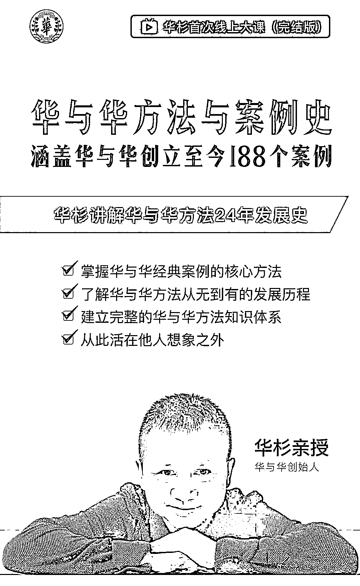

 

 

这一套内容出来，至少都能涵盖“萃取 7 要素”的前六条。

而且我们可以在时间的长河中，看到创始人在“判断原则”和“通用方法”上的初生萌芽、发展和演化。

比如华杉老师讲解“晨光文具”这个案例的时候，就讲到了帮助晨光做终端门店全面媒体化、孔庙祈福考试笔开发等几个核心作品，每个作品会提到当时的时间、客户的问题、市场的环境等案例背景，然后定义我们要解决的课题，提出解决方法和创意方案，最后得出成果。

比如 2009 年上市的孔庙祈福考试笔，就是要解决晨光和真彩、得力等品牌都在做考试笔导致没有拉出差异的问题。项目团队在日本调研时看到祈福类产品，受到启发，再选择中国的“拜孔庙”文化，运用一套“购买理由”的产品创意开发方法，创意产品命名，设计了产品包装、助销道具、广告和宣传物料，从而创造明显优势。

对企业家来说，是编企业史。对政治家来说，是编政治史。对帝王来说，就是编《资治通鉴》。

《资治通鉴》名字由来，就是宋神宗认为该书“鉴于往事,有资于治道”而命名的，这套书把成书之前的一千多年中君臣面对的重大事件、具体情景、问题挑战、君臣决策和结果，以时间为纲，事件为目，把历史串起来，以帮助后世的君王从中学习前人经验。

总之，国有国史，家有家谱，企业也要有企业史、项目史、方法史，这是各位老板从创立之初，就可以积累的数据库。

 

 

**02**

如何复制老板能力？

**1**、无所不用其极，想尽办法传播

萃取的内容，要在公司中想尽办法传播起来，充分的扩散，使得员工充分吸收，进而实现能力的复制。

还有一点好处，就是传播行为，会倒逼内容萃取的行为。

传播的方法有很多很多种，对于老板的经验知识，我建议最好的传播方式有三类：

**1.**在公司管理活动中讲解

**2.**在公司内训体系中授课

**3.**在公司自媒体上发布

这三类传播活动，其实是一种“一鱼三吃”的套路。

公司的管理活动、内训课程和自媒体，都是员工的“学习阵地”，学习的内容都是同一套内容，可以贯穿员工的业务工作、课堂学习和随时回看。

**2**、管理活动，也是学习活动

 

 

每个公司都会有很多管理活动，最重要的是日会、周会、月会、季度会、年会等按照固定的时间周期而召开的会议。

这些会议上，老板可以把自己关于会议上的每一个“问题与挑战”的思考，以及自己的“决策和依据”进行展开说明。这时候管理活动也是学习活动。

*问题与挑战、决策和依据就是“萃取7要素”的第四步、第五步。

比如，每周的周会都有三部分议程，一是同步工作进度，二是集中讨论难题对策，三是分享近期业务中的最佳实践，尽可能让员工们一起参加。

在会上，由员工代表们来介绍当前的业务背景、业务进度、计划的解决方案，以及总结分享自己团队萃取的最佳实践内容。

而老板，以及一些资深员工，可以提出一些反馈建议，尤其要介绍关于“问题挑战”的思考、观点和建议。

往往老板在这个时候，很难马上给出决策，但是老板可以着重讲解自己的“判断原则”和“通用方法”。

在这种管理活动中，其他员工就能从别人的业务实践和老板的反馈中学习经验，因为每个人都很清楚，自己未来也可能会做这样的工作。

这样做，还有一个好处，就是各个团队，都必须阶段性地反思和总结工作，而公司每一个员工可以把这种会议当成学习会。

 

 

**3**、围绕业务线，组织培训活动

随着员工数量增多、业务线增多，经验内容也越积越多，这些内容就可以转化成内部课程，请老板以及一些资深员工进行内部授课。

在公司人数还比较少的时候，内部课程可以围绕几条关键业务线，或者关键业务线的几个关键业务环节展开。

课程顺序就按照业务顺序来排课，一轮轮地“犁地施肥”。

这时候，资深员工可以当老师，主讲“操作工具”。老板就是校长，主讲“公司使命文化历史价值观”和“通用方法”。

在公司人数超过 100 人，甚至超过 150 人之后，员工的学习就必须要新设一个逻辑线，以更好地对照自己的岗位和水平，一步步按图索骥、打怪升级。

这个逻辑线，就是员工晋升阶梯的知识技能要求。

这么干，有个前提条件，就是公司有一套适配现有业务的员工「职涯成长阶梯」，每一级梯子都有对应职级的任职标准，这些任职标准中包括了知识技能的内容描述和掌握程度描述。老板、资深员工们和培训团队，再基于不同职级的知识能力要求一起设计课程。

这些课程主要包括两方面：

一方面来自于不断迭代和新增的萃取内容，即工具、方法和文化历史价值观课程；

 

 

另一方面也来自优秀晋升前辈们的工作成长记录和经验总结，尤其是对基层员工而言，前辈的“通关经验”课程含金量最高、最值得学习。

**4**、在公司自媒体上发布

知识内容积累到一定程度，就不能只存在于公司内部，而要存在于公司外部。因为在外部的传播更加广泛，也更能跨越时空，在社会和行业中传播、保存。

更何况，公司方法案例内容的传播，更能吸引客户、吸引人才，进一步降低企业的流量成本和转化成本。

当一项成果优异的工作完成之后，就可以进入到萃取环节。进过 7 要素整理后，可以用来在公司的公众号上发布，也可以转化成内部会分享、内训课堂小教材等等。

其中最核心的，是公司公众号文章发布。因为公众号更新频率高，还直接对公司外部宣发，最能倒逼项目团队进行内容萃取。

这时，萃取7要素的逻辑可以进行一些微调，更适合放在公众号文章上。这类文章一般有  8 个部分，从前往后分别是：项目整体成果+项目背景+问题挑战+解决方法+关键判断决策+具体动作流程+效果和反馈+总结方法和工具。

**5**、组织考试、比赛和奖励

 

 

刚才说过了管理活动、内训体系和自媒体发布这三种传播方式。

这只是复制知识经验的开端。

作为老板，怎么验收能力的复制效果呢？怎么衡量员工的掌握程度？怎么激励员工呢？

在小公司的日常业务中，员工能力的成长程度，老板是可以尽收眼底的。

但日常观察比较碎片，或者公司变大难以“目测”每个员工，也无法完整放在整个公司的人才沙盘上来验收、衡量和激励。

这个时候，公司就得向学校学习了。

我们看看学校除了讲课之外，还做些什么——可不就是考试、比赛和奖励嘛！

对于各位老板来说：

考试可以和述职、晋升调薪放在一起，按照职级不同，测试不同内容。笔试和口试都可以，越资深的员工，越要进行口试。考试内容，就来自员工对应职级要掌握的知识能力范围。

 

 

比赛，本质上是另一种集体学习的“课程”。比什么呢？就是比每个人的工作成果物，或者说每个人的“作品”。公司可以按照成果物的类别，来划分比赛项目，要求参赛员工讲解方法和工具，再在比赛当天组织全公司观赛，老板在现场点评、打分、反馈。这时候每一位参赛选手，都会精心打磨参赛作品，所有人也都在一起相互学习。

考试、比赛排名靠前的优秀员工，就可以在公司会议上表彰、颁奖，请老板点评发奖，让这些优秀员工收获物质和精神双丰收。

**-------**

以上就是我关于如何把老板能力变成全员能力的分享内容。

评论区：

徐升 : 本文经验，主要来自我工作过的咨询公司。如果你关于文章内容有疑问，或者在员工能力培养上有其他想交流的地方，也非常欢迎和我微信沟通（微信号 xusheng-hx ）。

亦仁 : 上次快问快答，有人问了我一个问题：如何规模化复制亦仁？

我先看这篇文章仔细学习一下。

建泉 : 非常及时的一篇文章，值得反复细品

兴小哥 : 1、对于老板，一定一定要萃取出老板自己的“判断原则”和“通用方法”。

——————

这个观念很棒，很多企业内部沟通问题就在于员工、管理和老板之间的“以为懂”或者“这你都不懂”，而忽略了内部“判断原则”并未去一致化和迭代“通用方法”。

2、最难的是判断原则——因为背后有老板的文化积累、性格特质、价值取向，各位老板只能在每次选择的决策场景下，不断提示、纠正和感召。

——————

这个也是文化类公司很难标准化的重要原因，形成判断原则背后的因素很难具备。所以需要企业文化（非口号）、企业手册、培训、企业价值观和标准化考核等。单纯依靠这些只能算是潜移默化，更直接的就是作者所说的在工作实践中不断提示、纠正和感召。

 

 

目测精华，感谢分享！

徐升 : 感谢大佬回复，有问题可以继续探讨[呲牙]

剑渊 : 【摘要】: 时间节点→具体情境→问题与挑战→工作目的→决策和依据→结果→标准流程。

【思考】: 这个7要素可否作为做一件具体事情的流程方法？

【感悟】:这个共读群提升了生财圈友的参与感，特别是小白。以后自己做社群也要做这样一个小而美容易让大家参与的活动。[强]

海东 : 国内咨询届的王志纲老师、华杉老师，都是笔耕不辍的典范，他们勤于【写作和培训！】

亦仁 : 感谢分享，已加精华。
<!-- split -->
# 【薪酬激励】4篇
<!-- split -->
# (精华帖)(238赞)亦仁：如果把「龙珠」机制用于激励内部团队

作者：  亦仁

日期：2020-07-31

这一两年，社群里面有很多优秀的小伙伴加入我的团队，参与到社群、产品、广告、短视频等各项业务中，比如  等。

我希望慢慢的，把公司变成一个“孵化器”，找到操盘手、提供启动资金与资源、搭建初始团队、给出业务方向与指导，然后大家一起长大，这么多聪明人聚在一起，可以干很多有意思、有价值的事情。

从社群里面加入到我团队的小伙伴，从价值观认同、格局、视野、能力等，都表现的更加优秀。我也决定，以后生财有术社群运营团队只从生财有术社群内部招聘，有兴趣的小伙伴也欢迎联系我。

 

 

这么多优秀的小伙伴加入后，我最近在想，如何营造一种机制和氛围，让每个人的产出更高效，激励大家持续优秀。

今天早上晨会的时候，突然想到一个点，其实社群运营团队内部也可以有一种类似于龙珠的机制。

比如想出并落地一个好活动提升生财有术圈友的体验，每个月复盘积分第一名，负责大航海并拿到很好结果，负责私董会并产出很好的结果等等，以上关键、有效动作，可以拿到内部的龙珠，持有内部龙珠可以参与到社群营收、孵化出的项目等分红，甚至内部龙珠和外部内容可以互相兑换、交易。

这个思路让我很兴奋，我相信一旦种下一颗种子，在时机合适，这颗种子在未来的某一天就会生根发芽并长成大树。

评论区：

Auroraaa : 真好呀！！！

漆菲特 : [嘿哈][嘿哈][嘿哈]

微博@硬核羊哥 : 期待呀，跟着亦仁哥一起成长学习[跳跳]

有霸夫 : 支持

秀儿 : 我来了哈哈～加入生财有术，加入生财有术团队，是我做的最正确的选择之一[呲牙]

光合 : 想一年暴富  来生财有术[皱眉]

晓冬 : 真羡慕加入团队的伙伴啊

鱼丸|亦仁助理 : 想加入生财团队的圈友，可以把简历发给我~还没加我微信生财圈友请加 yuwan280 哈
<!-- split -->
# (精华帖)(177赞)激励有术-谈钱不伤感情，创业团队的薪酬与激励怎么做

作者：  许大范

日期：2021-07-23

 

 

【许范范】激励有术-谈钱不伤感情，创业团队的薪酬与激励怎么做

大家好，我是许范范，一个在生财“一文打天下”出名，却不擅长赚钱的人。

从发第一篇文到现在，不到一个多月的时间，陆续被亦仁大大邀请加入龙珠俱乐部、参加线上私董会、进行合伙人专题分享、飞阅会专题分享，到加入生财私董会，真的备受鼓舞。

先介绍下我自己：

我是一家世界500强区域人力副总，前人力资源咨询公司高级顾问，也是一名职业发展教练，擅长的是团队的选用育留等团队管理的话题。

山东人，性格热情爽朗，喜欢研究人性、打麻将、当红娘，有一个公众号#职业超有范。

亦仁大大给我布置了几篇作业，分别是招聘面试、绩效考核、薪酬激励、晋升发展。

我将它们整理成了这样几个专题：

01 识人有术：创业团队招聘面试

02 考核有术：创业团队绩效考核

03 激励有术：创业团队薪酬与激励

04 发展有术：创业团队晋升与培养

05 沟通有术：创业团队团队性格与沟通

这几个专题也是我未来会系统分享、可以提供咨询交流的方向。

这是之前的两篇分享：

第一篇：识人有术

《（10年人力总万字干货）创业团队如何招募面试到合适的小伙伴》

第二篇：考核有术

《创业团队走向规范化管理时，绩效考核怎么做，才能避免给团队埋雷？》

今天这篇是第三篇，来聊聊如何激励有术，创业团队的薪酬与激励如何做

这篇也是这周生财私董会内部飞阅会专题的分享。

一说到激励，很多人首先想到的都是薪酬，光“分钱”这一个话题，就已经能纠结死个人，更何况激励还不止薪酬一个话题。

激励做得好，公司、老板、团队、管理者、员工纷纷多赢，团队士气高涨，业务突飞猛进，老板心花怒放。

激励做的不好，哪怕是给钱给的多，也依然矛盾重重勾心斗角，骨干离家出走，员工怨声载道，老板四面楚歌。

 

 

那我今天依然尝试用一篇万字长文，努力帮大家解答一些疑惑。

总字数12257，阅读大概需要用时20分钟，将从以下几个维度进行分享：

一、激励的底层逻辑与原则

二、五种激励操作实施干货

（一）薪酬激励

（二）发展激励

（三）工作激励

（四）情绪激励

（五）个性激励

为了方便大家阅读，编辑在了语雀文档，点击下方链接即可阅读。

《【许范范】激励有术-谈钱不伤感情，创业团队的薪酬与激励怎么做》

https://www.yuque.com/docs/share/398af203-9d20-44fc-9465-91153bed595f?# https://articles.zsxq.com/id_6x2octl53hqb.html https://www.yuque.com/docs/share/9ccd4f5d-c269-4240-9808-8df962102463?#评论区：

Alan : 范范出品，必属精品

许大范 : 必属万字长文哈哈哈哈，师兄说的对，分享要坚定～

一只小Po : 先赞后看，良好习惯

芝士快乐天 : 太干了，浏览完全部内容，可以说讲透了非常多管理书籍的精华内容，不同于书上那些纸上谈兵，可以感觉得到都是可落地实操复制的经验，感谢范范的分享！！！！！

嘉庚学长 : 范范出品，必属精品

Sky老思 : 范姐优秀[强]

子见 : 来了~

Tyler : [憨笑]
<!-- split -->
# (精华帖)(126赞)创业团队走向规范化管理时，绩效考核怎么做，才能避免给团队埋雷？

 

 

作者：  鱼丸|亦仁助理

日期：2021-07-14

大家好，我是鱼丸，今天邀请了一位对人力资源和团队管理有丰富经验的嘉宾，来给大家分享一个创业公司都非常头痛的问题：

到底怎么做绩效的考核，才能真正发挥作用，而不是引发各种新问题？

相信这个话题，很多创业者和管理者会很感兴趣，我们这一期的「生财合伙人」嘉宾@许范范  老师就会做一个详细的分享。

许范范老师可能有些圈友已经读过她的文章了  https://t.zsxq.com/muvB2RR  ，她是一家世界 500 强区域人力副总，前人力资源咨询公司高级顾问，也是一名 10 年的职业发展教练，最擅长的是人力资源、团队管理。

她在文中说到：

“我见过很多创业公司，考核结果只有一个应用目的，就是分钱。也不能说有错，但就是有点浪费，绩效考核的应用途径远远不止分配奖金这一个，其实考核结果在人才选用育留的各个环节，都可以有效应用，包括奖金分配、晋升淘汰、任务选择、荣誉表彰、经验分享、人才盘点、人员招聘、优化考核等。”

那么怎么落地呢？她在这篇分享中给出了一些思考框架和工具，干货不少，可以做笔记好好研究，比如：

 

 

“整个创业公司和团队，要聚焦的目标是什么？如果这里没有梳理清楚，后续的所有工作都没有意义。创业团队的老板，要对此保持清醒和坦诚，任何想要先跳过这一步，思考执行下面那些相对容易步骤的想法，都是考核的虚假动作。”

“以财务指标为最终目标，通过客户指标、运营管理指标、团队学习成长指标逐步推演达成，本质上是关于公司战略因果关系的不断推导。”

“因为基于「承诺与一致」的心理，自行设定的目标与承诺，更有可能在未来工作中激发一致性的行为。”

“为什么设置这个岗位，一般可以用「为***群体提供***的服务/支持，以解决/提升****」这个公式来描述。这里最容易出现的误区，就是错把职责当成岗位价值，作为考核指标。”

……

来，开始她的分享。

目录

一、考核到底有哪些利弊

二、绩效考核如何操作

1\. 考核指标如何设置

2\. 考核依据如何收集

 

 

3\. 考核结果如何出具

4\. 考核结果如何应用

5\. 如何对考核结果进行反馈辅导

三、总结

---正文---

大家好，我是许范范，被戏称为生财「一文打天下」的人，在生财发表的第一篇也是唯一一篇文，就被加亦仁大大加了精华、邀请加入龙珠俱乐部、参加线上私董会。

但我并不擅长赚钱。我是一家世界 500 强区域人力副总，前人力资源咨询公司高级顾问，也是一名 10 年的职业发展教练，最擅长的是人力资源、团队管理。

最近才发现，我擅长的领域对生财的很多小伙伴也是有价值的。《创业团队如何招募面试到合适的小伙伴》这篇文，有近百位圈友加了我，好多人拍照给我看几十页的万字图文全部打印了出来，让团队研究学习，还是彩印。我真的无比感动，深受鼓舞。

亦仁大大说，不仅是面试，绩效、薪酬、员工发展，很多这些团队管理的话题，圈友们都很急需。或许，我可以帮生财圈友们管管后院儿，成为大家团队管理的大内总管。

那今天给大家分享一个常常面临的话题：绩效考核管理。

和很多带团队的龙珠俱乐部圈友们交流过，绩效考核这个话题让人头秃：考核有什么利弊？到底要不要考核？什么时候考核？考核谁？考核什么？怎么考核？考核完了怎么用？

 

 

那我今天依然尝试用一篇万字长文，努力帮大家解答一些疑惑，总字数 10119 ，阅读大概需要用时 25 分钟，将从几个维度进行分享，接下来，先从考核的利弊开始讲起。

一、考核到底有哪些利弊

考核往往发生在创业团队业务规模、人员规模上了一定体量，复杂度提升，超出了创业公司老板能够一眼衡量、评估的范围，靠人治已经行不通了。

而无法衡量就无法管理，当公司迈入规范化管理阶段，绩效考核就是解决目标传递、衡量评估的问题。通过绩效考核，对团队进行过程管理，以考核作为抓手和指挥棒，辐射更大、更系统的管控范围。

考核目标是管理员工愿不愿意（态度）、能不能行（能力）、允不允许（机制）三个层面，从而达成组织能力提升、业务目标达成的效果。

绩效考核让很多创业团队负责人、团队成员闻风色变过，因为如果做得不好，确实徒增忧患，具体会导致这样的几个方面的问题。

**1. **绩效考核会导致的弊端

**1**）聚焦短期利益，忽视长远利益

绩效考核很容易聚焦于当下看得见摸得着的指标，而对团队未来有深远影响的、短期内难以明确见效的部分常常被忽视，严重的时候甚至会误导整个团队的方向。

 

 

比如有些公司，考核指标核心都是当下的营收、利润，而忽略甚至损害了长期用户留存、客户满意度等会带来的长远利益的指标。

**2**）重视业务前线，忽视支撑的中后台

能够个团队直接带来业绩和营收的销售、商务等，在绩效考核中会被倾斜，而负责产品研发、质检、运营等中后台，常常会被忽视。

在老板看不见的地方，中后台搭建的资源投入、团队积极性、话语权等，会随着考核导向极受影响，在业务竞争力的打造上埋下巨坑。

**3**）破坏公司氛围，资源抢夺部门墙高垒

在短视的考核压力下，业务部门可能会相互拆台，想方设法从公司整体利益中为自己部门捞资源、捞支持、捞好处。信息、资源、经验不再共享，形成一个个互相防备、猜忌的秘密基地。

中后台支持部门因为没有功劳可凸显，只能聚焦于不出错，于是处处照本宣科，官僚主义开始滋生。

**4**）极力逃避责任，破坏奋斗创新精神

在唯考核至上的环境中，大家开始只关注切身利益。一旦出现问题，第一时间不是解决问题，而是想方设法逃避推脱。管理者也倾向不在容许团队创新，创新意味着承担风险和出错。

**5**）团队培养短视，忽视长远梯队建设

 

 

部分老板下面的管理者，容易只关心绩效达成也眼前利益，不再重视员工的感情，而是作为完成绩效的机器，对员工带着批判和审视的眼光，对照考核要求抓小辫子。员工压抑主观能动性，严格遵守考核要求，只付出手不付出脑和心。

是不是挺悲伤的？我就遇到过一个创业的朋友，上面绩效考核的坑几乎全踩中了。进行绩效考核后，公司都关注销售额去了，奖金高啊，其他部门好多人也提出想要转销售。

产品的质检懈怠了，结果出了很大的纰漏，损失了一笔巨额赔偿，而相关部门却都在跟她解释推责，销售线和质检线的老大在她的办公室，当着她的面互相指责骂街。

她说那一瞬间，她觉得自己一定是脑子被驴踢了，才会想要搞绩效考核，这考核做了还不如不做。真的都是绩效考核的锅么，是不是不搞绩效考核就不会导致这些弊端了？别急着下判断，我们再来看看如果绩效考核做的好，会有什么利好呢？

**2. **绩效考核会带来的利好

**1**）目标聚焦层层分解到岗到人，有效落地

随着团队人数越来越多、业务越来越复杂，超出老板的管理半径，而且不再能只看结果，必须也对过程进行规范化的管理，绩效考核是一个必然的过程。

绩效考核是一个聚焦工具，创业团队很容易有很多想法、什么都想试一下，导致无法聚焦，而绩效考核可以保证相对集中公司的方向，各个群体都能马车头朝向一个方向。

绩效考核是一个沟通工具，将公司的目标层层宣导传递下去。绩效考核是一个落地工具，通过有效的分解方法，可以将目标按照公司-部门（或小组）-岗位-人，层层分解到岗到人，有的放矢。

**2**）聚焦组织能力提升，不再纯依赖牛人

 

 

绩效考核一般都会协同推进公司规范化、标准化的进程，通过系统规范的目标设定、考核推进、反馈辅导等方式，能够有效推进公司制度建设、经验传承、规范流程等，实现组织能力的聚焦提升，组织能力成为公司新的核心竞争力，而不会因为个别牛人的进来、离开、状态好不好大起大落。

**3**）共同利益绑定上下同欲，精诚合作

考核目标重视共同目标，考核目标间强关联、强绑定、强协同，考核结果的应用也将共同利益设定成强绑定，部门和部门间、员工和部门和公司间，就能激发同舟共济、携手共进的状态。

**4**）作为激励晋升依据，公平公正鼓舞士气

绩效考核可以规避吃大锅饭的问题。考核结果作为物质激励依据（工资、奖金、期权、福利）、晋升激励依据（提拔、调整、降职、淘汰）、树立标杆依据（荣誉、表彰、站台），看得见争得到的、客观公平公正的考核结果，会让员工更有预期，鼓舞士气。

**5**）作为能力提升牵引，倒逼人才梯队建设

有了考核的指挥棒，员工的能力提升更有聚焦的方向。有效考核指标的设定，老板下面的管理者，管理团队的能力会得到系统历练，兼顾长短期目标，培养后备板凳队员，推动人才梯队建设。

是不是又有点心动了？考核利弊之间，一正一负，对公司业务战略、组织效能、团队效能等的影响，天差地壤。

二、绩效考核如何操作

 

 

怎么能让考核尽可能发挥价值，避免弊端呢？取决于5+1的影响因素。

5是指绩效考核指标的设置、考核依据的收集、考核结果的出具、考核结果的应用、考核后的反馈与辅导。1是指管理者的团队管理能力。

**1. **考核指标如何设置

这里最重要的，是如何平衡业务目标与个人目标、长期目标和短期目标两对矛盾。

有些公司图省事，或者管理层自己没想清楚，就想把责任下沉，让员工自己去想，自己个自己定考核指标，挺多公司干过这个事情。给大家举个例子。

我之前在咨询公司的时候，就见识过一家公司，他们的绩效考核全部都是自下而上的。

怎么个自下而上法呢，让员工自己报目标，过程中可能领导和员工之间拉锯战几次，然后层层往上汇总，汇总到部门于是部门的考核指标也有了，再汇总到公司于是公司的考核指标也有了，最后就这样决定了所有人、部门和公司每个年度的目标。

这就是一种挺可怕的考核方式，管理层是简单省事了，但整个公司缺乏统一的导向，更缺乏衡量个人设定的指标、数据的有效性，而无法衡量就无法管理，绩效考核也就形同虚设。

指标的设定是最关键的一个步骤，这里有三大类的指标需要依次想清楚，并不是上来就是每个人的考核指标是什么。

我在上一家平台公司，领导让我重新设计员工绩效考核体系的时候，我就跟领导说那公司的战略部门要再一次理顺公司的考核体系，而且人力资源部要全程参与。

 

 

因为公司的考核体系、部门的考核体系，是员工考核体系的前提，所以要依次分析设计。并不是上来就是每个人的考核指标是什么。

**1**）创业公司**/**团队的考核指标是什么

整个创业公司和团队，要聚焦的目标是什么？如果这里没有梳理清楚，后续的所有工作都没有意义。

创业团队的老板，要对此保持清醒和坦诚，任何想要先跳过这一步，思考执行下面那些相对容易步骤的想法，都是考核的虚假动作。

对于创业公司，如果业务体系已经比较复杂化、规范化、过程有很多量化指标可以评估、可以按部就班推动，可以使用 KPI 的考核方式。

如果无法那么量化、依赖团队的主观能动性，可以使用 OKR （目标与关键结果）的考核方式，大部分创业公司比较推荐 OKR 的方式，虽然有很多人也都建议过 OKR 不适用于考核，但从实际应用来看，关键结果的部分也是可以有效作为指挥棒指引团队的，指挥棒本身就可以是一种考核导向。

那问题就来了，怎么梳理出公司的考核指标呢？推荐 2 个工具。

第一个工具：战略平衡记分卡

分别从财务角度、客户角度、运营管理、学习成长四个维度，梳理公司核心目标和关键指标。平衡记分卡可以有效平衡创业短期目标和长期目标、财务类目标和非财务类目标，两对经常产生矛盾的目标。

 

 

以财务指标为最终目标，通过客户指标、运营管理指标、团队学习成长指标逐步推演达成，本质上是关于公司战略因果关系的不断推导。帮大家梳理了一个样例如下：

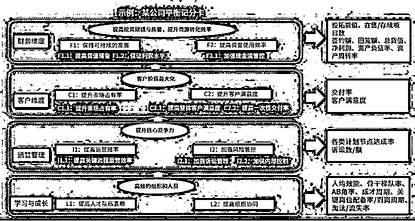

第

第二个工具：商业模式画布**9**要素

从价值创造、客户管理、资产管理和财务管理四大界面，包含价值主张、客户群体、客户关系、关键业务、重要合作、核心资源、渠道通路、收入来源、成本结构九大关键要素。

这是我比较推荐的分析工具，在网上你也可以找到大量的滴滴、樊登、小红书等各种各样企业当初他们在创业阶段的商业模式画布。帮大家梳理了一个分析的核心问题如下：

 

 

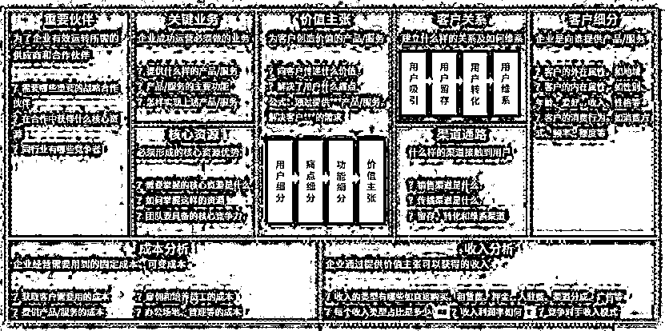

平衡记分卡和商业模式画布，其实都相当于是给到创业公司尤其是老板一个仪表盘。如果把公司业务的开展看做一次飞行航程，仪表盘就是让很多过程和结果指标可视化、可衡量、可预判。

防止只关注速度（参考公司利润）这样的指标，还能够时刻关注到油耗、油料、高度、剩余里程等这样的指标。

公司的目标聚焦到关键的重点，抓住了核心的影响 80% 业绩的 20% 的关键指标，绩效考核的拆解才有了核心依据，确保方向不偏离。

**2**）部门**/**小组的考核指标是什么

部门/小组的考核指标是从公司指标中拆解而来。在这个过程中，我遇到过的最大阻力，往往也是各家公司通常都会遇到的阻力，就是从公司目标到部门/团队目标如何拆解？如何保持不同部门/小组间的协同？如何让各部门/小组认同？

 

 

建议可以通过部门/小组 OKR 研讨会的方式确认。当时我们采取的也是类似的方案。当时尽管公司目标出来之后，公司的负责人基本上就已经把各部门的指标也都想好怎么分配了，但我们仍然建议组织各部门/小组负责人用研讨会的方式确认，并且引导他们自己设定 OKR 。

因为基于「承诺与一致」的心理，自行设定的目标与承诺，更有可能在未来工作中激发一致性的行为。不用要求一定要一次性做到完美，对于创业公司而言可以不断按照 D、不胜任 C、待发展 A、优秀的原则，小步快跑、阶段回顾、持续迭代。

以下为大家提供一个示例：其中目标和关键结果，就是部门/小组的考核指标，同时也是该部门/小组负责人的考核指标。

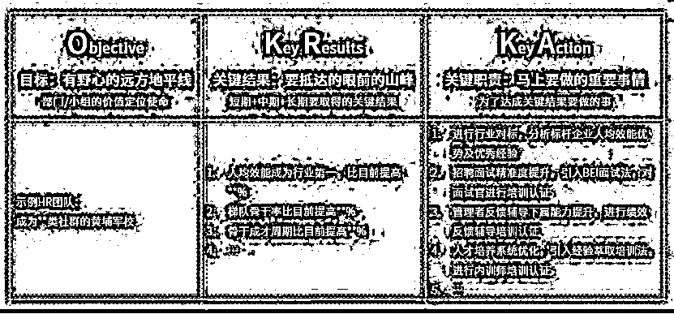

对于目标设定：

强调方向明确鼓舞人心，有时间期限（考核周期），与公司业务价值充分结合，由独立的团队来执行目标。

对于关键结果的设定：

 

 

要具体的、量化的、有挑战性的，要蹦起来才能够到的，同时一定要上下左右对齐一致，充分认可；只表述对目标有关键影响的关键项结果而非全部罗列，基于结果而不是隔壁的职责；同时每个结果要有明确的责任人。

**3**）岗位**/**个人的考核指标是什么

当公司、部门/团队的考核指标完善后，岗位/个人的考核指标才能有效进行，也会更加聚焦、精准、高效。岗位和个人的考核指标也依然可以采用 OKR 的梳理原则，其中目标，也就是岗位价值的部分。

建议从 2 个层面进行考虑，一个是岗位价值，一个是角色价值。

第一：岗位价值

比较好理解，为什么设置这个岗位，一般可以用「为***群体提供***的服务/支持，以解决/提升****」这个公式来描述。

这里最容易出现的误区，就是错把职责当成岗位价值，作为考核指标。

举个例子，如果一个人的岗位是苹果果农，他的最终考核指标就是苹果成熟个数和成熟率，为了完善过程结果考核指标，可以倒退追加苹果结果个数、结果率、苹果树成活棵树、成活率等。

而这个过程中的栽树、松土、施肥、捉虫、授粉等都只是职责，并不是岗位价值。

第二：角色价值

这个之前很多创业团队可能没有考虑过，创业公司一般人数不多，很多人员其实承担这不同的角色价值，推动团队的工作优化。

 

 

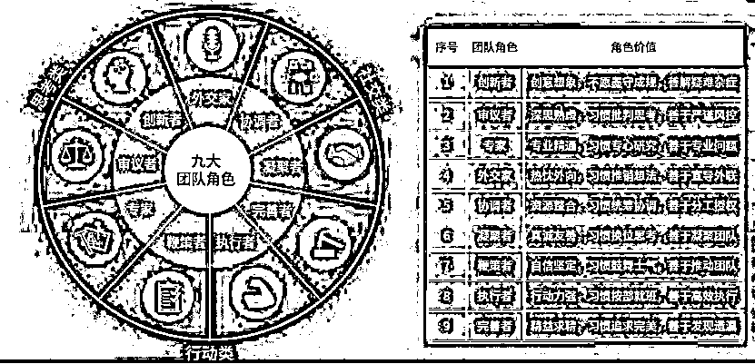

除了以上两个维度关注的工作产出，还需要在考核中兼顾人才梯队建设、公司价值观的传递宣导，建议普通员工的考核指标可以如下设置。

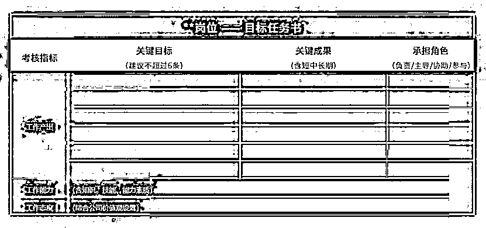

这个目标任务书可以由部门/团队负责人，和岗位员工共同沟通确认，逻辑和部门/小组考核指标制定研讨会是一致的。

 

 

如果在研讨的过程中，发现很难梳理出岗位的核心目标和关键成果，那很有可能是负责人和成员对考核都尚缺乏经验，可以尝试采取这样两个方法。

第一个方法：借鉴优秀公司

寻找榜样公司同类型业务的同类型岗位，他们的考核指标是怎样的，先抄再超，借鉴并没有什么不好，先模仿再在后续工作中逐步寻找最适合自己的考核指标。

第二个方法：研究优秀个体

拆解那些优秀的内外部员工，分析他们是因为达成了什么样的关键目标和成果，具体做了什么，才取得了成功，也是一种非常行之有效的方式。

**2. **考核依据如何收集

在考核依据这里最大的两个坑，一定要给大家提醒一下。

第一个坑：考核依据收集缺乏统一归口部门或岗位

如果考核的依据缺乏说服力，考核结果就必然容易被质疑。考核也就依然起不到有效的作用。这对于组织考核的团队有很大的挑战。

应该尽可能避免纯主观性收集依据，量化的考核指标，可以由公司设置统一的部门或岗位进行统计梳理，避免扯皮，公司大一点的可以设置战略管理部、计划运营部或者总经办，小一点的可以设置一个计划管理岗，或者就是综合管理岗，来统筹管理这件事。

这样的话所有的考核数据归总，才能够横向纵向来齐，防止考核依据的数据收集过程中各部门信息不对称、数据对不上等问题。

 

 

如果涉及到一些主观的考核指标，如工作态度、价值观、跨部门协调这类指标，就应该基于 BEI 行为事件的方式，有任务背景重难点、员工角色与行为、行为结果等的观察，才能确保考核依据的员工信服。

如果团队逐步扩大，也建议在考核周期结束后，通过填写工作总结方式进行考核依据收集。样例如下，可以根据需要在此基础上增减。

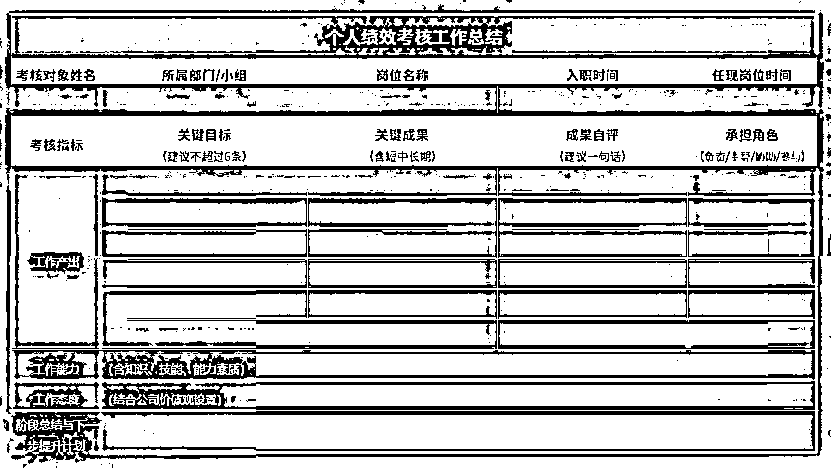

第二个坑：用** 360° **互评的方式作为部门和岗位考核依据

早些年很多公司都干过这件事，为啥呢，因为不得罪人啊。大家彼此之间互相考核，互为考核依据，考核结果是什么就不跟哪个具体的人有关系了，大家说了算。

我也经历过这样的考核方式，最终的结果是什么呢，大家都不敢红红脸了，不敢跟人产生争执，意见不一致的时候憋着，反正公司又不是我的，最后公司就变成了老好人的氛围，敢红脸说真话的人都走了待不下去。

 

 

实际上， 360° 互评现在已经很少用在绩效考核方面了，考核依据的收集虽然有挑战，也不建议图省事免责就用互拼的方式。  360° 目前已经主要用于反馈和发展，而非考核。

**3. **考核结果如何出具

这里创业公司经常会出现的一个坑，就是评分。举个例子，之前有个创业公司的朋友跟我，他们公司考核结果是评分，结果发现一个部门比一个部门打的分高，满分 100 分，有个部门 10个人，人人都是 95 分以上，光 100 分就有 3 个。

我了解他们公司的考核体系后，觉得这个不能怪那些部门负责人，毕竟要带人干活的是他们，他们更要关注团队以后干活的积极性，如果公司没能给到相应的要求和抓手，必然一个比一个分高，不然凭啥隔壁部门都是 90 多分，我们部门都 80 多分啊。

所以在考核结果这个部门，公司也是要提供规则的。创业团队一般不建议太复杂的打分方式，相对于打分的方式，更建议 S卓越 \ A优秀 \ B \ C待发展 \ D不胜任 5 级强制分布考核法，团队可以结合自身需要看是否强制分布。

考核结果出具规则，一般都会根据二八原则，优秀及以上占比 20% 左右，待发展及以下占比 20% 左右。

团队小的时候，可以整个团队强制分布；团队大的时候，可以以部门/小组（人数大于  10 ）为单位进行强制分布。

 

 

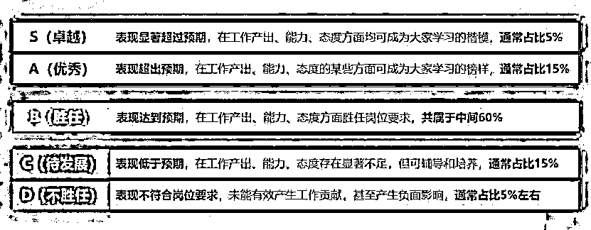

根据不同阶段的业务发展需要，如业务进展良好希望鼓励团队，可以提高优秀及卓越的占比。如果业绩不佳希望鞭策团队，甚至淘汰一部分表现不佳的员工，可以提高待发展及以下的占比。

又或者鼓励个人与团队共荣辱的角度，可以根据部门/小组的不同考核结果，设置不同的强制分布比例，如部门考核结果为 A优秀 / S卓越时，部门可增加员工 A优秀 / S卓越比例，减少或不评 C待发展 / D不胜任，反之亦然。

如果有部门/小组人数过多，如超过 30 人，有些部门/小组的管理者，希望对团队中「胜任」部分的成员，也进行更精细化的区分，从而使得奖金分配、晋升发展等更有区别性，可以再提供 B+ / B- 的区分度。

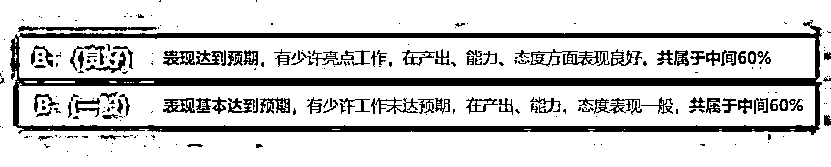

**4. **考核结果如何应用

 

 

我见过很多创业公司，考核结果只有一个应用目的，就是分钱。也不能说有错，但就是有点浪费，绩效考核的应用途径远远不止分配奖金这一个，其实考核结果在人才选用育留的各个环节，都可以有效应用，包括奖金分配、晋升淘汰、任务选择、荣誉表彰、经验分享、人才盘点、人员招聘、优化考核等，依次介绍一下。

**1**）奖金分配

这里最大的坑，就是绩效考核和奖金的分配规则不清晰，原本要公平公正的绩效考核，又会被人揣测为暗箱操作。

我就遇到过一些公司，绩效考核和奖金分配的原则上写着「酌情依据绩效考核结果分配奖金」。你说什么叫酌情？让员工怎么想？怎么信服？

如果考核体系刚运行不久，不太放心考核的客观性，不敢把全部奖金都和绩效考核挂钩，那可以把奖金分成两个部分，一部分是绩效奖金，设置为与绩效考核直接挂钩；还有一部分是专项奖金，可以跟营收、利润等明确挂钩好评估的指标来，设置阶梯式提升比例，形成一个奖金分配的双重保险。

其中和绩效考核结果直接挂钩的绩效奖金，建议创业公司可以设计的不用太复杂，最常用的系数的方式，这也是我之前设计绩效考核体系中最常用的方式，举例如下。

 

 

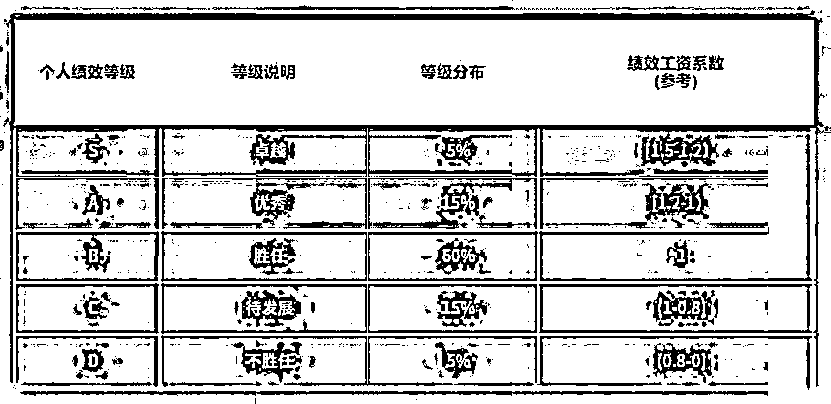

其中绩效系数影响的奖金，是绩效工资的部分，而非基本工资。系数可以上下浮动多少，一方面要结合公司的人工成本测算，另一方面要结合不同岗位对公司业务影响和本身岗位性质略有调整。

**2**）晋升淘汰

可根据考核评级，设置晋升、淘汰要求，年终绩效考核或者技季度考核连续 2 次为 S卓越获得晋升与加薪、 A优秀可以加薪、 C待发展降职或降薪、 D不胜任淘汰等。

在部分管理类岗位竞聘中，也可以设置考核要求作为资格门槛。

**3**）任务选择

如 A优秀 / S卓越  的员工，可以有资格承接公司标杆项目、开拓性项目、高利润项目等等，甚至有机会再新赛道上拿着可业绩兑现的股权。

C待发展 / D不胜任需强制性服从分配。

 

 

**4**）荣誉表彰

对于 A优秀 / S卓越的员工，进行仪式感的荣誉表彰、先进评优、榜样故事撰写等，立标杆重点进行行为事迹宣导，不要纯基于个人，一定要详细表述做了什么事情、什么样的行为，才被取得好成绩和表彰。

还有针对团队、部门，甚至公司，每当有一些关键的、标志性的成果，都可以尝试一些仪式感的庆祝仪式。

我见过一家创业公司，在公司准备了一个系着大红绸的铜锣，每当有人完成自己的关键成果，就可以去敲响那面铜锣，公司会用拍立得拍下来，贴在旁边的墙上，写上是完成了什么挑战。敲响那面铜锣成为了很多人都期待的荣誉。

**5**）经验分享

组织 A优秀/ S卓越优秀经验分享，要将大牛的能力及时沉淀为团队、组织的能力。

创业团队要逐步摆脱对大牛的强烈依赖，防止因大牛情绪和业绩的波动极大影响公司，最有效的方式就是将大牛的经验沉淀萃取，也是对团队进行培养发展的最有效方式。

C待发展 / D不胜任的情况，也可以组织小范围的负面清单复盘。

**6**）人才盘点

对于公司和管理者而言，盘人的习惯和频率，应该和盘钱是一样的。

通常可以用「绩效——潜力」九宫格的方式，来盘点团队成员，以时时警惕保证人才队伍对业务的支撑。

结合盘点的结果，及时调整人才选用育留策略。

 

 

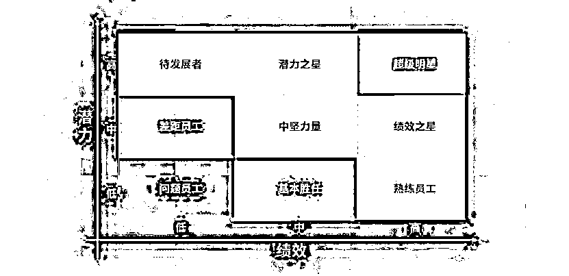

**7**）人员招聘

考核结果也同样可以应用于人才招聘策略。一方面结合考核指标，可以调整人才的招聘要求，尤其是冰山以下不易改变的性格、价值观（驱动力）部分。

我就见过一家公司，他给出纳岗的价值观考核要求是坐得住、有耐心，但是招聘的时候对所有的岗位要求都是有野心、勇于挑战，这显然是相互矛盾的。

另一方面结合考核结果和人才盘点结果，也可以及时调整招聘策略，补足团队短板、引入鲶鱼效应成员等。

**8**）优化考核

还有一个常常被忽略的应用，就是每次绩效考核结果出具后，也应该对照团队、公司目标达成情况，再次复盘绩效考核体系的合理性、有效性，不断迭代优化绩效考核体系，尤其对一些深处敏捷行业的创业公司尤为重要。

 

 

**5. **如何对考核结果进行反馈辅导

这里最大的坑，就是很多公司考核完出了，结果出来了应用了就直接结束了，员工对于考核结果一脸懵逼，好或不好都不知道为什么。

考核是管理工具，而不是目标。最重要的是让员工知道什么样的行为是好的，要鼓励的。什么样的行为是不好的，为什么不好，正确的行为是什么，要怎么调整提升，否则考核就没有太大的价值和意义。

我遇到过好一点的公司，会跟管理者要求说要进行绩效反馈，但反馈什么、怎么反馈、怎么和员工沟通，又是修行看个人、全各凭个人本事。结果反馈了还不如不反馈，和员工的矛盾反而跟深了，员工一边哭一边吼「你凭什么说我不努力，你有问过我经历了什么吗」，当场拍桌子走人。

所以考核后，不仅要安排管理者进行一对一反馈辅导，更要提前对管理者也进行反馈辅导的培训。

绩效反馈辅导是一个对管理者非常有挑战性的工作，反馈辅导的好士气大振，反馈辅导的不好分分钟军心不稳、骨干流失。

**1**）提升管理者反馈辅导意愿

管理者对下属的反馈辅导，也同样面临可不可以、愿不愿意、能不能够的问题。

 

 

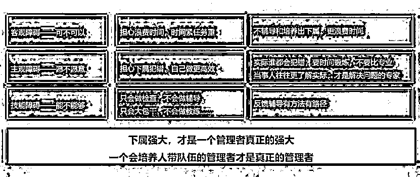

**2**）提升管理者反馈辅导技能

管理者对下属进行反馈辅导的时候，其实也经常会遇到很多棘手的情况，也要培训他们相关技能。

分享几个绩效反馈辅导实用技巧。

第一：基于行为和事件进行反馈

 

 

馈行为及行为评价，也一样是基于 BEI 行为事件沟通法，这个技巧我们之前在分享精准面试技巧的时候分享过。

千万不要只有主观评价，比如下面这些描述都是巨坑：

我觉得你沟通能力不太行需要提升；他们好几个人说你沟通表达能力不太好。这种表述都只能激发矛盾和逆反，即使你是夸奖的「你沟通表达能力很强」，听起来也像是场面话不太真诚，一定要基于行为来反馈。

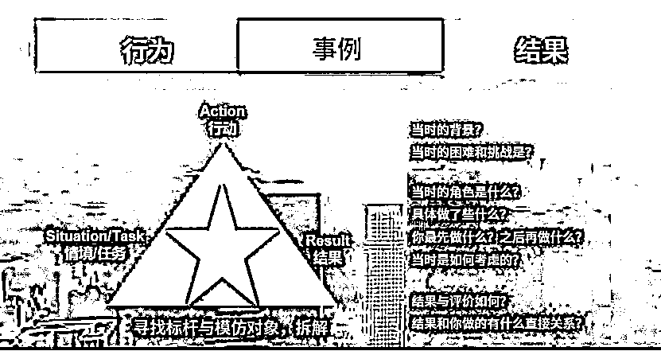

可以让对方分享自己的经历和典型事件，也可以描述你观察到的事件，他的角色、行为，行为产生的结果和影响，如果有必要还可以给他对照拆解一个标杆人物的事件和行为。

这样会非常有说服力。

第二：辅导个人能力提升和职业规划

 

 

这里要运用的能力和技巧就比较多。比如基于大五性格职业优势模型，帮他分析个人天生的优劣势。

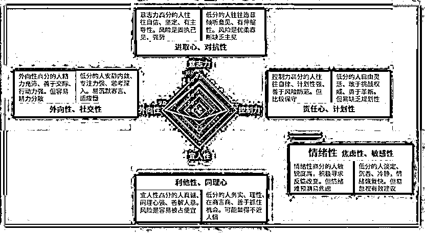

能基于职业锚驱动力模型，分析员工的职业动力在哪里，看重什么，负责什么样的工作最适合，近期表现与驱动力是否被满足之间的关系。

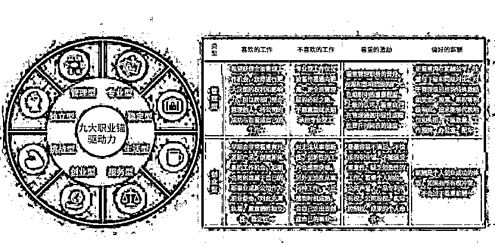

 

 

基于 GROW 模型帮他梳理下一步的提升计划，能够帮助员工一起探讨目标设定、现状差距、选择方向、行动计划等，并在过程中进行有效跟进和辅导支持肯定；基于能力意愿矩阵，和下属探讨对他下一步的管理策略等。

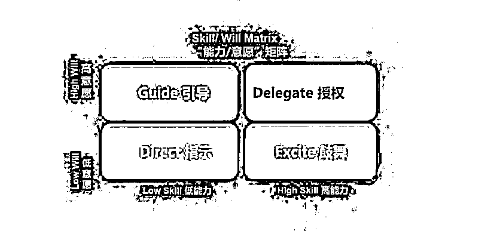

也可以不拘泥于工具，管理者也可以寻找最适合的方法，来辅导下属成长。

三、总结

绩效管理其实是非常挑战管理团队的一个综合能力。因为话题会涉及到业务规划、公司愿景、公司价值观、员工岗位适配、培养发展、激励保留、员工性格驱动力分析、矛盾冲突分析解决等一系类问题。

绩效考核体系设置的再好，最后都需要管理者去落实，因而管理者的能力，也是绩效考核效果的关键。

需要对管理者提前进行赋能，包括但不限于：

 

 

1）  公司业务目标、发展愿景、阶段重点、企业价值观等，管理层需达成一致。

2）  不同部门/小组核心价值、关键重点、如何协同，管理层需要精诚合作。

3）  不同岗位的岗位价值、岗位职责、考核要求，相应管理者要清晰明确。

4）  针对性的绩效反馈辅导能力培训，如管理反馈时负面情绪、建设性反馈方法等，管理者要掌握到位，而且绩效反馈辅导不应该是只有针对考核结果，日常的工作行为也同样需要及时的反馈辅导。

5）  员工职业发展规划的技能，如优势定位、成长地图、培养发展等，管理者要充分擅长。

6）  其他：管理者自身领导魅力、管理层彼此之间的磨合、表率作用、对人性的洞见、对业务流程他提效管理等等。

这些都会影响绩效考核最终的实际效果。

绩效考核是一件路漫修远、任重道远的事情。团队小的时候，往哪里跑喊一嗓子可能就好了，即使方向错了再喊一嗓子可能就回来了。

但当团队大起来、业务负复杂起来，几十人数百人甚至上千人的冲锋陷阵，指挥棒便必须随之迭代升级，让方向目标、关键结果更加聚焦、系统可控。

对于绩效考核体系的搭建而言，不必第一次就追求完美，在执行的过程中不断复盘优化迭代是可能是更好的选择。在绩效考核这件事上，小碎步跑，也会很快。

我是许范范，会持续和大家分享人力资源、团队管理的相关话题，也很想知道你的创业公司遇到了什么，说不定我们可以碰撞探讨一下，欢迎找我交流。

 

 

P.S. 如果你也想在生财有术专栏分享你的经验和认知，请点击链接

http://form.shengcaiyoushu.com/f/HA1G1g  填写表单，我们会陆续邀请有赚钱相关经验和案例的嘉宾做分享。如已填写表单请忽略。

评论区：

鱼丸|亦仁助理 : 感谢  老师的分享，大家如果有什么问题。可以在评论区留言~ figo : [呲牙] 我来打call

许大范 : 亦仁大大给我定的4个人力专题作业，  这是第二个专题。除了聘面试、绩效考核，后续还会分享薪酬与激励、晋升与发展，有任何人力资源和团队管理的相关话题都可以探讨哈~~

王燕楠Nancy : 最近正在烦恼这方面的，太及时了

许大范 : 哈哈哈做你的及时范儿~

于源 : 马克

兴小哥 : 给范范老师打Call

昕爸乐 : 打call
<!-- split -->
# (精华帖)(98赞)发展有术：创业团队的晋升发展体系怎么做，才能激励团队防止骨干流失

作者：  许大范

日期：2021-08-06

大家好，我是许范范。

发了三篇文章，拿了三颗龙珠，被认可的感觉真的很开心。

 

 

但同时也在反思，前面三篇撰写的方式，是否是最优的、适合消化的。

虽然做到竭力干货满满、系统全面，但是否适合大部分人理解呢？陆陆续续都很多带团队的创业圈友来来咨询我一些创业团队管理的问题，想要的也都是一些针对性的、聚焦的解答。

所以写第四篇，我反而更慎重了，想要换一种分享的方式。

我尝试以把晋升发展，拆分成大家最关注的7个问题，以问答和案例的方式来写，这样针对性、消化性、可读性可能都更强一些。

循例先介绍下我自己。

我叫许范范，是一家世界500强区域人力副总，前人力资源咨询公司高级顾问，也是一名职业发展教练，很荣幸成为生财私董会成员，提供团队管理和人力管理咨询。

山东人，性格热情爽朗，喜欢研究人性、打麻将、当红娘，有一个公众号#职业超有范。

这是之前分享的3篇精华帖合集：

第一篇：识人有术  《（10年人力总万字干货）创业团队如何招募面试到合适的小伙伴》   

 

https://wx.zsxq.com/dweb2/index/topic_detail/414114251481148第二篇：考核有术  《创业团队走向规范化管理时，绩效考核怎么做才能避免给团队埋雷》

https://articles.zsxq.com/id_6x2octl53hqb.html  第三篇：激励有术《谈钱不伤感情，创业团队的薪酬与激励怎么做》

https://wx.zsxq.com/dweb2/index/topic_detail/818584281585552

今天要分享的是第四篇

发展有术《创业团队的晋升发展体系怎么做，才能激励团队，防止骨干流失》

我将晋升发展拆分成【**7**个最常见的问题】，以问题**+**案例故事**+**建议方案的形式来分享，你可以根据你关心的问题挑着来看。

问题一：需不需要设置晋升发展通道？

问题二：团队到什么阶段可以适合设置晋升通道？

 

 

问题三：通常有哪些晋升通道？我适合怎么设置？

问题四：晋升通道应该包含几个级别？怎么平衡不同通道级别？

问题五：如何评定哪些人是什么级别？评价标准？

问题六：有了评价标准如何实施操作？谁来评价怎么评？

问题七：员工不认可晋升评价结果怎么办？

为了方便大家阅读，编辑在了语雀文档，点击下方链接即可阅读。

https://www.yuque.com/docs/share/796b00aa-c51b-4fe3-9075-e51c2487e09b?#  《【许范范】发展有术：创业团队的晋升发展体系怎么做，才能激励团队防止骨干流失》

评论区：

西西 : 范范🐮

许大范 : 最近高产🐮

Sky🏹（表哥） : 给私董会大佬打call

许大范 : 我老公figo是盖哥粉丝，耳朵都磨出茧了哈哈哈

何友澜 : 属于篇篇龙珠帖

德力 : 有收获～感谢分享[强]

许大范 : 梦想是要有的～

许大范 : 德力最近上星球的频率好像变高了哈哈哈

 

 
<!-- split -->
# 【团队管理】7篇
<!-- split -->
# (精华帖)(849赞)亦仁：给大家分享几点 Y 老板的管理心得，阿米巴模式+人人都要当妖怪价值观

作者：  亦仁

日期：2021-07-21

今天有一个生财私董会的老板，来拜访生财团队，我称他为Y吧。

每年营收和利润也不低，聊了几个小时，我很受启发，记录了几点，给大家分享下。

**1. ** 近2000人的团队，采用阿米巴合伙人模式，各自负责不同的业务，这几百个合伙人，按各自业绩分红，大多数合伙人基本都是从一线员工成长起来的。

老板Y呢，基本不管业务，经常出来找其他生财私董聊天，参加私董饭局，我问他现在主要在干什么？

他说，主要是找新项目机会和设计机制。

当他发现了生财有术社群之后，觉得太开心了，原来还有这个宝藏社群，这里面有这么多项目可以拿给团队来做，几乎覆盖了互联网上所有的项目了。

在生财有术项目库发布之前，他让助理把生财有术的精华帖都整理出来，然后自己用印象笔记做了个自己的项目库，看到合适的，就让团队的成员去尝试。

只要稍有结果，甚至不要求赚钱，他就可以让更多的团队成员投入进来继续更多测试。

用他的话说，从生财有术发现的一些平台机会，大多数处于早期，平台肯定会发展，加上他可以引入很多机制和技术降低成本，所以，大概率，只要现阶段不亏太多，在未来就是会赚钱的，比如抖音小店，比如微头条，比如Amazon，比如虾皮，比如京东店铺啥的。

敲黑板，同学们，同样在看项目库的，你们看看竞争对手都有谁吧。

 

 

**2. ** Y提了好几次说自己做业务很激进。

他说，在13年左右的时候，他发现一个业务，三个月就可以回本，然后剩下来的都是赚的。

这个时候，他做了一件什么事？

先按暂停键，如果是你，发现一个生意，三个月回本，接下来该怎么办？

大多数人的实际做法会是，先做第一个店，赚回第二店的开店成本后，启动第二个店，接着是第三个，第四个。。。

Y怎么做的？这是我最佩服他的地方。

他把自己的几个同学叫过来，说，我教你赚钱方法，启动成本我来，赚到钱后，我们一人一半，亏了钱算我的。

还有这等好事，同学一个个就来了，还大多数做成了。

然后，后面类似的业务扩大过程中，他把房车都抵押了，开店的业务从一个京东店开始，通过合伙人模式，干到了1000家京东店，光保证金就是5000万。

熟悉吗？店群的生意啊。

还熟悉吗？生财日历2020第一页。

他说，这样平台崛起的机会，一个人一辈子只要抓住过一次，就够了，现在的抖音就是这样的超级平台的机会，一定要不遗余力的抓住。

高赔率的事情，不高举高打就是耍流氓。

他还说，真正的战争失败，不是一次死几十万人，而是每次死几万人，最后士气磨光，不战而败。

跟他聊，让我感觉到我的格局很渺小。

**3. ** 上面说到设计机制。

我问Y，这2000个员工，200个合伙人，你怎么管的？

他说，不怎么管，设计好分钱机制，设计好监督机制，让机制来管。

一个CEO再牛逼，再怎么擅长沟通和管理，也只有24小时，机制不是。

我又问，这些机制你都是一次性想出来的么？

 

 

他说，不是，机制是一点一点创建和迭代的，甚至很多时候是靠交学费交出来的，比如员工拿回扣，合伙人孵化失败，供应链品质不行，每次出问题，举一反三，查漏补缺，建立机制，心态很好，问题出现，就迭代机制。

同时，他还在公司专门建立了一个“悟空”部门，“悟空”部门是干嘛的？

专门负责找漏洞，找问题，找机制上面的bug，然后迭代机制，是不是有点像华为的红蓝军，红蓝军互相对抗，与其被外部公司竞争搞死，不如自己来各种手段来尝试搞死自己。

太牛逼了，这些想法和机制你都是怎么想出来的？

学呗，出来交流学习呗。

确实能感受到，生财私董组织了同城饭局，Y这一个月几乎每场不落，都来参加，爱学习，爱交流。

在我看来，真正牛逼的公司，是靠机制驱动的，他们做到了。

更牛逼的是，他们把机制工具化了，将各种机制融合到一套工具中，目前准备把这套工具软件开放给其他电商公司，估计又是一个新的增长点。

**4. ** 对了，还有一个有意思的点。

他说，他们公司的文化是：人人都要当妖怪。

为啥是这个文化？有意思。

他说有一天，上厕所，看到厕所墙上写着，为什么唐僧师徒取经路上，经常打不过各种妖怪，各种问题非常烦，原因是，这些妖怪，都是各自为自己负责，自己为自己打工，不尽全力吃不饱不说，说不定命都没了，当然要拼了命干，而唐僧师徒，端着个铁饭碗，打工角色，当然干不过妖怪，所以不得不经常求助菩萨。

这让他大受启发，从此，公司定下来了价值观：人人都要当妖怪。

回头来看，这家妖怪组成的公司，确实，人人都是妖怪，佩服佩服。

评论区：

 

 

爱思 : 这格局很多上市公司的职业经理人都学不来，思维立场不同。

无题 : 厉害👍

老姚 : 厦门海尼？

冯焱-十七 : 青岛妖怪

吴刻奇 : 感谢亦仁分享，阅读后很受益，深度赞同Y大佬的阿米巴模式，现在的员工年纪越来越轻，95后、00后的自我个性越发明显，阿米巴模式这样的深度绑定，确实能激发人才的最大创造力

神樂 : 这格局深受启发

禹 : 半天妖？[偷笑]

强哥手记 : 大千世界，各路神仙！
<!-- split -->
# (精华帖)(303赞)我是怎么把作坊式的微商管理模式,转变为流程化、标准化的运营模式的？

作者：  亦仁

日期：2020-06-15

今天的轻享预告点赞不达预期，大家对微商团队管理没有兴趣？

但实际上，不仅仅是微商团队管理，我觉得只要涉及到大规模线上团队的管理和协调，都可以学习这个模式，拿来主义，为我所用。

今天这篇来自  的轻享，实际上干货很多，而且是实战总结出来的经验，我相信仔细看，一定会有一些点启发到你。

废话不多话，来看分享，欢迎小王子👏

——

大家好，我是小王子，很高兴能够在生财有术再次分享，我今天的分享主题为：我是怎么把作坊式的微商管理模式，转变为流程化、标准化的运营模式的？

这是经过我几年微商团队管理实战总结出来的经验，希望能够对大家有一点帮助。

**1. ** 建立自己的运营团队

 

 

我在做微商两年的时候，开始对团队大刀阔斧的改革，目标：把作坊式的微商管理模式，改成流程化、标准化。

作坊式的微商管理模式，就是谁带进去的人，谁负责到底。比如，我招到一个代理，那从他的文案培训一直到他的回购升级，我都要负责。不管我有没有这个能力，有没有这个时间，我都要带人。

当然，有责任心一点的微商会带人。没有责任心的，收完钱就消失了，这种占多数。

曾经我这边在一年之内，裂变了大约30个微商团队出去。但是在接下来的一年里，陆陆续续的伤亡大半。我分析了一下原因：

1，不是每个裂变出去的团队长都有时间带团队。他们可能本职工作太忙，也可能家庭发生变故，导致没有时间在这个上面。

2，带销售团队跟自己做销售，还是有天差地别的。很多团队长没有这个能力来带。主要是原创能力不足。他们不会做社群运营，也调动不了大家的积极性。

3，很多微商团队长只想赚短期的钱，先赚一波就跑了。他们并没有长期规划的格局与眼光。

4，团队长们都活成了服务员，事事亲力亲为，要做海报、做课程、讲课、做社群运营，长期下来，非常累。

所以，我意识到作坊式的危害之后，我开始大力推行标准化、流程化。说人话就是：代理们只需要把人送进来，把他们送进微商学院（也就是我的运营系统）这座大机器过一道，他们出来之后就是合格的微商人。也就是，我们统一培训代理，专人专事，不要代理们费时间费精力带人了。

这个微商学院，每一期大约招募90人，他们专门为我微商团队服务的。这些人员来自本团队级别较高的代理。

先贴上我的运营地图：图1

一方面，我们作为微商，除了卖货，我还希望他们学会线上运营。尤其是微商团队的线上运营。

一方面，团队是大家的，不是我一个人的。我希望大家能有主人公精神，一起把团队做的更好。

于是我开始了微商学院的招募，一共分为三个学院。

 

 

导师学院：（两个院长负责）

销售培训组（负责我们新人培训、销售实战培训、朋友圈特训、故事课，等等）  产品知识组（讲产品知识，以及招商会的产品答疑）

朋友圈组（朋友圈培训、日常大型活动出文案模板、点评代理们的朋友圈）

运营学院：（两个院长负责）

公众号组（把我们大群以及大型活动更新上去，几乎是日更）

海报设计组（日常分享、大型活动的海报设计）

统计组（也就是财务，活动经费记账）

社群运营组（各大群，每次培训以及线上招商会，只要组建社群，都是他们去运营）流量学院：（我本人负责）

讲流量获取的方法，让代理们去学习

微商学院的人都是来自我们团队的最高两个级别的代理，他们对团队的粘度更强，也更忠诚。他们锻炼了技能，也对自己的业绩提升有帮助。

目前我们微商学院运作了一年半，一直在更新迭代。我们三个月招募一次，这样也给了新人很多机会，也给了老人带新人的机会。整个团队，实现了自动化运营。也把我脱离出来，我可以去做更高level的事情。

同时，微商学院，是为我团队发展保驾护航的。只要代理们去招募代理进来，我们随时可以承接。去年下半年，我突然发现如果一个微商团队没有流程化标准化，是承接不到大流量的。没有哪个大IP愿意亲手带人做微商的，但是如果我这边能解决这个后顾之忧，那就没有问题了。

**2. ** 建立社群体系

基础群：我们的基础群一共有5个，所有级别的用户都在里面。

目的：让大家用产品用的开心、放心、有信心，每日有课程安排，这样他们在大家的带动下，会自动升级以及回购。减轻了促单压力。

社群运营组会提前一周安排好下一周的课程。这样方便大家拿去朋友圈宣传。

（我们基础群的分享海报，每日不一样）

代理群，就1个。只讲销售与财商。只有最高两个级别的人能进来。

 

 

目的：让基础群的人升级进来，做代理。所有关于销售的疑难杂症，都可以发群里，大家互帮互助。出单就在群里打卡，相互刺激，让金钱与能量一直涌动。同时，每半年，我会请专业的财商课老师，带大家做一次基金定投。

微商手里现金流多，我希望他们不是验钞机，而是经过思维过滤网以后，真的变成自己的钱。而不是买豪车豪宅的糟蹋了。

（图2这是我们代理群的海报，分享较少）

全国总代群，就1个。都是对我们团队忠诚且业绩很好的最高级别的代理。有一些对外讲了会引起误会的话，我会在这里讲。这里是进行价值观教育的。一两周启用一次。

每个群的功能分明，职责分明，免得混乱。

我们这么设置，当时是考虑到有的人只想当个用户，并不想看见任何关于销售的内容，如果我们在群里发销售的东西，他们会认为自己被销售了，从而不舒服。

所以我们干脆分开。基础群就不讲销售，代理群就只讲销售与财商。

那么这么多社群，是谁在运营呢？就是我们微商学院的社群运营组在做。他们自己也分工很明确，每周有人提前安排好。

各种训练营的群：先由一个统筹发起项目，招募运营官以及小助手，安排好导师以及课程，接下来让海报组去做海报，由社群运营组来运营。各司其职，共同完成我们所有的训练营项目。

**3. ** 建立培训体系。

针对新人，也就是最低级别的代理，我们提供新人培训，内容包含：价值观教育（我亲自讲的）、产品知识、资料库的建立、出道文怎么发、如何加人、怎么开口讲产品、微商常用的APP使用等等。

作业是针对课程内容来布置的，文字、图片类型的就提交到打卡小程序，导师会打分。

开口讲产品的这个作业是：代理去跟自己的上级模拟一段买卖产品的对话。

新人培训一个月一次，滚动开班。

针对最高的两个级别，提供销售实战培训。价值观输出特训。

因为最高的两个级别，就是冲着赚钱来的，所以得有文案训练、销售实战训练。大家去实战，有导师来点评。大家在线共同学习。

 

 

还有其他的训练营，比如日进斗金训练营、瘦身营、美妆营等等。

我们的训练营收取的押金都很高，在500-1500之间，这是为了保证完成质量。

因为我做过六年英语老师，其中有三年半在机构做培训，我写过成千上万份教案、教学计划、作业设计，所以我会参与我们团队的课程设置，我忍受不了稀巴烂的培训。我知道什么课程适合什么样的学员，他们学了会有什么样的结果。

**4. ** 线上招商会。

我们2-3个月举办一次。关于线上招商会，我感觉又能写一万字了。我就简单说下吧。

一般是由导师学院年初做好规划的，提前半个月开始准备，先找一个统筹人，也就是项目经理。然后她牵头成立工作组：宣传、海报、审核、统计、答疑、故事、场控、公众号等等。

在正式开始之前，我们会彩排1-3次。一个是看时间卡点，一个是看大家的配合度。

我们以前搞过三天的，也搞过两天的，最近两次尝试的是一个小时搞定。我发现大家更喜欢快闪式的。最近线上招商会成交的客户，他们基本都是被我们运营吸引来的。

内容设置上，如果是一小时的，就没有专门的产品介绍，会在正式开始之前在群里要大家接龙产品的疑问，然后答疑组就开始工作了，他们会很快把那么多问题的答案写下来，等着活动答疑环节用。

那么我们一开场就是团队长讲团队规模、业绩、价值观。接着就是2-3个人讲故事。再接着，就是产品答疑。最后是促单环节。

我们会提前订制很多礼物，我们快闪式的招商会，一个群，一个小时成交额在36万左右，这是最近的数据。

招商会结束的时候，会有很多新人进来，在接下来的一周之后，我们会举办新人培训（大概为一周）。这个时候，新人往往学会了朋友圈框架、怎么开口谈单、如何整理资料、如何加人，也会出货，他们就会考虑升级。

再过一周（让新人升级），我们会举办销售实战培训。专门练硬核技能，就是出货。

从招商会到最后两次升级，基本不需要邀请人操心，我们微商学院的运营团队全搞定。

**5. ** 心法

 

 

看到这里，大家应该能看出来，我们一切活动都是运营团队在做。组建一个这样的运营团队，特别简单，但是难点在于如何让90多名运营成员除了卖货之外，还愿意义务做事情，还必须做的非常好。

接下来我重点讲讲这部分的心法。

01，  价值观教育。

我这边有个12字的价值观：克制务实、极致利他、长期主义。

这个就像公司的企业文化，给员工洗脑。心在一起，做事才不会累，才更容易出成果。

微商手里现金流多，一不小心就去赚能力圈外的钱，什么P2P啊，各种盘的，倾家荡产的多的是，我不希望我的代理们去干这些。所以，必须克制务实。克制自己的贪欲。

同时，也不要去链接一些不靠谱的人，因为这些人说不定哪天就爆雷了，我们容易受到牵连。

我一直提倡大家去做个人影响力，这是一个长期的过程。所以要耐得住寂寞，每日耕耘。打造个人品牌的核心就是长期且持续做一个靠谱的人。同时，我们项目还不错的，也是快消品，一直做，一直有客户回购，其实是一本万利的。我不希望他们今天做这个，明天做那个，做一辈子，还是个低层销售。

另外就是，我们要团结一致，互帮互助。比如，一起来做线上运营，共同运营我们的团队。

我们的价值观就是这么产生的。

如果你们也有做销售团队，一定要有价值观。不管是你们公司的，还是你们自己的，要把价值观挂在嘴上，从上到下，知行合一。这样你们的团队凝聚力才会越来越强。

02，在运营团队招募的环节设置上——竞争上岗。

首先，大家是通过竞争来的。这样大家会更加珍惜。

我们会提前半个月发出招募通知，并且做一张表格，内容包含：以下的8个工作组，你愿意进入哪个组？你曾经的成就是什么？你愿意在这件事情上花费多长时间？为了做好这项工作，你愿意付出怎样的努力（不低于三点）？

通过这样的提问设置，我们大致能了解他们的想法以及行动力。

 

 

第一轮挑选那些积极认真填写问卷的人。第二轮会筛掉那些平时不在群里出现的人，因为我们对TA的才华不了解，也不清楚为什么这次会冒出来。

确定名单后，我们的4个院长会分别去通知自己的队员，告知他们被录取了，并且附上一张精美的录取海报，上面会有我团队公众号的二维码。

大家一定会发圈，非常开心得到这个来之不易的运营机会。那么我们团队的公众号就被传播出去了。

03，运营团队的开营、结营仪式。

仪式感很重要。

作为团队长，我不会参与这些细节的。开营、结营仪式是社群运营组的工作范畴，全部交给他们自己去策划就好。

在开营仪式上，最先出场的是我，我会隆重介绍这四位院长，因为他们都是我的左膀右臂，在我们团队改革中，他们立下了汗马功劳。

我一一介绍他们，一方面是让他们四位以及所有人看到，我这个团队长没有居功自傲，也没有夺取他们的劳动果实，我是发自内心欣赏并且尊重他们的；同时，我也从侧面暗示新一期的运营成员：请你们尊重他们四位，并且配合他们的工作。

尽管他们很厉害，但是该给的情绪价值，要给到位。

接下来就是他们四位出场。接着是各个工作组的组长出场介绍自己。

开营仪式以及其他的社群活动，我总是能发现我们团队中的运营奇才。所以，如果你们觉得自己团队没有可以用的人，一般来是说你没有发现而已。

在结营仪式上，对功臣大赏，物质+情绪价值都不会少。

04，我每个月会给他们做一次分享。

这个分享不是培训，因为在运营上他们比我更厉害，轮不到我来培训。我主要是讲讲成长类的东西。

在招募之前，我们有许诺过：进微商学院，一个是可以获得技能，比如公众号编辑、销售培训、社群运营等等，我愿意给他们万人团队的背书，方便他们出去卖技能。

一个是可以优先获得我的成长经验，我今年的学费差不多有45万了。

 

 

一个是如果他们愿意转型的话，我会对接一些微商团队代运营的项目，他们要是在我们这里做的很好，我可以推荐出去帮别人做运营赚钱。

05，团队长的角色

我一年多没有参与过群里任何运营了，我都是在旁边静悄悄的看。我想要什么效果，运营团队去帮我实现。

团队里的定海神针。

说起来我只是团队的吉祥物，也是他们说的定海神针，就是随便他们怎么折腾，有我顶着。

团队长是引领者。

我作为一个团队长，坚决不做服务员、老妈子，坚决不养巨婴。我在前面走，愿意跟着的人就一起走。

我愿意让优秀的人更优秀，让牛逼的人更牛逼，而不是把精力放在末端。

团队长要出圈学习，链接圈外人脉。

我曾经组团大约40个人去学习社群运营课，回来之后我们一个眼神，大家都懂了，工作效率极大提高了，质量也更高了。

同时，作为团队长，也要花钱出圈学习。不要把自己框死在微商领域。

一年前，我在这里只分享了做法，那会我们的运营体系还不太成熟；一年后的今天，我在这里分享我们这么做的背后逻辑以及心法，因为这个体系目前非常完美且运营流畅，希望能对大家带来不一样的视角。

 

 

还是那句老话：纸上得来终觉浅，绝知此事要躬行。如果我的分享对你有用，那，就去练起来吧！

 

 

 

 

评论区：

张静伟@生财有术 : 王子姐姐[强][强][强]

星允 : 很专业，感谢分享

王燕楠Nancy : 非常好，感悟很深，准备借鉴，王子姐姐棒棒的

安神补脑爷 : 请问小王子姐姐，以微商模式做选品和一般的2c形式的选品有什么不一样？面膜您认为还有可以做的空间吗？

王子冯 : 面膜竞争非常激烈。我感觉很鸡肋。

王一的爸爸 : 学习了  太赞了

加油丫头💝 : 写的不要太好，Mark下来慢慢看

商家岛旭教练 : 感谢分享，真的是无保留分享啊
<!-- split -->
# (精华帖)(214赞)在管理中，如何安稳的度过‘绑架’危机？

 

 

作者：  温州土老板

日期：2021-10-09

在管理中，如何安稳的度过‘绑架’危机？

在管理中，遇到自己看着不爽，又暂时干不掉的员工怎么办呢？

前段时间，我在微博写了一篇文章叫绑架实创业，如果老板的算账能力不行，那么很容易就会陷入被动。

和供应商做账期，一不小心欠多了，结果还不上，只能接受高价的原料，不是在市场上失去竞争力，  就是自己贴钱慢慢被吃掉利润。被客户欠多了，烂账收不回来，现金流也容易被拖垮，甚至和银行拆东墙补西墙，雪球越滚越大，以上我都遇到过实打实的案例。

但还有一种原因，对比上面没有那么惨，但同时有很有隐患。

我们在管理员工的时候，遇到自己看着不爽，但是能力或者业绩突出，暂时又换不掉的员工怎么办？碰巧和昨天和朋友聊到这个话题，我也有个处理经验，分享一下思路，大家有帮助的话，点个赞就可以，谢谢啦。

我想有不少的老板或者管理者，或多或少，都会经历这样的事情

如果放任不管，任由这样发展下去，那么有一天会为这次懈怠的管理后悔

甚至他们还会抱团取暖，把一些原本老实干货的好员工挤走，提出各自各样不合理的要求，一起要挟和老板对抗，公司陷入死循环。

1，先找到核心的突破点，发现问题

首先，先确定一个原因，老板离不开员工，一般都是两个原因，第一，特殊职位，有技术/管理才能，类型的，一但离职没有找打替代者，公司可以会瘫痪。第二，业务能力太强，把握了公司大部分的业务，利润基本都靠他，得罪不起。

咨询的圈友就是后者，业绩能力太强，小动作不断，想管又不敢管，发愁到睡不着。

先说说我的案例，13年的时候我无锡的物流网点扩张，买了十几台牵引车，当时图方便司机请的都是徐州一个地方的，心理觉得比较好管理啊。

 

 

但是开始运营2个月以后我算账发现问题了，不管车子装的重量多少，到达站点又几个，他们回来报的油费都惊人的相似，每辆车子也就相差一两百左右，正常是几乎不可能的，我心里就以及知道，肯定是都私下串通好了。

但难的是什么呢？这个话不好说，二十几位司机都是一个地方的，要是挑一个开除，万一撂挑子都不干了，那么我公司就瘫痪了啊，刚刚扩张，一位客户都得罪不起啊。

但不说心里有爽，每台车子一趟【无锡到温州，每车每月10躺左右】，每趟都搞走大几百的油钱啊，每个月就搞走大几万了，那可都是利润啊。

2，换个方式提出解决方案，换一个温柔的方式

当时我请教了身边很多前辈，遇到这样的事情要怎么处理，有的说除非一次性换掉，有的说只能睁一眼闭一眼，但我多了一个顾虑，要知道当时的无锡市场，司机80%都是来自徐州的，就算我有能力换掉完，那么背后的舆论风险也是很大的。那么多人背后都说你坏话，是一件多么可怕的事情啊。

于是我就换了一个方式【温柔的一刀】，

第一，多了一个奖励制度，当月累计用油最少前三台车子，分别奖励5000元3000元，2000元【本意是想知道最真实的油耗】，这个效果非常管用，当月所有的车子都降下来了。

第二，改变模式，由原来开多少加油票，变成承包制，他们正常的一趟报价都是580升左右【来回1400公里】，改革到了550升，规定好重量和几个站点。如果司机的技术不错，那么节省下来的油就算自己的，不用去油耗子哪里减价倒卖，直接就可以下躺少加，本质上也是增加了不少收入。

这样一来，就轻松的破解了，他们内容的老乡信任结构。小小的调整，我的利润也开始增加了，

3，树立威信，立规矩

已经开始的活动是没有办法在取消的，大的漏洞已经堵上了，但是呢这么多老乡在还是一个隐患。

但我也不能用粗暴的方法直接开除啊，就采取了末尾淘汰，对于那些每个月油费最高的，维修开支最大的司机进行扣分制，联系达到3次以上的，那么不好意思，就要请新驾驶员替换掉，该补偿的都给到位。

 

 

这里就和第2点呼应了，前几位技术好的师傅，已经拿到钱了，而且每个月还有额外的收入，其实内部已经有隔阂了，多数不会在统一战线，他们考虑的也不会有那么多。

因为这个公司的定的规矩，大家凭本事吃饭，也没有难为他们，所以没有一个闹事的。

就这样经过半年的时候，慢慢淘汰掉了7,8位，我从中介和朋友那里，分别找到来云南，浙江，福建，贵州的司机，到年底的时候已经淘汰掉了一半。

这个时候我已经放宽心了，哪怕剩下的都辞职走人，我也不会立马垮掉。

4，以绝后患，调整对队伍

在解决到了后顾之忧以后，司机经过第三次优化，更改薪资制度，所有司机按趟数结账。简单理解，就是按照原理月发薪水的模式，改成了还要一来一回完成工作，对好账单就可以去，隔天会计就会打款。

为什么这么做，解决司机自传的问题，这样我就直接把他们小小老板，我提供平台，他们提供技术，那些有本事节油，有本事减少开支，有本事增加趟数，那么你就可以增加收入。

只要你一来一回，就可以拿到薪水，大大的刺激了自己的积极性，这个也是后期赶上风口赚钱的核心。

所以，当你面对不服管的下属的时候，可以用这四步方法，慢慢破局。不要意气用事啊，我们刚起步的时候，难免被别人占便宜，接受不合理的潜规则的同时，也会迎来一场不错的管理经验。

是福是祸，全靠老板个人操纵了。

评论区：

青竹 : 还是老板办法多，进攻犀利，那要怎么防守呢[偷笑]

温州土老板 : 点赞超过200我来分享，如何安心的变成“甩手掌柜”，大家都喜欢看赚钱的，这种科普打预防针的怕没有人看，写半天没有反馈就尴尬了[流泪]

云珞YunL : 这个方法太棒了，应该能评上精华拿到一个龙珠吧。

学习了，一是奖励，设立三个奖，改变模式，节省下来的油司机自己赚钱。二是惩罚，实行末尾淘汰制，从别的地方引进司机。

谢谢分享。

温州土老板 : 那要亦仁老板看看，这篇对大家有没有帮助. [呲牙]

 

 

小鹿 : 这思维真厉害啊，既没有硬碰硬，又解决了问题[强]

瘦晓白 : 被“温柔的一刀”征服[偷笑]

华龙 : 恭喜龙珠预定

温州土老板 : 大家有启发就可以了，单纯的分享，不是奔着精华来的。
<!-- split -->
# (精华帖)(197赞)简单制度化让小销售团队半自动运转，轻松赚取千万营收

作者：  鱼丸|亦仁助理

日期：2021-03-24

创业团队通常会一人多职，因此，更需要通过合理设计管理制度，来让团队分工清晰、协作高效，并减少公司负担。

那么，如何高效批量筛选面试者，并减少无效的培训资源？

如何合理设置部门，以减少企业负担？

如何建立一套激励和考核制度，让员工自我管理？

今天#生财合伙人  嘉宾 @营销人老张，他将会以销售型公司为例子，分享以上的问题。

来，欢迎他的分享。

 

 

大家好我是地推传媒张，互联网创业 8 年，这 8 年来有成功的案例也有失败的教训，目前主要全网销售信息差产品，目前团队 50 人左右，年销售额 1000 w 以上，因为是低成本的可复制信息差产品，利润还可以。

在创业的 8 年里从最开始的 1 个人，到后来的几十人，失败后再到 1 个人再到几十人，起起落落，创业是勇敢者的游戏，没有一劳永逸的项目，也没有不挣钱的行业。大多数情况下你的认知决定了你的财富，人很难挣到认知之外的钱。废话不多说进入主题。

今天分享的大纲：

1\. 不养闲人，只留能为企业赚钱的员工，能不配置消耗型部门就不配置

2\. 小公司不配人事怎么解决大量人员招聘的问题

3\. 如何标准化批量筛选面试者，减少无效培训资源

4\. 3 个维度建立一套销售人员自我管理的制度

5\. 如何设置一套有激励性的提成制度

6\. 简单规则附能主管权利，减少主管管理时间，多做业绩

7\. 多用逆向思维抛出矛盾，让员工自己去解决自己产生的矛盾

8\. 对首次创业者的几点提醒

开笔写的：小团队的管理打造

说一下今天的重点，创业团队无法避免肯定会经历从无到有，从小到大的过程。但是小团队的管理是非常重要的一个环节，小团队由于受到资金和规模的限制，无法像大公司一样设置比较齐全的岗位，通常情况下老板是人事、是财务、是搬运、是电工、是销售等等角色。

 

 

通过这几年的团队管理经验，目前团队通过一些简单的制度，基本实现了半自动化运转，每周我只需要2天时间落实本周的工作重点及业绩情况，每月只需要2天的时间制作工资表（我们公司没有专职财务，因为公司是自己一个人的，不需要公示账目，也没有人事后面我会讲没有人事怎么解决招人这个问题）。这样把自己大多数的时间解放出来，处理其他新项目的学习探索以及方向性的事务。

介绍一些我们团队的主要情况，我们是一个典型的销售型公司，我想大多数公司销售部门都是最重要的一个部门，管理好销售部就代表着公司的营收不会出问题。下面我就以销售型公司举例如何提供销售的效率。

一** **、不养闲人，只留能为企业赚钱的员工，能不配置消耗型部门就不配置

我们公司有 50 人其中 44 人是一线销售人员，剩余的 6 个人是销售的内勤人员，就是 6 个销售配 1 个资料人员，负责销售后的产品资料整理，完成后交给销售人员，销售再花  1 分钟交给客户即可。

内勤的目的是分担销售的非销售工作，让销售每时每刻都处于销售产品环节，切记不要让销售做太多的重复性，文字性工作让销售分心。销售的重中之重就是销售产品。只做专一做销售产品的事情。

我们公司人事和财务的工作是自己在做，但是这两项工作我一个月一共只需要花最多 6 天的时间就完成了。财务因为是自己一个人的公司，所以只需要一个外账会计即可，一年是 2400 元。所以整个公司除了 6 个内勤不赚钱，需要养。其他的每一个员工都是自己养活自己，为公司创造价值。所以公司的人员运营风险非常低，基本上没有让空闲人员成为企业的负担。（当然如果是大企业如果部门配备不齐会被认为是野鸡公司不正规，这里仅仅是说创业型小公司）

二** **、小公司不配人事怎么解决大量人员招聘的问题

 

 

可能很多创业者都会遇到这样一个问题，销售型公司人员流动性较大，但是有业绩的老销售的稳定性又比较高。就会造成前期招聘需求比较大，但是 3-5 个月以后人员配备齐全后人事的招聘工作量就很少了，一个月就是补 3-5 个流动人员而已，但又不知道给人事安排什么其他工作，导致人员工资浪费。

我也专门请过人事也出现了这个问题。后面公司的操作方法是：让销售主管兼任招聘工作（每个月用一周来做专职招聘工作，其他时间任然做自己的销售工作，如果招聘量大就分更多的时间给主管招聘，作为补偿主管去招聘耽误的时间，每天的业绩默认完成。

因为我们是有每日业绩考核的。所以主管反而觉招聘比完成业绩更加轻松，很乐意去做）。

为什么说销售主管适合招聘？

1\. 销售主管对工作岗位比较了解，而且销售看人也比较准。

2\. 销售主管招来的人需要自己带而且以后加入自己可能会影响本组的业绩考核，所以不会乱招人。

3\. 需要制定一套人员招聘的基本条件，牵制主管乱招人。

4\. 每天给主管规定具体数量的人才网简历电话拨打预约数量。做流量的都懂，只要不断预约人来面试就不怕找不到人。

 

 

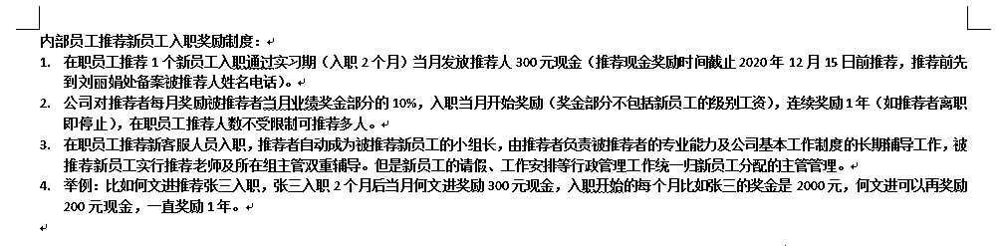

三** **、如何标准化批量筛选面试者，减少无效培训资源

很多公司都担心招聘到的人员不适合公司，导致公司培养一段时间后损失惨重。要么能力不行，想开除却浪费了工资。要么培养几天浪费了老员工的培训时间却没有产生任何价值。因为培养一个员工的成本是很高的。

很多老板都是自己面试人来减少看错人的概率，但是老板如果花大量的时间去面试普通员工会导致自己忙不过来而且非常累，无法做其他更多的思考。我们设置了一套标准化的招聘流程后基本上主管招聘进来的员工质量也大大的提高。

1\. 大面积撒网，招聘信息一定要写的吸引人，工作简单，办公环境好，五险、不加班等等这些词语才能吸引更多的人投简历，这个就和获客文案是一样的，公司的优势，吸引求职者的地方一定要写出来。

 

 

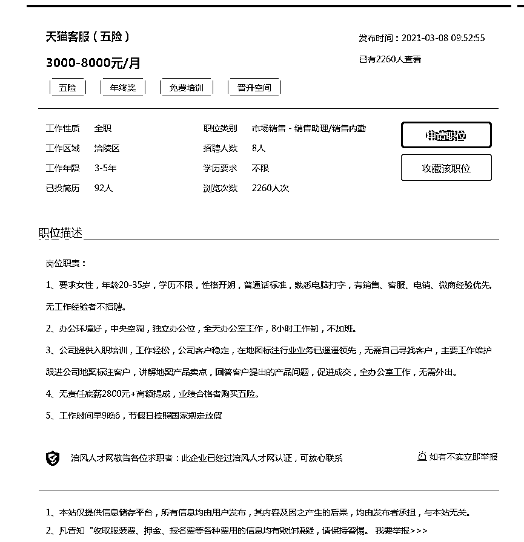

2\. 每天主管拨打固定数量的简历电话预约面试，保证面试的人数，还要在简历库里面去主动搜索人才，主动电话联系，这个是很多公司没有做的事情，所以很多公司的人事说没人投放简历也是这个原因，因为没有主动出击招人。只有面试人数保证了才能筛选到优秀的人。

 

 

3\. 面试很多公司面试完就是让求职者回去等通知，然后会根据情况通知来实习的人员，这样导致可能通知的人不一定会来上班，或许是随口答应来上班，但是缺又不来了，导致安排好的入职培训浪费了或者新人员数量不够。面试后一定是让面试者如果愿意来公司实习可以给面试者发一个短信我愿意来实习，然后公司在根据回复情况通知实习人员，这样就把主动权掌握在了自己的手中，不至于你看上她，他可能完全不想来公司的局面。不利于公司培训安排

4\. 让求职者消耗大量的时间成本，留下真正需要这份工作的人。通知实习后一定不要马上开始培训，这样很多情况下浪费主管或者培训者去讲解，当求职者上午听完了解工作有难度后可能直接下午不来了。导致做好的培训安排却没人听了。

可以先准备一个公司的产品销讲话术，第一天的实习生什么也不做，安排直接背文案（文字不要太多，也不要太少，我们是 1500 字左右的销售文案）。通过这么简单的过程有把没有耐力，心烦气躁不适合做销售的新员工就会背一会自己放弃了。通过背文案的检验能够很快知道新员工的应变能力和反应能力，能够初步知道新员工的个人能力。

背文案基本需要 1 天时间，快的半天左右，背完就直接让新员工回去。不在安排其他内容，这样可以增加新员工背文案的速度，背的快的半天就回去了。第二天上午安排员工自己熟悉昨天背的内容，不安排具体培训，是为了在培训之前进一步消耗新人的时间成本。第二天下午安排简单的讲解，可以讲公司基本概率，也可以讲背诵的文案。

切记第二天只能讲一些相对轻松的话题，不要把工作讲得太难，讲销冠工资多高，我们从来不加班之内的，没有勾心斗角，工资高于同行多少多少等等。这样可以让新人进一步了解公司的产品，对公司充满信心。人只有尝试了才能克服困难，不要先让困难把有能力的人吓退了。

 

 

到第三天来的新人，基本上从通知面试到过来背诵花费了 3-5 天左右（面试成功后延迟  2 天通知到公司实习有 2 天的间隔），公司却没有消耗太多的人力成本即使 1 个人都不来也没有关系。重复进行招聘操作即可，通过这一系列的操作，那些歪瓜裂枣，没有耐力，不适合这个工作，对销售不自信的基本已经淘汰一大部分了。这样有效降低了培训和面试成本。

四** **、**3 **个维度建立一套销售人员自我管理的制度

1\. 每日业绩考核，每日业绩考核制度主要是让员工每天能够提醒自己完成业绩，过程管控结果，每天完成了，每月自然就完成了。如果安排管理一个人天天去催员工完成业绩，我想谁也不像成为全公司不喜欢的人。

如何设定每日业绩目标，你把最近几个月的销售大数据调出来， 70 % 的人都能达到的业绩就设定为每日最低业绩，未完成每日最低业绩的处罚可以自动加班半个小时才能下班或者其他。

每日最低业绩主要是让员工每天想着自己的业绩应该是多少。有个比喻：比罚款更难受的事情是，看到别人都下班了，自己还要加班。特别是 5 点钟还没有完成业绩的员工，基本会主动把老客户拿出来跟踪，因为人性就是不想加班。但是也不能全公司都在加班，那样公司的抱怨情绪会比较高。

2\. 每周目标考核，一周不能完成 KPI 的，是需要主动到销售前五的人员处去旁听学习 4 个小时，而且需要销冠签字主管检查。这样主要是帮助业绩不行的人员自我学习。另一个是在周例会需要分享自己的学习心得，这个主要是监督学习的人要认真学习而不是走过场，另一个是让上台的人在面子上过不去，如果每周都去分享学习心得，大家都知道你是业绩倒数。从情感上也过不去迫使员工想去完成业绩。

 

 

3\. 每月目标考核，月度的考核结果已经从每天每周在做铺垫了，所以说能完成每天和每周，每月就不难了，每月主要从提成上考核。这一块我单独讲一下。

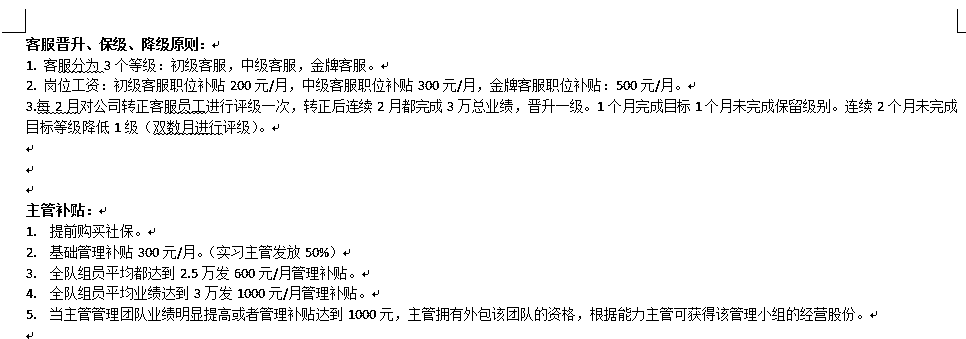

五** **、如何设置一套有激励性的提成制度

1\. 基础提成，主要是保证公司的基础业绩，让完成了一定销售额度的员工有提成，通常是底薪 + 提成 %。如果薪资结构是完成固定基础业绩才有提成的话，可能部分销售无法拿到提成，导致部分业绩差员工人员主动性不太强，下半个月看到自己完不成的情况下，没有了销售斗志。举例：每月的销售基础销售任务是 2 万元，高于 2 万的可以提成  10 % ，那么如果完成 2 万以下的员工其实下半个月积极性不高。（当然也有无责任提成制度，这里不细讲）

2.  超额提成，主要是保证每个人都可以拿到提成，每天激发员工的业绩。例如： A 产品单价 1000 元，给员工一个销售底价比如是 600 元，如果没有超额提成，大多数情况下员工会 600 销售，努力高卖客单价主观性不强。如果销售 600 以上的金额提成 50 % 那么高卖积极性会瞬间提升。我们公司因为这一条提高了 20 % 以上的业绩。

 

 

超额提成这里有一个细节：你准备做超额提成的时候可以先提高产品价格，然后把提高的那部分作为超额部分，这样保证了业绩只会提升不会降低。

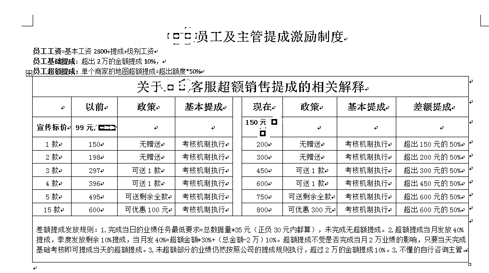

3\. 超额提成按照每个单子计算，你有一个单子超过就提成，不与月度考核的总业绩挂钩，保证了每个员工做了都有提成的心态。

4.  超额提成因为比较高公司可以在上面附加很多条款，设置多个等级的比例。比如公司迟到严重，就规定每月迟到 2 次以上，请假 2 天以上，超额提成自动降低 5 % 。比如为了保证基础业绩更高，可以设置基础业绩分几个等级对应相对应的超额提成比例。这样就保证了员工既要基础业绩冲量，也要超额提成附能的局面。总之这个是根据实际情况去匹配即可。公司因为超额的各种附能，没有降低了迟到，降低了请假，降低了相互赠送业绩情况，降低了遗漏客户的情况。

 

 

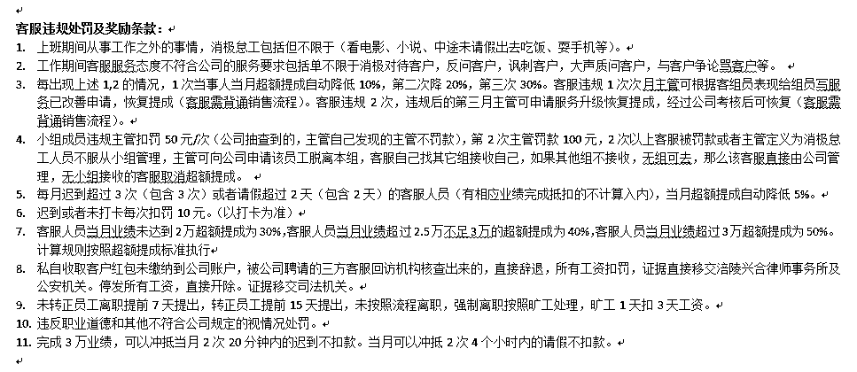

六、简单规则附能主管权利，减少主管管理时间，多做业绩

1\. 主管拥有开除组员权利，如果组员被开除，组员只有自己去寻找新的组接收自己，如果没有寻找到新组接收，组员由公司直接管理，只要是由公司直接管理的组员超额提成自动降低 10 % 。

2\. 如果组员有违规情况，比如自己因为客服服务态度不好被处理，只有主管可以申请给组员解除，组员不能自己申请，可以让组员去协调主管之间的微妙关系，解决相互依赖的问题。

3\. 组员受罚，主管会受到连带责任，也会被罚款，防止相互包庇的行为。目前公司主要用这几条就让组员基本服从主管的管理了。没有用太多的其他条条款款。

七** **、多用逆向思维抛出矛盾，让员工自己去解决自己产生的矛盾

 

 

1\. 比如员工 A 与 B 同组因为争抢客户发生矛盾，都到办公室哭诉， A 提出要换组，不与 B 一起工作， B 也同时提出不与 A 同组要换组。这种问题如果解决不好会有一定的负面影响。

a. 如果直接统一换组，以后同样问题其他人员效仿，导致有处理不完的问题。

b. 帮换到其他组，其他主管也不一定喜欢这样的组员，导致其它主管内心对公司有意见。

c. 不处理也不行， A / B 员工都带着怨气工作，业绩下滑。

d. 逆向思维法解决： A 到办公室提出换组，告诉 A 公司原则上是同意换的，但是需要你自己去找其它主管协调，有主管接纳就可以自己去。 B 来提出也是同样的回答回答 B 。

这样所有的人公司都不得罪， A / B 自己不能换是自己协调能力不行，也怪不到公司。

八** **、对首次创业者的几点提醒

1\. 一定不要随便答应员工提出的要求，一定要根据实际情况决定对整个公司和其他员工是否会产生负面影响在决定。

2\. 当你发现某个员工有违规的情况一定要当面指出，不要认为也许员工会自己改正，更多是不处理这个问题其他员工相互效仿，会不断放大这个问题。

3\. 切记不要随便在会上面宣布某个规定然后过几天觉得不适用在随便又改了，这样会让员工觉得你是一个说话很随意的领导。

 

 

4\. 不要想着所有员工会感激公司养活了他们，大多数情况下你们之间就是工作关系，出了门交集就很少了，甚至很多员工因为一点小摩擦离开公司后会说公司的坏话。大多数情况下老板在员工的眼里就是一个天天要业绩的没有情感的角色。

5\. 任何一个看似简单的行业，即使你把所有可能出现的问题都想了一遍，当你真正去做的时候才发现到处都是困难，所有的创业都充满未知，会出现各种你意想不到的问题。

6\. 如果你还没有开始做的时候就开始考虑同行模仿之类的是多虑了，完全不用担忧你的行业会被别人模仿，做互联网的竞争都是面向全国，竞争迟早会来，做好当下去执行就行了。就单单执行力这一块，就已经让 90 % 的人退步放弃了。

写到这里今天的分享也差不多了，我是地推传媒张  微信号 fei7777 。希望和大家探讨更多的小团队管理经验，大家一起生财有术！

评论区：

鱼丸|亦仁助理 : 他在互联网创业 8 年，所经营的公司年销售额1500 w+，并在没有人事，没有专职财务的情况下，通过简单清晰的制度设计，使 50 人规模的团队基本实现了半自动化运转。

今天的分享大纲如下：

 

 

**1. ** 不养闲人，只留能为企业赚钱的员工，能不配置消耗型部门就不配置

**2. ** 小公司不配人事怎么解决大量人员招聘的问题

**3. ** 如何标准化批量筛选面试者，减少无效培训资源

**4. ** 3 个维度建立一套销售人员自我管理的制度

**5. ** 如何设置一套有激励性的提成制度

**6. ** 简单规则附能主管权利，减少主管管理时间，多做业绩

**7. ** 多用逆向思维抛出矛盾，让员工自己去解决自己产生的矛盾

来，欢迎  的互动。

胖小爸-深圳买房融资 : 好及时，最近正好需要这个[强][强][强]

涛子 : 期待

回望起点 : 感谢生财看得起！大家一起生财有术！

飞书何伟建 : 很受启发

望月 : 中国的管理，就是处理人性的艺术，这里体现得很细腻，都是智慧啊！

麒麟 : 感谢分享

【一职多责】

厨师就一定是是炒菜做饭么？其实不一定，大多数的厨师是要安排人力（管理）、确认食品安全（监管）、既要帮忙做清洁的工作（保洁），也要去帮忙买原物料（采购），看似名称厨师长，做饭好吃一招鲜，其实也需要在负责其他方面的琐琐碎碎，只是权重大小不同的问题；

这就在创业公司的好处，可以尽快知道厨师不仅仅是厨师的现实；

【为什么说销售主管适合招聘】

有句大佬说过，“让听得见炮火的人去发号指令”，讲究的就是时效性和事实性；同样可以引导出另一句话：让明白业务的人去找战友。

啥叫大公司病，其中一个病源是摩擦成本，人事的角度看人会和运营的角度看人一样么？好的方法是人事和运营的人都可以参与到面试中去，如果是二者是一个人的话，那效率就高出一大截，少了扯皮，多了务实；

 

 

我是加入生财第126天的麒麟，有幸一路前行。

回望起点 : 个人理解中国人口中的情商，就是了解你对面的这个人的心里所想，然后根据他所想去回答处理问题，得到自己想要的结果。
<!-- split -->
# (精华帖)(172赞)盖洛普是什么？一个生财有术全团队都在用的工具

作者：  叶叶_优势教练

日期：2023-03-29

感谢小刀姐在生财全国见面大会上推荐盖洛普，让很多人第一次听说了盖洛普，为了解释这个工具是干嘛的，所以就专门来写一篇文章来科普一下。

一、盖洛普测试是什么？

二、盖洛普+解读可以解决什么问题？

三、测过的人怎么形容的

四、和别的测试的区别是什么？

五、开发者是谁？是如何开发出来的？

六、怎么确保测出来是真实的自我？

七、如何测试？

# 一、盖洛普测试是什么？

 

 

比如你总是忙忙碌碌，闲不下来，渴望完成更多的任务，每天就像打怪升级一样，这种模式“成就”；

比如你非常享受学习的过程，总是控制不住地去报班、买课，这种模式叫“学习”；

比如你遇到冲突，习惯妥协、回避，总是能寻求共识，注重人与人之间的和气，这种模式叫“和谐”；

比如你思维发散跳跃，总是冒出一些别人想不到的点子，这种模式叫“理念”；

比如你做事之前总是看到风险，做足充分准备后再行动，这叫“审慎”；

比如你经常思考事物的本质，探索底层规律，这种模式叫“思维”；

比如你不害怕陌生场合，甚至会兴奋，喜欢结交新朋友，自然而然就能找到跟别人聊天的话题，这种模式叫“取悦”；

比如你更喜欢跟熟人在一起玩，在熟人面前更放得开，不喜欢人多的饭局，这种模式叫“交往”；

盖洛普测试是美国盖洛普咨询公司研发的产品，测的是一个人本能的心智模式（思维模式+行为模式），也就是行为处事方式，也是一个人的使用说明书。

目前全球已有超过2900万人做过该测试。生财有术团队也有做盖洛普测试，并认可这个测试的科学性和精准度。

盖洛普不单纯是一个测试，而是一种语言，专门描述人的行为规律，以及这些规律对应哪些天性优势的语言。

在盖洛普优势体系里，一共有34种行为规律，即34种天赋优势，通常我们叫做才干（talent），是一个人自然而然的行为模式、思维模式。

 

 

比如对于看到的资料、文章、结论，你不会轻易相信，你总是会思考结论是怎么得出来的。总是对数字很敏感，习惯用数字来客观描述和量化一件事，这种模式叫“分析；

……

这些模式是不需要你刻意提醒自己、咬牙硬着头皮就能做到的，是你下意识的行为习惯，也是你的内在需求，所以如果你有意识地去训练这些本能的模式，你就能事半功倍，更容易感受到正反馈。

每个人的**34**才干组合和排序都是不一样的，所以这个测试可以充分体现出每个人的唯一性。 这就相当于钢琴上的**88**个琴键，琴键是有限的，但不同的琴键可以奏出无穷的音乐旋律。

** **

# 二、做这个测试（+解读）可以解决什么问题？

可以帮你清晰自己很多的行为规律，从自己习以为常的思维模式、行为模式，意识到这些模式里有哪些自己不曾发觉的优势，以及有哪些限制你的思维盲点。

对教练来说，有报告参考，就像是拿到了这个人的操作系统说明书，就可以很快地定位到对方的问题，结合这个人在意的点去做引导，而不是用通用标准的大道理去说教。

 

 

生活中我们都有类似的经验，遇到一个问题找身边朋友交流，他们也的确给了建议，但就是很难执行，这是因为每个人的底层操作系统，在意的、痛苦的地方都不一样。

比如对有些人来说，把flag说出去，被人监督，更有执行力，而对有些人来说被人围观是一种压力，他们更习惯先拿到结果再对外说。

比如对有些人来说，他不care别人怎么看他，而有些人就很敏感别人对自己的看法，如果对这类人说你“不要把自己太当回事儿、不要管别人怎么看你”，基本是无效的，反而让他们会更痛苦，因为他们会更自责为什么我做不到不在意别人的看法。

对这类人我给出的建议，就是把别人的看法看成是一种动力，努力赢得别人更多的认同感。当认同感远远大于负面评价，负面评价对你的干扰就会很小了。

为了具体说明可以解决哪些问题，这里举我服务过的案例来说明（均获本人同意公开）：

# 1、排除不适合自己的工作内容或工作方式，减少试错成本和很多不必要的内耗

案例一：一个喜欢工作充满创造性的应届生，跟风进了银行半年后跑路

一个校招进了银行的大学生，他觉得银行的工作干得很压抑，后来测了盖洛普发现他的「理念」第一，理念的意思是指思维天马行空，有很多脑洞，不喜欢按部就班，所以银行和他第一的优势就很冲突，自然干得不快乐，他后来就辞职，去做文案策划的岗位，他觉得工作更开心。

 

 

他说如果大学的时候做了盖洛普，他坚决不会跟风进银行。

案例二：一个社恐性人格做渠道关系维护做得很难受的商务

一个做商务的人，他「取悦」排序倒数第二（取悦不是讨好，是陌生人社交能力），每天需要对接很多渠道商，打电话、攒局，逢年过节要维护关系，那这样的工作就不太适合他。

他更适合不需要维系很多关系的，偏幕后执行操盘类的工作内容，比如像广告策划、产品经理等。

也许可能有人说我也是社恐，然后锻炼自己跟人打交道，也能成功应对社交场合，对此我想回应2点：

第一，每个人社恐的程度不一样，所以克服社恐的痛苦程度不一样；

第二，靠后天练习成功应对，和天生就喜欢跟人打交道，在工作效率上和能量上是有本质差异的，后者做这样的事情就是充电，不会觉得累，而靠克服本能做到成功对接很多人是放电的过程，做完后需要休息，所以让一个人克服自己最短的短板去做工作，这种精神很励志，但是不利于自己职场竞争力的积累。

市场竞争力，是你以最小的成本还能做出最好的结果。死磕短板，等同于在别人的优势领域被别人吊打。

 

 

# 2、定位自己的内耗、行动力不足的原因是什么

案例三：一个学了一年抖音自媒体，也没有发布一条视频的自由职业者

小强（化名）想做抖音自媒体，他投入了整整一年的精力，却一条视频也没有发，你说他没有努力吗？也不是，他也学了很多相关课程、买了摄影器材、写了文案、拍了视频、剪辑也弄了，但就是觉得不够好，所以一直没发。

他的盖洛普测试结果「学习」第一，「完美」第2，那他就理解了他的执行力为什么很差，因为他花了太多时间在学习如何做抖音自媒体，如何拍出一条好视频，又过于追求完美，所以导致迟迟没有发布一条视频。

当他知道问题出在哪里之后，他就不再那么追求完美，而是想着先完成再完美。

案例四：一个对内容敏感度不高的内容运营

阿杰（化名）说他自己对内容敏感度不高，他想到的爆点总是得不到领导的满意，别人说多看一些热搜，积累多了自然就有感觉了，他就去努力地去看很多热搜，但还是很难判断什么是更受欢迎的爆点。

这是为什么呢？因为他看热搜的角度和别人看热搜的角度不同，所以看再多的热搜，他的敏感度还是提升不上来。

结合他的盖洛普来分析，他有「专注」、「学习」，所以他喜欢看个人成长类、跟自己目标相关的内容，对跟自己工作生活无关的人和事毫不感兴趣，而爆点是需要对大众情绪很敏感的，他如果想提升这部分的敏感度，可以用他擅长的方式去实现。

 

 

他很擅长建立共性，分析底层规律，所以我就建议他去找到规律，建立数据库来提升敏感度，他也觉得这是一个非常好的建议，不再怀疑是不是自己不行，是不是要换一份工作，而是又相信自己可以胜任眼前的这份工作了。

# 3、定位亲密关系相处的障碍

案例五：从小青梅竹马，知道彼此相爱，却总是吵架的情侣

这是来自找我做情侣解读的一对情侣。他们是青梅竹马，认识二十年了，但是女生linda总不理解为什么她的男朋友经常打击她的想法。

比如她想去做小红书，觉得可以让自己的简历更有竞争力，但他男朋友却并不为她这个想法而感到高兴，反而还打击她可能会遭受网暴。

那通过盖洛普报告发现，她男朋友「排难」第一，而她是「积极」第5，所以她总是看到的都是积极的一面，而她男朋友的排难看到的都是负面问题和风险。

在解读的过程中，我说“你男朋友并非要真的打击你，而是提醒你要考虑这种情况，提前做好准备 ”，她男朋友非常认同我说的话，他说他知道女朋友是一个对负面评价非常敏感的人，所以他担心如果linda去做了小红书，可能收到一些不好听的评论，这会很影响她的情绪，所以他就用网暴这样比较夸张的方式去吓唬她，让她考虑清楚。

 

 

当听到男朋友这样的心里话，linda表示她非常感动，也理解了男朋友的思维方式，而不是觉得两个人不合适。

说真的，这对情侣的案例让我特别感触，因为我上大学时我和前男友之间的矛盾也是类似的，我就是因为总觉得对方老打击我，我受不了了才提出分手，但是接触了盖洛普我才知道，这是这一类型人的思维方式，而不是真的要泼我冷水。

同样的遗憾不会在这对情侣身上发生，我真的替他们高兴。两个相爱的人，千万不要因为彼此的沟通不在一个频道上觉得相处很累，就冲动分手哇，借助盖洛普，你就能理解对方的思维方式，而产生很多不必要的冲突和误会。

# 4、定位团队管理上的内耗卡点：

案例六：不忍辞退绩效倒数第一的主管

一位团队主管犹豫要不要辞退某个不胜任的员工，这位员工经常犯错，提醒了几次也还是没改，导致了整个团队的绩效都不好，也影响了团队的士气。

但是她还是不忍心直接发起流程辞退这个员工，她总想着给对方更多的机会，也担心辞退会打击到对方，让她找不到工作。

她的盖洛普报告中有「和谐」、「审慎」，就可以理解她很不喜欢在人际关系里做恶人，会考虑比较多不好的后果。

 

 

在定位到这个原因后，我帮助她克服了这个辞退员工是做恶人的想法，因为一个人早一点离开自己不喜欢的工作，他就有机会更早地去做自己喜欢的工作。

案例七：吐槽团队带不动的微商团长

这是一位微商团长，  她的「学习」+「成就」突出，她自身每天精力充沛，她无法理解为什么有些人卷不动，误以为是下属太懒，但实际上可能是下属他的精力就没有她这么充沛，或者没她那么看重工作。

所以之前她经常抽小皮鞭让他们更努力，团队痛苦，她自己也痛苦。

这种情况下，2条建议，一个是筛选跟自己都是一样卷王类型的人，另外接纳不是所有人都像她那样特别渴望赚钱，理解团队成员的动力是在哪里，用别的动力去激发他们。

意识到这些后，她后面基本就很少因为带不动团队而感到内耗了，就带能带动的人，团队也发展得很好。

亦仁也曾分享过他的才干对他管理团队的影响，请点击：https://t.zsxq.com/0cHEoq5DE

# 5、 知道自己的动力来源，如何给自己充电，做什么事更容易坚持

 

 

一个人工作没动力，往往可以从他的盖洛普报告中分析出原因。因为缺乏动力是内心某种需求没被满足的表现。

**34**个才干每个才干背后都对应一种需求，例如「追求」才干需要得到别人崇拜和即时的正反馈，才会激发他达到最佳状态；

「竞争」才干需要一个相互比较、相互激励的同伴，才能激发他不断努力、赢过对方；

「适应」才干需要一个富有变化的环境，才会持续激发他灵活应变的潜能，让他遇强则强。

当你满足了才干背后的需求，你每天就会像打了鸡血一样， 对工作充满热情， 在职场上勇往直前。

比如当你知道了自己的「交往」（熟人社交的能力和深度关系的维护能力）很突出，那么你就需要经常跟几个固定的好朋友保持联系，经常见面、保持深度沟通，跟他们在一起你就会感到放松。

同时你更擅长去做一对一或小圈子的服务，做深度的一对一关系，而不是靠走量的模式，那么相应地你更适合做高单价产品，通过提高转介绍率来获得流量。

# 6、找到适合自己建立影响力和获得流量的方式

如果你擅长人际关系，你更适合通过社群引流；

 

 

如果不擅长社交或者不太喜欢跟用户走得太近，那么更适合去各大公域平台输出内容，通过内容来吸引流量。

而且不同性格优势的人，输出内容的风格也不一样。

曾经有客户跟我说她写不出深度内容，所以不好意思写文章，但我跟她沟通发现她对于搜集如何提高生活品质的好物非常感兴趣，那么对她来说，她就不需要走深度路线，而是走接地气路线。

所以我给她一个建议就是  发现生活中有哪些痛点，然后去做能解决这类痛点的产品测评，这样也是给别人提供价值。

那还有的人是属于跟人聊天能有话聊，所以我就建议她找一个朋友，每期选一个话题去聊，用对话体的形式去输出，像有些播客就是两人或三人的圆桌。

# 7、定位团队中的成员优势，如何激励下属

 

 

之前亦仁有来让我看团队成员的报告，这里是部分成员盖洛普的分析：

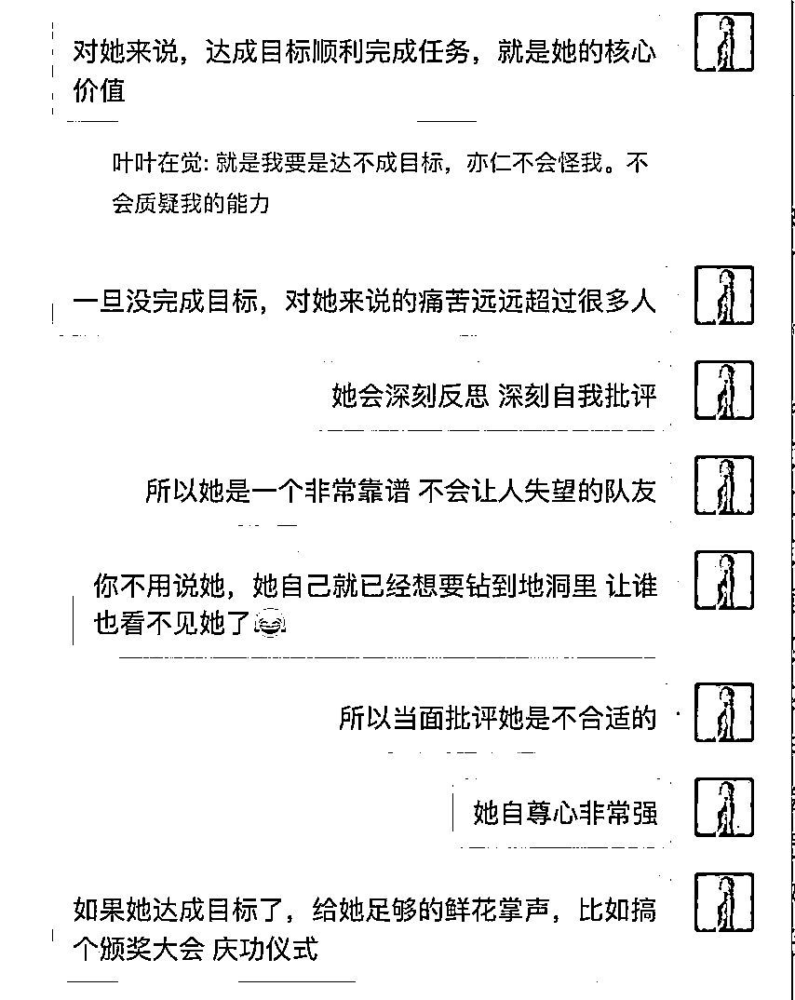

 

 

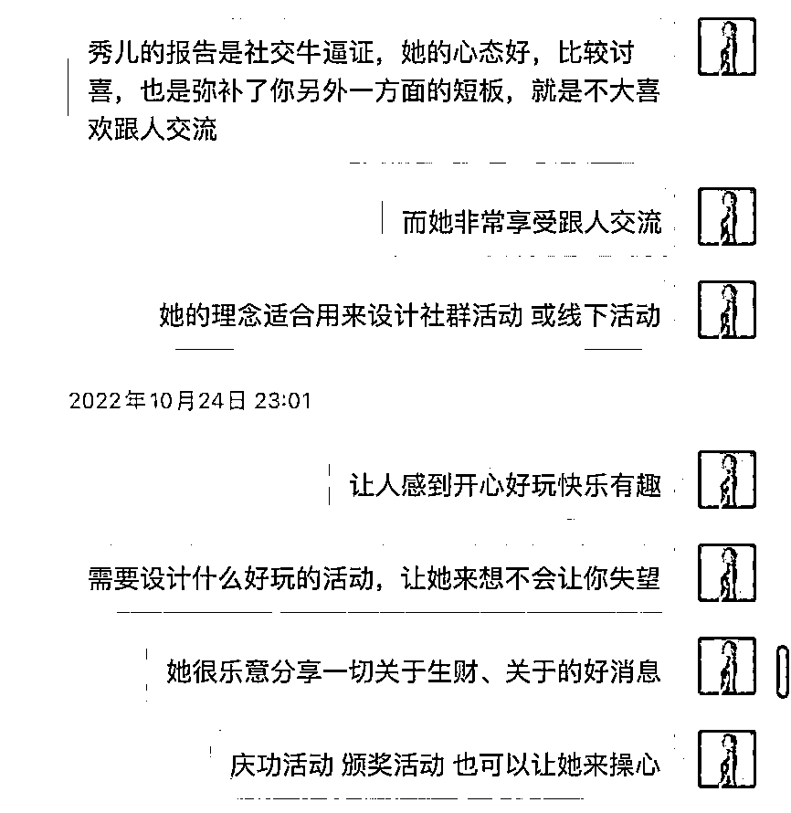

 

 

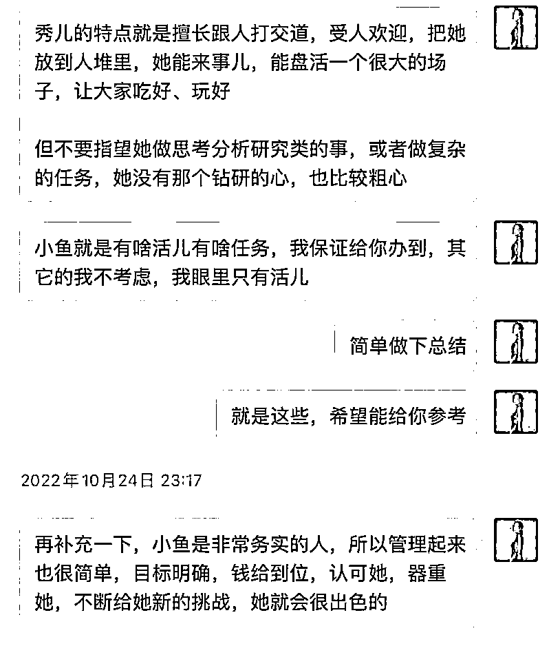

以上只是盖洛普+解读的部分效果，还可以解决冒牌者综合症、找到人生重复困境的卡点等等，这里不再举例。

# 三、测过的人是这么形容的：

 

 

“看到盖洛普报告后的感受是：对，这个测试怎么能这么懂我～”

“之前并不明晰和清楚自己的一些日常的行为是什么导致的，那这个可以很条理地告诉我，什么是我的优势，是发挥在了什么地方，我的日常一些行为模式在这套语言中就有迹可循。

另外一个就是我收获到了很多需要注意的盲点，这个是非常关键的。”

“最近在考虑学业和创业的精力分配，和择偶。

盖洛普以及mbti给了我很大的帮助，本来只会考虑一件事情的投产比。

现在多了一个新的纬度，就是自己擅长什么，在什么事情上更容易坚持，那那些人打交道会更舒服，应该怎么休息，什么模式下会最高效。

什么样的伴侣更适合我，分别能带给我什么，我应该用什么样的方式和他们相处。

如果说之前，生活在这个世界上是一个没有形状的物体。

现在我可能清楚自己的菱角和形状是什么，更能选到自己适合的路。”

# 四、和别的测试的区别是什么？

 

 

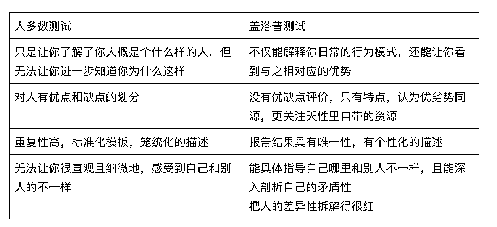

盖洛普测试是积极心理学的产物，在盖洛普测试体系里，没有所谓的优缺点，只有「特点」，更加关注人天性里自带的资源，更加客观地去看待每种特质，认为每种特质都有两面性。

比如有些测试结果中会说明你是一个习惯回避冲突的人，但盖洛普会用“和谐”才干来形容这个特质，当你看到自己的“和谐”第一，你就会理解自己为什么习惯回避冲突，而且你还会看到回避冲突这样特质的优点在哪里，

其次，盖洛普测试的颗粒度很细，就好像大多数测试只是手机拍摄效果，而盖洛普是**8k**超高清反效果拍摄，能让你对自己了解地更全面。

以一个人善于跟人打交道为例，在盖洛普的语言里，表现形式可以是N种：

 

 

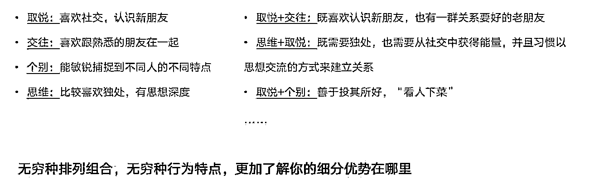

N种的表现形式，是因为盖洛普测试结果是34个才干的排列组合，这意味着：

第一、测试结果就像身份证编码一样，具有唯一性，

第二、测试结果可以进行无穷的排列组合，人和人之间有相似的优势，但优势的组合是不一样的，而不同的组合就会带来不一样的结果；

# 五、开发者是谁？是如何开发出来的？

它是由美国优势心理学之父、盖洛普前董事长唐纳德·克里夫顿主导设计的，他们团队花了至少30年，对不同国家、行业的杰出人士进行采访，了解他们是如何成为行业的佼佼者。

基于海量访谈的大数据，盖洛普团队找到这些成功人士身上所具备的思维方式，最终提炼出34项天赋才干主题（talent theme）来给这些思维方式命名。

 

 

**1. ** 关于盖洛普测试更多详细历史，请点击链接阅读：

https://www.gallup.com/cliftonstrengths/zh/253745/克利夫顿优势历史.aspx

六、人具有自我欺骗性，怎么知道测出来的是自己，而不是我认为的自己呢？

人是复杂的，存在社会化自我，也是有面具的，测试无法做到100%精准，但是盖洛普测试的信效度在70%（两次测试前后的一致性），已经比绝大多数测试准了，可以具备一定参考性。

另外盖洛普研究的是你下意识的行为模式，是不经过你理性思考的行为。

当你理解了盖洛普的测试题目设计，你可能就没有这样的担心了。

专业的付费测试都会增加测谎机制，盖洛普的测试题目为了避免人为主观的误差，在题目设计上做了精心的设计。

它不像很多测试让你给自己打分，或者有明显政治正确的“标准答案”，比如“你认为自己是一个责任心很强的人吗？”

 

 

像这样的测试，非常容易作假。

盖洛普的测试题目一共177道题，题目之间会相互交叉验证，每个才干主题都会被拆分到不同的题目中去，并且避免让你看出来是在测同一个特质，比如「积极」这个才干，它可以是你的生活充满欢乐，可以是你经常赞美别人，可以是你经常看到事物好的一面，可以是你很爱笑……

这些描述是你比较能确认符不符合自己的，越符合，这个特质越突出，一般符合，就会在中间位置，越不符合，就会排在倒数的位置。

（当你对盖洛普体系比较了解之后，就不建议反复测了，因为你已经知道它每道题在测什么，准确率就会下降）

 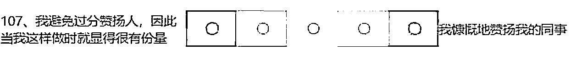

如果你测完感觉不准，可以联系教练解读，通过教练对话，也可以确认哪些是真正的自己，哪些是社会化的自我。

# 七、测试在哪里做？

 

 

盖洛普测试是专业测试，所以是需要付费的，官网售卖445元，找盖洛普优势认证的教练购买可以优惠一些，比如我、醒醒、苏姐等。

不建议做免费版，因为免费版不准，曾经做过免费版和正版的对比，排序差距很大，这会带来很大的误导性。

（可能有人买过《盖洛普优势识别器》那本书，书里送的测试码只有前5，是体验版，如果需要解锁全部，需要付费。）

以上就是关于盖洛普的入门科普啦，希望可以满足大家对盖洛普的好奇。

之前我也写过如何借助盖洛普工具找到适合自己的工作/副业，可点击：

https://articles.zsxq.com/id_em3hjst8wmvh.html。

关于我对亦仁盖洛普的解读，请点击：https://t.zsxq.com/0c94jdfSp想要和我交流盖洛普，欢迎添加我的微信：sunkiss66

评论区：

 

 

乔久伴 : 亲测有效

七小 : 通俗易懂  盖洛普入门必读呀

炮爷（不睡觉） : 感谢叶教练的分享

cocomany : 想要更清楚的认清自己优势劣势，指导行动，做盖洛普还是mbti呢？

另外，人是会变的，哪种情况下应该再做一次测试呢？

海之云 : 认识自己很重要，人从懂事开始，是一点点认识自己的，有时间还不深刻、全面的，需要借助工具

饼 : 做完了盖洛普  结合了这篇文章  真的发现了很多平时忽略掉的东西  真的很有用！

叶叶_优势教练 : 盖洛普测试测的是一个人的本能和下意识，是一个长期形成的稳定的思维模式、行为模式，不是后天学习的技能优势，所以不那么容易发生变化。

当然这并不是说人不会变，人会随着环境的变化而变化，但是一个人身上的本性和底色的这部分是很难改变的。

叶叶_优势教练 : 盖洛普的颗粒度更细致，mbti是给到你整体的轮廓，两个测试可以一起做。如果研究优势，肯定首选盖洛普。
<!-- split -->
# (精华帖)(91赞)复购 20% 到 57% ，如何打造一支销售型转化团队

作者：  奶茶

日期：2021-12-17

目录

1\. 销售型团队打造有哪三个环节比较重要

1）  合理的人才选择模型

2）大会如何宣讲调动人心

3）绩效改革经历过程

2\. 从 20% 到 57% 都做了哪些，可以提升转化率

1）起步期

 

 

2）从 20%-30% 打磨期

3）30%-40% 成长期

4）40%-50% 冲刺期

5）50%+ 活动追击期

3\. 如何打造销售团队的 “团队感”

1）使命意义

2）场景布置

3）广而告之

4）帮扶弱小

---正文---

你好鸭，我是奶茶，很高兴在生财写自己的实战心得文，来生财快半年了，得到生财的圈友，小伙伴的照顾，一直想做点什么，感恩生财团队，奈何晦涩于自己文笔，迟迟没写出来，在年底看到各大会议议题都在讲私域，作为在这个赛道从业多年的老鸟，觉得有必要分享下行业干货，感谢@数列 @杨爽@卡卡 @敏敏  对本篇的帮助，那如下是内容干货。

先来一张图：

 

 

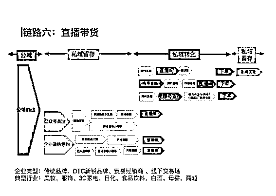

上图是✅腾讯官方公布的 10 大营销链路之一，直播 + 私域售卖已经成各家必备的销售工具，那私域转化团队的要求能力模型是老师，更是销售，所以啊销售型团队的打造，转化率的提升是个迫切的话题，我有幸带过 40 人的销售团队，1000 人兼职团队，完整经历过 2 次从纯运营团队转变成销售团队，最后业绩做到至少千万级别，也做到过亿营收，有坑有技巧，希望我的实战经验能对大家有帮助，以下是分享的内容。

**-01-**

销售型团队打造有哪三个环节比较重要** **

**1. **合理的人才选择模型** **

从业几年来，我遇到过很多老板总是想扭转，掰掉团队坏习惯，转向自己的理想方向，   

 

那怎么扭转运营型团队到销售型团队呢？

答案是扭转不了，你无法扭转一个和目标能力模型完全不匹配的人，强扭转双方都特别痛苦，唯有意愿能加持一切，这里有个销售团队模型供参考，刚开始我不知道市面上已经有了，等我带团队成型后总结了一套方法，才深有体会，如下：

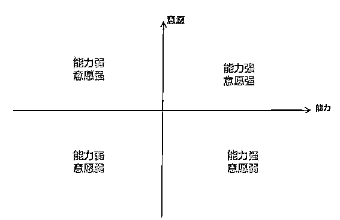

**      **销售人才模型，选人不对** / **努力白费 ** **

刚转型初期，团队里有能力，意愿都很强的那是撞大运了，大多数团队里意愿强能力弱的人居多，没关系，项目初期，只要保证我们的这个方向是正确的，我们可以培养，要让第一批相信我们的人先富起来，全力扶持他。

 

 

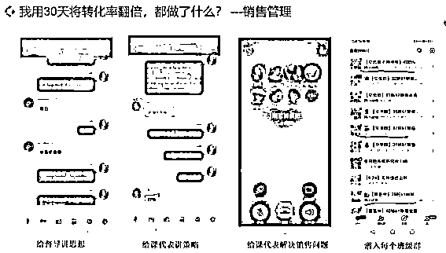

如图：项目启动期，周六我在群内和核心销售人员讲运营策略

**2. **大会如何宣讲调动人心** **

宣讲前：准备要充分 ppt 准备

宣讲角色：主持人，在场听众，领导在场

表彰嘉宾：表彰的人

表彰奖励：奖状，证书，奖品，发言稿一个都不能少

在做好第一期实验数据时，拿数据开宣讲大会，渲染下这次实验带给我们的意义和价值，不光是数据结果，更代表了此次的价值，另外还要对第一批人给予物质奖励～比如薪酬上给予前几名 500-2000 不等的激励。

 

 

**3. **绩效改革经历过程** **

绩效改革这点我还是蛮有心得，我虽然不是人力出身，但由于业务做久了，比较了解业务，所以在做绩效的时候，人力大多会以业务为主，问下业务的意见，从运营型转到销售型，大概会经历几个流程

举例子，员工做运营的薪资原来每月 1.6 万

1.0 版本  员工薪资 = 固定薪资 + 绩效 = 8K+8K，转到销售后  2.0 版本，员工薪资 = 底薪 + 提成 = 8K+8K，注意这是绩效结构的修改，总价还是 1.6 万左右，这里刚改革

千万注意不要降薪哦；

当员工适应 2 个月左右，由于业绩做的已经可以了，可能超出公司支出成本了，需要进行调整

3.0 版本，员工薪资 = 底薪 + 阶梯提成，阶梯提成原则上最高上限是公司可接受提成，比如 10%，20% 等

保持 28 法则，让一部分人先富起来，让没有贡献的人得到较少的提成，保持每月有高绩效也有低绩效，总体是维持个均衡水平。

 

 

以上小结，销售型团队的打造主要是意愿能力模型，按照人岗去匹配试用，另外不断的搞大会奖罚表彰，配套上绩效改革，这样一个出具规模的销售团队就建成了，如果你此刻正在搭建销售团队，希望对你有帮助，记得咱既然决定要做，那就把事情做透！

**-02-**

从** 20% **到** 57% **都做了哪些，可以提升转化率** **

做过近 100 次社群销售，我会发现好的社群一定是有节奏的，也一定是有集中爆发期的，那以下的分享在公域转到私域里面，更适合高客单产品，客单价在 3000 元以上，单群人效在 200 左右的精细化运营，从 20% 到 57%，我是怎么一步步做到的呢？

**1. **起步期

从 0-20%，我们做对的第一步是选品，也是跑通可行性的一步，这个品在当时来看三方获利，对用户来说 “及时获利”，对销售来说 “你做的是一件教别人挣钱的事情” 对公司来说 “高毛利” 产品，交付成本相比于实体，交付成本低，三方都获利的产品是顺应人性，比较适合当下的大环境。

**2. **从** 20%-30% **打磨期

主要是团队 sop 的出具成型，当时是 14 天训练营，由于当时无参考，我们在跑 sop 时采用 MVP 实验，测试哪天售卖效果好？测试了第 4 天，第 8 天，第 10 天，第 12 天四个时间段都有测试，最后发现第 8 天，第 10 天没差别，第 4 天太早，第 12 天太晚，基本符合认知，由于和课程内容结合，最后我们选择在第 10 天开始售卖，稳定住第 10 天售卖的一个大前提是我们要把前面的用户学习教会，才能开始售卖，不然容易引起反感，那怎么能让用户按照我们的意愿学会呢，继续又发现个数据指标听课率，催听课是 

 

个不错的办法，每天督学听课又能保证用户体验，又和结果目标挂钩。第一阶段跑到  30% 用了 2 个月，提升了 10% 的转化。

**3. 30%-40% **成长期** **

确定了参考指标后，就是执行，执行推动时刚开始推动拉齐认知，需要一段时间，执行层和策略层是两个思考维度，我们当时采用了  宣讲，数据证明，立标杆等方式宣导大家做听课率，将原有的听课率从 50% 提升到 70%，转化率也能提升 10% 左右，因为听课太重要了。

听了代表学了，用户学了，我们再给用户超预期的交付，用户买的音频课，我们赠手把手实操答疑，赠送加餐分享，赠送直播答疑教学，花了这么大力气，目的是确保用户能在第 9 天学会，第 10 天开始售卖，那怎么才能让用户进一步提升呢？我们当时调研了未报名用户发现很多用户没购买的原因是觉得课程内容太多没消化，加上我们的群体主要是中老年人，消化的确实慢，基于此考虑是不是能给用户延长学习，准备好相应延长学习的内容，开干，对没错，这里的策略执行在于背后有一支强执行团队，已经在第一三部分写啦如何打造销售团队，不再赘述。

**4. 40%-50%  **冲刺期** **

 

 

这阶段主要是延长用户的学习周期，学习时间长，消化的人多，自然购买的人也多，不过再延长 7 天还是蛮费体力的，投入 7 天，产出 10% 左右的效益，核算好 ROI 可以开干，延长 7 天这个如下大概能带来 10% 左右的转化。

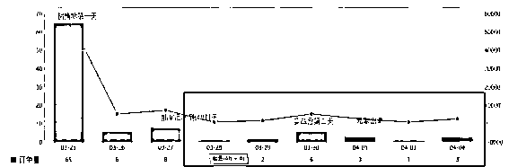

**5. 50%+  **活动追击期

这个时候销售能做的动作已经拉满，再上活动是最好不过的，做法比较适合小而美的企业，很多大厂上来就砸钱做活动，可对于中小企业，没那么多资金，只有在打磨成型自己的转化模型，做活动就是 “锦上添花” 的事情。

活动我们迭代了很多版本，主要是刚开始搞抽奖，抽奖这里设计的有意思，一等奖设置的是免单，在考虑是否让已购买的人抽奖，还是所有人抽奖，最后发现所有人抽奖对公司不利，万一遇到撸羊毛怎么办？不如让已购的人抽奖，群内掉起大家胃口，趁这波群内气氛营造，调动大家胃口去购买课程，这样实验下来的效果发现还不错，可以加持第一天的复购率，再创新高  。

小结：

 

 

运营真是个精细活，从用户进来的一刹那就开始了运营，过往用户还能接受图文，现在短视频，直播的兴起，做好整个私域的运营，还要配上直播和短视频，生动有趣，记得某位伟人说过一句话 “你给用户 3 次超预期” 这个用户就是你自己人了，仔细品，还别说，好的服务不止三次。

**-03-**

如何打造销售团队的** “**团队感**” **

前言：销售团队没有团队意识，各自作战像一盘散沙，整个公司就失去了灵魂，唯有团队拧成一股绳，为了业绩目标共同奋斗，公司才能创造更多的营收，当公司创造更多的营收后，才能更好的服务用户，这是个闭环。那如何打造 “团队感” 呢

**1. **使命意义** **

这是对团队负责人提出的要求，当我们做这件事情，一定是背后除了钱之外有更多的价值，

比如对用户，帮助用户找到正确的理财方法，帮助用户有保可医

比如对团队，你做这件事不仅是帮助用户，也帮助自己，当你挣到钱后，你有什么梦想，如

买房，娶妻生子，孝敬爸妈，环球旅行，这是在你帮助用户，为公司创造价值后，能实现的

 

 

比如对公司，当你创造利润后，公司能活下去，有更多现金流来支撑公司运转，给你更大平台和空间成长，这是一个三方都能得益的事情，也是我们底层驱动力，驱动员工朝着更好的方向去实现梦想。

**2. **场景布置** **

举个小细节，单从销售团队来说，小到从工位布局，大到从整个办公环境设置，就是一个销售 “场域”

好的场域是从一进入办公室，就能让人感受到这里是来打仗的！这个场域就搭建成了，当然好的销售场域最好是用 “制度” 管人，而不是人管人。

**3. **广而告之** **

这一点我们要学习保险公司，有幸在保险公司待过，对于冠军，优秀标兵，他们的做法是

1）月度大会疯狂表扬，让获奖者发言

2）易拉宝打印冠军照片，放在门口最显眼处摆放

3）刻有名字的奖杯 + 证书，摆放在桌上

4）冲击年底业绩时，将冲击规则打印挂在墙上，对于 top 给与重奖，如期权，旅游   

 

另外对伙伴要得到的奖品提前买回来，布场摆放在桌面显眼处

**4. **帮扶弱小** **

一个销售团队的 28 法则永远有优秀，有中等，有不及格倒数，那看一个团队的团队感，不止是对优秀的同学如何表彰激励，也要看这个团队有没有对弱小的同学给与 “培训”“1V1 帮扶”“主管指导”“激励政策”

这是体现团队情怀和格局的地方，我建议团队领导者一定要注意这一点，谁都不想当最后一名，只是他还没找到方法，这个时候需要团队给与帮助和鼓励，当你帮助他提升有进步时，他会为你代言，这时候 “团队感” 又增加一层，当你利用所有办法帮助他还没有进步时，友好分手，大家都看在眼里，也体现了领导者的格局。

说到打造团队感，我们应该学习保险和微商，别管你有多大不屑，这个有结果的团队不得不学习，在我从业中，接触过保险团队的带团队法，学习并应用到我自身带团队中，收益坡多，实践真的出真知  ，欢迎你拿去直接实践，如果这篇文章能帮你有一点点启发那就是我的价值，感谢生财小伙伴对本文的支持～也欢迎大家有转化率相关，和团队管理相关问题多和我交流呀~~

评论区：

丁邱洁律师团队 : 感谢云上夜话代班主持人，这是她的首秀。希望能帮到大家，欢迎赞评起来呀！

奶茶 : 谢谢球球姐，确实第一次有点生疏，感谢支持

刘  世  青 : 赞，正好用上！

奶茶 : 谢啦

曾丽@丽丽曾 : 奶茶  复购20%到57%，这个过程用了多久呀？

奶茶 : 7个月

曾丽@丽丽曾 : 优秀er

亦仁 : 感谢分享，已加精华。

 

 
<!-- split -->
# (精华帖)(52赞)从 0 到 1 搭建 To B 售后团队的一点点经验

作者：  黑小喵~🍀

日期：2022-01-17

《从 0 到 1 搭建 toB 售后团队的一点点经验》

做 SaaS 或者做 2B 服务的朋友，我来替你还原几个“案发现场”：

拉的客户服务群没有统一的名字，成交负责人找不到服务群，使用产品小伙伴完全不知道这个是什么产品；自己客服小伙伴 A 知道这个客户叫啥名，B 不知道。

客服号的昵称不统一，不拉群单聊的时候没什么问题。但在售后群，会导致客户不知道找谁问问题，艾特谁都不知道这体验肯定好不到哪去。

回答问题时，就更乱了。有些问题专业度过高当下不知道怎么回复，能回复的又解答的十分生硬，甚至在被投诉边缘徘徊。

同一个问题，这个客户问了，下一个客户继续问又得手输一次。爆单的时候效率低还容易错。

消息太多点过一次，消息不再提醒，意念回复了客户，实际上压根消息没回。

标签杂乱，无法系统的检核打的是否正确。很难形成有效的用户画像，会间接的影响到产品的更新方向以及引导客户复购的决策。

发朋友圈、日常活动消息群发。各种情况都能出现，忘发了、发错了、少字多字、图片模糊等等。增加了无效沟通。

没有任何流程，问流程，只会说“在心里”。

在发现以上部分问题的时候，我就开始尝试招聘专门的客服人员。目的是确保服务底线消息的及时、准确回复。

好处是话术库快速的丰富起来，人多之后，话术库搭建的更快；消息回复速度及时性有保证。

 

 

然而，更多的是带来了反面效果，客户服务群对比官网在线客服的区分特征就是工作强度弹性大，可能周五没有任何问题反馈，但周一群活跃度高，问题也相对复杂，就需要专门的排班平均工作量；群内问题会存在延续性，bug 也不一定是当天就能优化上线，交接班调休，工作如何对接；产品更新如何组织学习如何考核等等问题，管理成本和难度蹭蹭蹭的上升。

不过方法总比困难多，踩了坑就要快速调整，最终效果是 8 人客服团队优化到了 5 人，专业度服务意识在线，流程清晰。简单来说，随便拎 1 个人都能独立接得住。这就是我一开始预想的效果。

今天就主要来抛砖引玉，说说我具体的调整方法。

一、优秀员工和普通员工，怎么复制？

有个来自美团的小伙伴，把美团的经验带了过来，在美团，方方面面都十分强调「可复制性」，20%优秀的小伙伴将自己的工作内容沉淀，形成方法论，分享给另外 80%的同学，如果能把这 80%的人中的一部分提升到最高水平，那么回报是巨大的。

分享能够锻炼团队的沟通能力，也能展现每个人的多样性，还能增加彼此间的信任等等一举多得。

普通员工的人数总是多于优秀员工。给一线提效最快，最贴合工作场景的就是完善的话术库，答案放考卷旁边。即便没有人力支撑，部门培训频次较低的情况下。也能够保证响应速度，直接的提高对话水平，让客户有更好的服务体验，是成单/复购的关键节点之一。

目前以微信来沉淀私域用户池的商家对这个功能需求点很高，除了快捷回复的部分，机器人自动回复的伪装智能感，在促销爆单的情况下也能有高质量的服务，完美应对。

二、在都拿到解题思路后，如何拿高分？

公域流量的门槛倍速上涨，搭建自己的私域池是现在大多数企业最优的选择，一边持续补充新流量，另一边服务运营，稳固现有资源。

快速、准确的触达新流量，怎么精准引流、添加了客户是否通过等流量部分的问题，这里不详细展开来讲，这些也无法直接通过某个人来控制并达到一个结果。

 

 

那么，能靠个人把握的节点就要做到最好。不管是哪个团队，获取有效客户资源后，添加的操作都可以交给系统，把数据导入、配置好添加话术、定好添加时间。解放人力，原本需要人工一个小时的工作，通过系统可以简化到 10 分钟。节约下来的时间，可以去进行更有价值的业务拓展。

三、运营手法随处可见，圈粉能力怎么更进一步？

如果把私域运营进行最简单的定义，那就是对随时可触达的客户进行多次反复运营。可是一个客户在你的流量池内也同样在其他的私域池内，常见的沟通方式大差不差。

怎么更近一步，像意向客户更靠近一点。还能学习成本低，短时间出效果。

我们需要突出两个因素：粉丝触达率以及产品种草能力，抛开产品本身的影响因素，会更加考验运营人员的内容运营，有了好的内容就是要展现给客户，那就涉及到了机器自动化，定时、定量、分组的去给客户呈现专属的朋友圈；消息的批量发送，最新活动在最短时间交到客户手上。

圈粉能力这个因素，其实真正比拼的是技术水平。当下无论是社交电商、私域电商还是社区团队等，都离不开技术层面的支持。跑出 SOP 后，技术和工具驱动，沟通会更流畅。

四、认真观察对话，解锁赢得和失去收入的黑匣子。

检核团队的日常工作，也是让他们变得优秀的方法之一。

**1. ** 及时发现聊天过程中的问题

有些对话完全没响应，有些答非所问，有些需要建议或调整，当然也会有需要表扬和分享。只要客户进入私域池，我们就需要关注他所处的生命周期，避免人为导致的不必要线索流失。永久聊天记录的留存，标签的标识都能让用户画像更加饱满。

**2. ** 及时清理无法无法胜任本职工作的员工

如果从这些关键的谈话时刻得到的指导和反馈不起作用，那么很难看出会发生什么。你可以快速找到答案。通过尽早剔除那些不可补偿的人，可以减少工资和支持资源方面的不必要成本，因此尽早发现这些问题以及采取补救措施具有巨大价值——同时在下次招聘中将可塑性作为前提和重点。

**3. ** 加快员工在成为最佳表现者的道路上的进度条

 

 

日常内容的反复循环，再加上频繁的指导，是在尽可能短的时间内将员工从一开始就迅速提升到最高水平的关键。在这个过程中，不可忽略的是数据支撑，直观见证普通员工成长为最佳表现者。

五、防飞单，就是把你的私域池真正的沉下来

有了前面新流量导入和带温度的售后服务，基本搭建起了属于你的私域用户池。但需要真正的沉淀下来仍需继续努力，聊天记录无法每时每刻都有人查看抽检，小一点的问题没有给到客户良好的服务体验，讲大一点，可能会带走整个渠道的客资。

每个公司多多少少都会遇到这样的情况，相信方法总比困难多。管理层加强对一线员工的日常管理，多方位针对性的进行考核，赏罚分明；小伙伴们之间更多的是营造良性竞争的氛围；人事在招聘时多方位的考量，拉高门槛，入职后相关制度的培训以及保密协议的签订；敏感操作的相关功能，实现实时监督把控。

六、日常基本工作考核制度需完善

日报、周报、每周组内问题沟通、临时会议以及月度复盘，都需要按时按量的去提交汇报。在总结的过程中，员工对问题会再度思考、总结沉淀。

管理侧，对日常工作的监督和 KPI 的考核。更重要的是，能够对每一个客户的情况有更完整的了解。私域的最终目的是转化，在运营过程中，承载着服务、营销的双重任务，一个被动、一个主动。多了解一点这一家客户-客户的行业-行业中的客户竞品，一个渠道就变成三个维度了。

内部人效的问题是初创团队必须正面解决的问题，人员招聘、日常制度还有很容易忽略的技术工具。它不仅能降低运营成本、提升客户体验，或许还是协助推动服务团队从成本部门向价值部门转移的小彩蛋。

以上，主要是针对服务团队提效的一点点小的经验，希望能帮助到大家。

评论区：

亦仁 : 感谢分享，已加精华。

黑小喵~🍀 : 感谢亦仁哥

m : 这不是之前卖VX号的大佬吗[呲牙]

黑小喵~🍀 : 哈哈，转型了。做好人

清影 : 有幸刷到喵哥的文章了[胜利][胜利]

 

 
<!-- split -->
# 【组织建设】3篇
<!-- split -->
# (精华帖)(343赞)如何通过制度管理，使公司从年入百万迈过年入千万的门槛

作者：  亦仁

日期：2020-08-19

有这么一句话：三流的公司管理靠人，二流的公司管理靠制度，一流的公司管理靠文化。

靠文化管公司，这是追求。靠人管公司，着实挺累。

靠制度管公司？  可以尝试一下。

今天的  ，我邀请了  来分享他如何靠制度管公司，带领公司从年入百万迈过年入千万的门槛？

欢迎  。

———

再小的团队，再小的公司都要有制度

生财有术的各位朋友们，大家好，我是盗坤。首先给大家介绍一下我自己，我是93年的，目前管理着一家四五十人的公司，公司主要经营电商，以及和电商相关的知识付费项目，现在每个月净利润稳定在50万+以上！

我相信生财有术有很多和我这种类似的情况的朋友，因为一些机遇和自己的努力以及运气，赚到了一些钱。并且，在这过程之中，业务不断发展，团队不断扩大，一直发展到了几十上百人的规模。

但因为没有在什么大公司上过班，担任过领导位置，也没有什么丰富的管理经验，公司还是处于一个非常粗犷式的发展状态。

 

 

没有清晰的公司组织架构，没有健全的人事、财务制度，江湖义气成分浓厚，内部管理十分混乱，更像是一个团伙而不是一个团队，这一切，都严重制约着我们继续地往前发展。

当然，也尝试过招纳一些稍微大一点的公司的“经理”，或者有些“MBA”背景的“人才”空降到自己的公司里。但却发现，或许是他们的管理模式太先进了，又或是自己的公司积重难返，总之，双方的化学反应，极不明显，格格不入。

其实，高级人才依托于大公司的平台管理经验，直接搬到到小公司里，确实会有很多不落地的地方，非常的“不接地气”。这主要就是因为自己的公司还处于一个非常弱小的状态，资源不够丰富，就好像一个破马车装上了一个波音747的发动机，那么就会很容易引发机毁人亡的情况。

所以，今天，我就将我的一些个人经历分享给大家。告诉大家，我是如何从一个人发展到今天，以及我是如何在公司发展的同时去建设我的公司制度问题的。

【专注蓝海，年入百万】

如果熟悉我一点的财友都会知道，我是通过淘宝蓝海起家的。相关的经历我就不细说了，我将之前的一些帖子给大家分享出来，有兴趣的可以移步去观看。

《淘宝蓝海小类目的玩法》

《淘宝蓝海市场:我人生的第一次月入百万》

今天第一部分呢，我主要给大家总结一下，我从15年一个人一个店到18年年入百万做对了哪些事情。

1、创业，先求生存，再求发展！

我昨天发了一个朋友圈，说到“ 点点滴滴的从小做起，从一个人，一个小店，一步步的做起。不要一开始就想做一个大企业。这个世界没有优秀的理念，只有脚踏实地的结果。”

我见过太多太多的创业者，还没开始想好要做什么，怎么赚钱，就先租了一个豪华的办公室，把公司注册了，然后请秘书，前台。

我的公司直到今天都还没有前台，我也没有秘书。也是随着最近公司人数的增加，之前的民房确实坐不下了，我们才从之前的民房办公室搬到了写字楼。

 

 

初次创业者，一定一定一定不要犯好大喜功的毛病，还没赚到钱，就开始大手大脚的花钱。也不要有一些不切实际的幻想，幻想着你自己就是最幸运最特别的那一个。

一开始，要把自己当成最普通的那一个。

我第一次做淘宝，完全没有创业经验，更没有电商经验，凭着一个点子，头脑发热就想做一个有温度的淘品牌。

此时的我，根本就没有考虑到“怎么赚钱”，也没有想过自己能不能做起来，只是在那幻想可以赚到钱，更多的是在想着怎么做个有逼格的产品，有逼格的店铺。

事实证明，我做的店铺既没有逼格，也不能赚钱，而且还亏了整整一年。

所以，后面我知道了，活下来，才是最重要的，活下来才有发展的机会。我不再去依据自己的想法喜好去做淘宝，而是什么好做，什么对手弱，就做什么。

创业初期，一定要“务实”，不要“务虚”

2、专注力，先打造自己的一亩三分地。

小北老师是我在生财有术非常佩服和崇拜的几位大佬之一，他在他公众号说过一句话，大意是他这么些年，见过很多有钱人，但那些真正赚钱的人，无一不是因为专注。

我表示，附议！

你可以看看咱们生财有术的老胡，专注淘客；小北老师，专注跨境；黄亮，专注快手短视频；亦仁，专注生财有术；盗坤，专注淘宝蓝海...

不是不可以多领域经营，那得像亦仁说的那样，先有了自己的一亩三分地以后，再从自己的领域去做延伸做扩展。

到你真正在该领域积累一定的丰富资源，充沛的资金，优秀的团队，有这丰富的创业经验以后，那么你可以试着去做扩展。不过那些都是集团，巨头做的事情了。

小白，小团队，更应该专注于一个细小的细分领域，持续深耕，持续专注，打造自己的一亩三分地。真正有了自己的一亩三分地，你会发现有很多你意想不到的收获，拓展也是自然而然地延伸的。

比如，亦仁专注于生财，现在开发了大航海，训练营，又延伸出了私董会。未来，我觉得生财有术的机会还很多，可延展性还很多，不过这一切的前提都是因为亦仁先有了《生财有术》这个一亩三分地。

 

 

又比如我自己，能做知识付费的延展，前提完全是因为自己在淘宝领域里多年的浸润深耕，通俗易懂地来讲，就是我吹这些牛逼，都是因为前面多年的内容沉淀。你来试试做淘宝领域的知识付费，看看有几个人愿意给你付费！

我这么些年，受过很多诱惑，有线下的有线上的，很多项目都去尝试过，也亏过不少钱，只有淘宝给我真正赚到了大钱，支撑起了我的整个公司。

生财有术的信息量很庞大，繁杂。这里面有着许多优秀的内容和宝藏，但是需要你自己去仔细辨别、筛选、挖掘，也需要你沉下心来，拒绝浮躁，抵制诱惑。

不要今天看见盗坤帖子就觉得淘宝好发财，明天看大航海又觉得短视频好做，后天看淘宝客觉得淘宝客很好赚钱。去寻找真正适合你的项目，然后心无旁骛地坚持，持续深耕。

我现在专注于淘宝，打开生财，一般只读星主帖子和精华帖子，偶尔也会翻翻其他帖子，不是为了找项目，求暴富，只是为了抱着找思路，拓视野的心态去阅读去学习。

3、忍耐力，赚钱的道路上总是充满绊脚石，端正心态解决就好

以我现在为数不多的经历来讲，如果是自己创业做项目，想要很快得到结果的，几乎很难很少。

大多数的创业项目都是充满细节的，而这些细节的打通无疑都是需要试错和时间成本的，所以，赚钱的道路大多数都是充满曲折坎坷的。我们要做的就是，端正心态解决就好。

我做淘宝经历了很多的困难和挫折，不过，怨天尤人是没用的，如果你想要赚这个钱，想要发展，那么你就只能解决他。

不要因为一些小挫折就选择放弃，那种你想躺着就把钱挣了的，你也只有躺着才可以挣钱，还得有点姿色。

【通过制度，实现月入百万】

我要给大家讲的第二部分，就是今天的重点，也就是我对于公司制度建设的反思和总结。

1、阿米巴模式让我们公司快速裂变。

 

 

先给大家说一说我公司之前的运营模式，

第一阶段：店铺从0到1的全过程都是我自己来，选品，找货源，做图（外包），上架，运营，客服，发货（代发），报表全部都是由我自己来。此阶段为我一个人单打独斗阶段，一个人这样操作，三个店基本上已经是极限。

第二阶段：随着业务的发展，我开始请了美工，客服，财务，我自己还是负责选品，找货源，做图（设计），上架，运营。此阶段我开始了规模化运营，抽离部分工作，但是重头还是压在我肩上，我觉得极限是十个店。

第三阶段：业务继续发展，我开始给部分优秀的客服分配更多的工作，培养他们成为运营，由他们替我找货源，代放单，运营，填写报表等等，但是核心的选品工作还是我自己来。此阶段，我的工作量进一步得到释放，但是内部管理比较混乱，此种模式极限也就是四五十个店。

第四阶段：开始借鉴阿米巴模式，以小组制为单位，独立核算，独立考核，独立制定计划，以运营组长为核心，他可以去独立发展团队，我只提供选品，看报表。运营组长从一个人、一个店开始，第一个店做起来实现盈利，就可以向人力申请，由我同意，然后配客服。接着开第二个第三个第四个店，然后将客服发展成运营助理，请新客服。所有小组发货的财务由我调配，做图的美工由我统一调度。此阶段，我已基本放手工作，此种模式，因为我还兼有其他工作，所以极限百店左右。

第五阶段（正在进行）：培养电商总监，由电商总监总体负责管理电商部门，独立决策，具体负责各小组的管理，同运营组长沟通，统一协调、调度运营、客服、美工、财务人员的配置搭配，。此种模式，极限可以达到一百到两百个店。目前，我正在对电商部门的运营进行为期三个月的考核，然后选取电商总监。

第六阶段（未来）：根据业务规模的发展，可以开设电商一部，电商二部，电商三部；

如有必要，还可以花钱培养测试，内部孵化，扩展延伸到京东、拼多多或者跨境等平台，沿用之前的小组模式，总监负责，设置成淘宝部、京东部、拼多多部等。此种模式，极限可以数百上千家店铺。

2、再小的公司，再小的团队也要有制度

我在创业初期，喜欢拉朋友进来，而且公司内部充斥着“义气”等元素在公司文化里面。

岗位设计、薪酬发放、考勤打卡、财务制度等方面都非常的随意，没有一个制度可言。

 

 

起初，我觉得在创业初期这是一个很难避免的问题，制度，规范这些应该是后面的事情。而且小公司也没有资源来承载一个非常复杂的组织结构，只有大公司才会搞那些复杂的人事制度，管理制度。

但是，今天我要给所有正在创业的小伙伴说一句，再小的团队，再小的公司也要制度。

大家可以看看图1，这是我为公司下一步发展所设计的公司内部组织架构。这其中，很多岗位目前都还是空缺的，包括电商总监，知识付费部门的市场总监、人力资源总监等等；还有很多岗位是一人多岗多职的，比如我们的行政也要承担着人事招聘，考勤打卡等等。

我们可以一人多岗，一人多职，我们可以岗位空缺。但是，职位没有，不代表就可以制度缺失。制度的缺失，代表着一个公司内部公平的缺失，纪律的缺失，一个缺乏制度建设的团队是绝对走不长远的。

红军，八路军，当年为什么能够凭小米加步枪，一步一步发展壮大，取得胜利。原因有很多，但是，把制度建设摆在第一位应该是他们取胜的一大原因，也是他们区别于其他军阀的本质，他们是一支有组织有纪律的部队！

所以，把制度建设，从公司成立的第一天就放在公司的工作重心中来！

虽然，我现在的公司组织架构，有些岗位还有空缺，有些组织架构还不够完善。但是我们设计的这套组织架构背后也是有着一套基础制度在支撑的，每一个岗位背后也都有相应的制度在支撑(图2图3）的，我觉得，这是我非常自豪，也是对于未来非常有自信的一件事情。

而且，这个事情还必须得是我们创始人自己来，因为只有你才熟悉你的公司，你的业务，你的团队。这也是为什么我文章一开始说的，空降的高管不接地气。

因为我们的公司还很弱小，而高端带来完善体系也意味着高昂的管理成本，高预算的营销理念等等，所以我们的公司承载不了他们的理念，所以，制度建设我们必须自己来抓这个工作。

记住，好的制度是为人服务，为公司服务，制度的设计一定要从公司的需求出发，从公司的实际出发，而不是从制度出发，用制度去束缚公司，束缚人。

3、摆脱个人主义，信任团队

当我们大家一起制定了一个制度之后，那么我们就要遵守它。接着，你要做的就是去足够信任你的团队。

 

 

我一个人做淘宝的极限应该可以赚到百万，但是通过制度，通过团队，我现在觉得我们淘宝部门的盈利天花板是几千万。

一个公司在发展的过程中，老板一定要学会给自己解绑，也要学会给团队赋能。不要什么东西都想牢牢拽在自己的手里，对员工，对团队严防死守。同时，还要学会给团队赋能，给他们能量，给他们资源，给他们机会，让他们去创造价值，实现价值，实现梦想！

要把通过自己的拿到的结果，变成通过制度、通过团队拿到的结果。一旦我们建立好了一个制度以后，那么OK，大家去遵守它，并且老板要足够地去信任你的团队，设置好一个可容纳的试错区间，给自己内心也设置一个试错容积。

一旦你把工作交给了团队，那么就放手让他们去干，接下来的事情按制度进行。

如果团队做的不够好，该扣工资，该罚工资，该降级甚至该淘汰，那都是制度的选择。

我足够信任你，但是我们也遵守公司制度，遵守游戏规则。不是我要惩罚你，而是制度惩罚你，也不是我要提拔你，是制度要提拔你。

摆脱个人主义，才能将创始人解放出来，去思考更多的东西。

https://t.zsxq.com/Ea6miYN https://t.zsxq.com/IiYNBUR

 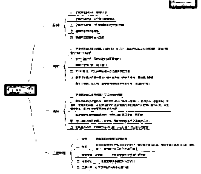

 

 

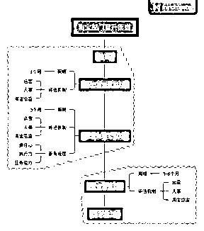

评论区：

阿狸 : 年轻有才大佬[社会社会][社会社会]

冰蓝色 : 真好

无双 : 此文再值一张门票！对于即将创业或者在创业路上的伙伴一定有启发。

俺的管理就是弱的一匹，将来不出意外，也会面临管理几十人上百人的情况。现在正好是打基础的时候。谢谢分享

钟南 : 团队无论大小，都要有规则意识。

制度执行到位，带领绵羊也能打战。

alan : 三流的公司做产品，二流的公司做方案，一流的公司制标准。

维她 : 感覺需要出個續集，給員工賦能，離不開招聘到合適的人

郑小焦 : 谢谢分享。跟坤哥认识几个月，无论是淘宝蓝海项目的生意领域，还是个人做事风格的独特魅力，都令人从心底里赞叹和佩服。大格局思维，学习[抱拳][抱拳] 偶本帅帅 : 讲的很好，我觉得应该加一个前提，那就是适合公司的制度
<!-- split -->
# (精华帖)(100赞)10-100 人团队，如何解决员工与公司目标不一致的问题

 

 

作者：  许大范

日期：2021-11-24

目录

01 如何梳理公司的核心目标

02 如何诊断公司目标共识状况

诊断1：诊断目标反馈沟通的有效性

诊断2：诊断团队共同体建设的有效性

03 如何推动公司内部目标共识

角度1：思维落地，关键是思想上认可目标

角度2：能力落地，关键是行为上执行目标

角度3：机制落地，关键是机制上保障落地

那天在私董会突然聊到，如果员工和公司目标不一致怎么办？

比如公司希望成就一家小而美的公司，而员工却希望公司越大越好，跑的越快越好。

这种时候怎么办？

我很有兴致把这个话题再深入探讨一下。

因为目标一致性的问题，本质上并不是哪个员工或者哪个群体的意识问题，目标共识本质上是一种组织能力。

 

 

而且，目标不一致的问题，无论公司大小，无论公司处于何种发展阶段，其实都会遇到。

当乔布斯要求 IPhone 的设计要秉持极致的理念，连电路板的排布都要求极致设计的时候，这明明不是客户能够看得到感知的到的位置，工程师们都不理解，员工和公司，因为产品的细节目标产生了不一致。

当雷军要求金山的游戏板块西山居不要固守自己在端游方面的优势，要紧跟时代，开发手游的时候，工程师们在心理上，不愿意去参与看起来低端粗暴的手游开发，员工和公司，因为产品的方向目标产生了不一致。

当王石要求万科不要执着综合商社的方向，从最早八面开花的业务中把怡宝电影等板块逐步出售剥离，聚焦于地产主业的时候，这些业务明明还有巨大的盈利空间，很多员工和公司，就公司的业务规划目标产生了不一致。

甚至在我 dang 建 dang 的初期，会师后的红四军，第 29 团想让红军去湘南，因为湘南人多。第 31 团想去浏阳，因为很多人的家乡就在那里。每个人都希望带着红军返回自己的家乡，甚至导致一些师团溃不成军。个人和集体，就组织未来的愿景和使命目标产生了不一致。

我之所以说目标共识是一个组织能力，而不仅仅是个人意识，是因为如果一旦把这个问题，狭隘的理解为是意识的问题，理解成只是个别人的意识、观念和想法，就很容易聚焦，于是那一个人，那一个群体的想法都有问题。

而实际上目标共识，本质上是一件牵一发而动全身的组织能力，关系到公司愿景与目标的统一，大家的意识层面，能力层面，机制层面的落实等等。

 

 

就员工和公司的目标共识问题，大范接下来的分享分成三个部分。

1\. 如何梳理公司的核心目标

2\. 何诊断公司目标共识状况

3\. 如何推动公司内部目标共识

**01**

如何梳理公司的核心目标

这里并不是仅仅指管理者如何梳理出公司的长远的战略规划，更多的是指如何把公司复杂深厚的战略规划，浓缩成员工也能够普遍理解的核心目标。

目标共识的起点是理解。

需要使用员工也能够理解的话语体系。

那种非得用一本书、一个册子才能够讲清楚的目标，没有几个员工能够真的耐得下心来仔细咀嚼。

大范比较建议的，是用这 3 个问题，来浓缩公司的核心目标。

问题**1**：企业的存在是为了创造价值，价值是什么？

 

 

这个问题源于企业存在的核心逻辑，也是企业的立身之本。

每家企业、每个团队都应该有自己差异化的价值定位，也是团队区别于其他团队，自信能够有客户为自己付费买单的核心。

问题**2**：假如你是投资者，你投资本公司的核心理由是什么？

这是硅谷投资人最喜欢问创业者的问题。

如果这个问题你觉得还没有那么好衡量，那你可以再试着转化一下，如果你的公司上市了，你买这家公司股票的时候，你核心看重的是什么？

问题**3**：从**OKR**角度，公司当下关键目标、关键成果、关键举措？

之所以推荐用 OKR 的视角，是因为 OKR 提供的只是一个思考的框架。

假如你用战略地图或者是其他的工具，都容易把公司的战略描述的过于复杂，员工很难快速理解消化。

而且相对于前面两个问题，这个问题更加偏中短期、更加具体。建议关键目标、成果和举措都聚焦为 3-5 条。

**02**

如何诊断公司目标共识状况

 

 

诊断**1**：诊断目标反馈沟通的有效性

在这个领域，影响最深远的工具应该就是乔哈里视窗。

乔哈里视窗更多提供的是一个关于沟通的反馈的框架，就是哪些目标信息，是员工个人和组织都同步认可、同步理解的，这个就在公开区。

在公司内关于目标公开区越大，整个公司对目标的共识的可能性就越大。

在目标的沟通上，应该尽可能扩大公开区，缩小那些盲区、隐藏区，尤其是对隐藏区的猜忌。

可以通过关键访谈等方式诊断。

诊断**2**：诊断团队共同体建设的有效性

使用的工具可以参照共同体的套圆图。

团队之所以要形成目标共识，最终还是希望整个团队能够凝聚成一个共同体。

共同体的深度和凝聚力，就可以用这个共同体的套原图来去做分析。

你可以基于公司内部的人员分角区分析每一个圈层到底有多少员工在这个层面上。

 

 

内核的人数越多，整个团队的凝聚力和向心力就越强，就越有共同的使命感。

在企业面临跌宕起伏和变化挑战时，这个圆需要迅速旋转起来时，也才能更加稳固。

越是外层的人，越有可能在旋转的时候脱队，甩出去。

共同目标，是让一个群体成为团队，而非松散的团伙的关键方式。

也是让团队能够形成集体心流的非常关键的基础。

**03**

如何推动公司内部目标共识

如果我们把目标共识理解成是一种组织能力，那么我们落地的方式就很好去思考。

组织能力有很多搭建的方式。

大范比较喜欢使用的是杨三角这个逻辑框架。

** **

那就是分别要从思维、能力和机制上去保障这项组织能力的落地。

 

 

角度**1**：思维落地，关键是思想上认可目标

**1. **形象与口号

在宣传方面图像一定要比文字的效果更好，一句深入人心的口号，永远要比长篇大论的效果要好。

在这方面的杰出代表，不是企业，而是 dang 派。

你会发现无论是怎样的 dang 派，都有自己的图像标志，也都有自己的阶段口号。

因为形象和口号能够唤起形象感，而只有唤起形象感，才能够深入人心，才能够进入到人的潜意识，才能够影响人的思维和意识。

我给你举几个例子，比如说我 dang 的镰刀和锤头分别代表的工农形象是「打土豪分田地」的口号，「星星之火可以燎原」的口号。

你甚至不需要去看那些长篇大论的阐述，就着这样的形象和口号，都能够理解他的目标和他想传达的价值观。

比如说腾讯，他们曾邀请全集团员工征集能够代表公司目标和价值观的动物形象，选出了 5 个动物形象，长颈鹿、海燕、犀牛和犀牛鸟、鹦鹉螺，分别代表腾讯最看重的正直、进取、合作、创新，然后再嵌入腾讯建立共赢生态圈、不断紧抓客户创新等量化目标，就会更好传递。

阿里巴巴一开始喊出的口号就是「让天下没有难做的生意」。

 

 

这些形象和口号很像一个魔咒，赋予人力量和信念，驱使着你向他奋进，想要达成它，实现它。

这就达成了宣传的目的。

如果你喊不出来这样有愿景感和使命感的口号，那有可能你真的没有想清楚这家公司的愿景和使命。

大范一直坚持那句话，钱，只能在给人短期的刺激，无法形成长远的使命感，无法给人持续的目标动力。

**2. **故事与榜样

干巴巴的讲述，公司的目标是什么、如何去贯彻落实，是一件很痛苦的事情。还有一个很好的绝佳的传播途径，就是用故事和榜样的力量。

模仿是人类的天性，故事和榜样就是提供了这样模仿的参照。

在这方面做得最厉害的，依然是我 dang 。

在我 dang 最筚路蓝缕最艰难困苦的时候，依然不忘记到处去采集那些典型的故事。

这个习惯一直延续到今天。

 

 

那些能够朝着集体的目标奋进的符合公司目标和价值观的榜样和故事被大力宣扬。

故事和榜样是最能够打动人心的，而一旦能够激发情绪的共鸣和触动，人们便会主动去理解和接受这样的目标，情绪才是第一生产力，每一种行为其实都是有情绪驱动的。

再比如华为，华为的海外拓展，有很多都是要去到那些荒远偏僻的国家。

你就可以看到华为总结宣传了很多第三世界国家的故事，比如说一人一厨一狗。

一人一狗守着一个偏僻的国家，以客户为中心艰苦奋斗，这是公司想要传达的业务目标。

而公司要为这一人一狗配上一个厨师，这是公司想要传达的以奋斗者为本、不让雷锋吃亏的人才目标。

不需要太去长篇大论讲解公司的目标和价值观，这些故事就是最好的传播载体。

**3. **老板领袖领导力

在目标共识的过程中，老板作为领袖，一定发挥着无可替代的作用和价值。

因为人的本性是追随强者，并且获得强者的认可。

并不是说你是老板，你就是强者，你是老板，你就是领袖，这是不同概念。

 

 

大范一直讲说，领导力有五种形式。

第一种领导力，是法定领导力，就是你是这家公司的老板，所以你说的一些话，员工必须坐在那里听，但内心并不一定会认可。

第二种领导力，是奖惩领导力，因为你可以奖罚员工，决定他们的奖金，决定他们的考核，所以您说话他们也得听，但还是那句话，内心不一定认可。

第三种领导力，是强制领导力，这种一般适用于法官，警察等角色，在公司内部可能包含了审计，纪检，监察等角色。也是一样的，不得不。

第四种领导力，是专家领导力，这种好一点。就是你在某个方面专业能力比较强，所以大家会信服你。但这种信服是指专业上的信服，并不是领袖层面的信服，而且影响面有局限。

第五种领导力，是魅力领导力。这才是领袖的核心关键，那就是人们追随你，幸福你是出于你的领导魅力。这包含了你的人格魅力，你的领导艺术，你的正直诚信，你的战略眼光，你的领袖格局。

每一位老板，都应该不断的去打磨自己的魅力，领导力。

举个例子，大范比较喜欢的雷布斯。

** **

2011 年在雷军已经离开金山公司两年后，准备去创立小米的同时，金山已经处于崩溃的边缘，即将被卖掉，雷军是在风雨飘摇之际被盛邀重回金山，主持大局。

 

 

雷军对待业务，充满前瞻性的战略眼光；

对待困局，独辟蹊径的格局定力；

对待团队，定心丸般的安全感；

对待自己，永不停歇的极客精神，

这些共同构成了他无与伦比的领导魅力。

这样的人喊出的公司目标，一呼百应。

雷军，有没有遇到过员工和公司目标不一致的情况呢？

当然有，比如说西山居开辟手游业务引发的质疑。比如说小米在做硬件供应链时出现过的危机，但是他通过上述的领导魅力最终都能够让大家信服，拧成一股绳。

作为老板，有时候当我们传达出来的目标无法引发员工充分的认可和共识的时候，我们也需要反思，我们作为领袖是否还有哪些地方可以进一步打磨？

**4. **小群体领袖打造

当团队开始逐步大了起来，靠老板一个人摇旗，那还是不够的，我们还需要在各个地方插上一些小旗帜，让这些小旗帜也可以共同挥舞起来。

所以需要培养一些能够充分理解和认可公司目标的中层骨干，共同去充当这样的旗帜。

 

 

老板像一颗石头，投入一个湖面，他的波纹，影响范围是有限的，而且非常缓慢，但是如果有很多的小石头同时投入湖面呢？

对于一些员工的影响，就不再是一圈波纹，可能是多圈波纹不断循环往复的，对他进行影响。

**5. **小群体社群影响

对于目标共识的传递，不仅要依靠个人的力量，还要学会依靠社群的力量。

为什么？

利他、长期主义这些概念，在生财人眼中，现在已经这么习以为常，不仅仅是因为亦仁，光合，涛哥，一喵老师等常年累月在讲，更是因为你只要一踏入生财这个社群，这个社群就带着这样的属性，每一篇文章、每一个故事、每一次夜话，或多或少都会传递这样的目标和价值观。

这就是社群的力量。

我 dang 有批评与自我批评的小组会议、阿里也有类似的裸心会。

本质的逻辑都是一样的，那就是把人要划分在一个又一个的小社群里面。

把这些目标和价值观的思维习惯融入在这个社群，只要谈论相关的话题，就会面临这样的目标和价值观的讨论，长年累月就会形成大家共同的意识和习惯。

 

 

无论我们是在公司内部搭建批评与自我批评的会议，还是 TGF 周五下午活动，还是说我们的晨会，我们的月度会等等，都可以搭建这样的机制和环节。

目标和价值观的东西，是要长年累月在市群中不断的去探讨和分享的，慢慢的就会形成习惯。

当他成为一个习以为常的东西，这便形成了深层次的共识。

**6. **其他立体宣传材料

包括了吉祥物、海报，文化手册、公司在人才选用育留各个环节所涉及到的一系列的物料，都不能偏离公司的大目标。

这个方面做的最好的，依然是我 dang 。

强烈建议各位老板应该学习一下 dang 的历史和文化宣传体系。

角度**2**：能力落地，关键是行为上执行目标

意愿是保证大家对于目标的接受和认可。

但同时也必须保证行为上能够支持并且落实目标，才能够形成真正意义上的目标共识，否则就只是流于表面。而且也很难不断深层次的理解和落实公司的目标。

 

 

在员工对于目标共识的能力建设上，要建议从以下几个维度上系统推进。

**1. **招聘时目标管理

首先要能够基于公司的大目标去拆解，不同的部门，不同的岗位，最终要履行的岗位，价值岗位产出到底是什么？

以一家互联网公司为例，假如，经过分析，这家公司要具备的核心竞争力是敏捷的客户服务能力。那这一要求就需要拆解到每一个岗位上，如何去落实客户思维和敏捷迭代？

这一个步骤可以结合内部的研讨公司的战略规划、年度总结、关键骨干的访谈等，深度去分析业务当下的现状和挑战，并且结合目前的管理痛点，针对性地输出人才招聘的目标。

然后跟这个目标相关的岗位，依次拆解形成有效的招聘标准。

如果在招人的时候，就没有形成这样清晰的招聘标准，就更难期许招进来的这个人，能够理解公司的目标，贯彻公司的目标。

其次在公司对外输出的所有的招聘宣传物料，岗位说明，以及面试沟通的时候，都要能够清晰的去表述公司的目标和价值观。

所以大范一直强调，面试官不是什么人都能当的。

 

 

面试官不是简单问问问题，面试是一个双向交互的过程，面试官要能够清晰的去理解公司的目标，并且有效地传达给候选人。

我们绕是针对公司的目标，最合适的人，最匹配的人，而不是最优秀的人，或者是性价比最高的人。

**2. **培养时目标管理

任何公司不管大小，不管阶段，都有三个层面的人，一定要重点培训公司目标。

这三个层面分别是领导层，骨干层，新员工层。

领导层培养的是，目标的规划设定能力。

骨干层培养的是，目标的权势和上传下达能力。

而新员工是因为进入一家公司，是他努力理解和接受公司目标价值观的最佳时刻。

公司需要有效去设计这样几门课。

**3. **提拔与淘汰人才盘点、竞聘、激励、考核

这个就相对清晰的多，可以参考招聘时岗位标准的设定。

 

 

在人才的提拔，淘汰，盘点，竞聘等各个环节，都应该落实这样的目标标准。

如果说领袖之所以成为领袖是——因为相信，所以看见。

那么员工之所以是员工反而是——因为看见，所以相信。

员工看见达成了哪些目标的人被认可，被提拔，被激励、哪些人被淘汰，被降职降级，自然就会理解目标到底是什么，什么样的目标是真正公司重视的目标。

而且一定一定要落实反馈辅导。

无论是提拔的，淘汰的，激励的，考核的，都应该进行反馈辅导。

要让员工知其然，并且知其所以然。

这是诠释和宣贯公司核心目标的最佳时机。

角度**3**：机制落地，关键是机制上保障落地

员工在意愿上认可公司目标，在能力执行公司目标，还需要一些公司机制上的保驾护航。

**1. **架构与权责设计原则

 

 

我见到了很多公司，有些老板强调狼性地去争夺市场份额，把市场份额当成公司的核心目标，但是在架构和权责设计上却是模糊不清，大锅饭的权责架构。

有些老板强调坚定某某主页的核心目标，但实际上却经常因人设岗，为了某些骨干，不断去开辟新的业务单元和航道。

有些老板强调公司对客户反应敏捷的核心目标，但是公司的架构设置却非常的官僚复杂，一点都不扁平，各部门层级之间扯皮推诿。

如果我们觉得公司的目标没有达成充分的共识，有时候也需要从上层设计的角度，再次去审视一下公司的架构和权责是否符合这样的目标。

公司架构设置，是选择直线型，矩阵型，事业部型，区域型等，不同部门、岗位的权责是怎样的，本质上并没有什么好坏之分。

核心取决于公司的目标和规划到底是怎样的。

**2. **制度与流程管控方式

如果公司的目标是成本战略优先，那就需要在成本管理上，花大力气去研究对标分析，应该建立怎样的成本管理体系？和流程体系，而不是寄希望于每个人的主观自驱力。

如果公司的目标是建立敏捷的客户服务能力，那就需要在客户需求、客户体验、客户满意度调研等各环节，花大力气去对标研究，并且建立相应的客户响应和支持体系，同样也不是寄希望于每个人的客户服务自驱力。

 

 

我们不能寄希望于说多一些大牛，多一些强自驱力的人，而是真正的要把这些能力嵌入到组织中，最后强的应该是这个组织，而不是公司的某一些强人。

就好像字节跳动强的不是某个人，而是他整个组织所建立的信息挖掘匹配和分发能力。

你单挖走他哪一个甚至哪几个人，并没有办法帮自己就建立这样的能力。

这个时候，企业才能够建立这自己真正的竞争壁垒，你也才有可能防止因为哪几个牛人出走，就导致整个业务崩塌。

大范觉得，上面这些目标共识的方法，你甚至可以都不看，只记得一句就可以了，目标共识本是是一种组织能力，而不是个人能力。

记得这句话，你自然而然可以打开格局，形成自己建立员工和公司目标共识的方法。

评论区：

钱钰 : 文章里写了很多具体的细节，很棒，同时推荐再详细了解组织目标统一的方法，有一本书特别好  《13+1体系》，

九京 : 好书！

黑帽子 : 淘宝已下单

许大范 : 嗯很系统的一本书，也推荐

亦仁 : 这本书我们带着生财私董会的老板们一起读过，确实很有收获

大俊 : 大范老师可以留一下您的微信嘛

许大范 : xudafanfan

麒麟 : 感谢分享

【口号是目标的追踪器】

在小组比赛的是时候，有一件事是必须要做的：起一个朗朗上口的小组口号；

 

 

比如，“超越梦想，展现自我”，这话听起来有点鸡汤的味道，但这碗汤的营养丰富；

无论是2人一对，还是5人一伙，在比赛的过程中每个人的心理活动都会发生变化；

有的人是越挫越勇，喜欢有挑战的时候，而有的人就有点脆弱，面对高压会退步，这个时候，去进行心理建设不切实际，时间不等人，不过，5个人手搭在一起，用个10秒钟，一起喊三遍口号，这点时间是有的，而且还会有点效果！

所谓目标，是需要过程来实现的，而在过程中目标经常会被“弄丢了”，就拿开会目标来说，没有一个会议主导人在时刻提醒会议的目标，都能聊到如何给孩子选择奶粉的事情上；

目标离现实有点远，用口号作为追踪器，也许就能不迷路。

我是加入生财第502天的麒麟，有幸一路前行
<!-- split -->
# (精华帖)(66赞)关于团队管理和公司文化建设的好范例

作者：  白一喵

日期：2020-06-22

我在生财合伙人栏目里，分享过关于团队管理和公司文化建设（  ）后，一直想找一个好的范例。挖到一个，人肉翻译了一下，不是英翻专业，就意译了。

中英对照文档见附件。文档作者的介绍见最后“附录”。

不是老板的小伙伴，也别觉得这和你没关系。这个文档可以有好多个打开的角度：

【你还在替人打工】

（1）如果你发现你的上级比较接近这个文档的描述，他是个好老板，请好好珍惜他，死命学习他。

（2）如果你发现你的老板是个渣渣，把你自己当作老板，用这个文档的标准要求自己，让自己成长为具有老板实力的人。

 

 

【你是小领导】如果已经在带人（manager of people），你有上进心，想要更快往上爬，看看你的大领导在想什么 —— 前提：你在的组织不是一个官僚主义严重的地方。

【你是大领导】如果你是资深主管（senior leaders，manager of managers），参考这个去要求你的手下，避免平庸的中层带出平庸的一线人、埋没一线的人才。

【你是CEO】公司文化、团队文化太大，不知道从哪儿开始？把写出一份这样的文档当作一个MVP，就从你自己开始。

不要嫌麻烦，仿照着写2个小时可以搞定。

不要说做不到。没有做不到，只有想不想（  ）

【你单纯对人的差异性感到好奇】文档作者的MBTI类型是INTJ，DISC类型是CS。可以当作一个研究样本，和你自己的对比看看，琢磨一下相似点有哪些、不同处在哪里、为什么会不同。

———附录———

Iskender Dirik是一名来自德国的连续创业者、风险投资家和技术专家，在互联网领域拥有20年的经验。

他从2019年10月开始担任三星Next Europe的董事总经理、总经理。

他的上一份工作是柏林微软ScaleUp计划的董事总经理、CEO。ScaleUp是微软在全球范围内的创新计划，也是全球领先的创业公司加速器。他在ScaleUp中重点关注欧洲地区的人工智能、deep tech领域的创业公司。

他也是全球领先的风投EQT Ventures的合伙人。

我很喜欢他个人主页上的个人口号：Empowering Technical Founders to Disrupt（赋能技术创业者的颠覆式创新）。

感兴趣的可以移步他的官网，他的twitter、linkedin、发起的多个项目、电子书，都在上面。

顺带一提，如果你英文阅读能力还不错，愿意作为翻译志愿者，一边自己学习、一边为生财有术的小伙伴们分享好的内容，欢迎微信我，我们可以一起翻译点好东西～～白一喵  https://t.zsxq.com/3ju3Znu https://t.zsxq.com/QrB2fie https://id.vc/iskender-dirik.html

 

 

评论区：

Ynfinite🐟 : 美国留学7年，现役留学培训老师。报名~

Vs: sylviawei

白一喵 : Welcome～～

悟空甜心 : 需要深度学习喵总[色]

Chelsea : 喵总  报名  私信给您发不过去 V是spaceXcoke 在美留学外加工作  希望可以跟您一起翻译点文章

亦仁 : 已加精华，感谢分享。
<!-- split -->
# 【财务税务】2篇
<!-- split -->
# (精华帖)(131赞)中小企业财务中走过的坑

作者：  亦仁

日期：2019-05-14

每周一，邀请一位圈友分享TA行走江湖的生财之术。

（今天一直在外面，  发迟了，自罚三杯）

生财有术星球有很多创业者，特别是小型创业团队，“小”很多时候也意味着“不规范”，经常会掉一些坑，  而这些坑回头看的时候，如果当初有人提醒一下，很可能就可以绕过去了。

中小企业的财务中的坑就是其中的坑之一。

所以，我邀请了我的财务顾问，一名注册会计师，她有10年的财务工作经验，也是咱们星球的星友之一，  ，来给大家做一个  。

如果你掉过企业财务上面的坑，此篇文章应该看；如果你还没掉过企业财务上面的坑，此篇文章更应该看。

 

 

如果看不懂，建议像我一样，多看几遍。

以下是今天的分享，enjoy！

大家好，非常感谢星主亦仁的邀请，很荣幸来做这个分享。我今天分享的主题是：中小企业财务中走过的坑。

我是华理，可以叫我Emily。做财务10个年头了，注册会计师一枚，曾经同事评价我是他们碰到的财务中最懂业务的。

08年刚毕业的时候在天健事务所做了不长时间的审计，之后在央企做了一年多的会计，但是发现自己的性格不是太适合，于是接下来的6年在500强的外企转做财务分析工作（就是大家所谓的表姐），也是在这几年中慢慢提高了自己对数据的敏感度，同时由于工作中更深入地接触到业务的每一个细节，慢慢的将自己的财务思维向业务思维转变。

之后考虑到外企本身的发展受限，接下来的3年转到了互联网领域，先后在A轮智能硬件公司（100人以内）以及A轮医疗互联网公司（200人以内）担任财务负责人，负责公司财务业务0到1的工作，在会计、税务、银行、审计等多方面积累了丰富的实战经验。

今天主要跟大家分享一下我在过去的几年中通过接触到的初创企业总结的一些大家普遍可能碰到的财务问题。

首先咱们说说大的方面，最近三年除了服务3家创业公司外，也为很多身边的朋友公司出谋划策。碰到很多以下类似的情况：有个朋友公司做电商的，一年3000-4000万左右的流水，但是财务一直是让400元/月的代理记账公司负责。联系我的时候是意识到财务即将失控。另一个电商朋友，业务中货款来往频繁，与供应商及客户都有不同的账期，对我抱怨做了一年还不知道自己公司到底赚了多少钱（应收应付款到底有多少）。

所以咱们先来说说创业公司的财务人员配置这个大问题。

参考之前提到的这两家公司，创始人基本也算是首次创业，前期1年多的时间都是在拼业务，财务这块建议还是需要有一个财务专业人员负责，但同时可以兼顾人事以及行政。

前期不一定招很有经验的人士（毕竟成本比较高），有一定的专业基础，人耐心有责任心即可。一般的初创企业即使如之前提到的流水较多的情况下，实际业务模式简单，基本上这个人员配置能解决80%-90%的财务问题，不至于给业务拖很大的后腿。

另外咱们再来聊聊创始人需要具备的财务能力——做一个会算大帐的老板。

 

 

首先来说一说什么叫算大账。“大账”首先针对的是主要的财务指标，一般每个公司收入、成本、毛利、费用、净利润就是最基础的关键指标，此外针对不同类型的业务也会有需要特别关注的指标。

通过之前几年的积累以及对上市企业的观察，市场上一般贸易型及大部分生产型企业的毛利率普遍30%左右，净利润在10%左右；互联网企业毛利一般比较高，并且在达到规模效应后随着收入的增长毛利会显著降低，一般需要重点关注的是管理费用中的研发开支主要是人工成本及营销推广成本（一般在10%-15%左右）。人员成本估算一般按照采用人员的基本工资*1.7左右（该数值主要包括员工五险一金、福利、办公费用及差旅费，可根据公司实际情况适当调整）来估算一个大致数据。

另外目前很多互联网企业大多是预收费性质，所以在日常经营中一般更多的关注预收款的情况，毕竟最后能有多少确认为收入还是依赖于预收款的多少；

TO B类型的软件企业普通毛利在60%左右，净利润普遍也在30%左右，重点应关注的是现金流情况，一般TO B类型企业普遍项目执行周期超过1年多的甚至会有2年左右，回款是影响发展的主要因素。

我的很多创始人朋友第一次看到上面的数字都会觉得头皮发麻，但是通过2-3次业务模拟，基本对净利润的把握不会有太大的偏差（绝对不会超过一个数量级），此外通过不断的修正，同时结合自身公司的实际业务情况与以上市场普通情况做一定的对比，在做业务决策时能够做到更加快速和准确。

其实真正的高效决策还是在于创始人对几个关键指标的把握，财务的数据只是在此基础上的补充与验证。我的几个朋友在此基础上算过几次账后，发现对业务的敏锐度也有很大的提升。

说完大的方面，咱们再具体聊聊初创企业（有自我造血能力，已盈利）碰到的日常业务中相对专业性的问题，主要还是税务方面的问题。

平时跟创业者交流经常会碰到比较多的对税种结构不是很熟悉的情况，一般企业在业务交易过程中先后会涉及两个税种：增值税以及企业所得税。

增值税是在销售货物或服务时直接征收，所得税是在销售货物或服务后扣除成本以及各项费用后的净收入再征收。目前接触到的创业公司碰到的增值税以及所得税问题基本能通过目前的税收优惠政策优化解决大部分的问题。

 

 

所得税方面：建议创始人把握“大账”，总体扣税前利润控制在小型微利企业的范围内（如果公司发展比较快或者有新的业务，那就再开一家呗，每家控制在都能享受优惠政策的范围内）。

另外对于年纳税所得额超过300w的企业基本属于中型企业，可以争取申请国家高新企业享受所得税减按15%征收，如果公司不是高新技术企业，因为一般政府对于招商引资这块都会有不同力度的税收返还政策，可以联系当地政府了解针对其他企业（如文化产业）特殊税收优惠政策。

对于增值税来说，很多人也比较容易混淆，所有企业，按照规模都可以分为小规模纳税人或者一般纳税人，与企业类型（个人独资、有限责任公司、个体户等）没有任何关系。

特殊情况下有些业务需要（如客户是一般纳税人，会要求供应商提供专票），小规模纳税人也可以去税务局申请代开3%的增值税专用发票，但是这部分税费不在免税范围内（因为客户拿着专票进行了抵扣，如果本公司再免税，那国家得亏大发了）

总体来说，创始人把控“大账”的思路跟所得税类似，建立好财务框架，通过几家公司合理分配业务（比如一般创业公司可以建立两个纳税主体，一个为小规模纳税人，一个为一般纳税人，对于部分较小且发生频次不高的业务可以在小规模纳税人主体公司中进行，其他对接较大客户的业务在一般纳税人主体公司中进行），充分发挥企业所得税及增值税的优惠政策，以达到综合税负最低。

基本上这个框架搭建好后，企业日常中80%的业务都能解决，剩下的部分可以结合个人独资企业（国内部分不发达地区政府为了招商引资，政府会有比较优惠的税收补助政策，就是俗称的税收洼地，设立个人独资企业可以享受很低的税收优惠政策）进行优化。

说到这里大家平时肯定也会接触到比较敏感的买发票问题，我个人不是很建议这种操作，相比以上通过建立财务框架利用优惠政策的方案，买发票实在是一个费力效率低下并且风险极高的操作。

目前金三系统上线后，国内发票特别是增值税专用发票管控越来越严，市面上碰到很多陌生的声称可以低税率开票的公司绝大部分都是坑。

 

 

最常见的操作就是开立多个皮包公司，利用大家想节税的心态来提供开专票的服务收取一定的税点。开具完发票后（你收到发票一般会验证真伪，都是真票哦）几个月就会一次性作废所有发票并注销公司。这时候往往税务局会通过这些皮包公司反查出之前开过票的企业，基本上一查一个准，所以建议大家不要轻易相信这类陌生的推广。

如果你有幸身边有靠谱的朋友在日常业务之余能提供给你这方面的帮助，请善待这些真正的兄弟，并做好资金、合同、发票三方资料的统一工作。但是这些帮助相信也是不能长时间持续的，基本能解决几次燃眉之急已经很不错了。

此外，还有一个小诀窍跟大家分享一下，平时可以安排财务人员多与直属管辖的税管员联系，如果有幸能有税管员介绍对应靠谱的中介机构（税务事务所、审计事务所），基本花个小钱能让你在大部分时间安心业务，不受税务的困扰。

以上是一般企业会碰到的共性问题，接下来分享一下两个相对特殊但是目前也是比较多公司会碰到的问题。

目前互联网企业的业务模式大部分可以分为以下三类：

1、贸易类企业，以电商企业为代表

2、服务类企业，以提供各类服务（技术为多）为代表

3、平台型公司

其中贸易类企业日常主要模式就是购进货物并卖出货物，业务模式相对简单，碰到比较多的一个问题往往是因为自身业务下游对接下一级渠道时销售模式的区别而导致增值税的税负差异大的问题。

一般直销的话对下游渠道开具13%的销项专票，同时供应商会开具13%的进销专票，抵扣后没有什么问题。但是在代销模式下会碰到比较多下游的代理商只能开具6%的进项发票导致该部分有7%的税差，会直接影响业务的整体利润。

以上部分说实话没有为大家解释的非常深入，主要还是这部分的专业度比较高，对于创始人来说如果能了解透彻当然比较好（但是目前为止我没有碰到过），其实日常创始人只要有概念这两种模式会对利润影响比较大，在谈判的过程中了解对方具体结算的条款方式，剩下对业务的具体影响可以让财务给出详细的测算。

之前碰到比较多的情况是往往创始人直接负责业务的谈判，到财务人员了解到这方面影响的时候已经是项目完成做结算的阶段，木已成舟的情况下朋友只能自己默默吞下苦果。

 

 

另外对于平台性公司，往往会碰到比较多的就是资金池的问题。这方面可以找一家有第三方支付牌照的公司帮忙（现在微信也有了微信分账的功能，之前我经手的业务中也有跟类似的连连支付合作过），改变业务模式后财务方面只需要结算自己抽取佣金部分的收入即可。

特别是提供服务方多为个人的情况下之前大多都会为个人提供不了可以抵扣的专票而在着实头疼。我之前的亲身经历就是之前业务没有通过第三方的情况下由于本身佣金比例较低承受不了6%增值税成本而导致项目搁浅，后期在这个问题解决后业务才能重启。平台公司体量起来比较快，现在税务对这块的监管也慢慢趋严，这方面的问题最好能尽早考虑。

我的分享到此结束，感谢亦仁，感谢生财有术的各位老板。

关于财务方面的问题今天主要也只是做一个抛砖引玉，主要介绍的也是大部分创业者会碰到的最多的问题。

此外每个公司业务类型的不同，具体经营情况各异，如果大家有其他个性的问题，也欢迎加我微信emily860715，备注  生财有术，谢谢大家。

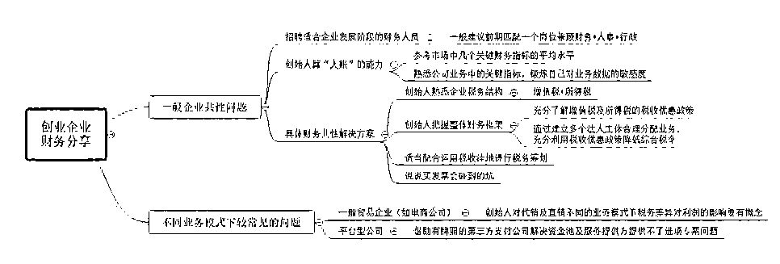

评论区：

亦仁 : 创业财税相关问题如果比较多，也欢迎评论区提出来，比较集中的话我会邀请  开一个财税快闪群，开群现场答疑。

二宝 : 开群太棒了  正好有疑惑

Auroraaa : 打call🥂🥂🥂

亦仁 : 咱们星球的  也是CPA，热心的她也会帮大家解答财税问题。

C小调 : 学习了，已收藏[强][强][强]

 

 

Sky🏹（表哥） : 收藏！

千羽 : 很关键，最近两年应该会用到

不许变懒的猫 : 特别有用，意犹未尽，其实很多创业型公司交的税是很多的，之前有人分享过大概7个点的样子，看起来有利润，一扣税所剩无几。特别喜欢这一期的分享[强]希望大牛开个专栏，哈哈
<!-- split -->
# (精华帖)(46赞)总结了一下行业里上得了台面、上不了台面的节税降税方法

作者： Abby窦

日期：2018-05-11

开公司的各位老铁们，有没有觉得公司缴税越来越多了？总结了一下行业里上得了台面、上不了台面的节税降税方法，贡献给大家，毕竟节税就是赚钱[呲牙]对于竞争激烈的行业来说，节税可能超越业务发展成为公司的核心竞争力，大家可以体会一下[偷笑]总体：

1.申请高科技公司，可以减免。聘请残疾人，可以申请所得税和增值税优惠。

2.生产和销售可以设在不同的省份，不同省份的税收政策不同。比如现在生产在安徽，可以把工厂这里公司的利润做的很低，交比较少的税。然后研究一下税收政策比较好的省份，把销售收入更多的做在那个省的公司里。

3.和地方税务局用专业方法谈。这里的一个小技巧是可以聘请一个当地税务局退下来的比如中基层人员，最好参与过当地税务制度编写的人，来帮忙看看自己公司哪些科目是可以不交税的，然后帮忙一起去和税务局解释。这种人的好处是去和税务局谈的时候能比较中立，对当地税务规定了解然后对企业业务也了解。遇到过实例是有个公司老板娘是管公司财务的，把税务制度研究了个底掉，然后拉着一推车的材料去税务局解释，最后谈成了免税。但是同行的竞争对手都是交税的。所以节税降税方法是他们公司的核心竞争力^_^

4.通过资本手段降税，收购亏损企业。比如在上下游看一下，有些亏损的老企业，但是没有太多的现金流支出的成本，有厂房、固定资产、老旧的设备等，但是没有太多员工。通过收购这种资产进来成为合并报表的一部分，亏损老企业每年还会发生大量的资产折旧，但是没太多的现金流支出。这样我的整个合并报表就会利润下降，可以节税。

 

 

5.如果同时做国内国际业务，把出口的收入做大，出口退税。

卖给国内的也可以用出口转内销的方式，比如在自贸区或口岸设个仓库，相当于出国兜一圈再卖回来（可能略不合规）

人工成本节税：

1.高管，用发票抵扣一部分员工福利

2.高管注册合伙企业，就是个体户那种，每季度9万以内的税很低。高管可以用家人的身份证注册，然后公司相当于支付劳务费一样，支付掉。

3.社保医保按最低缴纳（略不合规）

4.如果是有蓝领工人的企业，可以用劳务外包

5.关爱通，就是能将一部分员工奖金以积分的方式发放，员工角度可以从积分转为信用卡溢缴款再转入借记卡。从公司的角度避免大量补贴让员工交发票来冲抵可能带来的财务不合规。（见过上市公司也在用关爱通，但未来有可能不是很合规）

生产成本节税：

1.固定资产以更快的方式来折旧。固定成本分摊，一般效益比较好的公司，会把分摊时间放短，成本高利润低，来节税。效益一般的公司，有的为了融资需要利润好看，会把分摊时间放长。

2.生产成本降低所得税，可以把生产成本里的资产类支出费用化，比较合理合法的方式是融资租赁。用售后再租回的方式，比如把流水线转让给一家融资租赁公司，然后再从他手上租回来，这样融资成本就费用化了。

3.原材料成本节税，比如原材料成本长期看是上涨的趋向，如果想提高当期生产成本，就把原材料的会计处理方法，尽量让高价的部分快速进入生产成本，用“后进先出法”来确认生产成本。但是这种成本确认方法是几年不能改变的，会计师一般也支持这种谨慎的确认成本方法，也是合法的。

评论区：

方帅 : 专业的说法叫税务规划。要请专业的人来指导，就像你说的找个税务内部退下来懂行的人做顾问。

黑帝 : 不太理解高管注册合伙企业的操作  可以再详细说明一下么  谢谢[愉快] 亦仁 : 感谢分享，已加精华。

卡卡龙 : 我的理解：高管家人注册一个皮包公司，然后你的公司跟这个皮包公司发生劳务购买业务，给皮包公司支付了9万元劳务费，但是这个皮包公司需要交的税很少，比个人所得税要低。这是利用了小微企业的税收优惠政策。

 

 

Steven : 看到和自己工作有些相关的了，18年那时合伙人方式开始火爆  Steven : 可以这么理解
<!-- split -->
# 【知识产权】1篇
<!-- split -->
# (精华帖)(89赞)关于互联网公司人员常涉及到“知识产权”相关的保护、维权、预防、问题解决办法都在这里了

作者：  黄天

日期：2021-06-30

法律科普  知识产权  商标  著作权  专利

＃案例分享

纯干货万字长文，生财专享！

《关于互联网公司人员常涉及到“知识产权”相关的保护、维权、预防、问题解决办法都在这里了》

各位圈友好，我是黄天

今年418刚加入生财大家庭

加入生财短短两个月的时间里，我真是收获太多了

很荣幸能够被  选入龙珠IP修行营，据说1700人报名，只有92人入选，在里面与同学们一起学习了如何打造系统的写文章打造个人IP，最终输出文章

又参加了6月份的北京见面会，在里面认识了不少行业大咖，生财夜话聊到了半夜才依依惜别

 

 

说过，生财的宗旨是利他。确实，在生财可以找到各种赚钱的方法和思路，我看了很多圈友分享的教学帖，受益匪浅，感谢各位的分享，让我学到了很多新知识，找回了空杯心态，投桃报李，我也将用我的专业知识回馈大家

在浏览生财的过程中，我发现很多圈友都是从事新媒体、产品、互联网相关的工作，因为生财圈友多数是做互联网业务，可能都或多或少地遇到过知识产权问题

所以第一篇文章就讲讲  知识产权  ，我将从文章、产品、网站三个方面来做个利他知识产权科普，希望能够对你们有所帮助。

【知识产权目录提前看】

第一章节：知识产权科普

**1. ** 什么是知识产权

**2. ** 我们为什么要做知识产权

第二章节：常见的知识产权法律风险

一．文章的知识产权法律风险（著作权）

1.公众号

**2. ** 出版书

**3. ** 培训营

4.哪些情况可以不经著作权人许可，免费使用

二．产品可能面临的一些知识产权法律风险（专利、商标）

1.被起诉该怎么办

2.如何打击盗版侵权产品

三．网络网站的知识产权法律风险

1.主动侵权

2.被动侵权

第三章节：知识产权的保护、维权、预防、问题解决都在这里了

一.著作权（保护）

二.商标（预防）

三.专利（问题解决）

文章较长，建议收藏，如果对你有所帮助的话，请点赞鼓励一下，感谢

最后，祝大家生财有术，一夜暴富

 

 

为提升阅读感，请点击链接，移步石墨文档

 

 

https://shimo.im/docs/9DwppCVTwKDkpWYD/

 

 

评论区：

闫小林 : 天哥厉害，这篇文章太实用了

哆啦 : 优秀天

炮爷（不睡觉） : 知识产权这块确实比较欠缺，感谢分享

松果 : 知识产权是现代必备知识技能，尤其是不断输出的人。实用，赞🎏

黄天 : 哈哈你也很厉害，龙珠作业榜第一人

黄天 : 确实是应该掌握的知识技能

黄天 : 朝夕老师也很优秀，您的文章对我做教育推广也有帮助，我之前都是做线下推广  黄天 : 感谢阅读
<!-- split -->
# 【发展战略】5篇
<!-- split -->
# (精华帖)(353赞)创业公司靠什么能干成

作者：  亦仁

日期：2020-08-05

大家都知道，前段时间，我启动了「生财有术私董会」，服务那些月收入50万-1000万的生财有术圈友，帮助他们建立深度链接、跨界融合，详情可以看置顶帖。

我要做的事情已经很多，为什么我还有精力能干这事？

因为，星球里面有一位新的小伙伴  加入了我的团队，在他的参与和协助下，我对我们能给「生财有术私董会」的成员提供的价值非常确定，既然对提供的价值有足够大的信心，那就可以开干了。

光合何许人也？  为什么能成为我的合伙人？

我特地请他写了一篇分享，作为今天的  ，从他的角度来聊聊“创业公司靠什么能干成”这个话题，然后他很快给了我篇万字原创长文，希望这篇11000+字的分享给各位生财圈友带来一些启发。

 

 

说实话，发之前我又看了一遍，再次被启发到。

请大家欢迎  👏

为保证阅读体验，本次分享以PDF形式发出。

评论区：

Auroraaa : 双击666

黄小鱼🐠 : 光哥🐮🍺

游心 : 先赞后看[强]

张静伟@生财有术 : 666

老黄牛 : 干货[强][强]

一条枸杞 : 工作过程中承蒙光合哥哥很多帮助，真的是大佬，写文章也写得好，向光合哥哥学习！[奋斗][奋斗][奋斗]

江湖人称六哥 : 真的太牛逼了

大麦子 : 生财的服务团队就是牛🐮
<!-- split -->
# (精华帖)(304赞)#生财合伙人# 如何把大公司做成一家小公司？

作者：  亦仁

日期：2020-07-16

很多人梦想把一家小公司做成一家大公司，今天这位  ，他却想分享：如何把大公司做成一家小公司？

这是何许人？为何这么说？  听他细细道来。

欢迎  老板分享。

——

大家好，我是甄妙，美至简集团的CEO、同时也是甄妙营销的主理人。

 

 

作为一个14年的创业老兵，我经历过2个人刚开始创业时打拼的心酸，也有过管理上千人集团公司的“辉煌”经历，今天的主题不是一个标题党，我希望未来的一年乃至几年内，我会通过努力把自己做成一家小公司。

这里说的小，我给它的定义是团队规模不超过10人、赛道足够细分。

为什么会有这样的想法？这要从我的创业经历说起。

简单来说，我的创业经历几个阶段。

第一个阶段，懵懂期

每一个人的创业都不简单，我可能是少数创业没有失败的异类，但可能因为没有真正意义上的失败过，我也没获得多大的成功，从大学毕业到现在，我几乎没正儿八经上过什么班，基本属于一毕业就创业的类型。

刚开始创业的时候定位还是比较清晰的，做名片。

为什么做名片，因为我知道我一个黄毛小子一没人脉二没资源三没钱，名片是个可以门槛低、投入成本低的业务，别人做名片，是为了赚钱，我做名片，就是为了发展我的人脉，因为我认为只要有钱印名片的，要么是销售，要么就是公司里有点权重的人。

我特别喜欢帮每家公司的行政经理和总助做名片，因为每次帮他们印名片，我就可以把那些经理、主管或者老板抬头的名片电话存到手机里，然后过年过节，就会主动编辑一条原创信息发过去，很多老板、老总应该也是很忙，也不懂哪里串出来的问候，但是相较于那些复制粘贴群发，我的短信都带着XX总这样的称谓，然后根据我了解的情况编辑适合他们喜好的内容，就这样，硬是靠手动模式把一个行业的客户摸了一遍。

还有一点就是，我是设计师出身，相对于那些街边小店的排版工，在专业和认知上，简直有压倒性优势，自然给这些企业的“守门人”留下深刻的印象。这为我后面转型奠定了良好的基础。

第二个阶段，发育期

得益于名片业务获得的人脉资源积累，我很快通过名片这个抓手快速的链接到更多的衍生业务，从画册、DM单开始，到后面的VI设计、场馆布置，然后再到大型活动策划，就这样一步步通过口碑快速裂变，团队人数也从几个人扩充到几十人。

 

 

但是那个时候我一直有这样的困扰，业务越多，团队越大，每天忙的上串下跳，迟迟赚不到钱不说，借钱却越来越多，没几年就背负了几十万的债务，这形成一个很怪的现象，行业规模做的很大，行业名气也很大，流水也很高，但每个月都要借钱发工资。

突然有一天我反思，为什么会这样？那个时候我把自己归结为所在的广告生态链太低端，我做的都是最苦最累最没有利润的底层执行业务，这类业务还有一个最大的问题，就是需要垫款，我看了下我们那个行业做的很好的公司，基本也是外面有大量款没回来，一个比一个惨，每个老板都是像我一样经常通宵爆肝布展，我就在想，我不能再这样下去了，如何解决呢？对，我要到行业生态链的上游去——媒体。

第三个阶段，升级期

其实我在做升级尝试的时候，还是走了不少弯路的，因为当时的认知就是，做广告行业，执行是最不赚钱的，媒体赚钱，可是在那个时代媒体资源是需要关系的，各个行业的媒体其实都已经被关系户和大公司霸占，要进入这个领域似乎难上加难。

但也许就是念念有声必有回响吧，在我一筹莫展的时候，一家经营不善的户外LED公司阴差阳错的被我们接手了，这是我第一次拥有一个属于自己的户外媒体，当然这次接手，也为我后期的亏损埋下了伏笔。

因为选择了一个并不具备强势地位的过气媒体资源；在整个运营过程中，也没有考虑到就算是媒体，每年也会产生不菲的管理和维护成本，这些因素都直接导致了自己遭遇到了人生中最大的一次危机，不但没把借的钱赚到，又倒欠了几百万。

命运把人逼到绝境，就可能真的发生奇迹。

受媒体业务拖累，传统广告制作业务也受到了影响，最困难的时候为了给员工发工资，自己不得不四处为企业兼职做策划来养公司。

就在几乎陷入绝境的时候，一次利用微博话题做的低成本营销让当时几家濒临倒闭的夜场起死回生，这让我第一次感受到了新媒体的力量，那么我自己是不是可以做一个属于自己的新媒体呢？

就这样，南宁圈诞生了。

短短几个月里，我印了几万张二维码，用最老土的方式，不分白天黑夜的到南宁各大厕所贴小广告，但正是这种谁也看不上的地推，粉丝获得了几何倍数的增加，微信公众号意外的做成了当时行业内的网红帐号。

 

 

当我人生第一次看到账户里躺着30万现金时，自己泪流满面，这更笃定了我的判断是正确的。

媒体模式较之前的制作业务最好的区别在于，相比传统媒体，维护成本几乎为零，而纯广告的变现模式，效率也比之前动则十天半个月才结束的线下制作周期提升很多，瓶颈，在业务重构后似乎悄然解决了。

第四个阶段，膨胀期

人在每个阶段，除了获得一定的成长，也可能会跳进另外一个更大的陷阱里。

视野的扩大，让我接触到各式各样优秀的人，由于南宁圈做的很成功，成为当时全国区域自媒体的10强账号，一度被全国各地的自媒体人模仿、抄袭，我成了小圈子里的“网红”，四处演讲、分享，聚光灯和包裹在身边的鲜花和掌声，甚至一度让我产生了所谓的“明星”幻象。

那些曾经膜拜的行业大牛，似乎给自己感觉再不是那么高不可攀，人的欲望和虚荣心也在这个阶段极速膨胀。这个时期的关键词就是：野心、浮躁、飘！

第五个阶段，激进期

激进期是伴随着膨胀期一起到来的，充裕的现金流加上为数不少的融资，自己开始疯狂的做着加法，从投资网红、开经纪公司，再到四处并购团队，一副春风得意的姿态，那个时候虽然很忙很累，但是心里感到特别充实。

今天想起来，才发现是多么的幼稚和浮躁。

危机总是伴随着泡沫一起到来，因为投资和参与了太多项目，公司的战线拉得很长，营收虽然获得了爆发性增长，但是由于贪图求快，在股权设计和成本控制上犯了很多致命的错误，这种蒙眼狂奔似的盲目扩张，也为日后新的公司危机埋下了伏笔。

这个阶段是个什么状态呢？

你很累很拼，但是你会发现你一个人的精力根本无法同时兼顾那么多项目，一旦项目接连出现问题，整个人都濒临崩溃。

第六个阶段，虚胖期

 

 

最高峰的时候，以我做法人的主体公司就有60多家，遍布全国30多个省份，所谓的“集团”有近千号员工，一种盲目的“总裁”既视感让我有点忘乎所以，开始对接更多的资本，3亿、5亿、10亿的估值也开始在脑袋里不断涌现，被并购或上市的预期让自己有点浮躁。

因为体量较大，要管理的事就特别多，从资本到财务、从运营到市场，很多本来该做不该做的事情我都要接触，每天变得更忙，我是个凡事喜欢亲力亲为的人，这样的性格让我很难成为一个合格的CEO，随着集团各个子公司的问题此起彼伏，我卯足了劲成为了空中飞人，却依然收效甚微，很多在脑子里的运营和策略几乎很难同步到公司一线，而人员的培养又是个长期和复杂的系统工程。

短期压力和中长期规划衔接不上，让我精疲力尽，虽然最终在合伙人的协同下，公司在第二年就做到了几个亿的流水，但是规范化后，你会发现净利润可能还不如以前做一家小公司时候的额度，在频繁的对接资本后，发现被并购和上市都有一个硬指标，就是合规净利润，然后才可以按照PE做并购或者估值，公司大了以后，特别是自媒体行业，很多收入构成很难做到绝对的合规，而强制合规的代价就是净利润的大幅度下降，这无疑让我陷入两难的境地。

第七个阶段，瘦身期

编制的扩大，团队人数的增加，都在潜移默化的增加公司的沟通和管理成本。

有一段很好的个人经历，在某个时期，我发现公司在20人规模的时候产能居然和5人的时候是持平的，5个人办公，可以是家庭化管理，大家每天在一个不到50平米的出租屋创业，沟通交流都没有障碍，遇到工作不分彼此，一起脑爆一起加班，即使工作再多也不会感觉累。

而到了20人规模的时候，办公室大了，原来的几个伙计，都要开始分办公室了，你为了平衡他们，需要给大致相同的待遇、配备，每个人配一个助理，部门下还有专员，原来一个人可以完成的事，一定要通过助理去传达，人多了你给配行政管理考勤，然后你发现还需要个人事，因为大家都分部门了，就更要讲究公平，这个时候你一定会上kpi吧，那么主管们大部分时间不是在对接业务，而是在每天想着怎么算kpi 更合理，财务上原来leader坚持做个流水账加上个代理记账公司就可以解决的事情，现在要分为会计和出纳，最后你发现那么多人实在管理不来了，创始人还会配上一个副总，一来二去，公司业务增长为0，成本却翻了几倍，最可怕的是，公司的业务服务水准直线下降。

 

 

我几乎是花了3年的时间，证明了自己不适合做一个优秀的集团CEO，人一多，我就会有点手足无措，虽然我一直不愿意相信这点，并且去学了很多管理课程，但是相比于我对运营和营销的热爱，在没有找到更好的副手帮忙前，我选择缩减规模。

去年的一整年，我的主要工作就是减负、瘦身，从公司到项目，从结构到人员，虽然这个过程比较痛苦，你要和很多相处很久的老员工谈分手，很多不温不火的项目和部门被缩编、转型、拆解甚至解散。

如果是以前，我大概率是不想面对的，但是不管你怎么害怕，你终归要学会面对，说实话，我逐渐开始感觉，自己开始从一个创业者，慢慢有了点生意人的气息，这个过程其实是一个逐渐冷血的过程，但是也是一个从感性到理智化的过程，我是在做公司、做一门生意，自己不是慈善家，也没办法做慈善家，如果一家公司没有利润、不赚钱，那就是对商业最大的亵渎，一家不赚钱的公司，是违反商业本质的。

得益于2019年的持续减负，年初突然袭来的疫情对公司虽有影响，但损失控制在一定范围内，人员的减少使公司成本开销大幅降低，熬过了最难熬的第一季度，虽然过程很痛苦，不少项目人员离散，但财务面上，公司意外的保持盈利，于我而言，这真的是一次很重要的认知体验，我不知道怎么形容这种感受，就是你看着业务像一潭死水，团队因为裁员风波人心不稳，但是公司居然是赚钱的，这样的反差，让我第一次感知到了做生意和创业那层很冰冷的区别。

第八个阶段，聚焦期

公司在经历一轮瘦身后，虽然士气有所影响，但是主力尚存，这为我们在疫情期间存活下来奠定了基础，同时因为砍掉了半生不死的项目，我的精力可以回归到主业上来，我有更多的时间思考，我现在要做什么，我准备走向哪里。

在这期间，基于我个人的标签，我在集团内部成立了一个很小的团队，人员构成就是之前总经办以及品牌部的同事，并为此成立了一家公司，主攻大客户，专注做战略话题营销，而团队因为人员不多，经营压力不大，我花了足足半年打造团队内部的结构，完善理论基础，做SOP，半年里，也见了很多客户和前辈，但是基本都不轻易签单。

因为前面十几年的创业经历，让我深刻意识到一个核心的本质，就是公司一定要赚钱。

以前我都以为自己是马云、是马化腾，但是再大的公司，首先要养活自己，并且活得足够好，最直观的表现就是充裕的现金流和利润。我花了13年的时间，让自己认识到，自己不适合做管理老板，大公司的管理其实很复杂。

 

 

那么，我为什么不能扬长避短，去做一个激情的团队Leader，而不是一个大老板的角色呢？是不是有另一种选择，就是把公司做到足够“小”，但，业务可以做的足够大？具体来说，就是学会把企业做小、做精，并在自己擅长的领域坚定不移地专研下去。

把公司做小，把客户做大，把业务做精。好处显而易见：

其一，把公司做小、做轻，可以聚焦能量，在自身擅长的领域实现长远发展和突破；

其二，以客户和市场为导向，可以让企业摆脱成本经营和价格竞争的困境，建立以能力为基础的长远竞争力。

但是要做到这点，谈何容易？客户做大，意味着高客单价，而高客单价，意味着你必须有足够的壁垒以及人无我有的“绝招”，我首先给自己做了一个深度定位，我是谁？我要怎样做才可以在一个领域做到足够的头部？

如果我依然给自己的标签是自媒体，那么在中国可以找到无数个比我更牛逼的自媒体公司，如果是做营销，那就更多了，中国带营销字头的大师、大咖几乎数以百计，那有没有一个我可以做到头部的呢？

我想了一下，过去几年，我有一个标签，就是擅长做话题营销，我做了一个全网检索，发现目前做话题营销的个人还是公司，都相对较少，哪怕带话题营销的，也大多没有什么知名度和案例，而我在过去的几年里，几乎每年都可以搞出好几场刷屏，这不就是人无我有吗？

在找到这个定位后，还不够，你必须建立一套属于自己的理论体系，这样的做法好处很多，远的不说，近的有定位之父特劳特，其实定位理论很早之前就有人在使用，但是以“定位”来命名这套体系的特劳特是第一人，这也成就了日后的特劳特定位风靡全球。

因此，我把自己的实战梳理成了一套体系，并命名为：战略话题营销，要注意，在这之前，行业内是没有出现过这个概念的，这套理论从开创之日起，就贴上了甄妙的基因色彩。

这一步，目前来说算是走对了，随着服务客户的深入，体系日趋完善，而在战略话题营销领域，我几乎没有对手，因为它足够细分、壁垒也足够高，要找到一个有着丰富话题成功案例、又有流量资源加持，同时要对品牌和流量都熟悉的第二家公司，几乎找不到。

 

 

今年以来，我开始从被动的找客户，到主动的挑客户，今年请我服务的大型客户不下20个，但是目前我愿意签约的只有不到6家，并且每个行业品类，我只选一家，这样我的议价权就会更高，我和我团队说过，不要向客户说明你能做什么，而是要让客户明白，如果他不选择你，他可能会失去什么，或者变成他的威胁。

所以我今年也已经停止新的签约，我有半年的时间，把这些客户的服务做好、做精。在我这套营销理论里，有一个4R逻辑，就是“认识-认知-认同-认购”，我认为所有转化都需要遵循这套逻辑，因此今年和我接触的客户，我都不会尝试合作，但会保持联系，这样到明年，双方认知同频，并且对你足够认同的时候，签约是自然而然的事，而这样的少而精模式，带来的是每个客户的高客单价，而这后面，和我提供的高价值和不可或缺性，有必然的联系。

我算了一笔账，如果按照目前的签单额和进度，一年的签约额和利润，几乎可以扛过之前一个千人的集团公司，这就是我要的小而精。

最后，附送一下我整套战略话题营销的三板斧和模型，如果看不懂的，也欢迎私下交流，今天篇幅所限，就写到这里。

评论区：

G : 非常认同小而精的理论

丹尼 : 这个世界上有三种东西最值钱：

1、成功者悟出的道；

2、失败者踩过的坑；

3、平凡者后过的悔。

谢谢分享价值上亿的坑与道。[抱拳]

依凡 : 做生意和创业那层很冰冷的差别[捂脸]

这层无奈真叫我感同身受

虽然依旧是创业团队，但老板今年开始想往正规军上靠了，变得熟悉而又陌生

走了小半跟不上步伐的老人，整体效益反而是更高的。。。

第二阶段提到的需要垫款，利润微薄和我们眼下的情况也很像

 

 

感谢大佬无私的分享，感觉自己一瞬间厘清了诸多思绪[囧]

阿may : 人生最难的，莫过于认识自己，真正清楚自己想要什么，能力圈在哪里，真的不是一件简单的事，祝贺甄妙找到了内心的方向！

商家岛旭教练 : 妙老板好

卫斯理 : 厉害👍！谢谢分享！

白一喵 : 甄妙老板真妙～

阿兵哥 : 有个疑问,公司做小之后,不怕员工携带你的客户或者技术跳槽单干吗,如何防范这类情况呢
<!-- split -->
# (精华帖)(300赞)公司过了生存期，作为老板的你，要开始发展哪些能力？

作者：  亦仁

日期：2020-06-10

今天的，我邀请了目前在星球内龙珠排行榜第一名、有15颗龙珠的圈友@白一喵·超级个体。

白一喵，主业CEO私教和顾问，服务过消费品、成人教育、K12教育、消费品、传统广告公司转型等领域的客户。

和白一喵深度聊过几次后，我觉得他有能力做很多中自小企业CEO的私教和顾问，推荐有组织管理相关问题的，可以找他聊聊。

不过我说他优秀不算，大家看稿各自判断，时间不早，直接来吧。

欢迎  👏

———

老板们好，我是白一喵。谢谢生财有术赏脸，让我分享自己的一些观察和经验。

 

 

我06年进入清华学习计算机专业，在清华园度过了7年。毕业后走了相当非主流的职业路线，一直任性的随心而动，在不同的领域和岗位上流转。如果把我在校期间的实习经验也算进去，我踏足过的领域主要有：人力开发、人力咨询、品牌管理、新品开发、产品设计、运营、商业咨询、高管教练..... 个性喜欢研究，解决复杂问题，而在赚钱这件事情上一直还是宝宝，这也是我加入生财有术，和各位请教学习的原因。

当前我处于自由职业的状态，主业CEO私教和顾问，利用我在大型外企累积的视野广度，以及在成人教育学、组织发展、人才发展、品牌管理等多个商业学科的理论和实战积累，面向互联网中小型成长团队/公司，解决创始人和核心团队的能力成长和组织能力的问题，推动组织层面的商业创新。一般来说，这样的服务主要客户是大型公司，我相当于走了一个用大刀烹小菜的策略，也算是错位竞争了。

除此以外，我也在运营自己的社群，孵化更多具有CEO思维的、能有独立能力的领域专家。

总的来说，我的所有工作还是和商业效率和创新相关，只是切入的视角是“人”和“组织发展”。这既是我的专业兴趣和聚焦点，也是我的信念核心所在 —— 21世纪的商业核心竞争里，在于人才能力和组织能力。生意起不来，归根到底都是人的问题。

成长经验

亦仁希望我分享一下自己的快速成长经验，说实在我有些惶恐。一来，我不觉得自己是个成长速度很快的人，面对崛起的后浪时常觉得压力山大，要努力学习提升才能保持不掉队。另一方面，我认为每个人的成长路线都不同，没有固定的攻略可言。

与其分享不知道普适性如何的经验，不如谈谈我自己总结的一些基本原则和规律吧。一家之言，不认同也不要紧。

一言以蔽之，不同年龄阶段的人，学习成长策略应该有所不同。

（1）如果你是年纪尚轻的小朋友，年轻、学习能力强，就是你最大的本钱。社会经验不足、对真实的世界缺少客观的感知，没办法把看到的信息和实战经验相关联，是你最大的bug。对你来说，广度优先的探索、开眼、长见识最重要。

正是因为没见过，所以才对目标缺乏具体的想象能力，没办法以终为始的从最终的成果去倒推具体的行动方案。见识浅薄，所以才会大惊小怪，动不动就非黑即白、三观碎裂。

 

 

在这个阶段，多学习不同领域的知识，实战不同类型的生意，抓住一些以后不容易再获得的经验（比如努力去大公司看看人家的运作）。

以我为例，在校期间，我学过HR；积累过艺术、英语、日语的能力；考过GRE、TOFEL；去消费品公司做过研发和打杂；去咨询公司当过“表弟”；在学校里带过200人的团队，也见到了最好的领导力范本；给公司打过cold call，做过陌生客户拜访；上街头推销过书......在当时，并没有得到什么立竿见影的成果，更不像现在生财的很多小朋友很早的就赚到了第一桶金，一度让我认为自己积累的全是无用的知识和经验，当时的我消化不了，也用不上。

但现在回过头来看，我在商业上具备一定的全栈能力，都是因为过去的知识和经验，在我脑子里埋下了种子，时机一旦成熟，过去的记忆会重新发芽。我现在作为顾问，能相对容易的在不同的领域、学科中找到遥远的相似性，抽离出简单的共性，就全得益于过去这么多年的“无用”的积累。让我和其他顾问区分开的，很可能就是我知道，在搜索引擎里应该搜索什么关键词，面对的问题对应哪个学科、哪个领域的哪个分支。

知识的广度，越早开始积累越好。

（2）如果你已有一些社会经验，年龄超过30，要开始过渡到对上层智慧的领悟。

从20岁开始，人的流体智力就开始下滑，也就是说记忆能力、学习新东西的能力会越来越差，但同时与经验和智慧相关的晶体智力会保持不变，甚至可以通过学习不断提升。

在这个阶段，禅宗、哲学等偏向人文的学科，会对人很有帮助。

了解万事万物的基本运行规律，具备历史观，知道从先人的经历中找相似性，能帮助你跳过逻辑，直接快速抽离事情的本质，用更简单的方式得到洞察。

比如，对我影响很深的智慧有两套。

（1）犹太人的哲学。比如，做事永远挑难搞的哪一个，我一直在秉持这样的原则挑选要涉足的生意。

（2）中国古代哲人的思想，比如《》《》《》等。虽然现在只能看懂一点皮毛，但足以帮助我用更加一元论、辩证统一、全局的视角，来审视复杂的问题，快速得到解决的思路。

我个人的情况先说到这里，下面开始今天正式的分享。为了图文混排，方便阅读，我单开一个PDF文档。

 

 

主题大纲：

（1）CEO的三大重点：造梦、打牌、盖楼

（2）年轻CEO的常见问题：务虚不够具象化，管事带人的能力不够扎实

（3）行动指南：重点说如何正确务虚、带人和建立沟通系统

详细分享内容戳下方PDF。

深度交流也可以加我微信jadey87，备注生财圈友，添加好麻烦先发个自我介绍。

https://wx.zsxq.com/mweb/views/weread/search.html?keyword=孙子https://wx.zsxq.com/mweb/views/weread/search.html?keyword=周易https://wx.zsxq.com/mweb/views/weread/search.html?keyword=皇帝内经评论区：

大树🌳🌳 : 喵总，厉害

白一喵 : 感谢生财有术邀请。关于使命的重要性，还可以移步  的分享

这个话题我花了很长时间写，一直在删，难点在于信息量太大，有基本原则、无固定套路。企业诊断如同老中医号脉，有意思、也有挑战之处在于每家公司情况都不相同，所以给出的药物配比、轻重、服药时间都不同。

这篇分享只是尝试展示一个粗略、感性、不精准的全貌，提供一个探讨的共识基础。欢迎老板们评论互动，我尽力一一回复。

如果暴露出的新问题具有一定共性，我再围绕对应话题多分享操作层面的经验。

https://t.zsxq.com/7i2zzvb

钜鹿 : 以前在公司做班的时候，觉得这些离自己很远，外部培训企业管理的课程也觉得老板在做一些不明所以的事儿。自从自己搞项目运营，做闭环成交，看这个文档才发觉曾经的自己是多么弱小。死磕自己，什么时候都不晚

白一喵 : 屁股坐的位置不同，视野不同，工作重点也不同。

一个组织里，大家各司其职罢了。

钜鹿 : 是的

旺小哥 : 赞，感谢喵总分享[强]

真理 : “(2)即刻开始寻找适合自己的教练和顾问，为组织提供外部视角。一个判断人选质量  的简单标准:是否有极强的沟通和共情能力，能提出你之前从未想过的好问题。” 洗脑文+广告贴。但80%以上ceo确实需要，这些人都太弱了，轻易会陷入情绪化，需要 

 

别人抚慰。

真理 : 以前是成功学，大师，商学院，辟谷，企业家社群，现在是ceo私教，本质上都是为缓解焦虑服务。记下了，确实好生意。这才是生财有术！[强]
<!-- split -->
# (精华帖)(236赞)公司想做大，不能只指望免费流量

作者：  七对

日期：2023-07-11

一个项目能不能持续赚钱，很多人想到了商业模式，但是没想过付费流量。总觉得只要“薅”够免费流量就好了，但通过投放做增长才是真正的商业思维，才能掌握更多项目的主动权。

项目想做大，能持续赚到钱，付费流量和商业模式，二者不可缺一。我们公司的商业模式，从产品变现、交付，到做口碑、做品牌都离不开付费流量。

特别是在经历了 2022 年疫情，整体业务受影响之后，我们更加意识到了付费流量在商业模式中的重要性。借此机会，也和大家聊一聊付费流量和商业模式之间的关系。

一、自我介绍

 

 

我是 03 年 -09 年本硕就读于南京大学，校园招聘进入阿里巴巴担任产品经理，15 年到  18 年在原湖畔大学工作。

18 年离开阿里选择在线教育行业作为负责人进行创业，创业的第 6 个年头，目前主要做的业务是公务员考试培训。

生财编号424号，2021年也在生财南京见面会做过分享，《三年团队从0到160人的总结与反思》，经历了疫情的2022，我们整体业务也受影响，但还好我们活了下来，对商业有了更深的思考。

主要跟大家聊聊付费流量和商业模式。

首先要申明下，我们不是一家搞流量特别厉害的公司，不管是免费还是付费流量，我们的能力都不是顶级的，但是我们是比较综合的，在付费流量和商业模式结合这方面，也有总结了一些见解。

二、可行的商业模式

商业模式里面我认为包含几个方面：

（1）到底给客户创造了什么样的客户价值？

 

 

（2）怎么把产品推广给我们的目标客户？

（3）客户来了之后怎么转为付费客户？

（4）客户付费后交付怎么让客户满意？

（5）要能做好这一切，团队能力是不是具备？

（6）企业来是不是能持续盈利？

我觉得只有这 6 个方面都满足了，这个商业模式才是可行的。

（**1**）客户价值

这是一切一切的基础，我们到底为哪一类客户创造了哪些价值？

产品 1，营销只是后面的 0，1 都立不住，一切都不成立，我都始终坚信这一点，所以，对于没有明确需求的产品，或者没有足够的客户价值的产品，我觉得是很难做的。

我们公司主要是提供的产品是线上公务员考试课程，以及部分省份的地面课程。

线上课程的目标对象比较明确，就是平时比较忙，有一定的预算，学习不够自律或者理解力不是很强的学生，特点就是帮每个学生制定课程计划，强盯学，以及 1 对 1 微信答疑，强化整个的学习管理，保障学习效果。

这区别于市场上很多的网课，但是交付就特别重，在老师和班主任上投入较大，包括学习平台都是自己研发。

 

 

线上公务员考试培训已经很卷很卷了，但是我们很清晰的坚持自己的定位，价格在行业里也是比较高的，我们确实口碑做的也不错，精准满足了不少学生的需求。

所以，第一步一定要明确界定用户价值，到底为哪一类用户创造了不一样的用户价值，这是基础中的基础。

（**2**）流量来源

我们是不做地面推广的，都是线上获取流量，线上流量分为免费流量和付费流量。平台都有红利期，能在平台获取免费流量能获取是非常强的能力，但持续性是问题，不确定性是问题。而只有真正的付费流量，才有确定性。

我们创业的时候，也想过刷题工具 App 切入，但是那时候已经有刷题工具的老大了，我们没有做出来。

我们一直在各个平台去找流量，幸运的是抓住了抖音的红利，跟抖音的发展周期比较匹配，由于入局早，当初做一些简单的素材通过抖音小店带货，最高峰一天都能带个  4,500 套书。

但是没多久，这个红利就没了。入局的人越来越多，哪怕我们的内容做的再精致，流量比较少，但是红利期的免费流量确实那时让我们起步发展的很快，但是不稳定，经常数据波动比较大。

另外一个就是抖音直播刚火的时候，我们也在做，当时还被头条内部作为分享案例，结果就是更多的人看到了这个机会，入局了，我们又沉默在大海里了。

 

 

任何一个免费流量的获取方式，做的人多了，免费流量就被稀释了，特别是抖音上这种去中心化的机制。

我们在免费流量上沾过光，但是真正稳定的还是付费流量，我们是 2019 年就开始做巨量引擎的投放的，高峰期 20 年一年光广告投入都 1000 万以上。

免费流量没了，但是我们付费流量还是托起了，持续稳定。

而这时候也是我们 20，21 年快速发展的直接原因，也就是在那一年，我们  人数到了  159 人，因为服务的学生越来越多，而每个学生的服务是依赖于老师和班主任的，我们的交付做的比较重。虽然做付费流量，但是我们规模化起来了，确定性强了。

但是这个过程中，付费流量的获取，也会随着玩家的增多，获客成本也会趋于稳定的值，我们也切身感受到付费流量的单个线索的获取的成本在不断的增加。

因为做付费流量的玩家也越来越多了，大家都在抢，有新进入的，也有退出的，最后付费成本趋于稳定，对于付费流  量，我们本身也是一直在研究优化，好处是确定性，关键点之一是成本的高低很依赖于团队的水平。

所以我们一直坚持自己公司做投放，不依赖于第三方服务公司做投放，因为我始终觉得付费流量的获取也是团队的核心竞争力之一，怎么可能依赖于第三方呢，第三方服务公司是服务多家客户的。

（**3**）产品转化

 

 

流量来了，产品是怎么转化的，这个是绕不开的，这又是个很多的因素影响的，公务员考试线上培训我觉得转化率是偏低的。

低价的课程是可以直接通过直播间或者视频成交的，特别很多个人老师在直播，但是对于价格高的课程，直播带货很难，往往都是加了私域成交，建立信任，成交。

但在我们行业影响转化的因素我归纳为几点：

**1**、客户价值。客户价值能多大程度满足客户的需求，一方面是认可价值，另一方面是付费能力。

比如我们做的线上强盯学，1 对 1 答疑的网课跟其他机构做的直播网课的定位完全是不一样的，有些用户觉得网课就应该很便宜，他会觉得同样的价格可以去选择地面课程了，那这部分用户群体中，我们的转化率就会比较低。

但是也有不少在职的，平时工作忙，自律性不够，又有一定的付费能力，这些用户中，我们的转化率就比较高。是不是匹配精准用户直接影响着转化。

**2**、竞争环境。当行业本来就很分散的时候，供应端的产品很多，用户的选择也很多，而这时，流量的获取又门槛低的时候，竞争会越来越大，转化会越来越低。

我们刚推出的时候，产品的独特性，以及用户的选择性没有那么多，所以转化比较高，但是很多人进入到抖音等平台时，哪怕我们的价值点跟其他的产品有明确的差异点，还是会被稀释，毕竟别人的价格在那里，用户看了价格之后，也会综合比较其他家课程。

 

 

抖音虽然是机会，但是其去中心化  的机制，以及低门槛的进入，也容易引起激烈的竞争。

**3**、产品口碑。一个产品或者一家公司要长期发展，学生端的口碑是一定要保持的，特别是在线上推广，当学生来了之后，如果口碑不好，反而只会更砸了自己的招牌，线上来的用户往往更会去搜集信息，综合比较。

当然，不可能每个用户都会说自己好，但是一定要积极对待每个用户反馈，不断改进产品和服务，因为这很实际的影响产品转化，而这要保持好口碑又恰恰是非常难的。

**4**、私域团队的转化能力，特别是需要跟学生建立信任，很好的匹配学生需求，并且帮助学生做指导规划，同时还要有业务意识，不同的私域团队的转化能力是不一样的，这对转化很关键。

有些是不能改变的，比如竞争环境，有些是我们能改变的，比如产品定位和品类，客户口碑的积累，团队能力的提升，但是每一个环节都不容易，而且不同行业的办法也不一样。

公务员考试培训行业，每年又会新增很多第一次参加考试的学生，对于品牌的粘性没有那么强。

而同时教育培训又是比较分散的行业，行业经过 20 多年的发展，也没有出现一家通吃的格局。这有利有弊，好处是进入者有机会。

比如我们，坏处就是，竞争的人太多了，另外一个就是要想壮大，品牌的溢价能力并没有那么强，每年都要面临拉新的问题。

 

 

我们从 2018 年开始就推的是强盯学，1 对 1 答疑以及个性化的全程陪伴的课程。

当时市面上的网课主要还是大班直播，后来是涌入线上的机构越来越多，很多机构跟我们用一样的名字，也叫全程陪伴，价格比我们做的更低，也强调 1 对 1 盯学，答疑。

而他们背后的交付千差万别，比如就简单的问下学生是不是学习了，也算盯学，而我们完全是基于学生的学习时长，做题正确率的后台学习数据进行盯学；

1 对 1 答疑，我们一直做的是专业授课老师的答疑，而很多机构做的是群答疑，或者是非授课老师的答疑，这背后的交付又是千差万别。

但是对学生端选择的时候，学生不会完全识别，或者也没法感知到价值的差异，加上价格的差异，所以我们的客户出现了流失，转化率降低明显。

所以，我们花了大量的精力在给用户提供更多类型的产品和服务，为了提升转化率，从价格梯度上，开始做低价，期望通过价格去参与竞争，我们推出了几百到小几千的课，期望通过价格去提升转化。

但是实际的结果并没有我们想象的好，反而在产品供应端多了很多产品，无论在课程研发，还是印刷教材，上课班次上多了很多成本。

更核心的是，我们的获客成本并没有降低，反而低价课程降低了我们的整体的 ROI。

总结下，就是我们期望提供更低价的多元化产品去迎合市场的变化，但实际的效果是增加了后端的供应成本，同时，前端的客户数和营收并没有等比的增长。

 

 

在提供低价区间的产品的同时，我们也提供更高价位的产品，增加了更多的产品价值，比如 1 对 1 诊断，1 对 1 直播授课以及线下集训等。

这个方向却让我们增强了竞争力，因为我们提供的 1 对 1 直播，线下集训等，恰恰是很多机构做不了的，因为交付太重了，我们这时候的老师多的优势才发挥出来。

这个方向产品的推出，虽然在学生数量上没有爆发式增长，但确实是满足了部分追求更高品质学生的需求。而且我们做这类产品的竞争力更强，因为这依赖于公司有较多的全职的老师和班主任，并且服务和教学做的很深。

虽然在后端交付上做的更重，但是客户价值反而更明显了，反而是硬实力能得到体现。

而要围绕着更深度的服务学生的客户价值出发，我们整个公司从产品设计，到客户转化，到课程交付，团队都要去改变，去适应，拥抱变化，而团队能力在短板上的补齐不是那么容易的，围绕着转化。

我们尝试过太多了，无论是运营上，还是产品供应上，最后才慢慢找到适合我们团队能力的方向，而这个能力又是动态变化。

所以说，转化难，是真难。

（**4**）产品交付

好不容易转化的客户，承载着客户的信任，这时候，交付尤其重要。

 

 

价格是锚点，特别是高价的，必须要物有所值，必须要对应很重的交付，我们在做网课的时候，就有很深的体会，这么多的学生，怎么去盯学？

是不是要开发自己的盯学系统，看看学生的学习进度如何，做题正确率如何，这些又不是市面上的软件能解决的。

同时，盯学需要班主任老师，每天布置任务，追着学生的学习进度，班主任老师的培养，流程怎么保障到位？

还有就是学习过程中 1 对 1 的微信答疑，这是核心的竞争力之一，学生学的过程不会了怎么办？

那老师 1 对 1 答疑，专业度如何保障？老师的答疑量怎么保障？

所以交付是很重，我们在后端的投入又是比较大的，我们是想长长久久做，那必须交付端不能出问题。如果出现承诺的做不到的时候，那负面口碑就会多，也就不具备持续性了。

（**5**）投入产出比

互联网上，每个精准流量都是有成本，如果是免费流量，也背后有人力成本等，只是折合下来比较便宜，而付费流量就是明确的流量成本了。

需要算清楚的账是，当流量来了之后，算上转化率，以及交付成本之后，企业是不是能盈利？

 

 

在我们行业，线上的课程分低价和高价的，低价的主要是录播或者大班直播，而高价的要么是小班直播，要么就是我们学习计划，强盯学，1 对 1 答疑的模式。

如果流量获取上需要花费比较高的成本的，低价网课是没法支撑的。

假设获取一个客户 50 元，但是售卖的课程是 200 元，这个账是算不过来的。毕竟转化率没有那么高，而且课程本身就有成本，像我们提供的线上课程，除了开发系统，还有老师的 1 对 1 答疑，盯学等，这成本又是更大。

所以不得不考虑投入产出比的问题，怎么才能健康持续的发展，不能靠亏损的流量获取再转化的方式做大，因为这总会有爆雷的那一刻。

我们行业里出现退费导致公司资金链断裂的案例也发生过，本质上还是模式有问题，Roi 算不过来，变成了金融游戏玩资金周转。

为了能把付费流量的客户转化，推出了大量的不过退费的课程，甚至更夸张的只要学习了一定任务，就可以退费，这种根本不考虑投入产出比的，不出问题才是奇怪的。

（**6**）团队能力

企业里的每一块业务，都需要人来落地的，都是对应的团队能力，从运营，到转化，再到交付的老师，技术，班主任团队，都是门槛，有些是可以借助外力，但是在企业核心竞争力层面是必须依赖自己团队的。

 

 

而团队能力的出现，不是一朝一夕的，特别当人员越来越多的时候，怎么把团队打造成能支撑业务发展的能力，这个需要不断的选人，不断的建立体系，不断的优化，不断的培养。

三、为什么聊付费流量？

（**1**）确定性强

在有了产品和客户价值之后，很关键的就是解决客户来源的问题。

当抖音，微信等平台商业化成熟之后，其实对于需要流量的创业项目是好事，至少在流量上，花了钱，一定是有确定性流量保障的。

当然，怎么做付费流量，怎么控制成本是另外一回事。

（**2**）复制性强

确定性强之后，其实意味着复制性就比较强了，从一个行业复制到另外一个行业也很正常。

 

 

我见过做淘宝等电商的公司，就是从卖一个产品到卖另外一个产品，产品和产品之间没有任何关联度。

但是本质上的核心能力一样，就是团队的电商运营能力，不断的拓展行业，复制到新的品类，碰到一次风口就直接起飞了，就像之前听说过卖打底裤的公司在过去几年卖口罩的案例。

（**3**）不依赖于人

付费流量还有个好处，就是素材加投放，对于人员的要求，数量上不用多，而是精，不依赖于大量的人。

一个人可以同时做多个行业，前提是这个人的能力可以。做企业很多时候，人力是很重的成本，而且随着人员的增加，管理也有难度。

（**4**）关键点

我再三强调的，付费流量应该是团队的核心能力，在获客成本上不同的团队做出来的成本是不一样的，我是不认可这个能力外包的。

举个很简单的例子，当年 k12 投放很多的时候，一家服务商可以同行业的多个客户，在获客成本上，大家都没法形成优势。

 

 

四、付费流量让更多成为可能

付费流量解决了客户从哪里来的问题，这是很多项目的前提之一，不用担心客户从哪里来了。

有了这些好处，对我们来说，从客户价值，商业算账，产品转化，生命周期角度算，复制一个新项目就很快。

我一直觉得，懂得和掌握付费流量的玩法，掌握了很多项目的主动权。

一般从 3 个角度论证并进行测试：

第一，搞定供应端，到底给客户创造什么价值？

第二，转化，一个客户在生命周期中，能产生多少的利润；

第三，交付是不是能支撑，有没有可持续性。

就是很小的团队组合下，能快速完成项目的最小单元测试。当然，要对这 3 个环节进行充分论证，当然这里也一定是成功和失败并存。论证好，就可以行动。

举个跨行业尝试的案例：

 

 

22 年我帮朋友公司做过尝试，对我来说，当时就是想试验下这种模式。

对他们来说，他们是基于付费流量进行客户池子的拓展，行业的跨度非常大，直接到了工业品领域。

公司是做电子元器件的分销的，主要代理了施耐德，西门子等国内外标准的工业品，客户主要是工业客户或者小型批发商。

他们通过付费流量找到了更多的客户群体，然后给专业的销售跟进转化。

模型测试下来，基于原来的供应链，是跑的通的，销售毛利虽然不高，但是货值不低，客单价从几千到几万，单笔毛利额不高，但是由于客户是企业客户，可以持续产生毛利，把周期放到企业的生命周期，会发现这个模式在原来的业务基础上是可以盈利的。

前提是原来的体系是基础，线上拓宽了客户来源，只是在流量端进行了放大。

这里很核心的点：

1、有竞争力的供应链是基础，他们公司的产品全，价格有优势，发货快，原来的业务的客户价值就是一直存在的。

所以说客户价值是基础，也就是当客户来了之后，客户所在乎的点，原来的供应链能不能满足，跟客户之前的供应商比，在价格上，发货速度以及服务上有没有更有优势，也就是客户价值。

 

 

2、如何找到精准的客户，获取每个客户的成本多少，这就是互联网线上的精准获客能力，特别是客户是 b 端客户的时候，如何在线上找到精准的 b 端客户，以及获客成本都是很现实的因素。

我的观点是当抖音，小红书等平台已经是推荐逻辑占主导时，是可以在线上找到 b 端客户的。

b 端客户往往有固定的供应商，但是其背后都还是个人，也会刷短视频平台，突然会给他推送跟自己业务相关的信息时，b 端客户也不会排斥的。

在线上是可以精准找到 b 端客户的。

3、账一定要计算清楚，客户的转化率，生命周期多久，一年的毛利金额多少，回本周期是多久。

当意向客户来了之后，很关键的就是能不能持续产生销售转化，工业品的销售专业性比较强，特别是涉及到 2b 的，跟 c 端的业务差异比较明显的，销售人员的水平高低，直接决定了这个业务模型的成败。

特别在测试阶段，如果是很弱的销售人员，这个模型是很容易偏差。转化端决定生死，而转化又是多种因素决定的。但是确实只要转化端跑通了，整个模型更容易跑通。

这个项目我们是服务方，主要就是在流量获取层面，转化和后端供应很难介入。

 

 

现在通过我们做的线上流量来的这批客户还在每个月稳定给他们公司产生毛利，但是存在的挑战也是比较多，比如这是 2b 的生意，虽然线上通过付费流量找来了客户，但是当客户做久了之后，会存在需要线下维护，以及账期等问题，又回归到线下的生意模式了。

所以这里很重要的就是原来的商业模式就是成立的，线上只是进行了放大。

五、未来付费流量更多的赋能商业

付费流量跟免费流量，个人 ip 等一样，只是获取流量的手段而已，本质上还是商业，如果原来的业务模式就有问题，付费流量扩大后，就会加速问题暴露。

但是我也越来越觉得付费流量是一种核心能力，这个核心能力是伴随着创业可以有更多的业务拓展的。

所以我会越来越关注产品，产品能创造足够的客户价值，产品立住了，付费流量是可以进行放大的。而产品的选择，打磨，往往依赖专业的行业背景，特别是有竞争力的产品，是有一定的壁垒的，选择产品很重要，是基础。

之前听过同程集团的分享，他们的流量能力加中台能力，复制孵化了很多项目，有成功，当然也有失败的，但是具备了类似的能力，商业的拓展空间也更大了。

 

 

付费流量在找商业项目结合时，会有一些简单的维度，到底什么样的生态的行业容易被线上流量赋能，上游，下游的分散度是很重要的一个维度，线上更适合的是上游，下游比较分散的行业，但具体的还是要基于行业去判断，这个过程中也必然会出现成功和失败的项目。

所以得试，用最小单位的模型去验证，但是我始终相信的就是，一旦能有一个项目成功，那就是能支撑未来很久的生意。

以上仅一家之言，期待未来我们自己也能发掘更多的机会，能与生财的同学一起生财，如果有优势的供应链的，可以一起讨论哈。

评论区：

李彬 : 对，付费流量更稳定

我是新手 : 厉害厉害

水水 : 这么牛逼的文章，少见了

亦仁 : 感谢分享，已加精华。

飞书何伟建 : 很赞

张伟峰 : 非常专业，站在系统的角度去看一个项目，很棒

超级赛亚人 : 想起了涛哥说的，正付费才是能放大的生意

在路上 : 思考的很深刻
<!-- split -->
# (精华帖)(67赞)创业第二阶段：如何做公司战略与科学制定公司目标

作者：  蒋超

日期：2021-06-17

生财线上私董会引发的零散思考：

创业第二阶段：如何做公司战略与科学制定公司目标？

 

 

今天晚上生财私董会小明老板提到的公司难点，是先做好链条的其中一块，还是同步进行全链条，以及如何做项目让投资方看上，因此在这样的背景下，将今天的思路整理一下。刚好我自己也在学习。

今天下午投资方给我们梳理和培训了公司战略及目标制定，虽然只有一下午，但还是感觉干货十足。

我先从我们自己的故事说起和分析：

我们这次的战略融资，从去年的12月到今年6月，从尽调到股份回购再到增资扩股，经过了比较复杂的流程，整整半年时间，也让我了解了投资协议书中的各个法律条款的术语的现实意义是什么。原本是今年3月份应该落实整个流程，但因为工商过程经历了一些波折，一直耽误到6月，而到六月，财务报表和12季度的财务又发生了一些改变，投资方需要我们提供12季度的财务报表以及2021，2022，2023年的增长目标以及预期。但我认为我们对公司战略及目标规划非常不科学和没有顶层视角，希望投资方能够给我们高管团队培训一下，我们再做三年规划，会显得更加合理。

公司的现金流也还行，从个人自媒体发展到现在行业平台，应该是创业的第二个阶段。

流量已经是行业头部。

从自媒体积累流量，目前我们业务三家马车：

第一，在线教育系统是我们流量的基础，也是我们获得科学仪器行业用户的基础。

第二，有了流量后，我们在全国各地开展会议会展。这是我们链接用户与广告投放的商家板块。

第三，我们有了用户和商家后，我们做了一个电商平台，采用的是淘宝入驻模式。

那在这种背景下，我们在接下来这三年应该如何做公司战略与目标制定，这三个板块是同时做，还是先专注哪一板块。这三大板块养活创业团队了，那三年的目标是能做到多大体量，5000万？还是2000万？还是5个亿？怎样规划才更有科学性？

一  我们在做的事情和战略有什么关系？

在这样的问题背景下，投资人首先给我们梳理了，我们到底当时是为什么创业，我们是发现了一个什么样的需求未被满足，而去启动了这一点，这就是我们的愿景，创始人到底是发现了什么需求，在这里是需要有清晰，完整且务实的对需求有深刻的认识，不懂就要天天找用户聊。

 

 

有了这个需求点后，我们需要了解全行业里有没有竞争对手在做，以及是否存在未来的竞争对手，而我们为了解决用户需求时，和竞争对手有哪些不同？这个愿景到底解决了多大的问题，也就是这个事情的想象空间到底多大。

而第三步，我们有了想做什么事，以及打算怎么做之后，此时，我们需要设计出相对应的产品来满足我们这个需求点。我们的产品形态是怎样的，例如是一个app，还是一个社群，或者是一个具体的功能性产品。

最后，就是抓进度了，这个产品的关键任务节点是什么，影响关键任务是什么因素。无非就是现金，人才，产品三大块，那这个阶段，最缺的是什么？这需要想清楚。

以上就是从想法到产品落地的一个简单流程，一般来说，创业三年的公司，这一步骤基本没多大问题，从想法到产品，最后把产品交付后盈利，大家是想的清楚的。

但难的是，随着这个初级产品到底一定规模后，此时就需要开始想了，怎么扩大规模，复制这个产品。在此时，摆在我们面前的就是两个方向，一个为横向扩展复制，一个为纵向做链条的上下游。

而这两个方向的发展，也就是我们讲的对创业公司自己的产品战略的思考了。因为通过以上的步骤，我们能深入分析为什么这几年我们活了下来，而且还能发展起来。

二  横向扩张与纵向扩张战略的目标制定与落地

为了让我们的业务壮大，不管我们业务是横向扩展复制，还是深入纵向做链条的上下游，无可避免，随之而来的是制度与规范，组织与流程的成本越来越大，而此时，也就是我们创业的第二个阶段到底能不能起来的关键阶段。

因为随着业务规模的发展，对应的就是组织架构和人才的复制了。这里就涉及到团队氛围的培养和制度的建设了。到底能不能做起来，这时候和创始人的认知和格局就关联很大了。

那到底如何来确定我们目标的规模呢？

要确定这个问题，我们首先需要确定的是横向扩展复制，还是深入纵向做链条的上下游。例如对于我们而言，横向来说，就是把会议会议，在线教育，做到环境，食品，制药，医学等各个行业。纵向来说，就是把会议做了后，从流量，到自建仪器品牌，到后端贸易。从这里就能看出，两个方向对团队的能力要求是完全不一样。

 

 

如果是横向扩展：关键的是人才+流程化。如何在不同领域找到能懂这套打法的人，并且能够坚定的执行下去。决定横向扩展能否复制的关键就在于人才复制工程。对于绝大部分创业团队来说，可能会出现每个板块没吃透，就横向进入第二个板块，而此时比较危险的事，现有的团队不足够能力去扩展，第一个板块业务有没有发展到业务增长临界点，就像开水一样，没到那个点，总是差点火候。

那么横向扩展，我们其实是能预估的，在一年之内我们是否能搭建起这个人才复制工程，如果能，一年横向扩展的范围也是能预估的（根据人才复制的速度来决定），那基本就能预估出这个板块在一年内的增长量。

我们的三架马车，在线教育+会议会展+电商，如果横向走，是可以预估出投入及产出比的。当然这个前提是我们在每个单独板块已经存活且发展了几年。

如果是纵向扩张，那关键也就就不一定是现在能力的人了，例如切入到下游品牌建设和贸易销售，那需要的根本就不是同一类型的人了，这时候对创业老板来说，完全是另一层面的认知，并且如果还涉及到贸易供应链这块，那还涉及到资金盘。

而此时的纵向扩张，就还存在既当甲方，又当乙方的困境。此时如果全部都做，在目标预估上还是比较吃力，因为他每一环都是紧扣的。

三  我是如何看待纵向扩展做全品牌

这里我也赞同先做单一品类，再慢慢覆盖，甚至不要覆盖，拉上战略合作伙伴协同覆盖。

这里我举个例子：

同样是点评业务，拥有更高流量的百度地图会输给大众点评。除了微观层面上的“用户习惯”之外，这也与点评业务的重要性有关。

点评业务对于大众点评来说的重要性毋庸置疑，是刻在名字里的业务。大众点评在与美团合并前的 13 年里，整个公司只有点评一个主要业务，它永远不可能放弃点评。在这种情况下，点评的业务指标就是点评的数量、点评的质量、商家的覆盖量、用户对点评的满意度。

你永远不可能想象大众点评放弃点评业务，但你是可以想象百度地图放弃点评业务的。

前者放弃点评业务之后，所有关键数据是 100% 的下跌，但可能在百度地图的某个战略  PPT 上写着，点评业务对百度地图整体关键指标的影响度只有 1-3%。

 

 

对大众点评来说，点评是不可抛弃业务，因此它会试着在点评业务上不断创新，盘活与点评相关的数据，让点评这种诞生于互联网早期的模式一直跟上时代，比如通过“霸王餐”活动来迅速累计新店评价，通过对产品大刀阔斧的改革以适应短视频和图片信息流等。

但对于百度地图来说，点评是个可选业务，它的逻辑完全基于“凑合能用就行”，服务的是在百度中的搜索结果页面，为用户提供辅助决策。

从这个角度来看问题，我们EWG1990仪器学习网，为什么能在“学习”中存活下来，因为“学习业务”对于“仪器学习网”来说的重要性毋庸置疑，是刻在名字里的业务。整个团队只有学习一个主要业务，它永远不可能放弃以研发课程为核心的业务。而对于行业里其他企业，”学习业务“只是投入业务，为其他主要业务做辅助决策而已。

很多人认为我们的学习业务做好了，好到一定程度后，是可以做电商的，切入自主品牌，但从汽车之家还是各种有流量优势的，他们基本都是通过股权或战略投资，去协同覆盖链条的上下游，而不是自己冲上去全做。

所以，到底是先在某一板块做到有能力覆盖下一个时，还是先都均匀发展，我想，在创业初级阶段实力有限的情况下，还得聚焦精力和资源干一件事，再去协同覆盖。

四  受资本青睐的不止建立一个平台，还有互联网化的新品牌。

当然，如果想纵向扩展做全品牌，机会也是很大的，前提是先自宫，放弃前端自己的流量服务别人，而是做自己的品牌，全心全意服务自己。

2020 年 5 月，二手书交易平台多抓鱼经过 3 年的努力，年销售额突破了 1 亿元，成为近年来二手电商领域最受关注的独角兽。

在多抓鱼获得融资的时间点上，二手书看上去实在不是一个理应受到资本青睐的生意。

多抓鱼与他们的竞品不同，它创造的是一个不存在的市场，或者说是真正打开了二手书的网络市场，而不是简单地去抢占孔夫子旧书网的市场形成内卷。

被视作多抓鱼“竞争对手”的是大规模倒闭的线下旧书店、成立于 2002 年的孔夫子旧书网，和背靠巨头的闲鱼。而他们都是做全品类的平台型企业，从书籍的流量到书籍的仓库，到书籍的分发，都做。

 

 

在多抓鱼，卖家先将书籍出售给多抓鱼，卖家无需等待买家出现就完成了交易。多抓鱼收购了这些旧书之后统一进行消毒、翻新、修复，再依据成色按批次挂出来卖，买家也可以通过订阅提醒的方式更方便的买到旧书。

这与平台互联网公司在过去 20 年所倡导的“削减中间环节，提升交易效率”完全相反，它是依靠增加中间环节提升了交易效率。

客观的事实是，1+1+1 的多个垂直领域细分市场，可能会创造出比统一市场更大的市场。如果每个领域都单独崛起一个垂直类目的电商，并且采用 SheIn、元气森林和多抓鱼的方式对上游进行改造，可以轻易的创造出大于淘宝、京东、拼多多总 GMV 的市场。

也也是新商业机会。

也是资本看重的。

最后总结下，创业第二阶段就是拼人才和团队。还有最重要一点，创始人要学的东西太多了。

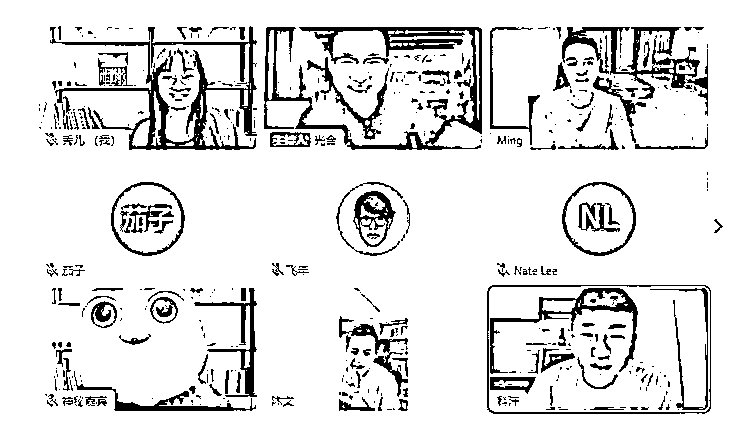

评论区：

 

 

北京品乐游国际旅行社 : 创业人不容易  加油

大力马 : 不错，学习了，认同。

Ming : “一个为横向扩展复制，一个为纵向做链条的上下游。”蒋超老板两个方向的分析恰好是我想要探讨的。

草木青 : 学习了

乔安 : 加油💪

Lucy-FinTe* : 特别赞同创始人要学的东西真的非常多，放假有空就一心学习，快速成长【创业故事】**6**篇
<!-- split -->
# (精华帖)(225赞)投资孵化20+项目，回首这些年的创业经历

作者：  鱼丸|亦仁助理

日期：2023-08-11

“创业的核心是积累，没有明确爆发的机会时，不妨调整心态，打造团队等风口来”连续创业者  ，从14年开始创业至今将近10年，目前主要是孵化各种流量项目、知识付费项目，以及投资流量变现项目，公司规模达300人。

而他这样的成绩并非偶然，是他这十年来不断的积累，厚积薄发。从第一次参加移动互联网大会积累用户、创建 QQ 群扩展人脉和挖掘项目，到做自己流量分发平台推广APP等等经历，都是值得很多创业者学习借鉴。

为此，访谈节目《生财逆袭者》的作者  ，特意约了  做一期访谈，和大家分享他这一路的创业经历以及心得：

 

 

02：10 离开部队创业，赶上移动互联网热潮

06：05 创建价值一个亿的QQ群，开始孵化项目业务

10：09 四年收入过亿却不融资，靠口碑帮别人推广APP业务

14：08做流量分发平台，让自己成为信息的核心节点

17：05 用裂变式创新理论去选择投资者

18：36 创业不仅要积累能力，还需要勇气

评论区：

Yichen : 这个视频栏目真的太好了，很有力量，感谢生财

xing : 有道理

Alex : 有道理

学长 : 优秀

张日 : 视频观看笔记：

1.波波老师是河北出生，军人家庭，本科和硕士都是军校，黑客里的国家队=红客  2.BBs上的交流，波波老师不是很闷的科研人员，会主动加人聊。（科研人员中的优秀品质）

3.社群中的有效链接（qq群为主），找到了合伙人，群中有后来发展很好的公司，自己也入了股，都是基于qq群中值得信任的关系。

4.13年拉群，14年开始创业，可见群对创业的重要性。

5.方法是“交流”出来的，很多都不是自己的原创，都是和别人学来的，可见交流的重要性。

6.刚从单位出来的时候没有任何的恐惧和焦虑，有很多信息佐证自己做的决策是对的。

（信息的重要性，一定不要把自己关起来）

7.第一年20万，第二年30万，第三年就过亿了。（口碑的积累，慢就是快）  8.波波老师很重要的一句话：这些信息我们不是通过看去学习的，而是通过组建圈子，让信息经过自己，自己成为信息的核心节点。（被动的接收信息，降低信息成本,组建圈子的副产品）

9.我是一个资深的创业这，我知道创业者应该具备什么样的品质和能力，遇到这样的人才时，如果可以合作，就可以降低他失败的概率，加速他的成长

10.我在上班的时候就花大量的时间去泡论坛，对创业这件事有浓厚的兴趣，钱是这个过程中的副产品

11.创业不是一个救急的事情。创业是让强者能力释放出来的过程。

12.好的创业者的品质：见过大钱，从而不被小的成功所迷糊，能熬出来的人，都是逆商 

 

很高的，面对失败这件事已经稀松平常了。

珑珑laraine : 谢谢笔记

张日 : [抱拳]

鱼丸|亦仁助理 : 哇  看到这么详细的笔记好惊喜呀
<!-- split -->
# (精华帖)(178赞)三年团队从 0 到 160 人的总
作者：  七对

日期：2021-06-02

以下内容是5.29号在南京见面会的分享内容，把详细的速记稿稍微整理了下，需要的同学可以刷刷文字哈。

我叫七对，七对是我以前在阿里的花名。我们是心竺教育，做在线的成人教育领域，我们三年团队经历了从0到现在160，可能到年底会到200，很多都是我自己的一些切身的感受，跟大家做一个比较真诚的复盘。

个人经历

我是03年到09年在南京大学读的本科与硕士，09年校招去了阿里巴巴，一直待到18年，刚好9周年，我主要是做产品经理出身的，一进阿里就定岗在产品经理。但是我接触在线教育是在2013年，在淘宝大学，主要是教淘宝商家怎么经营店铺，后来在湖畔（原湖畔大学）一直待到18年7月份开始创业，我们现在主营的是公务员考试的线上培训，早期拿过融资，但是现在全部是靠自有资金在发展，后面也没有融过资。

 

 

选定方向，搭建团队

遇到的困难

当时为什么选择出来做公务员考试线上培训领域？因为我13年开始接触在线教育，所以我对在线教育行业了解也是比较多，但是就像互联网人创业一样，其实要选择一个具体的教育类的方向。

当时很巧的是认识一个也是我们的校友，也是一个师弟，他是在江苏本地的一家传统的公务员考试机构做了很多年，他们的口碑很好，但是他们做的是线下，一直做不大，而且他们机构也是我们的大学的老师创办的。

怎么解决

我当时就定了这个方向，但是跟他也是刚认识前前后后应该找他们进来花了有一年的时间，因为我确定要做这件事情，但是我没有实施团队，像很多人创业的时候，我需要去敲定优质的教育资源，怎么办？我就不断的去找他，我跟他讲梦想，我说像你们有这么好的教育口碑，用心做事，但是在这个时代你会发现这么多年没有增长，很可惜。所以我觉得更多的是通过梦想，未来可以服务更多的学生激发了他，所以最后他带着整个的教研队伍全部加入了，开始了一个新的品牌去做，因为我自己是做互联网出身的，就是做产品的，之前有了技术负责人，而搞定师资端，就是我们做教育创业很重要的一个环节。

我的反思

我的反思是这样的，对于优秀的人，特别像我们一个人不可能是全能的，特别是像现在的复杂体的创业，遇到优秀的人一定要花时间去把他请过来，可能有些人是为钱，有些人除了钱，更多的可能还是梦想，所以我觉得这是一个需要不断的去说服的过程。

第二点我的反思就是一定要知道自己几斤几两，自己能做很关键，我们现在看到很多的机会，但是很多东西其实跟我们自己是没有关系的，你根本也没有能力去做。自己能做是很关键的，这就是我们当时的一个起步。

如何招到第一个班

 

 

遇到的困难

我们是如何招到第一个班的，很多创过业的同学都知道，从0~1是非常艰难的，我们当时遇到的困难，第一，我们是一种新的学习模式，市面上没有人这么去做，我们的网课都是卖到几千，很多人觉得网课可能就几百块钱几十块钱，我们是做到几千块钱的价位的。我们真正的解决出发点是学习过程中的解决监督、答疑、个性化的问题，但是在我们推出的时候并没有被市场验证。

第二点，我们虽然教研很强，但是是线下的，在互联网上并没有很大的一个信任，就相当于新品牌没有基础。

第三点，我们杀入的时候市场已经非常激烈了，所以我们的基因也就是在竞争中长大。

怎么解决

首先我们整个团队对于新的模式的价值特别坚持，我们相信提供的产品是可以解决用户的问题的，因为这是我们创业的根基，我们当时内部非常坚信，我们觉得我们解决了市面上，不管是地面还是线上都没有解决的用户的痛点，所以我们非常的坚信。

第二个是靠我们的专业、服务、体验，产生信任，产生第一批付费用户。那个过程就是所有人全部上，你不信任，我们可以聊，可以体验，使出浑身解数，把第一个班给招满。

我的反思

这里我的一个反思，因为我自己是做产品经理出身，而且可能中了以前互联网的毒，觉得我们只要开发一个App，有很多的装机、日活，就可以变现。其实现在的环境真的不是那样子，免费到付费，没有那么容易的。一个用户，他成为你的粉丝，成为你的私人好友，但是用户要给你付钱，这件事情是非常难的，没有那么容易。

第二，用户价值非常关键，特别是像我们做的很多东西，如果你真的没法创造真正满足用户的价值，很难。特别是第一批用户来的时候，第一批用户的口碑决定了你后面的生死，特别是像现在，如果你一个新产品出来，你口碑不好，网络上到处是负面口碑了，我们的试错成本非常高的。

 

 

第三，我特别要强调的的就是创业初期特别团队要一条心，虽然我们刚开始人也不多，但也有人怀疑，我们能够把课程卖的这么贵的价格可能自己都不相信。所以我这里讲的就是团队一定要一条心，非常重要，如果有人不相信，他可能还会传染给别人。整个创始团队就不坚定了，就没法往下做了。所以不管怎么样，所有人一条心非常重要，自己的团队一定要相信这件事情，这是我们招来的第一个班的阶段。

免费流量时期，赶上了红利

遇到的困难

当时我们招完了第一个班，第二个班后面就会遇到一些困难，我们的流量是缩小了，用户量不足。第二个就是用户的付费率特别低。第三个，我们没有专业的前端引流和转化团队，那是我们当时的一个现状，当时团队大概在二三十个人。

怎么解决

我虽然是做互联网技术，但其实我没有做过运营，也不懂得引流，所以很重要的，我自己不断的去学习交流，包括跟亦仁认识也是，通过以前我们南大在阿里的一个校友群聚会，然后经常去学习交流，他们那时候就跟我讲一定要引导微信，其他的都是扯淡。现在看确确实实就是所谓的私域流量。

第二个是不断的尝试，我们当时来做的时候根本没有运营的方法论的，反正每个平台都去做，哪个平台效果好就去做。最后很巧的就是在18年，19年我们碰到了抖音，大家都知道这是一波红利的，我们曾经有一次一条作品一天涨了10多万粉丝，那时候我们的视频质量跟现在是没法比的，但确确实实就吃到了这个平台的红利，所以我说我们的运气也特别好。

第三点就是不断的调整产品，特别是我们做了一些低价的产品，我们通过卖书打开了整个的局面。我们当时本来是想把那些书去高校做活动的，发现送都送不出去，后来我们调价变成了我19块9，当时抖音推出抖店，我们做小店比较早，所以我们大量的那时候开始出书，纯靠自然流量，靠免费流量，我们最高峰我觉得应该有能够走500套，所以那时候完完全全占了整个的红利。因为之前是免费，用户是提取不出来的，但是卖书它可以生成的订单，我们就把用户给提取出来了。

 

 

第四个，其实非常重要。如果不是这个阶段，我们对团队进行一个搭建，流程的梳理，可能后面我们的规模化增长的阶段可能就不会出现。我们搭建了专门的运营团队，转化团队和服务团队。

我的反思

首先，一定要有足够的粮草，那个时候在我们没有找到很好的突破之前，我们每个月都是亏钱的，但是我们还不慌，因为我们那时候还融了点钱，团队开销也没有那么大，所以我说的就是手中有钱，你的心不会那么慌，这是很关键的一点。

第二点就是必须不断的尝试，没有方法论就尝试。最重要的事情是要花费我自己最多的时间，要亲自抓业务，包括现在我跟很多的创业者说，你一定要花时间去抓业务，你就是公司最大的销售，整个公司你就应该去把业绩给做上去。所以我从那时候开始，我基本上不管产品了，我就是变成了一个运营，我要去搞流量，所以这就是我反思的第二点，特别重要。特别是很多非做业务出身的一些老板，这点很重要，你自己作为老板、创始人你都不把这个抓在手里，你还指望别人？

第三个就是找到突破点了，必须要全力投入。就像我们当时找到了抖音，找到了卖书，我们整个团队全部铺上去，看到这里有机会，有曙光，我们公司所有的资源全部给 all in。

第四点，就是团队搭建和管理非常重要，特别是当我们后来在19年的时候，不管是运营、销售、服务端口，必须要有专门的团队去做，如果还是靠我们以前每个人去兼职做一些东西，根本就没法支撑后面的一个增长。所以一定是要有专业的团队去做的。而且那时候有些人不习惯，手腕一定要强势，我们公司也是很强势的，因为生存才是第一位的。

付费流量稳定期

遇到的困难

 

 

我把它称为叫付费流量稳定期，大概这个阶段应该是在2019年末，可能大家如果做过流量的都很清楚，所以那时候的免费的竞争已经越来越激烈了。我们当时遇到了困难，免费流量的红利已经消失了，原来都会给推荐，后来推荐少了，而且我们公司又没有IP，以前都是靠作品带量，带货那时候已经完完全全带不动量了。

第二是疫情，2020年那段时间，我们整个人在家办公。

第三是很多行业巨头都会觉得公务员考试是一个大市场，特别是中公教育上市之后，很多的巨头进来，竞争是越来越激烈。

第四就是大家也能感觉到了，付费流量是越来越贵了。

怎么解决

我们是自建投放，优化流程，严格控制整个的营销成本。我们公司的投放是我们自己做的，我们不找代理做素材，找代理只是为了拿返点。公司的素材团队现在就有十几个人，纯做短视频的素材，加上其他的，我们整个运营团队大概配置就是在30个人左右。

而且所有的付费投放我亲自在抓，严格的控制营销成本，所以我们整个的付费成本在行业内是遥遥领先的，这是我们的核心竞争力之一，在营销上我们很强。

我们多产品布局，提升转化率，一开始我们可能就一个产品，后来我们会把产品线慢慢的丰富起来，提升转化率，提升用户的粘度，我们产品也在不断的一个迭代。

第三，我们组织进行优化，加大人才的培养，搭建中台，流程标准化，我们这个阶段花了大量的精力去做。我们公司没有空降的，我们全部是最早的核心骨干，一起出来创业的为班底，慢慢的全部招的是大学应届毕业生，或者工作过一两年的，全部自己培养的。为什么我们能做到？其实跟我们搭建中台有很大的关系，比如说像服务，我们可能一个星期就能够上岗，老师端可能时间比较久一些，但是我们很强大的知识库，包括师训体系，能很快的去上岗，因为我们更多会把很依赖于人的东西进行拆解，对人的依赖没有那么强，所以大家能快速上手，每个人可能负责某一些点，所以我们中台，流程标准化跟人才培养是非常重要的。特别是我们做教育，是一个很依赖于人的行业，我们的人均产能是比较低的，大家也可以知道，但在行业内还是比较高的，教育就是靠人堆出来的，所以这一点特别重要。

 

 

第四，流量端我们进行了多平台布局，向优秀的选手学习。当我们已经有了主流的流量之后，我们现在走的是全渠道，原来可能我们是在一个平台上进行突破，但是我们现在往所有的平台去突破，能力不够的时候，资源少的时候是找一个点去突破，但是当你具备了一定的底子之后，我是有能力再去把以前没有做好的地方再去做回来。我们经常是以前没做，现在在做。

我的反思

这个阶段我的反思，第一，招聘，团队建设特别重要，特别是大规模招人的时候，价值观的认同特别很重要，说白了是不是一类人。公司团队里面，如果你招的人，本质上就不认可你的这些东西，尤其是像我们疫情期间都是线上面试，招聘错误带来的一些成本，招错一个人带来的成本真的是非常大的，倒不是说他自己干活的问题，而是会影响整个团队，有些恶劣的，比如他说我原来我工资拿多少钱，在你这里现在拿多少钱，真的很难以想象，我们其实是非常单纯的。有些从其他地方过来的，他会给你弄事情，有些人待个几天就走了，我一直想招聘特别要谨慎，所以现在我对招聘特别谨慎，这是踩过坑的，很痛。

第二点是干部的培养模式，特别是我们一线管理者。我们一线管理的都是自己培养。大学本科毕业，经过一两年成为我们的基层管理者，包括整个员工梯队的重要性，自己培养的员工虽然累，但是他从这样一个环境里面生长出来的，他的认可度会非常高。

第三点就是对于核心竞争力的坚持，真正的用户价值会发挥威力。同样的在市场都好的时候，大家其实比拼的是营销能力强。反正我做的差，别人做的好，我也能抢占到一部分市场。但是你会发现当行业已经白热化竞争，很多玩家进来的时候，这时候如果没有真正的创造用户价值，你的口碑，你的服务，你的专业，你的效率做的不好，是没法立足的。特别是在竞争十分激烈的时候，对于核心竞争力的坚持非常重要。

第四点，就是控制风险，不要盲目冒进，尤其对于现金流的控制要特别重要。就像我们行业很多，特别是咱们做过抖音广告的，单个获客成本我们最早可能十几块钱就能拿到，但竞争已经越来越激烈，我们的成本也翻了很多，虽然到现在能够做到可能还是比较领先的。同行基本上都是三位数，而且我看了这十几家在投，那时候我们的策略就是你去打你的好了，你是什么都没有，我还是有积累的。我往别的平台去走，我先躲一躲。如果这是我们盲目跟进的时候，风险是比较大的，特别是像我们创业公司，现金流一断就完蛋了。

 

 

所以这个阶段我一定是追求的稳健，我认为最后确确实实我们也可以看到，你做着做着，只要活着，很多人就退场了，特别是很多巨头，他们主业不是干这个的，觉得这个市场好，在另外一个市场吃了甜头，就想用同样的一个打法来。所以我一直说其实我不担心 k12的他们跨界过来了，因为在某一个战场上，他们的深度运营跟我们比是差太多，所以我们无非就是说不要在他们进来的时候乱了自己的阵脚，控制好自己的发展节奏，控制好现金流。

第五点，就是我们公司是非常讲究价值观的一家公司，我们公司最有特点的叫拥抱变化，跟我以前在阿里是一样的，第二个是客户第一，这些东西是一个长线的过程，我们公司天天讲，每周都要讲，确确实实我们公司整个的文化氛围就会发现对于变化越来越接受，整天讲在口里的都是一些我们的用户怎么样。

我的一些底层思考

对未来的判断

我一般都会去可能会看3，5年后我们这个行业的格局是什么样子，以终为始来倒推，我觉得就像现在的格局已经成型了，比如像App，公众号，微博，那未来用户在哪里？

第二个是未来的主流科技的影响，如何重构场景，特别是IOT，包括5g带来的一些科技，它会对整个的一些行业会产生什么影响，大家最后就打开脑洞去想。

最后就是去看行业的本质，我自己做的行业怎么样，我们做的教育行业，本质上一定看口碑、看效率，不可能就是一家独大的，最终活得久的，活的长的一定是口碑好，效率又高的企业。所以这时候再倒推现在的决策就没啥问题，就是有所为有所不为。

组织力是根本

我一直讲的组织力是根本，其实说白了就是人。价值观、组织、人才、KPI是保障我们走的更长久的根本，我们公司是非常的在乎价值观的，我们的业绩考核当中50%是业绩，50%是考核价值观，比如我们客户第一是怎么去落实的？我们不仅仅是考核，还有很多的机制，比如我们的三天无理由退款服务，还有我们团队内部都会有问题推动之星的奖励，每周固定发一些好的口碑案例，都是把这些流程化、机制化出来。我们确确实实通过一些机制才去落实我们自己价值观。

 

 

第二个就是我们的晋升机制，我们公司内部的员工，每个人的工作不管走管理还是专业路线够可以。我们每年都会有绩效考核，也有晋升，其实每个人都可以看到空间。

第三点就是我们的绩效机制，我们不仅仅关注业绩，还非常关注个人成长。个人成长我们都会纳入我们每个人绩效考核中，我们公司在人的上面是花很大量的精力，包括我现在很多的精力是花在团队管理上，因为我觉得人的因素一定是长久的，一定要在人身上花时间的。

这是我两个底层的逻辑，一个是对未来的思考，还有一个就是组织力。

写在最后

我一直比较喜欢的几句话，“结硬寨，打呆仗”，“高筑墙，广积粮”，“善弈者，通篇天无妙手”，我不喜欢惊喜，当然更不喜欢惊吓，而是喜欢每一步都稳扎稳打。因为我是第一次创业，今年是第三年，所以我会选取的是比较保守的策略。

我更多考虑的就是活的久，我一直说的是对未来要看的透，我经常思考我们行业或者是这个世界三五年后怎么样？我也不想太远，就三五年后是怎么样的。

第二个对用户价值看得非常重，因为我们本质上是在创造用户价值。

第三个对于员工投入的时间要多，不管是物质上，还是他的个人成长上，精神上，我们都会花很大的精力去做。

最后就是遵守规则，这也我创业可能容易吃亏的地方，但是我相信要活得久，还是一定要遵循规则，特别是希望长久的做一件事。我们行业经常会遇到很多人招生是编造通过率的，但是我们不允许，举个例子像我们在招生过程当中，我们永远不允许去讲通过率，虽然我们通过率做的事情比平均值高很多，但是其他人编的数据就是实际上根本就是不可能。但是我们不可能去编，我们哪怕吃亏，也会坚持，这是对于规则，对我们文化的坚持。

我觉得剩下的就是一步一个脚印，剩下的交给时间了。

 

 

三年创业一个阶段，我现在更多的思考除了这一部分业务外，更多的在想，我们公司下一个增长点在哪里，我们是做的成人教育，团队也比较稳定，业务也比较稳定，虽然我更多的时间也在思考新的增长点在哪里，但还没完全找到。希望大家能多多指点，一起相互学习，共同进步。

评论区：

小毛驴 : 纯正阿里味

七对 : 毕业后就一直在阿里，也是唯一的一份工作，所以创业还是很受这影响的～[呲牙] 换药不换汤啊 : 稳扎稳打[拳头]

大俊 : 七对老师可以留个联系方式嘛

七对 : 私信您哈

Mr.Liao : 经历蛮像的，我是最近结束毕业后长达8年的工作，也是做成人教育方面的创业，IT就业培训方向，向你学习！

七对 : 谈不上～一起交流学习～

亦仁 : 感谢分享，已加精华。
<!-- split -->
# (精华帖)(161赞)一个咨询公司对于职场、做人、业务等多方面的 13 条原则

作者：  小马宋

日期：2022-01-25

一个咨询公司的原则

1月21日至22日，小马宋公司年会在北京古北水镇举行，公司今年年会的主题是“慢慢变大”。

《原则》是我个人很喜欢的一本书。我今年也在考虑，为公司和自己的个人生活各自制定一些原则，并且慢慢丰富起来。

 

 

所以我在今年年会演讲中，提到了我写下的一些公司的价值观和原则，当然有过去早就有的，也有今年刚刚提出来的，今天也分享给各位朋友。

原则：不骗人，不造假，不比稿，不行贿

这是我们从做咨询服务以来就坚决执行的一个原则，也是我从华杉老师那里学会的。

我经常跟同事讲，骗人的成本很高，你要用更多的谎言去掩盖过去的谎言。我个人职业生涯经历了许多公司在阅读量等数据上造假，这让我对我们这个行业的作风深恶痛绝，所以我们公司绝对不去做这种事。

行业中太多公司把最优秀的人才、最强的团队用来比稿，却用更弱的团队去服务已经比下来的客户，这是本末倒置。

不比稿，就能把更多的精力、更好的人才放到现有客户这里，一切为已经签约付钱的客户服务，这才是正常的逻辑。

有些朋友可能怀疑说，你没业务，我看你比不比稿。其实我们从一开始就不比稿，我们在最困难的2020年初，全公司只有一个客户，我们也拒绝了所有的比稿邀请。

早期没有业务，我们可以少收一些钱，但我们不接受比稿。

原则：客户价值高于公司利益

营销的本质，是为顾客提供价值，并且获得回报的过程。

我们为客户提供的价值，就是有效的咨询方案。我们公司能赚到钱，那是因为我们为客户创造了价值。如果我们总是想着怎么才能从客户那里赚到钱，怎么才能让客户多付钱，而不是怎么才能为客户提供价值，那我们就走向了完全错误的方向。

那时候客户会流失，口碑会败坏，生意会越来越差，你越想赚钱，就越赚不到钱。

为客户提供价值，就是我们工作的唯一目的，别的我们不要考虑。

原则：承认自己会犯错

人不是完美的动物，每个人都会犯错。作为老板，我也会犯错。

如果我们不能承认自己会犯错，如果我们在同事面前、在客户面前不能承认自己错了，那我们就永远陷在自己的认知和能力圈中。

承认自己会犯错是需要巨大勇气的，但是这种反思会给员工和公司带来巨大的进步。

 

 

所以我们在公司的墙上印着一句话：老板的想法未必是好想法。

原则：不要讨好上司和老板

公司，以个人能力和成绩论业绩，而不是看上司和老板的脸色行事。

如果哪一天，这个公司形成了讨好上司和老板的风气，那小马宋这家公司离倒闭也就不远了。

这样的公司，也不值得你留恋。

原则：你的收入来自客户，不是来自老板

我们要时刻明白一个道理，所有员工的收入，是来自客户的，而不是来自老板。如果我们丢了客户，我们服务不好客户，我们就没有收入。

所以你讨好老板没用，你为客户提供价值才有用。

原则：每天有效工作4小时

这听起来有点反常识，因为我们公司每天的上班时间是8小时。

但是，我们是知识工作者，我们没法像制造业那样给大家按计件工资去计算工作时间。

我们中午还有两小时吃饭和午休，加上微信抖音等各种消磨时间的东西，一个人一天有效工作4小时，其实是很高的效率了。

原则：高效率比多加班更重要

这一条可以跟上一条一起说。

我不反对加班，但我反对没必要的表演式加班。不要因为你的上司在加班你就不敢走了，只要工作效率高，没必要加班。我们公司有哺乳期的妈妈，我们也允许她们早上班早下班。

我经历过许多国际广告公司，还有许多互联网大厂，看起来他们加班特别多，其实没有什么效率。

每天加班到12点，结果就是第二天11点之后大家才来公司上班，到了公司又没心思工作，晃一晃就到中午吃饭了，结果就是下午2点才开始工作，接着晚上又开始加班。

然后是恶性循环，永远不早起，永远要加班。

 

 

况且很多人加班是为了免费晚餐、加班补助和打车报销，以及表演给上司看。

最后形成一种恶劣的加班文化。

原则：身心健康、家庭幸福

刚才强调的各种高效率、不加班等等，都是希望同事们身心健康、家庭幸福。

我们努力工作，最后还是要享受生活，家庭和睦。如果身体累垮了，家庭矛盾激烈，你天天加班的意义在哪里？

所以要弄明白究竟孰轻孰重。

原则：不要为了更多的收入压榨员工

员工是公司的财富。

不要为了短期的利益，去接许多根本没法交付的项目。

确实有许多客户找过来，但我们的服务能力有限，那就不要为了更高的收入让同事们玩命加班。

这样做会有两个恶果，一个是项目质量下降，一个是员工身体扛不住。

就像我们年会主题说的，慢慢长大，有质量地发展，而不是杀鸡取卵、寅吃卯粮。

原则：觉得有问题的时候及早停止工作

我们工作中常常会发生这种情况，有些项目已经确认了主题，确认了设计方向，但突然觉得有些不对劲。那你要不要停下来？很多同事就会犹豫，你看设计部已经设计了很多东西了。

这个时候，不要犹豫。如果你觉得有问题了，那就立刻停止工作，找你的上司或者老板再复盘，看看有没有问题，如果有问题，那就停止工作立刻返工。而不是等到快要提案了，发现全部做错了，总比那个时候要好。

原则：优先选择购买客户的产品

这是我们做咨询做乙方应该有的觉悟。

我们为客户服务，就应该为客户着想，时刻以客户利益为先。在同等条件下，我们鼓励同事们优先选用和购买客户的产品。

原则：光明磊落，干干净净

 

 

这个我不解释了。

原则：内部沟通，降低情商

这个我曾经写过一篇文章低情商沟通的好处  ，不赘述了。

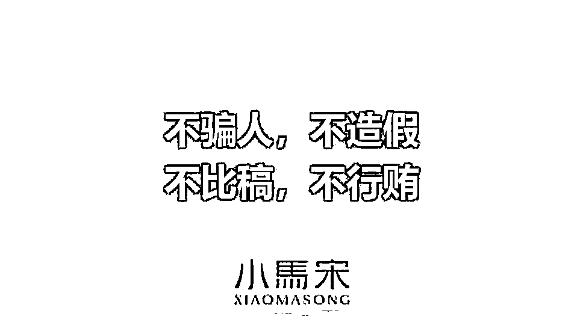 

 

 

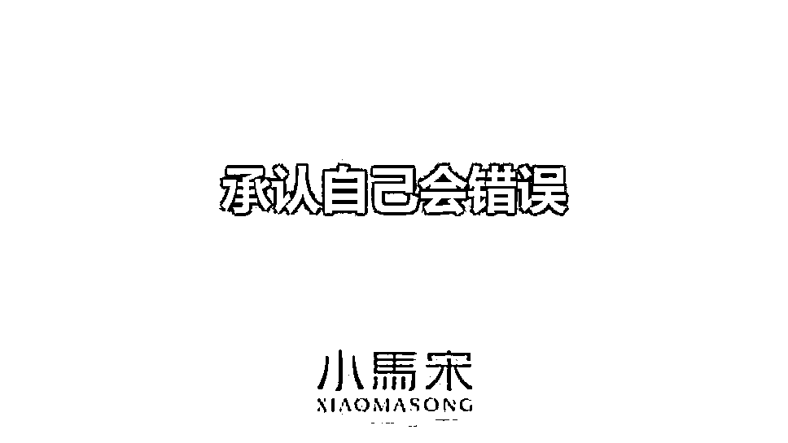 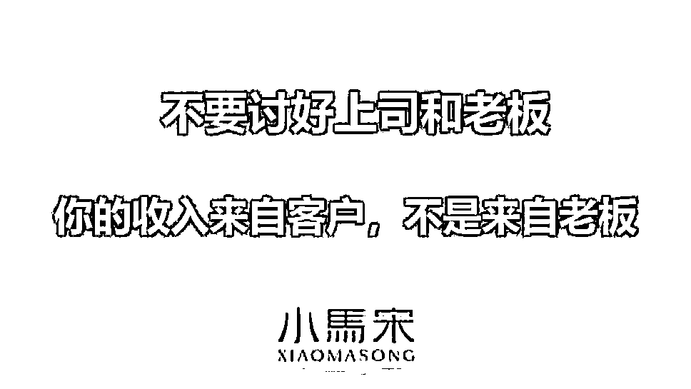

 

 

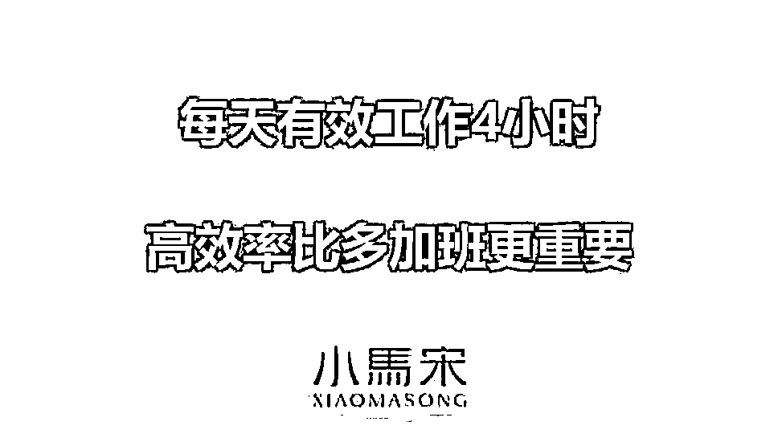 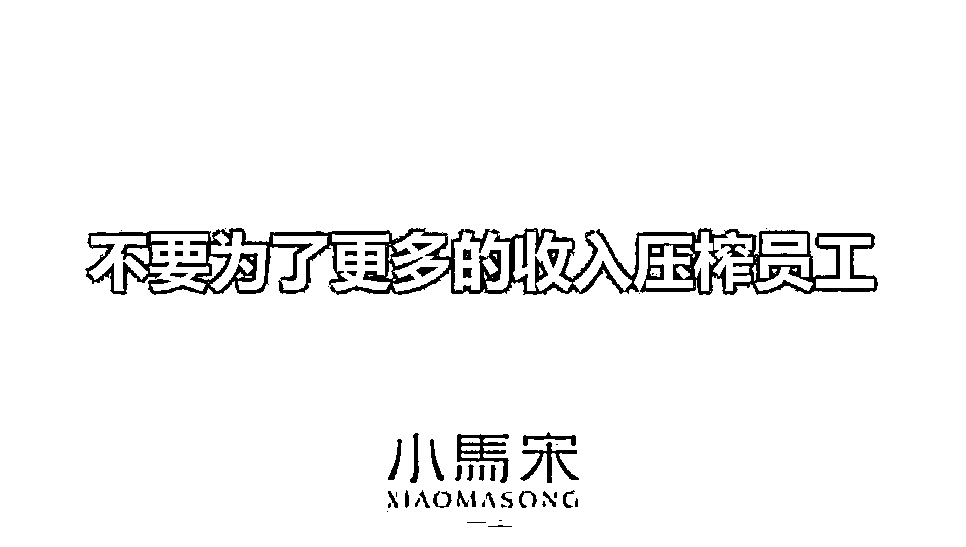

 

 

 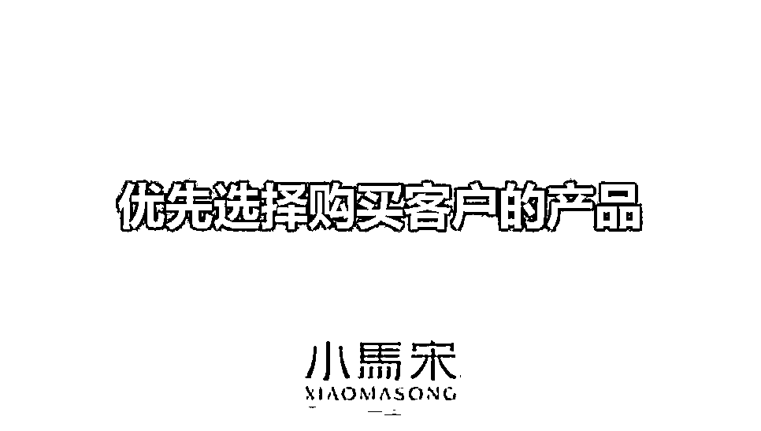

 

 

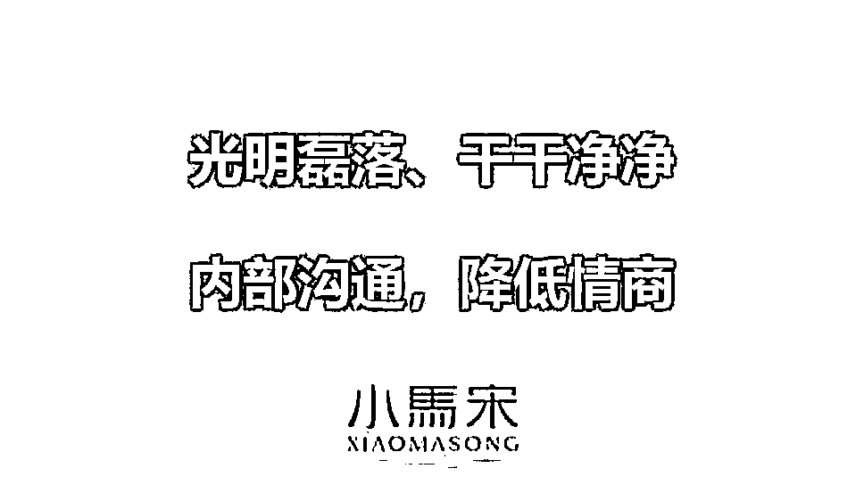

评论区：

当下， : 客户价值高于公司利益.

菜菜 : 低情商沟通的好处，这篇文章在哪里，想看

Yuefeng : 华与华？

小马宋 : https://mp.weixin.qq.com/s/TybrCD5PzwSiIMW_f5KMMg  棠雀 : 高效率，比多加班更有用[呲牙]

亦仁 : 感谢小马宋老师分享，已加精华。

阿思 : 如果我们总是想着怎么才能从客户那里赚到钱，怎么才能让客户多付钱，而不是怎么才能为客户提供价值，那我们就走向了完全错误的方向。[强]

谢谢小马宋老师分享，关于营销方面的，老师还有其他的书推荐的吗[呲牙] 新年快乐！

[玫瑰]

小红书服务商 : 小马宋公司未来一定是世界500强
<!-- split -->
# (精华帖)(144赞)小马宋：谈谈咨询公司的增长飞轮，以及我对咨询的 7 点思考

 

 

作者：  小马宋

日期：2021-03-01

谈谈咨询公司的增长飞轮

2月28日，除了我们自己，不会有人觉得这是个什么特殊的日子。

但对我们来说有意义，因为从2016年2月29日——2021年2月28日，公司五周年了，照例，我写一写这一年来的思考。

早些年的时候，公号自媒体还很热，许多自媒体拿了投资，也有许多人发了财。有一位做自媒体的朋友觉得我很亏，因为我赚到的钱远没有我的名气那么多。

从某种意义上来来说，他说的是对的，因为那时候的公号大V确实可以通过很多手段赚钱，而这些赚钱方式，我一个都没有做。

不是我不想赚，而是有几个原因：

第一个是我不擅长做这些事（比如搞收费社群）；

第二个是我觉得我提供的价值不够，比如搞新媒体培训；

第三个是我觉得有些事不长久，比如公号广告，属于高开低走，因为那时候我就觉得公号是在走下坡路了，我个人也没有能力把公号做得越来越好。

所以在2016年，我选择去做企业咨询（早期是想做广告，但是整体业务变动不大，详情不赘述了）。

我为什么会选择做咨询呢？也有几个原因。

第一、我在做自媒体阶段，已经陆续为几家企业做过咨询服务（早期是以顾问的方式开展的业务），有一定的业务基础，所以让公司起步并不是很难。

第二、咨询这个行业，如果从个人顾问算起，已经有千年历史了，而在我可预见的未来上百年内，它大概率会继续存在。如果我做公号或者抖音之类的，我不知道什么时候它会消失，但我比较确定它们肯定没有咨询这个行业命长。

既然这个行业命比较长，我们就可以慢慢做，试着为世界留下一个百年企业。

 

 

第三、这个行业不是强运营、强效率主导的，不需要像外卖行业一样追求把送餐时间精确到分钟，也不需要像制造业那样管理大量员工，不会像餐饮行业一样处理各种屎尿屁的杂事。不是说别的行业不好，是我不会、不擅长。

第四、这个行业有优点，必然就有缺点。缺点是没法快速做大，优质咨询师的供应链非常稀缺，等等。不过这都是我忍受的缺点，不能快速做大，我们就慢慢做好了；人才稀缺，我们就慢慢找，并且能把优秀人才留住，不就会慢慢做大嘛。

这跟我的性格有关系，所以说选择行业没有对错，只有合适不合适。

2020年，对咨询、广告、公关行业来说并不好过。不过对我们似乎没太多影响，甚至在真正营业时间只有7个月的情况下（北京封城到5月份），我们依然取得了50%以上的增长。

而且这个50%的业务增长，还有个前提，就是我们公司的个人顾问业务在2020年清零了（2019年我个人做顾问的业务占了公司业务的3成），去年我们全部都是企业的营销咨询业务。

是因为我们越来越有名了吗？其实并没有，我看微信的搜索指数，“小马宋”这个指数并没有什么大变化，我公号的阅读量似乎保持着稳定而略微下降的趋势，我也放弃了半年时间在抖音积攒的20多万粉丝，不再更新了。

从对外制造影响力来看，似乎我们并没有大的长进，但我们确实在过去一年逆势增长了（我们也没有倒卖什么口罩业务）。

今年公司年会的时候，我分享过对我们业务的思考：我们从业务量来看依然是个小公司，但我们比较确定的找到了咨询公司业务增长的飞轮。

关于增长飞轮，大家可能最熟悉的就是亚马逊的。

简单来说，就是亚马逊用更低的价格吸引了更多的客户，更多的客户带来更多的购买量，然后导致价格进一步降低，供应商更加丰富，客户体验进一步增强，然后客户数量和忠诚度进一步提高，形成一个旋转的飞轮，推动亚马逊持续增长。

我也画了一个营销咨询公司的增长飞轮。

这是一个看起来非常简单的道理：

 

 

只要我们提供真正有效的方案，客户就会成长，然后带来成功的案例，成功的案例会吸引更多的客户，更多的客户就会有更多的成功案例。同时，我们服务的客户更多，我们在咨询过程中积累的知识和经验以及形成的工具就更多，这就进一步加强了我们做出成功案例的能力。

成功的案例不仅会吸引更多优质品牌的客户，还会吸引更多优秀的人才，这也进一步提升了我们提供有效方案的能力。

然后，一个新一轮的增长飞轮就开始转动了。

是不是很简单？

但是做起来其实非常难，就像减肥的道理听起来也很简单一样：少吃，多动。但减肥成功的概率并不高。

当我们明白了这个道理，而且坚信这样做是正确的、可行的、是通向必然的，那我们就在整个公司的经营中，所有的经营业务都服务于这样的最终的理念就好了。

所以我们采用了和大部分咨询公司不同的做法，而这些做法，都是围绕这个信念而建立的。

第一，我们深信为客户提供真正有效的方案是第一位的，也就是客户的利益为先，所以我们能忍受前三年许多业务的诱惑，因为我们不能在人力不够、能力不够的情况下接这种业务，即使这能给我们带来很好的利润。

第二，要找到更优秀的人才，所以我们一直对招人非常谨慎。我们在招人上有个原则，哪怕我没有人做业务，我宁愿推掉这个客户，也不会因此而降低招人的标准，因为人是这个行业做出好方案的根本。

对于新招聘的员工，我们在三个月试用期内要尽量考察新员工的思考能力、主动性、合作能力等等，如果觉得不合适，我们会补偿一个月的薪水请他走人。

第三，有些新创业的、或者客户的新项目来找我们合作，我们会根据自己的经验判断这个项目的问题，如果成功概率很低，我们会诚实地告诉客户，这个最好不要做，浪费钱。过去一年，大概有四分之一找上门来的客户被我们劝退，甚至放弃了自己的项目。

我们主动不要送上门来的业务，一个核心的思考就是永远站在客户利益的角度考虑问题，这样即使不成交，客户有了新的业务，他还是回来找我们。

 

 

第四，人员配置上，我们公司除了咨询师就是设计师，没有客服人员、没有业务人员。

因为产出方案的是咨询师，不是客服和业务，我们不需要浪费精力在客勤关系和寻找业务上，我们的精力都放在服务客户身上。

许多公司把核心精力用在跑业务上面，我们则相反，我们把核心精力放在服务客户上面，而通过好的客户口碑自动带来更多业务，所以我们获取业务的模型是不同的。

这些省下来的人员的钱，我们把它用在雇佣更优秀的咨询师和设计师身上。

第五，我们从不参加比稿，即使在公司最弱势、最困难的时候都是。比稿的逻辑，是好几个公司去竞争一个业务，但这里有个问题，就是你需要花太多精力去准备提案，而调研和提案本身是我们咨询工作中最重、最耗费精力的工作。那我们为什么要把精力花在一个不确定的项目上面呢？所以我们不比稿，我们把所有精力花在现有的客户身上，而不是相反。

我们不仅不比稿，也从不行贿和给回扣。比稿是许多公司非常大的一个成本，行贿和回扣也是成本，我们靠工作付出获得回报，而不是靠商业贿赂获得业务，这与许多同行相比，我们又省下了不少成本。

第六、我们的业务要求必须是能拍板的高层（最好是大老板）对接确认。有些广告公司，一年到头特别忙，其实过了一年往回看，却没做什么事。很多时候就是因为来回修改返工的太多了，市场经理、总监、营销VP每人都提一次意见，反复修改，到了老板那里又要重做。

我们要求对方能拍板的高层必须第一次提案就参加，并主要由高层决策，这样的工作效率最高、最有效。

节省下来的精力，我们用在更好地服务客户身上。

第七、我们在员工培训上大量投入，并且外请了不少顾问来辅导我们的员工。因为员工的成长是公司成长的基础。而且我们关注新技术在营销行业的应用，我们相信将来大数据和人工智能以及各种各样新的技术会对营销产生巨大影响，我们也时刻关注并尝试应用这些技术到我们的咨询服务中去。

我们也不做假。我们知道，许多营销案例的传播数据，其实有很大水分的。甚至许多大公司的市场部与乙方合谋刷数据，因为大家要背KPI。

 

 

但是我跟我们同事反复讲过一件事，我们做了方案，即使销售额为零，即使阅读量为零，那就接受这个现实，我们再去找原因，重新做。而不是去找水军刷个数糊弄客户。

要对客户极度真诚，才能赢得客户的信任。

更多细节，我不展开讲了，其实核心的原则就是在“为客户提供有效解决方案”这件事上投入重兵，所有的事都是围绕这件事展开的，不要有多余的动作和浪费的精力在别的地方。

这似乎听起来也是很简单的事，其实做起来很难。

比如业务找上门了，你却没有人做，你只能放弃。这时候你会降低门槛，找一个不是很合格的员工吗？如果你这个口子一开，公司就会立刻进入负增强的状态，因为你做不好客户的方案，导致口碑下降，然后就越来越少人来找你了。

许多同行，据我观察，就是犯了这样的错误。在公司名声显赫的时候，找上门来的业务来者不拒，而不管自己能不能做好，结果就是好多年就吃一个经典案例的老本，再也做不出更好的案例了。

比如我们在2020年依然增长，是因为我们2020年做得好才这样吗？

其实不是，是因为过去三年我们做得不错，过去的客户案例获得了口碑，然后就有更多客户找来了。

我个人觉得，2020年我们确实也做了许多不错的案例，但这些案例都在实施过程中，还不能对外讲，有些客户也需要时间来获得成功。所以我们2020年做得好，是为了未来几年我们能有更多的业务。

我们今天的成功是过去做对了一些事带来的，未来的成功，则是今天做对了一些事而造就的。

 

 

这就是这一年来做咨询公司的一些思考，希望对你也有帮助。

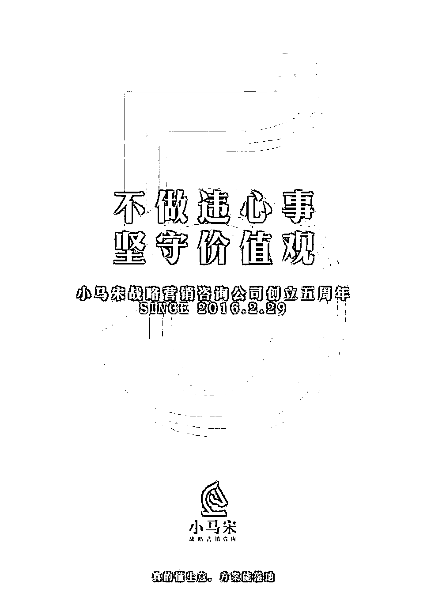

 

 

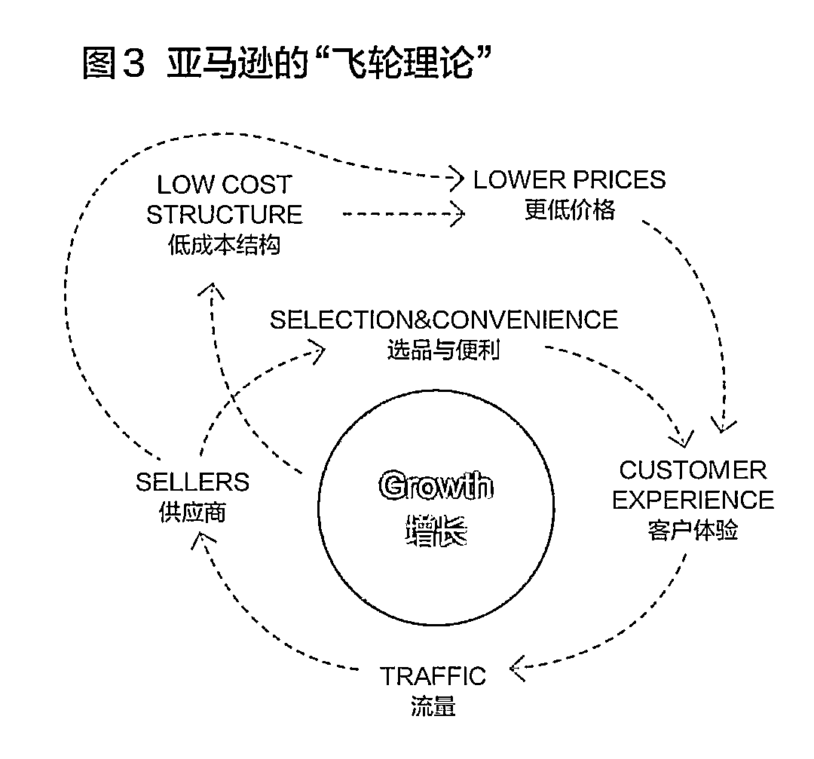

 

 

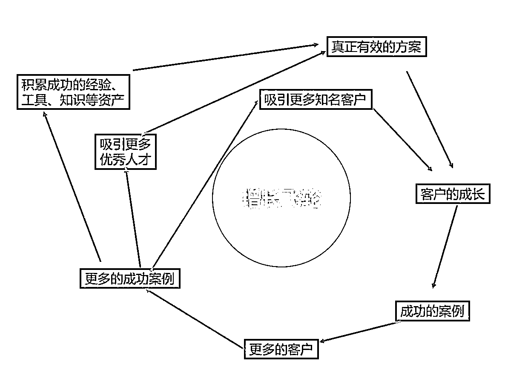

评论区：

张静伟@生财有术 : 不做自己不擅长的事情

张健教练 : 谢谢老师分享，我自己是生活的教练（life coach），接触教练第三年，把文中的咨询换为教练，对我有启发，

耀 : 一步一步踏踏实实的做[强]

王先生【快手电商】 : 收藏了  感谢

良辰美 : 公司做起来了，将来找小马哥咨询，希望三五年内就达到目标[拳头] 雷文 : 坚持一个方向不动摇，希望有一天可以向小马哥咨询

星允 : 目标有一天可以像小马哥咨询💪

大江 : 变往往是简单的，坚守初心坚守原则不容易
<!-- split -->
# (精华帖)(118赞)海学科技 CEO：分享创业和公司的经营管理、教育理念

 

 

作者：  亦仁

日期：2019-01-23

每周三，带你认识一位厉害的生财合伙人。

作为一家公司的创始人，每天要考虑的问题是如何赚钱？如何放大收入？如何优化团队？如何建立激励机制？如何整合更多资源。。。

具体体现为，一家公司的赚钱模式是什么，碰到瓶颈如何突破，有什么愿景，这家公司的价值观是什么，怎么建立的，团队之间如何配合，有哪些冲突，下一年的规划是什么，下一季度的规划是什么，如何奖罚分明。。。

但是市面上你所能看到的案例，绝大多数是超级巨头的分析，BAT的成名之路对我们固然有价值，但相比于发生在身边的同龄人案例，我相信后者更具有极大的启发性。

今天邀请的90后生财合伙人  就抽丝剥茧把他的创业经历、创业心得，特别是企业的价值观建立、愿景、人才培养、市场拓展这些微观操作展现给你看，同样作为一家企业的创始人，我看完后觉得受益匪浅！

相信你也会。

那么，废话少说，欢迎登台，请大家点赞欢迎！

大家好，我是吉米老师，公众号【英语口语】【英语】的创始人，农村长大，90后，临床医学毕业。海学科技 CEO, 公司在广州大夫山森林公园，专注在线英语教育，2015 年广东创新创业大赛青创组金奖，公司目前公号矩阵拥有 300万英语用户，涵盖成人英语+少儿英语领域，6000 个英语微信群，付费用户 35万，抖音矩阵用户 350 万，同时每年有 1 个亿的教育投放量，教育职场类公众号渠道 2 个亿用户资源，抖音英语教育类渠道 1.5 亿用户资源，未来有合适的朋友可以深入讨论和合作，我的微信是 OHK522 。

我在广东茂名信宜农村长大，小学就在农村上学，放牛，喂鸡，挑粪，犁田，全都干过，所以这篇文章我写的是【放牛娃的春天】，我是南方医科大学（原第一军医大学）临床医学五年毕业，中文名张海生，听到我中文名大部分人都以为我是张雨生，大海是我的成名曲~ 其实我中文名用得很少，整个圈内和网络上都是用吉米老师这个名字。我  2017 年应亦仁兄的邀请做了一次分享，今年的对于创业和公司的经营管理，教育理念上有了新的升级，恰好亦仁兄二度邀请，我就来做一个升级版的分享。

 

 

最初创业的种子从初三开始，那会看了比尔盖茨和他的微软帝国，就在思考，在政治领域，我们没有办法做到全球统一成为一个国家，但是在经济上，可以做成一个全球金融帝国，比如微软帝国，苹果帝国，华为，没有国家地域限制，都是经济上市场上全球统一覆盖。

种子有了以后，大学开始就经常浏览腾讯科技板块，关注观察最新的机会，因为我个人发现，互联网领域，每隔七年一定会有个大的变革和创新，全新的机会就会到来，看谁能抓住机会，顺势而为。

国内互联网的从早期的新浪，网易，搜狐门户称王，到腾讯，阿里，百度称霸，腾讯微信的统治地位，到最新的头条系，拼多多迅速崛起，互联网的世界从来不缺新的机会，关键在于机会来了能不能抓住。

抓住机会成为真正的巨头需要 4 点：1.资金，2.人才，3\. 管理经验和 4.技术。

我最开始没有资金，自己实现原始积累，人才，一步一步招募和吸引过来，管理经验，在公司发展过程当中不断地提炼和总结，核心技术和创新理念，是杀手锏。

我 2011 年发现微博可以赚钱，微博账号当时有四大体系，每个体系都能一个月挣取  500 万以上的收入，几乎都是利润，现在一个体系一年营收 5 个亿以上。大家都在刷微博的时候，已经有人通过微博开公司挣钱了。一个在深圳的朋友，和我同龄，通过微博就挣到了人生第一桶金，现在资产过 2 个亿。

我本来也要做微博，但是当时因为开了一家奶茶店，时间精力耗在上面，注册了很多微博账号，但是没有经营起来。奶茶店经营半年以后倒闭了，我继续寻找新的机会。

我大二开始在培训机构兼职教英语，李阳疯狂英语，山木培训，私人培训机构，都有带过学生，线下培训教了 5 年，当时一个月收入不到 2000，就是为了积累经验，我也不在乎收入，够我花就行。

微博我错过了，微信公众号起来，因为微博的教训，这次我没有错过。因为教英语的缘故，我从英语公众号起家，2012 年 7 月公众号内测，9 月开放注册，我 10 月份注册了一个英语公众号，也没特别管，结果一个月后发现居然增长了1000 多个粉丝，完全自然流量增长，都没有发过文章。

我有微博的经验，知道好名字和好域名的优势，所以注册了很多非常好记的公众号名字，比如【英语口语 ID: kouyu8】  【英语 ID: yingyu9】，好名字有个好处，自然搜索流量非常好，当然也要认证了之后。

 

 

好名字也有个坏处，没有独一无二的特性，最后区分度不高。因为运营到最后，自然流量占比已经很少，大部分是我们自己运营带来的增长流量，如果对外宣传，独一无二的名字会更好。

一开始公众号不挣钱，也不知道怎么挣钱，最早其实连怎么运营都是摸索的，加了很多微信公号运营的 QQ 群，大家都是小白，一起交流，摸索，使用各种工具，接口，探讨各种运营增长的方式方法。

不但不挣钱，其实还要倒贴钱，因为我的号特别多，当时买了很多身份证注册了接近100多个公众号，用验证码网站接收验证码，这么多号，运作起来，我一个人搞不定。

我最多一个人同时一天编辑 30 多个号，后来就请我的师弟师妹兼职，我当时还在大学，招募师弟师妹比较方便，每个月付工资，都是我教英语赚回来的钱发工资。

2013 年中开始，公众号有一点规模了，开始有一些小广告进来，当时的广告很多都是各种微商，兼职，说白了就是黑五类，骗人的多，引发了微信的整治，我们被封了一大批号。这批号都是大号，有当年很火的小黄鸡，糗事百科笑话精选，当时我有很多幽默类账号，大号被封了 50 万用户量，在当时已经非常大的号了。

因为违规广告，号被封了以后，我们从头再来，又做了一批号，这一次，我决定教育类的英语类账号，彻底不再接受任何广告。一定要培养起来，至于变现，未来再说，暂时能活下去就可以了。

2013 年，我发现有人通过公众号招募学生教英语，我就一直观察，这种在线教育的方式是否可行，观察了一年，发现没问题，方法和路径，平台都选好了以后，我在 2014 年  7 月开始在我的英语类公众号上从零开始招生教学，彻底从线下教育转到线上。2014 年7 月到年底，我大概收到的学费是 40万，第一桶金完成，帮家里盖了房子，买了第一辆车。

2014 年的公众号运营主要是发文章，认证公众号，自然搜索流量+公众号传播，2015 年开始做资源分享增长，赠送英语资源，书籍，电影，等等引流关注。2015 年增长用户  25万，在线教学主要是我一个人完成，团队还是兼职师弟师妹，加上我姐姐全职帮忙。

2015 年还参加了广东省创新创业大赛，我的在线教育项目获得了广东省青年创意组金奖，奖金 4 万。

 

 

2016 年  是一个特别的年份，2016 年 10月底，我看到十点读书从 3月份的 300 万用户增长到 10月份的 1000万用户，平均每天 3 万用户增长，大开眼界，非常震撼。我发现原来可以通过运营的方式做到用户巨量增长，以前看到一条通过广告的方式一个月做到100万用户，没有特别的感觉，因为我们没有这个钱去投放广告。

但是发现原来几乎不花钱，运营也可以做到，我就开始想办法了。

因为我觉得，我也可以做到。

我想了 5 个方法，初步预想，能做到每天增长 5000 用户，200 天实现100万用户增长。但是我一个人搞不定，必须组建团队，于是我马上开始。

2016年 11月初，10天之内，两个合伙人迅速到位，3位新招募的编辑，全部到岗。于是开干！

我们半个月就做到了日增 5000 ，最高的时候一天增长 1.5万，形势大好。

2017 年，我们社群增长火爆，运营 2 个月后正式推出英语课程，招生第一次就  实现  2000 多人报名，非常火爆。

2017 年营收实现了 600 万，2017 年双十一我们实现了 111 万的营收，算是一个小的里程碑。当年 11月举办了我们的  第一年海学年会，办的风风火火。

2017 年 9 月开始我们空降了大量人才，但是后来发现很多不适合，后来大部分都去掉了。技术部是在这个时候开始组建，但是 2017 到 2018 年，我们用了 10个月时间试错，发现自己的技术部没有办法真正快速高效做出产品，但是每个月开支依然要十几万，于是果断去掉，把需要的技术全部通过专门提供技术服务的平台和企业实现，千聊，跟谁学，微师，鲸打卡，微店，小鹅通，外教易，Zoom, 我们都在用。

空降人才是试错，有代价，但是教训值得花钱买，因为我们市场部经理也是这时候引进的，给公司来巨大的效益，完全抵过了损失。

技术的试错，让我们走向轻资产运作方向，利用各种资源，平台整合，然后为我所用，成本做到最低。因为一个平台一年的使用费，才几千，有些甚至免费，比如千聊，微店，微师，免费使用。

未来合理利用各种轻资产资源，甚至免费资源，平台进行合作运营，是我们看好的一个大方向，也是 2019 年的公司运营方向之一。

 

 

2018 年初开始，公众号流量下降，增长人数开始下坡路，我们经历了 5 个月的低谷期，这段期间，我们看天吃饭，招生，管理，都没有什么方向和策略。因为没有任何管理经验，前期因为公司增长迅速，盖过了一切的缺点，但是当增长降下来，公司一切都要回归运营，各种管理问题，人员问题，制度问题，以及增长乏力以后的人心问题，都要解决。

这也是我为什么特别说明抓住机会要4点：1.资金，2.人才，3\. 管理经验和 4.技术。

其中管理经验特别重要，没有管理经验，再多的资金，人才，技术都是没有用的，公司运营管理失败，一定会失败。

这段期间我一直在考虑破产问题，如果大家全部辞职，我再赔上一个月每个人工资，那公司账目的钱恰好也够。

后来想清楚了，公司即使没了，我也还有公众号，继续运营，每个月接广告，自己带个班，20万收入还是有的，所以不担心。

接下来就开始突破了。

2018 年 5 月开始，公司全面升级管理，每个月，每周骨干开会策划，执行，复盘，公司每周开会，确定落实公司的战略，文化，策略和方向，然后全面执行。

公司里文化和战略非常重要，意识形态一定要统一和做到位，这一点上，我非常佩服中国共产党，全国 8000 多万党员，小到各个乡村，全部统一意识形态，非常值得研究学习。

5 月开始，公司全面士气涨起来，公司的运营和增长粉丝因为我们的策略调整，重新涨起来，用户+营收全面增长。

这个看起来只有几句话，但是真的做起来，非常不容易，当然，和创始人的实力，认知，格局关系非常大，也有运气的成分在。一家公司，能从低谷走出来，重新全面增长的，我知道现在的小米，微软，苹果，这三家，我们也算小小的一家，其他的几乎没有听过，大部分是低谷之后就完蛋了。

接下来我分享一下我们海学科技公司的战略和文化：

海学科技愿景：成为全球在线教育培训行业No.1。

海学科技的使命：帮助1000万用户掌握英语，影响1亿全球华人英语学习态度海学科技的价值观：

 

 

**1. ** 用户学习效果大于一切。

**2. ** 规划布局，不打无准备之仗。

**3. ** 严肃认真地工作，轻松活泼地生活。

**4. ** 用心服务每个用户，不管付出多大代价，都要做到极致。

海学人三大原则：

1.做人，为人处世，尊敬师长，孝顺父母，团结伙伴，乐于奉献 2.做事，认真，踏实，专业，高效，要么不做，要做必须做好！3.Think different，善于思考，学会思考！一件事情要透过现象看本质，要博览群书，开放格局，要三人行必有我师，向伙伴朋友学习长处，不好的引以为鉴。

海学科技的战略:

**1. ** 改革创新，不断推出伟大的产品。

**2. ** 公众号为先

**3. ** 学习为先！

海学人提示:

海学伙伴在办公室永远小步快跑，每个人佩戴手表，每个桌面都配闹钟，手表，闹钟，手机永远比北京时间快15分钟。

2018 年全年我们实现了 1000 万的营收，对比 2016 年实现了 66.7% 的增长，我们一直没有融资，都是我自己的资金，公司一开始就现金流为正，一直盈利，一直都在健康地运营。

2019 年，我们有很多新的方向和策略，也有很多大动作，和打仗一样，在不断地攻城略地，不断改革创新，推出全新的产品，深耕成人在线英语市场，全面开拓少儿在线英语教育市场。

2019 年的目标是年底实现一个月 1000 万的营收，目前来看，应该有可能实现，目前在做一个少儿教育市场开拓线上线下结合，人工智能 CR 结合场景化教学的双师项目，如果这个能成，加上我们这个项目有非常资深私募基金支持，可能年底能突破一个月 3000 万的营收，3 年内实现教育公司前十，在线教育前三的规模。当然，这个现在属于吹牛画大饼阶段，哈哈，实现了牛逼再和大家聊。

关于公司管理和公司运营，我有几个心得觉得特别重要，和大家分享：

 

 

人才培养，我们公司实行人才培养计划，公司成立人才培养基金，人才的未来，就是公司的未来，我们帮助和支持大家成才，提升能力和格局，知识，如果中国向全世界发放  5000 万张绿卡给全球的精英，科学家，开放思想和环境，大量引进人才，中国 10 年之内核心技术可以赶超美国，美国也是二战后  给全世界科学家大量发放绿卡，才有今天的世界大哥地位。国家我管不了，但是我的公司我可以管，我一个是培养自己的人才，第二个是大量引进人才，发放海学绿卡，为未来的崛起创造基础。

改革创新，有自己的核心杀手锏，每一个产品和公司都有自己的生命周期，如果你不在周期内改革创新，推出全新的产品，很快就是没落，销声匿迹。如果一家小公司想在众多大公司中脱颖而出，成为新的巨头，必须要有自己的杀手锏，新的核心技术，对比起老牌公司，你的技术是洋枪洋炮，他们的技术是长矛大刀，这样你就可以突破重围，成为巨头，微信，今日头条，抖音，拼多多就是这么迅速成长起来的，过去的谷歌对比雅虎，脸书对比谷歌，也是这样在巨头夹缝中迅速起来的。

**3. ** 运营，深入运营  ，公司要有非常清晰的战略方向，要向员工非常明确地传达，同时教授切实可行的方法论（方法论特别重要，不能只是喊目标），不断地落实执行，落实和推进，复盘，项目一旦发现有问题，马上集中火力研究，团队出谋策划，统一解决，重新上线，直到成功或者彻底失败放弃。

**4. ** 开拓新市场，企业如果只是想平稳增长，只需要深耕。但是如果要翻倍，甚至十倍，百倍地增长，必须要开拓全新的市场，开辟全新的方法，开出一个新市场，就可能是原来的十倍。比如改革开放，比如海外贸易，沈万三当初之所以成为元末中国首富，富可敌国，就是因为开展海外贸易，全新的市场，十倍百倍的利润。

**5. ** 在线教育要成长为真正的巨头，一定要有健康而且创新的运营模式。VIPkid 2018 营收 50亿（有水分），亏损 13亿，哒哒ABC 2018 年营收 15亿，亏损 4.5亿，还有沪江，51 talk ，英语流利说，全部都是亏损，在花钱买市场。但是现在增长天花板很快就到了，2019 年全球环境也不好，无论是营收还是规模，增长，全面都会下跌，这种烧钱模式，从 2014 年开始在线教育里实践，4年多了，我发现不是一种健康的模式，最后很可能并没办法做到盈利，最终走向摩拜，ofo 的方向，要么合并，要么被收购，要么灭亡。

什么是健康的模式呢？好未来，新东方成长为巨头的过程当中，他们没有亏损，开新店都是前面的盈利来开得，新店 6 个月内业也能盈利，非常健康。

 

 

在线教育如果能把价格做到亲民价格，质量服务一点不差，模式全面创新，就可以和拼多多一样，把二三四五线城市的市场全部收入囊中，而且这样的价格和服务还不亏损，至少打平或者仅仅微亏，亚马逊的模式增长，那就能成为在线教育的亚马逊，市值不会低于 1000 亿美金。

目前我们正在摸索和实践的就是这样的健康在线教育模式。

**6. ** 领导一定要支持，帮助下属的工作，下属一定要知道，同时明确能从上司这里获得支持，公司不是冷冰冰的上下级，而是团结一心，互相帮助和支持。

**7. ** 员工的福利和奖励，名誉一定要有，现金奖励，和礼物奖励交叉并行，加班适量就好，不硬性加班，但要把项目做好为止，做好了，成果出来，放开奖励。要马儿跑，一定要够粮草。

**8. ** 如果实现以上 7 点，资金部分，可以说一点都不重要。因为第一自己资金流源源不断，第二无论是风险投资还是私募资金，资本市场都会争相追着你跑。关于要谁的钱，我给的建议是：私募基金，资本市场比风险投资要更好，风险投资要退出的，要对赌的，有业绩压力。私募基金和资本市场的投资就是相当于基石投资，他们不差那个钱，就是为了和你一起把事情干成，几年之内都不退出。

最后说 3 点题外话，

**1. ** 年轻人不要炒股和买股票，除非你是基金经理人，你职业炒股的。一个例子：两个年轻人： A 和 B 现在年薪都是 30 万，A 是投资天才，工作的同时每年拿出 30% 投资股票，也就是 9万，连续 5 年，他平均每年收益是 15% （很牛逼了），5 年一共收益大约是 21万  ，但是要花大量的精力和注意力在上面，B 不买任何股票，只买房子和老婆住+非常用心地工作做好事业，因为业绩非常出色，年终奖原本是 2 万，第一年加 10% 多发 2000，第二年—第四年加 20% ，多发了 1.8万年终奖，同时，因为工作出色，第三年涨了30%工资（甚至翻倍），第三年—第五年多收了 27 万  ，还有买房收益几十万，一共收益  超过 50万！比投资天才厉害多了~

而且大部分人不是天才，几乎99%的人是每年花大量精力买股票然后陪大量的钱。

做任何事情，必须要专业，没有随便就能挣钱的，工作，事业，股票，都一样。所以死了这条心一夜暴富的心，

 

 

第二点：就是我的个人习惯，大量读书，我公司有读书会，我买的书放了 3 个书架，每个月阅读超过 30 本书，每年买大量实体书，电子书，我的阅读速度很快，各种书交叉阅读和消化，不担心读不完。读书对于开放格局非常有帮助，很多前人，历史的经验都在里面。

第三点：圈子虽然重要，但是你个人能力+格局的提升必须同步匹配和提升，否则混圈子对你没有任何帮助和作用。

我的圈子包括：1\. 书籍知识的圈子，2\. 各种我认识的大 V 的微博微信圈子，3\. 我的企业家朋友们的圈子。

读万卷书，行万里路，广交天下豪杰。

有勇有谋，则万事可成。潜心修炼，厚积薄发，活着改变世界。

最后愿大家能抓住你能抓住的一切机会，提升能力，扩大格局，增长知识，不断创新，加上一点运气，你就能成就伟业！

谢谢大家！我的个人微信号是 OHK522 ，昵称吉米老师，欢迎加我合作。

评论区：

阿may : 佩服佩服，低谷以后还能再起来的，很不简单。

如果不熟悉技术，创建技术团队有的时候真的会踩很多坑，我所知道的一个朋友，自己花了几十万找了一个程序员来开发系统，结果要升级时因为和程序这边谈不拢，技术放弃开发，还不给源代码，整个系统全面崩溃，导致所有学员都申请退款，导致破产。也许刚开始就用第三方平台，会更好呢。

崔冬 : 个个都是人才

黄江舟 : 市场负责人为啥给你们创造了很大价值？

英语校长吉米老师 : 做好市场就有大量价值[憨笑]

三林 : 佩服佩服，学习了，想必你是雷厉风行的人

英语校长吉米老师 : 猜对了

英语校长吉米老师 : 技术早期变通的方式的确更合适

黄江舟 : 哦哦，我是想问市场负责人具体做了什么事情帮你带来巨大价值。因为我们最近也在招市场负责人，但是找个靠谱的不容易。另外感觉没必要找个市场，运营就搞了。

 

 
<!-- split -->
# (精华帖)(95赞)如何打造一家盈利情感咨询公司的流程

作者：  阳老板

日期：2023-03-31

加入生财的第一篇贴子《关于如何打造一家盈利情感咨询公司的流程》

没怎么在生财里看到关于情感咨询的内容，作为一个2010年接触情感领域，曾经建立过260多人情感咨询团队的老情感人，可以在这里给大家分享一下这个行业是怎么运转的，大家有兴趣也可去切入看看，毕竟情感的需要永远都在，永远都有市场。

不管是现在一个月业绩1000万以上的情感咨询公司，还是三五个人的情感咨询团队，都是这样一套模型在运转着的。

内容较多，大家可以通过语雀来看： #风向标#https://www.yuque.com/yanglaoban-z12mc/hrk21k/vhu80zpm2u1gtp76?singleDoc#评论区：

Jia : 这行利润率挺高的啊，30万业绩能有十多二十万利润

阳老板 : 自己做流量是可以的

豆哥 : 广州可多了。不过现在好像很内卷

阳老板 : 特别内卷，一个月300万业绩以上的公司基本在广州

阳老板 : 不过还是有很多自己做流量的很赚钱的，今年情感直播特别吃香

心理猫 : 没想到这里了解了情感公司的流程。[偷笑]

挽心 : 创富会我也加了哈哈哈

希声 : 厉害 
<!-- split -->
# 【避坑指南】6篇

 

 
<!-- split -->
# (精华帖)(277赞)年收入3-5亿的公司CEO分享，自己花5000万踩的7个坑

作者：  鱼丸|亦仁助理

日期：2020-12-16

大家非常棒，199 赞达成，成功解锁今天的

今天我们邀请到的  是  ，他是星辰教育的CEO，目前公司有300多人，年收入 3-5 亿，他将来和我们聊一聊自己花 5000 万踩的 7 个坑。

# 一起欢迎  开始他今天的分享🎉🎉🎉。

大家好，我是肖逸群，星辰教育 CEO，原品牌名叫轻课。趣课多、极光单词、潘多拉英语、清新冥想，都是我们旗下的产品。主要针对的是成人的英语和兴趣类学习需求，推出英语、读书、冥想、表达、配音、理财等课程和训练营。

很荣幸被亦仁大大邀请，来分享自己的创业复盘。在生财有术潜水已经有半年时间，非常佩服亦仁，能够把生财有术的社区氛围做的那么好。不管是看生财的精华帖，还是参加杭州见面会，都学到很多，也认识了很多志同道合的小伙伴。

跟生财有术的很多小伙伴一样，我是一名连续创业者，这是我第 11 次创业。现在公司有 300 多人，北京和西安都有我们的据点，年收入在 5-10 个亿。

我的起点，应该比很多人要低，属于草根中的草根创业，既没有互联网公司背景，又没有光鲜的履历。我是从体制内辞职后，直接开始本次创业的，还记得那会儿刚创业的时候，我连互联网公司产品、运营的区别是什么，都搞不清楚。为了快速补齐自己的能力，只能每天跟各种牛人聊天学习，以及花钱买课，调研竞品。

没想到到现在，一做就是 5 年，从思享空间、轻课、到星辰教育。现在公司几百人，很幸运，还活着。

从 2015 年到现在，我经历了几乎所有的微信红利：

 

 

2015 年，最开始的微信群讲座，我做了思享空间，半年做了 40 万公众号粉丝，拿到第一笔投资；

后来我写了人生中第一篇 10 万＋，刷爆了公众号小编的朋友圈，但只涨了几千个粉丝，还不如一场活动涨的多。于是我和团队开始琢磨裂变涨粉；

2016 年，服务号参数二维码裂变，我和团队做了一百万粉丝，公司现金流平衡；

2017 年，微信群裂变，我们做了几百万微信粉丝，几万个微信群的私域流量；

2018 年，开始的打卡裂变，我们公司做了几千万的微信粉丝，加上产品也还不错，内容团队很用心，挣了几个亿。

这一波波微信红利，我们不是受益最大的，但每一波我们都踩中了。

然而，好景不长。

2019 年，我们和其他头部公司被微信点名，整个裂变模式被微信封杀。

还记得封杀那天晚上，我们几个核心操盘手一起喝酒到深夜。表面上还轻描淡写装作无所谓，但内心实在无法接受。

生财有很多圈友应该都是中小公司老板，依附于一个生态来生存。我们也一样，依附微信生态。相信很多人都经历过，公司整体业务，被平台一个政策打下去，让公司陷入困境吧。

我们被封杀后，公司开始阵痛。

所幸过去几年攒了不少私域流量，在公众号、个人号、微信群，盘子足够大，虽然停止了增长，但依然可以让我们不断探索第二曲线，找到公司新的增长点。

搞啥？

在被封杀后面的几周，我和公司几个合伙人，分别赶到深圳、广州、杭州、上海、长沙等不同城市找人诉苦找出路，看看有啥可以搞的。

创始人还是要开放，千万别有啥不错的东西都自己捂着，多交流多分享，给自己攒人品。

还好平时各种微信交流的朋友多，见了一圈，几十个同行和兄弟公司，同行哀嚎，兄弟公司同情也纷纷献言建策，最后我们选定了这两个方向：

 

 

大班直播、短视频。

对大多数公司来说，获客是永恒的需求和痛点。这两个方向，我觉得还是蛮有代表性的，一个方向是花钱买量，另外一个方向是做内容来获得流量。应该也代表了现在主流的两种获客方式。

但探索新业务是有成本的。在公司原有现金流业务遭到毁灭性打击后，其实不外乎就是等死（不探索新业务），或者找死（花钱探索新业务）。所幸，我和合伙人的选择都出奇的一致：找死。

原地等死，苟延残喘，可以让我们多活一些时间，但未来还是免不了一定会挂。

与其这样，不如利用手里的牌和团队，探索一线生机。

但新业务真的真的真的不是那么好做的。多少公司想做新业务，最后都加速了自己的死亡。先说说结局，两块业务一共交了 5000 万的学费，一个目前算成功了，今年回了些钱，另外一个还在烧钱探索中。

所以，如果大家觉得内容不错，欢迎留言告诉我，我也会在未来，持续把业务探索的经验复盘，与各位生财的各位圈友分享。

第一部分先讲讲，交了 4000 万的学费，我们在大班直播投放模式，碰到的 4 个坑如果你正在做投放，希望这个可以帮你闭坑。如果你想做但还没做，建议认真思考这些风险你能不能承受。

我们尝试的“大班直播+投放”模式，是目前在线教育的主流模式。但...这个模式是真烧钱。

大班直播第一大坑：启动成本巨高无比

首先是产品、技术、运营团队的搭建。这块一搞就是几个月，砸下去几百万，后续不断迭代优化，以及包括云服务器、直播技术服务商，长期下来一年就得千万的成本。

你可能会想，能不能不做 App 来直播？

也可以，但是一定做不大。我们是同时做了 App、微信 H5，以及电脑端，才算是具备了入场的资格。如果你用第三方，很难适配所有的需求，而当你量级大了之后，技术这块支持的不够全面，会让你的投放效率大大下降，损失会更大。

大班直播在产品技术的入场券，一年就是千万起。

 

 

大班直播第二大坑：测试成本高昂

课程直播平台搭建好，才刚刚开始。因为你需要找顶级名师来打磨教研和产品。

简单说来，就是跟一个名师谈合作做课，签下合同。名师来主导教研和直播授课，我们辅助教研和后续的运营。跟名师按照分成来走，一般行业里头都有标准模板。

这个模式对老师要求高，我总结过，需要 3 个能力：1\. 专业知识能力 2\. 直播授课能力 3\. 课程销售能力。每个能力可能都需要是 Top3%才可以，三个能力都具备的话，满足条件的老师可谓是万里挑一。

我们前期谈了 N 多老师，每个老师的合作，都要投入几百万。你可能在想：为啥要几百万？

很简单，跟一个老师谈了之后，我们都需要花 3 个月左右来不断跑模型。第一轮测试，第二轮测试，第三轮测试…前端的信息流素材要测，人群定向要测，老师的试听课要测，群里的SOP话术要测，后续的运营服务也要测。

如果你投放后，学员交的学费，能够支撑你的大班投放费用、老师课酬、物料成本、税费、技术服务费、后续教研服务费、以及其他综合成本等等各项成本开支，还能有结余，那么这个模型就跑通，商业模式成立。每一轮测试下来，老师基本稳赚，但平台都要投入几万十几万推广费来跑。

对的，商业世界就是这么残酷。

做一个测试，推广费就要十几万。3 个月测 6 轮，就要上百万。还不包括其中的人力费用、技术费用、课程的后续物料、服务成本等等，光推广就要上百万。

大部分跟我们合作的老师，合作前都自信满满，但开始跑了之后，转化真是惨不忍睹。

有些老师投放个 10 万，可能就成一两单。有些老师跑了 4-5 轮，团队身心俱疲，砸了上百万，可能最后推广费和报名费勉强持平，ROI 在 1，再也上不去了，最后项目还是不得不关停。

做大班直播，不砸个几千万，测试个 10 个 20 个老师，大概率是跑不出来的。而这 10-20 个老师，本身就是在各自领域有一定分量、一定影响力的名师，个个都很牛，自己收入也不低，谈成合作很不容易，合作后砸钱测试更烧钱。

大班直播第三大坑：名师难以控制

最最坑的是。

 

 

好不容易跑出来一个老师，我们辛辛苦苦把模型搭建好，跑完之后 ROI 非常不错，到 4 了，也就是投放 1 万的广告费，能够回 4 万的学费，能够挣钱，团队负责人终于露出了笑容的同时…

老师自己单干了...

这个也怪我们，协议没签好，老师没有违约责任。所以老师轻描淡写的说了句，过了这个月，我就不再和你们开课了。你们很优秀，继续加油努力吧。

自己签协议，没招，含着泪也要挤出微笑。

转身我就给团队加了个死规定，跟所有老师的协议，都要加上违约责任，而且我要亲自审批，千万不要在这种问题上考验人性，因为人性经不起考验。

改好了协议，我们继续谈老师继续砸钱测试。好在公司过去几年存量还可以，靠着私域流量，有稳定的变现，来为公司的新项目不断交学费和实验费。

终于，我们跑通了一些不错的老师，同时跟老师也处理好了利益分配，并且设定好了违约责任，双方都按照协议来操作，带着镣铐才能更好的一起跳舞。

本以为可以开始挣钱了，结果没想到只靠大班投放的模型，在量级上去之后，才是坑的开始。

大班直播第四大坑：流量价格极为波动

有些课程 ROI 还不错，能够打平并且还能有利润，我们会不断加大投放量，最后的 ROI 就会在打平的这条线上，甚至微亏，还是挣不到钱。

更坑的是，到了 678 三个月暑期大战的时候，头部 K12 机构，学而思网校、猿辅导、作业帮、字节跳动、跟谁学，这几家都有大钱，拼命的投拼命的买量，几个神仙打架，把小公司都生存空间都搞死了。

最坑的是，信息流投放不分行业，腾讯和字节不断追求的是单位曝光的更高价格，从来不是说，这些量就是给教育行业的公司。

618 双十一双十二的前一个月，电商行业疯狂买量，进一步又拉高了流量成本。

碰到这些更厉害的神仙，你就只能哭晕在厕所。

 

 

就这样，我们公司在信息流投放这块，去年交学费就交了四千万。公域流量可真不是啥好玩的，进去前先看看自己几斤几两，不要看到别的公司搞投放，GMV 高，就也想自己做。

人家神仙们融了几个亿十几个亿的美金在砸，ROI 小于 1 也可以一个月投放大几个亿，赌的是后面的续费，赌的是成为第一进一步在资本市场拿钱，对中小公司来说是降维打击。

不是一个量级的玩法...

不过交了 4000 万的学费，我们算是挺了过来，这个模式今年也给我们带来了回报，如今成为我们公司的重要业务。

说完大班直播，第二部分，再来分享一下短视频的坑

都说现在短视频 MCN，只有 5%的公司能挣钱。我们一开始也是看到几个头部玩家，挣钱整的相当可以，所以入了这个赛道。结果，不出所料，成为了 95%的玩家。

那讲讲我做短视频是如何踩了 3 个大坑，最终亏掉 1100 万。

先说明一点：现在做短视频直播，依然有不少机会，但不少人脑子一热扎进去，却被现实毒打。

能亏得起千万的人不多，对很多人可能是全部的积蓄，甚至成为一辈子的负债，所以，创业一定要想清楚、讲方法，先胜而后战。

一上来就爆粉 1000 万

当时我们确定要做短视频之后，内部快速动员。我号召公司所有部门，所有团队，开始做短视频。用钱砸，用红包砸，做出来爆款我就砸红包。

我们公司几百号人，分了十多个团队，内部赛马，纷纷开始做号。图片:

第一个星期，十多个号就建起来了，还有一两个点赞破万上了热门，大家再一内部分享学习，加上抖音当时做号不那么难，第二周，几乎大部分的号都有点赞破万的爆款视频了。

看见形势大好，我开始在公司物色颜值高的小伙伴，怂恿他们入局短视频。颜值+才华+合适的时机，我们的号很快就爆了。

 

 

还记得当时有个号，一夜涨了 100 多万的粉丝。这个号叫潘多拉英语，当时绑定的是我的手机，出镜的小姐姐也是我们公司的小伙伴。我带着这个号，当天晚上，后台的新增粉丝量一点开就是 99+，然后一点，又是 99+，几秒钟就是 99+。

这涨粉效率...简直了。

我们的累计粉丝量做到了 1000 万，其中还不乏一些头部大号，曾经教育榜第一大蓝 V 账号就是我们家的“潘多拉英语 By 轻课”。

后来我把公司做得好的号和团队一整合，内部搞了个项目组，专门来做短视频的尝试。

小趋势 MCN，就这样成立了。

因为抖音涨粉快，项目做得好，我们团队还经常被媒体、同行采访，还去各种线下讲课，两天一夜收费几万的那种。

可就在形势一片大好时，我们却不断在短视频领域犯错误。到现在复盘，已经累计交了上千万的学费。

总结下来，我们在战略和战术上，犯了不少错，这三个大坑都是血泪教训，大家千万别踩。

短视频第一大坑：粉丝不代表流量

人都有思维定势：我们在微信公众号爆粉，靠内容形成粘性，再接广告变现。想当然，在抖音也就该这么做呗。

于是整个 18 年，我们沉迷内容和增粉，不可自拔。

几十个人的团队，还做起了账号矩阵。拍了一大堆创意极佳、内容过硬、点赞超高的短视频，流量哗哗地来，我们 High 到爆，红包也发到手软不可自拔。

搞了一年多，砸了几百万，该变变现了。怎么变现？还是按照公众号的思路来做，推广告吧。直接卖课。

我们拍了广告，直接推课，引导到微信公众号买课。

然而，没过审，有敏感词。不能引流到微信。

我们琢磨了下，打了个擦边球的做法，达人不说敏感词，通过手持图片来引导，关注公众号。顺利通过。

 

 

第一条广告效果还行，可能当时抖音没发现，300 多万的粉丝，我们一条广告卖了 10 万。

就在我们感觉要发了的时候...过了一星期，我们再用类似的方法再搞了一条。

被限流了，1 单都没卖出去，几百个播放量，惨不忍睹。

再试，再发，还是不行。账号应该被重点关照，甚至在后面的一个月，正常内容的播放量也完全不行。

原来在抖音，粉丝根本不代表流量，所有的流量分配权，都牢牢把握在平台手里。

在这个逻辑下，“粉丝量”根本不代表流量，只是平台对你过去平台贡献的一种“虚拟奖赏”，有面子没有底子。

以至于，很多号为了接广告，只展示点赞量最多的几条爆款视频，其他视频全部隐藏。

因为数据根本没法看

短视频第二大坑：达人利益难绑定

你可能会时不时刷到一些达人控诉 MCN 吸血，为了商业利益 PUA 达人主播的视频，点赞百万。

也可能会刷到 MCN 老板既不熟练表情也不自然的口播，描述自己辛辛苦苦培养出来的达人主播，火了之后自己单飞的血泪史。评论区一堆人或幸灾乐祸，或给予安慰。

谁对谁错？

我们公司有一些主播，前期探索阶段，公司承担所有的主播成本，还附带拍摄、剪辑、投放的成本。

另外，还在不断给主播做心理建设，来让主播尝试做变现，转化，还找牛人来给主播分享应该怎么做才可以变现。

到成功变现的那一刻，主播就开始渐行渐远。

这时，我就频繁听到各种竞品，时不时就有来找主播聊天的。或者听到谁说，某某平台想挖我们公司的主播，出价很高。

甚至主播也会有各种小动作：在其他平台注册自己的账号，然后同步把自己的内容在多个平台分发。如果你跟主播签的不是全约，那么主播一旦发现在其他平台也能火，那么他就离单干不远了。

 

 

双方的关系依旧可以保持一段时间，但对方是个独立的个体，是有自己思想自身诉求的活人。不是双方能不能合作的问题，而是双方合作期是多久的问题。

做得好的主播，火的越快，飞的越快。

这时你会发现，前期所有的投入，最后大概率打水漂...能够在合作期内挽回损失，算幸运的。

在多次事件后，我也深刻反思：问题的根源，还是来自老板自身的盲目自信和一厢情愿。

因为对于一个纯达人 IP 的账号，达人在跟 MCN 的博弈中，核心矛盾还是利益分配问题，这关乎人性，不容考验。而达人在这场博弈中，本质上有一票否决权，而很多 MCN 老板没看清这个现实。

所以我见过，有个国内头部 MCN 老板，每天的工作就是跟自己的头部达人聊天，维系感情。为了吸引其他 MCN 的优质主播，不断把自己签约条件降到最低：一年一签，账号可以带走，不是自己介绍的广告不用分成。

所以我见过，身边有达人自己发达后，踹掉操盘手，自己招人做给固定工资。以至于坊间流传，最好的 MCN 公司架构，就是薇娅模式，主播和操盘手本身就是夫妻，众人还调侃，操盘手可千万别出轨。

小孩子才分对错，成年人只看利益。

后来我们公司基本放弃了批量孵化 IP 这条路。得出这个结论时，我们已经损失了大几百万。

对标另一个行业，娱乐圈，你也会发现，为啥单个的明星纷纷都与经纪人解约，自己成立工作室。经纪公司则不断扶持男团女团，而团体会以经纪公司的名字来命名。

为什么？

都疼怕了

短视频第三大坑：内容无壁垒

有次跟一个 MCN 老板聊天，对方本身也是一个达人大 IP。

他说，做抖音太累了。以前想出一个不错的创作方式，可以重复做好久，涨不少粉丝。

现在只要一个不错的创意或者视频出来，马上就有一堆人模仿...

 

 

我们公司在短视频内容这块有几十个人，但作品的数据表现很不稳定。大部分的时间，都是在焦虑中度过，偶尔几条能爆，心情就跟数据一样，上扬几天，然后就会发现一堆模仿的视频，郁闷的同时，还会立马陷入新一轮的数据焦虑期。

到后面，我们的内容团队，为数据愁的，都快抑郁了...

相信所有的创作者，都有过这种内容焦虑吧。就是把自己能说的、能写的，全部掏了出来之后，发现实在没啥可说的了，而且越做数据越差...

不仅账号难做爆款，账号与账号之间的竞争和同质化，也极其严重。

在抖音，基本所有爆过的账号，不管是大蓝、史卓看视频、回形针等，在火了一段时间后，市场上都会如雨后春笋般，冒出一堆同类账号。

我们 MCN 做了很多矩阵号，但没有在爆发最快的时候做变现。到后面行业涌入了大量人才，市场从红海变成黑海。

算下来，3 年时间，我们一共交了 1100 万学费...

我后来反思，最大的问题，还是作为创始人，没有躬身入局。一方面想的不够深入，另一方面，存在畏难情绪，对业务缺乏真实体感。说到底，还是危机感不够强，没有逼到那个份上。

但，交了千万学费，对我们团队来说，还是有不少学习和成长。

至少，我们打造了一支非常精干的团队，现在的我也自己上手，开始做起了自己的 IP。

这只是一条路。现在做短视频，还有很多其他的路数，头部的顶级 MCN 活得也还可以，而且品牌号、品牌直播也在快速崛起。

可以这么说，短视频依然是现在创业的重要赛道，这个赛道上白骨累累，但也依然充满机遇，就看你自己的实力和打法了。

对我来说，从幕后到台前，克服了很多心理障碍，本质上更是一次新的创业。

交了 5000 万学费，踩了 7 个大坑的经验，都毫无保留跟各位生财的圈友分享了。虽然这次创业一共 5 年，但从 5 年前成立，到现在的数百人体量，公司已经跑了 4 条第二曲线，每次都相当于一次新的创业。

 

 

每次项目失败时，收拾残局时，我都要经历一次至暗时刻，安抚团队、安抚用户，最后再安抚自己。但可能这就是在中国创业的宿命吧，因为这里有太多的机会，太多的玩家，太多的变化，太多的可能性。

当我收拾好心情，看到新的机会时，又会像是第一天一样，充满热情再次出发，开启新的旅程。创业就是不断地修行，不断打怪升级，每次重新出发，你都会变成一个更强的自己。

最后，用一句我们公司的内部 Slogan，与生财有术圈友的小伙伴共勉：顺境居安思危、逆境乘风破浪。一起生财有术。

P.S.：我的个人微信号是 qingclass2363，对教育、连续创业、视频号、大班直播、投放、个人 IP 感兴趣的小伙伴，都可以加我的微信，相互交流。生命不息，生财不止。

 

 

 

 

评论区：

恒一 : 第一个跑通的业务是趣课多么，经常刷到这个广告

破风 : 谢谢大佬分享，很真实很残酷。

阿里阿里 : 感谢分享

《悦哥营销》公众号 : 一边看，耳边仿佛在播放李宇春的《和你一样》[呲牙]建议配着这个音乐看，感谢分享。真实经历永远比道听途说更能打动人

Rudy : 感谢分享[玫瑰][玫瑰][玫瑰]

 

 

伊教练 : 久仰大名

木易Troy : 久仰大名

修远 : 感谢分享
<!-- split -->
# (精华帖)(215赞)天价学费买来的经验，内容公司转型的坑

作者：  鱼丸|亦仁助理

日期：2020-10-28

周三  来啦~

今天的  是私董会成员  ，他是广州新选的创始人，5 年的创业经历，创业第 1 年收入破千万。目前在拥有微信 1000 万，全网几千万的女性用户。

将会分享他过去7年的2段内容创业经历，以及从他对内容创业方面的经验和见解。

欢迎  进行他的分享~

各位生财有术的朋友大家好，我是 Kyle，广州新选（新榜内容公司 Top100）创始人，一名 90 后内容创业老兵，我今天分享的主题是：天价学费买来的经验，内容公司转型的坑。

我们公司主要基于微信生态做流量及内容经营。目前在微信拥有 1000 万，全网几千万的女性用户，除了做公众号这一块我们公司也尝试了很多其他的商业模式，包括知识付费、在线教育、内容电商、私域流量，直播带货、快消品牌等一些项目，其中有的收获了一些成绩，有的项目交了 7、8 位数的学费，今天我的分享也算是一次跨界的分享和交流。

【第一部分】我过去 7 年 2 段内容创业经历简单回顾

一：第一段创业经历

2014 年我开始创业，当时公司融资数百万以合伙人的身份协助原来的 CEO 研发了一个  APP，公司融资到位后由于发展方向问题，我离开了原来的团队，因为当时基本上就只剩下超级 APP 的生存空间，很多垂直品类的 APP 发展的都不是很好，后来这个项目也 

 

因为没有办法拿到下一轮融资被迫解散了。在这段创业经历中，我从传统行业转型到了互联网行业，真的很感谢前老板的赏识，另外一方面也给了我一个很大的启发，在做值钱的生意和做赚钱的生意中，我选择一定要先做能赚钱的生意。2015 年，我看中了内容创业这个赛道试错成本低，现金流不错，很符合精益创业里面讲到的 MVP 模型（最小可执行），比较适合冷启动的团队，所以我一个人就开始了第二次创业之旅。

二：第二段创业经历

2016 年，我创办了广州新选。而我也比较幸运，因为个人喜欢阅读、分享、写作，于是就邀请了很多嘉宾来我们平台做分享，不小心赶上了知识付费这个大风口，也因此积累了第一个 100 万粉丝，实现了 1000 万+的收入，2017 年，越来越多人做知识付费，我也才明白原来当做一件事情并开始赚钱了之后，同行和模仿者会越来越多，利润率则会不断下降，因此必须要找到差异化，否则只会越做越难。

我花了一些时间去观察我们的付费用户的人群画像，发现大部分用户都是女性，她们除了听课的需求外，还希望看一些干货内容。但是每个人想看的内容是不一样的，有的人想看职场文章，有的想看如何赚钱，有的想看瘦身方法，有的想看美妆技巧。

所以我修改了公司的定位，从一个单一的知识付费产品和平台转型成为了一家女性内容服务公司。

所以我们开始围绕这群女性用户提供多元化的服务，从知识付费、全平台内容、在线教育、内容电商、私域流量，直播带货、快消品牌等一些项目。

虽然说新媒体相对来讲算是轻资产，但我觉得如果在 2020 年的环境之下还只是抱着原来的商业模式而不去准备一些新玩法的话，有可能你能赚钱，但是也可能会错过一些未来的机会。

【第二部分】我理解的互联网商业底层逻辑和商业模式

一句话来总结互联网流量的底层商业逻辑：用更低的成本获取流量、以更高的价格去卖出流量。

流量在哪里？免费流量的流量红利往往在平台从 1 亿日活向上发展这个阶段发生。付费流量的流量红利往往在平台日活巅峰后，开始商业化的第一波。

不管在任何一个平台生态，都有以下 5 个角色，分别对应 5 种盈利模式：

 

 

（1）第一个角色就是品牌方，研究的是怎么通过品牌营销去打造品牌的溢价，做出知名的品牌以占领品类第一这样的一个打法。那么品牌方在整个互联网的商业里面，往往是购买流量的角色，我们一般将品牌方的广告投放分为两种类型，一种类型是品牌广告而另外一种类型是效果广告。

品牌广告要的是事件营销破圈传播，需要大量的播放，达到一个刷屏的、出圈的效果。

所以品牌方对选择账号的调性和是否出圈这件事情是最在意的。

效果广告看 ROI，如果投产比高，就一定会有 n 个竞争对手也进来，共同把流量价格推高，而到了最后拼的就是后期的运营、产品的口碑以及品牌和产品的沉淀。所以不管你换任何一个类目或者一个赛道，这样的模式会不断地重演，并且投放的红利期越来越短。

对于初创品牌来讲，从 0-1，我认为效果大于品牌，品牌广告（如找明星代言等）在年销售额没有 9 位数之前，慎重投放。

（2）第二个角色是平台方，不管什么平台，本质上商业模式都是流量买卖，内容创业者赚 C 端的钱，平台方赚 B 端的钱的区别而已。但有的平台，想 B 端 C 端的钱都赚了，内容创业者就活得很累。我觉得选择内容平台，还是尽量选那些愿意让内容创业者赚大钱的平台。

平台方的收入基本靠开屏，banner 位，信息流等形式，广告平台中介费。

开屏广告和 Banner 位广告：一般是针对大品牌的，如果你在微博上投开屏广告，转化一定不是最主要的考核因素，而是品牌背书和曝光。

信息流广告：一般都是二类电商玩家，教育类玩家在投，极度看投产比，但是哪里有那么多高投产比的产品，最后要不就是不断降低底线赚 5 类的快钱，要不就是保持克制，希望维持内容平台调性延长平台的生命力，赚长远的钱。效果类广告，去到最后比拼的是每个细节的执行力和资本。

广告平台中介费：微博的微任务，抖音星图，B 站的花火，每个平台几乎都有一个广告中介平台，内容公司大部分收入靠广告，通过广告平台数据，可以准确推测内容公司的整体规模，以及判断这个生态是否健康。一个健康的生态，就是建立起最简单的规则，然后让内容公司自己玩，最后有机会成长成参天大树，凡是不想让内容公司赚钱的平台最后都死了，而公众号还在，为什么？因为公众号是唯一一个，极度具有商业价值，但又没有在广告这里且内容公司一刀的。

 

 

（3）第三个角色就是内容方，无论我们是做内容还是 MCN、营销号或是野生博主都好，本质上都是为了获取平台上的流量。我们通过广告或其他商业模式完成一个需要转化的闭环。当然，因为每个人做内容的方式不一样获取流量的效率也不一样，所以最后转化效率固然也是不一样的。从前大家都是在慢慢摸索过程中，但现在内容商业生态已经高度成熟了。

从门户时代开始，每个平台的内容分类方式基本都是统一的，只是给用户打内容标签的维度多少，以及效率高低有区别而已。

做内容一般就是 2 类人

第 1 类：

就是拿垂直优质内容跟平台换流量，基于垂直内容建立起用户信任度，进行变现，IP 本质上是转化率更高的垂直内容形式，垂类头部 IP 有很强的溢价空间，竞争比较激烈的垂类就是美妆和教育，因为天然有后端的产品可以承接。

第 2 类：

根据平台流量红利，什么品类有流量做什么号，做一堆的号，尽可能在平台中成为流量最多的玩家，但随着大部分平台的流量分发机制从订阅改成推荐算法，很多平台的一个订阅用户的含金量及价值成为了一个谜。所以第 2 类玩家很多人都在抖音上亏钱了。当然，卖号也是一个很不错的思路。

大部分人觉得做内容接广告是一个好的商业模式，利润高成本低，但是随着大部分平台的流量分发机制从订阅改成推荐算法，意味着在长远的未来，KOL 不再可能通过广告赚很多钱，因为流量分发权失去了，算法说了算，算法是谁写的，钱就到哪里，也就是说平台最后会把这部分的广告收入转回去。只有持续生产最优质的内容，才能持续在这种环境中获取流量，才有后面变现的可能。这个趋势一定会发生，只是这一刻到来的快慢，以及平台和平台之间愿意给内容创业者分配的流量比例而已。

看到这里，不要悲观，下面有几个解决方案。

第 1：做垂类内容，在这个垂类的流量红利期，尽可能做到头部，一劳永逸。

第 2：学会采买平台的流量，当然你要会算 roi，但走通这一步，你跟其他内容创业者有了一个巨大的优势，就是可规模化的可能性，其次，你就从苦哈哈的内容生产，搬运者，变成了平台的甲方。

 

 

第 3：从公域流量转私域，虽然私域流量的运营非常复杂且累，但者绝对是终极解法，内容创业者战胜算法的唯一方法，就是将用户带到一个没有算法的地方。

（4）第四个角色就是第三方。我们之前所讲的都是挖矿、采矿的人。当然还有第三方，那就是卖水的人，挖矿很辛苦，金矿旁边肯定会有人卖水。常见几种第三方商业模式。

第 1 种：行业媒体

每个 B2B 市场都需要一个行业媒体，每一个传统行业都可以用互联网的方法改造一遍，行业媒体往往能聚集行业核心资源，信息最为集中，一般是资深媒体大佬选择的模式，门槛比较高，需要会搞事情，典型就是搞各种行业峰会活动。例如新媒体行业的新榜就是一个很好的例子。

第 2 种：第三方数据分析平台

行业媒体本质上还是内容行业，第三方数据分析平台可以帮助行业媒体实现多元化业务的延伸，例如电商，教育，广告等。有了数据分析的能力后，就会有 B 端甲方采购对应的服务，而行业媒体本来就有大量内容乙方媒体资源，所以再打造一个广告平台，对接甲方和乙方，做好服务，生意就起来了。

第 3 种：培训课程

培训课程也有两种，一种是教真本事，一种是割韭菜。

教真本事的前提是，老师有真本事，所以需要实战赚钱案例，但这是一个悖论，如果一个老师实战就很赚钱，为什么要出来讲课呢？要么这件事壁垒足够高（听了怎么做，大部分人还是做不到），另外一种可能就是这个方法的有效期限以及快到了。我对这类老师还是很尊敬的，因为哪怕这个方法实效性不强，但是用到垂直领域可能还会有效果，因为对手不是老师，而是垂直类目的同行，关键是比拼谁的方法更好，执行力更高。

如果本身没有实力（没有亲自操盘的案例），又想赚钱，就只能割韭菜了，有人可能会直接 copy 别的老师的课程，照着念一遍，有人可能就是纯粹卖风口的概念，课程干货寥寥无几。但是为什么割韭菜的人往往赚大钱，有真本事的老师反而卖课卖得苦哈哈呢？

因为初心不一样。一个是成就他人的逻辑，一个收割他人的逻辑。每个人选择不一样而已。

第 4 种：付费社群

 

 

付费社群我认为是垂直 IP 最好的变现方法，生财有术是非常好的一个案例，我这里就不班门弄斧了，我非常欣赏亦仁，上次在亦仁发起第一期生财私董会的时候，我基本上就是秒转 5 万块支持，我也在里面收获非常大，付费社群这块我得向生财多学习。赚钱方面，得向生财各位圈友多学习！

（5）第五个角色是消费者，怎么和我们的用户（消费者）相处？一句话，要有敬畏之心。

我总结了和用户相处的 6 个层次，层次越高，用户终身价值越高。

第 1 个层次是触达：品牌方通过广告让消费者看到品牌，内容生产者通过生产优质内容吸引读者看，都实现了用户触达。但是品牌每一次触达，要么需要花钱，效果却难以检测。所以同样要花钱，就要想办法拍出用户感兴趣，能留下印象的内容，从广告营销的角度，一个品牌或产品要触达用户 5 次，用户才会产生购买决定，这就是为什么很多大牌投广告，你会感觉到哪里都能看到，但是互联网广告有个好处就是可以根据品牌的潜在用户做精准触达。内容生产者就没有那么幸运了，因为生产爆款实在太难了，充满随机性，每篇爆款吸引的人群又不一样，所以内容生产者必须要提升单次触达用户之后效率，将公域流量的读者变成自己的订阅用户，这十分考验内容的质量。

第 2 个层次是喜欢：如果我们粗浅的将点赞归为喜欢的话，喜欢本质上就是一种潜在购买意向和传播意向，或者代表的是一种认同。喜欢也代表你的内容和品牌打对了人群。

抖音视频带货的很多爆款之所以能赚很多，是因为用户喜欢的比例高，完播率高，跑赢了算法，算法匹配大量播放量给视频，伴随带来更多的喜欢，形成闭环，通过挂链接将这个流量变成利润。所以喜欢也是有商业价值的。

第 3 个层次是关注：通过关注圈粉，因为我们是做内容行业的，我们特别关注用户是否喜欢看我们的内容，这样才能产生后续的多次触达。公众号是最好的内容平台，因为这个用户订阅你的账号后，你就拥有了推送内容给他的权利，中间没有平台的干预（除非你生产了违规的内容），但是如果你的内容用户不喜欢，你的用户的心智就会被别的账号抢占，所以如何生产有趣有价值的优质内容，是内容创业者必须要思考的问题，这一点上，我觉得半佛仙人做得挺不错的。  因为有了触达的自由，所以公众号的粉丝比较值钱，粘性也比较强，所以这个生态就能一直良性运转。短视频平台基本上 90%的流量是公域流量，粉丝带来的其实播放量并不多，虽然表面看起来，这对优质内容是友好的，但这有两个明显弊端。一个是内容创作者内容迭代能力是有极限的，平台不尊重过去流量积累的价值，会导致内容创业者超高的流动性。二是平台会在公域流量上进行变现，内容创业的每种变现都要被平台过一手，导致内容创业者不赚钱甚至亏欠，平台赚大 

 

钱，前面已经说过了，这是畸形的。最后的结果就是四个字，马太效应。当然，从商业的角度，不管平台，公司和个体，都会以利益最大化为前提，这一点无可厚非，只能说大家用脚投票吧。

第 4 个层次是购买：一个用户一旦产生购买行为，哪怕只有 1 元，也跟免费用户差异巨大。最近几年很火，教育领域例如长投，微淼 9.9 低转高客单都是很好的例子，它们都早已突破上亿规模。尽可能将付费用户沉淀下来，是内容公司和品牌公司的重中之重。

大部分的内容公司的商业模式是广告，但是广告有一个问题，就是没有办法积累付费用户，长远来看，账号粘性会下降，转化会降低（因为用户被品牌方付费带走了），所以建议内容公司要建立自己的私域流量池，同时有自己的一些产品，将用户变成付费用户并且沉淀下来。

第 5 个层次是传播：社交传播。如果一个用户成为你的付费用户之后还能帮你继续传播，那么他就是你的铁粉和超级用户。关于传播，我也不是很专业，就讲亮点吧，一个是裂变，第二个是口碑传播。

裂变核心还是利益驱动，你想吸引宝妈，你就提供绘本，玩具作为奖品，通过活动抽奖，相信很多圈友都做过类似活动，我这里就不细讲了，这里讲下裂变的核心逻辑，就是判断用户获取诱饵的核心动机，以及倒退用户质量。例如同样通过裂变获取到 10000 粉丝，一个是通过领绘本来的，一个是通过领玩具来的。她们同样都是贪小便宜，但是领绘本的家长底层逻辑会认为教育还是比较重要的，领玩具的家长这个动机不明显，购物动机也不明显，所以如果有后端的教育课程，领绘本家长的转化率会更高。

口碑传播，关于传播，推荐一本书《疯传》，里面已经讲得足够好了，推荐大家阅读。

第 6 个层次是出圈：出圈的事件营销。尤其是明星的传播，极有可能就形成了一个事件，最后产品就破圈了。其实很多产品并不是一上线就立刻铺渠道卖的，他们往往会先找一些跟他产品调性非常相似的这种代言人，包括明星或者世界冠军，给他们送去体验装进行亲测。他们用了之后觉得好就会拍成素材，再通过广告去分发，最后形成一个事件营销破圈。

今年是品牌自投元年，有很多的国货品牌乘风而起，因为品牌学会投放，本质上品牌方开始具备了广告公司的能力，开始自己去做预算管理，而不是像以前那样交给 4A 广告公司，4A 广告公司再交给供应商。这些新国货品牌的出圈都有一个前提，就是快速的从  0 做到 1 亿的销售规模，通常都拥抱了一个平台较为完整的流量红利。例如 HFP 抓住了微信公众号这波红利，完美日记抓住了小红书，花西子抓住了抖音。本质上还是用较低 

 

成本获取了较多的流量。很多品牌上老罗直播，一方面要的是销量，另外一方面也要的是话题性和出圈的可能性。

虽然出圈是每一个品牌梦寐以求的事情，但是这件事情我认为是锦上添花，做好产品才是根本。

【最后】

很感谢生财有术提供了这么好的一个交流平台，让创业者们可以自由的交换想法和价值，非常感激，创业之路挺孤独的，能加入生财的大家庭认识到大家，感觉很温暖，祝生财越办越好！

欢迎各位圈友加我微信 kylehezuo，一起交流一切关于流量生意的玩法，也欢迎各种合作！（加我的时候记得备注生财有术，确认一下眼神哈哈）

评论区：

Kyle : 很开心认识各位圈友，多交流啊[抱拳][抱拳]

三月 : 很不错的文章，干货满满，逻辑清晰， 

胡晓宇 : 感谢感谢，学习了

未生 : 第一次认真读完大佬的分享  很受益

阿木说运营 : 哥哥来了哇

老杨 : 原来kyle大佬也在

Brave : 感谢分享

吉祥May : 感谢分享，很有启发，希望能有进一步交流[抱拳]
<!-- split -->
# (精华帖)(206赞)10 年创业路，巅峰年利润上千万，疫情爆亏 1000W

作者： vma

日期：2023-01-03

【**1**】大二赚到人生的第一桶金** 30w**，**2 **皇冠淘宝店

 

 

2010 年高考结束，暑假在家无聊，期待着即将到来的大学生活，想着能不能网上兼职赚点钱。发现了淘宝开店卖话费，当然肯定是没赚到钱哈，但是因此跟淘宝结了缘。

很快暑假就过完了， 211 大学，计算机专业，大学生活开始了。2011年大一下学期，觉得要学点技术吧，于是报了校外很火的 java 培训班，可想而知，比学渣好一点的体质，我没学完，也没学成。但是，这个培训，让我意识到自己不是做程序猿的料，至少给我未来的人生做了排除法。

2011 年大二上，那时候大家都开始放弃诺基亚，购买智能手机了，大学宿舍晚上 10点断电，那时候手机自带网络，流量很贵，是舍不得刷网页，看东西的。全国很多大学，熄灯后电脑就没有网络了，一样都存在这个痛点。那怎么解决这个痛点呢？

我发现全国很多学校都有无线上网信号，移动的 cmcc，联通的 Chinanet。于是我在qq网赚群找了广东的渠道，搞到了很多很多手机卡。开出了无线上网账号，因为每个手机卡都有免费 32 小时。那时候卖这种账号的淘宝店铺少之甚至。我记得当时都定价 9.9 元一个账号，卖的还不错。

淘宝销售过程中发现，实际上大部分学生32 小时只用了 1 小时或者2小时，即便第二天继续用，顶多不超过四五小时。因为那时候普遍还是玩电脑，手机能玩个啥？所以他们买上网账号，只是晚上宿舍熄灯后，玩一两小时，就睡觉去了。

于是，我换了个销售策略，淘宝店上架 1 小时卡、2 小时卡、3 小时卡、天卡，分别几元不等，低于淘宝普遍的9.9元卡。淘宝首创，首创的意义，基本上都能分到第一杯羹。

再来算算账，一个 32 小时的账号，拆分后多次销售，自然而然利润高了两三倍。很多生意都是在原有基础上，进行微创新，只要具备差异点，就多了一分竞争优势。

 

 

我还花  了500 元找学长，写了个软件。批量查询账号剩余时长，以及账号过期时间，同时可以批量改密码的功能。时间一到，上网账号的密码就被自动修改，接着就可以卖给下个客户了。

这就是现在大家常说的信息化吧，提高了整体的运营效率，其实很多生意、玩法都需要软件来支撑，才能事半功倍。比如抖音、视频号带货，有无工具软件，运营效率、利润率会差很多的。吴晓波今年的跨年演讲也提到了：卷的生意，越应该**“**工具迭代**”**。

所以，不管大家懂不懂软件系统、信息化，至少要有个意识，时常问问自己，能不能做个软件来替代xxx，来节省人力、提高效率？大家对这块有困惑的话，可以来问我哈。

大二的这个业务，让我赚到了真正意义的第一桶金**30w +**。大二上学期开始，大学学费，日常开销，再没从家里拿一分钱了，还给家里打了 10w，实现了真正的经济独立。

还能支撑自己节假日全国旅游。也因为这个项目，我有了一家 2 皇冠店，还有很多家钻店。

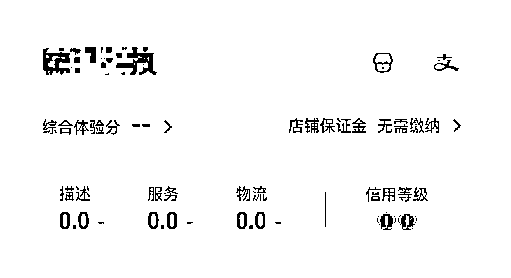

区别于其他人，也许你只是多了一些好奇心，多踏出了一步，多实践了一个地方，多思考了片刻，但是日积月累，你的认知，你的潜意识都将得到升华。稻盛和夫说过：潜意识是获取灵感的途径。必须进行强烈而持久的思考，获得潜意识。

 

 

【**2**】刚毕业就赚到人生的第一个** 100w**

接着 14 年大四下学期，我要去实习了。面试进了一家电信旗下的软件公司，同事很好，领导很好，大领导也很好。运营岗位，写写 b 端业务的 ppt 材料等等。接着又开始做产品岗，开始画 app 、系统原型图，协调技术人员，有幸经历了一整套软件开发的流程，产品从** 0—1 **的流程。

紧接着毕业了，在公司转正了。家里帮忙首付了房子，普通房子哈，月供 4k 多家里帮忙，那时候的我领着 5k 的薪资。想着就这样了？当然不行啊，于是边上班，边想着能不能副业赚钱。很多事，都是从你的第一个念头开始，经过长时间的思考，再加上执行力，也就慢慢靠近成功了。

怎么兼职赚钱呢，脑子闪过“猪八戒”这个任务平台。打开一看，正好有软件开发、 app 外包，建站，平面设计等等任务。于是，我开始利用上班空闲时间研究。当然，公司的活一点没拉下，保质保量。猪八戒的开店模式，类似淘宝，只不过他们专注提供虚拟服务，企业服务而已。

先给大家看下结果哈，刚去网站找店铺截了一张图，2年多时间累计成交1200万哈。

虽然刚毕业半年，实习到工作加起来一年不到。但是我学会了产品策划，产品设计，也搞懂了产品0到1的所有开发上线过程。一顿操作，分析对比了其他家店铺的产品，价格，服务内容。我确定了 app 开发这个类目，然后花了几百元装修店铺，宝贝链接，把淘宝那套方法论搬过来。

 

 

事实证明，淘宝创业的经验，一样适用于猪八戒平台，甚至能快速超过其他商家。比如刷搜索词，提高权重等，很快我的猪八戒店铺就有自然流咨询了。现在大家都围绕抖音、快手、视频号掘金，其实商业的底层逻辑都一样。

14 年 10 月，印象很深刻，谈成了第一单，3 万元，山西的客户，做个学校 app，很简单，就文章新闻，发帖，公告。那时候，跟客户电话打了 2 小时，我给他讲了很多很多产品规划，以及给他普及 app 知识。也许这种认真取得了信任。签约了，打了预付款。

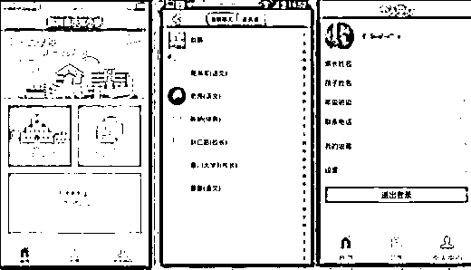

然后我就开始用 axure 画整个系统原型图，找了网上兼职美工 1000 元出了 ui 图，找了公司3个技术同事兼职开发，我自己测试，最后交付给客户，前后就 1.5个月  。去掉给技术开发的 1.5 万元酬劳，自己赚了 1.4 万元。

很有成就感，比做淘宝更有成就感，那时候觉得赚的这钱，很有含金量，是的，很牛逼。哈哈，现在不觉得的哈，淘宝不香吗？电商不香吗？

就这样，猪八戒的店铺我一个人管理，做客服，做店铺的运营优化，做售前，做方案。

别人家简单销售跟进，我会给所有咨询客户，做方案图，做思维导图。就这样慢慢的，11 、12 月，每个月都接到了几万元的单子。很快预付款，尾款收入，超过了工资好几倍。

15 年 1 月，正式辞职，开始专职经营猪八戒店铺。很快，每个月利润**  3 **万变成了了**5 **万，**5 **万变成** 10 **万。你想想啊，没办公场地成本，没广告成本，没员工固定工资。利润能不高吗。

 

 

现在想想，这不就是现在大家说的的“超级个体”吗？现在主播，自媒体，以及生财上的道友们，很多不就是超级个体吗。多香啊，真香啊。在这不确定性过强的大环境下，我觉得超级个体是最好的组织形态。

就这样 15 年，我在2700元租的单身公寓内谈单子，在对面商场星巴克见客户。算是第二次创业，赚到了自己人生的第一个** 100w**。买了辆途观，生活过得自由，惬意，充实。公司就我一个人，传说中的一人有限责任公司。累计合作的兼职技术，30 多个，同学的同事，同学的同学，同事的同学...

【**3**】** **商业模式升级

16年我开始思考怎样赚到更多的钱呢？怎么降低成本呢？毕竟这种帮客户定制开发软件，是非标的，甲方需求上的拉扯，也是痛苦的。下图是部分我承接开发项目，哪怕都是做上门家政app，客户需求也不尽相同。相当于我的兼职开发，很多时候都在做重复的类似的代码。

 

 

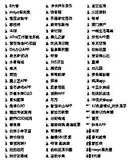

于是我就去观察同行，同行是最好的老师，看其他软件公司是怎么做的。发现存在一种软件公司，只卖软件成品，或者叫模板，大受启发。所以降低成本是改变思维的催化剂。

基于开发过的项目，我选择了幼儿园APP这赛道，做家校互通的APP。把之前开发过的产品，再次完善后，进行软件销售。还做了产品官网，不同套餐。有需求的客户咨询，我们以远低于定制开发的价格，引导客户购买成熟的产品。有新功能需求，我们也会开发到最新版本，同步给所有客户。

沿着这个思路，我们又开发了市场火热的夺宝系统、拼团系统，一套几万元不等的价格进行成品销售。很快我就不需要太多兼职技术了，也不再从事软件外包这”辛苦活“了。

标准软件产品的销售商业模式，直接大大提高了营业额和利润，带来前所未有的惊喜。

 

 

增长就是王道，我发现猪八戒流量有限，就这样我开始接触百度广告。百度的意义，对于我来说，不单单只是一个流量渠道。他带我走进了，付费广告的业务逻辑。以及，才有了后续上百人的团队。都说自然流的尽头是付费，目前看来是对的，因为只有付费，才符合平台的利益，才能更持续性的相互获利。

16 年就这样过去了，迭代了自己的商业模式，启用了百度付费广告，这一年营收翻倍，利润翻倍。换了辆车，保时捷 macan。公司呢，新增一名全职帮忙，剩下还是兼职人员为主。

【**4**】** **销售万能公式：价格战

都说销售万能公式：流量 x 转化率 x客单价 x复购率，我今天想聊的是“全网最低”。根本上颠覆原来的市场价格体系，大多数时候是有效的。另一个角度来说，也是一种极致降低成本的过程，因为你要保证产品跟质量相近。

16 年除了卖自研的软件。我又干了一个副业，当时我花了 398 元在猪八戒设计了一个  logo，2 个方案，改到满意为止。设计的很不错，这个 logo 沿用至今。我观察了下猪八戒这个设计类目，398 元算最低价了。

 

 

于是，我邪恶了，我上架了个 logo 设计商品，199元，3 个方案，改到满意为止。价格更低，服务更多。嗯，很快就爆单了，慢慢的爆，不是一天几百单，没那么夸张。从一天一两单，到后面一天 10 多单几十单。我还是找兼职，从淘宝里找兼职，qq 群里找兼职，甚至去猪八戒的店铺，让他们承接我的订单，赚取 100 元差价。我选择了极致利用兼职，将成本压至最低。

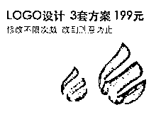

就这样，我让表弟在家做客服，协调对接兼职设计师，半年时间，做了** 3000 **多个** ****logo**，赚了将近** 40 **万的利润，销量排名第一，很多店铺模仿我们，只找到了这张电脑存图。

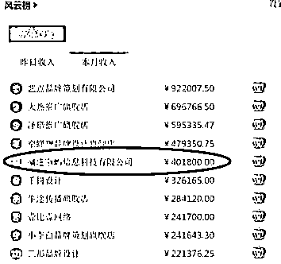

半年后，99 元 logo设计出现了，嗯，也是3 个方案，改到满意为止。是的，我们被“全网最低”干下去了。99 元，其实就是大学生设计，质量会差些，老师带着做，社会实践咯。可能这就是思维局限，你可以革掉别人命，同样别人革你命的时候，你还局限在自己当下的认知和判断中，很难推翻自己固有的某些东西。

 

 

过了几年后，听说了同样做设计类目的一个卖家，公司就在我隔壁，16 年我也知道这家店铺，他们几个合伙人本身广告公司出身。现在猪八戒也不做了。但是他在猪八戒积累了 4000 多个客户，在 5 个微信号里面。嗯，现在就靠这 5 个微信号，接业务做业务，一年稳稳地赚小几百万。

私域是真的香，沉淀一切有机会复购的客户，未来定会有惊喜。同样现在也有效，  新的一年大家要努力尝试做私域呀，永远不会过时，至少要想下当下业务，能不能做私域，先踏出第一步。一样可以借助企业微信，其他软件来辅助。

如果现在穿越到16年，应该怎么做？至少不能轻易放弃掉这个业务，去分析，去拆解竞品服务。去努力挖掘学生资源，去校企合作。存在即合理，99元logo设计肯定是有利润的。同时我需要一个弥补我能力缺陷的合伙人，一个广告出身，设计出身的合伙人，来帮忙打理这个业务。因为logo设计肯定是公司需求，海报需求总要有吧，VI设计总有人要吧。既然我已经搞定了流量，那么后续的服务以及二次订单，就需要专业的负责人来统筹管理。毕竟我对这个行业是陌生的，认知是肤浅的，决策自然是跟不上的。

【**5**】如何抓住风口项目

如何发现风口呢？其实就是如何高效获得信息，大量信息，还必须是新信息。会赚钱的人一定是很会获取信息，筛选有效信息，将信息转化为商机。我个人比较热衷于阅读新闻，创业报道等等，每天在头条、公众号上的碎片化时间估计有两三小时吧。一个月，半年，一年，如果长期坚持下去，量变产生质变。

同时在通过卖软件，也认识了很多全国各地的客户、朋友，获得了大量的信息。这些跨越时空、跨越地域、跨越行业、夹杂着不同人的不同见解的信息是更有价值的，更容易获得新的启发。生财有术就提供了这样一个平台，大家可以在上面高效获取最新消息，还都是跟钱有关的信息。

 

 

17年，我有个自己的第一个场地，300 多平，装修花了30 多万。之前兼职技术，有几个离职，跟着我一起创业了，但是没给他们发固定工资，还是按照项目分红，收到客户项目款后，再相应分钱。基本上会比他们正常上班，收入高 2—3 倍。

17 年 9 月，在线抓娃娃 APP，突然爆火，真实线下机子，两个摄像头对着直播，远程通过 app 控制机子，进行抓娃娃，中了，快递到家。最早我是在朋友圈看到别人分享的，很有新意，把商场的娃娃机，真实复刻到APP，体验感丝毫不差。于是我开始查阅相关信息，appstore 有两款 app，都下载玩了，还看到这2家运营公司的融资报道。

我判断是风口，毕竟在国内，只要跟赌概率相关的东西，都必火。于是我们 9 月底开始跟进研发，没日没夜加班。下图，朋友圈考古的照片。在公司加班，在工厂里调试设备。现在回忆，简单而又美好。

我们是第一个在百度卖抓娃娃软件的，10月上线广告后第二天就有客户咨询了。第四天，北京一个客户飞来公司。当时我们APP只是demo版本，还没上线，我们售价25 万元一套，app 双端，北京客户当天签约合同，打了10万预付款。

 

 

到 17 年 12 月，3 个月时间，总共卖了  几十套出去。Appstore 的抓娃娃APP，有将近一半是我们开发的。但是风口来的快，去的快，太多类似产品出现后，用户下载几十个  app，每天都可以免费玩几次，付费率变得很差，18 年 2 月这样项目就彻底没人买了。

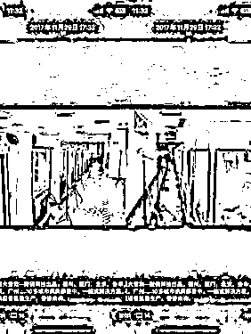

就这样** 17 **年又结束了，公司** 13**个人，营收又翻了，利润又翻了。继续顺风顺水又一年，很开心，真正意义上的公司成立了。有了真正意义的团队，不再是工作室了。

【**6**】每年都踩中一个风口，年利润超千万元

抓娃娃 app 的生意只做了三个月，来的快去的快。让我意识到了移动互联网有点尾声了，感觉需要app的客户越来越少。于是**17**年底我决定，不做**c**端**APP**产品，转做企业相关服务软件，转向** web **端产品。

企服软件那么多，赛道那么多，哪里切入呢？当你每天都在思考这个问题的时候，必然会有大量相关信息向你靠拢。17年12月，有个做金融电销的朋友告诉我，有款牛逼的电话机器人系统，代替人工打电话。这么神奇？我想了想，这技术太难了，我们做不来，就没深入了解，连产品公司名字都没问。先入为主、想当然、畏难情绪，这大抵是人的通病吧。

 

 

接着，隔了半个月，又有个朋友，钉钉的服务商，来公司聊天，告诉我南京有家公司的  AI 电话机器人很火。就是这么巧，这一次我对这个信息重视起来，能在这么短时间内，在两个朋友口中听说这个产品，那一定是吊炸天的产品。那天晚上回家，我在书房打开竞品的官网，研究起来，也看了同类型其他公司产品。

第二天，买了动车票，以做代理的名义，去了杭州，南京，看了两家公司产品。了解价格，市场情况。回公司后，我们就开干了，买了套软件回来体验功能，开始模仿开发了。18 年的春节，大年初二，我们团队就在家开始写代码了。就是这么拼。

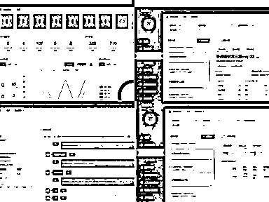

系统在开发完善了将近 4个月后，上线了。又是百度投放广告，当时全国就 5 家公司投放广告。我们去调研的那两家公司，都融资了几千万。都是阿里，百度 xxx 出来的创业团队，牛逼 plus。

这一次，又用了极致价格去跟竞品竞争，后来行业都叫我们公司是搅屎棍。竞品的价格一个 saas 坐席，一年 1 万元左右，城市非独家代理 25 万元。我们直接把 saas 价格拉到 3000 元一年。更狠的是，出了个私有部署，无限开坐席，无限开代理的功能。价格呢，25 万，嗯，对着干。

25 万元，买我们一套系统。你能像 xxx 公司一样，全国自己收代理，自己卖 saas。我记得 18 年 7月份吧，就我自己接听百度的咨询电话，一堆外省客户跑来公司，基本上都当天签约。一个月我一个人干了** 200w **。

 

 

18 年这一年，团队发展到 50 多人。从发现商机，市场调研，判断可行性，接着拆解项目，组织团队开干。就是快，在我这个二线中下的城市，去拼速度，去拼成本，把自己优势发挥出来。只打价格战是没用的，产品也要 ok，不要差距太大，市场能力也要跟上。

后来呢？历史总是相似的，内卷啊。500 元一年，都满天飞，必然销量慢慢下降了。自然，我们的重心又转移到了新产品新赛道上去了。再看看竞品，上文提到的南京，杭州的两家公司。他们呢，创始人B出身，认知足，融资上亿，不断迭代产品，遥遥领先。还进军银行，物流等等行业，出了细分赛道的电话机器人解决方案。

22 年南京这家公司还出了数字克隆人，再一次领先全国，听说要上市了。我们也在跟进开发数字人，有感兴趣的技术大牛，可以找我交流哈。

这里来谈下长期主义，大部分人跟我一样，选择了“快钱”，不深耕产品，不深耕市场。

一波过去，平淡接受产品的落寞。大部分人习惯性选择更容易的一条路去走，而不是难而正确的路。

当然你说，我们有错吗？好像也没有，赚到钱，团队公司也完成了发展。但是去年，我发现了一家同样竞品小公司，卖电话机器人的，当初跟我们体量比起来，简直太小太小了，他们坚持到了现在。公司就 10 多人，一年稳定利润上百万应该是有的。

 

 

ok，如果是现在的我，回头应该怎么做呢？我要继续保持这个产品线迭代升级，控在 10 人团队，慢慢继续打磨产品，找细分赛道的行业机会。给负责人，10 人团队，较大的分红权。慢慢坚持下去。走过平缓期，进入利润稳定期。

22 年，我的其中 1个项目，就采用了这种方法。目前，还算 ok，也许这就是大家说的长期主义吧，不争这一朝一夕的得与失，放权让团队自我迭代与成长，多多沉淀。

在 18 年年底，我拿了公司百分13 股权，分给了早期跟着我一起创业的 7 个小伙伴。大家除了赚到钱了，买车买房了，也开始慢慢有公司经营意识了。

突飞猛进的 18 年，即将结束。我们要换场地啦，装修了  将近 1000 平的场地。19 年会如何发展呢。我在思考，每一年的年底，都不太懂第二年的营收在哪里。这就是追风口，赚快钱的弊端，不确定性太大。没有什么延续性的项目，或者说没有一个核心业务在持续造血。

于是乎，我就有了新想法，真正意义做款产品，不再卖产品的私有部署了。我要真正意义做一款产品，慢慢迭代，做大做强。嗯，接着我们就上线了个人微信的工作手机。

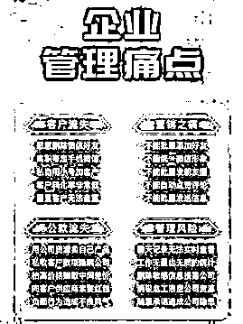

 

 

嗯，过程是痛苦的。收入不高，因为 saas 便宜呀，慢呀。哪里像以前动不动一整套系统甩给你，收你个几十万。19 年半年时间，我们通过渠道商，销售给了太平洋保险，途虎养车等等。利润不高，但是有进展，觉得还是很兴奋。

接着，我就陆续接到了几个投资人电话，询问这个项目未来发展，都是国内还可以的风投机构。那时候没接触过投资人，也不懂融资具体是个啥，况且公司那时候不缺钱，都是利润都是现金流，也就没认真对接。

悲剧来了， 19 年中旬微信开始打击第三方软件生态，大量封号。由于我在百度推广，也被盯上了。嗯，被警告了，下线了所有相关产品。怕的要死，南山必胜客，这个还是听说过的。

**19 **年** 6 **月，亏损** 60 **多万。因为没收入。这是我第一次经历亏损，从大二创业至今第一次经历亏损。慌不？也还好，团队准备裁员一大半，把亏损控制在每月 10 万，也能舒舒服服过下去，筹备研发下一款产品，大不了回到 17 年 13人团队。

这时候的我，是理智的，决策是对的。20 /21年疫情为啥亏了 1000w，决策就是反着来的。所以啊，人就是个很奇怪动物，同样的危机，在不同阶段下就会做出不同对策，哪怕之前已经有了很好的应对经验。

19 年 6 月底，在香港旅游。跟以前山东老客户聊天，看到了刷脸支付的机会。回公司后，开干。幸运女神眷顾，7 月底上线，恢复以前卖私有部署，贴牌系统的套路，公司收入马上恢复了。而且这时候的公司有销售团队了，不再是只有我自己进行业务销售。

很快，公司再一起起飞，单月最高突破** 600**万。

 

 

回顾下这几年风口产品，15/16 年的拼团，夺宝、17 年的抓娃娃、18 年电话机器人、19 年的刷脸支付。如何每年都踩中风口呢，我用的是笨方法，多做几个产品，提高命中率。当然也有弊端，都没踩中，那就会持续亏钱。

因此我们每年都有很多款卖不出去的产品，这就是对信息判断的失误。如何降低项目的失败率，提高成功率？我们在亏大钱后，做了很多有效复盘，也总结出了一些方法论，项目评估流程，这里就不展开聊了，有需要的可以找我拿材料。

还记得上文提到，我在猪八戒赚到了第一桶 100 万。接着又转战百度推广进行卖软件。

刷脸支付这个项目我启用了新平台广告，那就是抖音和今日头条的信息流。所以又爆炸了，单靠百度，是不可能做到单月大几百万的。

因此再次强调平台的重要性。现在主流平台抖音，快手，小红书，视频号，围绕着这些做生意，不会错的。哪里有流量，哪里就有生意，勇敢拥抱新平台。

19 年完美落幕，公司创业的第五个年头，团队突破 150 人。虽然有挫折，但是跨过去了，还跳起了。给自己买了辆保时捷跑车，下定了别墅。

【**7**】逆风考验能力，亏损** 1000 **万

 

 

20 年来了，刷脸支付业务如日中天的时候，疫情爆发，现在回想起来简直就是噩梦。

每个月公司固定支出 150w 左右。刚开始还觉得没啥问题，现金流足够。我们并没有进行裁员动作。同样 19 年 6 月份的危机，我们都做好了大裁员思想准备。20年疫情，人没裁，反而增加到接近 200 人。

公司同时在研发的产品就有 3 款。天真啦，总感觉只要有一款命中，上千万不就很容易的事情。这种错误的认知，造成了20 年的全面亏损，亏的差点底裤都没了。把公司辛苦积累的现金流，给整没了。所以人要经常反思，乐观构思，悲观计划，乐观实行。

悲观计划不到位，危机意识丧失。

20 年 9 月才后知后觉，不对劲，开始着手裁员，整个公司弥漫着怨气。现在回头看，问题出在我身上。百人公司的光环笼罩，总觉得裁员是个不光彩的事情，面子？寄希望于持续了多年的运气？这就是典型的把运气当做自己能力。在大环境好的情况下，很多人都能赚到钱，往往考验一个人一个团队行不行，就是要在逆风时候。

再看看20 年的自己真是傻逼。团队臃肿，大家都在吃大锅饭，没有差异化的奖励机制，分红机制，大家都等着我找到下一款爆品。这款软件卖不起来，没事，等下一款呗，反正公司现在还有正在研发的产品线。公司划水的人，估计得有三份之一吧。傻逼到，还花了 200 多万装修了新场地，1500 平。原先是打算买下这一层，作为自己物业。

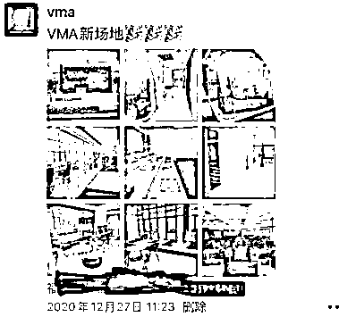

 

 

再想想跟着我的核心团队，大家缺乏决策经验，大部分都是我来拍板，大家都没实现个人成长。于是乎，我开始补管理知识，动员大家学习。有用吗？没有的，临时抱佛脚，意义不大的。认知不是一天两天形成的。

当个人，变成工作室，工作室变成公司。有太多太多东西需要学习，反思复盘的深入与否，决定了个人成长高度。20年就这样浑浑噩噩过去了，团队压缩到了 100 人。

剥离出了一个少儿教育项目，拿了风投机构几百万投资，第一次拿外部资金，来经营公司。我个人把精力放在了这个项目上。软件公司主要合伙人在经营。 20 年公司制度，组织架构并没有做调整。问题来的太快了，快到没有时间精力去发现更大问题，去思考。

21 年初，又进行了裁员，最后只剩几十人了。21 年有开始思考怎么走到现在状况的，花了一整年做了很多很多反思。人只有足够痛的时候，才会真正意义上的反思。

在 21 年最后一个季度，做了几个重大调整。将公司业务，拆小，由合伙人各自负责，合伙人得到项目的股权分红权，也需要共同按比例投资，不再大锅饭了。以最小团队进行业务经营，努力恢复以前创业状态。让合伙人充分得到锻炼，自我决策，提升自己能力。只有他们成长了，未来公司才能少犯错，少犯错自然就能大大提高成功概率。

21 年就在不断自我纠正，自我反思中结束了。虽然还是亏损，但是亏损收窄了很多，也得到了喘息。

 

 

【**8**】直面创伤，恢复元气

22 年是全面践行项目独立发展的一年。有的项目取得了不错的利润，也有项目还是亏损。这一年的收获，对市场的认知，对团队的认知，对管理的认知，都更进一步了，没有那么傻逼了、那么草莽了。团队主要负责人也能独当一面，分担很多经营压力了。

反观疫情两年，电商爆发、直播爆发。抖音作为新的流量平台，短视频➕直播新的互联网交互模式。我没赶上，彻底没赶上。如果围绕抖音平台，做软件系统，肯定是有机会爆款的。再比如我们做的少儿教育，围绕抖音做直播，肯定能做的更好。

【**9**】** **新的一年，突破自我

22 年结束了，从来没有今天这样激动，发自内心的颤抖。以往新年旧年的那一刻，刷刷朋友圈就过去了。今年的那一刻，是激动的，有对22 年经营不易的感慨，也有对 23 年到来希望的冲动。总有一种错觉，新的一年，新的开始，一张白纸，有满满一年时间，给你任意书写。

23 年已来，这一年我将继续采用小而美的团队作战模式。足够多的耐心去等待业务起飞，不在意某个业务产品的慢，活着就好，也许三年后，带给我的惊喜。

还是需要蹭风口，比如平台红利就是一种风口，跟着趋势去做，肯定是更容易成功的。

利用每一个机会，不断沉淀自己，提升自己，提升自己的团队，只有这样，机会来了，你才能接得住。23 年，视频号一定是个最大的机会，我们也布局了视频号软件业务，投资了直播团队，短视频团队。

 

 

这三年，不在一线做业务，社交圈变小了很多。好像损失了很多信息，损失了很多灵感，必然也错过了一些机会。**23 **年希望认识更多的朋友，欢迎大家来找我交流。希望大家看完有启发，当然没有启发也正常，因为写的很一般，很流水账。

就这样吧。提笔于 2023.1.1 00:30，完成于 15:10。

评论区：

冰点 : 仔细看完了，很精彩

良辰美 : 回过头来看历史选择，总是感觉当时太傻逼，其实就是认知不到位。亏损真的才是惨痛教训

朱海涛 : 起点一样，格局和认知不一样，唉，路走歪了

设计师小元哥 : 源码年代确实已经过去，回望14年-18年O2O、外卖、新零售源码时代，那真的是躺赚，未来还是B端saas的主战场，希望都能找到一个长期主义的赛道，持续精进！帖主可以交流下！

vma : 嗯嗯。我们都没卖源码，只是卖部署。

小土的世界 : 兄弟能折腾，能打胜仗!!

Fly : 大佬经历真丰富

东哥 : 好厉害，能折腾，能打仗[强][强]
<!-- split -->
# (精华帖)(98赞)记住这一点，你的公司少罚十几万——地图使用中的避坑指南

作者：  张云金_GISer

日期：2023-01-17

 

 

Hello，大家好，我是张云金_GISer，名字带的这个后缀，代表我们是从事GIS相关专业的人士。可能大家对GIS不是很了解，但大家对地图一定不陌生。地图就是GIS的一个主要输出。

我07年GIS专业毕业后一直从事地图相关的工作，主业是产品经理，主要做二三维地图相关的产品设计，闲暇时间运营一个公众号，4万+读者，一个垂直领域知识星球，付费用户1000+。多次为中国国家地理和北斗集团制作图书地图，偶尔会帮朋友定制设计地图挂图。

考虑到大家后续可能会在单位业务宣传推广中用到地图，今天结合地图相关的政策，给大家分享下地图使用中的坑，最后会给大家介绍下地图的避坑方法。

今天给大家分享的内容分为以下4个方面：

1、那些被罚款的问题地图

2、国家对地图的政策要求

3、如何制作正确地图？

4、在PPT中如何操作地图？

 

 

# 1. 那些被罚款的问题地图

在公司的发布会PPT及宣传材料上经常看到一些问题地图，我先给大家发几张图，大家看看能不能找出哪里有问题？

 

 

 

 

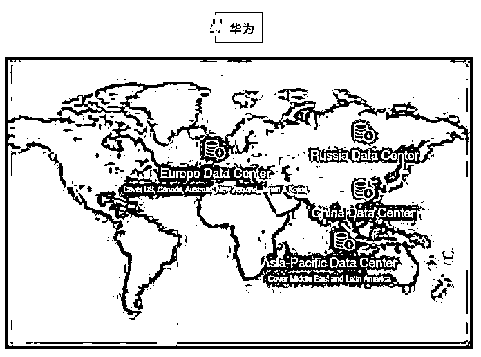 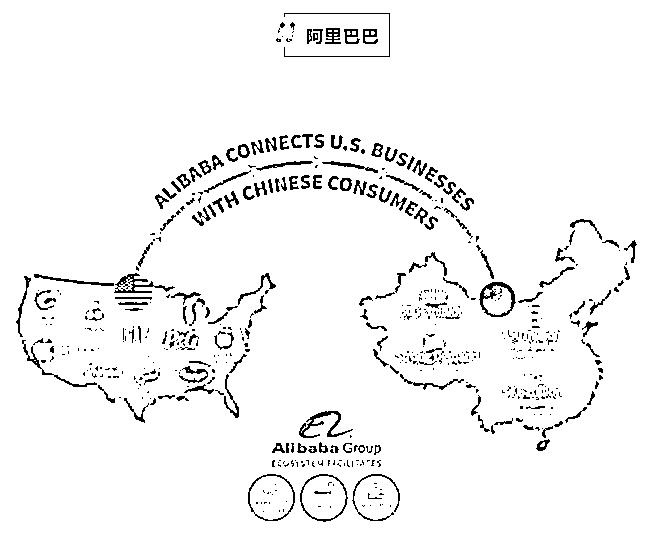 

 

 

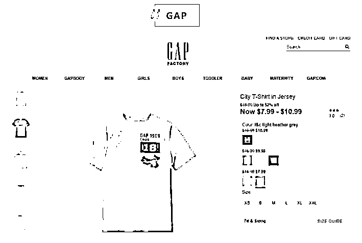 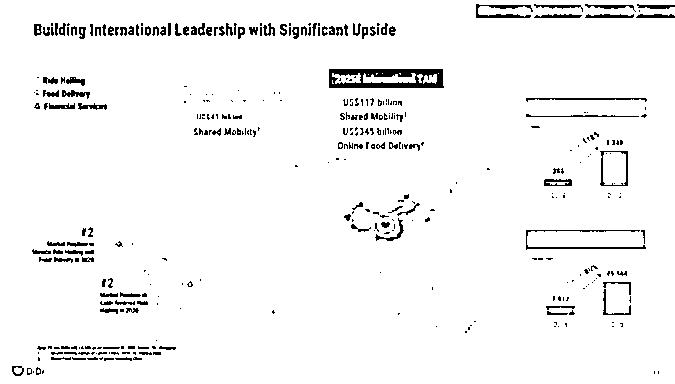

看了这几张，大家能看出什么问题吗？

 

 

对，中国国界都有问题，都属于问题地图。

在咱们国家，对地图的边界，尤其是涉及到国界的地图，管理的非常严格。

原来有一个专门的机构国家测绘局地图技术审查中心来对公开的地图进行审查，现在归属到了自然资源部。

自然资源部地图技术审查中心 https://www.zrzyst.cn/

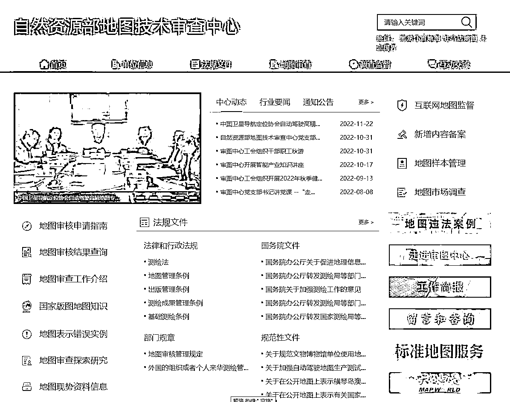

 

 

我们说的“问题地图”主要指存在危害国家主权统一、领土完整、安全和利益等严重问题的地图，“问题地图”的常见错误有漏绘钓鱼岛、赤尾屿、南海诸岛等重要岛屿，错误表示台湾省、错绘藏南地区和阿克赛钦地区国界线等。

一般对问题地图的定义是这样的。

一旦出现问题地图，至少要公开道歉，召回或者销毁有问题的内容。

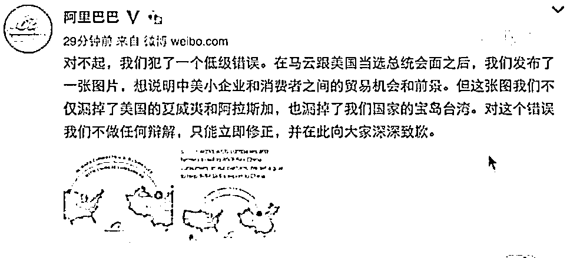

 

 

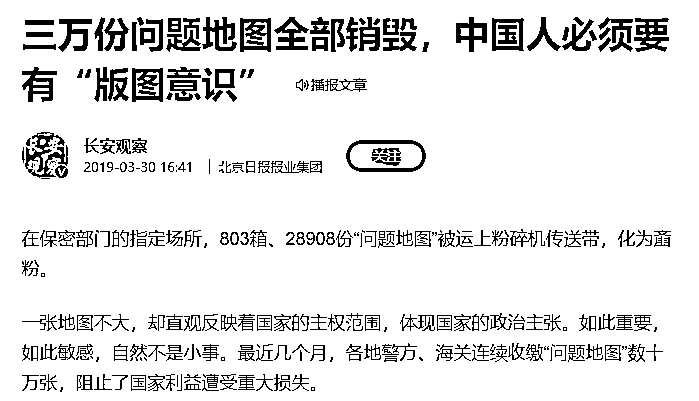

有的还会有对应的罚款。

 

 

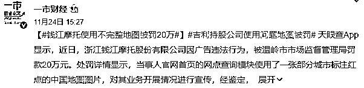 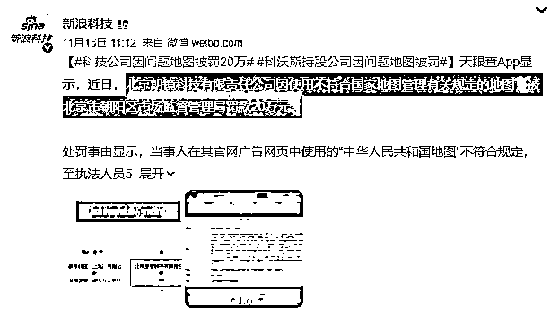 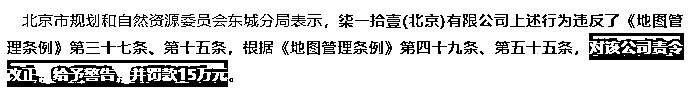

 

 

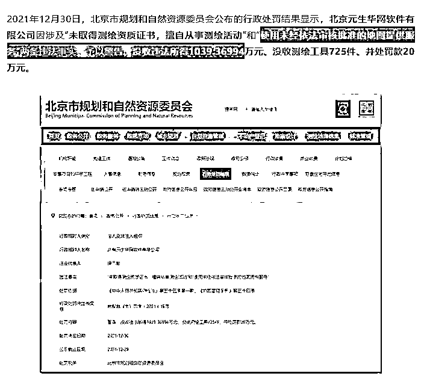

 

 

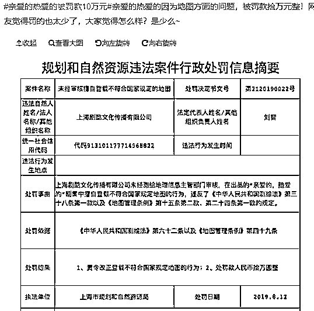

# 2. 国家对地图的政策要求

在咱们国家，关于地图，有专门的地图管理条例，这是网址，里面有详细的介绍。

https://www.zrzyst.cn/flhxzfg/310.jhtml 

 

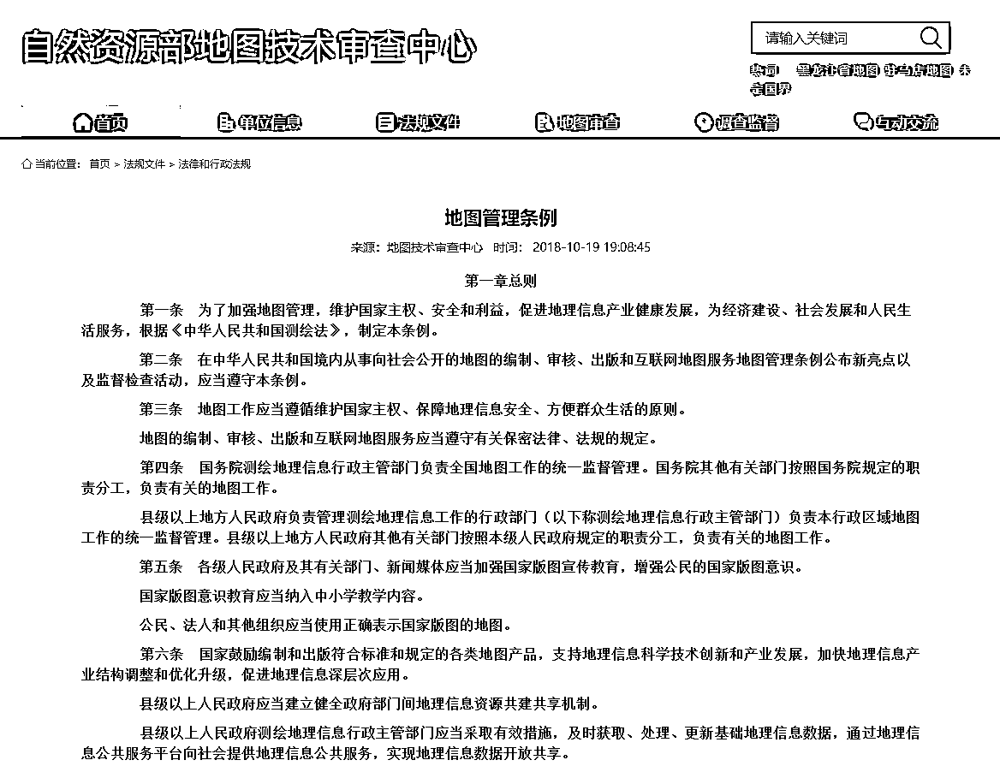

内容很多，大家只需要知道两点就行

1、在咱们国家，实行地图审核制度。

**2**、向社会公开的地图，应当报送有审核权的测绘地理信息行政主管部门审核。

出版地图的，由出版单位送审；展示或者登载不属于出版物的地图的，由展示者或者登载者送审；进口不属于出版物的地图或者附着地图图形的产品的，由进口者送审；进口属于出版物的地图，依照《出版管理条例》的有关规定执行；出口不属于出版物的地图或者附着地图图形的产品的，由出口者送审；生产附着地图图形的产 

 

品的，由生产者送审。

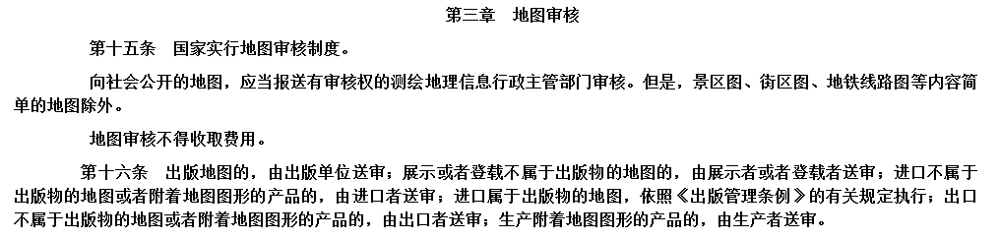

说人话就是，所有正规出版印刷的地图相关的内容，包括地球仪，都需要进行审核。

给大家一个网站，https://wsbs.ch.mnr.gov.cn/publicity/wsbsPage/todtshquery  ，可以看到除了一些出版社，像玩具公司或者印刷公司之类的，如果你要制作地图相关的内容，也是要提交审核的。

 

 

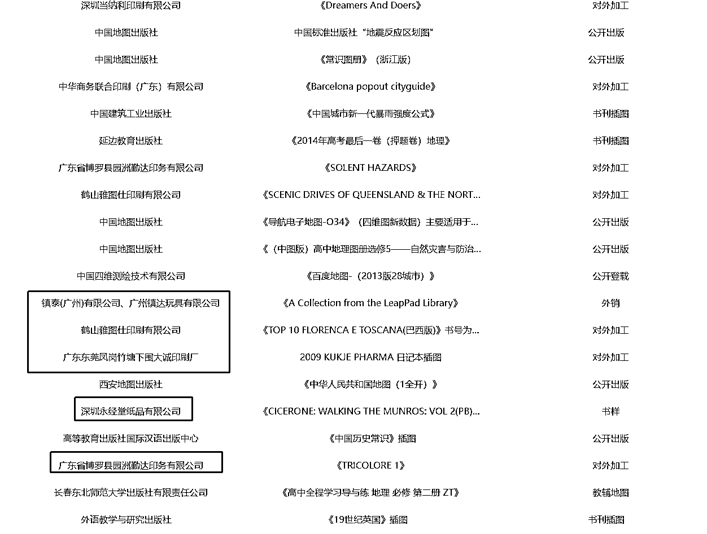

另外大家可以打开一些地图相关的网站，比如百度地图、高德地图，可以在地图的左下角看到对应的审图号。

 

 

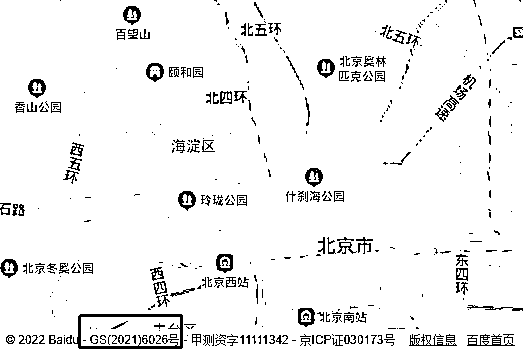 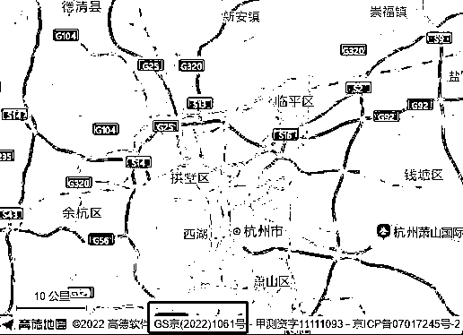

一些涉及到地图的图书，在其正文前面也会有一个审图号。

 

 

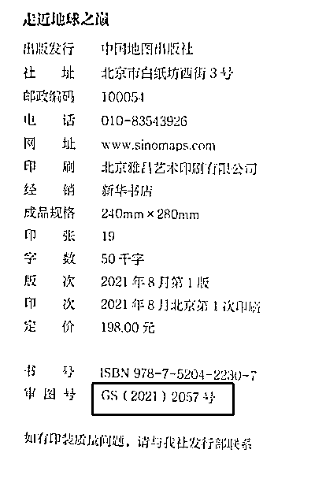

带有这种标示的，证明都是通过审核可以公开使用。有些图书为了避免不必要的麻烦，在出版社把一些地图相关的内容进行了删除，比如这样。

 

 

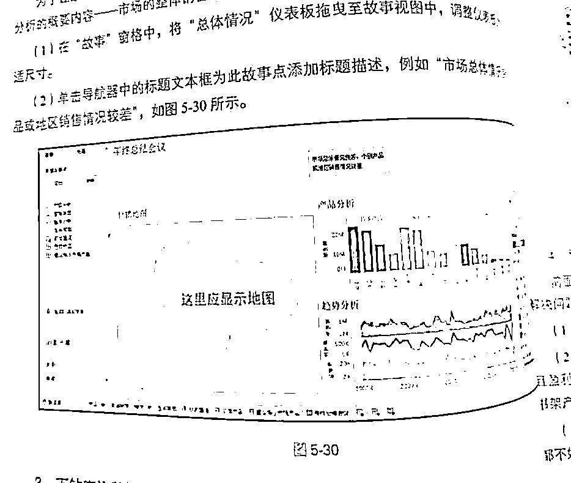

涉及到全国性质的及国界线相关的，一般是自然资源部的审查中心来处理，各地市省份的，有对应的自然资源局审图机构来审核。

他们一般都会审查什么呢？这里有一个关于审查内容的详细介绍。

https://www.zrzyst.cn/dtscgzjs/377.jhtml 

 

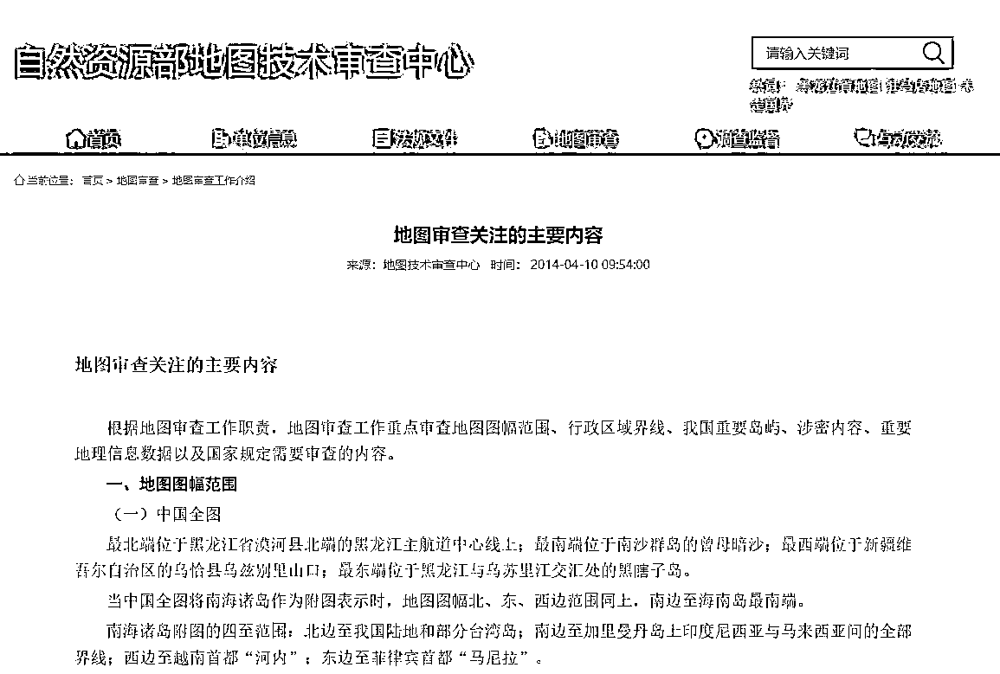

内容也比较得多，大家只要重点注意下中国地图中易错区域区域即可。大家可以看下这张图。

 

 

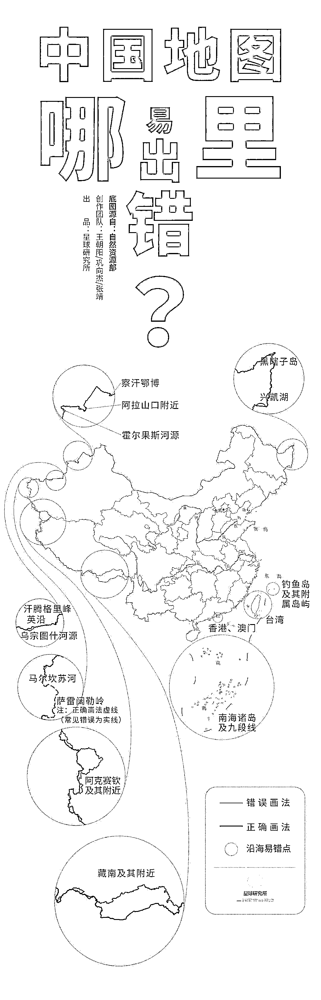

 

 

 

 

这是星球研究所之前做的一个图，列了中国国界容易出错的地方，有15个之多。最容易出现错误的有下面这5个。

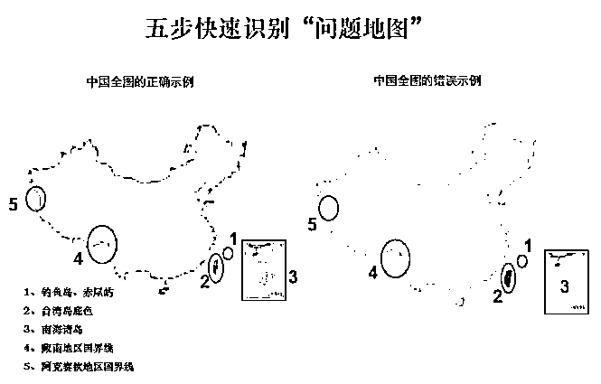

大家可以对照着这个图，看看自己单位的网站、PPT中有没有类似的问题。

 

 

# 3. 如何制作正确地图呢

上面给大家介绍了错误的地图长什么样，以及犯了错会带来什么惩罚，那么问题来了，如何制作正确的地图呢？

自然资源部有一个专门的标准地图网站，http://bzdt.ch.mnr.gov.cn/

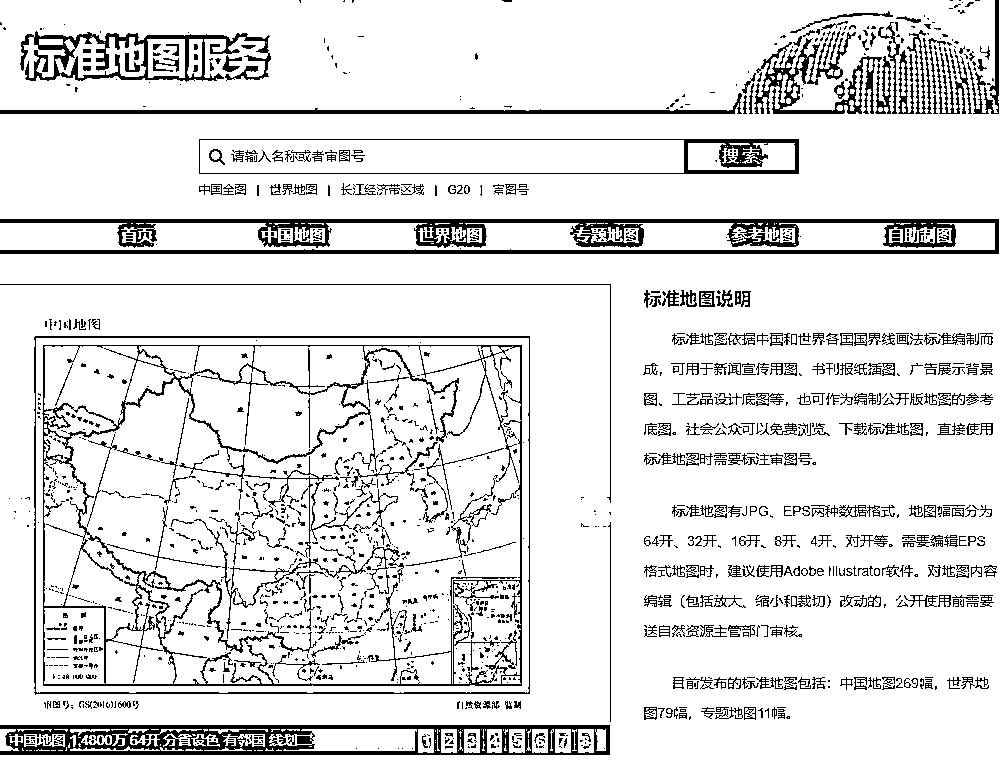

它既然敢称为标准地图，你可以理解为是官方发布的，绝对没有问题的地图。

它们是依据中国和世界各国国界线画法标准编制而成，可用于新闻宣传用图、书刊报纸插图、广告展示背景图、工艺品设计底图等，也可作为编制公开版地图的参考底图。社会公众可以免费浏览、下载标准地图，直接使用标准地图时需要标注审图号。

 

 

网站提供了几百幅标准地图，可以根据需要进行下载。

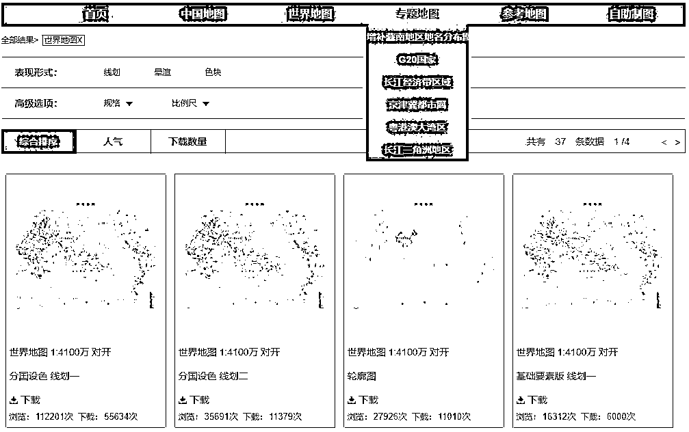

另外如果觉得现成的地图不满足需要的话，可以通过网站提供的自助制图功能，自己定制地图。

 

 

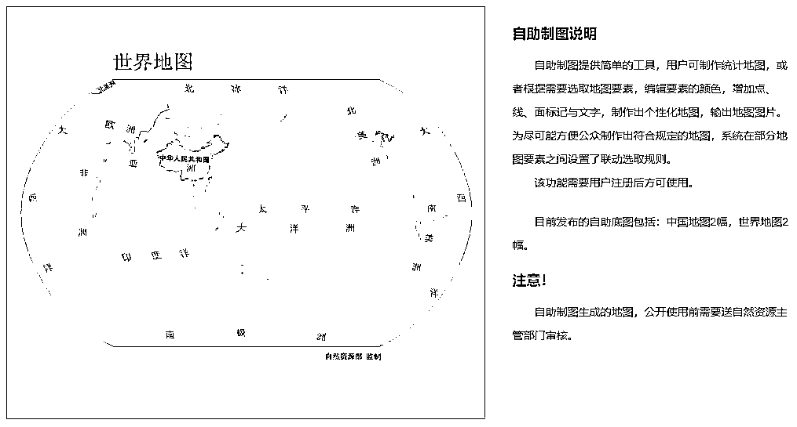

通过简单的勾选即可所见即所得地得到想要的地图。

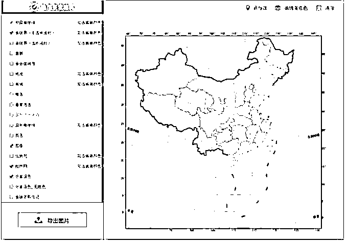

 

 

我之前写的这篇文章中，有详细的操作介绍，需要自主制图的球友可以看一下。

https://mp.weixin.qq.com/s/dxqy-XNjae1x542pe_SdMA

# 4. 在PPT中如何操作地图

上面官方给提供的标准地图网站虽然可以通过图层勾选自定义设计地图，但只能设计世界地图和中国地图两种，如果要做一些其他省市或者区县的地图就不能使用这种方法啦。

另外大家平常在工作中，可能不会接触到专业的地图，使用地图最多的应用场景可能是在PPT中或者在公司官网、宣传册里插入一个地图。问题地图之所以出现问题，主要是因为它们使用了不符合国家规范要求的数据进行生产的，而这主要是由它们的政治形态所决定，比如你从国外网站的数据，一般台湾以及藏南、阿克赛钦等地区都会有问题。

那么去哪里下载正确边界的地图数据呢？给大家推荐一个阿里云的网站

http://datav.aliyun.com/portal/school/atlas/area_selector 

 

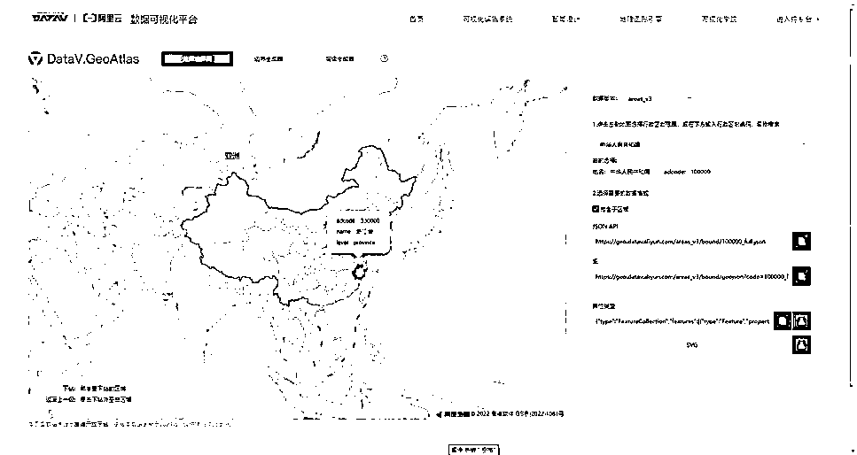

大家可以看看地图的右下角，是有对应的审图号的，所以数据源肯定没问题。

需要什么地方，我们直接点击对应的省份进行下载就行啦。

默认下载的是全国各个省份的地图。提供2种数据格式，json和svg。

开发的童鞋可能对json文件比较熟悉，如果做PPT或者在AI中进行二次编辑的话，直接使用svg就行啦。最新版本的PPT可以支持svg直接拖拽进行加载，比如我将中国地图添加到PPT中是这种效果

 

 

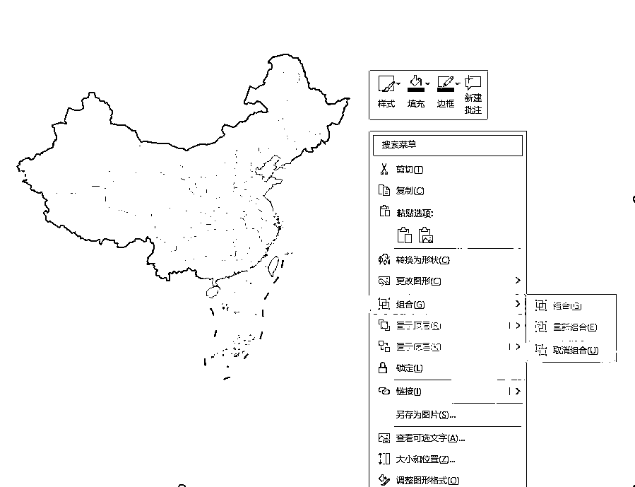

可以选择图片，右键选择组合--取消组合，解散打组。解散后就可以对数据设置不同的效果了。

 

 

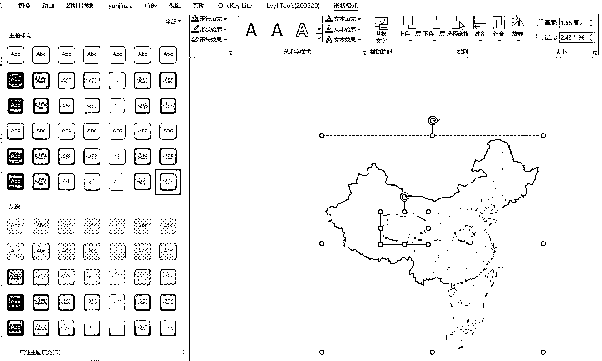

同样的，如果你想展示某个省份下的各个市县，只需要在下载时点击对应的省份就行。

比如下图中浙江省的各个市。

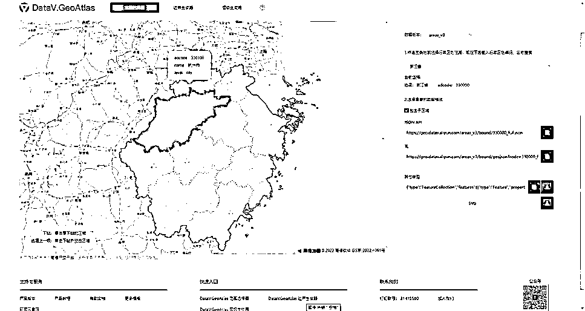

最小粒度可以到区县，比如杭州市的各个区县。

 

 

svg文件拖拽到PPT中就可以直接使用。

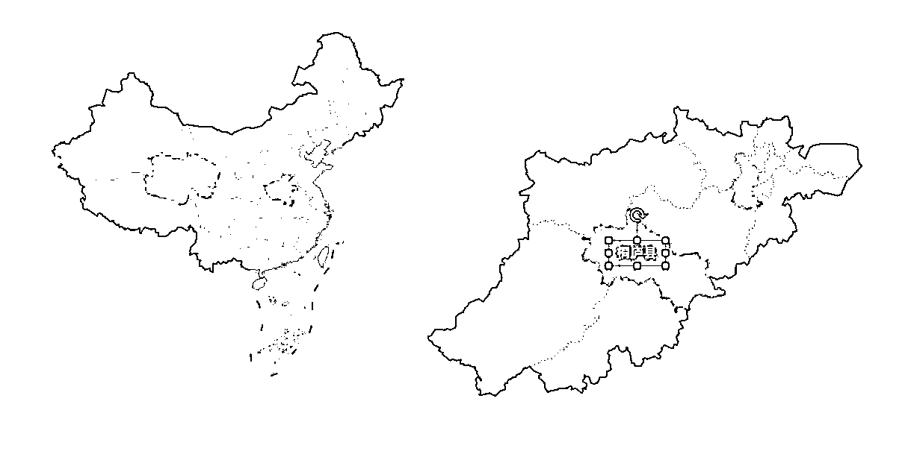

通过这种方式，大家就可以根据自己的需要，来设计没有什么问题的地图啦。

 

 

以上就是我今天的分享。

通过几个有问题的地图案例，给大家介绍了咱们国家对地图的审查要求，

通过2张图片，给大家展示了地图上常见的问题区域。

最后给介绍了官方推荐的标准地图网站以及一个下载国内正确数据的网站。

后续使用地图过程中遇到什么问题，可以随时找我：）

学习地图知识，虽然不能帮你们单位挣钱，但可以帮你们单位省钱、省麻烦。

地图无小事，用图需谨慎。

评论区：

凡灵逸尘 : 优秀

高杰 : 涨见识了

张义维 : 专业！👍

队长 : 不错，我们出口的产品就有地图，要给自然资源部审核过的才行

D- : 哇哦，优秀。

亦仁 : 感谢分享，已加精华。

 

 

**1. **好的项目

**2. **优秀的推广团队

**3. **先进的经营理念

**4. **卓越的管理方法

杰克波 : 非常实用

晨曦 : 涨知识了～学习了
<!-- split -->
# (精华帖)(75赞)从项目、推广、经营、管理、财务、风控六方面，分享我在招商上遇到的坑

作者：  张振兴

日期：2022-02-22

大家好，我是张振兴，我做了 6 年的餐饮招商加盟投放，今天想来跟大家聊聊关于招商加盟的坑。

大家都知道，招商加盟并不是一个新业务，从线下招商到线上招商，虽然形式不断在变化，但是底层逻辑都是相通的。在项目上，如果选错项目，就会投多少赔多少；投放方向上也是如此；甚至经营、管理会出现分公司不合的情况；财务也会面临分钱不当，变为亏损；风控上会面临被举证侵权，每一个环节稍微做错一步，都会面临整个加盟失败、公司倒闭的情景。

因此我今天的内容，主要围绕这 6 类展开：项目 / 推广 / 经营 / 管理 / 财务 / 风控。

我也坚信，这些是一个上亿规模的招商加盟公司的护城河：

 

 

**5. **良好的财务体系

**6. **严格的风险控制

**—01—**

项目坑

**1**、选项目的坑

选错项目，投多少赔多少！

2017-2019 年，孵化项目搞招商的公司很多，但赚钱的项目是少数，为什么？

招商加盟孵化一个项目需要多钱？我们算一笔账：

商标注册** 2000**

设计一套** VI**，员工工资** 2w**，如果是第三方做设计，**5-10w**

打样餐具** 2 **万

样板间** 10 **万

印刷手册** 5000**

前期推广费** 10 **万至少

新团队搭建** 10 **万招聘培训三个月

产品研发** 2 **万

前期的半成品** 30 **万至少

其他费用

 

 

由大往小：先国际，再国内，先经济，再行业，再品类，再项目

打破重组：跨行去找热点的技术，模式，管理，组织形式，套用在你的项目上

长期思维：快钱的通路是一个一个的堵死，长期思维，不能只图眼前

多重变现：不能一锤子，不能一下子，多重收益设计

这些简单的算一下， 大概在 70 万

70 万只少不多，砸下去，大多数情况是不怎么好的，大概有几个原因：

第一，内部宣传不到位，员工不相信项目能赚钱，自信不够，无法形成有效销售；

第二，孵化新项目需要的是公司最核心的利益，没有足够的分配作为驱动，根本不能全力以赴，往往变成一场作秀；

第三，快招式孵化项目没有市场化基础，如果复制风口项目，只能捡漏，发展不大。

有没有比较好的项目孵化的方法呢？

说实在的，肯定有，只是没有任何人敢说他的方法就一定是最好的，方法是不断的变的。

这里提供一个思路：

 

 

**2**、代理招商公司能不能合作？

“跟招商加盟公司合作，帮我招商，品牌搞砸了！”

很多人的品牌不错，跟招商公司合作，招商很快，但品牌一下子搞砸了，为什么？

招商公司是佣金导向，必然导致快速扩张，所以会放低门槛，导致一批不适合的人加入游戏。

其次是大多数品牌不具备大规模交付能力，打个比方，你的品牌经过 5 年发展有了 20 家店，你觉得很厉害了，但招商公司给你一个月就招了 20 家，这么多门店集中开业，根本服务不好，最后全是烂摊子，如果涉及到食品安全，事故隐患，可能会把品牌带入深渊，多年经营毁于一旦。

那品牌不懂招商想做招商怎么办？一句话：

有多大脚穿多大鞋，在能力资源不具备的时候，先积攒实力。

**—02—**

推广坑

 

 

**1**、投的方向错了，眼睁睁看别人挣钱

有个老板，做了 7 个项目，眼看要赔了，玩不起，卖给一个招商公司了。

这招商公司买的时候，就发现他投的方向错了，有背书的项目不投放，没背书的项目在投。买回来，把其中一个有背书（上过 cctv）的项目，狠砸信息流广告，一个月不到，买项目的钱赚回来了。

最后，卖项目的老板眼睁睁的看别人挣钱。

**2**、信息流加盟广告转化很差

很多公司在这个事情上吃大亏了。

假设你是一个公司的老板，现在每天花 5000 在信息流，电话每天 50 个，但做了半个月，一直没有成交，停推吧，员工要吃饭，不停吧，亏不起，犹豫来犹豫去，最后还是停了，项目不做了。

一般来说，一个项目能转化，有且不限于以下的几个因素：

项目有热点（品类有热度，产品有热度，品牌有热度）

项目完整性（样板门店，销售道具，销售套路）

团队完整性（投放，新媒体，邀约，招商）

营销去串联（用一个营销的套路把上面三个层面的方方面面都串起来）

 

 

如果你通过广告投放，一直没转化，检查一个数据，每 100 个电话的转化情况，如果  300 个电话不能转化 3 个成交，停止这个项目，立即从上面的层面去检查，分析可以用下面这个漏斗来。

销售漏斗：

留电话，**3000 **个看广告** 1 **个留了电话，低于这个情况重新设计留电话的理由来考察，**30 **个留电话的，来考察的有一个，低于这个情况重新设计来考察的理由

签合同，**3 **个来考察的，签约** 2 **个，低于这个情况重新设计来签约的理由**3**、开错推广账户，我一年多花** 300 **万

超过 100 万推广费的公司，合作框架能省不少钱，这个内幕做老板的一定得懂。

一般来说，百度、字节对于招商加盟是有框架政策的，而本地的代理商一般是没有政策的，如果一年的广告费支出超过 50 万，建议找总部开框架账户或者第三方的框架拼框。

大概这样操作下来，每条线索的成本大概能降低 10%-20%，甚至更高。一年省下大笔开支。

我们打个比方，你和对手充值都是 1000 万，对手有 10% 的优惠政策，那么等于他用  1100 万和你的 1000 万玩，优势一下就体现出来了。互联网的竞争，如果不能做那个** ****1**，就是** 0**，很容易处处被动。

 

 

**4**、推广和销售相互扯皮，乌烟瘴气

推广给销售提供资源，销售来转化成交，属于上下游关系。几乎所有的企业，推广都是命脉，老板直管。

老板给销售下任务，销售给推广要资源和成本，一旦业绩无法达成，一定会想办法在推广这找点问题，不可避免的要产生冲突，不解决好，形成部门对立，这是很大的内耗，试想你是老板，怎么办？

这个问题首先靠标准来解决，所谓标准，也就是对推广要求有效率标准（比如百度搜索渠道，有效客户百分比），成本标准（单个渠道成本，整体渠道成本），对销售要求转化标准（每 100 条电话转化多少业绩）。

其次需要利益捆绑来解决，把销售和推广的激励和奖励，放到一起去做。

**—03—**

经营坑

**1**、分公司总经理不听话！

这种情况在兄弟文化的公司很盛行，公私难分清，很难管理，人情大过天。

 

 

解决这种问题，是需要在创办公司前，把事情都说好：

身份明确好，是代表总公司去管理，而不是去一手遮天安插自己人手去了

一把手无权对二把手任命

重大人事任免权限归总公司

知识产权，研发，财务等卡脖子资源一定是总公司分配

行政审批，重大预算审批归总公司

**2**、分公司总经理带人单干了！

首都有家公司，我也不说名字。老大去南方考察市场，发现市场极大，就派自己最信得过的兄弟，南下打江山，2 年后，这个兄弟做得比总部还大，给老大打了 1000 万，说老板我自己干了。当初这个公司老大让公司很多高管入股，后来这些入股的人关系都弄得不好了。

所以你看看，紧了发展不动，松了不能管控，这个松紧的度，真的是难把控。

分家的原因，一般是分的钱少了，其次是给的权力过大，管控力不够，形成权力真空，一般分公司的领导会和有资源的供应商合伙另起炉灶。

**3**、我花了** 200 **万挖了高手开了个招商加盟公司，结果干赔了！

2018 年是招商加盟最如火如荼的一年，有多火？可以毫不避讳的说，是个人都想搞加盟。

 

 

有个做工程的老板，由于压款严重，打算投招商加盟，准备了 200 万，找了个招商加盟公司的高手，三个月赔了 100w，撤了。

为什么赔？

首先，很多人犯了一个错，只看到表面赚钱，没看到背后亏钱，或者对别人的失败视而不见，只看到利益，看不到背后的风险。可能你看到的赚钱案例，只是他 10 次赌局，唯一赢得那一把。

其次，是你挖的这个人，他可能真的厉害，但这个厉害，必须建立在他还在这个平台，试问你有没有这样的平台让他继续厉害。

最后，你把事情想简单了，没做之前全是一片大好，做了发现才是个坑，甚至坑里有坑。为什么？前面我说了，招商加盟是一个行业集合体，集合了好多个行业组织协作的结果。

**4**、我** 3 **个月招了** 300 **家，赚了** 400 **万，开了个厂全赔进去了！

2018 年有个老板，自己创立了一个面的品牌，非常有特色，首先门店的墙面文化做得很棒，体验氛围棒棒的。

其次他把面的浇头、面条全标准化了。有个招商公司，三个月时间，帮他招了 300 个加盟商，赚了 400 多万。

 

 

有了这么多钱，想赚更多钱。就办厂，办厂钱不够，还贷款了，结果赔进去了，怎么赔的？

第一，厂建好了，但是那些加盟商前期已经买过很多物料，一时半会消耗不完，所以销售很难迅速拉起来；

第二，加盟商发展太快，客户投诉太多，有拉横幅的，要自杀的，打官司的，工厂加盟两头跑，焦头烂额，事情非常不好处理；

第三，300 家店放出去后，继续加盟的人变少了，因为有投诉，闹起来了，所以我预计未来的销售计划也泡汤了。

综上所言：

首先，你赚什么钱就赚什么钱，想办法重复这个动作就行了，别多线发展，哪怕是有利可图也不行，因为一旦拉宽战线，都做不好。

其次，任何事情都不会按照我们想象的来发展，比如我觉得三个月能开 300 个，那一年不说 1000 个了，600 个肯定没问题，但其实这个面，能放这么多加盟在于这个招商公司有利可图，后期饱和了，难做了，就不合作了。

**—04—**

管理坑

 

 

**1**、两个高管不合，除夕我约烧香，给他们在视频里跪下了！

有个地方小吃品牌，老板是做连锁起家的，所以有个得力的运营总监帮他拓展门店，有一年，老板要搞招商，就高薪聘请了个招商总监。

这个招商总监很得老板器重，老板想培养他，但运营总监觉得这个人就是嘴能说，实际的落地性不强。

而老板要平衡，就从中调和，所以就出现了标题的一幕，老板跪下了，香也烧了，过完年散伙了，招商也不搞了。

在企业里面，空降兵和老员工的关系不好处理，很微妙。究其原因，很多企业搞的是人情管理那一套，企业发展初期，公司内部铁桶一般，谁想做对公司不利的事情，对不起，不答应。但是发展壮大，引入重要人才的时候，大家就不免要争宠。

这个时候，企业就要升级了，股权期权是很好的东西，老板不要觉得不懂就很无辜，要么你的企业就维持原样，缩小步调，要么你就要学习先进的管理方式，升级整个企业。

**2**、公司拉帮结派成风，我该怎么办？

党内无派，千奇百怪。

人都有喜欢的人，也有些人善于社交，大家喜欢跟他配合工作。

 

 

有人就会有派系，但是也不是不能破解。

首先，如果是挖来的团队，必须给打破了。

其次，限制高管带前部下的数量。

第三，扶持和任用新人，均衡。

第四，不断地在企业内部做新的协作关系，打破以往的旧关系，并形成新的文化和利益。

第五，利用好的愿景使命价值观给员工补给养分和正能量。

第六，员工之所以有这种派系、山头，有一个原因是没有安全感，增加企业的文化关怀活动，强的企业文化能让任何人都参与进来，积极贡献自己的一份能量。比如美国宝洁的企业文化。

**3**、员工躺平，不努力，我都急死了！

老板在算老板的帐，员工在算员工的帐。当老板算完觉得亏的时候，老板可以说不玩了。但员工觉得亏的时候，唯有躺平做抗议。

事实上，现在的营销，对个人的依赖程度越来越低。个人很难对抗团队。

 

 

一个健全的管理体系，一套好的营销流程和技术以及获取优质资源的能力，甚至可以不怎么挑人，有人戏称，哪里是找了个工作，这是给电脑配了个操作工而已。

所以：

从员工自身找到痛点（要赚钱）

从使命价值观找到员工的原罪（你就是来赚钱的）

从公司的体系配套找到方法（证明赚钱很容易）

从竞争机制荣誉体系找到动机（不赚钱就没价值）

从再培训体系和劝退规则找到底气（尽管努力赚钱，没赚到企业负责把你送

走）

**—05—**

财务坑

**1**、把应付拿来分了，公司亏钱了！

事情是这样的，老板定了分红规则，然后年底利润只要达到一定数目，就会把这笔钱按照每个人的比例分下去。

结果某高管为了分钱，就约供货商做了账期，这样公司只要持续经营永远有一笔钱没有付给供货商，到了年底，经过核算，利润真的做到了，钱分了，大家很高兴。

 

 

事实上，这是不符合核算标准的，从财务上讲，应付账款，是不能核算为利润的。不懂的老板就要吃亏。

在这里给一些建议：

必须有财务制度、财务流程，哪怕你没有财务，不然翻船是迟早的事

制度需要成文，并且要求跟报销有关的员工进行学习、签字

企业超过财务的报表需要详细，并且按照周、月、季度进行相关的会议

相关财务人员需要做好预警工作，收支风险提醒，不然只让老板操心，老板要

累死

企业超过** 30 **人，需要培养高管财务意识，财务分析能力

**—06—**

风控坑

**1**、我在某平台投广告，被告侵权，平台竟然举证证明我侵权？

一般品牌侵权，对方会连平台一起告，而平台不承诺保护你的违法（侵权）行为，所以平台会在法庭举证，证明你侵权了（别问我是怎么知道的）。

为了规避这类情况，广告宣传和投放用的关键词、字体、图片、肖像等都必须要规避版权。

字体买一套，其次所有图片尽可能用自己的和免版权的，搜索无法投放的关键字可以拆开。

 

 

**2**、员工承诺终生服务，打官司输了

大家都知道，做销售是压力很大的，然后销售提成的诱惑也很大。

有的员工为了拿下客户，会走政策擦边，甚至会没底线。

有一个员工为了拿下客户，承诺可以终身服务，客户不信，这个员工就在合同上手写了一条给客户，随后公司当然是不知情也没兑现，客户打官司，法庭判公司罚金，理由是员工行为代表了公司。

规避这种情况，需要完整的合同管理制度，流程，合同上不能私自改动字句，如有必要，需要加盖公司公章，其次是合同是由公司交给客户。

如果涉及到业务人员离职，需要检查一遍合同问题。

以上，就是我做招商加盟遇到的一些坑，有些朋友正在做招商加盟，感受会很深，有些朋友，想走招商加盟模式，那么你在设计体系的时候，可以参考我遇到的这些问题，提前规避掉。

最后大家也可以在评论区提问，毕竟限于篇幅不能一次性全部讲完，只要是有针对性的问题，我尽可能给一个准确的回答。

评论区：

 

 

方先生不方 : 很多共鸣

凡夫俗子 : 19年后明显感觉快招越走越难了，

曾经的原动l 天l 君w等大公司韭菜割了一茬儿又一茬儿的，随便孵化个啥项目ROI都能做到1:20以上，

现在一个个都老实多了。

还是脚踏实地把服务  产品做好。

张振兴 : 行业在变天，但经济一下行，这个行业就会再火一阵

张振兴 : [抱拳][抱拳]看来老哥是业内人啊

亦仁 : 感谢分享，已加精华。

张振兴 : 这个文章，我写了好几遍，也感谢编辑老师的辛苦

牧羊人 : 秦皇D系路子玩得太野，去年很多人提心吊胆[捂脸]

张振兴 : 自从18年开始，就加速了，行业在变天，模式在升级，看懂的捞钱、
<!-- split -->
# (精华帖)(58赞)创业中你不得不经历的13个（坑）

作者： Frank

日期：2017-05-10

《创业中的坑》-- 虽然和生财的点子没关系，但是看到了觉得不错，分享一下，格式我稍微编辑了一下但是还不是很易于阅读，原文地址--

欢迎大家交流遇到的吭😄

创业就是一个入坑和出坑的过程。只要做创业，只要做创新，百分之百的一定会掉到坑里去，你知不知道你现在在坑里？你能不能爬出来？或者说你想不想爬出来？

很多人是知道在坑里，不想爬，因为他不知道如何爬。这所有的问题，将在下面的十三个坑里得到展示。

第 1 坑  需求

要做的事是不是真正的需求？如果不能够非常理性地判断这个问题的话，一切从开始的时候就已经错了，钱烧光就会死。

 

 

小米手机 4 代加了红外，可以遥控电视、空调，实际上并没有在商业层面产生什么有效数据。为什么无效？因为这只是一群技术人的需求。一定有人打开电视发现找不到遥控器，但往往他还是能找到的，必须要用到手机遥控的比例太少了。

需求遍地都是，但是可商业化的刚性需求才有意义。两个最关键的点：第一是可商业化的；第二是刚性需求。如果行业很好或者需要变革，但是甄别这种有效需求又相对困难，那怎么办？这时候也许你可以先成为这个行业的人，走进去观察，找里面的问题，而不是单纯作为一个旁观者去分析。

明确地知道需求点是什么，这是创业的第一步。这一步要用心虔诚，把姿态放到最低。

第 2 坑  勇气

当你确定了一个真实的需求，面对的第二件事情就是你是不是适合做这件事情的人，你是否有勇气把它完成，这一点充满挑战。

对创业来说，永远没有 100% 准备好的时候，想干就去干。做不到这一点，你应该很清醒地认识到：我适合跟着别人干，我应该用心打好这份工，这样可以活得非常好，可以给家人、朋友带来更多欢乐。这样的人并不需要自卑，仍然可以活得非常精彩。

对勇气的两种最常见的考验，一是没钱启动，二是时机不够成熟，但严格来说它们都是懦弱的表现。「这个项目要花很多钱，现在还没有人给我种子基金，没有天使，我要等找到钱再启动。」如果是这样的话，趁早收手，你不适合去创业。在种子期的时候，一个需求还仅仅是一个 Idea（想法），Idea 和商业化离得十万八千里，这个时候你需要快速组建一个最小单位的团队把 Idea 执行起来。

关于时机，很多项目不宜做得过早，但是当机会显而易见存在的时候，要先扎进去，就像游泳一样，先下水，而不是先在岸上练习，等会几个姿势再下水。没准备好怎么办？

一边干，一边迭代。过程中当然很多事情会偏离之前的预期，要尊重变化。

第 3 坑  定位

定位和需求是两码事，需求可能很大，但是要选一个点进去，这叫定位。当你的定位很清晰而且能经得起数学、哲学和物理三种方法论的推敲时，勇气和信心就会多起来。举几个例子——

 

 

第一，餐饮老板内参。最初只有一两个人写文章，一年时间估值一个亿。那么多做公众号的，估值这么快到一两个亿的不多，为什么他们能做到呢？很简单，以前餐饮的报道都是付费报道，谁给钱报道谁。但是现在餐饮业在变革，新东西需要被发现，但一个新模式刚出来不一定有能力去寻求报道。这个时候，餐饮老板内参换了一个思路，以市场的方法切入，主动去发现，谁值得报道就去报道谁，很快成为这个垂直领域一个很棒的媒体。

第二，李叫兽。研究市场应该怎么做的九零后小伙子。很多公司的市场部都是不合格的。文案一个月写 N 篇，每一篇要找 N 人转载，找 N 人采访、报道，但是效果呢？没法评估，整个市场部是失灵的。这个时候李叫兽站出来说这叫自嗨型的文案。他把「什么才是正确的文案」这个道理浅显地给大家讲明白了，一战成名。

第三，美味不用等（做排队系统）。他们发现好餐厅都在排队，而排队是个可外挂的需求。他们只做一个排队功能，不改变餐馆原有系统，这样就很容易推广。所以这是一个极其精准、可以单点突破的需求。

再强调一次，定位不等同于需求，定位是需求的减法，是需求的过滤、梳理和再次选择。

第 4 坑  合伙人

定位非常精准，投资人也认可，团队也很棒，这个时候来说，你要确认哪些人是给你干活的，哪些人是合伙人。整个世界实际上来说已经从资本合作走向一种人力合作，旧的合作方式可能是：100 万的一个公司，出 40 万你就有 40% 的股份，或者说有一个专利，评估多少占多少。而人力合作是什么？能挑大担子的来当大股东。

首先，一个公司里需要一个绝对的大股东，在有争议的时候，这个人来拍板、来负责、来操心别人不能操心的一切。

另外，创业初期就需要一个法律顾问、一个财务和税务顾问。花几百块找一个记账公司记账，一定会越记越错，越记坑越多。

最后，很多人说好合伙人太难找了，其实是他们功夫没花到，正确的做法是像追女朋友一样追合伙人。当然，不能骗人或者轻易许诺，要真诚。

第 5 坑  品牌

 

 

**1. ** 起一个什么样的名字

2014 年有一个特别好的案例——叫个鸭子。据说叫个鸭子的创始人去见投资人王中磊的时候，王觉得受不了，想不到名字还可以这样。刚起步时，叫个鸭子没有技术和产品，就注册了很多个人微信号，谁想买鸭子就加好友，告诉地址就给你送过去，就这样他把估值做到 5000 万。创业初期，可能没技术也没钱，但起码可以给自己的品牌取个朗朗上口易于理解的好名字。因为有意思的品牌自己会说话，让营销事半功倍。

**2. ** 自我营销

资源和钱会永远不够，要找一个事件来自我营销，扔出去，给它火花就可以引爆。

需求选好了，定位定好了，合伙人也已到位，到了品牌这里，要把它当成一个正规步骤去审视，花时间推敲。甚至要找外脑帮助品牌策划，这样更有效率。

**3. ** 重视知识产权

你觉得自己的品牌叫 XXX 很好，但可惜商标不属于你，这时你应该把它买下。如果不在初期解决，后面可能要花很大成本。觉得重要就大胆买下，尤其像域名、商标这样独一无二的东西。例如京东，据说拿 jingdong.com 域名的这个人，最初出 5 万让刘强东买，刘不干，后来涨到 500 万。另外，微博、微信都要去认证，因为用户并不清楚哪个是真的。

难道没有商标不行了吗？也不一定，只要打造好团队，重塑一个品牌仅仅需要资本。别说重塑一个品牌，重塑一个领域都能很快。这种团队不多，加多宝算一个。

第 6 坑  产品

**1. ** 速度大于质量

对于创业创新的事情来说，速度永远大于质量，一定要尽可能早地跟用户握手。接触了用户才能够反省，才能知道自己想的对不对。但是快的同时要专注，把一个点做到极致，然后再做下一个。

**2. ** 用户体验决定推广效率

以做一个页面为例，任何页面都有一个六字法「焦点、动作、趋势」：每一个页面只有一个焦点，看到后，产生一个动作，用户根据这个动作能产生 80% 的可信度并自动判断出下一个趋势，而不是让用户再做一次选择。用户体验决定产品的推广效率，必须不断迭代。

 

 

**3. ** 用户在哪，就去哪做产品

不要说因为有客户端的开发力量就要用客户端实验。微信最简单，人都在那个地方，能用微信验证的产品，就别用客户端，用微信验证获得一个用户的成本就是三五块钱，客户端是三十到三百。

**4. ** 停止就是进步

要找到真正的需求，除了理性的判断，还需要市场的验证。如果发现错了，就勇敢地停止吧。赶快把钱还给投资人，因为折腾下去没意思了。

**5. ** 产品外包不靠谱

外包这个事情不靠谱的地方在于对方把产品给你的时候，他的使命就结束了，而产品上线才是创业这件事前 1% 的开始。像滴滴一样，前期花了钱外包，结果东西不行，叫不了车，最后推倒重来。如果产品和技术是你的核心竞争力，你就应该自己养技术团队，可以很粗糙，但是从 0 到 1 去迭代和升级才是正确的选择。

总之一句话，产品不过关就是骗自己，早晚会死掉。

第 7 坑  融资

**1. ** 有了产品再去融资

拿多少钱很多时候并不重要，一个事情靠一千万也能验证，靠三千万也能验证，你能在需要钱的时候拿到相应的钱，差不多就 OK。在该拿钱的阶段拿到钱，比拿钱本身要重要的多。有产品出来了，你觉得靠谱了，再去融资，前期我建议创业者自筹资金。

**2. ** 前期只要钱不要资源

在融资的过程中经常会出现这样的情况，投资人说我这里有很多资源。但是请注意，一个小公司刚起步时是没有能力消化资源的，好比做一个产品，百度给你导流，百度一导流你就宕机，有用吗？所以，第一次融资时，尽量只要钱不要资源。

等团队经历了一段时间的成长，有能力做出很棒的产品时，资源自会向你倾斜。不过，如果这个资源是独一无二的，就不要拒绝，而应该谈判变现；如果在独一无二的同时又跟你的业务紧密相关，可以接受。

**3. ** 拿能帮助你的投资人的钱

到天使级别，还是要找一个正规的 VC，只有这样的人才能够帮你理清楚后面的一堆事情，他有很多经验分享给你。创业没有钱不行，但解决了钱之后，还有很多钱之外的事情，你需要教练，需要别人帮忙。

 

 

**4. ** 从拒绝中反思

尊重不投资你的人，和不投资你的人做朋友。他们的拒绝有可能是错的，但是可以让你进行反思。所有不投你的人，也是帮过你的人，应该有这个态度。

第 8 坑  重复

**1. ** 用重复去培育用户习惯

通过重复去培育用户的习惯，用户习惯一旦建立，事情的效率就会大大提高。所以重复是为了追求效率，而商业的本质就是效率。

**2. ** 用微创新建立员工的工作乐趣

重复会很枯燥，这个时候你应该鼓励微创新。你告诉员工，这个东西很简单很枯燥没错，但是你应该想，这次是不是做得比上一次更好；今天做这个事情的时候，是不是找到了更有效的方法；是不是能做到输出，去培训别人。要想办法让员工有这种成就感和乐趣。

第 9 坑  脚本化

一个公司能够高效运转靠的是脚本化。什么是脚本？脚本从舞台剧诞生开始出现，无论话剧还是电影，演员看了脚本就知道怎么演。没有脚本，没有有效重复，也就没有了规模化，而商业需要利用规模化来追求利益最大化。

例如给员工建立脚本之后，新人入职你把脚本给他，他按照这个一步步做就可以顺利走完流程。这样从入职开始，公司给他的感觉就是专业的。他会因此对老员工产生尊重，否则以很多创业公司流程制度的不规范程度，新员工很容易产生负面情绪，影响上手进度。

第 10 坑 O2O

O2O 的核心是形成社区，社区的核心是刚需和高频，这些都被说滥了。关键要跟用户紧密握手，把他们变成朋友，而不是上帝。把用户当上帝供着，就会出现补贴、免费，长此以往只会把用户惯坏。更可笑的，有很多线下的商场自己搞 O2O，明明是线下的交易，非要弄到线上去。本来现场客人都花了 1000 块钱买完了，你告诉客人网上下单可以便宜 50，劝人家退掉再拿手机注册重新下单。把这个叫 O2O，提高网单率，其实是自己骗自己。

 

 

目前这个阶段来说，也许反向的 O2O 才有市场。什么叫反向的 O2O？就是从线下到线上。为什么呢？线上的成本已经越来越大了，综合考虑效率、品牌宣传来考虑，线下一个门脸成本相对就没有那么高了。当前正向的 O2O 已经成为 BAT 的蛋糕，只有线下的反向 O2O 才有机会做成小而美的品牌，然后在这个领域里走到大而强，除此之外没有其他出路。

不过要记住一点，做线下需要妥协，跟不讲道理的人讲道理，最后的结果可能是付出更大的财务和时间成本。学会停止，学会结束一些事情，眼睛里要揉得了沙子，对不同事情采用不同的处理方式。刘强东为什么能够起来，因为他跟上面的人讲道理，跟下面的人永远是拥抱、喝酒，因为他知道下面的人不会认可他讲道理。

第 11 坑  餐饮

**1. ** 一个精巧的生意

有几个数字，在中国餐馆年化倒闭率 100%，北京是 120%。2014 年初出现了一次整个餐饮行业的倒退，新开率和倒闭率差了 4.7%。

五年、十年之前，只要不太偷懒，做餐饮真的很赚钱，靠几个店挣几百万、上千万的人多的是。但现在，餐饮变成了一个精巧的生意，用心不够、定位不对、团队不强，各个方面差一点就亏损，为什么？房租涨了三倍，员工工资涨了三倍，鸡蛋的价钱都翻了一倍，但是饭钱没涨，甚至在团购的狂烧下还降了。

**2. ** 堂食的春天很大

线下店大有春天，线下店的潜力比外卖要大，但是外卖有一部分品种，也是非常有前途的，因为以前很多东西没有品牌。比如说友达，以前是做鸡肉的，后来又做了友达面馆，现在做得非常棒。这都是因为以前卖一个小东西，没有品牌。后来友达辣鸡肉有品牌，他甚至可以做面，你会发现这样一家店很快会有第二家店，就是因为我认为线下确实到了一个再小的个体都可以有品牌的时代。当有这一切的时候，你再去复盘前面讲过的所有的事情，按这样的规则去迭代，你会发现以前的小生意可以走到大而强。餐饮跟以前不一样了，因为资本开始已经尊重这些小品牌。所以堂食的春天非常大。

第 12 坑  营销

营销这个东西一次牛逼不等于一直牛逼，要非常清楚地理解这一点。营销就是放风筝，你能掌握的是放的时间，但是你绝对没有办法掌握风向。

 

 

**1. ** 好的产品和团队会说话

整体来说，我们要把精力放到产品上，因为好的产品会说话。好的团队能够输出价值观，也会说话。所以营销是一种技巧，是一种方法论，但是我们不要过度的依赖营销。

**2. ** 不间断迭代

要在文案上多放些精力，市场部写了一篇东西，往往用完就扔了，没有关注这个文章为什么没有效果，是定位错误，还是因为文采不够，这些需要去复盘。如果没有建立这样的习惯，有再多的钱都是超低水平运转。有的人花一万块钱能够办一个公司花一百万才能办成的事情，不是因为后者笨，核心是没有迭代，不知道重复才是最大的精进。

**3. ** 找到可营销点

通过复盘最关键的是找到可营销的点，这个点找到了，你一扔就是汽油弹，只要一个小火苗就能爆发。这个点你找到了怎么办？记住一点，不要说没有钱！如果一个营销点被验证，有效果，就要拼命把钱砸进去。

举个易宝支付的例子，做支付不好营销，因为支付有很多后台的逻辑，干巴巴的怎么营销？产品不好营销，易宝市场部就开始营销创始人，但整天说创始人也挺没劲。后来他们想，创始人爱读书，咱就对书包装，于是他们搞了很多书，什么《从 0 到 1》、《看见未来》、《互联网+》、《轻营销》等等，这些书全是易宝支付两个创始人写序。当这些素材拿给商户时，他一看除了选择支付宝、财付通之外，我还要再选一个的话，肯定选择易宝支付吧，这公司有文化呀。所以很多时候你需要有一个让人家觉得你特别的东西，你要找这个差异点。

第 13 坑  思维

一个思维模式下遇到困难解决不了，就换一个思路解决，这就是换位思考。

在线下也好，我们创业也好，有很多时候别人的思路跟你们不一样，这时不要说人家傻，要想我们能不能用另一种思维模式把这个问题圆满解决，或者是彻底解决，或者是连续性解决，或者是局部解决。但是你不要固执，固执是一种毁灭，自我毁灭。

一个思维模式下的困难，要换另一种思维模式解决。话说起来很简单，最关键的是当你遇到困难的时候能不能想起这句话。这个事情对于创新、创业很重要，在此过程中你会遇到很多别人未知的、不能解决的问题，你再不换位思考，你再不妥协，再不去想办法解决问题，那你是不是只能倒闭？

总结

总结一下，你会看到找到真实的需求，准确定位，衡量自己是不是真正有勇气的人，是 

 

不是一个勇士。不要骗你的合伙人，让他们进来，判断他们是不是有勇气的解决事情的人，然后去搞定产品，拿产品去融资。融到了钱，把品牌做好，不断地重复形成脚本，然后不断想办法去营销，推销自己的品牌，推销自己的产品，推销合伙人的品牌。怎么都推进不了的时候，换一个思维模式去解决。怎么换都不行的时候，那就最后一句话——停止就是进步——这一点不丢人。

http://business.sohu.com/20161010/n469910952.shtml评论区：

Frank : 值得仔细拜读，我看里面的一些观点正好解决之前一些圈友的问题。比如合伙人，产品先注重质量还是速度等

Jimi : 内容很多，但有些路子还是需要自己走过一次才能深有体会

大虎 : 这种坑  就算你提前知道  还是会照样走一遍  必经之路  看了等于没看  少年 : [玫瑰]

布鲁blue : 第一个例子没太理解，小米加这个功能，难道不是为了做智能家居吗，同时也是为了方便米粉，一部手机在家里可以操控所有小米和非小米家电？

香香 : 重新梳理一遍自己2022年2月审慎决定最后一次创业的心路历程，这个复盘很有感悟！特别有感触的是合伙人，与其追一匹你认为的千里马，不如留心有缘来到你身边的小马骝，好好打磨一个团队，定位-行动-成果-重复

小Q : 有点深奥，还没到这一步

罗卜 : 2023年5月2日  阅读

 

 