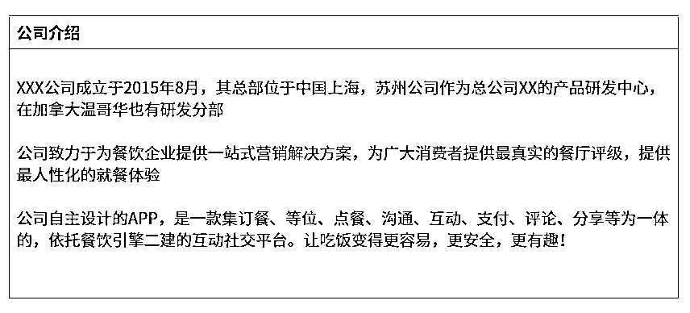
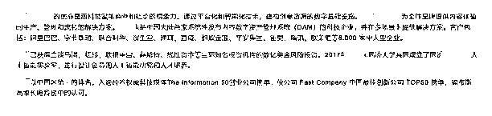
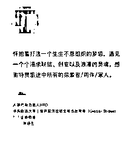
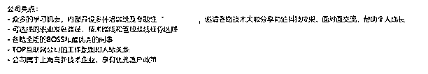
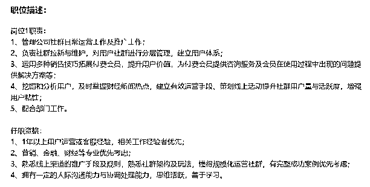
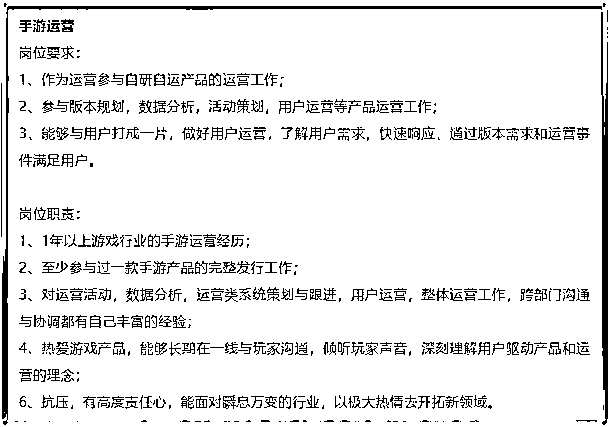
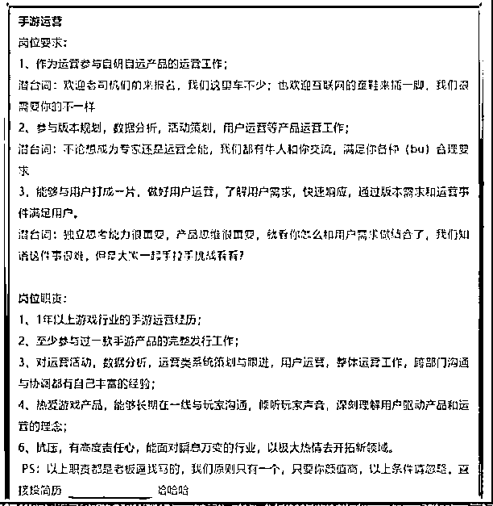

# (精华帖)(135赞)没钱没名气，创业公司怎么找到合格的中层管理人才，并把他们留下来

作者：  鱼丸|亦仁助理

日期：2021-08-30

创业公司老板和主管最头痛的一件事是什么？是没人。

特别是钱少、规模小、没名气的小公司。

本期「轻享」，咱们就来聊聊这个话题：

怎样找到和公司业务匹配且靠谱的中层管理人才，并把他们留下来？

今天的分享嘉宾@忆菁  老师的观点是：

“不否认专业的事情给专业的人干，但是不要把应该是合伙人级别干的事情给到中层去干，这个才是找中层人中最容易忽视的一个 bug 。把自己不擅长的都找外部的人落地，自己反而变成了局外人。”

忆菁老师，目前是有瞰学社联合创始人。在过去的职业生涯中，她曾经经历过 3 家创业公司（  公司阶段分别经历过从天使轮到 B+ 轮，团队人数从 20 人到 300 人）  ，且是 1 家公司的创始团队成员， 2 家公司的核心管理成员。

从她的分享中，你能看到不少创业公司在寻找以及培养中层中犯的错误，也能借鉴到不少经验。

 

 

目录

一、创业公司为何难以寻觅管理人才

1\. 资金少、规模小、无名气

2\. 业务不清晰

3\. 创始人不自知自己的喜好和优势

二. 创业公司如何扭转乾坤

1\. 如何应对「不知名」短板

2\. 如何应对「业务不清晰」短板

3\. 如何提高人岗匹配精准度

三. 如何把精英留存下来

1\. 给到的目标要清晰和明确

2\. 目标最好分阶段，先取得小成功，再汇集成大成功

3\. 建立信任

---正文--

大家好，我是忆菁，结合今年个人的创业经历，我发现，在创业公司中，招到一个靠谱的、能打仗、能扛收入的业务负责人是极其艰难的一件事，而这些人就是公司内的中坚力量。中坚力量不仅需要和公司的愿景、价值观相符，团队气味相投，还要能够促进团队内人才成长的正循环，这些角色我们俗称中层管理者。

 

 

很多创业公司倾向于扁平化管理，恰恰忽略了中间领导层的发展与培养。在创业公司早期阶段，只要创始人能力强、业务模式比较简单的情况下，带着一些执行的小朋友就可以吭哧吭哧干出来。而当公司发展到一定规模，通常团队规模在 15-20 人以上，就必须要有一些可以负责拿结果的中坚力量了。否则，导致的后果就是——

员工准时上下班，而老板被诸多琐事缠身，累到不行根本没有时间分身乏术思考公司战略层面上的重要事情，公司的规模和收入上不去，发展成为瓶颈，整个公司的发展就会在后续陷入巨大危机。

今天就和各位分享一下在这个问题上的一些看法，我将分别从三个方面展开：

一、创业公司为何难以寻觅管理人才

二、创业者如何提高人岗匹配精准度

三、创业者如何才能把人才留住

一、创业公司为何难以寻觅管理人才

**1. **资金少、规模小、无名气

创业公司在招聘市场上遇到最大的困境就是「创业」两个字。

为什么许多优秀背景的人都渴望进入「大厂」而不是「创业公司」？

 

 

「创业」意味着什么？

公司处于起步阶段，缺乏有力的品牌背书，薪资竞争不过大公司，业务也不算稳定，规范性不强，管理可能相对混乱，加班情况严重……

**2. **业务不清晰

创业公司找不到合适的中层最大的一个原因往往是创始人本身对于对于业务发展方向和梳理不清晰，

1）对业务范围的定义不明确，做不到可量化、可验证；

2）业务执行的部门之间分工混乱不清晰；

3）没有完善的项目管理体系。

举个最典型的例子，公司在起步阶段拍脑袋设想的业务逻辑是 A ，所以找来了一个有 A 经验的人来做，等业务跑了一阵子发现原来的路子不行，要换一种业务逻辑 B ，突然发现原来这个 A 经验的人不能复用 B ，要重新开始探索。而比较多的情况是，期间不仅仅只有 A 和 B ，还有很多 CDEF ...等等，这样一圈下来，要么就是那个当初的人给整懵了，自己走了；要么就是你觉得他不行，让他自己走了...

**3. **创始人不自知自己的喜好和优势

创始人的喜好、气质和调性都会决定一家公司初期的调性和发展方向。创始人也不是完美的人，是人一定有自己的喜好偏恶，而这里的喜好还包括对个人价值观的判断，把自己了解的越透彻，越知道自己的价值取向是什么，才更能知道需要什么样的人。

 

 

举个例子，如果你的价值观是个很崇尚开放平等的人，在团队早期推崇简单直白的沟通方式，但招进来了一个在边界感上特别重的人，需要把职责和权利分的很清晰的才能干活的。  即使这个人的业务能力真的很强，但因为你在公司早期阶段塑造的开放平等已经体现在了团队文化和行为上了，这个人的进入就有点格格不入了。

在业务上你不得不依赖他，但是在为人处事上，你觉得有别扭。久而久之，这个别扭一定也会影响到你和他之间的沟通，以及他和团队之间的沟通。

千万不要以为只要为了公司利益，我可以牺牲我的价值观倾向，喜好偏好，除非你  100% 准备好打算这么做，并且从行为和心理上调整过来，否则还是诚实面对自己。大家都说，创始人是一家公司的天花板，但更重要的是，创始人了解自己的程度决定着这家公司可以走多远。

二**. **创业公司如何扭转乾坤

在第一章节，我简单帮助大家梳理了一些创业公司常见的招聘管理人才的劣势，那么这一章节，我会根据开头提到的三点劣势，展开谈谈相应的对策和方法。

**1. **如何应对「不知名」短板

对于创始人来说，如何充分挖掘公司的优势是一个需要认真去思考的事情。

在早期，创始人一定是公司优势的最大招牌，你的思想见识、专业、性格喜好等等都会吸引一批和你志趣相投的人进来。但也千万不要以为创始人的个人魅力这件事会很靠谱。

 

 

即便你是个 IP 或者行业知名人士，也顶多在招聘前期取得一些优势：人才的流量池会多一些，来面试的人的综合素质可能会高一些而已。但是，如果创始人本身并不清楚所在的公司和业务有什么优势的话，人就算来了，也会立即流失。

**1**）用「用户思维」招聘人才

找合适的人其实和做产品的思路很像，都需要有用户思维。

首先，我们需要重视一切和招聘有关的对外包装，包括公司介绍，岗位 JD 等，你可以将它理解为这就是公司的一张对外展示名片，具有广告效应，广告打得好，用户自然愿意来。

公司介绍是应聘人员对公司了解的第一印象，如果我们把招人也看做是「销售公司职位」的话，那么多数人在写文字描述的时候其实都存在一种「卖货思维」，什么是卖货思维呢？李叫兽曾经讲过一个比较经典的卖货思维流程，我总结下，基本如下：

a. 我要卖这个产品  （我要把这个职位销售出去）

b. 这个产品卖给我设想的目标用户  （职位的目标用户是有 3 年以上经验的新媒体运营）c. 这个产品给你带来好处  （我的这个岗位很棒的，你来吧！）

乍一看好像是没什么问题是吧？但是这个逻辑漏了一个最重要的前提，就是，假设用户天然都会注意到你的产品的。但是现实生活中，你是谁？凭什么在茫茫人海中别人会注意到你？

所以这里我们就不得不提到上文一个最重要的思维方式：用户思维。

 

 

什么是用户思维呢？简单来说，假设我们用户是不会看你产品的，用户是会忽略你的产品的。以这个前提来说，套用到招人，我们也要假设用户不会为了公司而来的。

那么我们怎么做才能让用户注意到我们？

大家在写介绍时候，可以问自己一些问题：

求职者在选择公司时，最想了解的公司的基本信息是什么？

我写的公司信息和职位描述符合我脑海里想要招到的人的特质吗**?**

求职者在同类行业**/**同类职位比较时，我的信息是不是最能让人记住的？

把自己带入应聘者的角色，问问自己：公司那么多，一个有潜力有能力的年轻人为什么要来我的公司？我能赋能 TA 哪些地方？按照这个思路，把有可能的一些优势可以罗列出来，例如：

a. 创始人（创始团队）资历深、业务背景强 —— 中层可以跟着你，学习到重要的技能，开阔眼界

b. 公司资源多、业务发展迅速、空间大 —— 中层在公司有比较大的话语权，可以独立操盘项目，在高速发展下可以拿到自己的作品和业绩

c. 公司提供符合个人能力的薪资报酬 —— 创业公司底薪也许不高，但是绩效空间比较大，只要项目有结果，年包一般都不低于XX

d. 团队氛围开放 —— 项目的成功不会只靠一个人，团队内部小伙伴执行力靠谱，带着一起干有憧憬

......

**2**）公司招聘案例对比

 

 

接下来我会挑选一些实际招聘 JD 来给各位对比进行不同维度的分析，以下为部分摘录。

公司介绍反面案例一：

这个公司的介绍看完之后，相信可能你会完全摸不着头脑（创始人背景还是某知名大公司跳槽出来创业的），既没有说具体的主营业务，也没有任何公司有效的信息。

公司介绍反面案例二：

这里虽然有提到公司情况，产品情况，但是描述平平，毫无亮点，试问这种介绍放在招聘平台，被忽视是不是也挺正常的？

公司介绍 正面案例一：

 

 

   

对比三个正反案例，我们不妨去思考一下当求职者在不了解公司的情况下，他们最想知道的信息有哪些？

正面案例中，该公司的介绍提供了一个基本的思路：

**a. **公司做什么产品或服务？如何让人觉得看上去很牛逼并且有信任感？

为企业提供数据基础设施和内容生产（我们的产品和服务是什么）

知名投资机构投资（淡马锡、红杉资本、软银等）

自由**/**国际化的工作范围（入选硅谷排名，硅谷范儿）

已经有很多公司选择我们（阿里、字节、联合利华、资生堂等全球** 500 **强或国内一线企业）

 

 

**b. **我们的团队是怎么样的？如何让人觉得想加入？

我们的团队来自于各种牛逼学校和牛逼公司，优秀的人总是会和优秀的人在一起的。

**c. **我们的优势在哪里？如何让人觉得有吸引力？

内部专业培训，大牛交流大会（求知若渴的好学者快来啊）

落户政策优先（和其他国内公司相比这点有优势）

团队氛围良好，专业向和管理向的发展都有

我们看完该公司介绍的时候，是不是在脑海里已经大概有了公司的工作氛围和场景，也大概知道了要成为公司的团队成员大概需要具备什么特质了呢？而该公司在描述介绍清楚自己的情况后，又通过一些靠谱的背书来增加求职者对公司的信任感，例如知名投资机构，例如团队成员背景等，增强说服力。

因此，各位创业者在招聘前期，千万不要小看招聘时的 JD 描述文案，如有必要，建议自己去把控这部分的描述和撰写。

除了公司描述的案例，我再给各位对比分析岗位描述 JD 。岗位描述同样是非常重要的包装环节。下面，我会以运营这个常见职位举例；

岗位描述反面案例一：

 

 

相信类似这样的运营 JD 你看过很多，但是如果我告诉你它是出自于某家以「创新」为特色的公司，是不是有点违和感? 对于拥有创新精神的人而言，看到这份内容似乎跟「创新」毫无太多瓜葛的 JD ，怎么能指望被你说服来投简历呢？

岗位描述正面案例一：

我所在的前司是一个做小众手游的创业公司，当时想找一个在游戏运营上有少许经验但又具备一些创新思维的人，特别欢迎互联网行业的童鞋来加入。当时给到我的岗位的  JD 如下：

 

 

对于游戏公司手游运营来说， JD 的基本思路还是很清楚的，能明白岗位和职责。但关键的点是在于，你想找一个具有创新思维，有热情去探索新领域的游戏运营，但在这个 JD 上没有体现出来，你能期待跨行业的童鞋会被你打动吗？

随后我自己针对这份进行修改，修改后的 JD 如下（不改基本 JD ，红色字体是我做的补充）：

 

 

当潜在应聘者看到这个职位 JD ，并因此投简历来应聘的时候，潜意识会认为该公司可能会是一个价值观和文化相对开放且员工有趣、调皮且好玩的公司。进一步来说，公司应该从各个方面考察应聘者和公司价值和文化的契合度。

此外，在面试过程中，你的行为和状态也都需要符合公司和岗位宣传的风格。比如，你宣传的公司风格是开放型的，那么当面试者你和沟通或者看到公司其他团队成员的时候，状态也应该是开放的。这个开放不意味着你和面试者沟通的问题不犀利不直接，而是在和面试者的沟通状态中用一种什么样的心态去面对应聘者，给予应聘者多大的尊重和回应等。

 

 

其实招人这件事儿和谈恋爱一样，你花了多少精力去琢磨，就有多大的把握追到你喜欢的人。

**2. **如何应对「业务不清晰」短板

前文提到创始人想不明白自己的业务逻辑，一天一个方向拍脑袋的调整，包括业务部门之间的职责混乱，业务线交叉，业务流程不清晰等等，总之无论是哪种情况，对于公司付出的时间和金钱成本都是巨大的。

创业公司中早期又避免不了业务会变动的情况，那么如何减少因为这些原因带来的人员流失呢？

**1**）创业公司的目标可以调整，但是阶段性目的要清晰

公司的业务模式是什么首先要清晰，公司靠什么挣钱，获客渠道是什么，产品是什么，这些问题作为老板都需要心里有谱。

其次，阶段性的目的一定要清晰，比如在前期我们是要扩大规模做流量，还是一开始就奔着做做利润的目的来？只有目的确定了，你在落实给员工的策略才不会变形。

在目的清晰的情况下，即使之后因为实际情况，需要调整目标——

比如，从 100W 的营收目标调整成 200W ，或者原来通过微信生态做增长，现在调整到在抖音生态上做增长。

 

 

这么做背后的目的是不变的，因为公司在这个阶段要追求的是快速增长，那么所有的目标制定和方法都是围绕目的来的。

**2**）把应该是创始团队（合伙人）干的活儿扔给中层

我一直有个观点，创始团队在公司中最大的作用在于两点。

第一，在公司遇到困难的时候是最后坚守的人。

第二，当有重要且不确定（不清晰）业务的时候，创始团队首选应该担起责任往前冲。

第一点比较好理解，我重点说说第二点。

当公司有个探索型新业务要做的时候，很多人会认为应该找个过去有类似经验的人去做。但其实，这会带来很多弊端，最大的问题是你不知道如何衡量** TA **工作的好坏。** **这个业务你没干过也不了解，你的判断最多基于大逻辑，而不了解基于公司内部实际业务和资源的情况，这样做出来的决策往往方向会有偏差。

此外，如果业务中间出现问题，双方的信任基础还没有那么坚固的时候，在短时内拿不到结果很容易会造成业务信心的缺失，导致后面很多结果的偏移。

因此，在创业公司里，如果有一个偏探索性又很重要的项目，是必须由创始人或者创始团队成员冲到一线去打仗的，拿到**0-1**的结果；如果涉及到标准化或者规模化，那么可以再请强有力的中层负责人来落地。

 

 

我不否认，作为公司的创始人首先第一要素应该是拿钱看方向，也不否认专业的事情给专业的人干这样的信条，但是这些都是有前提的 —— 不要把应该是合伙人级别干的事情给到中层去干，这个才是找中层人中最容易忽视的一个 bug 。把自己不擅长的都找外部的人落地，自己反而变成了局外人。

如果自身业务相对清晰，对团队和组织也有一定认知。那么，无法很好的识别人才的特质和岗位匹配度，也就是我们常说的人岗不匹配这个问题是一个最常见不过的问题。如何去识别对的人呢？

**3. **如何提高人岗匹配精准度

**1**）见到的「 精兵 」样本数低

创业者的识人能力存在问题的原因之一，往往在于老板们见过的「优秀的人」太少，从而导致在见到一个人时，他们很难快速判断这个人到底处于什么样的水平，以及是否真的是自己所需要的。

这跟「你要见过高手是什么样子的，才能知道自己做到好是怎么样」是一个道理。所以，在前期一定要多见人多积累经验。

**2**）招人标准不清晰

事实上，老板往往对自己要什么样的人不清晰，其根因在于找人的标准出现了问题。

 

 

因为创业公司大多在中早期的业务模式不算清晰，所以在找人方面不能按照成熟公司的标准来。其中最大的区别是，不能只看这个人的能力和经验，而应该更看重特质和态度。

特质：

这是一个人底层轻易不会变的东西，是一个人的属性和性格，开放、自信、热情、沉稳**...**这些都是一个人的特质。这些特质会一定程度上决定有些人在适合哪种公司、哪种类型的业务或岗位。

特质对应的往往就是对这份工作的底层驱动力。

一个积极向上的人，即使交给他一个新领域的业务，他会想法设法帮你搞出结果来，但如果一个人特质是比较消极、偏懒惰的，那么一定不适合在类似需要快速发展、快速试错的初创公司呆着。

态度：

这是能决定一个人干成事的最大因素。如果真的想干这件事情，态度端正，执行力更强，你会用 360 个方法来完成最后的目标。

之前我在生财平台上发过一个分享，里面简单说了下在考察一个候选人特质的时候可以考量的几个问题，详见  https://t.zsxq.com/fUfM766  。我在这里再简单总结下在面试中可以考量候选人特质的一些问题。

示例问题一：你为什么想来这个行业（岗位）

考验目的：考量候选人对职业的底层驱动力

 

 

这个问题的本质是考验候选人对行业和岗位的热情，面试者可以借此考量候选人的底层驱动力。

一般来说，驱动力比较强的候选者会很直接表达选行业或岗位的理由，有钱的部分、有成长空间的部分、有视野的部分等等。

如果说的比较具体，有明确的理由或者事例，说明候选人是有认真想过的；反之，如果说的比较模糊，那很有可能是属于找工作凑数的。

问题二：你知道这个行业（岗位）其实没有你想的那么好，它有**XXXX**（这里可以说下这个行业不那么好的方面，比如经常加班、需要经常出差、回报率有风险、好的出发点不一定有好的结果....）

考验目的：在负面信息下候选人的接受程度和抗压能力

问的时候可以观察下候选人的反应：当一件事情没有他想的那么美好的时候，他的自然反应是什么，是能接受，还是已经想到过准备好了要付出一些代价，还是明显觉得好像有点犹疑。

问题三：针对简历的项目经历，问清楚达成目标的关键节点和策略，以及背后的思考过程

考验目的：验证过去的项目是不是亲自做过或带过，而不是看着别人做的

如果一个人的项目成果是自己做的，那么他一定会对过程了解的非常具体，对结果背后的策略和思考都心中有谱。即使他是管理者，也应该对关键过程了如指掌，否则也就是个冠名管理。

 

 

如果回答的相对模糊，那么很有可能他只是看着做，而不是亲自做。如果这个时候，你要的是一个可以深入业务把事干出来的人，那很有可能就会踩坑。

曾经在前司我招过这么一个同事，公司新业务线开启不久，势头发展的很不错，急需一个迅速能把事情落地并且大规模发展的人。  当时我手上有 2 个还不错的候选人， 1 个是有过 7 年经验带过几十人团队的老兵， 1 个是刚工作 2 年但是很有冲劲的年轻人，在选择上有点犹豫不决。

在面试表现中，我发现那个工作 2 年的年轻人虽然没有非常多的经验，但是把事情做成的欲望很强烈。而且他也很直接的表明，在最近的 2 年中，就想通过拼工作来赚钱。那个 7 年的伙伴在经验上确实比较足，表达也比较有逻辑有条理，但从谈话中，我发现他目前对于做事情「成功」的渴望并没有那么强，在这个阶段也更愿意追求平衡的生活。

权衡之下，我选择了那个 2 年工作经验的年轻人。而事实上，那个年轻人来了之后超出了我对他的预期，在 3 个月的时间内，就把那条业务线的业绩扩大了 3 倍，薪资翻了倍，成为当时公司内部最年轻的业务负责人。

能力和经验可后天培养，特质和态度往往是决定一个人成功还是失败的关键因素。

最后，在选人方面，我一直有个原则：筛选比培养重要。俗话说，上梁不正下梁歪，如果地盘不对，那再怎么拔都很难有成果。

三**. **如何把精英留存下来

 

 

假设你筛选了一个好的中层苗子，怎么把它能留在公司稳定先干个 6 个月是关键，一般来说，一个人在公司能留半年，那TA基本已渡过了「危险期」，可以至少奔着年留存来看了。

能把对的人留下来的关键在于两点——

第一，帮助** TA **在短时内取得成功；

第二，考察** TA **的价值观和公司和团队的融入程度。

先来聊聊支持 TA 取得成功这件事。

**1. **给到的目标要清晰和明确

通常，公司内部定目标常见工具有 KPI 和 OKR 两种，这里分享下我常用的逻辑。

如果是营销、运营、销售向的岗位，本身就是用「数据」来衡量工作结果的，建议直接用 KPI 的逻辑，定结果指标。

如果是偏向「产品」向岗位，或者需要有时间探索的项目，「数据」无法马上衡量的，可以用 OKR 的逻辑——

O 代表的是目标（公司要什么、业务目标是什么）， KR 实际上是达成目标的策略，到底走哪条路径才能拿到公司所要的目标。

 

 

本质上，我并不觉得 KPI 和 OKR 哪个好哪个不好，根据公司阶段、公司文化、公司业务不同可以挑选不同的适合的目标管理工具。

但是，应用 OKR 工具中，我也经历过不少用死的例子。比如，一些创业小公司，为了鼓励开放而开放，不定具体的业务指标，转而用 OKR 的工具来代替，结果发现半年过去，业务什么结果都没做出来，团队内部也觉得目标混乱，没有方向。

OKR 如果要推动成功，它的底层逻辑是，团队的人才是有自驱能力的。

从原来的强管控的模式转换为相信员工的自驱力，让员工敢于用更具创新的手段挑战更高的目标，并且组织内部不断赋能员工。但如果业务本身是个简单业务，创始人和团队内部又对这件事上患得患失，不创造一个赋能的氛围，那么结果惨烈也是可预见的。

**2. **目标最好分阶段，先取得小成功，再汇集成大成功

举个例子，假设公司在某个业务线的年目标 GMV 是 1000 万，你可以按照季度或者月度的目标进行分解，比如第一季度假设是 200 万，那么就以这个小目标为先，先带领大家达成。

或者团队中有几个硬核的问题需要解，比如招聘，比如团队管理，比如业务关键指标等。先完成公司需要自己又擅长的，在前期团队中树立一可以拿到结果的榜样。

这样做的目的也很简单，给新人建立信心，也给团队建立对这个人的信心。有一句话说的好，取得胜利是可以掩盖一切公司问题最好的武器，拿不到结果的团队才会在内部心生情绪。

 

 

接着，说说价值观融入的部分。在价值观融入上，做好的观察方式就是带着团队把事情干成功过程中的行为表现。比如，是不是自己可以冲到一线，以身作则来拿结果，还是只说不练，抓细节不抓关键问题的指挥官等等

**3. **建立信任

我们常说事在人为，人是环境的动物。要建立一个信任的环境和团队是，个人和个人之间的信任也极其重要。

让我印象深刻的是，有次跟一个知名组织人力顾问吃饭，她从业 20 年，曾经是个知名猎头和人力咨询公司顾问，后来自立门户，帮助创业公司做人力资源顾问，过去 10 年里帮各大公司招聘过数千名高管。

她和我说，她发现，和这些创业公司建立最好的信任关系就是在一个创始人**&CEO**最低谷的时候，陪伴** TA **一起走过。因此，她决定花一定时间去做早期公司的咨询和陪跑，并且一开始只收很低的费用。然后，过去 7-8 年里，她就这样选择了上百家公司，其中陪着一家公司一路从天使轮走到 IPO ，也陪着两家公司从 0 开始变成了独角兽。由此，她的知名度也随着这些经历被进一步打开。

切换成创始人和中层管理者的关系其实也是类似，在企业业务最不稳定最具挑战的时候进入的人才，是企业内部非常宝贵的资产。

而作为老板，有多少人在招募人才的时候是抱着，先招进来，不行再换的心态来做这件事的呢？试问这样的心态，如何有耐心去听这个人给你的反馈、你又如何去关心这个人所发生的事情呢？

识人和培养人是一个创业者必修的心法，与大家共勉。

 

 

我是忆菁，一个职业教育赛道的创业者，希望我的个人经历分享能带给你们一些启发。

如果你对于职业教育、增长运营、创业等话题有任何疑问，也欢迎大家和我做进一步的交流。

P.S. 如果你也想在生财有术专栏分享你的经验和认知，请点击链接

http://form.shengcaiyoushu.com/f/HA1G1g  填写表单，我们会陆续邀请有赚钱相关经验和案例的嘉宾做分享。如已填写表单请忽略。

评论区：

鱼丸|亦仁助理 : 感谢  老师的分享，大家如果有什么问题。可以在评论区留言~ 有霸夫 : 小团队确实会遭遇到这些困境，创业维艰，如履薄冰。

亦仁 : 非常好的分享，有启发。

我最近也在反思，团队人增加了，产出却下降了，核心还是没有把最重要的事情想清楚，不够聚焦。

而在没有想清楚最重要的事情之前的招聘，效率并不高，甚至会变形的因人设岗，实际上完全没必要。

电饭煲 : 正好遇到招聘的问题，感谢老师分享

白一喵 : 忆菁棒棒哒～～～

忆菁 : 谢谢小白哈哈

忆菁 : 谢谢亦仁[胜利]

嘉庚学长 : 写的真好，粉了粉了

 

 
