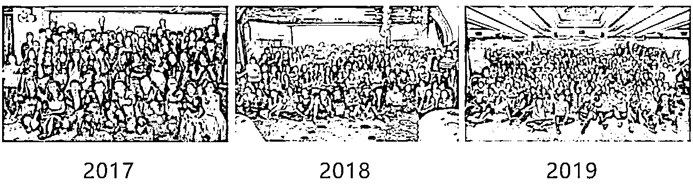
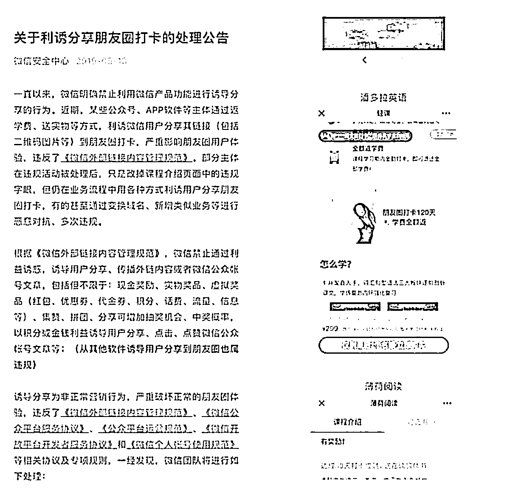
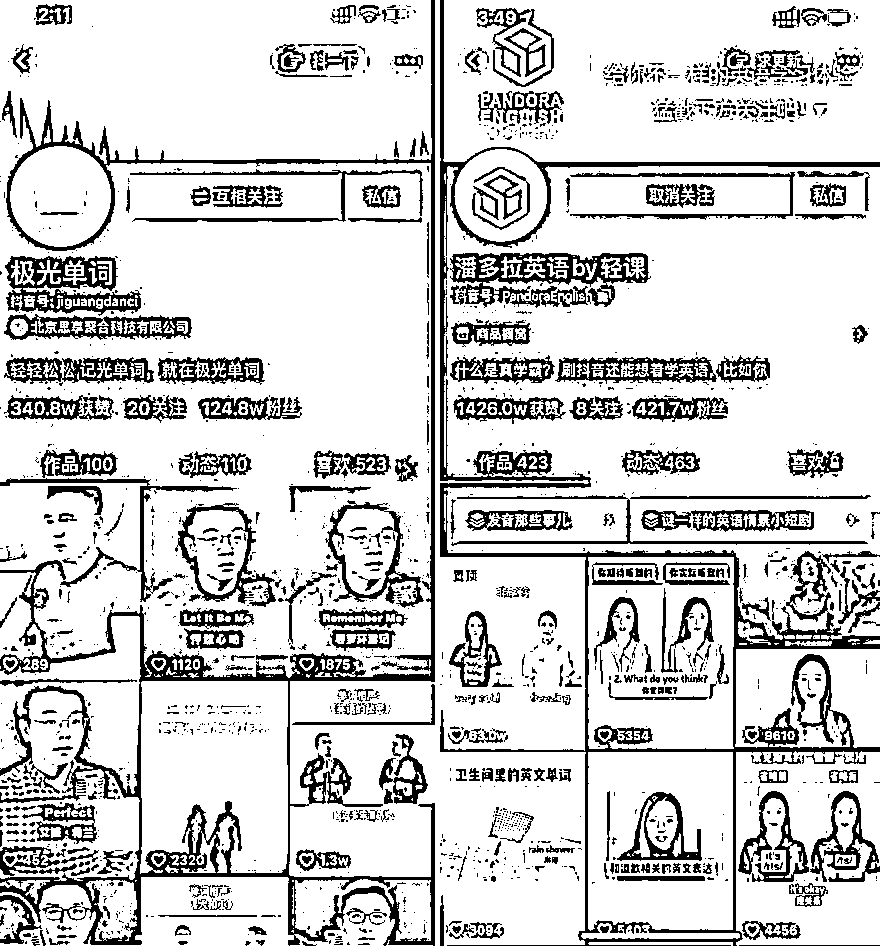

# (精华帖)(277 赞)年收入 3-5 亿的公司 CEO 分享，自己花 5000 万踩的 7 个坑

作者：  鱼丸|亦仁助理

日期：2020-12-16

大家非常棒，199 赞达成，成功解锁今天的

今天我们邀请到的  是  ，他是星辰教育的 CEO，目前公司有 300 多人，年收入 3-5 亿，他将来和我们聊一聊自己花 5000 万踩的 7 个坑。

**一起欢迎  开始他今天的分享🎉🎉🎉。**

大家好，我是肖逸群，星辰教育 CEO，原品牌名叫轻课。趣课多、极光单词、潘多拉英语、清新冥想，都是我们旗下的产品。主要针对的是成人的英语和兴趣类学习需求，推出英语、读书、冥想、表达、配音、理财等课程和训练营。

很荣幸被亦仁大大邀请，来分享自己的创业复盘。在生财有术潜水已经有半年时间，非常佩服亦仁，能够把生财有术的社区氛围做的那么好。不管是看生财的精华帖，还是参加杭州见面会，都学到很多，也认识了很多志同道合的小伙伴。

跟生财有术的很多小伙伴一样，我是一名连续创业者，这是我第 11 次创业。现在公司有 300 多人，北京和西安都有我们的据点，年收入在 5-10 个亿。

我的起点，应该比很多人要低，属于草根中的草根创业，既没有互联网公司背景，又没有光鲜的履历。我是从体制内辞职后，直接开始本次创业的，还记得那会儿刚创业的时候，我连互联网公司产品、运营的区别是什么，都搞不清楚。为了快速补齐自己的能力，只能每天跟各种牛人聊天学习，以及花钱买课，调研竞品。

没想到到现在，一做就是 5 年，从思享空间、轻课、到星辰教育。现在公司几百人，很幸运，还活着。

从 2015 年到现在，我经历了几乎所有的微信红利：

 

 

2015 年，最开始的微信群讲座，我做了思享空间，半年做了 40 万公众号粉丝，拿到第一笔投资；

后来我写了人生中第一篇 10 万＋，刷爆了公众号小编的朋友圈，但只涨了几千个粉丝，还不如一场活动涨的多。于是我和团队开始琢磨裂变涨粉；

2016 年，服务号参数二维码裂变，我和团队做了一百万粉丝，公司现金流平衡；

2017 年，微信群裂变，我们做了几百万微信粉丝，几万个微信群的私域流量；

2018 年，开始的打卡裂变，我们公司做了几千万的微信粉丝，加上产品也还不错，内容团队很用心，挣了几个亿。

这一波波微信红利，我们不是受益最大的，但每一波我们都踩中了。

然而，好景不长。

2019 年，我们和其他头部公司被微信点名，整个裂变模式被微信封杀。

还记得封杀那天晚上，我们几个核心操盘手一起喝酒到深夜。表面上还轻描淡写装作无所谓，但内心实在无法接受。

生财有很多圈友应该都是中小公司老板，依附于一个生态来生存。我们也一样，依附微信生态。相信很多人都经历过，公司整体业务，被平台一个政策打下去，让公司陷入困境吧。

我们被封杀后，公司开始阵痛。

所幸过去几年攒了不少私域流量，在公众号、个人号、微信群，盘子足够大，虽然停止了增长，但依然可以让我们不断探索第二曲线，找到公司新的增长点。

搞啥？

在被封杀后面的几周，我和公司几个合伙人，分别赶到深圳、广州、杭州、上海、长沙等不同城市找人诉苦找出路，看看有啥可以搞的。

创始人还是要开放，千万别有啥不错的东西都自己捂着，多交流多分享，给自己攒人品。

还好平时各种微信交流的朋友多，见了一圈，几十个同行和兄弟公司，同行哀嚎，兄弟公司同情也纷纷献言建策，最后我们选定了这两个方向：

 

 

大班直播、短视频。

对大多数公司来说，获客是永恒的需求和痛点。这两个方向，我觉得还是蛮有代表性的，一个方向是花钱买量，另外一个方向是做内容来获得流量。应该也代表了现在主流的两种获客方式。

但探索新业务是有成本的。在公司原有现金流业务遭到毁灭性打击后，其实不外乎就是等死（不探索新业务），或者找死（花钱探索新业务）。所幸，我和合伙人的选择都出奇的一致：找死。

原地等死，苟延残喘，可以让我们多活一些时间，但未来还是免不了一定会挂。

与其这样，不如利用手里的牌和团队，探索一线生机。

但新业务真的真的真的不是那么好做的。多少公司想做新业务，最后都加速了自己的死亡。先说说结局，两块业务一共交了 5000 万的学费，一个目前算成功了，今年回了些钱，另外一个还在烧钱探索中。

所以，如果大家觉得内容不错，欢迎留言告诉我，我也会在未来，持续把业务探索的经验复盘，与各位生财的各位圈友分享。

第一部分先讲讲，交了 4000 万的学费，我们在大班直播投放模式，碰到的 4 个坑如果你正在做投放，希望这个可以帮你闭坑。如果你想做但还没做，建议认真思考这些风险你能不能承受。

我们尝试的“大班直播+投放”模式，是目前在线教育的主流模式。但...这个模式是真烧钱。

大班直播第一大坑：启动成本巨高无比

首先是产品、技术、运营团队的搭建。这块一搞就是几个月，砸下去几百万，后续不断迭代优化，以及包括云服务器、直播技术服务商，长期下来一年就得千万的成本。

你可能会想，能不能不做 App 来直播？

也可以，但是一定做不大。我们是同时做了 App、微信 H5，以及电脑端，才算是具备了入场的资格。如果你用第三方，很难适配所有的需求，而当你量级大了之后，技术这块支持的不够全面，会让你的投放效率大大下降，损失会更大。

大班直播在产品技术的入场券，一年就是千万起。

 

 

大班直播第二大坑：测试成本高昂

课程直播平台搭建好，才刚刚开始。因为你需要找顶级名师来打磨教研和产品。

简单说来，就是跟一个名师谈合作做课，签下合同。名师来主导教研和直播授课，我们辅助教研和后续的运营。跟名师按照分成来走，一般行业里头都有标准模板。

这个模式对老师要求高，我总结过，需要 3 个能力：1\. 专业知识能力 2\. 直播授课能力 3\. 课程销售能力。每个能力可能都需要是 Top3%才可以，三个能力都具备的话，满足条件的老师可谓是万里挑一。

我们前期谈了 N 多老师，每个老师的合作，都要投入几百万。你可能在想：为啥要几百万？

很简单，跟一个老师谈了之后，我们都需要花 3 个月左右来不断跑模型。第一轮测试，第二轮测试，第三轮测试…前端的信息流素材要测，人群定向要测，老师的试听课要测，群里的 SOP 话术要测，后续的运营服务也要测。

如果你投放后，学员交的学费，能够支撑你的大班投放费用、老师课酬、物料成本、税费、技术服务费、后续教研服务费、以及其他综合成本等等各项成本开支，还能有结余，那么这个模型就跑通，商业模式成立。每一轮测试下来，老师基本稳赚，但平台都要投入几万十几万推广费来跑。

对的，商业世界就是这么残酷。

做一个测试，推广费就要十几万。3 个月测 6 轮，就要上百万。还不包括其中的人力费用、技术费用、课程的后续物料、服务成本等等，光推广就要上百万。

大部分跟我们合作的老师，合作前都自信满满，但开始跑了之后，转化真是惨不忍睹。

有些老师投放个 10 万，可能就成一两单。有些老师跑了 4-5 轮，团队身心俱疲，砸了上百万，可能最后推广费和报名费勉强持平，ROI 在 1，再也上不去了，最后项目还是不得不关停。

做大班直播，不砸个几千万，测试个 10 个 20 个老师，大概率是跑不出来的。而这 10-20 个老师，本身就是在各自领域有一定分量、一定影响力的名师，个个都很牛，自己收入也不低，谈成合作很不容易，合作后砸钱测试更烧钱。

大班直播第三大坑：名师难以控制

最最坑的是。

 

 

好不容易跑出来一个老师，我们辛辛苦苦把模型搭建好，跑完之后 ROI 非常不错，到 4 了，也就是投放 1 万的广告费，能够回 4 万的学费，能够挣钱，团队负责人终于露出了笑容的同时…

老师自己单干了...

这个也怪我们，协议没签好，老师没有违约责任。所以老师轻描淡写的说了句，过了这个月，我就不再和你们开课了。你们很优秀，继续加油努力吧。

自己签协议，没招，含着泪也要挤出微笑。

转身我就给团队加了个死规定，跟所有老师的协议，都要加上违约责任，而且我要亲自审批，千万不要在这种问题上考验人性，因为人性经不起考验。

改好了协议，我们继续谈老师继续砸钱测试。好在公司过去几年存量还可以，靠着私域流量，有稳定的变现，来为公司的新项目不断交学费和实验费。

终于，我们跑通了一些不错的老师，同时跟老师也处理好了利益分配，并且设定好了违约责任，双方都按照协议来操作，带着镣铐才能更好的一起跳舞。

本以为可以开始挣钱了，结果没想到只靠大班投放的模型，在量级上去之后，才是坑的开始。

大班直播第四大坑：流量价格极为波动

有些课程 ROI 还不错，能够打平并且还能有利润，我们会不断加大投放量，最后的 ROI 就会在打平的这条线上，甚至微亏，还是挣不到钱。

更坑的是，到了 678 三个月暑期大战的时候，头部 K12 机构，学而思网校、猿辅导、作业帮、字节跳动、跟谁学，这几家都有大钱，拼命的投拼命的买量，几个神仙打架，把小公司都生存空间都搞死了。

最坑的是，信息流投放不分行业，腾讯和字节不断追求的是单位曝光的更高价格，从来不是说，这些量就是给教育行业的公司。

618 双十一双十二的前一个月，电商行业疯狂买量，进一步又拉高了流量成本。

碰到这些更厉害的神仙，你就只能哭晕在厕所。

 

 

就这样，我们公司在信息流投放这块，去年交学费就交了四千万。公域流量可真不是啥好玩的，进去前先看看自己几斤几两，不要看到别的公司搞投放，GMV 高，就也想自己做。

人家神仙们融了几个亿十几个亿的美金在砸，ROI 小于 1 也可以一个月投放大几个亿，赌的是后面的续费，赌的是成为第一进一步在资本市场拿钱，对中小公司来说是降维打击。

不是一个量级的玩法...

不过交了 4000 万的学费，我们算是挺了过来，这个模式今年也给我们带来了回报，如今成为我们公司的重要业务。

说完大班直播，第二部分，再来分享一下短视频的坑

都说现在短视频 MCN，只有 5%的公司能挣钱。我们一开始也是看到几个头部玩家，挣钱整的相当可以，所以入了这个赛道。结果，不出所料，成为了 95%的玩家。

那讲讲我做短视频是如何踩了 3 个大坑，最终亏掉 1100 万。

先说明一点：现在做短视频直播，依然有不少机会，但不少人脑子一热扎进去，却被现实毒打。

能亏得起千万的人不多，对很多人可能是全部的积蓄，甚至成为一辈子的负债，所以，创业一定要想清楚、讲方法，先胜而后战。

一上来就爆粉 1000 万

当时我们确定要做短视频之后，内部快速动员。我号召公司所有部门，所有团队，开始做短视频。用钱砸，用红包砸，做出来爆款我就砸红包。

我们公司几百号人，分了十多个团队，内部赛马，纷纷开始做号。图片:

第一个星期，十多个号就建起来了，还有一两个点赞破万上了热门，大家再一内部分享学习，加上抖音当时做号不那么难，第二周，几乎大部分的号都有点赞破万的爆款视频了。

看见形势大好，我开始在公司物色颜值高的小伙伴，怂恿他们入局短视频。颜值+才华+合适的时机，我们的号很快就爆了。

 

 

还记得当时有个号，一夜涨了 100 多万的粉丝。这个号叫潘多拉英语，当时绑定的是我的手机，出镜的小姐姐也是我们公司的小伙伴。我带着这个号，当天晚上，后台的新增粉丝量一点开就是 99+，然后一点，又是 99+，几秒钟就是 99+。

这涨粉效率...简直了。

我们的累计粉丝量做到了 1000 万，其中还不乏一些头部大号，曾经教育榜第一大蓝 V 账号就是我们家的“潘多拉英语 By 轻课”。

后来我把公司做得好的号和团队一整合，内部搞了个项目组，专门来做短视频的尝试。

小趋势 MCN，就这样成立了。

因为抖音涨粉快，项目做得好，我们团队还经常被媒体、同行采访，还去各种线下讲课，两天一夜收费几万的那种。

可就在形势一片大好时，我们却不断在短视频领域犯错误。到现在复盘，已经累计交了上千万的学费。

总结下来，我们在战略和战术上，犯了不少错，这三个大坑都是血泪教训，大家千万别踩。

短视频第一大坑：粉丝不代表流量

人都有思维定势：我们在微信公众号爆粉，靠内容形成粘性，再接广告变现。想当然，在抖音也就该这么做呗。

于是整个 18 年，我们沉迷内容和增粉，不可自拔。

几十个人的团队，还做起了账号矩阵。拍了一大堆创意极佳、内容过硬、点赞超高的短视频，流量哗哗地来，我们 High 到爆，红包也发到手软不可自拔。

搞了一年多，砸了几百万，该变变现了。怎么变现？还是按照公众号的思路来做，推广告吧。直接卖课。

我们拍了广告，直接推课，引导到微信公众号买课。

然而，没过审，有敏感词。不能引流到微信。

我们琢磨了下，打了个擦边球的做法，达人不说敏感词，通过手持图片来引导，关注公众号。顺利通过。

 

 

第一条广告效果还行，可能当时抖音没发现，300 多万的粉丝，我们一条广告卖了 10 万。

就在我们感觉要发了的时候...过了一星期，我们再用类似的方法再搞了一条。

被限流了，1 单都没卖出去，几百个播放量，惨不忍睹。

再试，再发，还是不行。账号应该被重点关照，甚至在后面的一个月，正常内容的播放量也完全不行。

原来在抖音，粉丝根本不代表流量，所有的流量分配权，都牢牢把握在平台手里。

在这个逻辑下，“粉丝量”根本不代表流量，只是平台对你过去平台贡献的一种“虚拟奖赏”，有面子没有底子。

以至于，很多号为了接广告，只展示点赞量最多的几条爆款视频，其他视频全部隐藏。

因为数据根本没法看

短视频第二大坑：达人利益难绑定

你可能会时不时刷到一些达人控诉 MCN 吸血，为了商业利益 PUA 达人主播的视频，点赞百万。

也可能会刷到 MCN 老板既不熟练表情也不自然的口播，描述自己辛辛苦苦培养出来的达人主播，火了之后自己单飞的血泪史。评论区一堆人或幸灾乐祸，或给予安慰。

谁对谁错？

我们公司有一些主播，前期探索阶段，公司承担所有的主播成本，还附带拍摄、剪辑、投放的成本。

另外，还在不断给主播做心理建设，来让主播尝试做变现，转化，还找牛人来给主播分享应该怎么做才可以变现。

到成功变现的那一刻，主播就开始渐行渐远。

这时，我就频繁听到各种竞品，时不时就有来找主播聊天的。或者听到谁说，某某平台想挖我们公司的主播，出价很高。

甚至主播也会有各种小动作：在其他平台注册自己的账号，然后同步把自己的内容在多个平台分发。如果你跟主播签的不是全约，那么主播一旦发现在其他平台也能火，那么他就离单干不远了。

 

 

双方的关系依旧可以保持一段时间，但对方是个独立的个体，是有自己思想自身诉求的活人。不是双方能不能合作的问题，而是双方合作期是多久的问题。

做得好的主播，火的越快，飞的越快。

这时你会发现，前期所有的投入，最后大概率打水漂...能够在合作期内挽回损失，算幸运的。

在多次事件后，我也深刻反思：问题的根源，还是来自老板自身的盲目自信和一厢情愿。

因为对于一个纯达人 IP 的账号，达人在跟 MCN 的博弈中，核心矛盾还是利益分配问题，这关乎人性，不容考验。而达人在这场博弈中，本质上有一票否决权，而很多 MCN 老板没看清这个现实。

所以我见过，有个国内头部 MCN 老板，每天的工作就是跟自己的头部达人聊天，维系感情。为了吸引其他 MCN 的优质主播，不断把自己签约条件降到最低：一年一签，账号可以带走，不是自己介绍的广告不用分成。

所以我见过，身边有达人自己发达后，踹掉操盘手，自己招人做给固定工资。以至于坊间流传，最好的 MCN 公司架构，就是薇娅模式，主播和操盘手本身就是夫妻，众人还调侃，操盘手可千万别出轨。

小孩子才分对错，成年人只看利益。

后来我们公司基本放弃了批量孵化 IP 这条路。得出这个结论时，我们已经损失了大几百万。

对标另一个行业，娱乐圈，你也会发现，为啥单个的明星纷纷都与经纪人解约，自己成立工作室。经纪公司则不断扶持男团女团，而团体会以经纪公司的名字来命名。

为什么？

都疼怕了

短视频第三大坑：内容无壁垒

有次跟一个 MCN 老板聊天，对方本身也是一个达人大 IP。

他说，做抖音太累了。以前想出一个不错的创作方式，可以重复做好久，涨不少粉丝。

现在只要一个不错的创意或者视频出来，马上就有一堆人模仿...

 

 

我们公司在短视频内容这块有几十个人，但作品的数据表现很不稳定。大部分的时间，都是在焦虑中度过，偶尔几条能爆，心情就跟数据一样，上扬几天，然后就会发现一堆模仿的视频，郁闷的同时，还会立马陷入新一轮的数据焦虑期。

到后面，我们的内容团队，为数据愁的，都快抑郁了...

相信所有的创作者，都有过这种内容焦虑吧。就是把自己能说的、能写的，全部掏了出来之后，发现实在没啥可说的了，而且越做数据越差...

不仅账号难做爆款，账号与账号之间的竞争和同质化，也极其严重。

在抖音，基本所有爆过的账号，不管是大蓝、史卓看视频、回形针等，在火了一段时间后，市场上都会如雨后春笋般，冒出一堆同类账号。

我们 MCN 做了很多矩阵号，但没有在爆发最快的时候做变现。到后面行业涌入了大量人才，市场从红海变成黑海。

算下来，3 年时间，我们一共交了 1100 万学费...

我后来反思，最大的问题，还是作为创始人，没有躬身入局。一方面想的不够深入，另一方面，存在畏难情绪，对业务缺乏真实体感。说到底，还是危机感不够强，没有逼到那个份上。

但，交了千万学费，对我们团队来说，还是有不少学习和成长。

至少，我们打造了一支非常精干的团队，现在的我也自己上手，开始做起了自己的 IP。

这只是一条路。现在做短视频，还有很多其他的路数，头部的顶级 MCN 活得也还可以，而且品牌号、品牌直播也在快速崛起。

可以这么说，短视频依然是现在创业的重要赛道，这个赛道上白骨累累，但也依然充满机遇，就看你自己的实力和打法了。

对我来说，从幕后到台前，克服了很多心理障碍，本质上更是一次新的创业。

交了 5000 万学费，踩了 7 个大坑的经验，都毫无保留跟各位生财的圈友分享了。虽然这次创业一共 5 年，但从 5 年前成立，到现在的数百人体量，公司已经跑了 4 条第二曲线，每次都相当于一次新的创业。

 

 

每次项目失败时，收拾残局时，我都要经历一次至暗时刻，安抚团队、安抚用户，最后再安抚自己。但可能这就是在中国创业的宿命吧，因为这里有太多的机会，太多的玩家，太多的变化，太多的可能性。

当我收拾好心情，看到新的机会时，又会像是第一天一样，充满热情再次出发，开启新的旅程。创业就是不断地修行，不断打怪升级，每次重新出发，你都会变成一个更强的自己。

最后，用一句我们公司的内部 Slogan，与生财有术圈友的小伙伴共勉：顺境居安思危、逆境乘风破浪。一起生财有术。

P.S.：我的个人微信号是 qingclass2363，对教育、连续创业、视频号、大班直播、投放、个人 IP 感兴趣的小伙伴，都可以加我的微信，相互交流。生命不息，生财不止。

 

 

 

 

评论区：

恒一 : 第一个跑通的业务是趣课多么，经常刷到这个广告

破风 : 谢谢大佬分享，很真实很残酷。

阿里阿里 : 感谢分享

《悦哥营销》公众号 : 一边看，耳边仿佛在播放李宇春的《和你一样》[呲牙]建议配着这个音乐看，感谢分享。真实经历永远比道听途说更能打动人

Rudy : 感谢分享[玫瑰][玫瑰][玫瑰]

 

 

伊教练 : 久仰大名

木易 Troy : 久仰大名

修远 : 感谢分享
